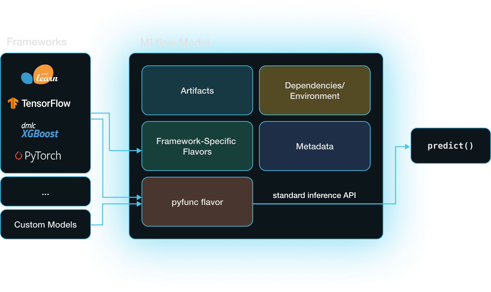
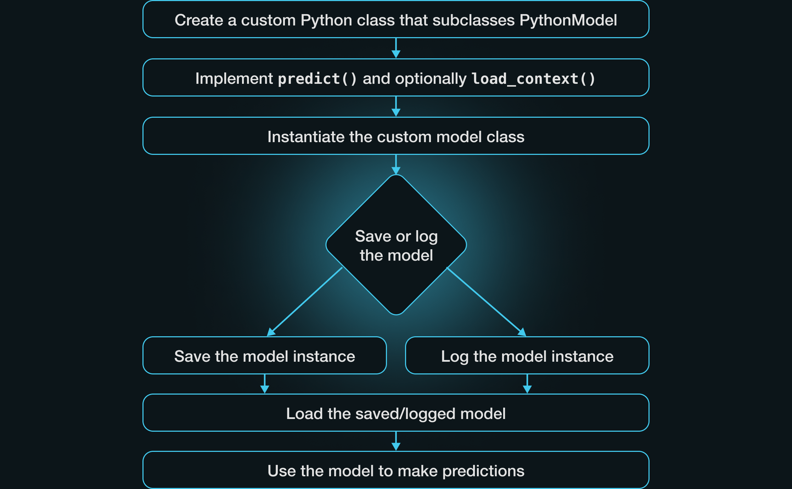
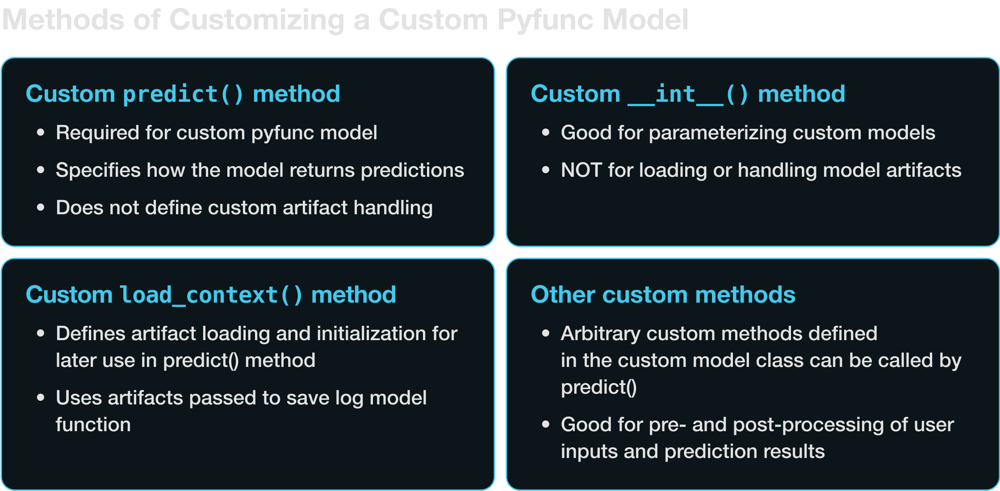

If you're looking to learn about all of the flexibility and customization that is possible within
MLflow's custom models, this blog will help you on your journey in understanding more about how to
leverage this powerful and highly customizable model storage format.

<!-- truncate -->


MLflow offers built-in methods for logging and working with models from many popular machine
learning and generative AI frameworks and model providers, such as scikit-learn, PyTorch,
HuggingFace transformers, and LangChain. For example,
[mlflow.sklearn.log_model](https://mlflow.org/docs/latest/python_api/mlflow.sklearn.html#mlflow.sklearn.log_model)
will log a scikit-learn model as an MLflow artifact without requiring you to define custom methods for
prediction or for handling artifacts.

In some cases, however, you might be working in a framework for which MLflow does not have
built-in methods, or you might want something different than the model’s default prediction
outputs. In those cases, MLflow allows you to create custom models to work with essentially
any framework and to integrate custom logic to existing supported frameworks.

In its simplest form, all that’s required is to define a custom predict method and log the model.
The following example defines a simple pyfunc model that just returns the square of its input:

```python
import mlflow

# Define a custom model
class MyModel(mlflow.pyfunc.PythonModel):
    def predict(self, context, model_input):
        # Directly return the square of the input
        return model_input**2


# Save the model
with mlflow.start_run():
    model_info = mlflow.pyfunc.log_model(
        artifact_path="model",
        python_model=MyModel()
    )

# Load the model
loaded_model = mlflow.pyfunc.load_model(
    model_uri=model_info.model_uri
)

# Predict
loaded_model.predict(2)
```

Let’s dig into how this works, starting with some basic concepts.

## Models and Model Flavors



An MLflow model is a directory that includes everything needed to reproduce a machine learning model
across different environments. Aside from the stored model itself, the most important component
stored is an `MLmodel` YAML file that specifies the model’s supported model flavors.
A [model flavor](https://mlflow.org/docs/latest/traditional-ml/creating-custom-pyfunc/part1-named-flavors.html#components-of-a-model-in-mlflow)
is a set of rules specifying how MLflow can interact with the model (i.e., save it, load it, and
get predictions from it).

When you create a custom model in MLflow, it has the `python_function` or pyfunc model flavor,
which is a kind of “universal translator” across formats in MLflow. When you save a model in MLflow
using a built-in model flavor, e.g. with [mlflow.sklearn.log_model](https://mlflow.org/docs/latest/python_api/mlflow.sklearn.html#mlflow.sklearn.log_model),
that model also has the pyfunc model flavor in addition to its framework-specific flavor.
Having both framework-specific and pyfunc model flavors allows you to use the model via the
framework’s native API (e.g., `scikit-learn`) or via the pyfunc flavor’s framework-agnostic inference API.

Models with the pyfunc flavor are loaded as instances of the [mlflow.pyfunc.PyfuncModel](https://mlflow.org/docs/latest/python_api/mlflow.pyfunc.html?highlight=pyfunc#mlflow.pyfunc.PyFuncModel)
class, which exposes a standardized predict method. This enables straightforward inference through a single
function call, regardless of the underlying model's implementation details.

## Defining Custom MLflow Pyfunc Models

Saving a model from any supported machine learning framework as an MLflow model results in the
creation of a pyfunc model flavor that provides a framework-agnostic interface for managing and
using the model. But what if you’re using a framework without an MLflow integration, or you’re
trying to elicit some custom behavior from a model? [Custom pyfunc models](https://mlflow.org/docs/latest/python_api/mlflow.pyfunc.html#creating-custom-pyfunc-models)
allow you to work with essentially any framework and to integrate custom logic.

To implement a custom pyfunc model, define a new Python class inheriting from the PythonModel class
and implement the necessary methods. Minimally, this will involve implementing a custom predict
method. Next, create an instance of your model and log or save the model. Once you’ve loaded the
saved or logged model, you can use it for predictions.



Let’s work through a few examples, each adding a little more complexity and highlighting different
aspects of defining a custom pyfunc model. We’ll cover four main techniques for implementing custom
behaviors in pyfunc models:

1. Implementing a custom `predict` method
2. Implementing a custom `__init__` method
3. Implementing a custom `load_context` method
4. Implementing user-defined custom methods



### Defining a custom `predict` method

At a minimum, a pyfunc model should specify a custom predict method that defines what happens when
we call `model.predict`. Here’s an example of a custom model that applies a simple linear
transformation to the model inputs, multiplying each input by two and adding three:

```python
import pandas as pd
import mlflow
from mlflow.pyfunc import PythonModel


# Custom PythonModel class
class SimpleLinearModel(PythonModel):
    def predict(self, context, model_input):
        """
        Applies a simple linear transformation
        to the input data. For example, y = 2x + 3.
        """
        # Assuming model_input is a pandas DataFrame with one column
        return pd.DataFrame(2 * model_input + 3)


with mlflow.start_run():
    model_info = mlflow.pyfunc.log_model(
        artifact_path="linear_model",
        python_model=SimpleLinearModel(),
        input_example=pd.DataFrame([10, 20, 30]),
    )
```

Note that you can (and should) also include a [signature](https://mlflow.org/docs/latest/models.html#model-signature)
and an [input example](https://mlflow.org/docs/latest/models.html#model-input-example) when saving/logging a
model. If you pass an input example, the signature will be inferred automatically. The model
signature provides a way for MLflow to enforce correct usage of your model.

Once we’ve defined the model path and saved an instance of the model, we can load the saved model
and use it to generate predictions:

```python
# Now the model can be loaded and used for predictions
loaded_model = mlflow.pyfunc.load_model(model_uri=model_info.model_uri)
model_input = pd.DataFrame([1, 2, 3])  # Example input data
print(loaded_model.predict(model_input))  # Outputs transformed data
```

Which will return:

```text
:    0
: 0  5
: 1  7
: 2  9
```

Note that if a custom `predict` method is all you need—that is, if your model does not have any
artifacts that require special handling—you can save or log the `predict` method directly without
needing to wrap it in a Python class:

```python
import mlflow
import pandas as pd


def predict(model_input):
    """
    Applies a simple linear transformation
    to the input data. For example, y = 2x + 3.
    """
    # Assuming model_input is a pandas DataFrame with one column
    return pd.DataFrame(2 * model_input + 3)


# Pass predict method as python_model argument to save/log model
with mlflow.start_run():
    model_info = mlflow.pyfunc.log_model(
        artifact_path="simple_function",
        python_model=predict,
        input_example=pd.DataFrame([10, 20, 30]),
    )
```

Note that with this approach, we **must include** an input example along with the custom predict
method. We also have to modify the predict method such that it takes only one input (i.e., no self or context).
Running this example and then loading with the same code as the preceding code block will retain the same output as
the example using a class definiton.

### Parameterizing the custom model

Now suppose we want to parameterize the custom linear function model so that it can be used with
different slopes and intercepts. We can define the `__init__` method to set up custom parameters,
as in the following example. Note that the custom model class’s `__init__` method should not be used
to load external resources like data files or pretrained models; these are handled in the
`load_context` method, which we’ll discuss shortly.

```python
import pandas as pd
import mlflow
from mlflow.pyfunc import PythonModel


# Custom PythonModel class
class ParameterizedLinearModel(PythonModel):
    def __init__(self, slope, intercept):
        """
        Initialize the parameters of the model. Note that we are not loading
        any external resources here, just setting up the parameters.
        """
        self.slope = slope
        self.intercept = intercept

    def predict(self, context, model_input):
        """
        Applies a simple linear transformation
        to the input data. For example, y = 2x + 3.
        """
        # Assuming model_input is a pandas DataFrame with one column
        return pd.DataFrame(self.slope * model_input + self.intercept)


linear_model = ParameterizedLinearModel(10, 20)

# Saving the model with mlflow
with mlflow.start_run():
    model_info = mlflow.pyfunc.log_model(
        artifact_path="parameter_model",
        python_model=linear_model,
        input_example=pd.DataFrame([10, 20, 30]),
    )
```

Again, we can load this model and make some predictions:

```python
loaded_model = mlflow.pyfunc.load_model(model_uri=model_info.model_uri)
model_input = pd.DataFrame([1, 2, 3])  # Example input data
print(loaded_model.predict(model_input))  # Outputs transformed data
```

```text
:     0
: 0  30
: 1  40
: 2  50
```

There are many cases where we might want to parameterize a model in this manner. We can define
variables in the `__init__` method to:

- Set model hyperparameters.
- A/B test models with different parameter sets.
- Set user-specific customizations.
- Toggle features.
- Set, e.g., access credentials and endpoints for models that access external APIs.

In some cases, we may want to be able to pass parameters at inference time rather than when we
initialize the model. This can be accomplished with
[model inference params](https://mlflow.org/docs/latest/models.html#model-inference-params). To use
inference params, we must pass a valid model signature including `params`. Here’s how to adapt the
preceding example to use inference params:

```python
import pandas as pd
import mlflow
from mlflow.models import infer_signature
from mlflow.pyfunc import PythonModel


# Custom PythonModel class
class LinearFunctionInferenceParams(PythonModel):
    def predict(self, context, model_input, params):
        """
        Applies a simple linear transformation
        to the input data. For example, y = 2x + 3.
        """
        slope = params["slope"]
        # Assuming model_input is a pandas DataFrame with one column
        return pd.DataFrame(slope * model_input + params["intercept"])


# Set default params
params = {"slope": 2, "intercept": 3}

# Define model signature
signature = infer_signature(model_input=pd.DataFrame([10, 20, 30]), params=params)

# Save the model with mlflow
with mlflow.start_run():
    model_info = mlflow.pyfunc.log_model(
        artifact_path="model_with_params",
        python_model=LinearFunctionInferenceParams(),
        signature=signature,
    )
```

After loading the model as before, you can now pass a `params` argument to the `predict` method,
enabling you to use the same loaded model for different combinations of parameters:

```python
loaded_model = mlflow.pyfunc.load_model(model_uri=model_info.model_uri)

parameterized_predictions = loaded_model.predict(
    pd.DataFrame([10, 20, 30]), params={"slope": 2, "intercept": 10}
)
print(parameterized_predictions)
```

```text
:     0
: 0  30
: 1  50
: 2  70
```

### Loading external resources with `load_context`

Custom models often require external files such as model weights in order to perform inference.
These files, or artifacts, must be handled carefully to avoid unnecessarily loading files into
memory or errors during model serialization. When building custom pyfunc models in MLflow, you can
use the `load_context` method to handle model artifacts correctly.

The `load_context` method receives a `context` object containing artifacts the model can use during
inference. You can specify these artifacts using the `artifacts` argument when saving or logging
models, making them accessible to the `load_context` method via the `context.artifacts` dictionary:

```python
# Log the model using mlflow with the model file as an artifact
with mlflow.start_run():
    model_info = mlflow.pyfunc.log_model(
        artifact_path="my_custom_model",
        python_model=<model>,
        # Specify where artifacts can be found
        artifacts={
            "artifact": <artifact_1_path>,
            "another_artifact": <another_artifact_path>
        },
        [...]
    )
```

In practice, the `load_context` method often initializes the model called by the `predict` method by
handling the loading of model artifacts.

This raises an important question: why do we load artifacts and define the model in the `load_context`
method and not in `__init__` or directly in `predict`? Correct usage of `load_context` is essential
for the maintainability, efficiency, scalability, and portability of MLflow pyfunc models. This is because:

- The `load_context` method is executed once when the model is loaded via `mlflow.pyfunc.load_model`.
  This setup ensures that resource-intensive processes defined within this method, such as loading
  large model files, are not repeated unnecessarily. If artifact loading is done in the predict
  method, it will occur every single time a prediction is made. This is highly inefficient for
  resource-intensive models.
- Saving or logging an MLflow `pyfunc` model involves serializing the Python model class (the subclass
  of [mlflow.pyfunc.PythonModel](https://mlflow.org/docs/latest/python_api/mlflow.pyfunc.html#mlflow.pyfunc.PythonModel)
  you created) and its attributes. Complex ML models are not always compatible with the methods used
  to serialize the Python object, which can lead to errors if they are created as attributes of the Python object.

As an example, suppose we want to load a large language model (LLM) in the `gguf` model format
(a file format designed for storing models for inference) and run it with the
[ctransformers library](https://pypi.org/project/ctransformers). At the time of writing, there is
no built-in model flavor that lets us use `gguf` models for inference, so we’ll create a custom
pyfunc model that loads the required libraries and model files in the `load_context` method.
Specifically, we’re going to load a quantized version of the [AWQ version of the Mistral 7B model](https://huggingface.co/TheBloke/Mistral-7B-v0.1-AWQ).

First, we’ll download the model snapshot using the huggingface hub cli:

```bash
huggingface-cli download TheBloke/Mistral-7B-v0.1-GGUF \
                mistral-7b-v0.1.Q4_K_M.gguf \
                --local-dir /path/to/mistralfiles/ \
                --local-dir-use-symlinks False
```

And then we’ll define our custom `pyfunc` model. Note the addition of the `load_context` method:

```python
import ctransformers
from mlflow.pyfunc import PythonModel


class CTransformersModel(PythonModel):
    def __init__(self, gpu_layers):
        """
        Initialize with GPU layer configuration.
        """
        self.gpu_layers = gpu_layers
        self.model = None

    def load_context(self, context):
        """
        Load the model from the specified artifacts directory.
        """
        model_file_path = context.artifacts["model_file"]

        # Load the model
        self.model = ctransformers.AutoModelForCausalLM.from_pretrained(
            model_path_or_repo_id=model_file_path,
            gpu_layers=self.gpu_layers,
        )

    def predict(self, context, model_input):
        """
        Perform prediction using the loaded model.
        """
        if self.model is None:
            raise ValueError(
                "The model has not been loaded. "
                "Ensure that 'load_context' is properly executed."
            )
        return self.model(model_input)
```

There’s a lot going on here, so let’s break it down. Here are the key points:

- As before, we use the `__init__` method to parameterize the model (in this case, to set the
  `gpu_layers` argument for the model).
- The purpose of the `load_context` method is to load the artifacts required for use in the
  `predict` method. In this case, we need to load the model and its weights.
- You’ll notice that we reference `context.artifacts["model_file"]`. This comes from the artifacts
  argument to `mlflow.pyfunc.save_model` or `mlflow.pyfunc.load_model`, as shown in the following
  code snippet. This is an important part of working with `pyfunc` models. The `predict` and
  `load_context` methods can access the artifacts defined in the artifacts argument to the
  `save_model` or `log_model` method via the `context.artifacts` object. `load_context` is executed
  when the model is loaded via `load_model`; as described earlier, this provides a way to ensure that
  the potentially time-consuming initialization of a model does not occur each time the model is used
  for prediction.

Now we can initialize and save an instance of the model. Note the artifacts argument to the
`save_model` function:

```python
# Create an instance of the model
mistral_model = CTransformersModel(gpu_layers=50)

# Log the model using mlflow with the model file as an artifact
with mlflow.start_run():
    model_info = mlflow.pyfunc.log_model(
        artifact_path="mistral_model",
        python_model=mistral_model,
        artifacts={"model_file": model_file_path},
        pip_requirements=[
            "ctransformers==0.2.27",
        ],
    )

# Load the saved model
loaded_model = mlflow.pyfunc.load_model(model_info.model_uri)

# Make a prediction with the model
loaded_model.predict("Question: What is the MLflow Pyfunc model flavor?")
```

To recap: correct use of the `load_context` method helps to ensure efficient handling of model
artifacts and prevents errors in serialization that could result from attempting to define artifacts
as model attributes.

### Defining custom methods

You can define your own methods in the custom `pyfunc` model to handle tasks like preprocessing
inputs or post-processing outputs. These custom methods can then be called by the predict method.
Keep in mind that these custom methods, just like `__init__` and `predict`, should **not be used** for
loading artifacts. Loading artifacts is the exclusive role of the `load_context` method.

For example, we can modify the `CTransformersModel` to incorporate some prompt formatting as follows:

```python
import ctransformers
from mlflow.pyfunc import PythonModel


class CTransformersModel(PythonModel):
    def __init__(self, gpu_layers):
        """
        Initialize with GPU layer configuration.
        """
        self.gpu_layers = gpu_layers
        self.model = None

    def load_context(self, context):
        """
        Load the model from the specified artifacts directory.
        """
        model_file_path = context.artifacts["model_file"]

        # Load the model
        self.model = ctransformers.AutoModelForCausalLM.from_pretrained(
            model_path_or_repo_id=model_file_path,
            gpu_layers=self.gpu_layers,
        )

    @staticmethod
    def _format_prompt(prompt):
        """
        Formats the user's prompt
        """
        formatted_prompt = (
            "Question: What is an MLflow Model?\n\n"
            "Answer: An MLflow Model is a directory that includes "
            "everything that is needed to reproduce a machine "
            "learning model across different environments. "
            "It is essentially a container holding the trained model "
            "files, dependencies, environment details, input examples, "
            "and additional metadata. The directory also includes an "
            "MLmodel YAML file, which describes the different "
            f"flavors of the model.\n\nQuestion: {prompt}\nAnswer: "
        )

        return formatted_prompt

    def predict(self, context, model_input):
        """
        Perform prediction using the loaded model.
        """
        if self.model is None:
            raise ValueError(
                "Model was not loaded. Ensure that 'load_context' "
                "is properly executed."
            )
        return self.model(self._format_prompt(model_input))
```

Now the `predict` method can access the private `_format_prompt` static method to apply custom formatting to the prompts.

### Dependencies and Source Code

The custom `CTransformersModel` defined above uses the `ctransformers` library. There are a few
different approaches for making sure this library (and any other source code, including from your
local device) is correctly loaded with your model. Correctly specifying dependencies is essential
for ensuring that custom models work as expected across environments.

There are three main approaches to be aware of for specifying dependencies:

- Define pip requirements explicitly with the `pip_requirements` argument to `save_model` or `log_model`.
- Add extra pip requirements to an automatically generated set of requirements with the
  `extra_pip_requirements` argument to `save_model` or `log_model`.
- Define a Conda environment with the `conda_env` argument to `save_model` or `log_model`.

Earlier, we used the first approach to specify that the `ctransformers` library was needed:

```python
# Log the model using mlflow with the model file as an artifact
with mlflow.start_run():
    model_info = mlflow.pyfunc.save_model(
        artifact_path="mistralmodel",
        python_model=mistral_model,
        artifacts={"model_file": "path/to/mistral/model/on/local/filesystem"},
        pip_requirements=[
            "ctransformers==0.2.27",
        ],
    )
```

If you do not specify dependencies explicitly, MLflow will attempt to infer the correct set of
requirements and environment details. To enable greater accuracy, it is **strongly recommended** to
include an `input_example` when saving or logging your model due to the internal execution of a
sample inference step that will capture any loaded library references associated with the inference
execution, enabling a higher probability that the correct dependencies will be recorded.

You can also work with custom code on your own filesystem with the `code_path` argument.
`code_path` takes a list of paths to Python file dependencies and prepends them to the system
path before the model is loaded, so the custom pyfunc model can import from these modules.

See the documentation for the [log_model](https://mlflow.org/docs/latest/python_api/mlflow.pyfunc.html?highlight=pyfunc#mlflow.pyfunc.log_model) and
[save_model](https://mlflow.org/docs/latest/python_api/mlflow.pyfunc.html?highlight=pyfunc#mlflow.pyfunc.save_model)
functions for more details on the accepted formats for `pip`, `Conda`, and local code requirements.

### Summary: Custom Pyfunc Models in MLflow

MLflow has built-in methods for working with models from many popular machine learning frameworks,
such as [scikit-learn](https://www.mlflow.org/docs/latest/models.html#scikit-learn-sklearn),
[PyTorch](https://www.mlflow.org/docs/latest/models.html#pytorch-pytorch), and
[Transformers](https://www.mlflow.org/docs/latest/llms/transformers/index.html). You can define your own custom
`mlflow.pyfunc` model when you want to work with models that do not yet have built-in model
flavors, or when you want to implement a custom predict method for models with built-in model flavors.

There are several ways to customize `pyfunc` models to get the desired behavior. Minimally, you can
implement a custom `predict` method. If your model requires saving or loading artifacts, you should also
implement a `load_context` method. For further customization, you can use the `__init__` method for
setting custom attributes and define your own custom methods for pre- and post-processing.
Combining these approaches gives you the ability to flexibly define custom logic for your machine
learning models.

### Further Learning

Interested in learning more about custom `pyfunc` implementations? You can visit:

- [Custom Pyfuncs for Advanced LLMs with MLflow](https://www.mlflow.org/docs/latest/llms/custom-pyfunc-for-llms/notebooks/index.html)
- [Build Custom Python Function Models for traditional ML](https://www.mlflow.org/docs/latest/traditional-ml/creating-custom-pyfunc/index.html)
- [Custom PyFunc notebook examples](https://www.mlflow.org/docs/latest/traditional-ml/creating-custom-pyfunc/notebooks/index.html)
