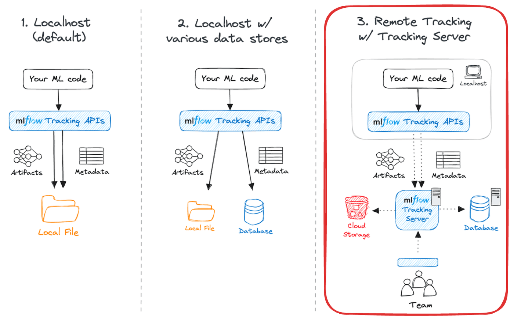
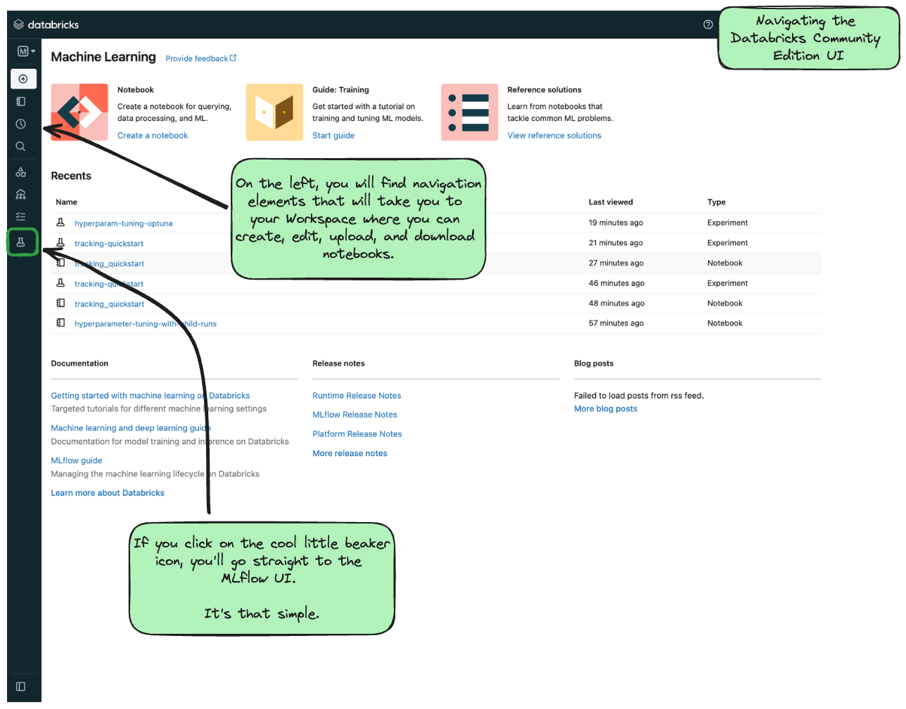
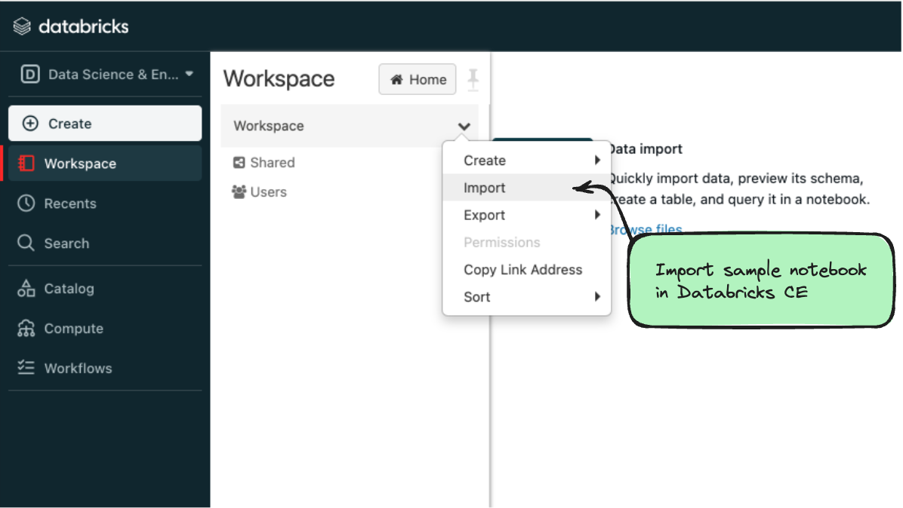
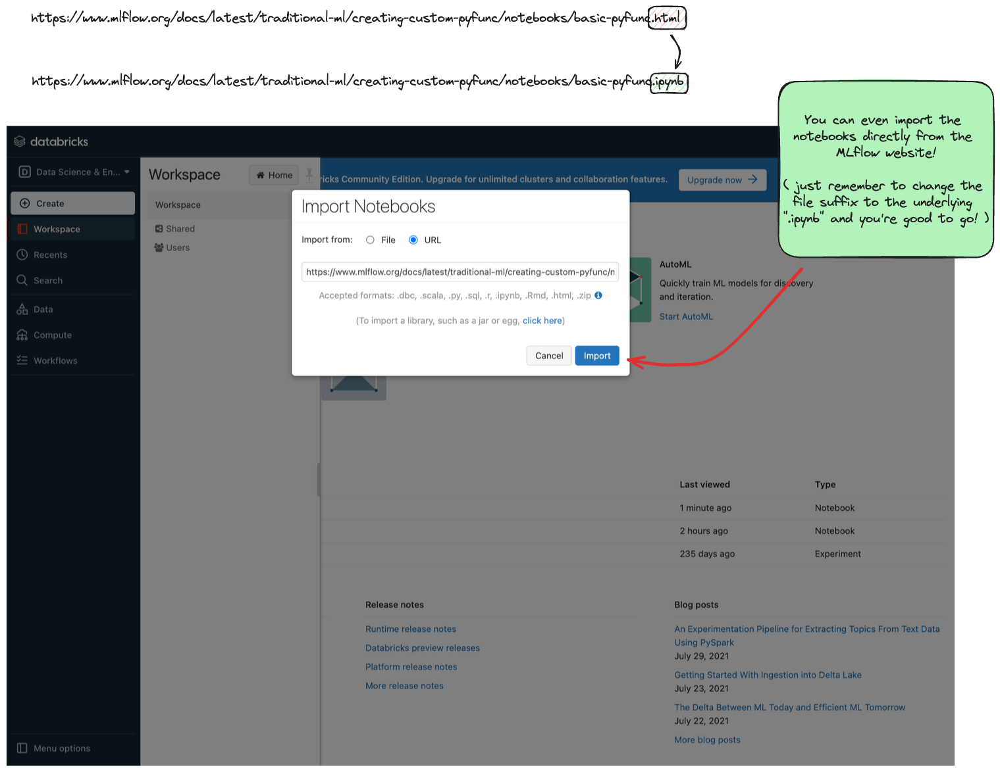

If you're new to MLflow and want to get started with a fully-managed and completely free deployment of MLflow, this blog will show you how to get started using MLflow in minutes.

<!-- truncate -->

## Streamline Your ML Projects: Get Started with Hosted MLflow for Free

Explore the world of big data and machine learning with [Databricks Community Edition (CE)](https://community.cloud.databricks.com/), a free, limited[^1] version of the Databricks platform.
 Ideal for beginners and those new to Databricks and MLflow, this edition streamlines the learning curve by offering a managed environment. It eliminates the complexity of manually
 setting up a tracking server. Databricks CE includes hosted MLflow, enabling efficient management and visualization of your MLflow experiments. This makes it a prime choice for
 developing machine learning projects in a user-friendly interface, allowing you to connect from your favorite IDE, notebook environment, or even from within Databricks CE's notebooks.

[^1]: The Model Registry and Model Deployment features are not available in the Databricks Community Edition.

### Benefits of Using Databricks CE for MLflow

MLflow is an open-source framework compatible with any platform, yet it offers distinct benefits when used on Databricks (including the Community Edition, CE) compared to other platforms. These advantages include:

1. **Cost-Effective**: Free of charge, MLflow on Databricks CE is perfect for educational purposes and small-scale projects.

2. **Simple Setup**: Gain access to a fully managed tracking server and user interface from any location. To connect to Databricks CE, just execute `mlflow.login()`.

3. **Easy Sharing**: In the Databricks ecosystem, sharing your notebooks is straightforward and hassle-free.

4. **Seamless Integration**: Databricks CE allows for direct storage and visualization of MLflow experiments, runs, and models.

5. **Scalability**: MLflow on Databricks CE provides an easy path to scale your projects. It also integrates seamlessly with a wide range of data tools available on the Databricks platform.

### Scenario

In this blog, we will walk through running ML experiments on your local device and tracking them on an [MLflow tracking server hosted on Databricks CE](https://mlflow.org/docs/latest/tracking.html#common-setups)

To give you an idea of the options available for running MLflow, the figure below shows what is possible for common setup configurations.



For this blog, we're showing #3, using a remote (fully managed) tracking server.

### Step-by-Step Guide

#### 1. Creating a Databricks CE Account

If you haven't already, you can [sign up for a free account](https://www.databricks.com/try-databricks#account). The process is quick, typically taking no more than 3 minutes.

Fill out the signup form and select “Get started with Community Edition.”


Once signed up, you'll get information on how to set a password that you can use to login to CE with[^2].

[^2]: Databricks CE only supports basic authorization signin (username / password). For more advanced and secure authorization setups, only the full Databricks product supports those.

#### 2. Installing Dependencies

Before you start, ensure that you have the necessary packages installed. Run the following command in your favorite IDE or notebook from your device:

```bash
%pip install -q mlflow databricks-sdk
```

#### 3. Setting Up Databricks CE Authentication

The main advantage of Databricks Community Edition (CE) is its convenience: it offers an MLflow tracking server without requiring
 [local infrastructure setup](https://mlflow.org/docs/latest/getting-started/logging-first-model/step1-tracking-server.html). You can easily access this server through the
 [mlflow.login()](https://mlflow.org/docs/latest/python_api/mlflow.html#mlflow.login) function after creating your CE account, streamlining the process for MLflow experiment tracking.

To authenticate with Databricks CE, use the [mlflow.login()](https://mlflow.org/docs/latest/python_api/mlflow.html#mlflow.login) function. This will prompt you for:

- **Databricks Host**: `https://community.cloud.databricks.com/`

- **Username**: Your Databricks CE email address.

- **Password**: Your Databricks CE password.

Upon successful authentication, you will see a confirmation message.

```python
import mlflow

mlflow.login()

# Follow the prompts for authentication
```

#### 4. Connect to Hosted MLflow and Track Experiments with Databricks CE

After you login from your local machine, start an experiment with [mlflow.set_experiment()](https://mlflow.org/docs/latest/python_api/mlflow.html?highlight=mlflow%20set_experiment#mlflow.set_experiment) and log some metrics. For instance:

```python
mlflow.set_experiment("/Users/\<email>/check-databricks-ce-connection")

with mlflow.start_run():

    mlflow.log_metric("foo", 1)

    mlflow.log_metric("bar", 2)
```

> **Note**: The Databricks environment requires you to set experiments with the directory (from root) 
    `/Users/{your email address for your account}/{name of your experiment}`, which is different from the behavior in self-hosted MLflow (and when running MLFlow locally).

#### 5. Viewing Your Experiment in Databricks CE

Now let’s navigate to Databricks CE to view the experiment result. Log in to your [Databricks CE](https://community.cloud.databricks.com/)
 account, and click on the top left to select machine learning in the drop down list. Finally, click on the experiment icon. See the screenshots below:

Navigate to the Machine Learning Section


Navigate to the MLflow UI



In the “Experiments” view, you should be able to find the experiment `/Users/{your email}/check-databricks-ce-connection`, similar to:


Clicking on the run name, which in this example is 'youthful-lamb-287' (note that you will see a different, randomly generated name in your CE console),
 will take you to the run view that looks similar to the following:


In the run view, you will see our dummy metrics `“foo”` and `“bar”` have been logged successfully.

#### 6. Run any MLflow tutorial in Databricks CE

If you want to try a tutorial from the MLflow website, you can use Databricks CE to quickly test (and modify, if you're inclined) the tutorial. For example, if you wanted to test
 the [Creating Custom Pyfunc tutorial](https://mlflow.org/docs/latest/traditional-ml/creating-custom-pyfunc/notebooks/basic-pyfunc.html):

1. Click Workspace and  select “Import notebook”



2. Use the `URL` option to import the notebook directly from the MLflow documentation website. For this example, to import, replace the last element of the url
 from `html` to `ipynb`. This can be done with any of the tutorial or guide notebooks that are hosted on the MLflow website.

    .../notebooks/basic-pyfunc.~~html~~ &rarr; .../notebooks/basic-pyfunc.**ipynb**[^3]

[^3]: Or you can [download the notebook](https://mlflow.org/docs/latest/traditional-ml/creating-custom-pyfunc/notebooks/basic-pyfunc.ipynb) and manually load it in the UI by selecting `File` instead of `URL`.



### Conclusion

Databricks Community Edition (CE) offers an accessible and collaborative platform for MLflow experiment tracking, presenting several advantages. Its setup process is effortless
 and quick, providing a user-friendly experience. Additionally, it's free to use, making it an ideal choice for beginners, learners, and small-scale projects.

### Getting started

Try out the notebook on [Databricks](https://databricks-prod-cloudfront.cloud.databricks.com/public/4027ec902e239c93eaaa8714f173bcfc/2830662238121329/3266358972198675/8538262732615206/latest.html)

### Further Reading

- Learn more about [different methods to setup your tracking server](https://mlflow.org/docs/latest/getting-started/tracking-server-overview/index.html#minute-tracking-server-overv)

- Learn more about running [Tutorial Notebooks ](https://mlflow.org/docs/latest/getting-started/running-notebooks/index.html)with Databricks CE
