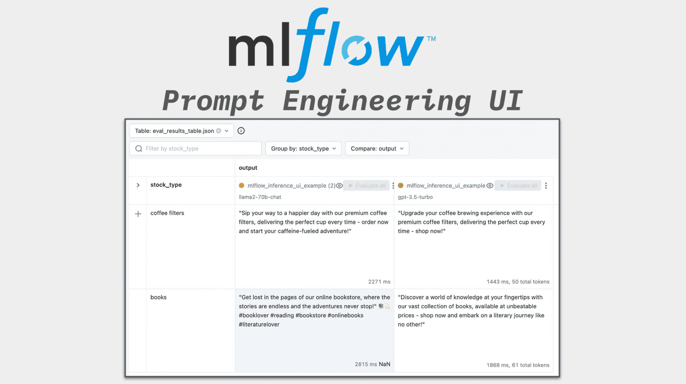
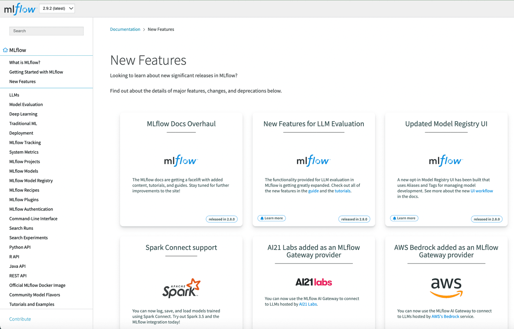
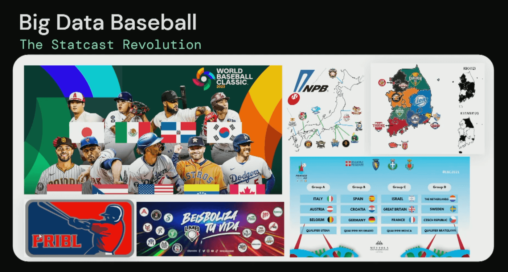
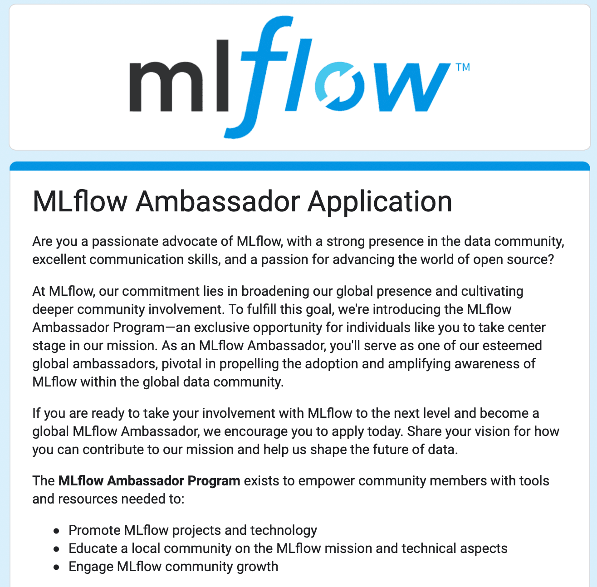

With more than **16 million** monthly downloads, MLflow has established itself as a leading open-source MLOps platform worldwide.
This achievement underscores the robustness of MLflow and the active community that consistently refines and improves it.

The past year marked a significant milestone for MLflow, particularly in Generative AI. Its integration and support for Large Language Models
(LLMs) stood out. This strategic decision has propelled MLflow to the forefront of the AI revolution, establishing itself as the premier GenAI
platform that enables users to create more intelligent, efficient, and adaptable AI models and applications.

<!-- truncate -->

## 2023: A Year of GenAI and Innovation

Last year was remarkable for MLflow, particularly in integrating LLMs and other generative AI tools. MLflow has evolved significantly by offering
a unified platform and workflow for traditional ML, deep learning, and GenAI applications. This integration ensures unparalleled efficiency and
innovation. MLflow's dedication to improving LLM support has revolutionized how users create and oversee AI workflows, establishing it as an
indispensable tool for building advanced machine learning applications.

### Integrations with Leading AI Tools

MLflow has successfully incorporated support for popular AI services/frameworks such as [Hugging Face](https://huggingface.co/),
[LangChain](https://www.langchain.com/), and [OpenAI](https://openai.com/), while offering a unified and framework-agnostic interface for
packaging, evaluating, and deploying them. These integrations have opened new horizons for MLflow users, allowing them to leverage the capabilities
of these advanced AI tools seamlessly within their MLflow workflows.

#### Model Packaging for LLMs

Recognizing the surge in LLM popularity and utility, MLflow has focused on enhancing packaging support for these models. With MLflow’s new built-in
model flavors for [Hugging Face](https://www.mlflow.org/docs/latest/llms/transformers/index.html), [LangChain](https://www.mlflow.org/docs/latest/llms/langchain/index.html)
, and [OpenAI](https://www.mlflow.org/docs/latest/llms/openai/index.html), users can log and deploy their LLMs and generative AI applications within minutes.

#### Retrieval Augmented Generation (RAG) and MLflow Integration

[Retrieval Augmented Generation (RAG)](https://mlflow.org/docs/latest/llms/rag/index.html) represents an impactful method in natural language processing.
It combines pre-trained models with retrieval mechanisms to access a dataset of documents that fetch validated and curated content as opposed to relying
on pure generation. This approach significantly improves generated responses' contextual relevance and factual accuracy. With
[mlflow.evaluate()](https://www.mlflow.org/docs/latest/llms/llm-evaluate/index.html), users can compare RAG systems across prompts, models, vector
databases, and more. See further details in the blog post:
["Evaluating Retrieval Augmented Generation (RAG) Systems with MLflow"](https://medium.com/@dliden/evaluating-retrieval-augmented-generation-rag-systems-with-mlflow-cf09a74faadb).

#### MLflow Deployment Server in MLflow 2.9.0

The [MLflow Deployment Server](https://www.mlflow.org/docs/latest/llms/deployments/index.html) simplifies LLM usage and management from various providers
like OpenAI, MosaicML, Anthropic, Hugging Face, Cohere, MLflow models, and more. Besides supporting popular SaaS LLM providers, the MLflow Deployment Server
integrates with MLflow model serving, enabling users to serve their own LLM or fine-tuned foundation models within their serving infrastructure.
The MLflow Deployment Server also provides a unified inference API across different providers and services, making it much easier to query and compose
them together. It uses securely stored keys from a centralized location, so users no longer need to share sensitive API keys with each member of their
organization. This simplifies how we interact with language models, adding an extra layer of security for managing API keys.

#### Enhanced MLflow Evaluate API in MLflow 2.8.0

The [MLflow Evaluate API](https://mlflow.org/docs/latest/llms/llm-evaluate/index.html) underwent significant feature enhancements to support LLM
workflows better and incorporate multiple new evaluation modes, including support for
[LLM-as-a-judge](https://mlflow.org/docs/latest/llms/llm-evaluate/index.html#metrics-with-llm-as-the-judge). This upgraded API enables a more refined
and thorough analysis of LLM performance.

#### Prompt Engineering UI in MLflow 2.7.0

MLflow introduced the [Prompt Engineering UI](https://mlflow.org/docs/latest/llms/prompt-engineering/index.html), a tool specifically designed for efficient prompt
development, testing, and assessment in Large Language Models (LLMs). This user-friendly interface and comprehensive toolkit have notably improved the
accessibility and efficiency of prompt engineering within LLM workflows.

## Community Growth and Engagement

The introduction of the MLflow blog in 2023 was a new addition to the MLflow website. This fresh section signifies a crucial stride toward boosting
community involvement and fostering knowledge exchange within the MLflow ecosystem. The blog serves as a direct avenue for sharing updates about new
features, improvements, and the future trajectory of the MLflow project.

MLflow surpassed 45,000 followers in 2023! Not only this, across [X](https://twitter.com/MLflow?ref_src=twsrc%5Egoogle%7Ctwcamp%5Eserp%7Ctwgr%5Eauthor)
and [LinkedIn](https://www.linkedin.com/company/mlflow-org/), MLflow had over 1 million impressions, the number of times our
content was displayed to users. When it came to MLflow contributor growth, the MLflow contributor count grew from 530 to 690 in 2023.

### MLflow Docs Overhaul

We have undertaken a massive initiative to reimagine how our users interact with our content. The primary goal is to enhance clarity, improve navigation,
and provide more in-depth resources for our community, in addition to refreshing the look and feel. The overhaul of the MLflow documentation is a significant
milestone, but it’s just the beginning. We have a roadmap full of exciting updates, new content, and features. Whether it’s writing tutorials, sharing use cases,
or providing feedback, every contribution enriches the MLflow community.

### 2023 Events

MLflow made a substantial impact at two significant events: **NeurIPS 2023** and the **Data+AI Summit 2023**. These events underscored MLflow's commitment
to contributing to the evolving discourse in machine learning and AI, emphasizing its pivotal role in shaping the future of these dynamic fields.
The Data+AI Summit occurred in June 2023 and featured various MLflow-related sessions. Notably, two sessions stood out:

- [Advancements in Open Source LLM Tooling, Including MLflow](https://www.youtube.com/watch?v=WpudXKAZQNI): Explored MLflow's seamless integration
  with leading generative AI tools like Hugging Face, LangChain, and OpenAI. It highlighted how these integrations enable effortless construction of AI workflows.
- [How the Texas Rangers Revolutionized Baseball Analytics with a Modern Data Lakehouse](https://www.youtube.com/watch?v=MYqXfMqEUq4): Offered a
  comprehensive insight into how the Texas Rangers baseball team leveraged MLflow and Databricks to revolutionize their approach to data analytics.

In December 2023, MLflow participated in the 37th Annual Conference of Neural Information Processing Systems (NeurIPS) held in New Orleans, LA. NeurIPS
stands as one of the most prestigious conferences in machine learning and computational neuroscience.
For those seeking guidance on fine-tuning a Large Language Model for general-purpose instruction following, the session
["LIMIT: Less Is More for Instruction Tuning Across Evaluation Paradigms"](https://arxiv.org/abs/2311.13133) at NeurIPS presented valuable insights.

### Stay Plugged In

If you are interested in joining the MLflow community, we’d love to connect! Join us on
[Slack](https://mlflow-users.slack.com/ssb/redirect), [Google Groups](https://groups.google.com/g/mlflow-users), and [GitHub](https://github.com/mlflow/mlflow/).
We have a roadmap full of exciting updates, new content, and features. Whether it’s writing tutorials, developing code, sharing use-cases, or providing feedback, let’s work together!
Are you already an MLflow contributor? The newly launched MLflow Ambassador Program is a great way to boost your involvement. As an MLflow Ambassador,
you will serve as one of our esteemed global ambassadors, pivotal in propelling the adoption and amplifying awareness of MLflow within the global data
community. We invite you to submit an application [here](https://forms.gle/adAPNvH6aVq4diPF9).

### Looking Forward

“In 2024, we're launching new initiatives to engage, support, and expand our community. MLflow is thrilled to broaden its horizons this year through strategic
collaboration and partnership”, says Ben Wilson, Software Engineer at Databricks. “This collaboration will unlock fresh opportunities for our users and
significantly contribute to MLflow's evolution. Stay tuned for an announcement about this exciting effort.”

The year 2023 marked a transformative period for MLflow. By embracing the latest ML and GenAI advancements, MLflow improved its platform and made substantial
contributions to the wider AI and machine learning community. To our MLflow community, we extend our deepest gratitude.

You have been instrumental in driving MLflow's success over the past year. Whether it's enhancing existing features, exploring new integrations, or sharing
your expertise, your contributions are the lifeblood of the MLflow community. If you're interested in contributing to MLflow,
[this guide](https://github.com/mlflow/mlflow/blob/master/CONTRIBUTING.md) is an excellent starting point. Looking ahead, we're excited about the myriad
possibilities and new frontiers we can explore together.

MLflow is poised to continue its path of growth and innovation, cementing its role as a leader in managing machine learning and GenAI workflows across the
entire lifecycle. We're eager to keep pushing the boundaries of what's achievable in AI and strive to create an innovative, inclusive, and open future.
