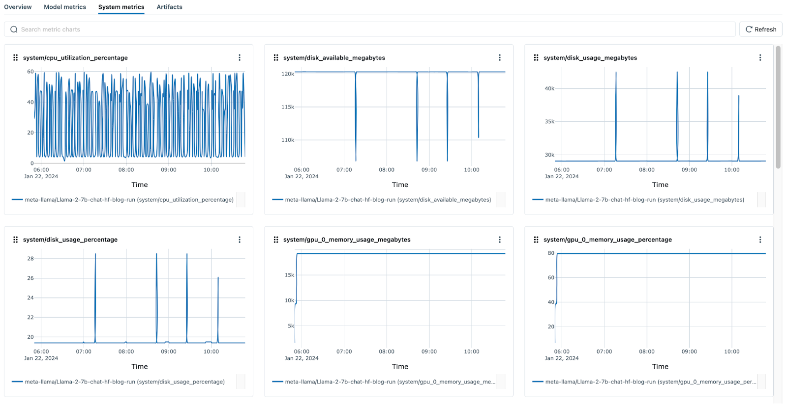
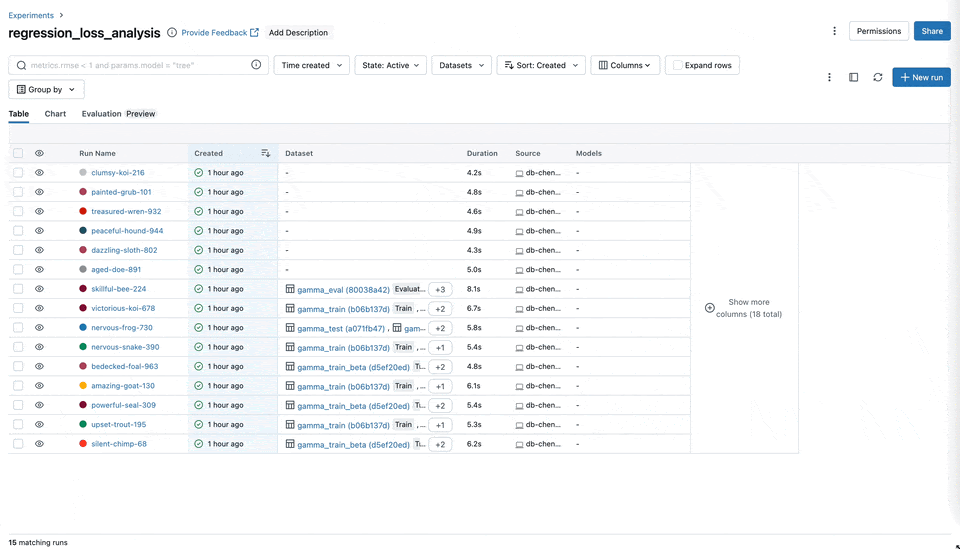
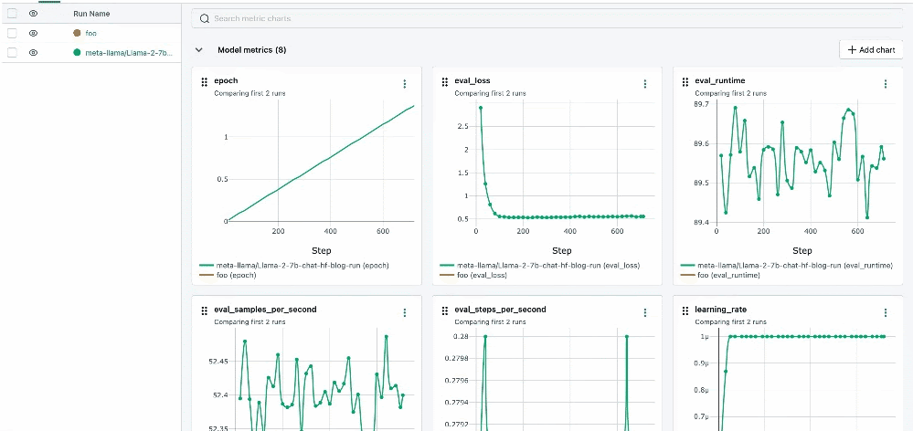
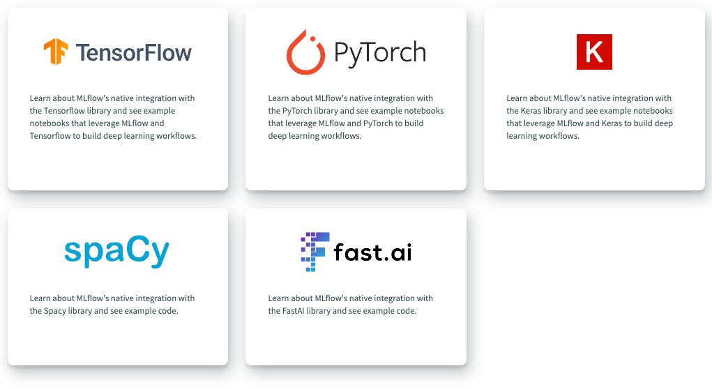
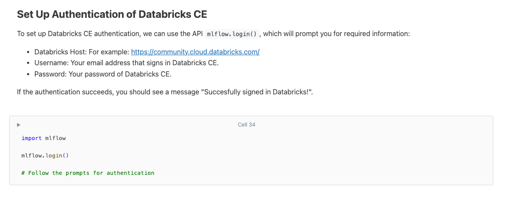

In the quickly evolving world of artificial intelligence, where generative AI has taken center stage, the landscape of machine learning is
evolving at an unprecedented pace. There has been a surge in the use of cutting-edge deep learning (DL) libraries like
[Transformers](https://huggingface.co/docs/transformers/index), [Tensorflow](https://www.tensorflow.org/),
and [PyTorch](https://pytorch.org/) to fine-tune these generative AI models for enhanced performance.
As this trend accelerates, it's become clear that the tools used to build these models must rapidly evolve as well, particularly when it comes
to managing and optimizing these deep learning workloads. MLflow offers a practical solution for managing the complexities of these machine learning projects.

<!-- truncate -->

In collaboration with [MosaicML](https://www.mosaicml.com/) and the broader ML community, MLflow is thrilled to unveil a set of eagerly awaited enhancements.
This latest release ([MLflow 2.11](https://www.mlflow.org/releases/2.11.0)) introduces updated tracking UI capabilities in direct response to
[the feedback](https://www.linkedin.com/posts/mlflow-org_qualtrics-survey-qualtrics-experience-management-activity-7128154257924513793-RCDG?utm_source=share&utm_medium=member_desktop)
and needs of MLflow enthusiasts. These updates are not just incremental; they represent a leap forward in addressing the needs of MLflow users doing Deep Learning.

The evolution of enhanced Deep Learning capabilities is a testament to MLflow's commitment to serving the open-source community, ensuring that its offerings
are not just keeping pace, but setting the pace in the rapidly evolving domain of machine learning.

## Deep Learning API Improvements

Leveraging valuable insights from our user community, we've implemented critical enhancements to the effective scale of metrics logging and the inclusion of
system-related metric logging within our platform. These improvements encompass expanded scalability options, support for logging more iterations and the
logging of system metrics.

### System Metrics

This feature allows you to [monitor system metrics](https://mlflow.org/docs/latest/system-metrics/index.html?highlight=system) and identify any hardware issues that might be impacting performance.
Metrics such as CPU utilization, Memory usage, disk usage etc., from all nodes in your cluster can now be logged and visualized within the MLflow UI.



### Improved Logging Performance

We recently introduced both asynchronous and batch logging, making it easier to log both
[parallel and distributed](https://mlflow.org/docs/latest/tracking/tracking-api.html#parallel-runs) DL training sessions. Additionally, the MLflow Client
now supports up to **1 million** steps (iterations) when logging metrics, allowing users to log more steps during long-running DL jobs.


### Checkpointing for Deep Learning

[TensorFlow](https://mlflow.org/releases/2.11.0#autologging-for-tensorflow-and-pytorch-now-supports-checkpointing-of-model-weights:~:text=both%20PyTorch%20and-,TensorFlow,-for%20automatic%20model)
and [PyTorch](https://www.mlflow.org/docs/latest/python_api/mlflow.pytorch.html#mlflow.pytorch.autolog) now support model weight checkpointing when
using autologging.


## User Experience and Productivity Enhancements

We have introduced substantial improvements to user experience and feature organization within our platform. These enhancements include more
sophisticated user interfaces and an intuitive redesign of the run details page, the addition of chart groups and metric aggregation, all
aimed at simplifying navigation and enhancing productivity especially for Deep Learning use cases.

### Metric Aggregation

We've enhanced the UI with metric aggregation, enabling you to aggregate metrics across multiple runs based on
datasets, tags, or parameters. These improvements significantly improve the time it takes to understand training results when working
with large DL models, enabling more nuanced and comprehensive analysis of overarching trends in model performance across multiple dimensions.



### Chart Grouping Functionality

You can now easily categorize and organize your metrics, such as training, testing, and system metrics into
named groups within the MLflow UI. This organization allows for a comprehensive overview of all metrics, enabling quicker access and
better management, particularly when handling experiments with many metrics.


### Slash ("/") Logging Syntax

To further streamline metric organization, we've implemented a new logging syntax that uses slashes
("/") to group metrics. For example, using mlflow.log_metric("x/y/score", 100) helps in structuring and segregating different types
of data or metrics into hierarchical groups, making it easier to navigate and interpret the logs, especially when dealing with complex
models and experiments.

```python

mlflow.log_metric('SVR/val_MAPE', mean_absolute_percentage_error(test_y, pred_y))

```


### Chart Searching

We've significantly enhanced the search functionality within our platform, enabling more robust and intuitive searching
across charts, parameters, and metrics. This upgrade allows for quicker and more precise retrieval of specific data points, streamlining the
process of analyzing and comparing different aspects of your experiments.



### Run Details Redesign

We reorganized the Run Details UI to a modular tabbed layout, added new drag and drop UI functionality so that you can
can now render logged tables. This enhancement will make it easier to organize your runs and experiments.


## Getting Started Updates

Following extensive feedback from our user community, we've introduced significant updates to enhance the
[getting started](https://www.mlflow.org/docs/latest/getting-started/index.html) documentation within MLflow. These updates include a
[comprehensive overhaul](https://www.mlflow.org/docs/latest/deep-learning/index.html) of our documentation for easier navigation and
[enriched guidance](https://www.mlflow.org/docs/latest/deep-learning/pytorch/quickstart/pytorch_quickstart.html), along with a streamlined
[login API](https://www.mlflow.org/docs/latest/python_api/mlflow.html#mlflow.login). These enhancements, reflecting our commitment to improving the
user experience and workflow, aim to empower our users to achieve more with greater speed and ease.

### New Tutorials and Docs

We've overhauled our documentation to offer a more comprehensive, user-friendly experience with practical examples
to support both newcomers and experienced practitioners with the information they need to start a Deep Learning project.



### Seamless login with mlflow.login()

We've streamlined our authentication processes.
[This method](https://mlflow.org/docs/latest/getting-started/tracking-server-overview/index.html#method-2-use-free-hosted-tracking-server-databricks-community-edition)
provides a simple way to connect MLflow to your tracking server without having to leave your development environment.
[Try it out today](https://mlflow.org/blog/databricks-ce)



## Get Started Today

Dive into the latest MLflow updates today and enhance the way you manage your machine learning projects! With our newest enhancements,
including advanced metric aggregation, automatic capturing of system metrics, intuitive feature grouping, and streamlined search capabilities,
MLflow is here to elevate your data science workflow to new heights.
[Get started now with MLflow's cutting-edge tools and features](https://mlflow.org/releases/2.11.0).

```bash
pip install mlflow==2.11

mlflow ui --port 8080
```

```python
import mlflow

from sklearn.model_selection import train_test_split
from sklearn.datasets import load_diabetes
from sklearn.ensemble import RandomForestRegressor

# Set our tracking server uri for logging
mlflow.set_tracking_uri(uri="http://127.0.0.1:8080")

mlflow.autolog()

db = load_diabetes()
X_train, X_test, y_train, y_test = train_test_split(db.data, db.target)

rf = RandomForestRegressor(n_estimators=100, max_depth=6, max_features=3)
# MLflow triggers logging automatically upon model fitting
rf.fit(X_train, y_train)
```

## Feedback

We value your input! Our [feature roadmap](https://github.com/orgs/mlflow/projects/4) prioritization is guided by feedback from the [MLflow late 2023 survey](https://www.linkedin.com/feed/update/urn:li:activity:7128154257924513793), [GitHub Issues](https://github.com/mlflow/mlflow) and [Slack](https://mlflow.org/slack). Look out for our next survey later this year, by participating you can help ensure that the features you want are implemented in MLflow. You can also create an [issue on GitHub](https://github.com/mlflow/mlflow) or join our [Slack](https://mlflow.org/slack).
