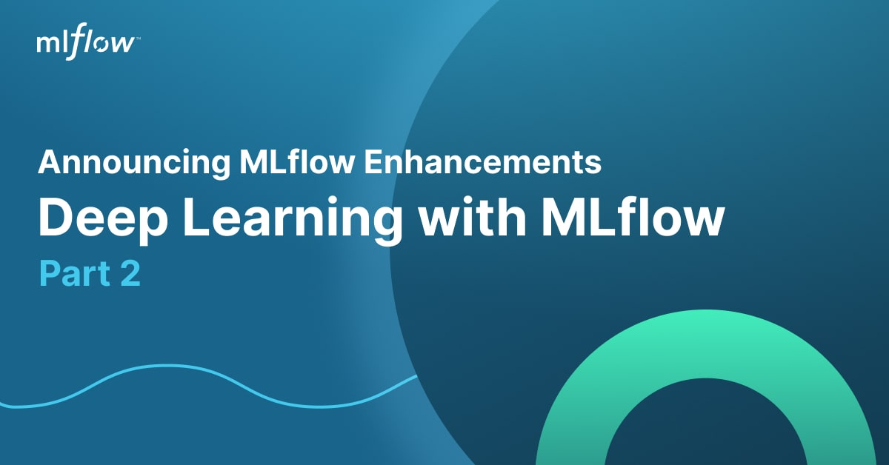
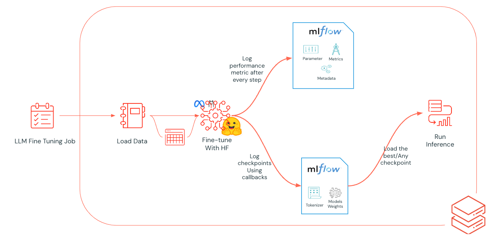
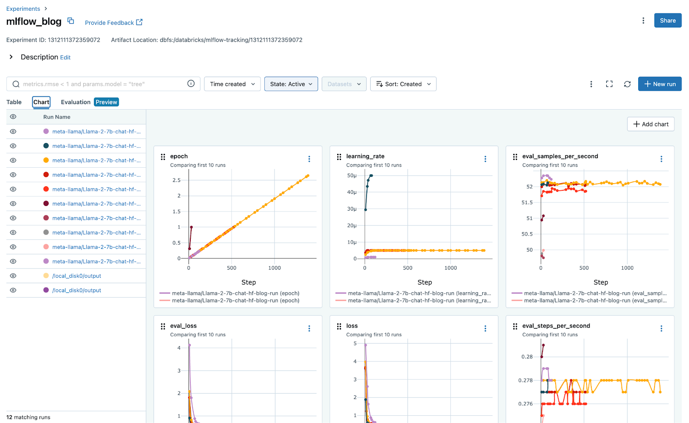
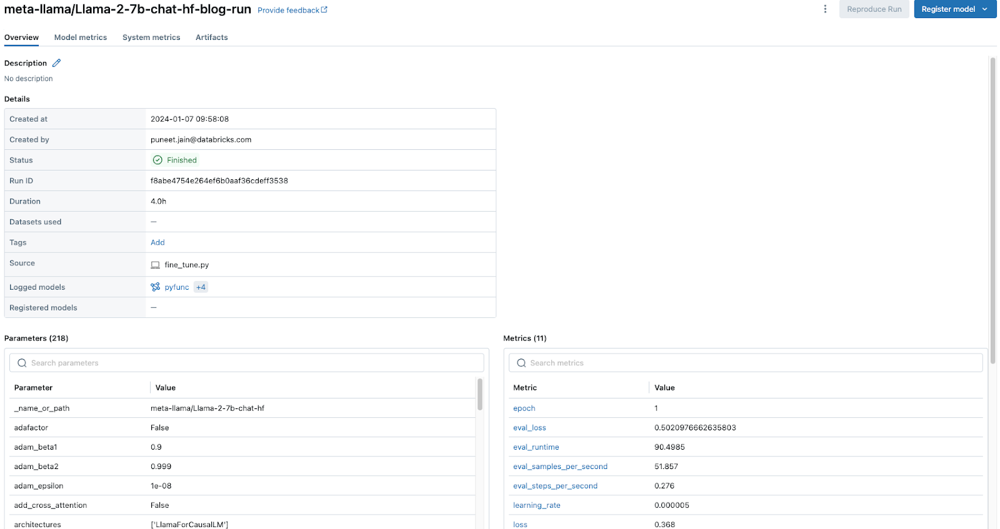
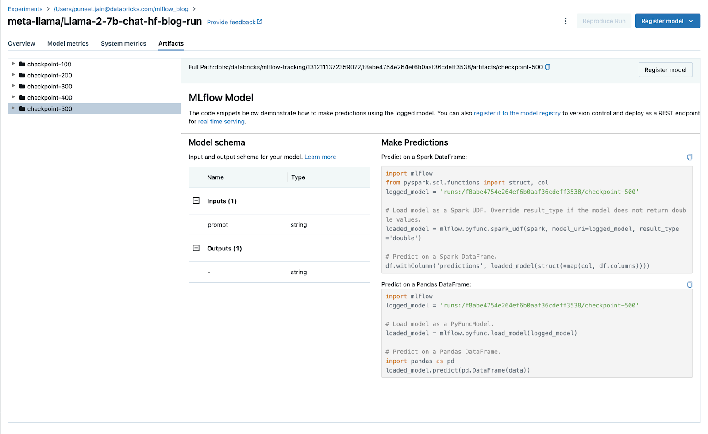
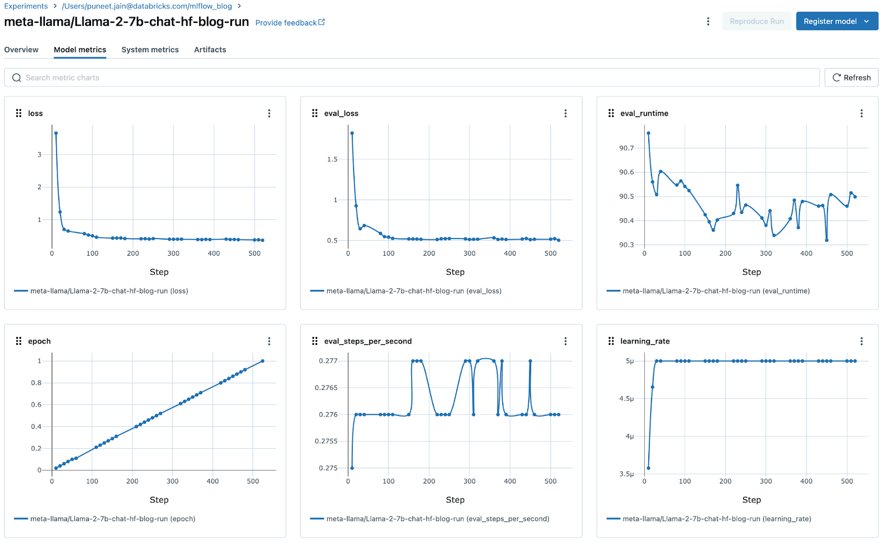

In the realm of deep learning, finetuning of pre-trained Large Language Models (LLMs) on private datasets stands as a critical application. This practice is not only common but also essential for developing specialized models, particularly for tasks like custom Named Entity Recognition (NER). In such scenarios, tools like MLflow are invaluable. They ensure that every aspect of the training process - metrics, parameters, and artifacts - are reproducibly tracked, logged, analyzed, compared, and shared. In this tutorial we are going to be using [MLflow 2.11](https://mlflow.org/releases/2.11.0) and [the new MLflow Deep Learning features](https://mlflow.org/blog/deep-learning-part-1) to track all the important aspects of this project.


# Use Case: Fine Tuning Llama2-7B for NER on Restaurant data

Let's consider fine-tuning a Llama2-7B model for following instructions embedded within text. This is a specific example of how Parameter-Efficient Fine-Tuning (PEFT) can be applied for real-world tasks. The goal here is to  extract structured information based on instructions, which goes beyond simple Named Entity Recognition (NER).

Imagine a scenario where the instruction is: `The Punter is an expensive Chinese coffee shop located near Café Sicilia.` The model, after fine-tuning, would then process the unstructured text of the sentence and identify the entities, presenting them in a structured format like a list. 

Example of extracting information from `The Punter is an expensive Chinese coffee shop located near Café Sicilia.`: 
```python
Business name: The Punter
Cusine: Chinese
descriptor: expensive
location: Café Sicilia
```

The Llama2-7B model's size is strategically chosen. It has enough parameters (complexity) to handle intricate tasks like understanding instructions within text, but remains  compact enough for fine-tuning on even a modest cluster of less powerful GPUs like Nvidia T4s, thanks to PEFT methods. It can even be fine-tuned on a single high-end A100 GPU with PEFT.

PEFT techniques focus on keeping the pre-trained model parameters frozen and only training a small number of additional layers for the specific task. This saves memory and training time.

Overall, fine-tuning Llama2-7B with PEFT is a promising approach for instruction following tasks and similar applications that require working with large models on limited resources.


# Setting Up MLflow for Fine tuning

The code provided below illustrates the setup for Fine tuning, augmented with MLflow integration. We have marked the sections used for MLflow tracking. At the beginning of the functions, MLflow is configured, initiating a run that automatically logs the experiment. The details of  `callback.py` will be discussed in a later section.

This example demonstrates how to set up a fine tuning job on Databricks. A similar setup can be achieved on any platform capable of supporting this type of workload.

We are using the [e2e_nlg](https://huggingface.co/datasets/e2e_nlg) dataset as it is a great dataset is used for training end-to-end, data-driven natural language generation systems in the restaurant domain

```bash
!export DATABRICKS_TOKEN && export DATABRICKS_HOST && export MLFLOW_EXPERIMENT_NAME && export MLFLOW_FLATTEN_PARAMS &&  \
 export HF_MLFLOW_LOG_ARTIFACTS && export MLFLOW_ENABLE_SYSTEM_METRICS_LOGGING && cd .. && deepspeed \
--num_gpus='{num_gpus}' \
--module databricks_llm.fine_tune \
--final_model_output_path='{dbfs_output_location}' \
--output_dir="/local_disk0/output" \
--dataset={dataset} \
--model={pretrained_name_or_path} \
--tokenizer={pretrained_name_or_path} \
--use_lora=false \
--use_4bit=false \
--deepspeed_config="ds_configs/ds_zero_3_cpu_offloading.json" \
--fp16=false \
--bf16=true \
--per_device_train_batch_size=16 \
--per_device_eval_batch_size=48 \
--gradient_checkpointing=true \
--gradient_accumulation_steps=1 \
--learning_rate=1e-6 \
--lr_scheduler_type="cosine" \
--warmup_steps=50 \
--evaluation_strategy="steps" \
--save_strategy="steps" \
--save_steps=100 \
--num_train_epochs=3\
--run_name="{pretrained_name_or_path}-blog-run"
``````
See code details [here](https://github.com/puneet-jain159/fine_tuning_llm_with_mlflow_blog/blob/495c156f73435996706c42bfda4bb7519dc21dab/notebooks/run_deepspeed_fine_tuning.py#L117)

In the above code block we are doing the following: Logging system metrics with MLFlow ensures that CPU stats, GPU stats, memory usage, network traffic, and disk usage during the training process is logged. Particularly, the ability to log and track GPU utilization during a training run is critical and thus being able to log it intermittently is particularly useful. The training run is parametrized such that the model is trained for 3 epochs, with checkpoints saved and metrics logged every 100 training steps. The run is given an appropriate name based on the path of the pretrained model.

The diagram below is a visualization of how finetuning and MLflow fit together.



Using MLflow while fine tuning ML model in Databricks


# The Importance of Logging

The integration of the Hugging Face trainer callback with MLFlow plays a pivotal role in this ecosystem. It allows for comprehensive tracking and logging of metrics, parameters, and artifacts during model finetuning. This logging can be configured flexibly – at every epoch, after a set number of epochs, or steps. Importantly, it can cover the entire model checkpoint or be limited to just the adapter when using [PEFT (Parameter-Efficient Fine-Tuning)](https://huggingface.co/docs/peft/index) methods like [QLoRA](https://arxiv.org/abs/2305.14314). We have highlighted the additional code necessary for MLflow to log every epoch and checkpoint.


## Configuring Hugging Face Trainer Callback for MLflow

```python
class CustomMLflowCallback(MLflowCallback):
    """
    A [`TrainerCallback`] that sends the logs to [MLflow](https://www.mlflow.org/). Can be disabled by setting
    environment variable `DISABLE_MLFLOW_INTEGRATION = TRUE`.
    """

  def on_save(self, args, state, control,model,tokenizer, **kwargs):
        if self._initialized and state.is_world_process_zero and self._log_artifacts:
           ckpt_dir = f"checkpoint-{state.global_step}"
  	 self._ml_flow.transformers.log_model(
                             transformers_model={
                                 "model": model,
                                 "tokenizer": tokenizer,
                             },
                             task="text-generation",
                             artifact_path=ckpt_dir,
                             pip_requirements=["torch", "transformers", "accelerate"],
                             input_example=input_example,
                             signature=signature,
                             metadata={"task": "llm/v1/completions"}
                         )
```

See detailed code block [here](https://github.com/puneet-jain159/fine_tuning_llm_with_mlflow_blog/blob/495c156f73435996706c42bfda4bb7519dc21dab/databricks_llm/callbacks.py#L64)

In the code snippet above, we create a new callback class that includes an additional method, **on_save**, which logs the weights and tokenizer after **every n** steps/epochs. This frequency is configured as part of the training arguments using the Transformer library. Additionally, we can employ a custom pyfunc to perform the same activity. For an example, please refer to the link provided [here](https://github.com/puneet-jain159/fine_tuning_llm_with_mlflow_blog/blob/main/databricks_llm/callbacks.py).

The custom callback gracefully saves the model checkpoints during the finetuning process. The mlflow\.transformers.log\_model expression saves the model and the tokenizer alongside the dependencies, input example and the model signature during each logging event.


## Scaling and Platform Considerations for Training

To effectively scale the finetuning of your training, it's essential to select the right platform infrastructure that offers the necessary compute resources. Platforms like Databricks provide options for both single-node multi-GPU finetuning and multi-node multi-GPU training, which are crucial for scaling your processes. Coupled with efficient library management on the Databricks platform, these resources can significantly streamline the development process.


# Visualization and Sharing Capabilities on MLflow

One of the most powerful features of MLFlow is its [newly introduced visualization capabilities](https://mlflow.org/blog/deep-learning-part-1). These tools enable users to make comparisons across different runs and artifacts. Such visualizations can be integrated into dashboards, facilitating easy sharing with both internal and external stakeholders. Additionally, the centralized storage of metadata allows for effective analysis of performance metrics, like identifying minima and maxima in model performance.



Visualizing and comparing curve with MLflow and grouping charts



Run Details



Autologged checkpoints in MLflow for flexible deployment



System metrics with MLflow


# When to stop training?

For the sake of efficient training and model performance at the chosen task, it is critical to ensure that the model does not overfit to the training data and loses the ability to generalize to unseen examples in the real world scenarios. The easiest way to do this is by tracking the loss metrics for training and validation metrics. Thanks to our MLFlow callback, we log these values and we are in a position to visualize them near-real time. If the validation loss curve isn’t improving (i.e. the loss curve isn’t going down) it’s time to stop the training.  


# Evaluate checkpoints of Fine Tuned Model with MLflow

With your training process meticulously tracked and logged by MLflow, you have the flexibility to retrieve and test your model at any checkpoint. To do this, simply employ [mlflow.pyfunc.load\_model()](https://mlflow.org/docs/latest/python_api/mlflow.pyfunc.html?highlight=load_model#mlflow.pyfunc.load_model) to load the model from a specific run, and then use the[ .predict()](https://mlflow.org/docs/latest/python_api/mlflow.models.html?highlight=predict#mlflow.models.predict) method for evaluation.

In our example, we focus on the model checkpoint from the 900th epoch. We'll demonstrate how to test this model using a specific prompt and set parameters.

Example using the instruction `The Restaurant Gymkhana near Marlybenone station has a high customer star rating and offers a unique Indian cuisines`

Output Before Finetuning:

```
['Organization[Restaurant Gymkhana], Location[Marlybenone], Nationality[Indian], Food[cuisines]']
```

Output After 900 epochs of Fine Tuning:

```python
import mlflow

loaded_model = mlflow.pyfunc.load_model(f"runs:/4b32ccd588794530bd66fd3557c4d42c/checkpoint-900")

# Make a prediction using the loaded model
loaded_model.predict(
    {"prompt": "The Restaurant Gymkhana near Marlybenone station has a high customer star rating and offers a unique Indian cuisines",
     "temperature": 0.4,
     "max_tokens": 128,
    }
)
```

```
['name[Gymkhana], eatType[restaurant], food[Indian], customer rating[high] near[Marlybenone] near[station]']
```

# Summary

The integration of MLFlow into the finetuning process of pre-trained LLMs, particularly for applications like custom NER, represents a significant advancement in the field of deep learning. This approach not only enhances the reproducibility and efficiency of model development but also fosters a collaborative environment where insights and improvements can be easily shared and implemented. As we continue to push the boundaries of what these models can achieve, tools like MLFlow will be instrumental in harnessing their full potential.


# Check out the code

The code we provide will delve into additional aspects such as training from a checkpoint, integrating MLflow and TensorBoard, and utilizing Pyfunc for model wrapping, among others. These resources are specifically tailored for implementation on [Databricks Community Edition](https://mlflow.org/blog/databricks-ce).

Notebook: [Fine Tuning LLMs with MLflow: Deep Learning with MLflow](https://github.com/puneet-jain159/fine_tuning_llm_with_mlflow_blog/tree/main)

## Get Started with MLflow 2.11 Today

Dive into the latest MLflow updates today and enhance the way you manage your machine learning projects! With our newest enhancements, including advanced metric aggregation, automatic capturing of system metrics, intuitive feature grouping, and streamlined search capabilities, MLflow is here to elevate your data science workflow to new heights. [Get started now with MLflow's cutting-edge tools and features. ](https://mlflow.org/releases/2.11.0)

```bash
pip install mlflow==2.11.*

mlflow ui --port 8080
```

```python
import mlflow

from sklearn.model_selection import train_test_split
from sklearn.datasets import load_diabetes
from sklearn.ensemble import RandomForestRegressor

# Set our tracking server uri for logging
mlflow.set_tracking_uri(uri="http://127.0.0.1:8080")

mlflow.autolog()

db = load_diabetes()
X_train, X_test, y_train, y_test = train_test_split(db.data, db.target)

rf = RandomForestRegressor(n_estimators=100, max_depth=6, max_features=3)
# MLflow triggers logging automatically upon model fitting
rf.fit(X_train, y_train)
```

## Feedback

We value your input! Our [feature roadmap](https://github.com/orgs/mlflow/projects/4) prioritization is guided by feedback from the [MLflow late 2023 survey](https://www.linkedin.com/feed/update/urn:li:activity:7128154257924513793), [GitHub Issues](https://github.com/mlflow/mlflow) and [Slack](https://mlflow-users.slack.com/join/shared_invite/zt-1iffrtbly-UNU8hV03aV8feUeGmqf_uA#/shared-invite/email). Look out for our next survey later this year, by participating you can help ensure that the features you want are implemented in MLflow. You can also create an [issue on GitHub](https://github.com/mlflow/mlflow) or join our [Slack](https://mlflow-users.slack.com/join/shared_invite/zt-1iffrtbly-UNU8hV03aV8feUeGmqf_uA#/shared-invite/email).
