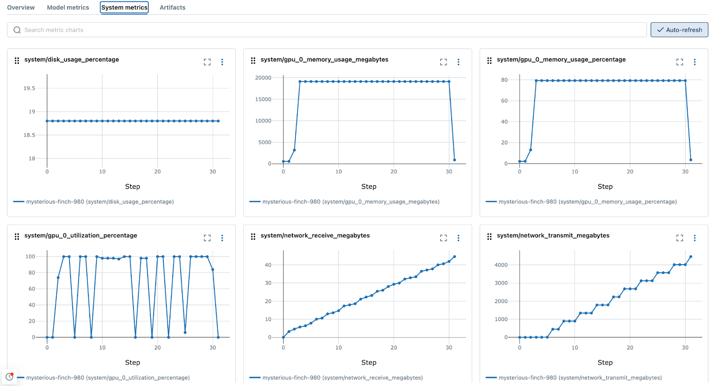
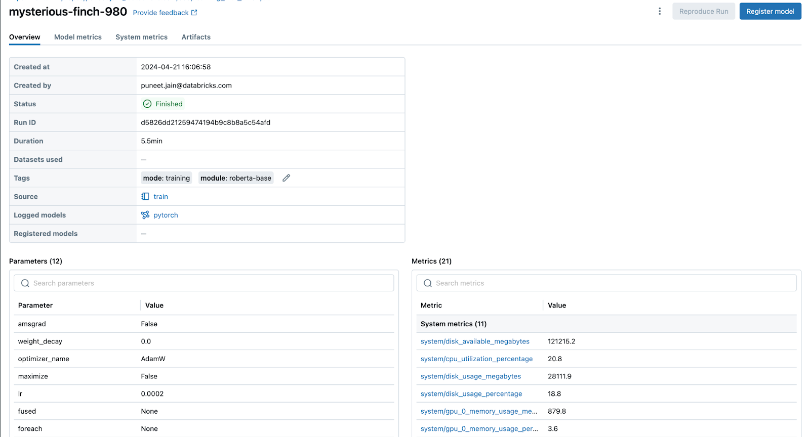
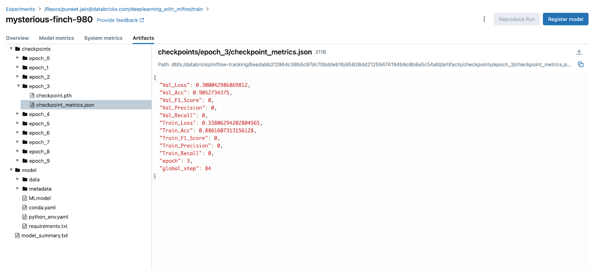
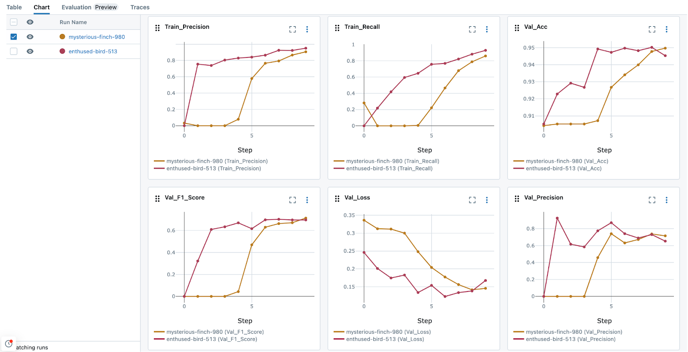

In the realm of deep learning, finetuning of pre-trained Large Language Models (LLMs) on private datasets is an excellent customization
option to increase a model’s relevancy for a specific task. This practice is not only common, but also essential for developing specialized
models, particularly for tasks like text classification and summarization.

In such scenarios, tools like MLflow are invaluable. Tracking tools like MLflow help to ensure that every aspect of the training
process - metrics, parameters, and artifacts - are reproducibly tracked and logged, allowing for the analysis, comparison, and sharing of tuning iterations.

<!-- truncate -->

In this blog post, we are going to be using [MLflow 2.12](https://mlflow.org/releases/2.12.1) and the
[recently introduced MLflow Deep Learning features](https://mlflow.org/blog/deep-learning-part-1) to track all the important aspects of fine
tuning a large language model for text classification, including the use of automated logging of training checkpoints in order to simplify
the process of resumption of training.

## Use Case: Fine Tuning a Transformer Model for Text Classification

The example scenario that we're using within this blog utilizes the [unfair-TOS](https://huggingface.co/datasets/coastalcph/lex_glue/viewer/unfair_tos) dataset.

In today’s world, it’s hard to find a service, platform, or even a consumer good that doesn’t have a legally-binding terms of service connected
with it. These encyclopedic size agreements, filled with dense legal jargon and sometimes baffling levels of specificity, are so large that
most people simply accept them without reading them. However, reports have indicated over time that occasionally, some suspiciously unfair
terms are embedded within them.

Addressing unfair clauses in Terms of Service (TOS) agreements through machine learning (ML) is particularly relevant due to the pressing
need for transparency and fairness in legal agreements that affect consumers. Consider the following clause from an example TOS
agreement: **"We may revise these Terms from time to time. The changes will not be retroactive, and the most current version of the Terms, which will always..."**
This clause stipulates that the service provider may suspend or terminate the service at any time for any reason,
with or without notice. Most people would consider this to be quite unfair.

While this sentence is buried quite deeply within a fairly dense document, an ML algorithm is not burdened by the exhaustion that a human
would have for combing through the text and identifying clauses that might seem a bit unfair. By automatically identifying potentially
unfair clauses, a transformers-based Deep Learning (DL) model can help protect consumers from exploitative practices, ensure greater compliance with legal standards,
and foster trust between service providers and users.

A base pre-trained transformer model, without specialized fine-tuning, faces several challenges in accurately identifying unfair Terms of Service clauses.
Firstly, it lacks the domain-specific knowledge essential for understanding complex legal language. Secondly, its training objectives are
too general to capture the nuanced interpretation required for legal analysis. Lastly, it may not effectively recognize the subtle
contextual meanings that determine the fairness of contractual terms, making it less effective for this specialized task.

Using prompt engineering to address the identification of unfair Terms of Service clauses with a closed-source Large language model
can be prohibitively expensive. This approach requires extensive trial and error to refine prompts without the ability to tweak
the underlying model mechanics. Each iteration can consume significant computational resources , especially when using
[few-shot prompting](https://www.promptingguide.ai/techniques/fewshot), leading to escalating costs without guaranteeing a corresponding
increase in accuracy or effectiveness.

In this context, the use of the **RoBERTa-base** model is particularly effective, provided that it is fine-tuned. This model is robust
enough to handle complex tasks like discerning embedded instructions within texts, yet it is sufficiently compact to be fine-tuned
on modest hardware, such as an Nvidia T4 GPU.

### What is PEFT?

[Parameter-Efficient Fine-Tuning (PEFT)](https://huggingface.co/docs/peft/en/index) approaches are advantageous as they involve
keeping the bulk of the pre-trained model parameters fixed while either only training a few additional layers or modifying the parameters used
when interacting with the model's weights. This methodology not only conserves memory during training, but also significantly reduces the overall training time. When
compared with the alternative of fine-tuning a base model's weights in order to customize its performance for a specific targeted task, the PEFT
approach can save significant cost in both time and money, while providing an equivalent or better performance results with less data than is required
for a comprehensive fine-tuning training task.

## Integrating Hugging-Face models and the PyTorch Lightning framework

[PyTorch Lightning](https://lightning.ai/docs/pytorch/stable/) integrates seamlessly with
[Hugging Face's Transformers library](https://huggingface.co/docs/transformers/en/index), enabling streamlined model training workflows
that capitalize on Lightning's easy-to-use Higher level API’s and HF's state-of-the-art pre-trained models. The combination of Lightning with transformers’
[PEFT module](https://huggingface.co/blog/peft) enhances productivity and scalability by reducing code complexity and enabling the use of
high-quality pre-optimized models for a range of diverse NLP tasks.

Below is an example of configuring the PEFT-based fine tuning of a base model using PyTorch Lightning and HuggingFace's `peft` module.

```python
from typing import List
from lightning import LightningModule
from peft import get_peft_model, LoraConfig, TaskType
from transformers import AutoModelForSequenceClassification


class TransformerModule(LightningModule):
    def __init__(
        self,
        pretrained_model: str,
        num_classes: int = 2,
        lora_alpha: int = 32,
        lora_dropout: float = 0.1,
        r: int = 8,
        lr: float = 2e-4
    ):
        super().__init__()
        self.model = self.create_model(pretrained_model, num_classes, lora_alpha, lora_dropout, r)
        self.lr = lr
        self.save_hyperparameters("pretrained_model")

    def create_model(self, pretrained_model, num_classes, lora_alpha, lora_dropout, r):
        """Create and return the PEFT model with the given configuration.

        Args:
            pretrained_model: The path or identifier for the pretrained model.
            num_classes: The number of classes for the sequence classification.
            lora_alpha: The alpha parameter for LoRA.
            lora_dropout: The dropout rate for LoRA.
            r: The rank of LoRA adaptations.

        Returns:
            Model: A model configured with PEFT.
        """
        model = AutoModelForSequenceClassification.from_pretrained(
            pretrained_model_name_or_path=pretrained_model,
            num_labels=num_classes
        )
        peft_config = LoraConfig(
            task_type=TaskType.SEQ_CLS,
            inference_mode=False,
            r=r,
            lora_alpha=lora_alpha,
            lora_dropout=lora_dropout
        )
        return get_peft_model(model, peft_config)

    def forward(self, input_ids: List[int], attention_mask: List[int], label: List[int]):
        """Calculate the loss by passing inputs to the model and comparing against ground truth labels.

        Args:
            input_ids: List of token indices to be fed to the model.
            attention_mask: List to indicate to the model which tokens should be attended to, and which should not.
            label: List of ground truth labels associated with the input data.

        Returns:
            torch.Tensor: The computed loss from the model as a tensor.
        """
        return self.model(
            input_ids=input_ids,
            attention_mask=attention_mask,
            labels=label
        )
```

Additional references for the full implementation can be [seen within the companion repository here](https://github.com/puneet-jain159/deeplearning_with_mlfow/blob/master/custom_module/fine_tune_clsify_head.py)

## Configuring MLflow for PEFT-based fine-tuning

Before initiating the training process, it's crucial to configure MLFlow so that all system metrics, loss metrics, and parameters are logged for the training run.
As of MLFlow 2.12, auto-logging for TensorFlow and PyTorch now includes support for checkpointing model weights during training, giving a snapshot of the model
weights at defined epoch frequencies in order to provide for training resumption in the case of an error or loss of the compute environment.
Below is an example of how to enable this feature:

```python
import mlflow


mlflow.enable_system_metrics_logging()
mlflow.pytorch.autolog(checkpoint_save_best_only = False, checkpoint_save_freq='epoch')
```

In the code above we are doing the following:

- **Enabling System Metrics Logging**: The system resources will be logged to MLflow in order to understand where bottlenecks in memory, CPU, GPU, disk usage, and network traffic are throughout the training process.



- **Configuring Auto Logging to log parameters, metrics and checkpoints for all epochs**: Deep learning involves experimenting with various model architectures and hyperparameter settings. Auto logging plays a crucial role in systematically recording these experiments, making it easier to compare different runs and determine which configurations yield the best results. Checkpoints are logged at every epoch, enabling detailed evaluations of all intermediate epochs during the initial exploration phase of the project. However, it is generally not advisable to log all epochs during late-stage development to avoid excessive data writes and latency in the final training stages.



The auto-logged checkpoint metrics and model artifacts will be viewable in the MLflow UI as the model trains, as shown below:



## The Importance of Logging and Early-stopping

The integration of the Pytorch Lightning `Trainer` callback with MLflow is crucial within this training exercise. The integration allows for comprehensive
tracking and logging of metrics, parameters, and artifacts during model finetuning without having to explicitly call MLflow logging APIs. Additionally,
the autologging API allows for modifying the default logging behavior, permitting changes to the logging frequency, allowing for logging to occur at each
epoch, after a specified number of epochs, or at explicitly defined steps.

### Early stopping

Early stopping is a critical regularization technique in neural network training, designed to assist in preventing overfitting through the act of
halting training when validation performance plateaus. Pytorch Lightning includes APIs that allow for an easy high-level control of training cessation,
as demonstrated below.

### Configuring Pytorch Trainer Callback with Early stopping

The example below shows the configuration of the `Trainer` object within `Lightning` to leverage early stopping to prevent overfitting. Once configured, the
training is executed by calling `fit` on the `Trainer` object. By providing the `EarlyStopping` callback, in conjunction with MLflow's autologging, the
appropriate number of epochs will be used, logged, and tracked without any additional effort.

```python
from dataclasses import dataclass, field
import os

from data import LexGlueDataModule
from lightning import Trainer
from lightning.pytorch.callbacks import EarlyStopping
import mlflow


@dataclass
class TrainConfig:
    pretrained_model: str = "bert-base-uncased"
    num_classes: int = 2
    lr: float = 2e-4
    max_length: int = 128
    batch_size: int = 256
    num_workers: int = os.cpu_count()
    max_epochs: int = 10
    debug_mode_sample: int | None = None
    max_time: dict[str, float] = field(default_factory=lambda: {"hours": 3})
    model_checkpoint_dir: str = "/local_disk0/tmp/model-checkpoints"
    min_delta: float = 0.005
    patience: int = 4

train_config = TrainConfig()

# Instantiate the custom Transformer class for PEFT training
nlp_model = TransformerModule(
        pretrained_model=train_config.pretrained_model,
        num_classes=train_config.num_classes,
        lr=train_config.lr,
    )

datamodule = LexGlueDataModule(
        pretrained_model=train_config.pretrained_model,
        max_length=train_config.max_length,
        batch_size=train_config.batch_size,
        num_workers=train_config.num_workers,
        debug_mode_sample=train_config.debug_mode_sample,
    )

# Log system metrics while training loop is running
mlflow.enable_system_metrics_logging()

# Automatically log per-epoch parameters, metrics, and checkpoint weights
mlflow.pytorch.autolog(checkpoint_save_best_only = False)

# Define the Trainer configuration
trainer = Trainer(
   callbacks=[
       EarlyStopping(
           monitor="Val_F1_Score",
           min_delta=train_config.min_delta,
           patience=train_config.patience,
           verbose=True,
           mode="max",
       )
   ],
   default_root_dir=train_config.model_checkpoint_dir,
   fast_dev_run=bool(train_config.debug_mode_sample),
   max_epochs=train_config.max_epochs,
   max_time=train_config.max_time,
   precision="32-true"
)

# Execute the training run
trainer.fit(model=nlp_model, datamodule=datamodule)
```

## Visualization and Sharing Capabilities within MLflow

The newly introduced DL-specific visualization capabilities introduced in MLflow 2.12 enable you to make comparisons between different runs and artifacts over epochs.
When comparing training runs, MLflow is capable of generating useful visualization that can be integrated into dashboards, facilitating
easy sharing. Additionally, the centralized storage of metrics, in conjunction with parameters, allows for effective analysis of the training
efficacy, as shown in the image below.



## When to stop training?

When training DL models, it is important to understand when to stop. Efficient training (for minimizing the overall cost incurred for
conducting training) and optimal model performance rely heavily on preventing a model from overfitting on the training data. A model
that trains for too long will invariably become quite good at effectively ‘memorizing’ the training data, resulting in a reduction in
the performance of the model when presented with novel data. A straightforward way to evaluate this behavior is to ensure that
validation data set metrics (scoring loss metrics on data that is not in the training data set) are captured during the training
loop. Integrating the MLflow callback into the PyTorch Lightning Trainer allows for iterative logging of loss metrics at
configurable iterations, enabling an easily debuggable evaluation of the training performance, ensuring that stopping criteria
can be enforced at the appropriate time to prevent overfitting.

### Evaluating epoch checkpoints of Fine Tuned Models with MLflow

With your training process meticulously tracked and logged by MLflow, you have the flexibility to retrieve and test your model at
any arbitrary checkpoint. To do this, you can use the mlflow.pytorch.load_model() API to load the model from a specific run
and use the `predict()` method for evaluation.

In the example below, we will load the model checkpoint from the 3rd epoch and use the `Lightning` train module to generate predictions based on the
checkpoint state of the saved training epoch.

```python
import mlflow


mlflow.pytorch.autolog(disable = True)

run_id = '<Add the run ID>'

model = mlflow.pytorch.load_checkpoint(TransformerModule, run_id, 3)

examples_to_test = ["We reserve the right to modify the service price at any time and retroactively apply the adjusted price to historical service usage."]

train_module = Trainer()
tokenizer = AutoTokenizer.from_pretrained(train_config.pretrained_model)
tokens = tokenizer(examples_to_test,
                  max_length=train_config.max_length,
                  padding="max_length",
                  truncation=True)
ds = Dataset.from_dict(dict(tokens))
ds.set_format(
            type="torch", columns=["input_ids", "attention_mask"]
        )

train_module.predict(model, dataloaders = DataLoader(ds))
```

## Summary

The integration of MLflow into the finetuning process of pre-trained language models, particularly for applications like custom
named entity recognition, text classification and instruction-following represents a significant advancement in managing and
optimizing deep learning workflows. Leveraging the autologging and tracking capabilities of MLflow in these workstreams not only
enhances the reproducibility and efficiency of model development, but also fosters a collaborative environment where insights
and improvements can be easily shared and implemented.

As we continue to push the boundaries of what these models can achieve, tools like MLflow will be instrumental in harnessing their full potential.

If you're interested in seeing the full example in its entirety, feel free to [see the full example implementation](https://github.com/puneet-jain159/deeplearning_with_mlfow)

### Check out the code

The code we provide will delve into additional aspects such as training from a checkpoint, integrating MLflow and TensorBoard, and utilizing Pyfunc for model wrapping, among others. These resources are specifically tailored for implementation on [Databricks Community Edition](https://mlflow.org/blog/databricks-ce). The main runner notebook
within the full example repository [can be found here](https://github.com/puneet-jain159/deeplearning_with_mlfow/blob/master/train.ipynb).

## Get Started with MLflow 2.12 Today

Dive into the latest MLflow updates today and enhance the way you manage your machine learning projects! With our newest enhancements,
including advanced metric aggregation, automatic capturing of system metrics, intuitive feature grouping, and streamlined search capabilities,
MLflow is here to elevate your ML workflow to new heights. [Get started now with MLflow's cutting-edge tools and features](https://mlflow.org/releases/2.12.1).

## Feedback

We value your input! Our feature prioritization is guided by feedback from the MLflow late 2023 survey. Please fill out our
[Spring 2024 survey](https://surveys.training.databricks.com/jfe/form/SV_3jGIliwGC0g5xTU), and by participating, you can help ensure that the features
you want most are implemented in MLflow.
