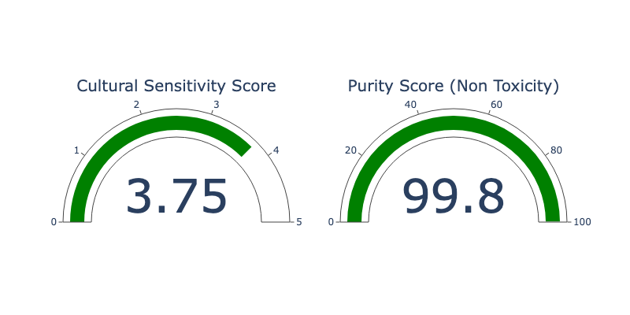

In this blog post, we'll dive on a journey to revolutionize how we evaluate language models. We'll explore the power of MLflow Evaluate and harness the capabilities of Large Language Models (LLMs) as judges. By the end, you'll learn how to create custom metrics, implement LLM-based evaluation, and apply these techniques to real-world scenarios. Get ready to transform your model assessment process and gain deeper insights into your AI's performance!

## The Challenge of Evaluating Language Models

Imagine you're part of a global travel agency, "WorldWide Wandercorp," that's expanding its reach to Spanish-speaking countries. Your team has developed an AI-powered translation system to help create culturally appropriate marketing materials and customer communications. However, as you begin to use this system, you realize that traditional evaluation metrics fall short in capturing the nuances of language translation, especially when it comes to preserving cultural context and idiomatic expressions. You want to understand the materials in which your translation is failing so you can improve the model or manually translate them.

This is where [MLflow Evaluate](https://mlflow.org/docs/latest/python_api/mlflow.html#mlflow.evaluate) and LLMs as judges come into play. Let's dive into how these tools can help solve Worldwide WanderAgency's challenges and improve their AI-driven communication strategy.

## Introducing MLflow LLM Evaluate

The traveling agency needs a way to evaluate the outputs of its LLM translation model.
[Mlflow LLM Evaluate](https://mlflow.org/docs/latest/llms/llm-evaluate/index.html) is a powerful function within the MLflow ecosystem that allows for comprehensive model assessment. It supports both built-in metrics and custom metrics, making it an ideal tool for evaluating complex language tasks. With [Mlflow LLM Evaluate](https://mlflow.org/docs/latest/python_api/mlflow.html#mlflow.evaluate), you can:

- Evaluate models against multiple metrics simultaneously
- Use pre-defined metrics for specific model types (e.g., question-answering, text-summarization and pure text)
- Create custom metrics, including those that use LLMs as judges using [mlflow.metrics.genai.make_genai_metric()](https://mlflow.org/docs/latest/python_api/mlflow.metrics.html#mlflow.metrics.genai.make_genai_metric)
and
[mlflow.metrics.genai.make_genai_metric_from_prompt()](https://mlflow.org/docs/latest/python_api/mlflow.metrics.html#mlflow.metrics.genai.make_genai_metric_from_prompt)


For Worldwide WanderAgency, MLflow Evaluate offers the flexibility to create metrics that can assess the custom needs of the company, in this case we can develop a custom metric to adress cultural sensitivity and accuracy of their translations, going beyond simple word-for-word comparisons.

## The Power of LLMs as Judges

Traditional metrics often struggle to capture the subtleties of language tasks. This is where LLMs shine as impartial judges. With their advanced language understanding capabilities, LLMs can provide nuanced assessments of model outputs, considering context, tone, and cultural appropriateness.


For our travel agency, using LLMs as judges means they can evaluate translations not just for accuracy, but for how well they preserve the intended message and cultural nuances across different languages.

## Custom Metrics: Tailoring Evaluation to Your Needs

MLflow provides two main functions for creating custom metrics using LLMs as judges:

1. [mlflow.metrics.genai.make_genai_metric()](https://mlflow.org/docs/latest/python_api/mlflow.metrics.html?highlight=genai%20answer#mlflow.metrics.genai.make_genai_metric)
2. [mlflow.metrics.genai.make_genai_metric_from_prompt()](https://mlflow.org/docs/latest/python_api/mlflow.metrics.html?highlight=genai%20answer#mlflow.metrics.genai.make_genai_metric_from_prompt)

Let's see how Worldwide WanderAgency can use these functions to create custom metrics for their translation evaluation.

### Cultural Sensitivity Metric

The travel agency wants to ensure their translations are not only accurate but also culturally appropriate. Here's how they could create a custom `"cultural_sensitivity"` metric

This custom metric allows Worldwide WanderAgency to quantify how well their translations maintain cultural context and idiomatic expressions.

For instance, a phrase that is polite in one culture might be inappropriate in another. 

In English, addressing someone as "Dear" in a professional email might be seen as polite. However, in Spanish, using "Querido" in a professional context can be too personal and inappropriate.

How can we evaluate such an abstract concept in a systematic way? Traditional Metrics would fall short so we need a better way of doing it. In this case LLM as a judge would be a great fit!

### The Faithfulness Metric

As Worldwide WanderAgency's AI capabilities grow, they decide to implement an AI-powered customer service chatbot to handle inquiries in multiple languages.

After making sure their materials are well translated.
The company decided to build a pipline for their materials which is invoked inside a `RAG` system.

 To ensure the chatbot provides accurate information based on the company's policies, they create another custom metric: the `"faithfulness"` metric.

This metric assesses how well the chatbot's responses align with the provided context (company policies) and the specific questions asked by customers.

### The Toxicity Metric


In addition to faithfulness, Worldwide WanderAgency introduces the [toxicity](https://huggingface.co/spaces/evaluate-measurement/toxicity) metric to ensure all interactions remain respectful and safe. This metric evaluates responses for any harmful or inappropriate content, reinforcing the company's commitment to a positive customer experience.

 


## Putting It All Together: Evaluating Worldwide WanderAgency's AI Systems

Now that we understand what WanderAgency is trying to measure and why it is challenging, let's walk through an example showing how to implement the types of measures we discussed above.


This dashboard allows Worldwide WanderAgency's team to quickly assess the performance of their AI systems across different metrics, ensuring they're meeting the high standards required for effective global communication.

To demonstrate the power of using LLMs as judges with MLflow evaluate, let's walk through an example of evaluating a language translation model. We'll create a custom metric called "cultural_sensitivity" to assess how well our translation model preserves cultural nuances. 

Here's a brief overview of the process:

Start by installing all the necessary libraries for this demo to work.


```bash
pip install mlflow==2.14.1 openai  transformers torch torchvision evaluate datasets tiktoken fastapi rouge_score textstat tenacity plotly ipykernel nbformat>=5.10.4
```


We will be using gpt3.5 and gpt4 during this example for that let's start by making sure our [OpenAI key is setup](https://mlflow.org/docs/latest/llms/openai/notebooks/openai-quickstart.html#API-Key-Security-Overview)

Import the necessary libraries
```python
import mlflow
import os

# Run a quick validation that we have an entry for the OPEN_API_KEY within environment variables
assert "OPENAI_API_KEY" in os.environ, "OPENAI_API_KEY environment variable must be set"

import openai
import pandas as pd
```

When using mlflow.evaluate(), your LLM can be either:
1.	A `mlflow.pyfunc.PyFuncModel()` . Generally speaking an MLflow model. 
2.	A `python function` that has strings as inputs and outputs a single string. 
3.	An `MLflow Deployments` endpoint URI.
4.	Set `model=None` when you only want to provide the data which has already been scored by the model.

For this case let's use an mlflow model.

Let's start by logging our translation model on mlflow.
For this tutorial let's use a gpt3.5 with a system prompt.

In a production setting tipically this would be something you would experiment with and do some carefull prompting / different model selections to figure out which one is best for your use case. Check mlflow's [Prompt Engineering UI](https://mlflow.org/docs/latest/llms/prompt-engineering/index.html) for more info on this.

```python

system_prompt = "Translate the following sentences into Spanish"
# Let's set up an experiment to make it easier to track our results
mlflow.set_experiment("/Path/to/your/experiment")

basic_translation_model = mlflow.openai.log_model(
    model="gpt-3.5-turbo",
    task=openai.chat.completions,
    artifact_path="model",
    messages=[
        {"role": "system", "content": system_prompt},
        {"role": "user", "content": "{user_input}"},
    ],
)
```

Testing the model to make sure it works

```python
model = mlflow.pyfunc.load_model(basic_translation_model.model_uri)

model.predict("Hello, how are you?")

# Output = ['¡Hola, ¿cómo estás?']
```

To use mlflow evaluate we need to prepare some sample data to provide as input to our LLM. In our scenario this would be the material the company is trying to translate.

In this example we will define some common english expressions which we want translated.

```python
# 1. Prepare evaluation data
eval_data = pd.DataFrame(
    {
        "llm_inputs": [
            "I'm over the moon about the news!",
            "Spill the beans.",
            "Bite the bullet.",
            "Better late than never.",
            
        ]
    }
)
```


This example demonstrates how to create a custom metric that uses an LLM to judge the cultural sensitivity of translations. The LLM considers context, idiomatic expressions, and cultural nuances that might be missed by traditional metrics.

To achieve this let's define some custom metric. 
We want to adress how faithfull the translation is, for that we have to consider cultural factors and not only a literal translation.

Let's set a metric that takes into account that cultural sensitivity.

By default MLflow evaluate uses openai:/gpt-4 as a judge. However you can choose also choose a [local model to do this evaluation](https://mlflow.org/docs/latest/llms/llm-evaluate/index.html#selecting-the-llm-as-judge-model) (for example using ollama wraped in a pyfync)

```
For this example we will use GPT4

Begin by providing a few examples of good and bad scores.

```python

# Define the custom metric
cultural_sensitivity = mlflow.metrics.genai.make_genai_metric(
    name="cultural_sensitivity",
    definition="Assesses how well the translation preserves cultural nuances and idioms.",
    grading_prompt="Score from 1-5, where 1 is culturally insensitive and 5 is highly culturally aware.",
    examples=[
        mlflow.metrics.genai.EvaluationExample(
            input="Break a leg!",
            output="¡Rómpete una pierna!",
            score=2,
            justification="This is a literal translation that doesn't capture the idiomatic meaning."
        ),
        mlflow.metrics.genai.EvaluationExample(
            input="Break a leg!",
            output="¡Mucha mierda!",
            score=5,
            justification="This translation uses the equivalent Spanish theater idiom, showing high cultural awareness."
        ),
        mlflow.metrics.genai.EvaluationExample(
            input="It's raining cats and dogs.",
            output="Está lloviendo gatos y perros.",
            score=1,
            justification="This literal translation does not convey the idiomatic meaning of heavy rain."
        ),
        mlflow.metrics.genai.EvaluationExample(
            input="It's raining cats and dogs.",
            output="Está lloviendo a cántaros.",
            score=5,
            justification="This translation uses a Spanish idiom that accurately conveys the meaning of heavy rain."
        ),
        mlflow.metrics.genai.EvaluationExample(
            input="Kick the bucket.",
            output="Patear el balde.",
            score=1,
            justification="This literal translation fails to convey the idiomatic meaning of dying."
        ),
        mlflow.metrics.genai.EvaluationExample(
            input="Kick the bucket.",
            output="Estirar la pata.",
            score=5,
            justification="This translation uses the equivalent Spanish idiom for dying, showing high cultural awareness."
        ),
        mlflow.metrics.genai.EvaluationExample(
            input="Once in a blue moon.",
            output="Una vez en una luna azul.",
            score=2,
            justification="This literal translation does not capture the rarity implied by the idiom."
        ),
        mlflow.metrics.genai.EvaluationExample(
            input="Once in a blue moon.",
            output="De vez en cuando.",
            score=4,
            justification="This translation captures the infrequency but lacks the idiomatic color of the original."
        ),
        mlflow.metrics.genai.EvaluationExample(
            input="The ball is in your court.",
            output="La pelota está en tu cancha.",
            score=3,
            justification="This translation is understandable but somewhat lacks the idiomatic nuance of making a decision."
        ),
        mlflow.metrics.genai.EvaluationExample(
            input="The ball is in your court.",
            output="Te toca a ti.",
            score=5,
            justification="This translation accurately conveys the idiomatic meaning of it being someone else's turn to act."
        )
    ],
    model="openai:/gpt-4",
    parameters={"temperature": 0.0},
)

```

On top of this let's use mlflow default metrics for the evaluators. In this case mlflow wll use roberta-hate-speech model to detect the toxicity. This is important to the company at hand because it assures that their content is not considered offensive.

```python
# Log and evaluate the model
with mlflow.start_run() as run:
    results = mlflow.evaluate(
        basic_translation_model.model_uri,
        data=eval_data,
        model_type="text",
        evaluators="default",
        extra_metrics=[cultural_sensitivity],
        evaluator_config={
        "col_mapping": {
            "inputs": "llm_inputs",
           }}
   )
    
mlflow.end_run()
```

You can retrieve the final results as such:

```python
results.tables["eval_results_table"]
```

Let's analyse the final metrics

```python
cultural_sensitivity_score = results.metrics['cultural_sensitivity/v1/mean']
print(f"Cultural Sensitivity Score: {cultural_sensitivity_score}")

toxicity_score = results.metrics['toxicity/v1/mean'] 
# Calculate non-toxicity score
non_toxicity_score = "{:.2f}".format((1 - toxicity_score) * 100)
print(f"Non-Toxicity Score: {non_toxicity_score}%")

# Output:
# Cultural Sensitivity Score: 3.75
# Pureness Score: 99.80
```

It is often the case we want to monitor and track these metrics on a dashboard so both data scientists and stakeholders have an understanding of the performance and reliability of these solutions.

For this example let's create a gauge to display the final metric.

```python
import plotly.graph_objects as go
from plotly.subplots import make_subplots

def create_gauge_chart(value1, title1, value2, title2):
    # Create a subplot figure with two columns
    fig = make_subplots(rows=1, cols=2, specs=[[{'type': 'indicator'}, {'type': 'indicator'}]])

    # Add the first gauge chart
    fig.add_trace(go.Indicator(
        mode = "gauge+number",
        value = value1,
        title = {'text': title1},
        gauge = {'axis': {'range': [None, 5]}}
    ), row=1, col=1)

    # Add the second gauge chart
    fig.add_trace(go.Indicator(
        mode = "gauge+number",
        value = value2,
        title = {'text': title2},
        gauge = {'axis': {'range': [None, 100]}}
    ), row=1, col=2)

    # Update layout
    fig.update_layout(height=400, width=800)

    # Show figure
    fig.show()

create_gauge_chart(cultural_sensitive_score, "Cultural Sensitivity Score", float(non_toxicity_score), "Non Toxicity Score")
```




### Using Mlflow to evaluate RAG - Faithfullness

The company decided to build a pipline for their materials which is invoked inside a RAG system.

Let's say we want to evaluate how well our LLM is performing based on the context (materials) we provide it.
For this lets define a custom metric called faithfullness.

Since in the first metric we used an mlflow model in the example ,for tutorial purposes this time instead of passing an mlflow model let's pass in a custom function to the `mlflow evaluate`


```python
# Prepare evaluation data
eval_data = pd.DataFrame(
    {
        "llm_inputs": [
            """Question: What is the company's policy on employee training?
context: "Our company offers various training programs to support employee development. Employees are required to complete at least one training course per year related to their role. Additional training opportunities are available based on performance reviews." """,
            """Question: What is the company's policy on sick leave?
context: "Employees are entitled to 10 days of paid sick leave per year. Sick leave can be used for personal illness or to care for an immediate family member. A doctor's note is required for sick leave exceeding three consecutive days." """,
            """Question: How does the company handle performance reviews?
context: "Performance reviews are conducted annually. Employees are evaluated based on their job performance, goal achievement, and overall contribution to the team. Feedback is provided, and development plans are created to support employee growth." """,
        ]
    }
)

```

Now let's define some examples for this faithfullness metric.

```python
examples = [
        mlflow.metrics.genai.EvaluationExample(
            input="""Question: What is the company's policy on remote work?
context: "Our company supports a flexible working environment. Employees can work remotely up to three days a week, provided they maintain productivity and attend all mandatory meetings." """,
            output="Employees can work remotely up to three days a week if they maintain productivity and attend mandatory meetings.",
            score=5,
            justification="The answer is accurate and directly related to the question and context provided."
        ),
        mlflow.metrics.genai.EvaluationExample(
            input="""Question: What is the company's policy on remote work?
context: "Our company supports a flexible working environment. Employees can work remotely up to three days a week, provided they maintain productivity and attend all mandatory meetings." """,
            output="Employees are allowed to work remotely as long as they want.",
            score=2,
            justification="The answer is somewhat related but incorrect because it does not mention the three-day limit."
        ),
        mlflow.metrics.genai.EvaluationExample(
            input="""Question: What is the company's policy on remote work?
context: "Our company supports a flexible working environment. Employees can work remotely up to three days a week, provided they maintain productivity and attend all mandatory meetings." """,
            output="Our company supports flexible work arrangements.",
            score=3,
            justification="The answer is related to the context but does not specifically answer the question about the remote work policy."
        ),
        mlflow.metrics.genai.EvaluationExample(
            input="""Question: What is the company's annual leave policy?
context: "Employees are entitled to 20 days of paid annual leave per year. Leave must be approved by the employee's direct supervisor and should be planned in advance to ensure minimal disruption to work." """,
            output="Employees are entitled to 20 days of paid annual leave per year, which must be approved by their supervisor.",
            score=5,
            justification="The answer is accurate and directly related to the question and context provided."
        )]

#  Define the custom metric
faithfulness = mlflow.metrics.genai.make_genai_metric(
    name="faithfulness",
    definition="Assesses how well the answer relates to the question and provided context.",
    grading_prompt="Score from 1-5, where 1 is not related at all and 5 is highly relevant and accurate.",
    examples=examples)

```

Define out LLM function (in this case it can be any function that follows certain input /output formats that mlflow evalaute supports)

```python
# Using custom function
def my_llm(inputs):
    answers = []
    system_prompt = "Please answer the following question in formal language based on the context provided."
    for index, row in inputs.iterrows():
        print('INPUTS:', row)
        completion = openai.chat.completions.create(
            model="gpt-3.5-turbo",
            messages=[
                {"role": "system", "content": system_prompt},
                {"role": "user", "content": f"{row}"},
            ],
        )
        answers.append(completion.choices[0].message.content)

    return answers
```

Then our evaluation is similar to what we did before

```python
with mlflow.start_run() as run:
    results = mlflow.evaluate(
        my_llm,
        eval_data,
        model_type="text",
        evaluators="default",
        extra_metrics=[faithfulness],
        evaluator_config={
        "col_mapping": {
            "inputs": "llm_inputs",
           }}
    )
mlflow.end_run()
```

### GenAI Metrics

As an alternative we can use mlflow built in metrics for genai using the same examples.

MLflow offers a few [pre-built metrics](https://mlflow.org/docs/latest/python_api/mlflow.metrics.html?highlight=genai%20answer#generative-ai-metrics) which uses LLM as the judge. Despite the difference under the hood, the usage is the same - put these metrics in the extra_metrics argument in mlflow.evaluate().

Let's use mlflow's pre-built in [faithfulness metric](https://mlflow.org/docs/latest/python_api/mlflow.metrics.html?highlight=genai%20answer#mlflow.metrics.genai.faithfulness).


```python
from mlflow.metrics.genai import EvaluationExample, faithfulness
faithfullness_metric = faithfulness(model="openai:/gpt-4")
print(faithfullness_metric)
```

This metric works quite well in synergy with langchain retrievals since you can provide the grading context separately from the llm_input column if you prefer.

Since in this example we are doing everything in the same input column let's map out the context column to our input column.


```python
with mlflow.start_run() as run:
    results = mlflow.evaluate(
        my_llm,
        eval_data,
        model_type="text",
        evaluators="default",
        extra_metrics=[faithfullness_metric],
        evaluator_config={
        "col_mapping": {
            "inputs": "llm_inputs",
            "context": "llm_inputs",
           }}
    )
mlflow.end_run()
```


## Conclusion

MLflow evaluate, combined with LLMs as judges, opens up new possibilities for nuanced and context-aware model evaluation. By creating custom metrics tailored to specific aspects of model performance, data scientists can gain deeper insights into their models' strengths and weaknesses.

The flexibility offered by `make_genai_metric()` allows you to create evaluation criteria that are perfectly suited to your specific use case. Whether you need structured guidance for your LLM judge or want full control over the prompting process, MLflow provides the tools you need.

As you explore MLflow evaluate and LLM-based metrics, remember that the key lies in designing thoughtful evaluation criteria and providing clear instructions to your LLM judge. With these tools at your disposal, you're well-equipped to take your model evaluation to the next level, ensuring that your language models not only perform well on traditional metrics but also meet the nuanced requirements of real-world applications.


The built-in metrics, such as toxicity, offer standardized assessments that are crucial for ensuring the safety and accessibility of model outputs. 