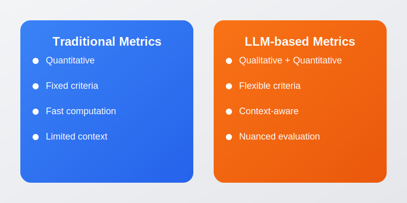

# Leveraging LLMs as Judges: Advanced Model Evaluation with MLflow

## 1. Introduction

In the rapidly evolving field of machine learning, evaluating model performance is crucial. MLflow, an open-source platform for managing the ML lifecycle, offers powerful tools for assessing models comprehensively. In this blog post, we'll explore how to use MLflow evaluate, with a special focus on leveraging Large Language Models (LLMs) as judges for custom evaluation metrics.

## 2. What is MLflow evaluate?

MLflow evaluate is a function that enables you to evaluate machine learning models using various metrics. It supports both built-in metrics and custom metrics, allowing for flexible and thorough model assessment. 

With MLflow evaluate, you can:

- Evaluate models against multiple metrics simultaneously
- Use pre-defined metrics for specific model types (e.g., question-answering, text-summarization)
- Create custom metrics, including those that use LLMs as judges


MLflow LLM Evaluate is a functionality provided by MLflow to assess the performance of Large Language Models (LLMs). It consists of three main components:

- A `model` to evaluate: This can be an MLflow pyfunc model, a URI pointing to a registered MLflow model, or any Python callable representing the model. If you already computed your output then you can re-run multiple evaluations on an already existing LLM output.
- Some `metrics`: These are used to compute the performance of the model. MLflow uses LLM-specific metrics for evaluation.
- Evaluation `data`: This is the data used to evaluate the model, which can be in various formats like pandas DataFrame, Python list, numpy array, or an mlflow.data.dataset.Dataset() instance.

## 3. Why use LLMs as judges?

Traditional metrics often fall short when evaluating complex language tasks. LLMs, with their advanced language understanding capabilities, can act as impartial judges, providing nuanced assessments of model outputs. This is particularly useful for tasks where human-like judgment is beneficial, such as assessing the quality of language translations, the coherence of generated text, or the appropriateness of responses in conversational AI.



In this blog we will focus on use cases where we don't have ground truth avaiable do compare our model's output to.

Consider this real life common example; Companies looking to enhance the professionalism of their customer-facing chatbots can integrate LLMs into their evaluation frameworks. By assessing `professionalism` with attributes such as politeness, clarity, and empathy using custom metrics in MLflow, organizations can fine-tune chatbot responses based on LLM assessments. This approach can lead to improved customer satisfaction and overall interaction quality, contributing to a more positive user experience.

## 4. GenAI Metrics

MLflow offers a few pre-canned metrics which uses LLM as the judge. Despite the difference under the hood, the usage is the same - put these metrics in the extra_metrics argument in mlflow.evaluate(). Here is the list of pre-canned metrics:

1. **mlflow.metrics.genai.answer_similarity()**
   - **Purpose**: Evaluates semantic similarity between model output and ground truth.
   - **Use case**: Ideal for question-answering tasks.
   - **Scoring**: Higher scores indicate greater alignment.

2. **mlflow.metrics.genai.answer_correctness()**
   - **Purpose**: Assesses factual correctness based on ground truth.
   - **Use case**: Crucial for knowledge-based question answering.
   - **Scoring**: Higher scores indicate similarity and factual correctness.

3. **mlflow.metrics.genai.answer_relevance()**
   - **Purpose**: Evaluates output relevance to the input question (ignoring context).
   - **Use case**: Assesses if the model stays on topic.
   - **Scoring**: Higher scores mean more topical relevance.

4. **mlflow.metrics.genai.relevance()**
   - **Purpose**: Measures relevance to both input question and context.
   - **Use case**: Useful for question answering over specific contexts.
   - **Scoring**: Higher scores indicate understanding of question and context.

5. **mlflow.metrics.genai.faithfulness()**
   - **Purpose**: Evaluates output faithfulness to provided context (ignoring question).
   - **Use case**: Important for summarization or information extraction.
   - **Scoring**: Higher scores mean better alignment with context.

## 5. Custom metrics with LLM as judge

MLflow provides two main functions for creating custom metrics using LLMs as judges:

1. `mlflow.metrics.genai.make_genai_metric()`
2. `mlflow.metrics.genai.make_genai_metric_from_prompt()`

Let's explore both of these functions and their use cases.

### 5.1 Using make_genai_metric()

The `make_genai_metric()` function allows you to create a custom metric with more structure and guidance for the LLM judge. You can specify:

- The metric name and definition
- A grading prompt to guide the LLM judge
- Example evaluations for calibration
- The LLM model to use as a judge (e.g., GPT-4)

Here's an example of creating a custom metric for cultural sensitivity in translations:

```python
cultural_sensitivity = mlflow.metrics.genai.make_genai_metric(
    name="cultural_sensitivity",
    definition="Assesses how well the translation preserves cultural nuances and idioms.",
    grading_prompt="Score from 1-5, where 1 is culturally insensitive and 5 is highly culturally aware.",
    examples=[
        mlflow.metrics.genai.EvaluationExample(
            input="Break a leg!",
            output="¡Rómpete una pierna!",
            score=2,
            justification="This is a literal translation that doesn't capture the idiomatic meaning."
        ),
        mlflow.metrics.genai.EvaluationExample(
            input="Every cloud has a silver lining.",
            output="No hay mal que por bien no venga.",
            score=5,
            justification="This translation uses the equivalent Spanish idiom, effectively conveying the same optimistic message, demonstrating high cultural awareness."
        )

    ],
    model="openai:/gpt-4",
    parameters={"temperature": 0.0},
)
```

### 5.2 Using make_genai_metric_from_prompt()

The `make_genai_metric_from_prompt()` function provides more flexibility by allowing you to define the entire prompt for the LLM judge. This can be useful for use cases that are not covered by the full grading prompt in any `EvaluationModel` version. Here's the function signature:

```python
mlflow.metrics.genai.make_genai_metric_from_prompt(
    name: str,
    judge_prompt: Optional[str] = None,
    model: Optional[str] = 'openai:/gpt-4',
    parameters: Optional[Dict[str, Any]] = None,
    aggregations: Optional[List[str]] = ['mean', 'variance', 'p90'],
    greater_is_better: bool = True,
    max_workers: int = 10,
    metric_metadata: Optional[Dict[str, Any]] = None
) → mlflow.models.evaluation.base.EvaluationMetric
```

Here's an example of creating a custom metric for ease of understanding using this function:

```python
from mlflow.metrics.genai import make_genai_metric_from_prompt

ease_of_understanding = make_genai_metric_from_prompt(
    name="ease_of_understanding",
    judge_prompt=(
        "You must evaluate the output of a bot based on how easy it is to "
        "understand its outputs. "
        "Evaluate the bot's output from the perspective of a layperson. "
        "The bot was provided with this input: {input} and this output: {output}. "
        "Rate the ease of understanding on a scale from 1 to 5, where 1 is very difficult "
        "to understand and 5 is very easy to understand. "
        "Provide your rating as a single number between 1 and 5."
    ),
    model="openai:/gpt-4",
    parameters={"temperature": 0.0},
    aggregations=["mean", "variance", "p90"],
    greater_is_better=True,
)
```

This approach gives you more control over the exact instructions given to the LLM judge, allowing for more specialized evaluation criteria.

# 6. Selecting the LLMs 

In order to evaluate your LLM with mlflow.evaluate(), your LLM has to be one of the following type:
1.	A `mlflow.pyfunc.PyFuncModel()` instance or a URI pointing to a logged mlflow.pyfunc.PyFuncModel model. In general we call that MLflow model. The
2.	A `python function` that takes in string inputs and outputs a single string. 
3.	An `MLflow Deployments` endpoint URI pointing to a local MLflow Deployments Server, Databricks Foundation Models API, and External Models in Databricks Model Serving.
4.	Set `model=None`, and put model outputs in data. Only applicable when the data is a Pandas dataframe.

# 7. Selecting the judge
By default MLflow evaluate uses openai:/gpt-4 as a judge. However you can choose also choose a local model to do this evaluation (for example using ollama wraped in a pyfync)

```python
To use an endpoint hosted by a local MLflow Deployments Server, you can use the following code.
from mlflow.deployments import set_deployments_target

set_deployments_target("http://localhost:5000")
my_answer_similarity = mlflow.metrics.genai.answer_similarity(
    model="endpoints:/my-endpoint"
)

```

# 9. Mock Industry Example: Enhancing Translation Quality Using LLMs
In this blog we will be doing a simplified version of a mock industry use case.


### Example: Improving Translation Accuracy and Cultural Appropriateness

Imagine a travel agency aimed to improve the accuracy and cultural appropriateness of their translations to effectively communicate with international clients. They integrated LLMs into their evaluation framework to ensure translations captured cultural nuances and conveyed messages accurately across languages.

### Case Study:

#### Objective:

The objective was to enhance the quality of translations to provide accurate and culturally appropriate content for international clients, ensuring clarity and context-specific accuracy.

#### Methodology:

1. **Data Collection:**
   - The travel agency curated a diverse dataset of travel-related content, including promotional materials and customer communications, in multiple languages.

2. **Custom Metrics:**
   - Custom evaluation metrics were developed using the LLM. These metrics included scores for translation accuracy, cultural appropriateness, and naturalness.

#### Implementation:

1. **MLflow Integration:**
   - The custom metrics were integrated into the MLflow evaluation framework. This facilitated continuous monitoring and improvement of translation quality across different languages.

2. **Feedback Loop:**
   - Evaluation results from the LLM were utilized iteratively to refine translation algorithms and ensure consistent quality and accuracy in communications.

#### Results:

1. **Cultural Sensitivity:**
   - The LLM identified translations that required adjustments to better align with cultural norms and preferences, enhancing the agency's messaging for diverse audiences.

2. **Contextual Accuracy:**
   - By leveraging LLM-based contextual analysis, the travel agency ensured that translations accurately conveyed intended meanings in various travel contexts.

3. **Quality Assurance:**
   - Integration of LLMs provided robust quality assurance for translations, reducing errors and enhancing communication effectiveness with international clientele.

#### Outcome:

Integrating LLMs into their translation evaluation process significantly elevated the travel agency's ability to deliver accurate, culturally appropriate content to international clients. This improvement not only strengthened client communication but also enhanced the agency's reputation for providing high-quality service across global markets.

# 10. Code Walktrough

To demonstrate the power of using LLMs as judges with MLflow evaluate, let's walk through an example of evaluating a language translation model. We'll create a custom metric called "cultural_sensitivity" to assess how well our translation model preserves cultural nuances. 

For the full code example, please refer to the accompanying notebook. Here's a brief overview of the process:

start by installing all the necessary libraries for this demo to work.
Since mlflow evaluate offers some default metrics we need to install the libraries to calculate those metrics (toxiticy etc..)

```python
!pip install mlflow==2.14.1 openai  transformers torch torchvision evaluate datasets openai tiktoken fastapi rouge_score textstat tenacity plotly ipykernel nbformat==5.10.4

!pip install --upgrade nbformat
```


We will be using gpt3.5 and gpt4 during this example for that let's start by setting up an open ai key
```python
%env OPENAI_API_KEY=<your-api-key>
```

Import the necessary libraries
```python
import mlflow
import os
# Run a quick validation that we have an entry for the OPEN_API_KEY within environment variables
assert "OPENAI_API_KEY" in os.environ, "OPENAI_API_KEY environment variable must be set"

import openai
import pandas as pd
```


Let's start by logging our translation model on mlflow.
For this tutorial let's use a gpt3.5 with a system prompt

```python

system_prompt = "Translate the following sentences into Spanish"
basic_translation_model = mlflow.openai.log_model(
    model="gpt-3.5-turbo",
    task=openai.chat.completions,
    artifact_path="model",
    messages=[
        {"role": "system", "content": system_prompt},
        {"role": "user", "content": "{user_input}"},
    ],
)
```

Testing the model to make sure it works

```python
model = mlflow.pyfunc.load_model(basic_translation_model.model_uri)

model.predict("Hello, how are you?")

# Output = ['¡Hola, ¿cómo estás?']
```

To use mlflow evaluate we need to prepare some data to provide as input to our LLM.
In this example we will define some common english expressions which we want translated.

```python
# 1. Prepare evaluation data
eval_data = pd.DataFrame(
    {
        "llm_inputs": [
            "I'm over the moon about the news!",
            "Spill the beans.",
            "Bite the bullet.",
            "Better late than never.",
            
        ]
    }
)
```

This example demonstrates how to create a custom metric that uses an LLM to judge the cultural sensitivity of translations. The LLM considers context, idiomatic expressions, and cultural nuances that might be missed by traditional metrics.

To achieve this let's define some custom metric. 
We want to adress how faithfull the translation is, for that we have to consider cultural factors and not only a literal translation.

Let's set a metric that takes into account that cultural sensitivity.

Begin by providing a few examples of good and bad scores.

```python

# 2. Define the custom metric
cultural_sensitivity = mlflow.metrics.genai.make_genai_metric(
    name="cultural_sensitivity",
    definition="Assesses how well the translation preserves cultural nuances and idioms.",
    grading_prompt="Score from 1-5, where 1 is culturally insensitive and 5 is highly culturally aware.",
    examples=[
        mlflow.metrics.genai.EvaluationExample(
            input="Break a leg!",
            output="¡Rómpete una pierna!",
            score=2,
            justification="This is a literal translation that doesn't capture the idiomatic meaning."
        ),
        mlflow.metrics.genai.EvaluationExample(
            input="Break a leg!",
            output="¡Mucha mierda!",
            score=5,
            justification="This translation uses the equivalent Spanish theater idiom, showing high cultural awareness."
        ),
        mlflow.metrics.genai.EvaluationExample(
            input="It's raining cats and dogs.",
            output="Está lloviendo gatos y perros.",
            score=1,
            justification="This literal translation does not convey the idiomatic meaning of heavy rain."
        ),
        mlflow.metrics.genai.EvaluationExample(
            input="It's raining cats and dogs.",
            output="Está lloviendo a cántaros.",
            score=5,
            justification="This translation uses a Spanish idiom that accurately conveys the meaning of heavy rain."
        ),
        mlflow.metrics.genai.EvaluationExample(
            input="Kick the bucket.",
            output="Patear el balde.",
            score=1,
            justification="This literal translation fails to convey the idiomatic meaning of dying."
        ),
        mlflow.metrics.genai.EvaluationExample(
            input="Kick the bucket.",
            output="Estirar la pata.",
            score=5,
            justification="This translation uses the equivalent Spanish idiom for dying, showing high cultural awareness."
        ),
        mlflow.metrics.genai.EvaluationExample(
            input="Once in a blue moon.",
            output="Una vez en una luna azul.",
            score=2,
            justification="This literal translation does not capture the rarity implied by the idiom."
        ),
        mlflow.metrics.genai.EvaluationExample(
            input="Once in a blue moon.",
            output="De vez en cuando.",
            score=4,
            justification="This translation captures the infrequency but lacks the idiomatic color of the original."
        ),
        mlflow.metrics.genai.EvaluationExample(
            input="The ball is in your court.",
            output="La pelota está en tu cancha.",
            score=3,
            justification="This translation is understandable but somewhat lacks the idiomatic nuance of making a decision."
        ),
        mlflow.metrics.genai.EvaluationExample(
            input="The ball is in your court.",
            output="Te toca a ti.",
            score=5,
            justification="This translation accurately conveys the idiomatic meaning of it being someone else's turn to act."
        )
    ],
    model="openai:/gpt-4",
    parameters={"temperature": 0.0},
)

```

On top of this let's use mlflow default metrics for the evaluators. In this case mlflow wll use roberta-hate-speech model to detect the toxicity

```python
# 3. Log and evaluate the model
with mlflow.start_run() as run:
    results = mlflow.evaluate(
        basic_translation_model.model_uri,
        data=eval_data,
        model_type="text",
        evaluators="default",
        extra_metrics=[cultural_sensitivity],
        evaluator_config={
        "col_mapping": {
            "inputs": "llm_inputs",
           }}
   )
    
mlflow.end_run()
```

You can retrieve the final results as such:

```python
results.tables["eval_results_table"]
```

Let's analyse the final metrics

```python
cultural_sensitive_score = results.metrics['cultural_sensitivity/v1/mean']
print(f"Cultural Sensitivity Score: {cultural_sensitive_score}")

toxicity_score = results.metrics['toxicity/v1/mean'] 
# Calculate pureness score
purity_score = "{:.2f}".format((1 - toxicity_score) * 100)
print(f"Pureness Score: {purity_score}%")

# Output:
# Cultural Sensitivity Score: 3.75
# Pureness Score: 99.80
```

It is often the case we want to monitor and track these metrics on a dashboard per say so both data scientists and stakeholders have an understanding of the performance and reliability of these solutions.

For this example let's create a guage to display the final metric.

```python
import plotly.graph_objects as go
from plotly.subplots import make_subplots

def create_gauge_chart(value1, title1, value2, title2):
    # Create a subplot figure with two columns
    fig = make_subplots(rows=1, cols=2, specs=[[{'type': 'indicator'}, {'type': 'indicator'}]])

    # Add the first gauge chart
    fig.add_trace(go.Indicator(
        mode = "gauge+number",
        value = value1,
        title = {'text': title1},
        gauge = {'axis': {'range': [None, 5]}}
    ), row=1, col=1)

    # Add the second gauge chart
    fig.add_trace(go.Indicator(
        mode = "gauge+number",
        value = value2,
        title = {'text': title2},
        gauge = {'axis': {'range': [None, 100]}}
    ), row=1, col=2)

    # Update layout
    fig.update_layout(height=400, width=800)

    # Show figure
    fig.show()

create_gauge_chart(cultural_sensitive_score, "Cultural Sensitivity Score", float(purity_score), "Purity Score (Non Toxicity)")
```


### Second Example - Faithfullness
Let's say we want to evaluate how well our LLM is performing based on the context we provide it.
For this lets define a custom metric called faithfullness

For this example instead of passing an mlflow model let's pass in a custom function to the `mlflow evaluate`

Begin by preparing the data as before. In this example let's consider an HR policies bot that will recieve some context inside the prompt retrieved by a RAG pipeline.

```python
# 1. Prepare evaluation data
eval_data = pd.DataFrame(
    {
        "llm_inputs": [
            """Question: What is the company's policy on employee training?
context: "Our company offers various training programs to support employee development. Employees are required to complete at least one training course per year related to their role. Additional training opportunities are available based on performance reviews." """,
            """Question: What is the company's policy on sick leave?
context: "Employees are entitled to 10 days of paid sick leave per year. Sick leave can be used for personal illness or to care for an immediate family member. A doctor's note is required for sick leave exceeding three consecutive days." """,
            """Question: How does the company handle performance reviews?
context: "Performance reviews are conducted annually. Employees are evaluated based on their job performance, goal achievement, and overall contribution to the team. Feedback is provided, and development plans are created to support employee growth." """,
        ]
    }
)

```

Now let's define some examples for this faithfullness metric.

```python
examples = [
        mlflow.metrics.genai.EvaluationExample(
            input="""Question: What is the company's policy on remote work?
context: "Our company supports a flexible working environment. Employees can work remotely up to three days a week, provided they maintain productivity and attend all mandatory meetings." """,
            output="Employees can work remotely up to three days a week if they maintain productivity and attend mandatory meetings.",
            score=5,
            justification="The answer is accurate and directly related to the question and context provided."
        ),
        mlflow.metrics.genai.EvaluationExample(
            input="""Question: What is the company's policy on remote work?
context: "Our company supports a flexible working environment. Employees can work remotely up to three days a week, provided they maintain productivity and attend all mandatory meetings." """,
            output="Employees are allowed to work remotely as long as they want.",
            score=2,
            justification="The answer is somewhat related but incorrect because it does not mention the three-day limit."
        ),
        mlflow.metrics.genai.EvaluationExample(
            input="""Question: What is the company's policy on remote work?
context: "Our company supports a flexible working environment. Employees can work remotely up to three days a week, provided they maintain productivity and attend all mandatory meetings." """,
            output="Our company supports flexible work arrangements.",
            score=3,
            justification="The answer is related to the context but does not specifically answer the question about the remote work policy."
        ),
        mlflow.metrics.genai.EvaluationExample(
            input="""Question: What is the company's annual leave policy?
context: "Employees are entitled to 20 days of paid annual leave per year. Leave must be approved by the employee's direct supervisor and should be planned in advance to ensure minimal disruption to work." """,
            output="Employees are entitled to 20 days of paid annual leave per year, which must be approved by their supervisor.",
            score=5,
            justification="The answer is accurate and directly related to the question and context provided."
        )]

# 2. Define the custom metric
faithfulness = mlflow.metrics.genai.make_genai_metric(
    name="faithfulness",
    definition="Assesses how well the answer relates to the question and provided context.",
    grading_prompt="Score from 1-5, where 1 is not related at all and 5 is highly relevant and accurate.",
    examples=examples)

```

Define out LLM function (in this case it can be any function that follows certain input /output formats that mlflow evalaute supports)

```python
# Using custom function
def my_llm(inputs):
    answers = []
    system_prompt = "Please answer the following question in formal language based on the context provided."
    for index, row in inputs.iterrows():
        print('INPUTS:', row)
        completion = openai.chat.completions.create(
            model="gpt-3.5-turbo",
            messages=[
                {"role": "system", "content": system_prompt},
                {"role": "user", "content": f"{row}"},
            ],
        )
        answers.append(completion.choices[0].message.content)

    return answers
```

Then our evaluation is similar to what we did before

```python
with mlflow.start_run() as run:
    results = mlflow.evaluate(
        my_llm,
        eval_data,
        model_type="text",
        evaluators="default",
        extra_metrics=[faithfulness],
        evaluator_config={
        "col_mapping": {
            "inputs": "llm_inputs",
           }}
    )
mlflow.end_run()
```

As an alternative we can use mlflow built in metrics for genai using the same examples.

```python
from mlflow.metrics.genai import EvaluationExample, faithfulness
faithfullness_metric = faithfulness(model="openai:/gpt-4")
print(faithfullness_metric)
```

This metric works quite well in singery with langchain retrivals since you can provide the grading context seperatly from the llm_input column if you prefer.

Since in this example we are doing everything in the same input column let's map out the context column to our input column.


```python
with mlflow.start_run() as run:
    results = mlflow.evaluate(
        my_llm,
        eval_data,
        model_type="text",
        evaluators="default",
        extra_metrics=[faithfullness_metric],
        evaluator_config={
        "col_mapping": {
            "inputs": "llm_inputs",
            "context": "llm_inputs",
           }}
    )
mlflow.end_run()
```


## 6. Conclusion

MLflow evaluate, combined with LLMs as judges, opens up new possibilities for nuanced and context-aware model evaluation. By creating custom metrics tailored to specific aspects of model performance, data scientists can gain deeper insights into their models' strengths and weaknesses.

The flexibility offered by `make_genai_metric()` allows you to create evaluation criteria that are perfectly suited to your specific use case. Whether you need structured guidance for your LLM judge or want full control over the prompting process, MLflow provides the tools you need.

As you explore MLflow evaluate and LLM-based metrics, remember that the key lies in designing thoughtful evaluation criteria and providing clear instructions to your LLM judge. With these tools at your disposal, you're well-equipped to take your model evaluation to the next level, ensuring that your language models not only perform well on traditional metrics but also meet the nuanced requirements of real-world applications.


The built-in metrics, such as toxicity, offer standardized assessments that are crucial for ensuring the safety and accessibility of model outputs. 
 s