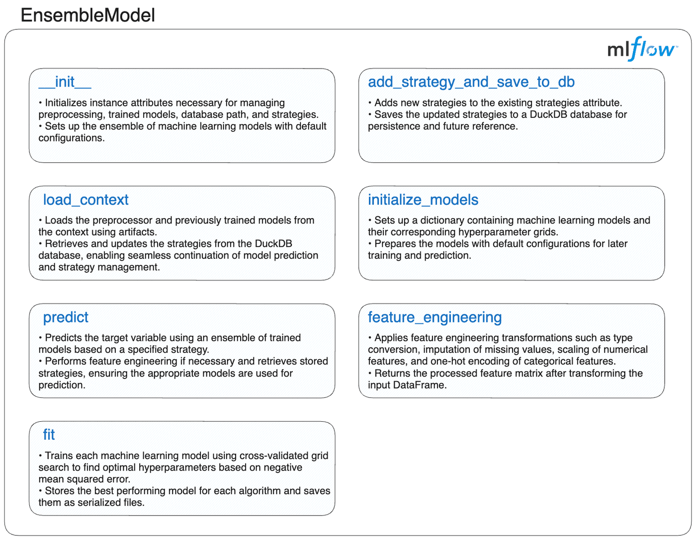
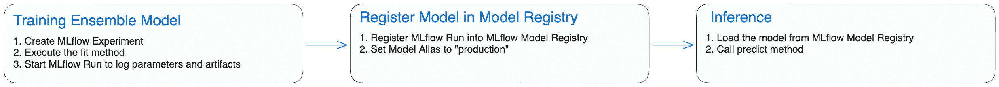
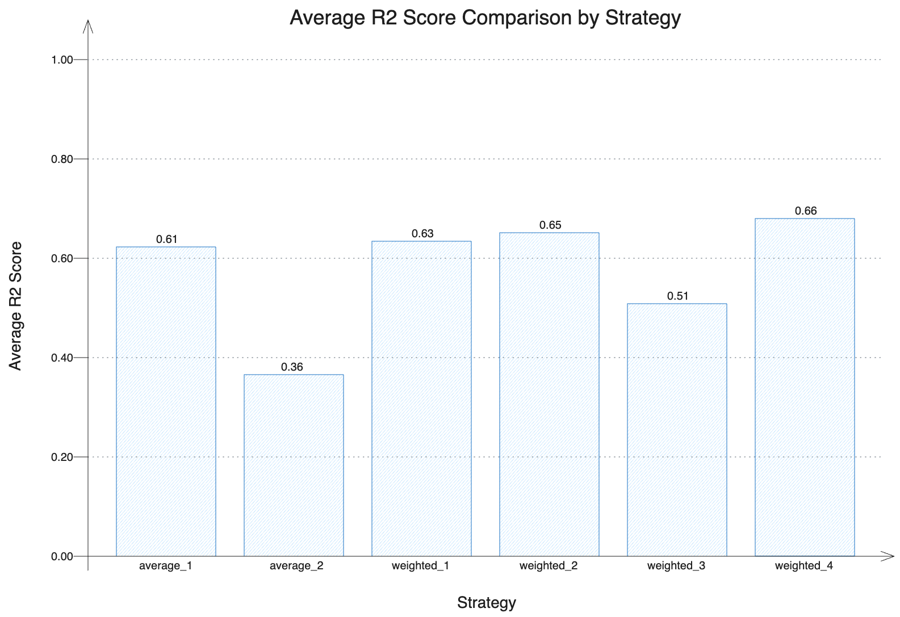

If you're looking to fully leverage the capabilities of `mlflow.pyfunc`  and understand how it can be utilized in a Machine Learning project, this blog post will guide you through the process. MLflow PyFunc offers creative freedom and flexibility, allowing the development of complex systems encapsulated as models in MLflow that follow the same lifecycle as traditional ones. This blog will showcase how to create multi-model setups, seamlessly connect to databases, and implement your own custom fit method in your MLflow PyFunc model.

<!-- truncate -->

## Introduction

This blog post demonstrates the capabilities of [MLflow PyFunc](https://mlflow.org/docs/latest/python_api/mlflow.pyfunc.html) and how it can be utilized to build a multi-model setup encapsulated as a PyFunc flavor model in MLflow. This approach allows ensemble models to follow the same lifecycle as traditional [Built-In Model Flavors](https://mlflow.org/docs/latest/models.html#built-in-model-flavors) in MLflow.

But first, let's use an analogy to get you familiarized with the concept of ensemble models and why you should consider this solution in your next Machine Learning project.

Imagine you are in the market to buy a house. Would you make a decision based solely on the first house you visit and the advice of a single real estate agent? Of course not! The process of buying a house involves considering multiple factors and gathering information from various sources to make an informed decision.

The house buying process explained:
- **Identify Your Needs**: Determine whether you want a new or used house, the type of house, the model, and the year of construction.
- **Research**: Look for a list of available houses, check for discounts and offers, read customer reviews, and seek opinions from friends and family.
- **Evaluate**: Consider the performance, location, neighborhood amenities, and price range.
- **Compare**: Compare multiple houses to find the best fit for your needs and budget.

In short, you wouldn’t directly reach a conclusion but would instead make a decision considering all the aforementioned factors before deciding on the best choice.

Ensemble models in Machine Learning operate on a similar idea. Ensemble learning helps improve Machine Learning results by combining several models to improve predictive performance compared to a single model. The performance increase can be due to several factors such as the reduction in variance by averaging multiple models or reducing bias by focusing on errors of previous models. There are several types of ensemble learning techniques exists such as:
- **Averaging**
- **Weighted Averaging**
- **Bagging**
- **Boosting**
- **Stacking**

However, developing such systems requires careful management of the lifecycle of ensemble models, as integrating diverse models can be highly complex. This is where MLflow PyFunc becomes invaluable. It offers the flexibility to build complex systems, treating the entire ensemble as a model that adheres to the same lifecycle processes as traditional models. Essentially, MLflow PyFunc allows the creation of custom methods tailored to ensemble models, serving as an alternative to the built-in MLflow flavors available for popular frameworks such as scikit-learn, PyTorch, and LangChain.

This blog utilizes the house price dataset from [Kaggle](https://www.kaggle.com/) to demonstrate the development and management of ensemble models through MLflow.

We will leverage various tools and technologies to highlight the capabilities of MLflow PyFunc models. Before delving into the ensemble model itself, we will explore how these components integrate to create a robust and efficient Machine Learning pipeline.

### Components of the Project

**DuckDB**  
DuckDB is a high-performance analytical database system designed to be fast, reliable, portable, and easy to use. In this project, it showcases the integration of a database connection within the model context, facilitating efficient data handling directly within the model. [Learn more about DuckDB](https://duckdb.org/).

**scikit-learn (sklearn)**  
scikit-learn is a Machine Learning library for Python that provides efficient tools for data analysis and modelling. In this project, it is used to develop and evaluate various Machine Learning models that are integrated into our ensemble model. [Learn more about scikit-learn](https://scikit-learn.org/).

**MLflow**  
MLflow is an open-source platform for managing the end-to-end Machine Learning lifecycle, including experimentation, reproducibility, and deployment. In this project, it tracks experiments, manages model versions, and facilitates the deployment of MLflow PyFunc models in a similar manner to how we are familiar with individual flavors. [Learn more about MLflow](https://mlflow.org/).

> **Note:** To reproduce this project, please refer to the official MLflow documentation for more details on setting up a simple local [MLflow Tracking Server](https://mlflow.org/docs/latest/tracking/server.html).

## Creating the Ensemble Model

Creating a MLflow PyFunc ensemble model requires additional steps compared to using the built-in flavors for logging and working with popular Machine Learning frameworks.

To implement an ensemble model, you need to define an `mlflow.pyfunc` model, which involves creating a Python class that inherits from the `PythonModel` class and implementing its constructor and class methods. While the basic creation of a PyFunc model only requires implementing the `predict` method, an ensemble model requires additional methods to manage the models and obtain multi-model predictions. After instantiating the ensemble model, you must use the custom `fit` method to train the ensemble model's sub-models. Similar to an out-of-the-box MLflow model, you need to log the model along with its artifacts during the training run and then register the model in the MLflow Model Registry. A model alias `production` will also be added to the model to streamline both model updates and inference. Model aliases allow you to assign a mutable, named reference to a specific version of a registered model. By assigning the alias to a particular model version, it can be easily referenced via a model URI or the model registry API. This setup allows for seamless updates to the model version used for inference without changing the serving workload code. For more details, refer to [Deploy and Organize Models with Aliases and Tags](https://mlflow.org/docs/latest/model-registry.html#deploy-and-organize-models-with-aliases-and-tags).

The following sections, as depicted in the diagram, detail the implementation of each method for the ensemble model, providing a comprehensive understanding of defining, managing, and utilizing an ensemble model with MLflow PyFunc.



Before delving into the detailed implementation of each method, let's first review the skeleton of our `EnsembleModel` class. This skeleton serves as a blueprint for understanding the structure of the ensemble model. The subsequent sections will provide an overview and code for both the default methods provided by MLflow PyFunc and the custom methods implemented for the ensemble model.

Here is the skeleton of the `EnsembleModel` class:

```python
import mlflow

class EnsembleModel(mlflow.pyfunc.PythonModel):
    """Ensemble model class leveraging Pyfunc for multi-model integration in MLflow."""

    def __init__(self):
        """Initialize the EnsembleModel instance."""
        ...

    def add_strategy_and_save_to_db(self):
        """Add strategies to the DuckDB database."""
        ...

    def feature_engineering(self):
        """Perform feature engineering on input data."""
        ...

    def initialize_models(self):
        """Initialize models and their hyperparameter grids."""
        ...

    def fit(self):
        """Train the ensemble of models."""
        ...

    def predict(self):
        """Predict using the ensemble of models."""
        ...

    def load_context(self):
        """Load the preprocessor and models from the MLflow context."""
        ...
```

### Initializing the EnsembleModel

The constructor method in the ensemble model is crucial for setting up its essential elements. It establishes key attributes such as the preprocessor, a dictionary to store trained models, the path to a DuckDB database, and a pandas DataFrame for managing different ensemble strategies. Additionally, it takes advantage of the `initialize_models` method to define the sub-models integrated into the ensemble.

```python
import pandas as pd

def __init__(self):
    """
    Initializes the EnsembleModel instance.

    Sets up an empty preprocessing pipeline, a dictionary for fitted models,
    and a DataFrame to store strategies. Also calls the method to initialize sub-models.
    """
    self.preprocessor = None
    self.fitted_models = {}
    self.db_path = None
    self.strategies = pd.DataFrame(columns=["strategy", "model_list", "weights"])
    self.initialize_models()
```

### Adding Strategies and Saving to the Database

The custom-defined `add_strategy_and_save_to_db` method enables the addition of new ensemble strategies to the model and their storage in a DuckDB database. This method accepts a pandas DataFrame containing the strategies and the database path as inputs. It appends the new strategies to the existing ones and saves them in the database specified during the initialization of the ensemble model. This method facilitates the management of various ensemble strategies and ensures their persistent storage for future use.

```python
import duckdb
import pandas as pd

def add_strategy_and_save_to_db(self, strategy_df: pd.DataFrame, db_path: str) -> None:
    """Add strategies from a DataFrame and save them to the DuckDB database.

    Args:
        strategy_df (pd.DataFrame): DataFrame containing strategies.
        db_path (str): Path to the DuckDB database.
    """
    # Update the instance-level database path for the current object
    self.db_path = db_path

    # Attempt to concatenate new strategies with the existing DataFrame
    try:
        self.strategies = pd.concat([self.strategies, strategy_df], ignore_index=True)
    except Exception as e:
        # Print an error message if any exceptions occur during concatenation
        print(f"Error concatenating DataFrames: {e}")
        return  # Exit early to prevent further errors

    # Use context manager for the database connection
    try:
        with duckdb.connect(self.db_path) as con:
            # Register the strategies DataFrame as a temporary table in DuckDB
            con.register("strategy_df", self.strategies)

            # Drop any existing strategies table and create a new one with updated strategies
            con.execute("DROP TABLE IF EXISTS strategies")
            con.execute("CREATE TABLE strategies AS SELECT * FROM strategy_df")
    except Exception as e:
        # Print an error message if any exceptions occur during database operations
        print(f"Error executing database operations: {e}")
```

The following example demonstrates how to use this method to add strategies to the database.

```python
import pandas as pd

# Initialize ensemble model
ensemble_model = EnsembleModel()

# Define strategies for the ensemble model
strategy_data = {
    "strategy": ["average_1"],
    "model_list": ["random_forest,xgboost,decision_tree,gradient_boosting,adaboost"],
    "weights": ["1"],
}

# Create a DataFrame to hold the strategy information
strategies_df = pd.DataFrame(strategy_data)

# Add strategies to the database
ensemble_model.add_strategy_and_save_to_db(strategies_df, "models/strategies.db")
```

The DataFrame `strategy_data` includes:

- **strategy**: The name of the strategy for model predictions.
- **model_list**: A comma-separated list of model names included in the strategy.
- **weights**: A comma-separated list of weights assigned to each model in the `model_list`. If not provided, implies equal weights or default values.

| strategy  | model_list                                                     | weights |
| ----------| -------------------------------------------------------------- | ------- |
| average_1 | random_forest,xgboost,decision_tree,gradient_boosting,adaboost | 1       |

### Feature Engineering

The `feature_engineering` method preprocesses input data by handling missing values, scaling numerical features, and encoding categorical features. It applies different transformations to both numerical and categorical features, and returns the processed features as a NumPy array. This method is crucial for preparing data in a suitable format for model training, ensuring consistency and enhancing model performance.

```python
import numpy as np
import pandas as pd
from sklearn.compose import ColumnTransformer
from sklearn.impute import SimpleImputer
from sklearn.pipeline import Pipeline
from sklearn.preprocessing import OneHotEncoder, StandardScaler

def feature_engineering(self, X: pd.DataFrame) -> np.ndarray:
    """
    Applies feature engineering to the input data X, including imputation, scaling, and encoding.

    Args:
        X (pd.DataFrame): Input features with potential categorical and numerical columns.

    Returns:
        np.ndarray: Processed feature array after transformations.
    """
    # Convert columns with 'object' dtype to 'category' dtype for proper handling of categorical features
    X = X.apply(
        lambda col: col.astype("category") if col.dtypes == "object" else col
    )

    # Identify categorical and numerical features from the DataFrame
    categorical_features = X.select_dtypes(include=["category"]).columns
    numerical_features = X.select_dtypes(include=["number"]).columns

    # Define the pipeline for numerical features: imputation followed by scaling
    numeric_transformer = Pipeline(
        steps=[
            (
                "imputer",
                SimpleImputer(strategy="median"),
            ),  # Replace missing values with the median
            (
                "scaler",
                StandardScaler(),
            ),  # Standardize features by removing the mean and scaling to unit variance
        ]
    )

    # Define the pipeline for categorical features: imputation followed by one-hot encoding
    categorical_transformer = Pipeline(
        steps=[
            (
                "imputer",
                SimpleImputer(strategy="most_frequent"),
            ),  # Replace missing values with the most frequent value
            (
                "onehot",
                OneHotEncoder(handle_unknown="ignore"),
            ),  # Encode categorical features as a one-hot numeric array
        ]
    )

    # Create a ColumnTransformer to apply the appropriate pipelines to the respective feature types
    preprocessor = ColumnTransformer(
        transformers=[
            (
                "num",
                numeric_transformer,
                numerical_features,
            ),  # Apply the numeric pipeline to numerical features
            (
                "cat",
                categorical_transformer,
                categorical_features,
            ),  # Apply the categorical pipeline to categorical features
        ]
    )

    # Fit and transform the input data using the preprocessor
    X_processed = preprocessor.fit_transform(X)

    # Store the preprocessor for future use in the predict method
    self.preprocessor = preprocessor
    return X_processed
```

### Initializing Models

The `initialize_models` method sets up a dictionary of various Machine Learning models along with their hyperparameter grids. This includes models such as `RandomForest`, `XGBoost`, `DecisionTree`, `GradientBoosting`, and `AdaBoost`. This step is crucial for preparing the ensemble’s sub-models and specifying the hyperparameters to adjust during training, ensuring that each model is configured correctly and ready for training.

```python
from sklearn.ensemble import (
    AdaBoostRegressor,
    GradientBoostingRegressor,
    RandomForestRegressor,
)
from sklearn.tree import DecisionTreeRegressor
from xgboost import XGBRegressor

def initialize_models(self) -> None:
    """
    Initializes a dictionary of models along with their hyperparameter grids for grid search.
    """
    # Define various regression models with their respective hyperparameter grids for tuning
    self.models = {
        "random_forest": (
            RandomForestRegressor(random_state=42),
            {"n_estimators": [50, 100, 200], "max_depth": [None, 10, 20]},
        ),
        "xgboost": (
            XGBRegressor(random_state=42),
            {"n_estimators": [50, 100, 200], "max_depth": [3, 6, 10]},
        ),
        "decision_tree": (
            DecisionTreeRegressor(random_state=42),
            {"max_depth": [None, 10, 20]},
        ),
        "gradient_boosting": (
            GradientBoostingRegressor(random_state=42),
            {"n_estimators": [50, 100, 200], "max_depth": [3, 5, 7]},
        ),
        "adaboost": (
            AdaBoostRegressor(random_state=42),
            {"n_estimators": [50, 100, 200], "learning_rate": [0.01, 0.1, 1.0]},
        ),
    }
```

### Defining a Custom `fit` Method to Train and Save Multi-Models

As already highlighted in the previous method, a key feature of MLflow PyFunc models is the ability to define custom methods, providing significant flexibility and customization for various tasks. In the multi-model PyFunc setup, the `fit` method is essential for customizing and optimizing multiple sub-models. It manages the training and fine-tuning of algorithms such as `RandomForestRegressor`, `XGBRegressor`, `DecisionTreeRegressor`, `GradientBoostingRegressor`, and `AdaBoostRegressor`. For demonstration purposes, Grid Search is used, which, while straightforward, can be computationally intensive and time-consuming, especially for ensemble models. To enhance efficiency, advanced optimization methods such as Bayesian optimization are recommended. Tools like [Optuna](https://optuna.org/) and [Hyperopt](https://hyperopt.github.io/hyperopt/) leverage probabilistic models to intelligently navigate the search space, significantly reducing the number of evaluations needed to identify optimal configurations.

```python
import os

import joblib
import pandas as pd
from sklearn.model_selection import GridSearchCV

def fit(
        self, X_train_processed: pd.DataFrame, y_train: pd.Series, save_path: str
    ) -> None:
    """
    Trains the ensemble of models using the provided preprocessed training data.

    Args:
        X_train_processed (pd.DataFrame): Preprocessed feature matrix for training.
        y_train (pd.Series): Target variable for training.
        save_path (str): Directory path where trained models will be saved.
    """
    # Create the directory for saving models if it does not exist
    os.makedirs(save_path, exist_ok=True)

    # Iterate over each model and its parameter grid
    for model_name, (model, param_grid) in self.models.items():
        # Perform GridSearchCV to find the best hyperparameters for the current model
        grid_search = GridSearchCV(
            model, param_grid, cv=5, n_jobs=-1, scoring="neg_mean_squared_error"
        )
        grid_search.fit(
            X_train_processed, y_train
        )  # Fit the model with the training data

        # Save the best estimator from GridSearchCV
        best_model = grid_search.best_estimator_
        self.fitted_models[model_name] = best_model

        # Save the trained model to disk
        joblib.dump(best_model, os.path.join(save_path, f"{model_name}.pkl"))
```

### Defining a Custom `predict` Method to Aggregate Multi-model Predictions

To streamline the inference process, every PyFunc model should define a custom `predict` method as the single entry point for inference. This approach abstracts the model's internal workings at inference time, whether dealing with a custom PyFunc model or an out-of-the-box MLflow built-in flavor for popular ML frameworks.

The custom `predict` method for the ensemble model is designed to collect and combine predictions from the sub-models, supporting various aggregation strategies (e.g., average, weighted). The process involves the following steps:
1. Load the sub-model predictions aggregation strategy based on the user-defined approach.
2. Load the models to be used for inference.
3. Preprocess the input data.
4. Collect predictions from individual models.
5. Aggregate the model predictions according to the specified strategy.

```python
import duckdb
import joblib
import numpy as np
import pandas as pd
from sklearn.compose import ColumnTransformer
from sklearn.impute import SimpleImputer
from sklearn.pipeline import Pipeline
from sklearn.preprocessing import OneHotEncoder, StandardScaler

def predict(self, context, model_input: pd.DataFrame) -> np.ndarray:
    """
    Predicts the target variable using the ensemble of models based on the selected strategy.

    Args:
        context: MLflow context object.
        model_input (pd.DataFrame): Input features for prediction.

    Returns:
        np.ndarray: Array of predicted values.

    Raises:
        ValueError: If the strategy is unknown or no models are fitted.
    """
    # Check if the 'strategy' column is present in the input DataFrame
    if "strategy" in model_input.columns:
        # Extract the strategy and drop it from the input features
        print(f"Strategy: {model_input['strategy'].iloc[0]}")
        strategy = model_input["strategy"].iloc[0]
        model_input.drop(columns=["strategy"], inplace=True)
    else:
        # Default to 'average' strategy if none is provided
        strategy = "average"

    # Load the strategy details from the pre-loaded strategies DataFrame
    loaded_strategy = self.strategies[self.strategies["strategy"] == strategy]

    if loaded_strategy.empty:
        # Raise an error if the specified strategy is not found
        raise ValueError(
            f"Strategy '{strategy}' not found in the pre-loaded strategies."
        )

    # Parse the list of models to be used for prediction
    model_list = loaded_strategy["model_list"].iloc[0].split(",")

    # Transform input features using the preprocessor, if available
    if self.preprocessor is None:
        # Feature engineering is required if the preprocessor is not set
        X_processed = self.feature_engineering(model_input)
    else:
        # Use the existing preprocessor to transform the features
        X_processed = self.preprocessor.transform(model_input)

    if not self.fitted_models:
        # Raise an error if no models are fitted
        raise ValueError("No fitted models found. Please fit the models first.")

    # Collect predictions from all models specified in the strategy
    predictions = np.array(
        [self.fitted_models[model].predict(X_processed) for model in model_list]
    )

    # Apply the specified strategy to combine the model predictions
    if "average" in strategy:
        # Calculate the average of predictions from all models
        return np.mean(predictions, axis=0)
    elif "weighted" in strategy:
        # Extract weights from the strategy and normalize them
        weights = [float(w) for w in loaded_strategy["weights"].iloc[0].split(",")]
        weights = np.array(weights)
        weights /= np.sum(weights)  # Ensure weights sum to 1

        # Compute the weighted average of predictions
        return np.average(predictions, axis=0, weights=weights)
    else:
        # Raise an error if an unknown strategy is encountered
        raise ValueError(f"Unknown strategy: {strategy}")
```

### Defining a `load context` custom method to initialize the Ensemble Model
When loading the ensemble model using `mlflow.pyfunc.load_model`, the custom `load_context` method is executed to handle the required model initialization steps before inference.

This initialization process includes:

1. Loading model artifacts, including both the pre-trained models and the preprocessor, using the context object that contains the artifacts references.
2. Fetching strategies definitions from DuckDB Database.

```python
import duckdb
import joblib
import pandas as pd

def load_context(self, context) -> None:
    """
    Loads the preprocessor and models from the MLflow context.

    Args:
        context: MLflow context object which provides access to saved artifacts.
    """
    # Load the preprocessor if its path is specified in the context artifacts
    preprocessor_path = context.artifacts.get("preprocessor", None)
    if preprocessor_path:
        self.preprocessor = joblib.load(preprocessor_path)

    # Load each model from the context artifacts and store it in the fitted_models dictionary
    for model_name in self.models.keys():
        model_path = context.artifacts.get(model_name, None)
        if model_path:
            self.fitted_models[model_name] = joblib.load(model_path)
        else:
            # Print a warning if a model is not found in the context artifacts
            print(
                f"Warning: {model_name} model not found in artifacts. Initialized but not fitted."
            )

    # Reconnect to the DuckDB database to load the strategies
    conn = duckdb.connect(self.db_path)
    # Fetch strategies from the DuckDB database into the strategies DataFrame
    self.strategies = conn.execute("SELECT * FROM strategies").fetchdf()
    # Close the database connection
    conn.close()
```

### Bringing It All Together

Having explored each method in detail, the next step is to integrate them to observe the complete implementation in action. This will offer a comprehensive view of how the components interact to achieve the project's objectives.

You can use the skeleton provided in the [Creating the Ensemble Model](#creating-the-ensemble-model) section to assemble the entire `EnsembleModel` class. Each method was demonstrated with its specific dependencies included. Now, you just need to combine these methods into the class definition, following the outline given. Feel free to add any custom logic that fits your specific use case or enhances the functionality of the ensemble model.

After everything has been encapsulated in a PyFunc model, the lifecycle of the ensemble model closely mirrors that of a traditional MLflow model. The following diagram depicts the lifecycle of the model.



## MLflow Tracking
### Using the `fit` Method to Train Sub-Models  

Once the data is preprocessed, we use the custom `fit` method to train all the sub-models in our Ensemble Model. This method applies grid search to find the best hyperparameters for each sub-model, fits them to the training data, and saves the trained models for future use.

> **Note:** For the following block of code, you might need to set the MLflow Tracking Server if you're not using Managed MLflow. In the [Components of the Project](#components-of-the-project), there's a note about setting up a simple local MLflow Tracking Server. For this step of the project, you'll need to point MLflow to the server’s URI that has been configured and is currently running. Don't forget to set the server URI variable `remote_server_uri`. You can refer to the official MLflow documentation for more details on [Logging to a Tracking Server](https://mlflow.org/docs/latest/tracking/server.html#logging-to-a-tracking-server).

```python
import datetime
import os

import joblib
import mlflow
import pandas as pd
from mlflow.models.signature import infer_signature
from sklearn.model_selection import train_test_split

# Initialize the MLflow client
client = mlflow.MlflowClient()

# Set the URI of your MLflow Tracking Server
remote_server_uri = "..."  # Replace with your server URI

# Point MLflow to your MLflow Tracking Server
mlflow.set_tracking_uri(remote_server_uri)

# Set the experiment name for organizing runs in MLflow
mlflow.set_experiment("Ensemble Model")

# Load dataset from the provided URL
data = pd.read_csv(
    "https://github.com/zobi123/Machine-Learning-project-with-Python/blob/master/Housing.csv?raw=true"
)

# Separate features and target variable
X = data.drop("price", axis=1)
y = data["price"]

# Split dataset into training and test sets
X_train, X_test, y_train, y_test = train_test_split(
    X, y, test_size=0.2, random_state=42
)

# Create a directory to save the models and related files
os.makedirs("models", exist_ok=True)

# Initialize and train the EnsembleModel
ensemble_model = EnsembleModel()

# Preprocess the training data using the defined feature engineering method
X_train_processed = ensemble_model.feature_engineering(X_train)

# Fit the models with the preprocessed training data and save them
ensemble_model.fit(X_train_processed, y_train, save_path="models")

# Infer the model signature using a small example from the training data
example_input = X_train[:1]  # Use a single sample for signature inference
example_input["strategy"] = "average"
example_output = y_train[:1]
signature = infer_signature(example_input, example_output)

# Save the preprocessing pipeline to disk
joblib.dump(ensemble_model.preprocessor, "models/preprocessor.pkl")

# Define strategies for the ensemble model
strategy_data = {
    "strategy": [
        "average_1",
        "average_2",
        "weighted_1",
        "weighted_2",
        "weighted_3",
        "weighted_4",
    ],
    "model_list": [
        "random_forest,xgboost,decision_tree,gradient_boosting,adaboost",
        "decision_tree",
        "random_forest,xgboost,decision_tree,gradient_boosting,adaboost",
        "random_forest,xgboost,gradient_boosting",
        "decision_tree,adaboost",
        "xgboost,gradient_boosting",
    ],
    "weights": ["1", "1", "0.2,0.3,0.1,0.2,0.2", "0.4,0.4,0.2", "0.5,0.5", "0.7,0.3"],
}

# Create a DataFrame to hold the strategy information
strategies_df = pd.DataFrame(strategy_data)

# Add strategies to the database
ensemble_model.add_strategy_and_save_to_db(strategies_df, "models/strategies.db")

# Define the Conda environment configuration for the MLflow model
conda_env = {
    "name": "mlflow-env",
    "channels": ["conda-forge"],
    "dependencies": [
        "python=3.8",
        "scikit-learn=1.3.0",
        "xgboost=2.0.3",
        "joblib=1.2.0",
        "pandas=1.5.3",
        "numpy=1.23.5",
        "duckdb=1.0.0",
        {
            "pip": [
                "mlflow==2.14.1",
            ]
        },
    ],
}

# Get current timestamp
timestamp = datetime.datetime.now().isoformat()

# Log the model using MLflow
with mlflow.start_run(run_name=timestamp) as run:
    # Log parameters, artifacts, and model signature
    mlflow.log_param("model_type", "EnsembleModel")

    artifacts = {
        model_name: os.path.join("models", f"{model_name}.pkl")
        for model_name in ensemble_model.models.keys()
    }
    artifacts["preprocessor"] = os.path.join("models", "preprocessor.pkl")
    artifacts["strategies_db"] = os.path.join("models", "strategies.db")

    mlflow.pyfunc.log_model(
        artifact_path="ensemble_model",
        python_model=ensemble_model,
        artifacts=artifacts,
        conda_env=conda_env,
        signature=signature,
    )

    print(f"Model logged in run {run.info.run_id}")
```

### Registering the Model with MLflow

Following the completion of model training, the subsequent step involves registering the ensemble model with MLflow. This process entails logging the trained models, preprocessing pipelines, and associated strategies into the MLflow Tracking Server. This ensures that all components of the ensemble model are systematically saved and versioned, facilitating reproducibility and traceability.

Moreover, we will assign to this initial version of the model a production alias. This designation establishes a baseline model against which future iterations can be assessed. By marking this version as the `production` model, we can effectively benchmark improvements and confirm that subsequent versions yield measurable advancements over this established baseline.

```python
# Register the model in MLflow and assign a production alias
model_uri = f"runs:/{run.info.run_id}/ensemble_model"
model_details = mlflow.register_model(model_uri=model_uri, name="ensemble_model")

client.set_registered_model_alias(
	name="ensemble_model", alias="production", version=model_details.version
)
```

The following illustration demonstrates the complete lifecycle of our ensemble model within the MLflow UI up until this step.


### Using the `predict` Method to Perform Inference

With the ensemble model registered in the MLflow Model Registry, it can now be utilized to predict house prices by aggregating the predictions from the various sub-models within the ensemble.

```python
import pandas as pd

import mlflow
from sklearn.metrics import r2_score

# Load the registered model using its alias
loaded_model = mlflow.pyfunc.load_model(
	model_uri=f"models:/ensemble_model@production"
)

# Define the different strategies for evaluation
strategies = [
    "average_1",
    "average_2",
    "weighted_1",
    "weighted_2",
    "weighted_3",
    "weighted_4",
]

# Initialize a DataFrame to store the results of predictions
results_df = pd.DataFrame()

# Iterate over each strategy, make predictions, and calculate R^2 scores
for strategy in strategies:
    # Create a test DataFrame with the current strategy
    X_test_with_params = X_test.copy()
    X_test_with_params["strategy"] = strategy

    # Use the loaded model to make predictions
    y_pred = loaded_model.predict(X_test_with_params)

    # Calculate R^2 score for the predictions
    r2 = r2_score(y_test, y_pred)

    # Store the results and R^2 score in the results DataFrame
    results_df[strategy] = y_pred
    results_df[f"r2_{strategy}"] = r2

# Add the actual target values to the results DataFrame
results_df["y_test"] = y_test.values
```

Similar to out-of-the-box MLflow models, you begin by loading the ensemble model using `mlflow.pyfunc.load_model` to generate the house price predictions. After defining the different strategies for aggregating sub-model predictions and creating the model input containing both the housing data features and aggregation strategy, simply call the ensemble model's `predict` method to get the aggregated house price prediction.

### Evaluating Model Performance with Different Strategies

To evaluate the performance of our ensemble model, we calculated the average R² scores for different aggregation strategies. These strategies include both simple averaging and weighted combinations of sub-models, with varying configurations of models and their respective weights. By comparing the R² scores, we can assess which strategies provide the most accurate predictions.

The bar graph below illustrates the average R² scores for each strategy. Higher values indicate better predictive performance. As shown in the graph, the ensemble strategies generally outperform individual models as depicted in our second strategy that is relying on a single `DecisionTree` (average_2), demonstrating the effectiveness of aggregating predictions from multiple sub-models. This visual comparison highlights the benefits of using an ensemble approach, particularly with weighted strategies that optimize the contribution of each sub-model.



## Summary

This blog post highlights the capabilities of mlflow.pyfunc and its application in a Machine Learning project. This powerful feature of MLflow provides creative freedom and flexibility, enabling teams to build complex systems encapsulated as models within MLflow, following the same lifecycle as traditional models. The post showcases the creation of ensemble model setups, seamless integration with DuckDB, and the implementation of custom methods using this versatile module.

Beyond offering a structured approach to achieving desired outcomes, this blog demonstrates practical possibilities based on hands-on experience, discussing potential challenges and their solutions.

## Additional resources

Explore the following resources for a deeper understanding of MLflow PyFunc models:
* [Custom MLflow Models with mlflow.pyfunc](https://mlflow.org/blog/custom-pyfunc)
* [Understanding PyFunc in MLflow](https://mlflow.org/docs/latest/traditional-ml/creating-custom-pyfunc/part2-pyfunc-components.html)
* [Building Custom Python Function Models with MLflow](https://mlflow.org/docs/latest/traditional-ml/creating-custom-pyfunc/index.html)
* [Deploy an MLflow PyFunc model with Model Serving](https://mlflow.org/docs/latest/traditional-ml/serving-multiple-models-with-pyfunc/notebooks/MME_Tutorial.html)