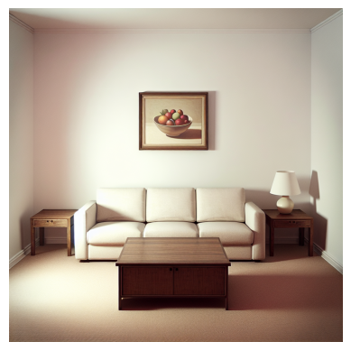
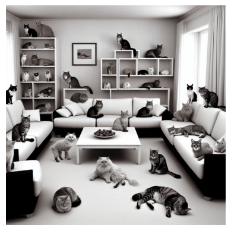
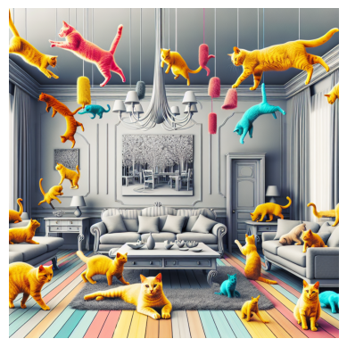
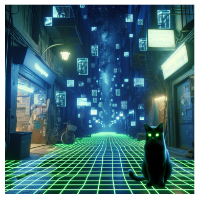
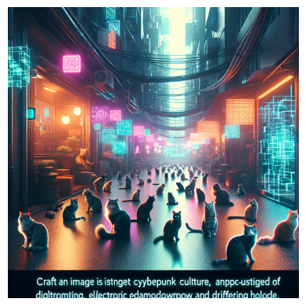
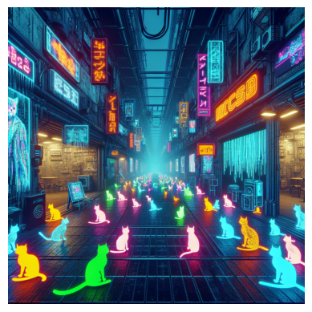
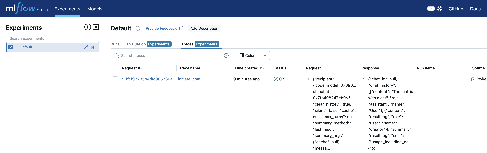
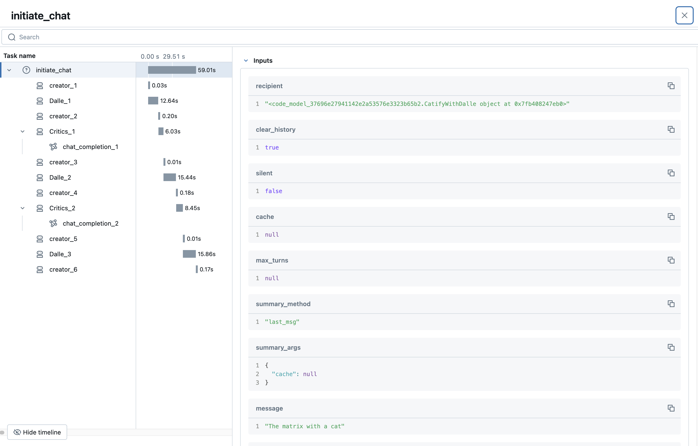
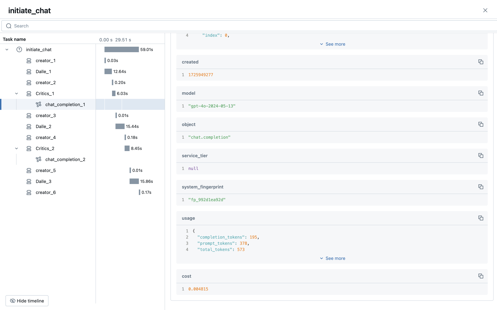
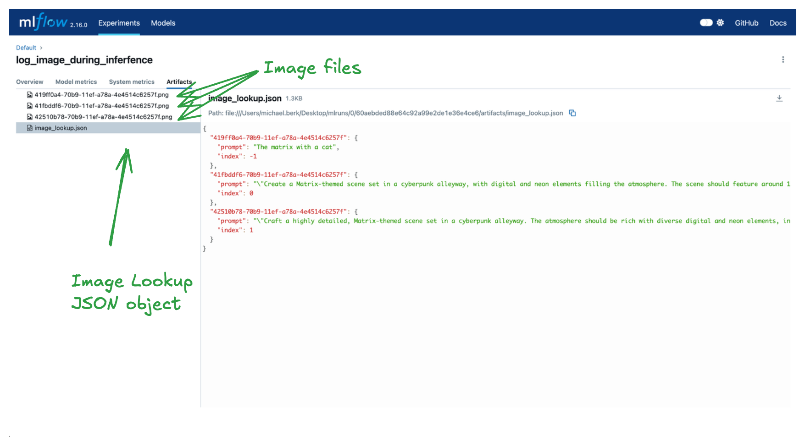

In this blog, we'll guide you through creating an [AutoGen](https://microsoft.github.io/autogen/) agent framework within an MLflow custom PyFunc. By combining MLflow with AutoGen's ability to create multi-agent frameworks, we are able to create scalable and stable GenAI applications.

### Agent Frameworks

Agent frameworks enable autonomous agents to handle complex, multi-turn tasks by integrating discrete logic at each step. These frameworks are crucial for LLM-driven workflows, where agents manage dynamic interactions across multiple stages. Each agent operates based on specific logic, enabling precise task automation, decision-making, and coordination. This is ideal for applications like workflow orchestration, customer support, and multi-agent systems, where LLMs must interpret evolving context and respond accordingly.

### Agent Frameworks with AutoGen

AutoGen is an open-source programming framework designed for building agent-based AI systems. It offers a multi-agent conversation framework, allowing users to build [complex LLM workflows](https://microsoft.github.io/autogen/docs/Examples/) using high-level abstractions. AutoGen simplifies the creation of diverse applications across various domains by providing pre-built systems. Additionally, it enhances LLM inference and optimization through specialized APIs, improving performance and reducing operational costs. The framework is tailored to streamline the development and deployment of agentic AI solutions.

## 1 - Setup

First, let's install the required dependencies. Note that pyautogen requires `python>=3.9`.

### 1.1 - Environment Setup

```shell
%pip install pyautogen mlflow -U -q
```

We must also get API credentials to use an LLM. For this tutorial, we'll be using OpenAI. Note that a great way to securely pass tokens to your interactive python environment is via the [getpass](https://docs.python.org/3/library/getpass.html) package.

```python
import os
from getpass import getpass

os.environ["OPENAI_API_KEY"] = getpass("OPENAI_API_KEY:")

assert os.getenv("OPENAI_API_KEY"), "Please set an OPENAI_API_KEY environment variable."
```

Great! We've setup our authentication configuration and are ready to start building an agent framework.

## 2 - Create Our Agent Framework with AutoGen and MLflow

In this tutorial we will be creating an image generation agent framework. There is a lot of code copied and modified from the [autogen tutorial](https://github.com/microsoft/autogen/blob/main/notebook/agentchat_dalle_and_gpt4v.ipynb), but the core agent functionality remains the same.

### 2.1 - Agent Code

You don't have to worry about the specifics of the implementation. At a high level, we are creating an agent framework that...

1. Takes a prompt.
2. Leverages [OpenAI's DALLE](https://openai.com/index/dall-e-3/) to create an image based on that prompt.
3. Iteratively "catifies" e.g. adds fluffy cats to the image.

Step 3 is where AutoGen shines. We're able to leverage AutoGen's [MultimodalConversableAgent](https://microsoft.github.io/autogen/docs/reference/agentchat/contrib/multimodal_conversable_agent#multimodalconversableagent) to create a critic agent that observes the images and, based on a system prompt provided by the user to "add fluffy cats", gives feedback on how the prompt should be improved.

```python
import os
import re
from typing import Dict, List, Optional, Union

import matplotlib.pyplot as plt
import PIL
from diskcache import Cache
from openai import OpenAI
from PIL import Image

from autogen import Agent, AssistantAgent, ConversableAgent, UserProxyAgent
from autogen.agentchat.contrib.img_utils import _to_pil, get_image_data, get_pil_image
from autogen.agentchat.contrib.multimodal_conversable_agent import MultimodalConversableAgent

# Define our prompt of interest
CRITIC_PROMPT = """Add fluffy cats. Like a lot of cats. If there's less than 100 cats I'll be mad."""

# Define our LLM configurations

def dalle_call(client: OpenAI, model: str, prompt: str, size: str, quality: str, n: int) -> str:
    """
    Generate an image using OpenAI's DALL-E model and cache the result.

    This function takes a prompt and other parameters to generate an image using OpenAI's DALL-E model.
    It checks if the result is already cached; if so, it returns the cached image data. Otherwise,
    it calls the DALL-E API to generate the image, stores the result in the cache, and then returns it.

    Args:
        client (OpenAI): The OpenAI client instance for making API calls.
        model (str): The specific DALL-E model to use for image generation.
        prompt (str): The text prompt based on which the image is generated.
        size (str): The size specification of the image. 
        quality (str): The quality setting for the image generation.
        n (int): The number of images to generate.

    Returns:
    str: The image data as a string, either retrieved from the cache or newly generated.

    Note:
    - The cache is stored in a directory named '.cache/'.
    - The function uses a tuple of (model, prompt, size, quality, n) as the key for caching.
    - The image data is obtained by making a secondary request to the URL provided by the DALL-E API response.
    """
    # Function implementation...
    cache = Cache(".cache/")  # Create a cache directory
    key = (model, prompt, size, quality, n)
    if key in cache:
        return cache[key]

    # If not in cache, compute and store the result
    response = client.images.generate(
        model=model,
        prompt=prompt,
        size=size,
        quality=quality,
        n=n,
    )
    image_url = response.data[0].url
    img_data = get_image_data(image_url)
    cache[key] = img_data

    return img_data

def extract_img(agent: Agent) -> PIL.Image:
    """
    Extracts an image from the last message of an agent and converts it to a PIL image.

    This function searches the last message sent by the given agent for an image tag,
    extracts the image data, and then converts this data into a PIL (Python Imaging Library) image object.

    Parameters:
        agent (Agent): An instance of an agent from which the last message will be retrieved.

    Returns:
        PIL.Image: A PIL image object created from the extracted image data.

    Note:
    - The function assumes that the last message contains an  tag with image data.
    - The image data is extracted using a regular expression that searches for  tags.
    - It's important that the agent's last message contains properly formatted image data for successful extraction.
    - The `_to_pil` function is used to convert the extracted image data into a PIL image.
    - If no  tag is found, or if the image data is not correctly formatted, the function may raise an error.
    """
    last_message = agent.last_message()["content"]

    if isinstance(last_message, str):
        img_data = re.findall("", last_message)[0]
    elif isinstance(last_message, list):
        # The GPT-4V format, where the content is an array of data
        assert isinstance(last_message[0], dict)
        img_data = last_message[0]["image_url"]["url"]

    pil_img = get_pil_image(img_data)
    return pil_img

class DALLEAgent(ConversableAgent):
    def __init__(self, name, llm_config: dict, **kwargs):
        super().__init__(name, llm_config=llm_config, **kwargs)

        api_key = os.getenv("OPENAI_API_KEY")
        self._dalle_client = OpenAI(api_key=api_key)
        self.register_reply([Agent, None], DALLEAgent.generate_dalle_reply)

    def send(
        self,
        message: Union[Dict, str],
        recipient: Agent,
        request_reply: Optional[bool] = None,
        silent: Optional[bool] = False,
    ):
        # override and always "silent" the send out message;
        # otherwise, the print log would be super long!
        super().send(message, recipient, request_reply, silent=True)

    def generate_dalle_reply(self, messages: Optional[List[Dict]], sender: "Agent", config):
        """Generate a reply using OpenAI DALLE call."""
        client = self._dalle_client if config is None else config
        if client is None:
            return False, None
        if messages is None:
            messages = self._oai_messages[sender]

        prompt = messages[-1]["content"]
        img_data = dalle_call(
            client=client,
            model="dall-e-3",
            prompt=prompt,
            size="1024x1024",  
            quality="standard",
            n=1,
        )

        img_data = _to_pil(img_data)  # Convert to PIL image

        # Return the OpenAI message format
        return True, {"content": [{"type": "image_url", "image_url": {"url": img_data}}]}

class CatifyWithDalle(AssistantAgent):
    def __init__(self, n_iters=2, **kwargs):
        """
        Initializes a CatifyWithDalle instance.

        This agent facilitates the creation of visualizations through a collaborative effort among
        its child agents: dalle and critics.

        Parameters:
            - n_iters (int, optional): The number of "improvement" iterations to run. Defaults to 2.
            - **kwargs: keyword arguments for the parent AssistantAgent.
        """
        super().__init__(**kwargs)
        self.register_reply([Agent, None], reply_func=CatifyWithDalle._reply_user, position=0)
        self._n_iters = n_iters

    def _reply_user(self, messages=None, sender=None, config=None):
        if all((messages is None, sender is None)):
            error_msg = f"Either {messages=} or {sender=} must be provided."
            raise AssertionError(error_msg)

        if messages is None:
            messages = self._oai_messages[sender]

        img_prompt = messages[-1]["content"]

        ## Define the agents
        self.critics = MultimodalConversableAgent(
            name="Critics",
            system_message=f"""You need to improve the prompt of the figures you saw.
{CRITIC_PROMPT}
Reply with the following format:

CRITICS: the image needs to improve...
PROMPT: here is the updated prompt!

""",
            llm_config={"max_tokens": 1000, "model": "gpt-4o"},
            human_input_mode="NEVER",
            max_consecutive_auto_reply=3,
        )

        self.dalle = DALLEAgent(
            name="Dalle", llm_config={"model": "dalle"}, max_consecutive_auto_reply=0
        )

        # Data flow begins
        self.send(message=img_prompt, recipient=self.dalle, request_reply=True)
        img = extract_img(self.dalle)
        plt.imshow(img)
        plt.axis("off")  # Turn off axis numbers
        plt.show()
        print("Image PLOTTED")

        for i in range(self._n_iters):
            # Downsample the image s.t. GPT-4V can take
            img = extract_img(self.dalle)
            smaller_image = img.resize((128, 128), Image.Resampling.LANCZOS)
            smaller_image.save("result.png")

            self.msg_to_critics = f"""Here is the prompt: {img_prompt}.
            Here is the figure .
            Now, critique and create a prompt so that DALLE can give me a better image.
            Show me both "CRITICS" and "PROMPT"!
            """
            self.send(message=self.msg_to_critics, recipient=self.critics, request_reply=True)
            feedback = self._oai_messages[self.critics][-1]["content"]
            img_prompt = re.findall("PROMPT: (.*)", feedback)[0]

            self.send(message=img_prompt, recipient=self.dalle, request_reply=True)
            img = extract_img(self.dalle)
            plt.imshow(img)
            plt.axis("off")  # Turn off axis numbers
            plt.show()
            print(f"Image {i} PLOTTED")

        return True, "result.jpg"

```

Great! We have an agent framework. To quickly show how it works, let's instantiate our agent and give it a prompt.

```python
creator = CatifyWithDalle(
    name="creator",
    max_consecutive_auto_reply=0,
    system_message="Help me coordinate generating image",
    llm_config={"model": "gpt-4"},
)

user_proxy = UserProxyAgent(
    name="User", 
    human_input_mode="NEVER", 
    max_consecutive_auto_reply=0, 
    code_execution_config={
        "work_dir": "output", # Location where code will be written
        "use_docker": False # Use local jupyter execution environment instead of docker
    }
)

_ = user_proxy.initiate_chat(
    creator, message="Show me something boring"
)
```

<div style="overflow-y: scroll; height: 50vh; border: 1px solid black; padding: 10px;">

User (to creator):

Show me something boring

---

creator (to Dalle):

Show me something boring

---



Image PLOTTED
creator (to Critics):

Here is the prompt: Show me something boring.
Here is the figure `<image>`.
Now, critic and create a prompt so that DALLE can give me a better image.
Show me both "CRITICS" and "PROMPT"!

---

Critics (to creator):

CRITICS: The image is simple and mundane, with a plain room and basic furniture, which accomplishes the task of showing something boring. However, it can be improved by adding an element of whimsy or interest, juxtaposing the boring scene with something unexpected. Let's add a lot of cats to make it more engaging.

PROMPT: Show me a boring living room with plain furniture, but add 100 cats in various places around the room.

---

creator (to Dalle):

Show me a boring living room with plain furniture, but add 100 cats in various places around the room.

---



Image 0 PLOTTED
creator (to Critics):

Here is the prompt: Show me a boring living room with plain furniture, but add 100 cats in various places around the room..
Here is the figure `<image>`.
Now, critic and create a prompt so that DALLE can give me a better image.
Show me both "CRITICS" and "PROMPT"!

---

Critics (to creator):

CRITICS: The image has successfully incorporated cats into a boring living room, bringing in an element of surprise and quirkiness. However, it is in black and white, which can make the image feel duller and less lively. Additionally, while there are many cats, they could be positioned in more playful and unexpected ways to create more interest.

PROMPT: Show me a colorful, boring living room with plain furniture, but add 100 cats in various imaginative and playful positions around the room.

---

creator (to Dalle):

Show me a colorful, boring living room with plain furniture, but add 100 cats in various imaginative and playful positions around the room.

---



Image 1 PLOTTED
creator (to User):

result.jpg

---

</div>

### 2.2 - MLflow Model From Code

Now that we've proven the concept, it's time to leverage MLflow to manage our ML modeling lifecycle. For instance, it's highly likely that we'd want to take this model to production, so strong dependency management, model versioning, and support for tracking between development cycles would all be useful.

In this blog we will leverage the [Model from Code](https://mlflow.org/docs/latest/models.html#models-from-code) feature to achieve the above functionality. MLflow Model from Code allows you to define and log models directly from a stand-alone python script. This feature is particularly useful when you want to log models that can be effectively stored as a code representation (models that do not need optimized weights through training) or applications that rely on external services (e.g., LangChain chains). Another benefit is that this approach entirely bypasses the use of the `pickle` or `cloudpickle` modules within Python, which can carry security

To leverage Model from Code, we must perform the following steps:

1. Declare a [custom PyFunc](https://mlflow.org/docs/latest/traditional-ml/creating-custom-pyfunc/index.html)
2. Leverage [mlflow.models.set_model](https://mlflow.org/docs/latest/python_api/mlflow.models.html?highlight=set_model#mlflow.models.set_model) to indicate which python object is our model.

To achieve these steps, we simply copy the above and below code to a python file. For simplicity, you can just create a single Python file with both code snippets, but MLflow also supports specifying local dependencies when logging our model via the `code_paths` parameter in [mlflow.pyfunc.lod_model](https://mlflow.org/docs/latest/python_api/mlflow.pyfunc.html?highlight=pyfunc%20log_model#mlflow.pyfunc.log_model)

**This step was omitted for brevity and must be done manually.**

```python
import mlflow

class CatifyPyfunc(mlflow.pyfunc.PythonModel):
  def predict(self, context, model_input, params):
    import mlflow
    mlflow.autogen.autolog()

    creator = CatifyWithDalle(
            name="creator",
            max_consecutive_auto_reply=0,
            system_message="Help me coordinate generating image",
            llm_config={"model":"gpt-4"},
        )

    user_proxy = UserProxyAgent(name="User", human_input_mode="NEVER", max_consecutive_auto_reply=0, code_execution_config={
                "work_dir": "output", # Location where code will be written
                "use_docker": False # Use local jupyter execution environment instead of docker
            })

    return user_proxy.initiate_chat(
        creator, message=model_input
    )
mlflow.models.set_model(CatifyPyfunc())
```

At the end of this step, you should have a Python file that has both code snippets. The name is up to the user, but for this blog we will use "catify_model.py".

## 3 Use Our Agent Framework

We are now positioned to leverage MLflow to interact with our powerful "catify" agent.

### 3.1 - Log and Load

First, let's demonstrate the standard user journey of logging model to MLflow's tracking server. We will then load it back and perform inference.

```python
import mlflow
mlflow.autogen.autolog() # Enable logging of traces

with mlflow.start_run() as run:
    mlflow.pyfunc.log_model(
        artifact_path="autogen_pyfunc",
        python_model="catify_model.py", # Our model from code python file

    )

    run_id = run.info.run_id
```

With our model logged, let's reload it and perform inference, this time with a more cool prompt.

```python
loaded = mlflow.pyfunc.load_model(f"runs:/{run_id}/autogen_pyfunc")
out = loaded.predict("The matrix with a cat")
```

<div style="overflow-y: scroll; height: 50vh; border: 1px solid black; padding: 10px;">

User (to creator):

The matrix with a cat

---

creator (to Dalle):

The matrix with a cat

---



Image PLOTTED
creator (to Critics):

Here is the prompt: The matrix with a cat.
Here is the figure `<image>`.
Now, critic and create a prompt so that DALLE can give me a better image.
Show me both "CRITICS" and "PROMPT"!

---

Critics (to creator):

CRITICS: The image effectively captures the Matrix-themed aesthetic with a cat, combining a cyberpunk atmosphere with digital elements. However, to improve the image:

- Increase the number of cats to align with the requirement of having lots of cats (aim for around 100).
- Enhance the digital and neon elements to make the Matrix theme more pronounced.
- Add more movement or dynamic elements to the scene for a more immersive feel.
- Ensure diversity in cat appearances, sizes, and positions to make the scene more complex and interesting.

PROMPT: "Create a Matrix-themed scene set in a cyberpunk alleyway, with digital and neon elements filling the atmosphere. The scene should feature around 100 cats of various sizes, colors, and positions—some sitting, some walking, and some interacting with the digital elements. Make the digital grid and floating code more prominent, and add dynamic elements such as digital rain or floating holograms to create a more immersive and lively environment."

---

creator (to Dalle):

"Create a Matrix-themed scene set in a cyberpunk alleyway, with digital and neon elements filling the atmosphere. The scene should feature around 100 cats of various sizes, colors, and positions—some sitting, some walking, and some interacting with the digital elements. Make the digital grid and floating code more prominent, and add dynamic elements such as digital rain or floating holograms to create a more immersive and lively environment."

---



Image 0 PLOTTED
creator (to Critics):

Here is the prompt: "Create a Matrix-themed scene set in a cyberpunk alleyway, with digital and neon elements filling the atmosphere. The scene should feature around 100 cats of various sizes, colors, and positions—some sitting, some walking, and some interacting with the digital elements. Make the digital grid and floating code more prominent, and add dynamic elements such as digital rain or floating holograms to create a more immersive and lively environment.".
Here is the figure `<image>`.
Now, critic and create a prompt so that DALLE can give me a better image.
Show me both "CRITICS" and "PROMPT"!

---

Critics (to creator):

CRITICS: The image significantly improves the Matrix-themed atmosphere with a cyberpunk alley and an abundance of cats. However, there are a few areas for improvement:

- Increase the variety of the digital elements (e.g., different shapes of holograms, varied colors and intensities of neon signs).
- Make the cats more dynamic by showing more interactions such as jumping, playing, or chasing digital elements.
- Enhance the depth and perspective of the scene to create a more three-dimensional and immersive look.
- Add more detail to the surrounding environment, like futuristic posters or graffiti to intensify the cyberpunk feel.

PROMPT: "Craft a highly detailed, Matrix-themed scene set in a cyberpunk alleyway. The atmosphere should be rich with diverse digital and neon elements, including various shapes of holograms and a range of vivid colors. Populate the scene with around 100 dynamic cats of different sizes, colors, and actions—some sitting, some walking, some jumping, playing, or chasing digital elements. Enhance the depth and perspective of the scene to create a more immersive three-dimensional experience. Include detailed futuristic environment elements like posters, graffiti, and neon signs to intensify the cyberpunk feel."

---

creator (to Dalle):

"Craft a highly detailed, Matrix-themed scene set in a cyberpunk alleyway. The atmosphere should be rich with diverse digital and neon elements, including various shapes of holograms and a range of vivid colors. Populate the scene with around 100 dynamic cats of different sizes, colors, and actions—some sitting, some walking, some jumping, playing, or chasing digital elements. Enhance the depth and perspective of the scene to create a more immersive three-dimensional experience. Include detailed futuristic environment elements like posters, graffiti, and neon signs to intensify the cyberpunk feel."

---



Image 1 PLOTTED
creator (to User):

result.jpg

---

</div>

A little dystopian but we'll take it! We have successfully demonstrated that we can log and load our model, then perform inference from the loaded model.

### 3.2 - Show MLflow Traces

[MLflow Tracing](https://mlflow.org/docs/latest/llms/tracing/index.html) provides a thread-safe API to track the execution of complex applications. The MLflow AutoGen flavor has tracing built in as an autologging feature. So, simply by running `mlflow.autogen.autolog()` prior to doing inference, we will get traces logged automatically.

Traces can be accessed via the fluent APIs, MLflow client, and manually via the MLflow UI. For more, please visit the documentation linked above.

```python
# Example with fluent APIs
last_active_trace = mlflow.get_last_active_trace()
print(last_active_trace)

# Output: Trace(request_id=71ffcf92785b4dfc965760a43193095c)
```

In the meantime, we will display the MLFlow UI here. If you are running in an interactive context, such as jupyter, run the following command.

```python
import subprocess
from IPython.display import IFrame

# Start MLflow server in the background
mlflow_ui_server = subprocess.Popen(["mlflow", "ui", "--host", "127.0.0.1", "--port", "5000"])
IFrame(src="http://127.0.0.1:5000", width="100%", height="600")

# Run the below command to stop the server
# mlflow_ui_server.terminate()
```

If you're not running interactively, you can simply run the follow shell command and navigate to the associated host and port in your web browser.

```bash
mlflow ui
```

If we navigate to the tracing tab, as shown in the image below, we can see our logged trace.



By clicking on that trace ID, we can see a detailed execution plan. At the bottom, we can see our prompt `"The matrix with a cat"` which kicked off the chat session. From there, many agents interacted to create images and provide feedback to "catify" them. Also, note that the trace ID is the same as the one returned by `mlflow.get_last_active_trace()` above.



Finally, let's dig a bit deeper on the tracing LLM call. As you can see, we have lots of valuable information about the execution, such as the model and usage statistics. Tracing helps you monitor not just performance, but cost, usage patterns, and much more! You can also leverage custom metadata to get even more granular insights.



### 3.3 - Logging Artifacts with MLflow
Tracing's primary purpose is to provide robust lightweight summaries of complex agent executions. For larger or custom payloads, MLflow exposes a variety of artifact-logging APIs that can store images, text, tables, and more in the MLflow tracking server. Let's quickly demonstrate this functionality by logging the prompts and their associated images.

Within our `CatifyWithDalle` class, we will make 4 modifications...
1. Create an instance variable in the class `__init__` to save metadata about our objects.
2. Create a private utility to increment our metadata and log and images with [mlflow.log_image](https://mlflow.org/docs/latest/python_api/mlflow.html?highlight=log_image#mlflow.log_image).
3. Call the above utility after new images have been generated.
4. Finally, log our metadata object as JSON with [mlflow.log_dict](https://mlflow.org/docs/latest/python_api/mlflow.html?highlight=log_image#mlflow.log_dict).

```diff
+ import uuid

class CatifyWithDalle(AssistantAgent):
    def __init__(self, n_iters=2, **kwargs):
        """
        Initializes a CatifyWithDalle instance.

        This agent facilitates the creation of visualizations through a collaborative effort among
        its child agents: dalle and critics.

        Parameters:
            - n_iters (int, optional): The number of "improvement" iterations to run. Defaults to 2.
            - **kwargs: keyword arguments for the parent AssistantAgent.
        """
        super().__init__(**kwargs)
        self.register_reply([Agent, None], reply_func=CatifyWithDalle._reply_user, position=0)
        self._n_iters = n_iters
+       self.dict_to_log = {}

+   def _log_image_and_append_to_dict(self, img: Image, img_prompt: str, image_index: int)-> None:
+      # Generate a unique ID
+     _id = str(uuid.uuid1())

+       # Append to class variable to log once at the end of all inference
+       self.dict_to_log[_id] = {"prompt": img_prompt, "index": image_index}

+       # Log image to MLflow tracking server
+       mlflow.log_image(img, f"{_id}.png")

    def _reply_user(self, messages=None, sender=None, config=None):
        if all((messages is None, sender is None)):
            error_msg = f"Either {messages=} or {sender=} must be provided."
            raise AssertionError(error_msg)

        if messages is None:
            messages = self._oai_messages[sender]

        img_prompt = messages[-1]["content"]

        ## Define the agents
        self.critics = MultimodalConversableAgent(
            name="Critics",
            system_message=f"""You need to improve the prompt of the figures you saw.
{CRITIC_PROMPT}
Reply with the following format:

CRITICS: the image needs to improve...
PROMPT: here is the updated prompt!

""",
            llm_config={"max_tokens": 1000, "model": "gpt-4o"},
            human_input_mode="NEVER",
            max_consecutive_auto_reply=3,
        )

        self.dalle = DALLEAgent(
            name="Dalle", llm_config={"model": "dalle"}, max_consecutive_auto_reply=0
        )

        # Data flow begins
        self.send(message=img_prompt, recipient=self.dalle, request_reply=True)
        img = extract_img(self.dalle)
        plt.imshow(img)
        plt.axis("off")  # Turn off axis numbers
        plt.show()
        print("Image PLOTTED")

+       self._log_image_and_append_to_dict(img, img_prompt, -1)

        for i in range(self._n_iters):
            # Downsample the image s.t. GPT-4V can take
            img = extract_img(self.dalle)
            smaller_image = img.resize((128, 128), Image.Resampling.LANCZOS)
            smaller_image.save("result.png")

            self.msg_to_critics = f"""Here is the prompt: {img_prompt}.
            Here is the figure .
            Now, critic and create a prompt so that DALLE can give me a better image.
            Show me both "CRITICS" and "PROMPT"!
            """
            self.send(message=self.msg_to_critics, recipient=self.critics, request_reply=True)
            feedback = self._oai_messages[self.critics][-1]["content"]
            img_prompt = re.findall("PROMPT: (.*)", feedback)[0]

            self.send(message=img_prompt, recipient=self.dalle, request_reply=True)
            img = extract_img(self.dalle)
            plt.imshow(img)
            plt.axis("off")  # Turn off axis numbers
            plt.show()
            print(f"Image {i} PLOTTED")
+           self._log_image_and_append_to_dict(img, img_prompt, i)


+       mlflow.log_dict(self.dict_to_log, "image_lookup.json")
        return True, "result.jpg"
```

Now, if we rerun the above model logging code, every time we load the newest version of our model, images generated by our agent will be logged and a JSON object with all prompts, indexes of the prompts, and image names (for lookup purposes) will be logged.

Let's demonstrate this and wrap infernce in a single MLflow run for easy aggregation. Also note that we will be leveraging Autogen's [caching](https://microsoft.github.io/autogen/docs/reference/cache/) functionality, so given we've already done inference with this prompt, we won't actually be making LLM calls again; we're just reading from cache and logging with our new MLflow code.

```python
# Be sure to re-log the model by rerunning the above code
with mlflow.start_run(run_name="log_image_during_inferfence"):
    loaded = mlflow.pyfunc.load_model(f"runs:/{run_id}/autogen_pyfunc")
    loaded.predict("The matrix with a cat")
```



As you can see, we have logged three images of interest and a lookup dict. The keys of the dict correspond to the image names and the values correspond to additional information for how the image was generated. With these artifacts we can perform detailed analyses on prompt quality and make iterative improvements to our "catify" agent!

### 3.4 - Additional Benefits of MLflow

There is a lot more happening behind the scenes that is out of the scope of this tutorial, but here's a quick list of additional MLflow features that are useful when building agentic frameworks.

1. **Dependency management**: when you log a model, MLflow will automatically try to infer your pip requirements. These requirements are written in several formats that makes remote serving of your model much simpler. If you have local dependencies, as noted above, you can specify additional paths for MLflow to serialize via the `code_paths` argument when logging your model.
2. **Model aliasing**: when iteratively building your agentic framework, you want an easy way to compare models. MLflow model [aliases and tags](https://mlflow.org/docs/latest/model-registry.html#deploy-and-organize-models-with-aliases-and-tags) facilitate lookups to the MLflow model registry and allow you to easily load and deploy an specific model version.
3. **Nested Runs**: with agentic frameworks, especially when training underlying LLM components, you will often have complex nested structures. MLflow supports [nested runs](https://mlflow.org/docs/latest/traditional-ml/hyperparameter-tuning-with-child-runs/part1-child-runs.html) to facilitate aggregating your run information. This can be especially useful with LLM training and fine tuning.

## 4 - Summary

In this blog we outlined how to create a complex agent with AutoGen. We also showed how to leverage the MLflow [Model from Code](https://mlflow.org/docs/latest/models.html#models-from-code) feature to log and load our model. Finally, we leveraged the MLflow AutoGen's autologging capabilities to automatically leverage MLflow tracing to get fine-grained and thread-safe agent execution information.

Happy coding!
