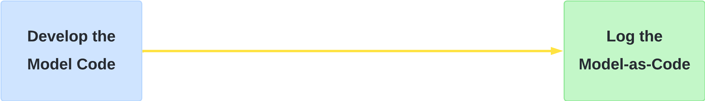
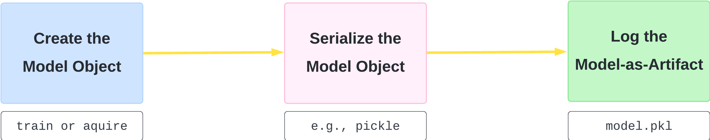

We all—well, most of us—remember November 2022 when the public release of ChatGPT by OpenAI marked a significant turning point in the world of AI. While Generative AI had been evolving for some time, ChatGPT, built on OpenAI's GPT-3.5 architecture, quickly captured the public’s imagination. This led to an explosion of interest in Generative AI, both within the tech industry and among the general public.

On the tools side, MLflow continues to solidify its position as the favorite tool for MLOps among the ML community. However, the rise of Generative AI has introduced new needs in how we use MLflow. One of these new challenges is how we log model artifacts in MLflow. If you’ve used MLflow before (and I bet you have), you’re probably familiar with the `mlflow.log_model()` function and how it efficiently **pickles** model artifacts (I’ve bolded "pickles" because it’s a key term in this post).

Particularly with GenAI, there’s a new requirement: logging the model "as code," not just serializing it into a pickle file. This post explores how MLflow has adapted to meet this need. And guess what? This feature isn’t limited to GenAI models; it’s implemented at a very abstract level, allowing you to log any model "as code," whether it’s GenAI or not! I like to think of it as a generic approach, with GenAI models being just one of its use cases. So, in this post, I’ll explore this new approach, "model as code."

## What Is Actually Model-as-Code Logging?

In fact, when MLflow announced this feature, it got me thinking in a more abstract way about the concept of a "model"! You might find it interesting, too, if you zoom out and consider a model as a mathematical representation or function that describes the relationship between input and output variables. At this level of abstraction, a model can be many things!

One could realize, at this level, that it can be argued a model as an object (or artifact) is just one form of a model, even if it’s the most popular in the ML community. But if you think about it, at that high level, a model can also be a simple mapping function—just a piece of code—or even code that sends API requests to another service that doesn’t necessarily reside within your "premises" (e.g., OpenAI APIs).

I'll explain the detailed workflow of how to log mode-as-code later in tehe post, but for now, let's consider it at a high level with two main steps: first, writing your model code, and second, logging your model as code.

🔴 It's important to note that when we refer to "model code," we're talking about code that can be treated as a model itself. This means it's **not** your training code that generates a trained model object, but rather the step-by-step code that is executed as a model itself. This will look like the folowing figure:

## How Model-as-Code Differs From Model-as-Artifact Logging?

In the previous section, we discussed what is meant by Model-as-Code logging. In my experience, concepts often become clearer when contrasted with their alternatives—a technique known as _contrast learning_. So, the alternative will be Model-as-Artifact logging, which is the most commonly used approach for logging models.

You're probably familiar with the process of writing training code, training a model, and then saving the trained model as an artifact to be reused later by loading it back into your application. This what I refer to here as Model-as-Artifact logging. In its simplest form, this involves calling the function `mlflow.log_model()`, after which MLflow typically handles the serialization process for you. If you're using a Python-based model, this might involve using Pickle or a similar method under the hood to store the model so it can be easily loaded later.

The Model-as-Artifact logging can be broken down into three high-level steps as in the following figure: first, creating the model as an object (whether by training it or acquiring it), second, serializing it (usually with Pickle or a similar tool), and third, logging it as an artifact.

🟢 So, the main distinction between the popular Model-as-Artifact logging and Model-as-Code logging is that in the former, we log the model object itself—whether it's a model you've trained or a pre-trained model you've acquired. In the latter, however, we log the code that represents your model. In the Model-as-Artifact approach, the model exists as an object, which you either create through training or acquire as a pre-trained model.

## When Do You Need Model-as-Code Logging?

I hope by now you have a clear understanding of what Model-as-Code logging is! At the same time, you might be wondering about the specific use cases where you can apply this approach. This section is about that.

While we mentioned GenAI as a motivational use case in the introduction, we also highlighted that MLflow has approached Model-as-Code logging in a more generic way and we will see that in the examples in the next section. This means you can leverage the generalizability of Model-as-Code logging for a wide range of scenarios. I’ve identified three key usage patterns that I believe are particularly relevant:

### 1️⃣ When Your Model Relies on External Services:

This is one of the obvious and common use cases, especially with the rise of modern AI applications. It’s becoming increasingly clear that we are shifting from building AI at the "model" granularity to the "system" granularity.

In other words, AI is no longer just about individual models; it’s about how those models interact within a broader ecosystem. As we become more dependent on external AI services and APIs, the need for Model-as-Code logging becomes more pronounced.

For instance, frameworks like LangChain allow developers to build applications that chain together various AI models and services to perform complex tasks, such as language understanding and information retrieval. In such scenarios, the "model" is not just a set of trained parameters that can be pickled but a system of interconnected services, often orchestrated by code that makes API calls to external platforms.

Logging the model as code in these situations ensures that the entire workflow, including the logic and dependencies, is preserved. It offers is the ability to maintain the same model-like experience by capturing the code making it possible to faithfully recreate the model’s behavior, even when the actual computational work is performed outside your domain.

### 2️⃣ When Your Model Is Part of a Complex Pipeline:

In situations where your model is integrated into a larger, multi-step pipeline—such as one involving data preprocessing, model stacking, or custom post-processing—the entire process is more than just the final model object. Model-as-Code logging allows you to capture the full pipeline as code, including all dependencies and interactions, ensuring that every step can be faithfully reproduced.

### 3️⃣ When Security and Transparency Are Critical:

Serialized models can pose security risks, particularly when sourced from external or untrusted entities. Model-as-Code logging enhances security by focusing on the codebase, making it easier to inspect, audit, and verify the logic before deployment. This approach also promotes transparency, as the code used to define and run the model is clearly visible and can be scrutinized for potential issues.

## How To Implement Model-as-Code Logging With Examples

### A 101 Example

### A GenAI Use Case

## Conclusion
