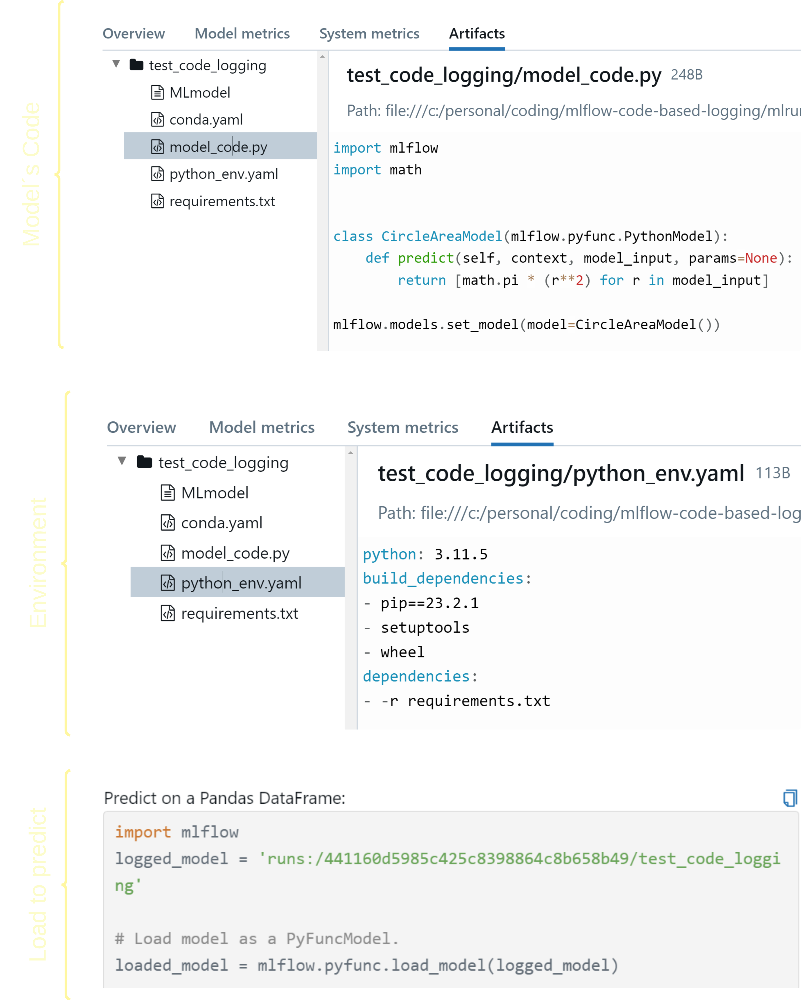

We all (well, most of us) remember November 2022 when the public release of ChatGPT by OpenAI marked a significant turning point in the world of AI. While generative artificial intelligence (GenAI) had been evolving for some time, ChatGPT, built on OpenAI's GPT-3.5 architecture, quickly captured the public’s imagination. This led to an explosion of interest in GenAI, both within the tech industry and among the general public.

On the tools side, MLflow continues to solidify its position as the favorite tool for (machine learning operations) MLOps among the ML community. However, the rise of GenAI has introduced new needs in how we use MLflow. One of these new challenges is how we log models in MLflow. If you’ve used MLflow before (and I bet you have), you’re probably familiar with the `mlflow.log_model()` function and how it efficiently [pickles](https://github.com/cloudpipe/cloudpickle) model artifacts.

Particularly with GenAI, there’s a new requirement: logging the models "from code", instead of serializing it into a pickle file! And guess what? This need isn’t limited to GenAI models! So, in this post I will explore this concept and how MLflow has adapted to meet this new requirement.

You will notice that this feature is implemented at a very abstract level, allowing you to log any model "as code", whether it’s GenAI or not! I like to think of it as a generic approach, with GenAI models being just one of its use cases. So, in this post, I’ll explore this new feature, ["Models from Code logging"](https://mlflow.org/docs/latest/models.html#models-from-code).

By the end of this post, you should be able to answer the three main questions: 'What,' 'Why,' and 'How' to use Models from Code logging.

## What Is Models from Code Logging?

In fact, when MLflow announced this feature, it got me thinking in a more abstract way about the concept of a "model"! You might find it interesting as well, if you zoom out and consider a model as a mathematical representation or function that describes the relationship between input and output variables. At this level of abstraction, a model can be many things!

One might even recognize that a model, as an object or artifact, represents just one form of what a model can be, even if it’s the most popular in the ML community. If you think about it, a model can also be as simple as a piece of code for a mapping function or a code that sends API requests to external services such as OpenAI's APIs.

I'll explain the detailed workflow of how to log models from code later in the post, but for now, let's consider it at a high level with two main steps: first, writing your model code, and second, logging your model from code. This will look like the following figure:

#### _High Level Models from Code Logging Workflow_:


🔴 It's important to note that when we refer to "model code," we're talking about code that can be treated as a model itself. This means it's **not** your training code that generates a trained model object, but rather the step-by-step code that is executed as a model itself.

## How Models from Code Differs from Object-Based Logging?

In the previous section, we discussed the concept of Models from Code logging. However, concepts often become clearer when contrasted with their alternatives; a technique known as _contrast learning_. In our case, the alternative is Object-Based logging, which is the commonly used approach for logging models in MLflow.

Object-Based logging treats a trained model as an _object_ that can be stored and reused. After training, the model is saved as an object and can be easily loaded for deployment. For example, this process can be initiated by calling `mlflow.log_model()`, where MLflow handles the serialization, often using [Pickle](https://github.com/cloudpipe/cloudpickle) or similar methods.

Object-Based logging can be broken down into three high-level steps as in the following figure: first, creating the model object (whether by training it or acquiring it), second, serializing it (usually with Pickle or a similar tool), and third, logging it as an object.

#### _High Level Object-Based Logging Workflow_:


💡The main distinction between the popular Object-Based logging and Models from Code logging is that in the former, we log the model object itself, whether it's a model you've trained or a pre-trained model you've acquired. In the latter, however, we log the code that _represents_ your model.

## When Do You Need Models from Code Logging?

By now, I hope you have a clear understanding of _what_ Models from Code logging is! You might still be wondering, though, about the specific use cases where this feature can be applied. This section will cover exactly that—the why!

While we mentioned GenAI as a motivational use case in the introduction, we also highlighted that MLflow has approached Models from Code logging in a more generic way and we will see that in the next section. This means you can leverage the generalizability of the Models from Code feature for a wide range of scenarios. I’ve identified three key usage patterns that I believe are particularly relevant:

### 1️⃣ When Your Model Relies on External Services:

This is one of the obvious and common use cases, especially with the rise of modern AI applications. It’s becoming increasingly clear that we are shifting from building AI at the "model" granularity to the "system" granularity.

In other words, AI is no longer just about individual models; it’s about how those models interact within a broader ecosystem. As we become more dependent on external AI services and APIs, the need for Models from Code logging becomes more pronounced.

For instance, frameworks like [LangChain](https://github.com/langchain-ai/langchain/) allow developers to build applications that chain together various AI models and services to perform complex tasks, such as language understanding and information retrieval. In such scenarios, the "model" is not just a set of trained parameters that can be _pickled_ but a "system" of interconnected services, often orchestrated by code that makes API calls to external platforms.

Models from Code logging in these situations ensures that the entire workflow, including the logic and dependencies, is preserved. It offers is the ability to maintain the same model-like experience by capturing the code making it possible to faithfully recreate the model’s behavior, even when the actual computational work is performed outside your domain.

### 2️⃣ When You’re Combining Multiple Models to Calculate a Complex Metric:

Apart from GenAI, you can still benefit from the Models from Code feature in various other domains. There are many situations where multiple specialized models are combined to produce a comprehensive output. Note that we are not just referring to traditional ensemble modeling (predicting the same variable); often, you need to combine multiple models to predict different components of a complex inferential task.

One concrete example could be [Customer Lifetime Value (CLV)](https://en.wikipedia.org/wiki/Customer_lifetime_value) in customer analytics. In the context of CLV, you might have separate models for:

- Customer Retention: Forecasting how long a customer will continue to engage with the business.
- Purchase Frequency: Predicting how often a customer will make a purchase.
- Average Order Value: Estimating the typical value of each transaction.

Each of these models might already be logged and tracked properly using MLflow. Now, you need to "combine" these models into a single "system" that calculates CLV. We refer to it as a "system" because it contains multiple components.

The beauty of MLflow's Models from Code logging is that it allows you to treat this "CLV system" as a "CLV model". It enables you to leverage MLflow's capabilities, maintaining the MLflow-like model structure with all the advantages of tracking, versioning, and deploying your CLV model as a cohesive unit, even though it's built on top of other models. While such a complex model system is able to be built using a custom MLflow PythonModel, utilizing the Models from Code feature dramatically simplifies the serialization process, reducing the friction to building your solution.

### 3️⃣ When You Don’t Have Serialization at All:

Despite the rise of deep learning, industries still rely on rule-based algorithms that don’t produce serialized models. In these cases, Models from Code logging can be beneficial for integrating these processes into the MLflow ecosystem.

One example is in industrial quality control, where the [Canny edge detection algorithm](https://en.wikipedia.org/wiki/Canny_edge_detector) is often used to identify defects. This rule-based algorithm doesn’t involve serialization but is defined by specific steps.

Another example, which is gaining attention nowadays, is [Causal AI](https://en.wikipedia.org/wiki/Causal_AI). Constraint-based causal discovery algorithms like the [PC (Peter-Clark)](https://causal-learn.readthedocs.io/en/latest/search_methods_index/Constraint-based%20causal%20discovery%20methods/PC.html) algorithm that discover causal relationships in data but are implemented as code rather than as model objects.

In either case, with the Models from Code feature, you can log the entire process as a "model" in MLflow, preserving the logic and parameters while benefiting from MLflow’s tracking and versioning features.

## How To Implement Models from Code Logging?

I hope that by this point, you have a clear understanding of the "What" and "Why" of Models from Code, and now you might be eager to get hands-on and focus on the _How_!

In this section, I'll provide a generic workflow for implementing MLflow's Models from Code logging, followed by a basic yet broadly applicable example. I hope the workflow provides a broad understanding that allows you to address a wide range of scenarios. I will also include links at the end to resources that cover more specific use cases (e.g., AI models).

### Models from Code Workflow:

A key "ingredient" of the implementation is MLflow's component [`pyfunc`](https://mlflow.org/docs/latest/python_api/mlflow.pyfunc.html). If you're not familiar with it, think of `pyfunc` as a universal interface in MLflow that lets you turn any model, from any framework, into an MLflow model by defining a _custom_ Python function. You can also refer to [this earlier post](https://mlflow.org/blog/custom-pyfunc) if you wish to gain a deeper understanding.

For our Models from Code logging, we’ll particularly use the [`PythonModel`](https://mlflow.org/docs/latest/api_reference/python_api/mlflow.pyfunc.html#mlflow.pyfunc.PythonModel) class within `pyfunc`. This class in the MLflow Python client library allows us to create and manage Python functions as MLflow models. It enables us to define a custom function that processes input data and returns predictions or results. This model can then be deployed, tracked, and shared using MLflow's features.

It seems to be exactly what we're looking for—we have some code that serves as our model, and we want to log it! That's why you'll soon see `mlflow.pyfunc.PythonModel` in our code example!

Now, each time we need to implement Models from Code, we create _two_ separate Python files:

1.  The first contains our model code (let's call it `model_code.py`). This file contains a class that inherits from the `mlflow.pyfunc.PythonModel` class.
    The class we're defining contains our model logic. It could be our calls to OpenAI APIs, CLV (Customer Lifetime Value) model, or our causal discovery code. We'll see a very simple 101 example soon.

    📌 But wait! IMPORTANT:

        - Our `model_code.py` script needs to call (i,e; include) [`mlflow.models.set_model()`](https://mlflow.org/docs/latest/python_api/mlflow.models.html#mlflow.models.set_model) to set the model, which is crucial for loading the model back using `load_model()` for inference. You will notice this in the example.

2.  The second file logs our class (that we defined in `model_code.py`). Think of it as the driver code; it can be either a notebook or a Python script (let's call it `driver.py`).
    In this file, we'll include the code that is responsible for logging our model code (essentially, providing the path to `model_code.py`) .

Then we can deploy our model. Later, when the serving environment is loaded, `model_code.py` is executed, and when a serving request comes in, `PyFuncClass.predict()` is called.

This figure gives a generic template of these two files.


### A 101 Example of Model from Code Logging :

Let’s consider a straightforward example: a simple function to calculate the area of a circle based on its diameter. With Models from Code, we can log this calculation as a model! I like to think of it as framing the calculation as a prediction problem, allowing us to write our model code with a `predict` method.

#### 1. Our `model_code.py` file :

```python
import mlflow
import math

class CircleAreaModel(mlflow.pyfunc.PythonModel):
    def predict(self, context, model_input, params=None):
        return [math.pi * (r ** 2) for r in model_input]

# It's important to call set_model() so it can be loaded for inference
# Also, note that it is set to an instance of the class, not the class itself.
mlflow.models.set_model(model=CircleAreaModel())
```

#### 2. Our `driver.py` file :

This can be defined within a notebook as well. Here are its essential contents:

```python
import mlflow

code_path = "model_code.py" # make sure that you put the correct path

with mlflow.start_run():
  logged_model_info = mlflow.pyfunc.log_model(
                                            python_model=code_path,
                                            artifact_path="test_code_logging"
                                            )

#We can proint some info about the logged model
print(f"MLflow Run: {logged_model_info.run_id}")
print(f"Model URI: {logged_model_info.model_uri}")
```

#### How that looks like on MLflow:

Executing the `driver.py` will start an MLflow run and log our model as code. The files can been as demonstrated below:



## Conclusion and Further Learning

I hope that by this point, I have fulfilled the promises I made earlier! You should now have a clearer understanding of _What_ Models from Code is and how it differs from the popular Object-Based approach which logs models as serialized objects. You should also have a solid foundation of _Why_ and when to use it, as well as an understanding of _How_ to implement it through our general example.

As we mentioned in the introduction and throughout the post, there are various use cases where Models from Code can be beneficial. Our 101 example is just the beginning—there is much more to explore. Below is a list of code examples that you may find helpful:

1. Logging models from code using **Pyfunc** log model API ( [model code](https://github.com/mlflow/mlflow/blob/a3454610285e3729266e5e94041d06bd2bc55ff6/examples/pyfunc/model_as_code.py) | [driver code](https://github.com/mlflow/mlflow/blob/a3454610285e3729266e5e94041d06bd2bc55ff6/examples/pyfunc/model_as_code_driver.py) )
2. Logging model from code using **Langchain** log model API ( [model code](https://github.com/mlflow/mlflow/blob/a3454610285e3729266e5e94041d06bd2bc55ff6/examples/langchain/chain_as_code.py) | [driver code](https://github.com/mlflow/mlflow/blob/a3454610285e3729266e5e94041d06bd2bc55ff6/examples/langchain/chain_as_code_driver.py) )
