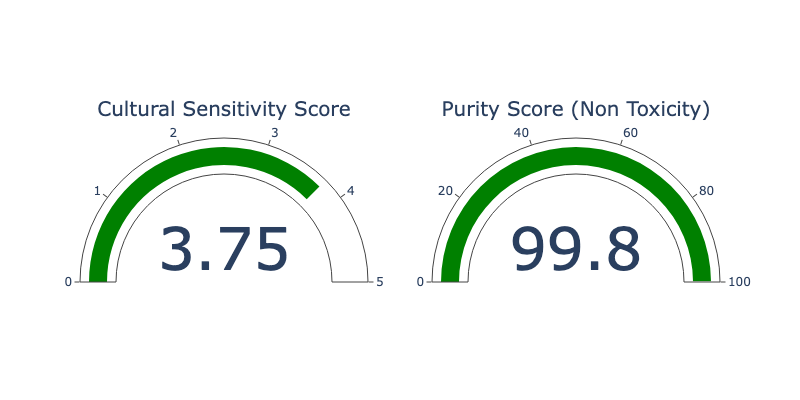
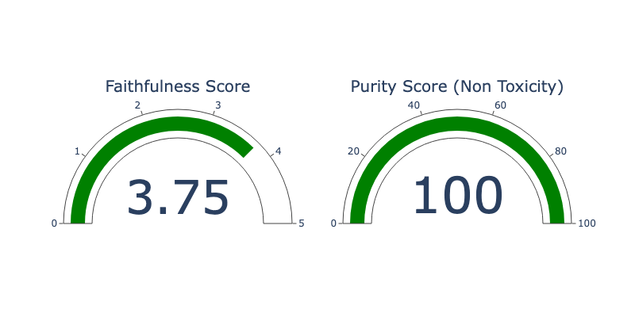

import MlflowEvaluateSvg from "./mlflow_evaluate.drawio.svg";

In this blog post, we'll dive on a journey to revolutionize how we evaluate language models. We'll explore the power of MLflow Evaluate and harness the capabilities of Large Language Models (LLMs) as judges. By the end, you'll learn how to create custom metrics, implement LLM-based evaluation, and apply these techniques to real-world scenarios. Get ready to transform your model assessment process and gain deeper insights into your AI's performance!

## The Challenge of Evaluating Language Models

Evaluating large language models (LLMs) and natural language processing (NLP) systems presents several challenges, primarily due to their complexity and the diversity of tasks they can perform.

One major difficulty is creating metrics that comprehensively measure performance across varied applications, from generating coherent text to understanding nuanced human emotions. Traditional benchmarks often fail to capture these subtleties, leading to incomplete assessments.

An LLM acting as a judge can address these issues by leveraging its extensive training data to provide a more nuanced evaluation, offering insights into model behavior and areas needing improvement. For instance, an LLM can analyze whether a model generates text that is not only grammatically correct but also contextually appropriate and engaging, something more static metrics might miss.

However, to move forward effectively, we need more than just better evaluation methods. Standardized experimentation setups are essential to ensure that comparisons between models are both fair and replicable. A uniform framework for testing and evaluation would enable researchers to build on each other's work, leading to more consistent progress and the development of more robust models.

## Introducing MLflow LLM Evaluate

[MLflow LLM Evaluate](https://mlflow.org/docs/latest/llms/llm-evaluate/index.html) is a powerful function within the MLflow ecosystem that allows for comprehensive model assessment by providing a standardized experiment setup. It supports both built-in metrics and custom (LLM) metrics, making it an ideal tool for evaluating complex language tasks. With [MLflow LLM Evaluate](https://mlflow.org/docs/latest/python_api/mlflow.html#mlflow.evaluate), you can:

- Evaluate models against multiple metrics simultaneously
- Use pre-defined metrics for specific model types (e.g., question-answering, text-summarization and pure text)
- Create custom metrics, including those that use LLMs as judges using [mlflow.metrics.genai.make_genai_metric()](https://mlflow.org/docs/latest/python_api/mlflow.metrics.html#mlflow.metrics.genai.make_genai_metric)
  and
  [mlflow.metrics.genai.make_genai_metric_from_prompt()](https://mlflow.org/docs/latest/python_api/mlflow.metrics.html#mlflow.metrics.genai.make_genai_metric_from_prompt)

<MlflowEvaluateSvg />

## Conquering new markets with an LLM as a judge

Imagine you're part of a global travel agency, "WorldWide Wandercorp," that's expanding its reach to Spanish-speaking countries.

Your team has developed an AI-powered translation system to help create culturally appropriate marketing materials and customer communications. However, as you begin to use this system, you realize that traditional evaluation metrics, such as BLEU (Bilingual Evaluation Understudy), fall short in capturing the nuances of language translation, especially when it comes to preserving cultural context and idiomatic expressions.

For instance, consider the phrase "kick the bucket." A direct translation might focus on the literal words, but the idiom actually means "to die." A traditional metric like BLEU may incorrectly evaluate the translation as adequate if the translated words match a reference translation, even if the cultural meaning is lost. In such cases, the metric might score the translation highly despite it being completely inappropriate in context. This could lead to embarrassing or culturally insensitive marketing content, which is something your team wants to avoid.

You need a way to evaluate whether the translation not only is accurate but also preserves the intended meaning, tone, and cultural context. This is where [MLflow Evaluate](https://mlflow.org/docs/latest/python_api/mlflow.html#mlflow.evaluate) and LLMs (Large Language Models) as judges come into play. These tools can assess translations more holistically by considering context, idiomatic expressions, and cultural relevance, providing a more reliable evaluation of the AI’s output.

## Custom Metrics: Tailoring Evaluation to Your Needs

In the following section, we’ll implement three metrics:

- The `"cultural_sensitivity"` metric ensures translations maintain cultural context and appropriateness.
- The `"faithfulness"` metric checks that chatbot responses align accurately with company policies and retrieved content.
- The `"toxicity"` metric evaluates responses for harmful or inappropriate content, ensuring respectful customer interactions.

These metrics will help Worldwide WanderAgency ensure their AI-driven translations and interactions meet their specific needs.

## Evaluating Worldwide WanderAgency's AI Systems

Now that we understand WanderAgency's challenges, let's dive into a code walkthrough to address them. We'll implement custom metrics to measure AI performance and build a gauge visualization chart for sharing results with stakeholders.

We'll start by evaluating a language translation model, focusing on the "cultural_sensitivity" metric to ensure it preserves cultural nuances. This will help WanderAgency maintain high standards in global communication.

### Cultural Sensitivity Metric

The travel agency wants to ensure their translations are not only accurate but also culturally appropriate.
To achieve this they are considering creating a custom metric that allows Worldwide WanderAgency to quantify how well their translations maintain cultural context and idiomatic expressions.

For instance, a phrase that is polite in one culture might be inappropriate in another.
In English, addressing someone as "Dear" in a professional email might be seen as polite. However, in Spanish, using "Querido" in a professional context can be too personal and inappropriate.

How can we evaluate such an abstract concept in a systematic way? Traditional Metrics would fall short so we need a better way of doing it. In this case LLM as a judge would be a great fit!
For this use case let's create a "cultural_sensitivity" metric.

Here's a brief overview of the process:
Start by installing all the necessary libraries for this demo to work.

```bash
pip install mlflow>=2.14.1 openai  transformers torch torchvision evaluate datasets tiktoken fastapi rouge_score textstat tenacity plotly ipykernel nbformat>=5.10.4
```

We will be using gpt3.5 and gpt4 during this example for that let's start by making sure our [OpenAI key is setup](https://mlflow.org/docs/latest/llms/openai/notebooks/openai-quickstart.html#API-Key-Security-Overview).

Import the necessary libraries.

```python
import mlflow
import os

# Run a quick validation that we have an entry for the OPEN_API_KEY within environment variables

assert "OPENAI_API_KEY" in os.environ, "OPENAI_API_KEY environment variable must be set"

import openai
import pandas as pd
```

When using the [`mlflow.evaluate()`](https://mlflow.org/docs/latest/python_api/mlflow.html#mlflow.evaluate) function, your large language model (LLM) can take one of the following forms:

1. A `mlflow.pyfunc.PyFuncModel()` — typically an MLflow model.
2. A Python function that accepts strings as inputs and returns a single string as output.
3. An `MLflow Deployments` endpoint URI.
4. `model=None` if the data you are providing has already been scored by a model, and you do not need to specify one.

For this example, we will use an MLflow model.

We’ll begin by logging a translation model in MLflow. For this tutorial, we'll use GPT-3.5 with a defined system prompt.

In a production environment, you would typically experiment with different prompts and models to determine the most suitable configuration for your use case. For more details, refer to MLflow’s [Prompt Engineering UI](https://mlflow.org/docs/latest/llms/prompt-engineering/index.html).

```python

system_prompt = "Translate the following sentences into Spanish"
# Let's set up an experiment to make it easier to track our results
mlflow.set_experiment("/Path/to/your/experiment")

basic_translation_model = mlflow.openai.log_model(
    model="gpt-3.5-turbo",
    task=openai.chat.completions,
    artifact_path="model",
    messages=[
        {"role": "system", "content": system_prompt},
        {"role": "user", "content": "{user_input}"},
    ],
)
```

Let's test the model to make sure it works.

```python
model = mlflow.pyfunc.load_model(basic_translation_model.model_uri)

model.predict("Hello, how are you?")

# Output = ['¡Hola, ¿cómo estás?']
```

To use [`mlflow.evaluate()`](https://mlflow.org/docs/latest/python_api/mlflow.html#mlflow.evaluate), we first need to prepare sample data that will serve as input to our LLM. In this scenario, the input would consist of the content the company is aiming to translate.

For demonstration purposes, we will define a set of common English expressions that we want the model to translate.

```python
# Prepare evaluation data
eval_data = pd.DataFrame(
    {
        "llm_inputs": [
            "I'm over the moon about the news!",
            "Spill the beans.",
            "Bite the bullet.",
            "Better late than never.",

        ]
    }
)
```

To meet the objectives of the travel agency, we will define custom metrics that evaluate the quality of translations. In particular, we need to assess how faithfully the translations capture not only the literal meaning but also cultural nuances.

By default, [`mlflow.evaluate()`](https://mlflow.org/docs/latest/python_api/mlflow.html#mlflow.evaluate) uses `openai:/gpt-4` as the evaluation model. However, you also have the option to use a [local model for evaluation](https://mlflow.org/docs/latest/llms/llm-evaluate/index.html#selecting-the-llm-as-judge-model), such as a model wrapped in a PyFunc (e.g., Ollama).

For this example, we will use GPT-4 as the evaluation model.

To begin, provide a few examples that illustrate good and poor translation scores.

```python
# Define the custom metric
cultural_sensitivity = mlflow.metrics.genai.make_genai_metric(
    name="cultural_sensitivity",
    definition="Assesses how well the translation preserves cultural nuances and idioms.",
    grading_prompt="Score from 1-5, where 1 is culturally insensitive and 5 is highly culturally aware.",
    examples=[
        mlflow.metrics.genai.EvaluationExample(
            input="Break a leg!",
            output="¡Rómpete una pierna!",
            score=2,
            justification="This is a literal translation that doesn't capture the idiomatic meaning."
        ),
        mlflow.metrics.genai.EvaluationExample(
            input="Break a leg!",
            output="¡Mucha mierda!",
            score=5,
            justification="This translation uses the equivalent Spanish theater idiom, showing high cultural awareness."
        ),
        mlflow.metrics.genai.EvaluationExample(
            input="It's raining cats and dogs.",
            output="Está lloviendo gatos y perros.",
            score=1,
            justification="This literal translation does not convey the idiomatic meaning of heavy rain."
        ),
        mlflow.metrics.genai.EvaluationExample(
            input="It's raining cats and dogs.",
            output="Está lloviendo a cántaros.",
            score=5,
            justification="This translation uses a Spanish idiom that accurately conveys the meaning of heavy rain."
        ),
        mlflow.metrics.genai.EvaluationExample(
            input="Kick the bucket.",
            output="Patear el balde.",
            score=1,
            justification="This literal translation fails to convey the idiomatic meaning of dying."
        ),
        mlflow.metrics.genai.EvaluationExample(
            input="Kick the bucket.",
            output="Estirar la pata.",
            score=5,
            justification="This translation uses the equivalent Spanish idiom for dying, showing high cultural awareness."
        ),
        mlflow.metrics.genai.EvaluationExample(
            input="Once in a blue moon.",
            output="Una vez en una luna azul.",
            score=2,
            justification="This literal translation does not capture the rarity implied by the idiom."
        ),
        mlflow.metrics.genai.EvaluationExample(
            input="Once in a blue moon.",
            output="De vez en cuando.",
            score=4,
            justification="This translation captures the infrequency but lacks the idiomatic color of the original."
        ),
        mlflow.metrics.genai.EvaluationExample(
            input="The ball is in your court.",
            output="La pelota está en tu cancha.",
            score=3,
            justification="This translation is understandable but somewhat lacks the idiomatic nuance of making a decision."
        ),
        mlflow.metrics.genai.EvaluationExample(
            input="The ball is in your court.",
            output="Te toca a ti.",
            score=5,
            justification="This translation accurately conveys the idiomatic meaning of it being someone else's turn to act."
        )
    ],
    model="openai:/gpt-4",
    parameters={"temperature": 0.0},
)
```

### The Toxicity Metric

In addition to this custom metric let's use MLflow built-in metrics for the evaluators. In this case MLflow wll use roberta-hate-speech model to detect the [toxicity](https://huggingface.co/spaces/evaluate-measurement/toxicity). This metric evaluates responses for any harmful or inappropriate content, reinforcing the company's commitment to a positive customer experience.

```python
# Log and evaluate the model
with mlflow.start_run() as run:
    results = mlflow.evaluate(
        basic_translation_model.model_uri,
        data=eval_data,
        model_type="text",
        evaluators="default",
        extra_metrics=[cultural_sensitivity],
        evaluator_config={
        "col_mapping": {
            "inputs": "llm_inputs",
           }}
   )

mlflow.end_run()
```

You can retrieve the final results as such:

```python
results.tables["eval_results_table"]
```

|     | llm_inputs                        | outputs                      | token_count | toxicity/v1/score | flesch_kincaid_grade_level/v1/score | ari_grade_level/v1/score | cultural_sensitivity/v1/score | cultural_sensitivity/v1/justification             |
| --- | --------------------------------- | ---------------------------- | ----------- | ----------------- | ----------------------------------- | ------------------------ | ----------------------------- | ------------------------------------------------- |
| 0   | I'm over the moon about the news! | ¡Estoy feliz por la noticia! | 9           | 0.000258          | 5.2                                 | 3.7                      | 4                             | The translation captures the general sentiment... |
| 1   | Spill the beans.                  | Revela el secreto.           | 7           | 0.001017          | 9.2                                 | 5.2                      | 5                             | The translation accurately captures the idioma... |
| 2   | Bite the bullet.                  | Morder la bala.              | 7           | 0.001586          | 0.9                                 | 3.6                      | 2                             | The translation "Morder la bala" is a litera...   |
| 3   | Better late than never.           | Más vale tarde que nunca.    | 7           | 0.004947          | 0.5                                 | 0.9                      | 5                             | The translation accurately captures the idioma... |

Let's analyze the final metrics...

```python
cultural_sensitivity_score = results.metrics['cultural_sensitivity/v1/mean']
print(f"Cultural Sensitivity Score: {cultural_sensitivity_score}")

toxicity_score = results.metrics['toxicity/v1/mean']
# Calculate non-toxicity score
non_toxicity_score = "{:.2f}".format((1 - toxicity_score) * 100)
print(f"Non-Toxicity Score: {non_toxicity_score}%")

```

Output:

```bash
Cultural Sensitivity Score: 3.75
Pureness Score: 99.80
```

It is often the case we want to monitor and track these metrics on a dashboard so both data scientists and stakeholders have an understanding of the performance and reliability of these solutions.

For this example let's create a gauge to display the final metric.

```python
import plotly.graph_objects as go
from plotly.subplots import make_subplots

def create_gauge_chart(value1, title1, value2, title2):
    # Create a subplot figure with two columns
    fig = make_subplots(rows=1, cols=2, specs=[[{'type': 'indicator'}, {'type': 'indicator'}]])

    # Add the first gauge chart
    fig.add_trace(go.Indicator(
        mode = "gauge+number",
        value = value1,
        title = {'text': title1},
        gauge = {'axis': {'range': [None, 5]}}
    ), row=1, col=1)

    # Add the second gauge chart
    fig.add_trace(go.Indicator(
        mode = "gauge+number",
        value = value2,
        title = {'text': title2},
        gauge = {'axis': {'range': [None, 100]}}
    ), row=1, col=2)

    # Update layout
    fig.update_layout(height=400, width=800)

    # Show figure
    fig.show()
```

```python
create_gauge_chart(cultural_sensitive_score, "Cultural Sensitivity Score", float(non_toxicity_score), "Non Toxicity Score")
```



### The Faithfulness Metric

As Worldwide WanderAgency's AI grows, they add a customer service chatbot that handles questions in multiple languages. This chatbot uses a RAG (Retrieval-Augmented Generation) system, which means it retrieves information from a database or documents and then generates an answer based on that information.

It's important that the answers provided by the chatbot stay true to the information it retrieves. To make sure of this, we create a "faithfulness" metric. This metric checks how well the chatbot's responses match the materials it’s supposed to be based on, ensuring the information given to customers is accurate.

For example, If the retrieved document says "Returns are accepted within 30 days," and the chatbot replies with "Our return policy is flexible and varies by region," it is not aligning well with the retrieved material. This inaccurate response (bad faithfulness) could mislead customers and create confusion.

### Using MLflow to Evaluate RAG - Faithfulness

Let's evaluate how well our chatbot is doing in sticking to the retrieved information. Instead of using an MLflow model this time, we’ll use a custom function to define the faithfulness metric and see how aligned the chatbot's answers are with the data it pulls from.

```python
# Prepare evaluation data
eval_data = pd.DataFrame(
    {
        "llm_inputs": [
            """Question: What is the company's policy on employee training?
context: "Our company offers various training programs to support employee development. Employees are required to complete at least one training course per year related to their role. Additional training opportunities are available based on performance reviews." """,
            """Question: What is the company's policy on sick leave?
context: "Employees are entitled to 10 days of paid sick leave per year. Sick leave can be used for personal illness or to care for an immediate family member. A doctor's note is required for sick leave exceeding three consecutive days." """,
            """Question: How does the company handle performance reviews?
context: "Performance reviews are conducted annually. Employees are evaluated based on their job performance, goal achievement, and overall contribution to the team. Feedback is provided, and development plans are created to support employee growth." """,
        ]
    }
)

```

Now let's define some examples for this faithfulness metric.

```python
examples = [
        mlflow.metrics.genai.EvaluationExample(
            input="""Question: What is the company's policy on remote work?
context: "Our company supports a flexible working environment. Employees can work remotely up to three days a week, provided they maintain productivity and attend all mandatory meetings." """,
            output="Employees can work remotely up to three days a week if they maintain productivity and attend mandatory meetings.",
            score=5,
            justification="The answer is accurate and directly related to the question and context provided."
        ),
        mlflow.metrics.genai.EvaluationExample(
            input="""Question: What is the company's policy on remote work?
context: "Our company supports a flexible working environment. Employees can work remotely up to three days a week, provided they maintain productivity and attend all mandatory meetings." """,
            output="Employees are allowed to work remotely as long as they want.",
            score=2,
            justification="The answer is somewhat related but incorrect because it does not mention the three-day limit."
        ),
        mlflow.metrics.genai.EvaluationExample(
            input="""Question: What is the company's policy on remote work?
context: "Our company supports a flexible working environment. Employees can work remotely up to three days a week, provided they maintain productivity and attend all mandatory meetings." """,
            output="Our company supports flexible work arrangements.",
            score=3,
            justification="The answer is related to the context but does not specifically answer the question about the remote work policy."
        ),
        mlflow.metrics.genai.EvaluationExample(
            input="""Question: What is the company's annual leave policy?
context: "Employees are entitled to 20 days of paid annual leave per year. Leave must be approved by the employee's direct supervisor and should be planned in advance to ensure minimal disruption to work." """,
            output="Employees are entitled to 20 days of paid annual leave per year, which must be approved by their supervisor.",
            score=5,
            justification="The answer is accurate and directly related to the question and context provided."
        )]

#  Define the custom metric
faithfulness = mlflow.metrics.genai.make_genai_metric(
    name="faithfulness",
    definition="Assesses how well the answer relates to the question and provided context.",
    grading_prompt="Score from 1-5, where 1 is not related at all and 5 is highly relevant and accurate.",
    examples=examples)

```

Define out LLM function (in this case it can be any function that follows certain input/output formats that [`mlflow.evaluate()`](https://mlflow.org/docs/latest/python_api/mlflow.html#mlflow.evaluate)).

```python
# Using custom function
def my_llm(inputs):
    answers = []
    system_prompt = "Please answer the following question in formal language based on the context provided."
    for index, row in inputs.iterrows():
        print('INPUTS:', row)
        completion = openai.chat.completions.create(
            model="gpt-3.5-turbo",
            messages=[
                {"role": "system", "content": system_prompt},
                {"role": "user", "content": f"{row}"},
            ],
        )
        answers.append(completion.choices[0].message.content)

    return answers
```

Resulting in a code that is similar to what we did before...

```python
with mlflow.start_run() as run:
    results = mlflow.evaluate(
        my_llm,
        eval_data,
        model_type="text",
        evaluators="default",
        extra_metrics=[faithfulness],
        evaluator_config={
        "col_mapping": {
            "inputs": "llm_inputs",
           }}
    )
mlflow.end_run()
```

### GenAI Metrics

Alternatively, we can leverage MLflow's built-in metrics for generative AI, using the same examples.

MLflow provides several [built-in metrics](https://mlflow.org/docs/latest/python_api/mlflow.metrics.html?highlight=genai%20answer#generative-ai-metrics) that use an LLM as a judge. Despite differences in implementation, these metrics are used in the same way. Simply include them in the `extra_metrics` argument of the [`mlflow.evaluate()`](https://mlflow.org/docs/latest/python_api/mlflow.html#mlflow.evaluate) function.

In this case, we will use MLflow’s built-in [faithfulness metric](https://mlflow.org/docs/latest/python_api/mlflow.metrics.html?highlight=genai%20answer#mlflow.metrics.genai.faithfulness).

```python
from mlflow.metrics.genai import EvaluationExample, faithfulness
faithfulness_metric = faithfulness(model="openai:/gpt-4")
print(faithfulness_metric)
```

[`mlflow.evaluate()`](https://mlflow.org/docs/latest/python_api/mlflow.html#mlflow.evaluate) simplifies the process of providing grading context, such as the documents retrieved by our system, directly into the evaluation. This feature integrates seamlessly with [LangChain's retrievers](https://python.langchain.com/docs/concepts/#retrievers), allowing you to supply the context for evaluation as a dedicated column. For more details, refer to [this example](https://mlflow.org/docs/latest/llms/llm-evaluate/notebooks/rag-evaluation-llama2.html).

In this case, since our retrieved documents are already included within the final prompt and we are not leveraging LangChain for this tutorial, we will simply map the `llm_input` column as our grading context.

```python
with mlflow.start_run() as run:
    results = mlflow.evaluate(
        my_llm,
        eval_data,
        model_type="text",
        evaluators="default",
        extra_metrics=[faithfulness_metric],
        evaluator_config={
        "col_mapping": {
            "inputs": "llm_inputs",
            "context": "llm_inputs",
           }}
    )
mlflow.end_run()
```

After the evaluation we get the following results:


## Conclusion

By combining the Cultural Sensitivity score with our other calculated metrics, our travel agency can further refine its model to ensure the delivery of high-quality content across all languages. Moving forward, we can revisit and adjust the prompts used to boost our Cultural Sensitivity score. Alternatively, we could fine-tune a smaller model to maintain the same high level of cultural sensitivity while reducing costs. These steps will help us provide even better service to the agency's diverse customer base.

[`mlflow.evaluate()`](https://mlflow.org/docs/latest/python_api/mlflow.html#mlflow.evaluate), combined with LLMs as judges, opens up new possibilities for nuanced and context-aware model evaluation. By creating custom metrics tailored to specific aspects of model performance, data scientists can gain deeper insights into their models' strengths and weaknesses.

The flexibility offered by `make_genai_metric()` allows you to create evaluation criteria that are perfectly suited to your specific use case. Whether you need structured guidance for your LLM judge or want full control over the prompting process, MLflow provides the tools you need.

As you explore MLflow evaluate and LLM-based metrics, remember that the key lies in designing thoughtful evaluation criteria and providing clear instructions to your LLM judge. With these tools at your disposal, you're well-equipped to take your model evaluation to the next level, ensuring that your language models not only perform well on traditional metrics but also meet the nuanced requirements of real-world applications.

The built-in metrics, such as toxicity, offer standardized assessments that are crucial for ensuring the safety and accessibility of model outputs.

As a final challenge, re-run all the tests performed but this time with "gpt-4o-mini" and see how the performance is affected.
