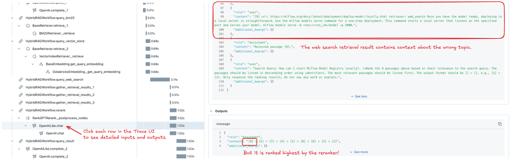

Augmenting LLMs with various data sources is a strong strategy to build LLM applications. However, as the system grows more complex, it becomes challenging to prototype and iteratively build improvements to these more complex systems.

LlamaIndex Workflow is a great framework to build such compound systems. Combined with MLflow, the Workflow API brings efficiency and robustness in the development cycle, enabling easy debugging, experiment tracking, and evaluation for continuous improvement.

In this blog, we will go through the journey of building a sophisticated chatbot with LlamaIndex's Workflow API and MLflow.

## What is LlamaIndex Workflow?

[LlamaIndex Workflow](https://docs.llamaindex.ai/en/stable/module_guides/workflow/) is an event-driven orchestration framework for designing dynamic AI applications. The core of LlamaIndex Workflow consists of:

- `Steps` are units of execution, representing distinct actions in the workflow.

- `Events` trigger these steps, acting as signals that control the workflow’s flow.

- `Workflow` connects these two as a Python class. Each step is implemented as a method of the workflow class, defined with input and output events.

This simple yet powerful abstraction allows you to break down complex tasks into manageable steps, enabling greater flexibility and scalability. As a framework embodying event-driven design, using the `Workflow` APIs makes it intuitive to design parallel and asynchronous execution flows, significantly enhancing the efficiency of long-running tasks and aids in providing production-ready scalability.

## Why Use MLflow with LlamaIndex Workflow?

Workflow provides great flexibility to design nearly arbitrary execution flows. However, with this great power comes a great responsibility. Without managing your changes properly, it can become a chaotic mess of indeterminate states and confusing configurations. After a few dozen changes, you may be asking yourself, "how did my workflow even work?".

**MLflow** brings a powerful MLOps harness to LlamaIndex Workflows throughout the end-to-end development cycle.

- **Experiment Tracking**: MLflow allows you to record various components like steps, prompts, LLMs, and tools, making it easy to improve the system iteratively.

- **Reproducibility**: MLflow packages environment information such as global configurations (`Settings`), library versions, and metadata to ensure consistent deployment across different stages of the ML lifecycle.

- **Tracing**: Debugging issues in a complex event-driven workflow is cumbersome. MLflow Tracing is a production-ready observability solution that natively integrates with LlamaIndex, giving you observability into each internal stage within your Workflow.

- **Evaluation**: Measuring is a crucial task for improving your model. MLflow Evaluation is great tool to evaluate the quality, speed, and cost of your LLM application. It is tightly integrated with MLflow's experiment tracking capabilities, streamlining the process of making iterative improvements.

## Let's Build!🛠️

### Strategy: Hybrid Approach Using Multiple Retrieval Methods

Retrieval-Augmented Generation (RAG) is a powerful framework, but the retrieval step can often become a bottleneck, because embedding-based retrieval may not always capture the most relevant context. While many techniques exist to improve retrieval quality, no single solution works universally. Therefore, an effective strategy is to combine multiple retrieval approaches.

The concept we will explore here is to run several retrieval methods in parallel: (1) standard vector search, (2) keyword-based search (BM25), and (3) web search. The retrieved contexts are then merged, with irrelevant data filtered out to enhance the overall quality.


How do we bring this concept to life? Let’s dive in and build this hybrid RAG using LlamaIndex Workflow and MLflow.

## 1. Set Up Repository

The sample code, including the environment setup script, is available in the [GitHub repository](https://github.com/mlflow/mlflow/tree/master/examples/llama_index/workflow). It contains a complete workflow definition, a hands-on notebook, and a sample dataset for running experiments. To clone it to your working environment, use the following command:

```shell
git clone https://github.com/mlflow/mlflow.git
```

After cloning the repository, set up the virtual environment by running:

```shell
cd mlflow/examples/llama_index/workflow
chmod +x install.sh
./install.sh
```

Once the installation is complete, start Jupyter Notebook within the Poetry environment using:

```shell
poetry run jupyter notebook
```

Next, open the `Tutorial.ipynb` notebook located in the root directory. Throughout this blog, we will walk through this notebook to guide you through the development process.

## 2. Start an MLflow Experiment

An **MLflow Experiment** is where you track all aspects of model development, including model definitions, configurations, parameters, dependency versions, and more. Let’s start by creating a new MLflow experiment called "LlamaIndex Workflow RAG":

```python
import mlflow

mlflow.set_experiment("LlamaIndex Workflow RAG")
```

At this point, the experiment doesn't have any recorded data yet. To view the experiment in the MLflow UI, open a new terminal and run the `mlflow ui` command, then navigate to the provided URL in your browser:

```shell
poetry run mlflow ui
```


## 3. Choose your LLM and Embeddings

Now, set up your preferred LLM and embeddings models to LlamaIndex's Settings object. These models will be used throughout the LlamaIndex components.

For this demonstration, we’ll use OpenAI models, but you can easily switch to different LLM providers or local models by following the instructions in the notebook.

```python
import getpass
import os

os.environ["OPENAI_API_KEY"] = getpass.getpass("Enter OpenAI API Key")

from llama_index.core import Settings
from llama_index.embeddings.openai import OpenAIEmbedding
from llama_index.llms.openai import OpenAI

# LlamaIndex by default uses OpenAI APIs for LLMs and embeddings models. You can use the default
# model (`gpt-3.5-turbo` and `text-embeddings-ada-002` as of Oct 2024), but we recommend using the
# latest efficient models instead for getting better results with lower cost.
Settings.embed_model = OpenAIEmbedding(model="text-embedding-3-large")
Settings.llm = OpenAI(model="gpt-4o-mini")
```

💡 _MLflow will automatically log the `Settings` configuration into your MLflow Experiment when logging models, ensuring reproducibility and reducing the risk of discrepancies between environments._

## 4. Set Up Web Search API

Later in this blog, we will add a web search capability to the QA bot. We will use Tavily AI, a search API
optimized for LLM application and natively integrated with LlamaIndex. Visit [their website](https://tavily.com/) to
get an API key for free-tier use, or use different search engine integrated with LlamaIndex, e.g. [GoogleSearchToolSpec](https://docs.llamaindex.ai/en/stable/api_reference/tools/google/#llama_index.tools.google.GoogleSearchToolSpec).

Once you get the API key, set it to the environment variable:

```python
os.environ["TAVILY_AI_API_KEY"] = getpass.getpass("Enter Tavily AI API Key")
```

## 5. Set Up Document Indices for Retrieval

The next step is to build a document index for retrieval from MLflow documentation. The `urls.txt` file in the `data` directory contains a list of MLflow documentation pages. These pages can be loaded as document objects using the web page reader utility.

```python
from llama_index.readers.web import SimpleWebPageReader

with open("data/urls.txt", "r") as file:
    urls = [line.strip() for line in file if line.strip()]

documents = SimpleWebPageReader(html_to_text=True).load_data(urls)
```

Next, ingest these documents into a vector database. In this tutorial, we’ll use the [Qdrant](https://qdrant.tech/) vector store, which is free if self-hosted. If Docker is installed on your machine, you can start the Qdrant database by running the official Docker container:

```shell
$ docker pull qdrant/qdrant
$ docker run -p 6333:6333 -p 6334:6334 \
    -v $(pwd)/.qdrant_storage:/qdrant/storage:z \
    qdrant/qdrant
```

Once the container is running, you can create an index object that connects to the Qdrant database:

```python
import qdrant_client
from llama_index.vector_stores.qdrant import QdrantVectorStore

client = qdrant_client.QdrantClient(host="localhost", port=6333)
vector_store = QdrantVectorStore(client=client, collection_name="mlflow_doc")

from llama_index.core import StorageContext, VectorStoreIndex

storage_context = StorageContext.from_defaults(vector_store=vector_store)
index = VectorStoreIndex.from_documents(
    documents=documents,
    storage_context=storage_context
)
```

Of course, you can use your preferred vector store here. LlamaIndex supports a variety of vector databases, such as [FAISS](https://docs.llamaindex.ai/en/stable/examples/vector_stores/FaissIndexDemo/), [Chroma](https://docs.llamaindex.ai/en/stable/examples/vector_stores/ChromaIndexDemo/), and [Databricks Vector Search](https://docs.llamaindex.ai/en/stable/examples/vector_stores/DatabricksVectorSearchDemo/). If you choose an alternative, follow the relevant LlamaIndex documentation and update the `workflow/workflow.py` file accordingly.

In addition to evaluating the vector search retrieval, we will assess the keyword-based retriever (BM25) later. Let's set up local document storage to enable BM25 retrieval in the workflow.

```python
from llama_index.core.node_parser import SentenceSplitter
from llama_index.retrievers.bm25 import BM25Retriever

splitter = SentenceSplitter(chunk_size=512)
nodes = splitter.get_nodes_from_documents(documents)
bm25_retriever = BM25Retriever.from_defaults(nodes=nodes)
bm25_retriever.persist(".bm25_retriever")
```

## 6. Define a Workflow

Now that the environment and data sources are ready, we can build the workflow and experiment with it. The complete workflow code is defined in the `workflow` directory. Let's explore some key components of the implementation.

### Events

The `workflow/events.py` file defines all the events used within the workflow. These are simple Pydantic models that carry information between workflow steps. For example, the `VectorSearchRetrieveEvent` triggers the vector search step by passing the user's query.

```python
class VectorSearchRetrieveEvent(Event):
    """Event for triggering VectorStore index retrieval step."""
    query: str
```

### Prompts

Throughout the workflow execution, we call LLMs multiple times. The prompt templates for these LLM calls are defined in the `workflow/prompts.py` file.

### Workflow Class

The main workflow class is defined in `workflow/workflow.py`. Let's break down how it works.

The constructor accepts a retrievers argument, which specifies the retrieval methods to be used in the workflow. For instance, if `["vector_search", "bm25"]` is passed, the workflow performs vector search and keyword-based search, skipping web search.

💡 Deciding which retrievers to utilize dynamically allows us to experiment with different retrieval strategies without needing to replicate nearly identical model code.

```python
class HybridRAGWorkflow(Workflow):

    VALID_RETRIEVERS = {"vector_search", "bm25", "web_search"}

    def __init__(self, retrievers=None, **kwargs):
        super().__init__(**kwargs)
        self.llm = Settings.llm
        self.retrievers = retrievers or []

        if invalid_retrievers := set(self.retrievers) - self.VALID_RETRIEVERS:
            raise ValueError(f"Invalid retrievers specified: {invalid_retrievers}")

        self._use_vs_retriever = "vector_search" in self.retrievers
        self._use_bm25_retriever = "bm25" in self.retrievers
        self._use_web_search = "web_search" in self.retrievers

        if self._use_vs_retriever:
            qd_client = qdrant_client.QdrantClient(host=_QDRANT_HOST, port=_QDRANT_PORT)
            vector_store = QdrantVectorStore(client=qd_client, collection_name=_QDRANT_COLLECTION_NAME)
            index = VectorStoreIndex.from_vector_store(vector_store=vector_store)
            self.vs_retriever = index.as_retriever()

        if self._use_bm25_retriever:
            self.bm25_retriever = BM25Retriever.from_persist_dir(_BM25_PERSIST_DIR)

        if self._use_web_search:
            self.tavily_tool = TavilyToolSpec(api_key=os.environ.get("TAVILY_AI_API_KEY"))
```

The workflow begins by executing a step that takes the `StartEvent` as input, which is the `route_retrieval` step in this case. This step inspects the retrievers parameter and triggers the necessary retrieval steps. By using the `send_event()` method of the context object, multiple events can be dispatched in parallel from this single step.

```python
    # If no retriever is specified, proceed directly to the final query step with an empty context
    if len(self.retrievers) == 0:
        return QueryEvent(context="")

    # Trigger the retrieval steps based on the configuration
    if self._use_vs_retriever:
        ctx.send_event(VectorSearchRetrieveEvent(query=query))
    if self._use_bm25_retriever:
        ctx.send_event(BM25RetrieveEvent(query=query))
    if self._use_web_search:
        ctx.send_event(TransformQueryEvent(query=query))
```

The retrieval steps are straightforward. However, the web search step is more advanced as it includes an additional step to transform the user's question into a search-friendly query using an LLM.

The results from all the retrieval steps are aggregated in the `gather_retrieval_results` step. Here, the `ctx.collect_events()` method is used to poll for the results of the asynchronously executed steps.

```python
    results = ctx.collect_events(ev, [RetrievalResultEvent] * len(self.retrievers))
```

Passing all results from multiple retrievers often leads to a large context with unrelated or duplicate content. To address this, we need to filter and select the most relevant results. While a score-based approach is common, web search results do not return similarity scores. Therefore, we use an LLM to sort and filter out irrelevant results. The rerank step achieves this by leveraging the built-in reranker integration with [RankGPT](https://github.com/sunnweiwei/RankGPT).

```python
    reranker = RankGPTRerank(llm=self.llm, top_n=5)
    reranked_nodes = reranker.postprocess_nodes(ev.nodes, query_str=query)
    reranked_context = "\n".join(node.text for node in reranked_nodes)
```

Finally, the reranked context is passed to the LLM along with the user query to generate the final answer. The result is returned as a `StopEvent` with the `result` key.

```python
    @step
    async def query_result(self, ctx: Context, ev: QueryEvent) -> StopEvent:
        """Get result with relevant text."""
        query = await ctx.get("query")

        prompt = FINAL_QUERY_TEMPLATE.format(context=ev.context, query=query)
        response = self.llm.complete(prompt).text
        return StopEvent(result=response)
```

Now, let's instantiate the workflow and run it.

```python
# Workflow with VS + BM25 retrieval
from workflow.workflow import HybridRAGWorkflow

workflow = HybridRAGWorkflow(retrievers=["vector_search", "bm25"], timeout=60)
response = await workflow.run(query="Why use MLflow with LlamaIndex?")
print(response)
```

## 7. Log the Workflow in an MLflow Experiment

Now we want to run the workflow with various different retrieval strategies and evaluate the performance of each. However, before running the evaluation, we'll log the model in MLflow to track both the model and its performance within an **MLflow Experiment**.

For the LlamaIndex Workflow, we use the new [Model-from-code](https://mlflow.org/docs/latest/models.html#models-from-code) method, which logs models as standalone Python scripts. This approach avoids the risks and instability associated with serialization methods like pickle, relying instead on code as the single source of truth for the model definition. When combined with MLflow's environment-freezing capability, it provides a reliable way to persist models. For more details, refer to the [MLflow documentation](https://mlflow.org/docs/latest/models.html#models-from-code).

💡 In the `workflow` directory, there's a `model.py` script that imports the `HybridRAGWorkflow` and instantiates it with dynamic configurations passed via the `model_config` parameter during logging. This design allows you to track models with different configurations without duplicating the model definition.

We'll start an MLflow Run and log the model script `model.py` with different configurations using the [mlflow.llama_index.log_model()](https://mlflow.org/docs/latest/python_api/mlflow.llama_index.html#mlflow.llama_index.log_model) API.

```python
# Different configurations we will evaluate. We don't run evaluation for all permutation
# for demonstration purpose, but you can add as many patterns as you want.
run_name_to_retrievers = {
    # 1. No retrievers (prior knowledge in LLM).
    "none": [],
    # 2. Vector search retrieval only.
    "vs": ["vector_search"],
    # 3. Vector search and keyword search (BM25)
    "vs + bm25": ["vector_search", "bm25"],
    # 4. All retrieval methods including web search.
    "vs + bm25 + web": ["vector_search", "bm25", "web_search"],
}

# Create an MLflow Run and log model with each configuration.
models = []
for run_name, retrievers in run_name_to_retrievers.items():
    with mlflow.start_run(run_name=run_name):
        model_info = mlflow.llama_index.log_model(
            # Specify the model Python script.
            llama_index_model="workflow/model.py",
            # Specify retrievers to use.
            model_config={"retrievers": retrievers},
            # Define dependency files to save along with the model
            code_paths=["workflow"],
            # Subdirectory to save artifacts (not important)
            artifact_path="model",
        )
        models.append(model_info)
```

Now open the MLflow UI again, and this time it should show 4 MLflow Runs are recorded with different `retrievers` parameter values. By clicking each Run name and navigate to the "Artifacts" tab, you can see MLflow records the model and various metadata, such as dependency versions and settings.


## 8. Enable MLflow Tracing

Before running the evaluation, there’s one final step: enabling **MLflow Tracing**. We'll dive into this feature and why we do this here later, but for now, you can enable it with a simple one-line command. MLflow will automatically trace every LlamaIndex execution.

```python
mlflow.llama_index.autolog()
```

## 9. Evaluate the Workflow with Different Retriever Strategies

The example repository includes a sample evaluation dataset, `mlflow_qa_dataset.csv`, containing 30 question-answer pairs related to MLflow.

```python
import pandas as pd

eval_df = pd.read_csv("data/mlflow_qa_dataset.csv")
display(eval_df.head(3))
```

To evaluate the workflow, use the [mlflow.evaluate()](https://mlflow.org/docs/latest/python_api/mlflow.html#mlflow.evaluate) API, which requires (1) your dataset, (2) the logged model, and (3) the metrics you want to compute.

```python
from mlflow.metrics import latency
from mlflow.metrics.genai import answer_correctness


for model_info in models:
    with mlflow.start_run(run_id=model_info.run_id):
        result = mlflow.evaluate(
            # Pass the URI of the logged model above
            model=model_info.model_uri,
            data=eval_df,
            # Specify the column for ground truth answers.
            targets="ground_truth",
            # Define the metrics to compute.
            extra_metrics=[
                latency(),
                answer_correctness("openai:/gpt-4o-mini"),
            ],
            # The answer_correctness metric requires "inputs" column to be
            # present in the dataset. We have "query" instead so need to
            # specify the mapping in `evaluator_config` parameter.
            evaluator_config={"col_mapping": {"inputs": "query"}},
        )
```

In this example, we evaluate the model with two metrics:

1. **Latency**: Measures the time taken to execute a workflow for a single query.
2. **Answer Correctness**: Evaluates the accuracy of answers based on the ground truth, scored by the OpenAI GPT-4o model on a 1–5 scale.

These metrics are just for demonstration purposes—you can add additional metrics like toxicity or faithfulness, or even create your own. See the MLflow documentation for the full set of [built-in metrics](https://mlflow.org/docs/latest/llms/llm-evaluate/index.html#llm-evaluation-metrics)
and how to define [custom metrics](https://mlflow.org/docs/latest/llms/llm-evaluate/index.html#creating-custom-llm-evaluation-metrics).

The evaluation process will take a few minutes. Once completed, you can view the results in the MLflow UI. Open the Experiment page and click on the chart icon 📈 above the Run list.


\*💡 The evaluation results can be different depending on model set up and some randomness.

The first row shows bar charts for the answer correctness metrics, while the second row displays latency results. The best-performing combination is "Vector Search + BM25". Interestingly, adding web search not only increases latency significantly but also decreases answer correctness.

Why does this happen? It appears some answers from the web-search-enabled model are off-topic. For example, in response to a question about starting the Model Registry, the web-search model provides an unrelated answer about model deployment, while the "vs + bm25" model offers a correct response.


Where did this incorrect answer come from? This seems to be a retriever issue, as we only changed the retrieval strategy. However, it's difficult to see what each retriever returned from the final result. To gain deeper insights into what's happening behind the scenes, MLflow Tracing is the perfect solution.

## 10. Inspecting Quality Issues with MLflow Trace

[MLflow Tracing](https://mlflow.org/docs/latest/llms/tracing/index.html) is a new feature that brings observability to LLM applications. It integrates seamlessly with LlamaIndex, recording all inputs, outputs, and metadata about intermediate steps during workflow execution. Since we called `mlflow.llama_index.autolog()` at the start, every LlamaIndex operation has been traced and recorded in the MLflow Experiment.

To inspect the trace for a specific question from the evaluation, navigate to the "Traces" tab on the experiment page. Look for the row with the particular question in the request column and the run name "vs + bm25 + web." Clicking the request ID link opens the Trace UI, where you can view detailed information about each step in the execution, including inputs, outputs, metadata, and latency.



In this case, we identified the issue by examining the reranker step. The web search retriever returned irrelevant context related to model serving, and the reranker incorrectly ranked it as the most relevant. With this insight, we can determine potential improvements, such as refining the reranker to better understand MLflow topics, improving web search precision, or even removing the web search retriever altogether.

## Conclusion

In this blog, we explored how the combination of LlamaIndex and MLflow can elevate the development of Retrieval-Augmented Generation (RAG) workflows, bringing together powerful model management and observability capabilities. By integrating multiple retrieval strategies (such as vector search, BM25, and web search) we demonstrated how flexible retrieval can enhance the performance of LLM-driven applications.

- **Experiment Tracking** allowed us to organize and log different workflow configurations, ensuring reproducibility and enabling us to track model performance across multiple runs.
- **MLflow Evaluate** enabled us to easily log and evaluate the workflow with different retriever strategies, using key metrics like latency and answer correctness to compare performance.
- **MLflow UI** gave us a clear visualization of how various retrieval strategies impacted both accuracy and latency, helping us identify the most effective configurations.
- **MLflow Tracing**, integrated with LlamaIndex, provided detailed observability into each step of the workflow for diagnosing quality issues, such as incorrect reranking of search results.

With these tools, you have a complete framework for building, logging, and optimizing RAG workflows. As LLM technology continues to evolve, the ability to track, evaluate, and fine-tune every aspect of model performance will be essential. We highly encourage you to experiment further and see how these tools can be tailored to your own applications.

To continue learning, explore the following resources:

- Learn more about the [MLflow LlamaIndex integration](https://mlflow.org/docs/latest/llms/llama-index/index.html).
- Discover additional MLflow LLM features at [LLMs in MLflow](https://mlflow.org/docs/latest/llms/index.html).
- Deploy your workflow to a serving endpoint with [MLflow Deployment](https://mlflow.org/docs/latest/deployment/index.html).
- Check out more [Workflow examples](https://docs.llamaindex.ai/en/stable/module_guides/workflow/#examples) from LlamaIndex.
