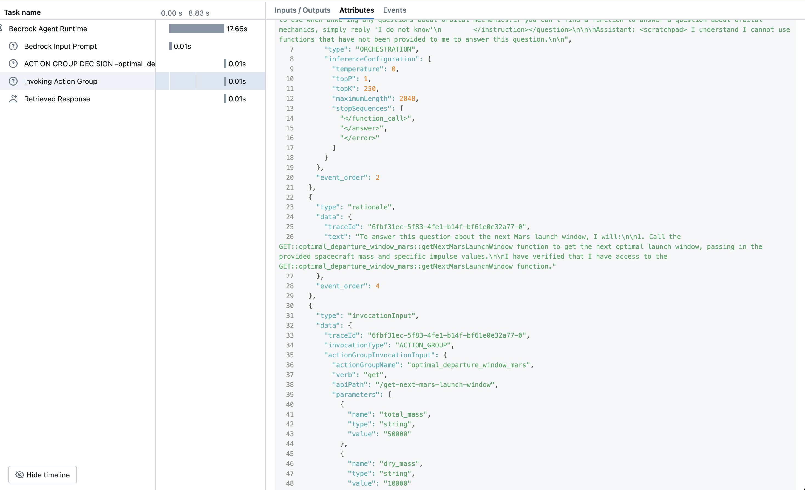

In this blog post, we delve into the integration of AWS Bedrock Agent as a ChatModel within MLflow, focusing on how to
leverage Bedrock's [Action Groups](https://docs.aws.amazon.com/bedrock/latest/userguide/agents-action-create.html) 
and [Knowledge Bases](https://docs.aws.amazon.com/bedrock/latest/userguide/agents-kb-add.html)
to build a conversational AI application. The blog will guide you
through setting up the Bedrock Agent, configuring Action Groups to enable custom actions with Lambda, and utilizing knowledge bases
for context-aware interactions. A special emphasis is placed on implementing tracing within MLflow.
By the end of this article, you'll have a good understanding of how to combine AWS Bedrock's advanced features
with MLflow's capabilities such as agent request tracing, model tracking and consistent signatures for input examples.

## What is AWS Bedrock?

Amazon Bedrock is a managed service by AWS that simplifies the development of generative AI applications.
It provides access to a variety of foundation models (FMs) from leading AI providers through a single API,
enabling developers to build and scale AI solutions securely and efficiently.

Key Components Relevant to This Integration:

**Bedrock Agent**: At a high level, a bedrock agent is an abstraction within bedrock that consists of a foundation model,
action groups and knowledge bases.

**Action Groups**: These are customizable sets of actions that define what tasks the Bedrock Agent can perform.
Action Groups consist of an OpenAPI Schema and the corresponding Lambda functions that will be used to execute tool calls.
The OpenAPI Schema is used to define APIs available for the agent to invoke and complete tasks.

**Knowledge Bases**: Amazon Bedrock supports the creation of Knowledge Bases to implement
Retrieval Augmented Generation workflows. It consists of data sources (on S3 or webpages) 
and a vector store that contains the embedded references to this data.

Bedrock's Agent execution process and the corresponding tracing for Agent instrumentation is grouped as follows:

**Pre-processing**
This step validates, contextualizes and categorizes user input.

**Orchestration**
This step handles the interpretation of user inputs, deciding when to and which tasks to perform, 
and iteratively refines responses

**Post-processing (Optional)**
This step formats the final response before returning to the user.

**Traces**
Each step above has an execution trace, which consists of rationale, actions, queries and observations at each step
of the agent's response. This includes both the inputs and outputs of action groups and knowledge base queries.

We will look at these traces in detail below.

## What is a ChatModel in MLflow?

The [ChatModel class](https://mlflow.org/docs/latest/llms/chat-model-guide/index.html) is specifically 
designed to make it easier to implement models that are compatible with
popular large language model (LLM) chat APIs. It enables you to seamlessly bring in your own models or agents and
leverage MLflow's functionality, even if those models aren't natively supported as a flavor in MLflow. Additionally,
It provides default signatures, which are static for ChatModel, unlike PythonModel.

In the following sections, we will use ChatModel to wrap the Bedrock Agent.

For more detailed information about ChatModel, you can read the MLflow documentation
[here](https://mlflow.org/docs/latest/llms/chat-model-guide/index.html) and
[here](https://mlflow.org/docs/latest/python_api/mlflow.pyfunc.html#mlflow.pyfunc.ChatModel)

## Setting up AWS Bedrock Agent with an Action group

In this section, we will deploy all components of a bedrock agent so that we can invoke it as a `ChatModel` in MLflow.

### Prerequisites

You will need to setup following items (either via the AWS console or SDKs):

- Setting up role for the agent and Lambda function. [Example](https://github.com/awsdocs/aws-doc-sdk-examples/blob/main/python/example_code/bedrock-agent/scenario_get_started_with_agents.py#L148)
- Create/deploy the agent. [Example](https://github.com/awsdocs/aws-doc-sdk-examples/blob/main/python/example_code/bedrock-agent/scenario_get_started_with_agents.py#L191)
  - **Important**: Save the agent ID here as we will need this below.
- Creating a Lambda function. [Example](https://github.com/awsdocs/aws-doc-sdk-examples/blob/main/python/example_code/bedrock-agent/scenario_get_started_with_agents.py#L218)
- Configuring IAM permissions for agent-Lambda interaction. [Example](https://github.com/awsdocs/aws-doc-sdk-examples/blob/main/python/example_code/bedrock-agent/scenario_get_started_with_agents.py#L283) and [Example](https://github.com/awsdocs/aws-doc-sdk-examples/blob/main/python/example_code/bedrock-agent/scenario_get_started_with_agents.py#L297)
- Creating an action group to link the agent and Lambda. [Example](https://github.com/awsdocs/aws-doc-sdk-examples/blob/main/python/example_code/bedrock-agent/scenario_get_started_with_agents.py#L312)
  - **Important**:Save the agent alias ID here as we will need this below.
- Deploy Bedrock agent with an alias. [Example](https://github.com/awsdocs/aws-doc-sdk-examples/blob/main/python/example_code/bedrock-agent/scenario_get_started_with_agents.py#L342)

<b>In our case, we are going to deploy the following example action group, which calculates the next optimal departure 
date for a Hohmann transfer from Earth to Mars, based on the spacecraft's mass and specific impulse.</b>

### OpenAPI schema for Action Groups
As described above, here is the OpenAPI Schema for our example action group:

```yaml
openapi: 3.0.0
info:
  title: Time API
  version: 1.0.0
  description: API to get the next optimal departure date for a Hohmann transfer from Earth to Mars.
paths:
  /get-next-mars-launch-window:
    get:
      summary: Gets the next optimal launch window to Mars.
      description: Gets the next optimal launch window to Mars.
      operationId: getNextMarsLaunchWindow
      parameters:
        - name: total_mass
          in: query
          description: Total mass of the spacecraft including fuel (kg)
          required: true
          schema:
            type: string
        - name: dry_mass
          in: query
          description: Mass of the spacecraft without fuel (kg).
          required: true
          schema:
            type: string
        - name: specific_impulse
          in: query
          description: Specific impulse of the propulsion system (s).
          required: true
          schema:
            type: string
      responses:
        '200':
          description: The next optimal departure date for a Hohmann transfer from Earth to Mars, based on the spacecraft's mass and specific impulse.
          content:
            'application/json':
              schema:
                type: object
                properties:
                  next_launch_window:
                    type: string
                    description: Next Mars Launch Window

```

### Action groups - Lamda function

Here is the code deployment for action group's example Lambda:

```python
import json
import math
from datetime import datetime, timedelta


def lambda_handler(event, context):
    def _calculate_optimal_departure_window(
        total_mass, dry_mass, specific_impulse
    ):
        """
        Calculate the next optimal departure date for a Hohmann transfer from Earth to Mars,
        based on the spacecraft's mass and specific impulse.

        Parameters:
        - total_mass (float): Total mass of the spacecraft including fuel (kg).
        - dry_mass (float): Mass of the spacecraft without fuel (kg).
        - specific_impulse (float): Specific impulse of the propulsion system (s).

        Returns:
        - dict: {
            'next_launch_date': datetime,
            'synodic_period_days': float,
            'transfer_time_days': float,
            'delta_v_available_m_s': float,
            'delta_v_required_m_s': float,
            'is_feasible': bool
          }
        """
        current_date = None
        # Constants
        G0 = 9.80665  # m/s^2, standard gravity
        MU_SUN = (
            1.32712440018e20  # m^3/s^2, standard gravitational parameter for the Sun
        )
        AU = 1.496e11  # meters, astronomical unit
        EARTH_ORBITAL_PERIOD = 365.25  # days
        MARS_ORBITAL_PERIOD = 686.98  # days
        SYNODIC_PERIOD = 1 / abs((1 / EARTH_ORBITAL_PERIOD) - (1 / MARS_ORBITAL_PERIOD))
        TRANSFER_TIME = 259  # days, approximate duration of Hohmann transfer
        BASE_LAUNCH_DATE = datetime(2020, 7, 1)  # A reference past launch window date

        # Orbital Radii (assuming circular orbits for simplicity)
        r1 = AU  # Earth's orbital radius in meters
        r2 = 1.524 * AU  # Mars' orbital radius in meters

        # Calculate Required Delta-V for Hohmann Transfer
        # Using vis-viva equation for Hohmann transfer
        def calculate_hohmann_delta_v(mu, r_start, r_end):
            # Velocity of departure orbit (Earth)
            v_start = math.sqrt(mu / r_start)
            # Velocity of transfer orbit at departure
            a_transfer = (r_start + r_end) / 2
            v_transfer_start = math.sqrt(mu * (2 / r_start - 1 / a_transfer))
            delta_v1 = v_transfer_start - v_start

            # Velocity of arrival orbit (Mars)
            v_end = math.sqrt(mu / r_end)
            # Velocity of transfer orbit at arrival
            v_transfer_end = math.sqrt(mu * (2 / r_end - 1 / a_transfer))
            delta_v2 = v_end - v_transfer_end

            return delta_v1, delta_v2

        delta_v1, delta_v2 = calculate_hohmann_delta_v(MU_SUN, r1, r2)
        delta_v_required = abs(delta_v1) + abs(delta_v2)  # Total delta-v in m/s

        # Delta-V using Tsiolkovsky Rocket Equation
        if dry_mass <= 0 or total_mass <= dry_mass:
            raise ValueError("Total mass must be greater than dry mass.")

        delta_v_available = (
            specific_impulse * G0 * math.log(total_mass / dry_mass)
        )  # m/s

        is_feasible = delta_v_available >= delta_v_required

        if current_date is None:
            current_date = datetime.now()

        days_since_base = (current_date - BASE_LAUNCH_DATE).days
        if days_since_base < 0:
            # Current date is before the base launch date
            next_launch_date = BASE_LAUNCH_DATE
        else:
            synodic_periods_passed = days_since_base / SYNODIC_PERIOD
            synodic_periods_passed_int = math.floor(synodic_periods_passed)
            next_launch_date = BASE_LAUNCH_DATE + timedelta(
                days=(synodic_periods_passed_int + 1) * SYNODIC_PERIOD
            )

        next_launch_date = next_launch_date.replace(
            hour=0, minute=0, second=0, microsecond=0
        )

        return {
            "next_launch_date": next_launch_date,
            "synodic_period_days": SYNODIC_PERIOD,
            "transfer_time_days": TRANSFER_TIME,
            "delta_v_available_m_s": delta_v_available,
            "delta_v_required_m_s": delta_v_required,
            "is_feasible": is_feasible,
        }

    query_params = {
        event["name"]: event["value"] for event in event.get("parameters", [])
    }

    total_mass = float(query_params.get("total_mass"))
    dry_mass = float(query_params.get("dry_mass"))
    specific_impulse = float(query_params.get("specific_impulse"))

    response = {
        "next_launch_window": _calculate_optimal_departure_window(
            total_mass, dry_mass, specific_impulse
        )
    }

    response_body = {"application/json": {"body": json.dumps(response)}}

    action_response = {
        "actionGroup": event["actionGroup"],
        "apiPath": event["apiPath"],
        "httpMethod": event["httpMethod"],
        "httpStatusCode": 200,
        "responseBody": response_body,
    }

    session_attributes = event["sessionAttributes"]
    prompt_session_attributes = event["promptSessionAttributes"]

    return {
        "messageVersion": "1.0",
        "response": action_response,
        "sessionAttributes": session_attributes,
        "promptSessionAttributes": prompt_session_attributes,
    }
```

Next, we are going to wrap Bedrock agent as a ChatModel so that we can register and load it for inference.

## Writing ChatModel for Bedrock agent

Here are the top-level packages used for running the following example locally in **Python 3.12.7**:

```text
boto3==1.35.31
mlflow==2.16.2
```

### Implementing Bedrock Agent as an MLflow ChatModel with Tracing

```python
import copy
import os
import uuid
from typing import List, Optional

import boto3
import mlflow
from botocore.config import Config
from mlflow.entities import SpanType
from mlflow.pyfunc import ChatModel
from mlflow.types.llm import ChatResponse, ChatMessage, ChatParams, ChatChoice


class BedrockModel(ChatModel):
    def __init__(self):
        """
        Initializes the BedrockModel instance with placeholder values.

        Note:
            The `load_context` method cannot create new instance variables; it can only modify existing ones.
            Therefore, all instance variables should be defined in the `__init__` method with placeholder values.
        """
        self.brt = None
        self._main_bedrock_agent = None
        self._bedrock_agent_id = None
        self._bedrock_agent_alias_id = None
        self._inference_configuration = None
        self._agent_instruction = None
        self._model = None
        self._aws_region = None

    def __getstate__(self):
        """
        Prepares the instance state for pickling.

        This method is needed because the `boto3` client (`self.brt`) cannot be pickled.
        By excluding `self.brt` from the state, we ensure that the model can be serialized and deserialized properly.
        """
        # Create a dictionary of the instance's state, excluding the boto3 client
        state = self.__dict__.copy()
        del state["brt"]
        return state

    def __setstate__(self, state):
        """
        Restores the instance state during unpickling.

        This method is needed to reinitialize the `boto3` client (`self.brt`) after the instance is unpickled,
        because the client was excluded during pickling.
        """
        self.__dict__.update(state)
        self.brt = None

    def load_context(self, context):
        """
        Initializes the Bedrock client with AWS credentials.

        Args:
            context: The MLflow context containing model configuration.

        Note:
            Dependent secret variables must be in the execution environment prior to loading the model;
            else they will not be available during model initialization.
        """
        self._main_bedrock_agent = context.model_config.get("agents", {}).get(
            "main", {}
        )
        self._bedrock_agent_id = self._main_bedrock_agent.get("bedrock_agent_id")
        self._bedrock_agent_alias_id = self._main_bedrock_agent.get(
            "bedrock_agent_alias_id"
        )
        self._inference_configuration = self._main_bedrock_agent.get(
            "inference_configuration"
        )
        self._agent_instruction = self._main_bedrock_agent.get("instruction")
        self._model = self._main_bedrock_agent.get("model")
        self._aws_region = self._main_bedrock_agent.get("aws_region")

        # Initialize the Bedrock client
        self.brt = boto3.client(
            service_name="bedrock-agent-runtime",
            config=Config(region_name=self._aws_region),
            aws_access_key_id=os.environ["AWS_ACCESS_KEY"],
            aws_secret_access_key=os.environ["AWS_SECRET_ACCESS_KEY"],
            aws_session_token=os.environ["AWS_SESSION_TOKEN"],
            region_name=self._aws_region,
        )

    @staticmethod
    def _extract_trace_groups(events):
        """
        Extracts trace groups from a list of events based on their trace IDs.

        Args:
            events (list): A list of event dictionaries.

        Returns:
            dict: A dictionary where keys are trace IDs and values are lists of trace items.
        """
        from collections import defaultdict

        trace_groups = defaultdict(list)

        def find_trace_ids(obj, original_trace, depth=0, parent_key=None):
            if depth > 5:
                return  # Stop recursion after 5 levels if no traceId has been found
            if isinstance(obj, dict):
                trace_id = obj.get("traceId")
                if trace_id:
                    # Include the parent key as the 'type'
                    item = {
                        "type": parent_key,
                        "data": obj,
                        "event_order": original_trace.get("trace", {}).get(
                            "event_order"
                        ),
                    }
                    trace_groups[trace_id].append(item)
                else:
                    for key, value in obj.items():
                        find_trace_ids(
                            value, original_trace, depth=depth + 1, parent_key=key
                        )
            elif isinstance(obj, list):
                for item in obj:
                    find_trace_ids(item, item, depth=depth + 1, parent_key=parent_key)

        find_trace_ids(events, {})
        return dict(trace_groups)

    @staticmethod
    def _get_final_response_with_trace(trace_id_groups: dict[str, list[dict]]):
        """
        Processes trace groups to extract the final response and create relevant MLflow spans.

        Args:
            trace_id_groups (dict): A dictionary of trace groups keyed by trace IDs.

        Returns:
            str: The final response text extracted from the trace groups.
        """
        trace_id_groups_copy = copy.deepcopy(trace_id_groups)
        model_invocation_input_key = "modelInvocationInput"

        def _create_trace_by_type(
            trace_name, _trace_id, context_input, optional_rationale_subtrace
        ):
            @mlflow.trace(
                name=trace_name,
                attributes={"trace_attributes": trace_id_groups[_trace_id]},
            )
            def _trace_agent_pre_context(inner_input_trace):
                return optional_rationale_subtrace.get("data", {}).get("text")

            trace_id_groups_copy[_trace_id].remove(context_input)
            _trace_agent_pre_context(context_input.get("data", {}).get("text"))

        def _extract_action_group_trace(
            _trace_id, trace_group, action_group_invocation_input: dict
        ):
            @mlflow.trace(
                name="action-group-invocation",
                attributes={"trace_attributes": trace_id_groups[_trace_id]},
            )
            def _action_group_trace(inner_trace_group):
                for _trace in trace_group:
                    action_group_invocation_output = _trace.get("data", {}).get(
                        "actionGroupInvocationOutput"
                    )
                    if action_group_invocation_output is not None:
                        action_group_response = str(
                            {
                                "action_group_name": action_group_invocation_input.get(
                                    "actionGroupName"
                                ),
                                "api_path": action_group_invocation_input.get(
                                    "apiPath"
                                ),
                                "execution_type": action_group_invocation_input.get(
                                    "executionType"
                                ),
                                "execution_output": action_group_invocation_output.get(
                                    "text"
                                ),
                            }
                        )
                        trace_group.remove(_trace)
                        return action_group_response

            _action_group_trace(str(action_group_invocation_input))

        def _extract_knowledge_base_trace(
            _trace_id, trace_group, knowledge_base_lookup_input
        ):
            @mlflow.trace(
                name="knowledge-base-lookup",
                attributes={"trace_attributes": trace_id_groups[_trace_id]},
            )
            def _knowledge_base_trace(inner_trace_group):
                for _trace in trace_group:
                    knowledge_base_lookup_output = _trace.get("data", {}).get(
                        "knowledgeBaseLookupOutput"
                    )
                    if knowledge_base_lookup_output is not None:
                        knowledge_base_response = str(
                            {
                                "knowledge_base_id": knowledge_base_lookup_input.get(
                                    "knowledgeBaseId"
                                ),
                                "text": knowledge_base_lookup_input.get("text"),
                                "retrieved_references": knowledge_base_lookup_output.get(
                                    "retrievedReferences"
                                ),
                            }
                        )
                        trace_group.remove(_trace)
                        return knowledge_base_response

            _knowledge_base_trace(str(trace_group))

        def _trace_group_type(
            _trace_id, trace_group, _trace, optional_rationale_subtrace
        ):
            trace_name = "observation"
            pre_processing_trace_id_suffix = "-pre"
            if pre_processing_trace_id_suffix in _trace_id:
                trace_name = "agent-initial-context"
            else:
                for _inner_trace in trace_group:
                    action_group_invocation_input = _inner_trace.get("data", {}).get(
                        "actionGroupInvocationInput"
                    )
                    if action_group_invocation_input is not None:
                        action_group_name = action_group_invocation_input.get(
                            "actionGroupName"
                        )
                        trace_name = f"ACTION-GROUP-{action_group_name}"
                        _create_trace_by_type(
                            trace_name, _trace_id, _trace, optional_rationale_subtrace
                        )
                        _extract_action_group_trace(
                            _trace_id, trace_group, action_group_invocation_input
                        )
                        trace_group.remove(_trace)
                    knowledge_base_lookup_input = _inner_trace.get("data", {}).get(
                        "knowledgeBaseLookupInput"
                    )
                    if knowledge_base_lookup_input is not None:
                        knowledge_base_id = knowledge_base_lookup_input.get(
                            "knowledgeBaseId"
                        )
                        trace_name = f"KNOWLEDGE_BASE_{knowledge_base_id}"
                        _create_trace_by_type(
                            trace_name, _trace_id, _trace, optional_rationale_subtrace
                        )
                        _extract_knowledge_base_trace(
                            _trace_id, trace_group, knowledge_base_lookup_input
                        )
                        trace_group.remove(_trace)
            return trace_name

        for _trace_id, _trace_group in trace_id_groups_copy.items():
            trace_group = sorted(_trace_group, key=lambda tg: tg["event_order"])
            model_invocation_input_subtrace = None
            optional_rationale_subtrace = None
            for _trace in _trace_group:
                if model_invocation_input_key == _trace.get("type", ""):
                    model_invocation_input_subtrace = _trace
                elif "rationale" == _trace.get("type", ""):
                    optional_rationale_subtrace = _trace
            _trace_group_type(
                _trace_id,
                trace_group,
                model_invocation_input_subtrace,
                optional_rationale_subtrace,
            )

        final_response = (
            list(trace_id_groups_copy.values())[-1][-1]
            .get("data", {})
            .get("finalResponse", {})
            .get("text")
        )
        return final_response

    @mlflow.trace(name="Bedrock Input Prompt")
    def _get_agent_prompt(self, raw_input_question):
        """
        Constructs the agent prompt by combining the input question and the agent instruction.

        Args:
            raw_input_question (str): The user's input question.

        Returns:
            str: The formatted agent prompt.
        """
        return f"""
        Answer the following question and pay strong attention to the prompt:
        <question>
        {raw_input_question}
        </question>
        <instruction>
        {self._agent_instruction}
        </instruction>
        """

    @mlflow.trace(name="bedrock-agent", span_type=SpanType.CHAT_MODEL)
    def predict(
        self, context, messages: List[ChatMessage], params: Optional[ChatParams]
    ) -> ChatResponse:
        """
        Makes a prediction using the Bedrock agent and processes the response.

        Args:
            context: The MLflow context.
            messages (List[ChatMessage]): A list of chat messages.
            params (Optional[ChatParams]): Optional parameters for the chat.

        Returns:
            ChatResponse: The response from the Bedrock agent.
        """
        formatted_input = messages[-1].content
        session_id = uuid.uuid4().hex

        response = self.brt.invoke_agent(
            agentId=self._bedrock_agent_id,
            agentAliasId=self._bedrock_agent_alias_id,
            inputText=self._get_agent_prompt(formatted_input),
            enableTrace=True,
            sessionId=session_id,
            endSession=False,
        )

        # Since this provider's output doesn't match the OpenAI specification,
        # we need to go through the returned trace data and map it appropriately
        # to create the MLflow span object.
        events = []
        for index, event in enumerate(response.get("completion", [])):
            if "trace" in event:
                event["trace"]["event_order"] = index
            events.append(event)
        trace_id_groups = self._extract_trace_groups(events)
        final_response = self._get_final_response_with_trace(trace_id_groups)
        with mlflow.start_span(
            name="retrieved-response", span_type=SpanType.AGENT
        ) as span:
            span.set_inputs(messages)
            span.set_attributes({})

            output = ChatResponse(
                choices=[
                    ChatChoice(
                        index=0,
                        message=ChatMessage(role="user", content=final_response),
                    )
                ],
                usage={},
                model=self._model,
            )

            span.set_outputs(output)

        return output
```

Here are some important remarks about this `BedrockModel` implementation:

- AWS access key ID, secret key and the session token are externalized here. These need to be present in the environment before we can run inference.
  You will need to generate it for your IAM user and set them as environment variables.

```bash
aws sts get-session-token --duration-seconds 3600
```

And then set the following:

```python
import os

os.environ['AWS_ACCESS_KEY'] = "<AccessKeyId>"
os.environ['AWS_SECRET_ACCESS_KEY'] = "<SecretAccessKey>"
os.environ['AWS_SESSION_TOKEN'] = "<SessionToken>"

```

As noticed in the code above, these do not get logged with the model and are only set inside `load_context`.
This method is called when ChatModel is constructed. Further details are [here](https://mlflow.org/docs/latest/python_api/mlflow.pyfunc.html#mlflow.pyfunc.PythonModel.load_context)

- Bedrock agent ID and agent alias ID are passed via `model_config` that we will use below.

- boto3 module has been excluded from getting pickled. This is done via `__getstate__` and `__setstate__` where we exclude it and reset it respectively

### Log and load the BedrockModel

```python
import mlflow
from mlflow.models import infer_signature

input_example = [
    {
        "messages": [
            {
                "role": "user",
                "content": "When is the next launch window for Mars?",
            }
        ]
    }
]

output_example = {
    "choices": [
        {
            "index": 0,
            "finish_reason": "stop",
            "message": {"role": "assistant", "content": "test content"},
        }
    ]
}
signature = infer_signature(input_example, output_example)

with mlflow.start_run():

    model_config = {
        "agents": {
            "main": {
                "model": "anthropic.claude-v2",
                "aws_region": "us-east-1",
                "bedrock_agent_id": "O9KQSEVEFF",
                "bedrock_agent_alias_id": "3WHEEJKNUT",
                "instruction": (
                    "You have functions available at your disposal to use when anwering any questions about orbital mechanics."
                    "if you can't find a function to answer a question about orbital mechanics, simply reply "
                    "'I do not know'"
                ),
                "inference_configuration": {
                    "temperature": 0.5,
                    "maximumLength": 2000,
                },
            },
        },
    }

    # Input example for the model
    input_example = {
        "messages": [
            {
                "role": "user",
                "content": "When is the next launch window for Mars? My spacecraft's total mass is 50000, dry mass is 10000 and specific impulse is 2500. Mass in Kg.",
            }
        ]
    }

    # Log and load the model using MLflow
    logged_chain_info = mlflow.pyfunc.log_model(
        python_model=BedrockModel(),
        model_config=model_config,
        artifact_path="chain",  # This string is used as the path inside the MLflow model where artifacts are stored
        input_example=input_example,  # Must be a valid input to your chain
    )

loaded = mlflow.pyfunc.load_model(logged_chain_info.model_uri)

# Predict using the loaded model
response = loaded.predict(
    {
        "messages": [
            {
                "role": "user",
                "content": "When is the next launch window for Mars? My spacecraft's total mass is 50000, dry mass is 10000 and specific impulse is 2500. Mass in Kg.",
            }
        ]
    }
)
print(response)
```

```text

```

### Mapping Bedrock Agent Trace Data to MLflow Span Objects

In this step, we need to iterate over the data that is returned within the bedrock agent's response trace
to provide relevant mappings to create the MLflow span object.
AWS Bedrock agent's response is a flat list with trace events connected by `traceId`.
Here is the raw trace sent in the bedrock agent's response:

<details>
<summary>Expand to see AWS Bedrock agent's raw trace</summary>
```text
[
  {
    'trace': {
      'agentAliasId': '3WHEEJKNUT',
      'agentId': 'O9KQSEVEFF',
      'agentVersion': '1',
      'event_order': 0,
      'sessionId': '9566a6d78551434fb0409578ffed63c1',
      'trace': {
        'preProcessingTrace': {
          'modelInvocationInput': {
            'inferenceConfiguration': {
              ...
            },
            'text': '\n\nHuman: You are a classifying agent that filters user inputs into categories. Your job is to sort these inputs before they...<thinking> XML tags before providing only the category letter to sort the input into within <category> XML tags.\n\nAssistant:',
            'traceId': 'ca9880a2-dae7-46ac-a480-f38ca7e2d99f-pre-0',
            'type': 'PRE_PROCESSING'
          }
        }
      }
    }
  },
  {
    'trace': {
      'agentAliasId': '3WHEEJKNUT',
      'agentId': 'O9KQSEVEFF',
      'agentVersion': '1',
      'event_order': 1,
      'sessionId': '9566a6d78551434fb0409578ffed63c1',
      'trace': {
        'preProcessingTrace': {
          'modelInvocationOutput': {
            'parsedResponse': {
              ...
            },
            'traceId': 'ca9880a2-dae7-46ac-a480-f38ca7e2d99f-pre-0'
          }
        }
      }
    }
  },
  {
    'trace': {
      'agentAliasId': '3WHEEJKNUT',
      'agentId': 'O9KQSEVEFF',
      'agentVersion': '1',
      'event_order': 2,
      'sessionId': '9566a6d78551434fb0409578ffed63c1',
      'trace': {
        'orchestrationTrace': {
          'modelInvocationInput': {
            'inferenceConfiguration': {
              ...
            },
            'text': '\n\nHuman:\nYou are a research assistant AI that has been equipped with one or more functions to help you answer a <question>...\n\nAssistant: <scratchpad> I understand I cannot use functions that have not been provided to me to answer this question.\n\n',
            'traceId': 'ca9880a2-dae7-46ac-a480-f38ca7e2d99f-0',
            'type': 'ORCHESTRATION'
          }
        }
      }
    }
  },
  {
    'trace': {
      'agentAliasId': '3WHEEJKNUT',
      'agentId': 'O9KQSEVEFF',
      'agentVersion': '1',
      'event_order': 3,
      'sessionId': '9566a6d78551434fb0409578ffed63c1',
      'trace': {
        'orchestrationTrace': {
          'modelInvocationOutput': {
            'metadata': {
              ...
            },
            'rawResponse': {
              ...
            },
            'traceId': 'ca9880a2-dae7-46ac-a480-f38ca7e2d99f-0'
          }
        }
      }
    }
  },
  {
    'trace': {
      'agentAliasId': '3WHEEJKNUT',
      'agentId': 'O9KQSEVEFF',
      'agentVersion': '1',
      'event_order': 4,
      'sessionId': '9566a6d78551434fb0409578ffed63c1',
      'trace': {
        'orchestrationTrace': {
          'rationale': {
            'text': 'To answer this question about the next Mars launch window, I will:\n\n1. Call the GET::optimal_departure_window_mars::getNext...lse values.\n\nI have verified that I have access to the GET::optimal_departure_window_mars::getNextMarsLaunchWindow function.',
            'traceId': 'ca9880a2-dae7-46ac-a480-f38ca7e2d99f-0'
          }
        }
      }
    }
  },
  {
    'trace': {
      'agentAliasId': '3WHEEJKNUT',
      'agentId': 'O9KQSEVEFF',
      'agentVersion': '1',
      'event_order': 5,
      'sessionId': '9566a6d78551434fb0409578ffed63c1',
      'trace': {
        'orchestrationTrace': {
          'invocationInput': {
            'actionGroupInvocationInput': {
              ...
            },
            'invocationType': 'ACTION_GROUP',
            'traceId': 'ca9880a2-dae7-46ac-a480-f38ca7e2d99f-0'
          }
        }
      }
    }
  },
  {
    'trace': {
      'agentAliasId': '3WHEEJKNUT',
      'agentId': 'O9KQSEVEFF',
      'agentVersion': '1',
      'event_order': 6,
      'sessionId': '9566a6d78551434fb0409578ffed63c1',
      'trace': {
        'orchestrationTrace': {
          'observation': {
            'actionGroupInvocationOutput': {
              ...
            },
            'traceId': 'ca9880a2-dae7-46ac-a480-f38ca7e2d99f-0',
            'type': 'ACTION_GROUP'
          }
        }
      }
    }
  },
  {
    'trace': {
      'agentAliasId': '3WHEEJKNUT',
      'agentId': 'O9KQSEVEFF',
      'agentVersion': '1',
      'event_order': 7,
      'sessionId': '9566a6d78551434fb0409578ffed63c1',
      'trace': {
        'orchestrationTrace': {
          'modelInvocationInput': {
            'inferenceConfiguration': {
              ...
            },
            'text': '\n\nHuman:\nYou are a research assistant AI that has been equipped with one or more functions to help you answer a <question>...lta_v_available_m_s": 39457.985759929674, "delta_v_required_m_s": 5595.997417810693, "is_feasible": true}}</function_result>\n',
            'traceId': 'ca9880a2-dae7-46ac-a480-f38ca7e2d99f-1',
            'type': 'ORCHESTRATION'
          }
        }
      }
    }
  },
  {
    'trace': {
      'agentAliasId': '3WHEEJKNUT',
      'agentId': 'O9KQSEVEFF',
      'agentVersion': '1',
      'event_order': 8,
      'sessionId': '9566a6d78551434fb0409578ffed63c1',
      'trace': {
        'orchestrationTrace': {
          'modelInvocationOutput': {
            'metadata': {
              ...
            },
            'rawResponse': {
              ...
            },
            'traceId': 'ca9880a2-dae7-46ac-a480-f38ca7e2d99f-1'
          }
        }
      }
    }
  },
  {
    'trace': {
      'agentAliasId': '3WHEEJKNUT',
      'agentId': 'O9KQSEVEFF',
      'agentVersion': '1',
      'event_order': 9,
      'sessionId': '9566a6d78551434fb0409578ffed63c1',
      'trace': {
        'orchestrationTrace': {
          'observation': {
            'finalResponse': {
              ...
            },
            'traceId': 'ca9880a2-dae7-46ac-a480-f38ca7e2d99f-1',
            'type': 'FINISH'
          }
        }
      }
    }
  },
  {
    'chunk': {
      'bytes': b
      'Based on the provided spacecraft dry mass of 10000 kg, total mass of 50000 kg, and specific impulse of 2500 s, the next optimal launch window for a Hohmann transfer from Earth to Mars is on November 26, 2026 UTC. The transfer will take 259 days.'
    }
  }
]
```
</details>

To fit this structure into MLflow's span, we first need to go through the raw response trace and group events by their `traceId`.
After grouping the trace events by _`traceId`_, the structure looks like this:

<details>
<summary>Expand to see trace grouped by _`traceId`_</summary>
```text
{
  'ca9880a2-dae7-46ac-a480-f38ca7e2d99f-0': [
    {
      'data': {
        'inferenceConfiguration': {
          'maximumLength': 2048,
          'stopSequences': [
            '</function_call>',
            '</answer>',
            '</error>'
          ],
          'temperature': 0.0,
          'topK': 250,
          'topP': 1.0
        },
        'text': '\n\nHuman:\nYou are a research assistant AI that has been equipped with one or more functions to help you answer a <question>...\n\nAssistant: <scratchpad> I understand I cannot use functions that have not been provided to me to answer this question.\n\n',
        'traceId': 'ca9880a2-dae7-46ac-a480-f38ca7e2d99f-0',
        'type': 'ORCHESTRATION'
      },
      'event_order': 2,
      'type': 'modelInvocationInput'
    },
    {
      'data': {
        'metadata': {
          'usage': {
            'inputTokens': 5160,
            'outputTokens': 135
          }
        },
        'rawResponse': {
          'content': 'To answer this question about the next Mars launch window, I will:\n\n1. Call the GET::optimal_departure_window_mars::getNext...l>\nGET::optimal_departure_window_mars::getNextMarsLaunchWindow(specific_impulse="2500", dry_mass="10000", total_mass="50000")'
        },
        'traceId': 'ca9880a2-dae7-46ac-a480-f38ca7e2d99f-0'
      },
      'event_order': 3,
      'type': 'modelInvocationOutput'
    },
    {
      'data': {
        'text': 'To answer this question about the next Mars launch window, I will:\n\n1. Call the GET::optimal_departure_window_mars::getNext...lse values.\n\nI have verified that I have access to the GET::optimal_departure_window_mars::getNextMarsLaunchWindow function.',
        'traceId': 'ca9880a2-dae7-46ac-a480-f38ca7e2d99f-0'
      },
      'event_order': 4,
      'type': 'rationale'
    },
    {
      'data': {
        'actionGroupInvocationInput': {
          'actionGroupName': 'optimal_departure_window_mars',
          'apiPath': '/get-next-mars-launch-window',
          'executionType': 'LAMBDA',
          'parameters': [
            {
              ...
            },
            {
              ...
            },
            {
              ...
            }
          ],
          'verb': 'get'
        },
        'invocationType': 'ACTION_GROUP',
        'traceId': 'ca9880a2-dae7-46ac-a480-f38ca7e2d99f-0'
      },
      'event_order': 5,
      'type': 'invocationInput'
    },
    {
      'data': {
        'actionGroupInvocationOutput': {
          'text': '{"next_launch_window": {"next_launch_date": "2026-11-26 00:00:00", "synodic_period_days": 779.9068939794238, "transfer_time_days": 259, "delta_v_available_m_s": 39457.985759929674, "delta_v_required_m_s": 5595.997417810693, "is_feasible": true}}'
        },
        'traceId': 'ca9880a2-dae7-46ac-a480-f38ca7e2d99f-0',
        'type': 'ACTION_GROUP'
      },
      'event_order': 6,
      'type': 'observation'
    }
  ],
  'ca9880a2-dae7-46ac-a480-f38ca7e2d99f-1': [
    {
      'data': {
        'inferenceConfiguration': {
          'maximumLength': 2048,
          'stopSequences': [
            '</function_call>',
            '</answer>',
            '</error>'
          ],
          'temperature': 0.0,
          'topK': 250,
          'topP': 1.0
        },
        'text': '\n\nHuman:\nYou are a research assistant AI that has been equipped with one or more functions to help you answer a <question>...lta_v_available_m_s": 39457.985759929674, "delta_v_required_m_s": 5595.997417810693, "is_feasible": true}}</function_result>\n',
        'traceId': 'ca9880a2-dae7-46ac-a480-f38ca7e2d99f-1',
        'type': 'ORCHESTRATION'
      },
      'event_order': 7,
      'type': 'modelInvocationInput'
    },
    {
      'data': {
        'metadata': {
          'usage': {
            'inputTokens': 5405,
            'outputTokens': 64
          }
        },
        'rawResponse': {
          'content': '<answer>\nBased on the provided spacecraft dry mass of 10000 kg, total mass of 50000 kg, and specific impulse of 2500 s, the ... optimal launch window for a Hohmann transfer from Earth to Mars is on November 26, 2026 UTC. The transfer will take 259 days.'
        },
        'traceId': 'ca9880a2-dae7-46ac-a480-f38ca7e2d99f-1'
      },
      'event_order': 8,
      'type': 'modelInvocationOutput'
    },
    {
      'data': {
        'finalResponse': {
          'text': 'Based on the provided spacecraft dry mass of 10000 kg, total mass of 50000 kg, and specific impulse of 2500 s, the next optimal launch window for a Hohmann transfer from Earth to Mars is on November 26, 2026 UTC. The transfer will take 259 days.'
        },
        'traceId': 'ca9880a2-dae7-46ac-a480-f38ca7e2d99f-1',
        'type': 'FINISH'
      },
      'event_order': 9,
      'type': 'observation'
    }
  ],
  'ca9880a2-dae7-46ac-a480-f38ca7e2d99f-pre-0': [
    {
      'data': {
        'inferenceConfiguration': {
          'maximumLength': 2048,
          'stopSequences': [
            '\n\nHuman:'
          ],
          'temperature': 0.0,
          'topK': 250,
          'topP': 1.0
        },
        'text': '\n\nHuman: You are a classifying agent that filters user inputs into categories. Your job is to sort these inputs before they...<thinking> XML tags before providing only the category letter to sort the input into within <category> XML tags.\n\nAssistant:',
        'traceId': 'ca9880a2-dae7-46ac-a480-f38ca7e2d99f-pre-0',
        'type': 'PRE_PROCESSING'
      },
      'event_order': 0,
      'type': 'modelInvocationInput'
    },
    {
      'data': {
        'parsedResponse': {
          'isValid': True,
          'rationale': 'Based on the provided instructions, this input appears to be a question about orbital mechanics that can be answered using th...equired arguments for that function - specific impulse, dry mass, and total mass. Therefore, this input should be sorted into:'
        },
        'traceId': 'ca9880a2-dae7-46ac-a480-f38ca7e2d99f-pre-0'
      },
      'event_order': 1,
      'type': 'modelInvocationOutput'
    }
  ]
}
```
</details>

Each group of events with the same _`traceId`_ will contain at least two events: one of type _`modelInvocationInput`_ and
one of type _`modelInvocationOutput`_. Groups that involve action group traces will also include events of type
_`actionGroupInvocationInput`_ and _`actionGroupInvocationOutput`_. Similarly, groups that use knowledge bases will have
additional events of type _`knowledgeBaseLookupInput`_ and _`knowledgeBaseLookupOutput`_.
In the _`BedrockModel`_ mentioned above, it implements an approach to parse these event groups into trace nodes.
This method allows the trace to display the reasoning behind selecting action groups/knowledge bases to answer queries and invoking
the corresponding Lambda function calls, as defined in our example OpenAPI spec above.
This structure helps to clearly show the flow of information and decision-making process that bedrock agent follows.

<details>
<summary>Here is the final mlflow trace</summary>
```text
{
  "spans": [
    {
      "name": "Bedrock Agent Runtime",
      "context": {
        "span_id": "0xb802165d133a33aa",
        "trace_id": "0x9b8bd0b2e018d77f936e48a09e54fd44"
      },
      "parent_id": null,
      "start_time": 1731388531754725000,
      "end_time": 1731388550226771000,
      "status_code": "OK",
      "status_message": "",
      "attributes": {
        "mlflow.traceRequestId": "\"1e036cc3a7f946ec995f7763b8dde51c\"",
        "mlflow.spanType": "\"CHAT_MODEL\"",
        "mlflow.spanFunctionName": "\"predict\"",
        "mlflow.spanInputs": "{\"context\": \"<mlflow.pyfunc.model.PythonModelContext object at 0x13397c530>\", \"messages\": [{\"role\": \"user\", \"content\": \"When is the next launch window for Mars? My spacecraft's total mass is 50000, dry mass is 10000 and specific impulse is 2500. Mass in Kg.\", \"name\": null}], \"params\": {\"temperature\": 1.0, \"max_tokens\": null, \"stop\": null, \"n\": 1, \"stream\": false, \"top_p\": null, \"top_k\": null, \"frequency_penalty\": null, \"presence_penalty\": null}}",
        "mlflow.spanOutputs": "{\"choices\": [{\"index\": 0, \"message\": {\"role\": \"user\", \"content\": \"Based on the provided spacecraft dry mass of 10000 kg, total mass of 50000 kg, and specific impulse of 2500 s, the next optimal launch window for a Hohmann transfer from Earth to Mars is on November 26, 2026 UTC. The transfer will take 259 days.\", \"name\": null}, \"finish_reason\": \"stop\", \"logprobs\": null}], \"usage\": {\"prompt_tokens\": null, \"completion_tokens\": null, \"total_tokens\": null}, \"id\": null, \"model\": \"anthropic.claude-v2\", \"object\": \"chat.completion\", \"created\": 1731388550}"
      },
      "events": []
    },
    {
      "name": "Bedrock Input Prompt",
      "context": {
        "span_id": "0x2e7cd730be70865b",
        "trace_id": "0x9b8bd0b2e018d77f936e48a09e54fd44"
      },
      "parent_id": "0xb802165d133a33aa",
      "start_time": 1731388531755172000,
      "end_time": 1731388531755252000,
      "status_code": "OK",
      "status_message": "",
      "attributes": {
        "mlflow.traceRequestId": "\"1e036cc3a7f946ec995f7763b8dde51c\"",
        "mlflow.spanType": "\"UNKNOWN\"",
        "mlflow.spanFunctionName": "\"_get_agent_prompt\"",
        "mlflow.spanInputs": "{\"raw_input_question\": \"When is the next launch window for Mars? My spacecraft's total mass is 50000, dry mass is 10000 and specific impulse is 2500. Mass in Kg.\"}",
        "mlflow.spanOutputs": "\"\\n        Answer the following question and pay strong attention to the prompt:\\n        <question>\\n        When is the next launch window for Mars? My spacecraft's total mass is 50000, dry mass is 10000 and specific impulse is 2500. Mass in Kg.\\n        </question>\\n        <instruction>\\n        You have functions available at your disposal to use when anwering any questions about orbital mechanics.if you can't find a function to answer a question about orbital mechanics, simply reply 'I do not know'\\n        </instruction>\\n        \""
      },
      "events": []
    },
    {
      "name": "ACTION GROUP DECISION -optimal_departure_window_mars",
      "context": {
        "span_id": "0x131e4e08cd5e95d9",
        "trace_id": "0x9b8bd0b2e018d77f936e48a09e54fd44"
      },
      "parent_id": "0xb802165d133a33aa",
      "start_time": 1731388550223219000,
      "end_time": 1731388550224592000,
      "status_code": "OK",
      "status_message": "",
      "attributes": {
        "mlflow.traceRequestId": "\"1e036cc3a7f946ec995f7763b8dde51c\"",
        "mlflow.spanType": "\"UNKNOWN\"",
        "trace_attributes": "[{\"type\": \"modelInvocationInput\", \"data\": {\"inferenceConfiguration\": {\"maximumLength\": 2048, \"stopSequences\": [\"</function_call>\", \"</answer>\", \"</error>\"], \"temperature\": 0.0, \"topK\": 250, \"topP\": 1.0}, \"text\": \"\\n\\nHuman:\\nYou are a research assistant AI that has been equipped with one or more functions to help you answer a <question>. Your goal is to answer the user's question to the best of your ability, using the function(s) to gather more information if necessary to better answer the question. If you choose to call a function, the result of the function call will be added to the conversation history in <function_results> tags (if the call succeeded) or <error> tags (if the function failed). \\nYou were created with these instructions to consider as well:\\n<auxiliary_instructions>\\n            You are a friendly chat bot. You have access to a function called that returns\\n            information about the Mars launch window. When responding with Mars launch window,\\n            please make sure to add the timezone UTC.\\n            </auxiliary_instructions>\\n\\nHere are some examples of correct action by other, different agents with access to functions that may or may not be similar to ones you are provided.\\n\\n<examples>\\n    <example_docstring> Here is an example of how you would correctly answer a question using a <function_call> and the corresponding <function_result>. Notice that you are free to think before deciding to make a <function_call> in the <scratchpad>.</example_docstring>\\n    <example>\\n        <functions>\\n            <function>\\n                <function_name>get::policyengineactions::getpolicyviolations</function_name>\\n                <function_description>Returns a list of policy engine violations for the specified alias within the specified date range.</function_description>\\n                <required_argument>alias (string): The alias of the employee under whose name current violations needs to be listed</required_argument>\\n                <required_argument>startDate (string): The start date of the range to filter violations. The format for startDate is MM/DD/YYYY.</required_argument>\\n                <required_argument>endDate (string): The end date of the range to filter violations</required_argument>\\n                <returns>array: Successful response</returns>\\n                <raises>object: Invalid request</raises>\\n            </function>\\n            <function>\\n                <function_name>post::policyengineactions::acknowledgeviolations</function_name>\\n                <function_description>Acknowledge policy engine violation. Generally used to acknowledge violation, once user notices a violation under their alias or their managers alias.</function_description>\\n                <required_argument>policyId (string): The ID of the policy violation</required_argument>\\n                <required_argument>expectedDateOfResolution (string): The date by when the violation will be addressed/resolved</required_argument>\\n                <returns>object: Successful response</returns>\\n                <raises>object: Invalid request</raises>\\n            </function>\\n            <function>\\n                <function_name>get::activedirectoryactions::getmanager</function_name>\\n                <function_description>This API is used to identify the manager hierarchy above a given person. Every person could have a manager and the manager could have another manager to which they report to</function_description>\\n                <required_argument>alias (string): The alias of the employee under whose name current violations needs to be listed</required_argument>\\n                <returns>object: Successful response</returns>\\n                <raises>object: Invalid request</raises>\\n            </function>\\n            \\n        </functions>\\n\\n        <question>Can you show me my policy engine violation from 1st january 2023 to 1st february 2023? My alias is jsmith.</question>\\n        <scratchpad>\\n            To answer this question, I will need to:\\n            1. I do not have knowledge to policy engine violations, so I should see if I can use any of the available functions to help. I have been equipped with get::policyengineactions::getpolicyviolations that gets the policy engine violations for a given alias, start date and end date. I will use this function to gather more information.\\n        </scratchpad>\\n        <function_call>get::policyengineactions::getpolicyviolations(alias=\\\"jsmith\\\", startDate=\\\"1st January 2023\\\", endDate=\\\"1st February 2023\\\")</function_call>\\n        <function_result>{response: [{creationDate: \\\"2023-06-01T09:30:00Z\\\", riskLevel: \\\"High\\\", policyId: \\\"POL-001\\\", policyUrl: \\\"https://example.com/policies/POL-001\\\", referenceUrl: \\\"https://example.com/violations/POL-001\\\"}, {creationDate: \\\"2023-06-02T14:45:00Z\\\", riskLevel: \\\"Medium\\\", policyId: \\\"POL-002\\\", policyUrl: \\\"https://example.com/policies/POL-002\\\", referenceUrl: \\\"https://example.com/violations/POL-002\\\"}]}</function_result>\\n        <answer>The policy engine violations between 1st january 2023 to 1st february 2023 for alias jsmith are - Policy ID: POL-001, Policy ID: POL-002</answer>\\n    </example>\\n\\n    <example_docstring>Here is another example that utilizes multiple function calls.</example_docstring>\\n    <example>\\n        <functions>\\n            <function>\\n                <function_name>get::policyengineactions::getpolicyviolations</function_name>\\n                <function_description>Returns a list of policy engine violations for the specified alias within the specified date range.</function_description>\\n                <required_argument>alias (string): The alias of the employee under whose name current violations needs to be listed</required_argument>\\n                <required_argument>startDate (string): The start date of the range to filter violations. The format for startDate is MM/DD/YYYY.</required_argument>\\n                <required_argument>endDate (string): The end date of the range to filter violations</required_argument>\\n                <returns>array: Successful response</returns>\\n                <raises>object: Invalid request</raises>\\n            </function>\\n            <function>\\n                <function_name>post::policyengineactions::acknowledgeviolations</function_name>\\n                <function_description>Acknowledge policy engine violation. Generally used to acknowledge violation, once user notices a violation under their alias or their managers alias.</function_description>\\n                <required_argument>policyId (string): The ID of the policy violation</required_argument>\\n                <required_argument>expectedDateOfResolution (string): The date by when the violation will be addressed/resolved</required_argument>\\n                <returns>object: Successful response</returns>\\n                <raises>object: Invalid request</raises>\\n            </function>\\n            <function>\\n                <function_name>get::activedirectoryactions::getmanager</function_name>\\n                <function_description>This API is used to identify the manager hierarchy above a given person. Every person could have a manager and the manager could have another manager to which they report to</function_description>\\n                <required_argument>alias (string): The alias of the employee under whose name current violations needs to be listed</required_argument>\\n                <returns>object: Successful response</returns>\\n                <raises>object: Invalid request</raises>\\n            </function>\\n            \\n        </functions>\\n        <question>Can you check the policy engine violations under my manager between 2nd May to 5th May? My alias is john.</question>\\n        <scratchpad>\\n            To answer this question, I will need to:\\n            1. Get the manager alias of the user using get::activedirectoryactions::getmanager function.\\n            2. Use the returned manager alias to get the policy engine violations using the get::policyengineactions::getpolicyviolations function.\\n\\n            I have double checked and made sure that I have been provided the get::activedirectoryactions::getmanager and the get::policyengineactions::getpolicyviolations functions.\\n        </scratchpad>\\n        <function_call>get::activedirectoryactions::getmanager(alias=\\\"john\\\")</function_call>\\n        <function_result>{response: {managerAlias: \\\"mark\\\", managerLevel: \\\"6\\\", teamName: \\\"Builder\\\", managerName: \\\"Mark Hunter\\\"}}}}</function_result>\\n        <scratchpad>\\n            1. I have the managerAlias from the function results as mark and I have the start and end date from the user input. I can use the function result to call get::policyengineactions::getpolicyviolations function.\\n            2. I will then return the get::policyengineactions::getpolicyviolations function result to the user.\\n\\n            I have double checked and made sure that I have been provided the get::policyengineactions::getpolicyviolations functions.\\n        </scratchpad>\\n        <function_call>get::policyengineactions::getpolicyviolations(alias=\\\"mark\\\", startDate=\\\"2nd May 2023\\\", endDate=\\\"5th May 2023\\\")</function_call>\\n        <function_result>{response: [{creationDate: \\\"2023-05-02T09:30:00Z\\\", riskLevel: \\\"High\\\", policyId: \\\"POL-001\\\", policyUrl: \\\"https://example.com/policies/POL-001\\\", referenceUrl: \\\"https://example.com/violations/POL-001\\\"}, {creationDate: \\\"2023-05-04T14:45:00Z\\\", riskLevel: \\\"Low\\\", policyId: \\\"POL-002\\\", policyUrl: \\\"https://example.com/policies/POL-002\\\", referenceUrl: \\\"https://example.com/violations/POL-002\\\"}]}</function_result>\\n        <answer>\\n            The policy engine violations between 2nd May 2023 to 5th May 2023 for your manager's alias mark are - Policy ID: POL-001, Policy ID: POL-002\\n        </answer>\\n    </example>\\n\\n    <example_docstring>Functions can also be search engine API's that issue a query to a knowledge base. Here is an example that utilizes regular function calls in combination with function calls to a search engine API. Please make sure to extract the source for the information within the final answer when using information returned from the search engine.</example_docstring>\\n    <example>\\n        <functions>\\n            <function>\\n                <function_name>get::benefitsaction::getbenefitplanname</function_name>\\n                <function_description>Get's the benefit plan name for a user. The API takes in a userName and a benefit type and returns the benefit name to the user (i.e. Aetna, Premera, Fidelity, etc.).</function_description>\\n                <optional_argument>userName (string): None</optional_argument>\\n                <optional_argument>benefitType (string): None</optional_argument>\\n                <returns>object: Successful response</returns>\\n                <raises>object: Invalid request</raises>\\n            </function>\\n            <function>\\n                <function_name>post::benefitsaction::increase401klimit</function_name>\\n                <function_description>Increases the 401k limit for a generic user. The API takes in only the current 401k limit and returns the new limit.</function_description>\\n                <optional_argument>currentLimit (string): None</optional_argument>\\n                <returns>object: Successful response</returns>\\n                <raises>object: Invalid request</raises>\\n            </function>\\n            <function>\\n                <function_name>get::x_amz_knowledgebase_dentalinsurance::search</function_name>\\n                <function_description>This is a search tool that provides information about Delta Dental benefits. It has information about covered dental benefits and other relevant information</function_description>\\n                <required_argument>query(string): A full sentence query that is fed to the search tool</required_argument>\\n                <returns>Returns string  related to the user query asked.</returns>\\n            </function>\\n            <function>\\n                <function_name>get::x_amz_knowledgebase_401kplan::search</function_name>\\n                <function_description>This is a search tool that provides information about Amazon 401k plan benefits. It can determine what a person's yearly 401k contribution limit is, based on their age.</function_description>\\n                <required_argument>query(string): A full sentence query that is fed to the search tool</required_argument>\\n                <returns>Returns string  related to the user query asked.</returns>\\n            </function>\\n            <function>\\n                <function_name>get::x_amz_knowledgebase_healthinsurance::search</function_name>\\n                <function_description>This is a search tool that provides information about Aetna and Premera health benefits. It has information about the savings plan and shared deductible plan, as well as others.</function_description>\\n                <required_argument>query(string): A full sentence query that is fed to the search tool</required_argument>\\n                <returns>Returns string  related to the user query asked.</returns>\\n            </function>\\n            \\n        </functions>\\n\\n        <question>What is my deductible? My username is Bob and my benefitType is Dental. Also, what is the 401k yearly contribution limit?</question>\\n        <scratchpad> I understand I cannot use functions that have not been provided to me to answer this question.\\n            To answer this question, I will:\\n            1. Call the get::benefitsaction::getbenefitplanname function to get the benefit plan name for the user Bob with benefit type Dental.\\n            2. Call the get::x_amz_knowledgebase_dentalinsurance::search function to search for information about deductibles for the plan name returned from step 1.\\n            3. Call the get::x_amz_knowledgebase_401k::search function to search for information about 401k yearly contribution limits.\\n            4. Return the deductible information from the search results to the user.\\n            I have checked that I have access to the get::benefitsaction::getbenefitplanname, x_amz_knowledgebase_dentalinsurance::search, and x_amz_knowledgebase_401k::search functions.\\n        </scratchpad>\\n        <function_call>get::benefitsaction::getbenefitplanname(userName=\\\"Bob\\\", benefitType=\\\"Dental\\\")</function_call>\\n        <function_result>{{'response': {{'planName': 'Delta Dental'}}}}</function_result>\\n        <scratchpad>\\n            I have received the plan name Delta Dental for the user Bob with Dental benefits. I will now call the x_amz_knowledgebase_dentalinsurance::search function to find deductible information for Delta Dental.\\n        </scratchpad>\\n        <function_call>get::x_amz_knowledgebase_dentalinsurance::search(searchQuery=\\\"What is the deductible for Delta Dental?\\\")</function_call>\\n        <function_result>{{'response': {{'responseCode': '200', 'responseBody': \\\"\\\"<answer>\\\\n<answer_part>\\\\n<text>The user's individual deductible is $50 per benefit period</text>\\\\n<source>dfe040f8-46ed-4a65-b3ea-529fa55f6b9e</source>\\\\n</answer_part>\\\\n<answer_part>\\\\n<text>If they are enrolled with dependents, the maximum family deductible is $150 per benefit period.</text>\\\\n<source>0e666064-31d8-4223-b7ba-8eecf40b7b47</source>\\\\n</answer_part>\\\\n</answer>\\\"}}}}</function_result> <scratchpad>\\n            I have found the deductible information for Dental benefits. I will now call the x_amz_knowledgebase_401k::search function to find yearly 401k contribution limits.\\n        </scratchpad>\\n        <function_call>get::x_amz_knowledgebase_401k::search(searchQuery=\\\"What is the yearly 401k contribution limit?\\\")</function_call>\\n        <function_result>{{'response': {{'responseCode': '200', 'responseBody': \\\"<answer>\\\\n<answer_part>\\\\n<text>The yearly 401k contribution limit is $20,500.</text>\\\\n<source>c546cbe8-07f6-45d1-90ca-74d87ab2885a</source>\\\\n</answer_part>\\\\n</answer>\\\"}}}}</function_result>\\n        <answer>\\n            <answer_part>\\n                <text>The deductible for your Delta Dental plan is $50 per benefit period.</text>\\n                <source>dfe040f8-46ed-4a65-b3ea-529fa55f6b9e</source>\\n            </answer_part>\\n            <answer_part>\\n                <text>If you have dependents enrolled, the maximum family deductible is $150 per benefit period.</text>\\n                <source>0e666064-31d8-4223-b7ba-8eecf40b7b47</source>\\n            </answer_part>\\n            <answer_part>\\n                <text>The yearly 401k contribution limit is $20,500.</text>\\n                <source>c546cbe8-07f6-45d1-90ca-74d87ab2885a</source>\\n            </answer_part>\\n        </answer>\\n    </example>\\n\\n    \\n\\n    <example_docstring>Here's a final example where the question asked could not be answered with information gathered from calling the provided functions. In this example, notice how you respond by telling the user you cannot answer, without using a function that was not provided to you.</example_docstring>\\n    <example>\\n        <functions>\\n            <function>\\n                <function_name>get::policyengineactions::getpolicyviolations</function_name>\\n                <function_description>Returns a list of policy engine violations for the specified alias within the specified date range.</function_description>\\n                <required_argument>alias (string): The alias of the employee under whose name current violations needs to be listed</required_argument>\\n                <required_argument>startDate (string): The start date of the range to filter violations. The format for startDate is MM/DD/YYYY.</required_argument>\\n                <required_argument>endDate (string): The end date of the range to filter violations</required_argument>\\n                <returns>array: Successful response</returns>\\n                <raises>object: Invalid request</raises>\\n            </function>\\n            <function>\\n                <function_name>post::policyengineactions::acknowledgeviolations</function_name>\\n                <function_description>Acknowledge policy engine violation. Generally used to acknowledge violation, once user notices a violation under their alias or their managers alias.</function_description>\\n                <required_argument>policyId (string): The ID of the policy violation</required_argument>\\n                <required_argument>expectedDateOfResolution (string): The date by when the violation will be addressed/resolved</required_argument>\\n                <returns>object: Successful response</returns>\\n                <raises>object: Invalid request</raises>\\n            </function>\\n            <function>\\n                <function_name>get::activedirectoryactions::getmanager</function_name>\\n                <function_description>This API is used to identify the manager hierarchy above a given person. Every person could have a manager and the manager could have another manager to which they report to</function_description>\\n                <required_argument>alias (string): The alias of the employee under whose name current violations needs to be listed</required_argument>\\n                <returns>object: Successful response</returns>\\n                <raises>object: Invalid request</raises>\\n            </function>\\n            \\n        </functions>\\n        <question>Who are the reportees of David?</question>\\n        <scratchpad>\\n            After reviewing the functions I was equipped with, I realize I am not able to accurately answer this question since I can't access reportees of David. Therefore, I should explain to the user I cannot answer this question.\\n        </scratchpad>\\n        <answer>\\n            Sorry, I am unable to assist you with this request.\\n        </answer>\\n    </example>\\n</examples>\\n\\nThe above examples have been provided to you to illustrate general guidelines and format for use of function calling for information retrieval, and how to use your scratchpad to plan your approach. IMPORTANT: the functions provided within the examples should not be assumed to have been provided to you to use UNLESS they are also explicitly given to you within <functions></functions> tags below. All of the values and information within the examples (the questions, function results, and answers) are strictly part of the examples and have not been provided to you.\\n\\nNow that you have read and understood the examples, I will define the functions that you have available to you to use. Here is a comprehensive list.\\n\\n<functions>\\n<function>\\n<function_name>GET::optimal_departure_window_mars::getNextMarsLaunchWindow</function_name>\\n<function_description>Gets the next optimal launch window to Mars.</function_description>\\n<required_argument>specific_impulse (string): Specific impulse of the propulsion system (s).</required_argument>\\n<required_argument>dry_mass (string): Mass of the spacecraft without fuel (kg).</required_argument>\\n<required_argument>total_mass (string): Total mass of the spacecraft including fuel (kg)</required_argument>\\n<returns>object: The next optimal departure date for a Hohmann transfer from Earth to Mars, based on the spacecraft's mass and specific impulse.</returns>\\n</function>\\n\\n\\n</functions>\\n\\nNote that the function arguments have been listed in the order that they should be passed into the function.\\n\\n\\n\\nDo not modify or extend the provided functions under any circumstances. For example, GET::optimal_departure_window_mars::getNextMarsLaunchWindow with additional parameters would be considered modifying the function which is not allowed. Please use the functions only as defined.\\n\\nDO NOT use any functions that I have not equipped you with.\\n\\n Do not make assumptions about inputs; instead, make sure you know the exact function and input to use before you call a function.\\n\\nTo call a function, output the name of the function in between <function_call> and </function_call> tags. You will receive a <function_result> in response to your call that contains information that you can use to better answer the question. Or, if the function call produced an error, you will receive an <error> in response.\\n\\n\\n\\nThe format for all other <function_call> MUST be: <function_call>$FUNCTION_NAME($FUNCTION_PARAMETER_NAME=$FUNCTION_PARAMETER_VALUE)</function_call>\\n\\nRemember, your goal is to answer the user's question to the best of your ability, using only the function(s) provided within the <functions></functions> tags to gather more information if necessary to better answer the question.\\n\\nDo not modify or extend the provided functions under any circumstances. For example, calling GET::optimal_departure_window_mars::getNextMarsLaunchWindow with additional parameters would be modifying the function which is not allowed. Please use the functions only as defined.\\n\\nBefore calling any functions, create a plan for performing actions to answer this question within the <scratchpad>. Double check your plan to make sure you don't call any functions that you haven't been provided with. Always return your final answer within <answer></answer> tags.\\n\\n\\n\\nThe user input is <question>Answer the following question and pay strong attention to the prompt:\\n        <question>\\n        When is the next launch window for Mars? My spacecraft's total mass is 50000, dry mass is 10000 and specific impulse is 2500. Mass in Kg.\\n        </question>\\n        <instruction>\\n        You have functions available at your disposal to use when anwering any questions about orbital mechanics.if you can't find a function to answer a question about orbital mechanics, simply reply 'I do not know'\\n        </instruction></question>\\n\\n\\nAssistant: <scratchpad> I understand I cannot use functions that have not been provided to me to answer this question.\\n\\n\", \"traceId\": \"e0b2b2c2-fb7c-4e17-8a1f-a3781100face-0\", \"type\": \"ORCHESTRATION\"}, \"event_order\": 2}, {\"type\": \"modelInvocationOutput\", \"data\": {\"metadata\": {\"usage\": {\"inputTokens\": 5160, \"outputTokens\": 135}}, \"rawResponse\": {\"content\": \"To answer this question about the next Mars launch window, I will:\\n\\n1. Call the GET::optimal_departure_window_mars::getNextMarsLaunchWindow function to get the next optimal launch window, passing in the provided spacecraft mass and specific impulse values.\\n\\nI have verified that I have access to the GET::optimal_departure_window_mars::getNextMarsLaunchWindow function.\\n\\n</scratchpad>\\n\\n<function_call>\\nGET::optimal_departure_window_mars::getNextMarsLaunchWindow(specific_impulse=\\\"2500\\\", dry_mass=\\\"10000\\\", total_mass=\\\"50000\\\")\"}, \"traceId\": \"e0b2b2c2-fb7c-4e17-8a1f-a3781100face-0\"}, \"event_order\": 3}, {\"type\": \"rationale\", \"data\": {\"text\": \"To answer this question about the next Mars launch window, I will:\\n\\n1. Call the GET::optimal_departure_window_mars::getNextMarsLaunchWindow function to get the next optimal launch window, passing in the provided spacecraft mass and specific impulse values.\\n\\nI have verified that I have access to the GET::optimal_departure_window_mars::getNextMarsLaunchWindow function.\", \"traceId\": \"e0b2b2c2-fb7c-4e17-8a1f-a3781100face-0\"}, \"event_order\": 4}, {\"type\": \"invocationInput\", \"data\": {\"actionGroupInvocationInput\": {\"actionGroupName\": \"optimal_departure_window_mars\", \"apiPath\": \"/get-next-mars-launch-window\", \"executionType\": \"LAMBDA\", \"parameters\": [{\"name\": \"total_mass\", \"type\": \"string\", \"value\": \"50000\"}, {\"name\": \"dry_mass\", \"type\": \"string\", \"value\": \"10000\"}, {\"name\": \"specific_impulse\", \"type\": \"string\", \"value\": \"2500\"}], \"verb\": \"get\"}, \"invocationType\": \"ACTION_GROUP\", \"traceId\": \"e0b2b2c2-fb7c-4e17-8a1f-a3781100face-0\"}, \"event_order\": 5}, {\"type\": \"observation\", \"data\": {\"actionGroupInvocationOutput\": {\"text\": \"{\\\"next_launch_window\\\": {\\\"next_launch_date\\\": \\\"2026-11-26 00:00:00\\\", \\\"synodic_period_days\\\": 779.9068939794238, \\\"transfer_time_days\\\": 259, \\\"delta_v_available_m_s\\\": 39457.985759929674, \\\"delta_v_required_m_s\\\": 5595.997417810693, \\\"is_feasible\\\": true}}\"}, \"traceId\": \"e0b2b2c2-fb7c-4e17-8a1f-a3781100face-0\", \"type\": \"ACTION_GROUP\"}, \"event_order\": 6}]",
        "mlflow.spanFunctionName": "\"_trace_agent_pre_context\"",
        "mlflow.spanInputs": "{\"inner_input_trace\": \"\\n\\nHuman:\\nYou are a research assistant AI that has been equipped with one or more functions to help you answer a <question>. Your goal is to answer the user's question to the best of your ability, using the function(s) to gather more information if necessary to better answer the question. If you choose to call a function, the result of the function call will be added to the conversation history in <function_results> tags (if the call succeeded) or <error> tags (if the function failed). \\nYou were created with these instructions to consider as well:\\n<auxiliary_instructions>\\n            You are a friendly chat bot. You have access to a function called that returns\\n            information about the Mars launch window. When responding with Mars launch window,\\n            please make sure to add the timezone UTC.\\n            </auxiliary_instructions>\\n\\nHere are some examples of correct action by other, different agents with access to functions that may or may not be similar to ones you are provided.\\n\\n<examples>\\n    <example_docstring> Here is an example of how you would correctly answer a question using a <function_call> and the corresponding <function_result>. Notice that you are free to think before deciding to make a <function_call> in the <scratchpad>.</example_docstring>\\n    <example>\\n        <functions>\\n            <function>\\n                <function_name>get::policyengineactions::getpolicyviolations</function_name>\\n                <function_description>Returns a list of policy engine violations for the specified alias within the specified date range.</function_description>\\n                <required_argument>alias (string): The alias of the employee under whose name current violations needs to be listed</required_argument>\\n                <required_argument>startDate (string): The start date of the range to filter violations. The format for startDate is MM/DD/YYYY.</required_argument>\\n                <required_argument>endDate (string): The end date of the range to filter violations</required_argument>\\n                <returns>array: Successful response</returns>\\n                <raises>object: Invalid request</raises>\\n            </function>\\n            <function>\\n                <function_name>post::policyengineactions::acknowledgeviolations</function_name>\\n                <function_description>Acknowledge policy engine violation. Generally used to acknowledge violation, once user notices a violation under their alias or their managers alias.</function_description>\\n                <required_argument>policyId (string): The ID of the policy violation</required_argument>\\n                <required_argument>expectedDateOfResolution (string): The date by when the violation will be addressed/resolved</required_argument>\\n                <returns>object: Successful response</returns>\\n                <raises>object: Invalid request</raises>\\n            </function>\\n            <function>\\n                <function_name>get::activedirectoryactions::getmanager</function_name>\\n                <function_description>This API is used to identify the manager hierarchy above a given person. Every person could have a manager and the manager could have another manager to which they report to</function_description>\\n                <required_argument>alias (string): The alias of the employee under whose name current violations needs to be listed</required_argument>\\n                <returns>object: Successful response</returns>\\n                <raises>object: Invalid request</raises>\\n            </function>\\n            \\n        </functions>\\n\\n        <question>Can you show me my policy engine violation from 1st january 2023 to 1st february 2023? My alias is jsmith.</question>\\n        <scratchpad>\\n            To answer this question, I will need to:\\n            1. I do not have knowledge to policy engine violations, so I should see if I can use any of the available functions to help. I have been equipped with get::policyengineactions::getpolicyviolations that gets the policy engine violations for a given alias, start date and end date. I will use this function to gather more information.\\n        </scratchpad>\\n        <function_call>get::policyengineactions::getpolicyviolations(alias=\\\"jsmith\\\", startDate=\\\"1st January 2023\\\", endDate=\\\"1st February 2023\\\")</function_call>\\n        <function_result>{response: [{creationDate: \\\"2023-06-01T09:30:00Z\\\", riskLevel: \\\"High\\\", policyId: \\\"POL-001\\\", policyUrl: \\\"https://example.com/policies/POL-001\\\", referenceUrl: \\\"https://example.com/violations/POL-001\\\"}, {creationDate: \\\"2023-06-02T14:45:00Z\\\", riskLevel: \\\"Medium\\\", policyId: \\\"POL-002\\\", policyUrl: \\\"https://example.com/policies/POL-002\\\", referenceUrl: \\\"https://example.com/violations/POL-002\\\"}]}</function_result>\\n        <answer>The policy engine violations between 1st january 2023 to 1st february 2023 for alias jsmith are - Policy ID: POL-001, Policy ID: POL-002</answer>\\n    </example>\\n\\n    <example_docstring>Here is another example that utilizes multiple function calls.</example_docstring>\\n    <example>\\n        <functions>\\n            <function>\\n                <function_name>get::policyengineactions::getpolicyviolations</function_name>\\n                <function_description>Returns a list of policy engine violations for the specified alias within the specified date range.</function_description>\\n                <required_argument>alias (string): The alias of the employee under whose name current violations needs to be listed</required_argument>\\n                <required_argument>startDate (string): The start date of the range to filter violations. The format for startDate is MM/DD/YYYY.</required_argument>\\n                <required_argument>endDate (string): The end date of the range to filter violations</required_argument>\\n                <returns>array: Successful response</returns>\\n                <raises>object: Invalid request</raises>\\n            </function>\\n            <function>\\n                <function_name>post::policyengineactions::acknowledgeviolations</function_name>\\n                <function_description>Acknowledge policy engine violation. Generally used to acknowledge violation, once user notices a violation under their alias or their managers alias.</function_description>\\n                <required_argument>policyId (string): The ID of the policy violation</required_argument>\\n                <required_argument>expectedDateOfResolution (string): The date by when the violation will be addressed/resolved</required_argument>\\n                <returns>object: Successful response</returns>\\n                <raises>object: Invalid request</raises>\\n            </function>\\n            <function>\\n                <function_name>get::activedirectoryactions::getmanager</function_name>\\n                <function_description>This API is used to identify the manager hierarchy above a given person. Every person could have a manager and the manager could have another manager to which they report to</function_description>\\n                <required_argument>alias (string): The alias of the employee under whose name current violations needs to be listed</required_argument>\\n                <returns>object: Successful response</returns>\\n                <raises>object: Invalid request</raises>\\n            </function>\\n            \\n        </functions>\\n        <question>Can you check the policy engine violations under my manager between 2nd May to 5th May? My alias is john.</question>\\n        <scratchpad>\\n            To answer this question, I will need to:\\n            1. Get the manager alias of the user using get::activedirectoryactions::getmanager function.\\n            2. Use the returned manager alias to get the policy engine violations using the get::policyengineactions::getpolicyviolations function.\\n\\n            I have double checked and made sure that I have been provided the get::activedirectoryactions::getmanager and the get::policyengineactions::getpolicyviolations functions.\\n        </scratchpad>\\n        <function_call>get::activedirectoryactions::getmanager(alias=\\\"john\\\")</function_call>\\n        <function_result>{response: {managerAlias: \\\"mark\\\", managerLevel: \\\"6\\\", teamName: \\\"Builder\\\", managerName: \\\"Mark Hunter\\\"}}}}</function_result>\\n        <scratchpad>\\n            1. I have the managerAlias from the function results as mark and I have the start and end date from the user input. I can use the function result to call get::policyengineactions::getpolicyviolations function.\\n            2. I will then return the get::policyengineactions::getpolicyviolations function result to the user.\\n\\n            I have double checked and made sure that I have been provided the get::policyengineactions::getpolicyviolations functions.\\n        </scratchpad>\\n        <function_call>get::policyengineactions::getpolicyviolations(alias=\\\"mark\\\", startDate=\\\"2nd May 2023\\\", endDate=\\\"5th May 2023\\\")</function_call>\\n        <function_result>{response: [{creationDate: \\\"2023-05-02T09:30:00Z\\\", riskLevel: \\\"High\\\", policyId: \\\"POL-001\\\", policyUrl: \\\"https://example.com/policies/POL-001\\\", referenceUrl: \\\"https://example.com/violations/POL-001\\\"}, {creationDate: \\\"2023-05-04T14:45:00Z\\\", riskLevel: \\\"Low\\\", policyId: \\\"POL-002\\\", policyUrl: \\\"https://example.com/policies/POL-002\\\", referenceUrl: \\\"https://example.com/violations/POL-002\\\"}]}</function_result>\\n        <answer>\\n            The policy engine violations between 2nd May 2023 to 5th May 2023 for your manager's alias mark are - Policy ID: POL-001, Policy ID: POL-002\\n        </answer>\\n    </example>\\n\\n    <example_docstring>Functions can also be search engine API's that issue a query to a knowledge base. Here is an example that utilizes regular function calls in combination with function calls to a search engine API. Please make sure to extract the source for the information within the final answer when using information returned from the search engine.</example_docstring>\\n    <example>\\n        <functions>\\n            <function>\\n                <function_name>get::benefitsaction::getbenefitplanname</function_name>\\n                <function_description>Get's the benefit plan name for a user. The API takes in a userName and a benefit type and returns the benefit name to the user (i.e. Aetna, Premera, Fidelity, etc.).</function_description>\\n                <optional_argument>userName (string): None</optional_argument>\\n                <optional_argument>benefitType (string): None</optional_argument>\\n                <returns>object: Successful response</returns>\\n                <raises>object: Invalid request</raises>\\n            </function>\\n            <function>\\n                <function_name>post::benefitsaction::increase401klimit</function_name>\\n                <function_description>Increases the 401k limit for a generic user. The API takes in only the current 401k limit and returns the new limit.</function_description>\\n                <optional_argument>currentLimit (string): None</optional_argument>\\n                <returns>object: Successful response</returns>\\n                <raises>object: Invalid request</raises>\\n            </function>\\n            <function>\\n                <function_name>get::x_amz_knowledgebase_dentalinsurance::search</function_name>\\n                <function_description>This is a search tool that provides information about Delta Dental benefits. It has information about covered dental benefits and other relevant information</function_description>\\n                <required_argument>query(string): A full sentence query that is fed to the search tool</required_argument>\\n                <returns>Returns string  related to the user query asked.</returns>\\n            </function>\\n            <function>\\n                <function_name>get::x_amz_knowledgebase_401kplan::search</function_name>\\n                <function_description>This is a search tool that provides information about Amazon 401k plan benefits. It can determine what a person's yearly 401k contribution limit is, based on their age.</function_description>\\n                <required_argument>query(string): A full sentence query that is fed to the search tool</required_argument>\\n                <returns>Returns string  related to the user query asked.</returns>\\n            </function>\\n            <function>\\n                <function_name>get::x_amz_knowledgebase_healthinsurance::search</function_name>\\n                <function_description>This is a search tool that provides information about Aetna and Premera health benefits. It has information about the savings plan and shared deductible plan, as well as others.</function_description>\\n                <required_argument>query(string): A full sentence query that is fed to the search tool</required_argument>\\n                <returns>Returns string  related to the user query asked.</returns>\\n            </function>\\n            \\n        </functions>\\n\\n        <question>What is my deductible? My username is Bob and my benefitType is Dental. Also, what is the 401k yearly contribution limit?</question>\\n        <scratchpad> I understand I cannot use functions that have not been provided to me to answer this question.\\n            To answer this question, I will:\\n            1. Call the get::benefitsaction::getbenefitplanname function to get the benefit plan name for the user Bob with benefit type Dental.\\n            2. Call the get::x_amz_knowledgebase_dentalinsurance::search function to search for information about deductibles for the plan name returned from step 1.\\n            3. Call the get::x_amz_knowledgebase_401k::search function to search for information about 401k yearly contribution limits.\\n            4. Return the deductible information from the search results to the user.\\n            I have checked that I have access to the get::benefitsaction::getbenefitplanname, x_amz_knowledgebase_dentalinsurance::search, and x_amz_knowledgebase_401k::search functions.\\n        </scratchpad>\\n        <function_call>get::benefitsaction::getbenefitplanname(userName=\\\"Bob\\\", benefitType=\\\"Dental\\\")</function_call>\\n        <function_result>{{'response': {{'planName': 'Delta Dental'}}}}</function_result>\\n        <scratchpad>\\n            I have received the plan name Delta Dental for the user Bob with Dental benefits. I will now call the x_amz_knowledgebase_dentalinsurance::search function to find deductible information for Delta Dental.\\n        </scratchpad>\\n        <function_call>get::x_amz_knowledgebase_dentalinsurance::search(searchQuery=\\\"What is the deductible for Delta Dental?\\\")</function_call>\\n        <function_result>{{'response': {{'responseCode': '200', 'responseBody': \\\"\\\"<answer>\\\\n<answer_part>\\\\n<text>The user's individual deductible is $50 per benefit period</text>\\\\n<source>dfe040f8-46ed-4a65-b3ea-529fa55f6b9e</source>\\\\n</answer_part>\\\\n<answer_part>\\\\n<text>If they are enrolled with dependents, the maximum family deductible is $150 per benefit period.</text>\\\\n<source>0e666064-31d8-4223-b7ba-8eecf40b7b47</source>\\\\n</answer_part>\\\\n</answer>\\\"}}}}</function_result> <scratchpad>\\n            I have found the deductible information for Dental benefits. I will now call the x_amz_knowledgebase_401k::search function to find yearly 401k contribution limits.\\n        </scratchpad>\\n        <function_call>get::x_amz_knowledgebase_401k::search(searchQuery=\\\"What is the yearly 401k contribution limit?\\\")</function_call>\\n        <function_result>{{'response': {{'responseCode': '200', 'responseBody': \\\"<answer>\\\\n<answer_part>\\\\n<text>The yearly 401k contribution limit is $20,500.</text>\\\\n<source>c546cbe8-07f6-45d1-90ca-74d87ab2885a</source>\\\\n</answer_part>\\\\n</answer>\\\"}}}}</function_result>\\n        <answer>\\n            <answer_part>\\n                <text>The deductible for your Delta Dental plan is $50 per benefit period.</text>\\n                <source>dfe040f8-46ed-4a65-b3ea-529fa55f6b9e</source>\\n            </answer_part>\\n            <answer_part>\\n                <text>If you have dependents enrolled, the maximum family deductible is $150 per benefit period.</text>\\n                <source>0e666064-31d8-4223-b7ba-8eecf40b7b47</source>\\n            </answer_part>\\n            <answer_part>\\n                <text>The yearly 401k contribution limit is $20,500.</text>\\n                <source>c546cbe8-07f6-45d1-90ca-74d87ab2885a</source>\\n            </answer_part>\\n        </answer>\\n    </example>\\n\\n    \\n\\n    <example_docstring>Here's a final example where the question asked could not be answered with information gathered from calling the provided functions. In this example, notice how you respond by telling the user you cannot answer, without using a function that was not provided to you.</example_docstring>\\n    <example>\\n        <functions>\\n            <function>\\n                <function_name>get::policyengineactions::getpolicyviolations</function_name>\\n                <function_description>Returns a list of policy engine violations for the specified alias within the specified date range.</function_description>\\n                <required_argument>alias (string): The alias of the employee under whose name current violations needs to be listed</required_argument>\\n                <required_argument>startDate (string): The start date of the range to filter violations. The format for startDate is MM/DD/YYYY.</required_argument>\\n                <required_argument>endDate (string): The end date of the range to filter violations</required_argument>\\n                <returns>array: Successful response</returns>\\n                <raises>object: Invalid request</raises>\\n            </function>\\n            <function>\\n                <function_name>post::policyengineactions::acknowledgeviolations</function_name>\\n                <function_description>Acknowledge policy engine violation. Generally used to acknowledge violation, once user notices a violation under their alias or their managers alias.</function_description>\\n                <required_argument>policyId (string): The ID of the policy violation</required_argument>\\n                <required_argument>expectedDateOfResolution (string): The date by when the violation will be addressed/resolved</required_argument>\\n                <returns>object: Successful response</returns>\\n                <raises>object: Invalid request</raises>\\n            </function>\\n            <function>\\n                <function_name>get::activedirectoryactions::getmanager</function_name>\\n                <function_description>This API is used to identify the manager hierarchy above a given person. Every person could have a manager and the manager could have another manager to which they report to</function_description>\\n                <required_argument>alias (string): The alias of the employee under whose name current violations needs to be listed</required_argument>\\n                <returns>object: Successful response</returns>\\n                <raises>object: Invalid request</raises>\\n            </function>\\n            \\n        </functions>\\n        <question>Who are the reportees of David?</question>\\n        <scratchpad>\\n            After reviewing the functions I was equipped with, I realize I am not able to accurately answer this question since I can't access reportees of David. Therefore, I should explain to the user I cannot answer this question.\\n        </scratchpad>\\n        <answer>\\n            Sorry, I am unable to assist you with this request.\\n        </answer>\\n    </example>\\n</examples>\\n\\nThe above examples have been provided to you to illustrate general guidelines and format for use of function calling for information retrieval, and how to use your scratchpad to plan your approach. IMPORTANT: the functions provided within the examples should not be assumed to have been provided to you to use UNLESS they are also explicitly given to you within <functions></functions> tags below. All of the values and information within the examples (the questions, function results, and answers) are strictly part of the examples and have not been provided to you.\\n\\nNow that you have read and understood the examples, I will define the functions that you have available to you to use. Here is a comprehensive list.\\n\\n<functions>\\n<function>\\n<function_name>GET::optimal_departure_window_mars::getNextMarsLaunchWindow</function_name>\\n<function_description>Gets the next optimal launch window to Mars.</function_description>\\n<required_argument>specific_impulse (string): Specific impulse of the propulsion system (s).</required_argument>\\n<required_argument>dry_mass (string): Mass of the spacecraft without fuel (kg).</required_argument>\\n<required_argument>total_mass (string): Total mass of the spacecraft including fuel (kg)</required_argument>\\n<returns>object: The next optimal departure date for a Hohmann transfer from Earth to Mars, based on the spacecraft's mass and specific impulse.</returns>\\n</function>\\n\\n\\n</functions>\\n\\nNote that the function arguments have been listed in the order that they should be passed into the function.\\n\\n\\n\\nDo not modify or extend the provided functions under any circumstances. For example, GET::optimal_departure_window_mars::getNextMarsLaunchWindow with additional parameters would be considered modifying the function which is not allowed. Please use the functions only as defined.\\n\\nDO NOT use any functions that I have not equipped you with.\\n\\n Do not make assumptions about inputs; instead, make sure you know the exact function and input to use before you call a function.\\n\\nTo call a function, output the name of the function in between <function_call> and </function_call> tags. You will receive a <function_result> in response to your call that contains information that you can use to better answer the question. Or, if the function call produced an error, you will receive an <error> in response.\\n\\n\\n\\nThe format for all other <function_call> MUST be: <function_call>$FUNCTION_NAME($FUNCTION_PARAMETER_NAME=$FUNCTION_PARAMETER_VALUE)</function_call>\\n\\nRemember, your goal is to answer the user's question to the best of your ability, using only the function(s) provided within the <functions></functions> tags to gather more information if necessary to better answer the question.\\n\\nDo not modify or extend the provided functions under any circumstances. For example, calling GET::optimal_departure_window_mars::getNextMarsLaunchWindow with additional parameters would be modifying the function which is not allowed. Please use the functions only as defined.\\n\\nBefore calling any functions, create a plan for performing actions to answer this question within the <scratchpad>. Double check your plan to make sure you don't call any functions that you haven't been provided with. Always return your final answer within <answer></answer> tags.\\n\\n\\n\\nThe user input is <question>Answer the following question and pay strong attention to the prompt:\\n        <question>\\n        When is the next launch window for Mars? My spacecraft's total mass is 50000, dry mass is 10000 and specific impulse is 2500. Mass in Kg.\\n        </question>\\n        <instruction>\\n        You have functions available at your disposal to use when anwering any questions about orbital mechanics.if you can't find a function to answer a question about orbital mechanics, simply reply 'I do not know'\\n        </instruction></question>\\n\\n\\nAssistant: <scratchpad> I understand I cannot use functions that have not been provided to me to answer this question.\\n\\n\"}",
        "mlflow.spanOutputs": "\"To answer this question about the next Mars launch window, I will:\\n\\n1. Call the GET::optimal_departure_window_mars::getNextMarsLaunchWindow function to get the next optimal launch window, passing in the provided spacecraft mass and specific impulse values.\\n\\nI have verified that I have access to the GET::optimal_departure_window_mars::getNextMarsLaunchWindow function.\""
      },
      "events": []
    },
    {
      "name": "Invoking Action Group",
      "context": {
        "span_id": "0x692bd6457647dc76",
        "trace_id": "0x9b8bd0b2e018d77f936e48a09e54fd44"
      },
      "parent_id": "0xb802165d133a33aa",
      "start_time": 1731388550224851000,
      "end_time": 1731388550225218000,
      "status_code": "OK",
      "status_message": "",
      "attributes": {
        "mlflow.traceRequestId": "\"1e036cc3a7f946ec995f7763b8dde51c\"",
        "mlflow.spanType": "\"UNKNOWN\"",
        "trace_attributes": "[{\"type\": \"modelInvocationInput\", \"data\": {\"inferenceConfiguration\": {\"maximumLength\": 2048, \"stopSequences\": [\"</function_call>\", \"</answer>\", \"</error>\"], \"temperature\": 0.0, \"topK\": 250, \"topP\": 1.0}, \"text\": \"\\n\\nHuman:\\nYou are a research assistant AI that has been equipped with one or more functions to help you answer a <question>. Your goal is to answer the user's question to the best of your ability, using the function(s) to gather more information if necessary to better answer the question. If you choose to call a function, the result of the function call will be added to the conversation history in <function_results> tags (if the call succeeded) or <error> tags (if the function failed). \\nYou were created with these instructions to consider as well:\\n<auxiliary_instructions>\\n            You are a friendly chat bot. You have access to a function called that returns\\n            information about the Mars launch window. When responding with Mars launch window,\\n            please make sure to add the timezone UTC.\\n            </auxiliary_instructions>\\n\\nHere are some examples of correct action by other, different agents with access to functions that may or may not be similar to ones you are provided.\\n\\n<examples>\\n    <example_docstring> Here is an example of how you would correctly answer a question using a <function_call> and the corresponding <function_result>. Notice that you are free to think before deciding to make a <function_call> in the <scratchpad>.</example_docstring>\\n    <example>\\n        <functions>\\n            <function>\\n                <function_name>get::policyengineactions::getpolicyviolations</function_name>\\n                <function_description>Returns a list of policy engine violations for the specified alias within the specified date range.</function_description>\\n                <required_argument>alias (string): The alias of the employee under whose name current violations needs to be listed</required_argument>\\n                <required_argument>startDate (string): The start date of the range to filter violations. The format for startDate is MM/DD/YYYY.</required_argument>\\n                <required_argument>endDate (string): The end date of the range to filter violations</required_argument>\\n                <returns>array: Successful response</returns>\\n                <raises>object: Invalid request</raises>\\n            </function>\\n            <function>\\n                <function_name>post::policyengineactions::acknowledgeviolations</function_name>\\n                <function_description>Acknowledge policy engine violation. Generally used to acknowledge violation, once user notices a violation under their alias or their managers alias.</function_description>\\n                <required_argument>policyId (string): The ID of the policy violation</required_argument>\\n                <required_argument>expectedDateOfResolution (string): The date by when the violation will be addressed/resolved</required_argument>\\n                <returns>object: Successful response</returns>\\n                <raises>object: Invalid request</raises>\\n            </function>\\n            <function>\\n                <function_name>get::activedirectoryactions::getmanager</function_name>\\n                <function_description>This API is used to identify the manager hierarchy above a given person. Every person could have a manager and the manager could have another manager to which they report to</function_description>\\n                <required_argument>alias (string): The alias of the employee under whose name current violations needs to be listed</required_argument>\\n                <returns>object: Successful response</returns>\\n                <raises>object: Invalid request</raises>\\n            </function>\\n            \\n        </functions>\\n\\n        <question>Can you show me my policy engine violation from 1st january 2023 to 1st february 2023? My alias is jsmith.</question>\\n        <scratchpad>\\n            To answer this question, I will need to:\\n            1. I do not have knowledge to policy engine violations, so I should see if I can use any of the available functions to help. I have been equipped with get::policyengineactions::getpolicyviolations that gets the policy engine violations for a given alias, start date and end date. I will use this function to gather more information.\\n        </scratchpad>\\n        <function_call>get::policyengineactions::getpolicyviolations(alias=\\\"jsmith\\\", startDate=\\\"1st January 2023\\\", endDate=\\\"1st February 2023\\\")</function_call>\\n        <function_result>{response: [{creationDate: \\\"2023-06-01T09:30:00Z\\\", riskLevel: \\\"High\\\", policyId: \\\"POL-001\\\", policyUrl: \\\"https://example.com/policies/POL-001\\\", referenceUrl: \\\"https://example.com/violations/POL-001\\\"}, {creationDate: \\\"2023-06-02T14:45:00Z\\\", riskLevel: \\\"Medium\\\", policyId: \\\"POL-002\\\", policyUrl: \\\"https://example.com/policies/POL-002\\\", referenceUrl: \\\"https://example.com/violations/POL-002\\\"}]}</function_result>\\n        <answer>The policy engine violations between 1st january 2023 to 1st february 2023 for alias jsmith are - Policy ID: POL-001, Policy ID: POL-002</answer>\\n    </example>\\n\\n    <example_docstring>Here is another example that utilizes multiple function calls.</example_docstring>\\n    <example>\\n        <functions>\\n            <function>\\n                <function_name>get::policyengineactions::getpolicyviolations</function_name>\\n                <function_description>Returns a list of policy engine violations for the specified alias within the specified date range.</function_description>\\n                <required_argument>alias (string): The alias of the employee under whose name current violations needs to be listed</required_argument>\\n                <required_argument>startDate (string): The start date of the range to filter violations. The format for startDate is MM/DD/YYYY.</required_argument>\\n                <required_argument>endDate (string): The end date of the range to filter violations</required_argument>\\n                <returns>array: Successful response</returns>\\n                <raises>object: Invalid request</raises>\\n            </function>\\n            <function>\\n                <function_name>post::policyengineactions::acknowledgeviolations</function_name>\\n                <function_description>Acknowledge policy engine violation. Generally used to acknowledge violation, once user notices a violation under their alias or their managers alias.</function_description>\\n                <required_argument>policyId (string): The ID of the policy violation</required_argument>\\n                <required_argument>expectedDateOfResolution (string): The date by when the violation will be addressed/resolved</required_argument>\\n                <returns>object: Successful response</returns>\\n                <raises>object: Invalid request</raises>\\n            </function>\\n            <function>\\n                <function_name>get::activedirectoryactions::getmanager</function_name>\\n                <function_description>This API is used to identify the manager hierarchy above a given person. Every person could have a manager and the manager could have another manager to which they report to</function_description>\\n                <required_argument>alias (string): The alias of the employee under whose name current violations needs to be listed</required_argument>\\n                <returns>object: Successful response</returns>\\n                <raises>object: Invalid request</raises>\\n            </function>\\n            \\n        </functions>\\n        <question>Can you check the policy engine violations under my manager between 2nd May to 5th May? My alias is john.</question>\\n        <scratchpad>\\n            To answer this question, I will need to:\\n            1. Get the manager alias of the user using get::activedirectoryactions::getmanager function.\\n            2. Use the returned manager alias to get the policy engine violations using the get::policyengineactions::getpolicyviolations function.\\n\\n            I have double checked and made sure that I have been provided the get::activedirectoryactions::getmanager and the get::policyengineactions::getpolicyviolations functions.\\n        </scratchpad>\\n        <function_call>get::activedirectoryactions::getmanager(alias=\\\"john\\\")</function_call>\\n        <function_result>{response: {managerAlias: \\\"mark\\\", managerLevel: \\\"6\\\", teamName: \\\"Builder\\\", managerName: \\\"Mark Hunter\\\"}}}}</function_result>\\n        <scratchpad>\\n            1. I have the managerAlias from the function results as mark and I have the start and end date from the user input. I can use the function result to call get::policyengineactions::getpolicyviolations function.\\n            2. I will then return the get::policyengineactions::getpolicyviolations function result to the user.\\n\\n            I have double checked and made sure that I have been provided the get::policyengineactions::getpolicyviolations functions.\\n        </scratchpad>\\n        <function_call>get::policyengineactions::getpolicyviolations(alias=\\\"mark\\\", startDate=\\\"2nd May 2023\\\", endDate=\\\"5th May 2023\\\")</function_call>\\n        <function_result>{response: [{creationDate: \\\"2023-05-02T09:30:00Z\\\", riskLevel: \\\"High\\\", policyId: \\\"POL-001\\\", policyUrl: \\\"https://example.com/policies/POL-001\\\", referenceUrl: \\\"https://example.com/violations/POL-001\\\"}, {creationDate: \\\"2023-05-04T14:45:00Z\\\", riskLevel: \\\"Low\\\", policyId: \\\"POL-002\\\", policyUrl: \\\"https://example.com/policies/POL-002\\\", referenceUrl: \\\"https://example.com/violations/POL-002\\\"}]}</function_result>\\n        <answer>\\n            The policy engine violations between 2nd May 2023 to 5th May 2023 for your manager's alias mark are - Policy ID: POL-001, Policy ID: POL-002\\n        </answer>\\n    </example>\\n\\n    <example_docstring>Functions can also be search engine API's that issue a query to a knowledge base. Here is an example that utilizes regular function calls in combination with function calls to a search engine API. Please make sure to extract the source for the information within the final answer when using information returned from the search engine.</example_docstring>\\n    <example>\\n        <functions>\\n            <function>\\n                <function_name>get::benefitsaction::getbenefitplanname</function_name>\\n                <function_description>Get's the benefit plan name for a user. The API takes in a userName and a benefit type and returns the benefit name to the user (i.e. Aetna, Premera, Fidelity, etc.).</function_description>\\n                <optional_argument>userName (string): None</optional_argument>\\n                <optional_argument>benefitType (string): None</optional_argument>\\n                <returns>object: Successful response</returns>\\n                <raises>object: Invalid request</raises>\\n            </function>\\n            <function>\\n                <function_name>post::benefitsaction::increase401klimit</function_name>\\n                <function_description>Increases the 401k limit for a generic user. The API takes in only the current 401k limit and returns the new limit.</function_description>\\n                <optional_argument>currentLimit (string): None</optional_argument>\\n                <returns>object: Successful response</returns>\\n                <raises>object: Invalid request</raises>\\n            </function>\\n            <function>\\n                <function_name>get::x_amz_knowledgebase_dentalinsurance::search</function_name>\\n                <function_description>This is a search tool that provides information about Delta Dental benefits. It has information about covered dental benefits and other relevant information</function_description>\\n                <required_argument>query(string): A full sentence query that is fed to the search tool</required_argument>\\n                <returns>Returns string  related to the user query asked.</returns>\\n            </function>\\n            <function>\\n                <function_name>get::x_amz_knowledgebase_401kplan::search</function_name>\\n                <function_description>This is a search tool that provides information about Amazon 401k plan benefits. It can determine what a person's yearly 401k contribution limit is, based on their age.</function_description>\\n                <required_argument>query(string): A full sentence query that is fed to the search tool</required_argument>\\n                <returns>Returns string  related to the user query asked.</returns>\\n            </function>\\n            <function>\\n                <function_name>get::x_amz_knowledgebase_healthinsurance::search</function_name>\\n                <function_description>This is a search tool that provides information about Aetna and Premera health benefits. It has information about the savings plan and shared deductible plan, as well as others.</function_description>\\n                <required_argument>query(string): A full sentence query that is fed to the search tool</required_argument>\\n                <returns>Returns string  related to the user query asked.</returns>\\n            </function>\\n            \\n        </functions>\\n\\n        <question>What is my deductible? My username is Bob and my benefitType is Dental. Also, what is the 401k yearly contribution limit?</question>\\n        <scratchpad> I understand I cannot use functions that have not been provided to me to answer this question.\\n            To answer this question, I will:\\n            1. Call the get::benefitsaction::getbenefitplanname function to get the benefit plan name for the user Bob with benefit type Dental.\\n            2. Call the get::x_amz_knowledgebase_dentalinsurance::search function to search for information about deductibles for the plan name returned from step 1.\\n            3. Call the get::x_amz_knowledgebase_401k::search function to search for information about 401k yearly contribution limits.\\n            4. Return the deductible information from the search results to the user.\\n            I have checked that I have access to the get::benefitsaction::getbenefitplanname, x_amz_knowledgebase_dentalinsurance::search, and x_amz_knowledgebase_401k::search functions.\\n        </scratchpad>\\n        <function_call>get::benefitsaction::getbenefitplanname(userName=\\\"Bob\\\", benefitType=\\\"Dental\\\")</function_call>\\n        <function_result>{{'response': {{'planName': 'Delta Dental'}}}}</function_result>\\n        <scratchpad>\\n            I have received the plan name Delta Dental for the user Bob with Dental benefits. I will now call the x_amz_knowledgebase_dentalinsurance::search function to find deductible information for Delta Dental.\\n        </scratchpad>\\n        <function_call>get::x_amz_knowledgebase_dentalinsurance::search(searchQuery=\\\"What is the deductible for Delta Dental?\\\")</function_call>\\n        <function_result>{{'response': {{'responseCode': '200', 'responseBody': \\\"\\\"<answer>\\\\n<answer_part>\\\\n<text>The user's individual deductible is $50 per benefit period</text>\\\\n<source>dfe040f8-46ed-4a65-b3ea-529fa55f6b9e</source>\\\\n</answer_part>\\\\n<answer_part>\\\\n<text>If they are enrolled with dependents, the maximum family deductible is $150 per benefit period.</text>\\\\n<source>0e666064-31d8-4223-b7ba-8eecf40b7b47</source>\\\\n</answer_part>\\\\n</answer>\\\"}}}}</function_result> <scratchpad>\\n            I have found the deductible information for Dental benefits. I will now call the x_amz_knowledgebase_401k::search function to find yearly 401k contribution limits.\\n        </scratchpad>\\n        <function_call>get::x_amz_knowledgebase_401k::search(searchQuery=\\\"What is the yearly 401k contribution limit?\\\")</function_call>\\n        <function_result>{{'response': {{'responseCode': '200', 'responseBody': \\\"<answer>\\\\n<answer_part>\\\\n<text>The yearly 401k contribution limit is $20,500.</text>\\\\n<source>c546cbe8-07f6-45d1-90ca-74d87ab2885a</source>\\\\n</answer_part>\\\\n</answer>\\\"}}}}</function_result>\\n        <answer>\\n            <answer_part>\\n                <text>The deductible for your Delta Dental plan is $50 per benefit period.</text>\\n                <source>dfe040f8-46ed-4a65-b3ea-529fa55f6b9e</source>\\n            </answer_part>\\n            <answer_part>\\n                <text>If you have dependents enrolled, the maximum family deductible is $150 per benefit period.</text>\\n                <source>0e666064-31d8-4223-b7ba-8eecf40b7b47</source>\\n            </answer_part>\\n            <answer_part>\\n                <text>The yearly 401k contribution limit is $20,500.</text>\\n                <source>c546cbe8-07f6-45d1-90ca-74d87ab2885a</source>\\n            </answer_part>\\n        </answer>\\n    </example>\\n\\n    \\n\\n    <example_docstring>Here's a final example where the question asked could not be answered with information gathered from calling the provided functions. In this example, notice how you respond by telling the user you cannot answer, without using a function that was not provided to you.</example_docstring>\\n    <example>\\n        <functions>\\n            <function>\\n                <function_name>get::policyengineactions::getpolicyviolations</function_name>\\n                <function_description>Returns a list of policy engine violations for the specified alias within the specified date range.</function_description>\\n                <required_argument>alias (string): The alias of the employee under whose name current violations needs to be listed</required_argument>\\n                <required_argument>startDate (string): The start date of the range to filter violations. The format for startDate is MM/DD/YYYY.</required_argument>\\n                <required_argument>endDate (string): The end date of the range to filter violations</required_argument>\\n                <returns>array: Successful response</returns>\\n                <raises>object: Invalid request</raises>\\n            </function>\\n            <function>\\n                <function_name>post::policyengineactions::acknowledgeviolations</function_name>\\n                <function_description>Acknowledge policy engine violation. Generally used to acknowledge violation, once user notices a violation under their alias or their managers alias.</function_description>\\n                <required_argument>policyId (string): The ID of the policy violation</required_argument>\\n                <required_argument>expectedDateOfResolution (string): The date by when the violation will be addressed/resolved</required_argument>\\n                <returns>object: Successful response</returns>\\n                <raises>object: Invalid request</raises>\\n            </function>\\n            <function>\\n                <function_name>get::activedirectoryactions::getmanager</function_name>\\n                <function_description>This API is used to identify the manager hierarchy above a given person. Every person could have a manager and the manager could have another manager to which they report to</function_description>\\n                <required_argument>alias (string): The alias of the employee under whose name current violations needs to be listed</required_argument>\\n                <returns>object: Successful response</returns>\\n                <raises>object: Invalid request</raises>\\n            </function>\\n            \\n        </functions>\\n        <question>Who are the reportees of David?</question>\\n        <scratchpad>\\n            After reviewing the functions I was equipped with, I realize I am not able to accurately answer this question since I can't access reportees of David. Therefore, I should explain to the user I cannot answer this question.\\n        </scratchpad>\\n        <answer>\\n            Sorry, I am unable to assist you with this request.\\n        </answer>\\n    </example>\\n</examples>\\n\\nThe above examples have been provided to you to illustrate general guidelines and format for use of function calling for information retrieval, and how to use your scratchpad to plan your approach. IMPORTANT: the functions provided within the examples should not be assumed to have been provided to you to use UNLESS they are also explicitly given to you within <functions></functions> tags below. All of the values and information within the examples (the questions, function results, and answers) are strictly part of the examples and have not been provided to you.\\n\\nNow that you have read and understood the examples, I will define the functions that you have available to you to use. Here is a comprehensive list.\\n\\n<functions>\\n<function>\\n<function_name>GET::optimal_departure_window_mars::getNextMarsLaunchWindow</function_name>\\n<function_description>Gets the next optimal launch window to Mars.</function_description>\\n<required_argument>specific_impulse (string): Specific impulse of the propulsion system (s).</required_argument>\\n<required_argument>dry_mass (string): Mass of the spacecraft without fuel (kg).</required_argument>\\n<required_argument>total_mass (string): Total mass of the spacecraft including fuel (kg)</required_argument>\\n<returns>object: The next optimal departure date for a Hohmann transfer from Earth to Mars, based on the spacecraft's mass and specific impulse.</returns>\\n</function>\\n\\n\\n</functions>\\n\\nNote that the function arguments have been listed in the order that they should be passed into the function.\\n\\n\\n\\nDo not modify or extend the provided functions under any circumstances. For example, GET::optimal_departure_window_mars::getNextMarsLaunchWindow with additional parameters would be considered modifying the function which is not allowed. Please use the functions only as defined.\\n\\nDO NOT use any functions that I have not equipped you with.\\n\\n Do not make assumptions about inputs; instead, make sure you know the exact function and input to use before you call a function.\\n\\nTo call a function, output the name of the function in between <function_call> and </function_call> tags. You will receive a <function_result> in response to your call that contains information that you can use to better answer the question. Or, if the function call produced an error, you will receive an <error> in response.\\n\\n\\n\\nThe format for all other <function_call> MUST be: <function_call>$FUNCTION_NAME($FUNCTION_PARAMETER_NAME=$FUNCTION_PARAMETER_VALUE)</function_call>\\n\\nRemember, your goal is to answer the user's question to the best of your ability, using only the function(s) provided within the <functions></functions> tags to gather more information if necessary to better answer the question.\\n\\nDo not modify or extend the provided functions under any circumstances. For example, calling GET::optimal_departure_window_mars::getNextMarsLaunchWindow with additional parameters would be modifying the function which is not allowed. Please use the functions only as defined.\\n\\nBefore calling any functions, create a plan for performing actions to answer this question within the <scratchpad>. Double check your plan to make sure you don't call any functions that you haven't been provided with. Always return your final answer within <answer></answer> tags.\\n\\n\\n\\nThe user input is <question>Answer the following question and pay strong attention to the prompt:\\n        <question>\\n        When is the next launch window for Mars? My spacecraft's total mass is 50000, dry mass is 10000 and specific impulse is 2500. Mass in Kg.\\n        </question>\\n        <instruction>\\n        You have functions available at your disposal to use when anwering any questions about orbital mechanics.if you can't find a function to answer a question about orbital mechanics, simply reply 'I do not know'\\n        </instruction></question>\\n\\n\\nAssistant: <scratchpad> I understand I cannot use functions that have not been provided to me to answer this question.\\n\\n\", \"traceId\": \"e0b2b2c2-fb7c-4e17-8a1f-a3781100face-0\", \"type\": \"ORCHESTRATION\"}, \"event_order\": 2}, {\"type\": \"modelInvocationOutput\", \"data\": {\"metadata\": {\"usage\": {\"inputTokens\": 5160, \"outputTokens\": 135}}, \"rawResponse\": {\"content\": \"To answer this question about the next Mars launch window, I will:\\n\\n1. Call the GET::optimal_departure_window_mars::getNextMarsLaunchWindow function to get the next optimal launch window, passing in the provided spacecraft mass and specific impulse values.\\n\\nI have verified that I have access to the GET::optimal_departure_window_mars::getNextMarsLaunchWindow function.\\n\\n</scratchpad>\\n\\n<function_call>\\nGET::optimal_departure_window_mars::getNextMarsLaunchWindow(specific_impulse=\\\"2500\\\", dry_mass=\\\"10000\\\", total_mass=\\\"50000\\\")\"}, \"traceId\": \"e0b2b2c2-fb7c-4e17-8a1f-a3781100face-0\"}, \"event_order\": 3}, {\"type\": \"rationale\", \"data\": {\"text\": \"To answer this question about the next Mars launch window, I will:\\n\\n1. Call the GET::optimal_departure_window_mars::getNextMarsLaunchWindow function to get the next optimal launch window, passing in the provided spacecraft mass and specific impulse values.\\n\\nI have verified that I have access to the GET::optimal_departure_window_mars::getNextMarsLaunchWindow function.\", \"traceId\": \"e0b2b2c2-fb7c-4e17-8a1f-a3781100face-0\"}, \"event_order\": 4}, {\"type\": \"invocationInput\", \"data\": {\"actionGroupInvocationInput\": {\"actionGroupName\": \"optimal_departure_window_mars\", \"apiPath\": \"/get-next-mars-launch-window\", \"executionType\": \"LAMBDA\", \"parameters\": [{\"name\": \"total_mass\", \"type\": \"string\", \"value\": \"50000\"}, {\"name\": \"dry_mass\", \"type\": \"string\", \"value\": \"10000\"}, {\"name\": \"specific_impulse\", \"type\": \"string\", \"value\": \"2500\"}], \"verb\": \"get\"}, \"invocationType\": \"ACTION_GROUP\", \"traceId\": \"e0b2b2c2-fb7c-4e17-8a1f-a3781100face-0\"}, \"event_order\": 5}, {\"type\": \"observation\", \"data\": {\"actionGroupInvocationOutput\": {\"text\": \"{\\\"next_launch_window\\\": {\\\"next_launch_date\\\": \\\"2026-11-26 00:00:00\\\", \\\"synodic_period_days\\\": 779.9068939794238, \\\"transfer_time_days\\\": 259, \\\"delta_v_available_m_s\\\": 39457.985759929674, \\\"delta_v_required_m_s\\\": 5595.997417810693, \\\"is_feasible\\\": true}}\"}, \"traceId\": \"e0b2b2c2-fb7c-4e17-8a1f-a3781100face-0\", \"type\": \"ACTION_GROUP\"}, \"event_order\": 6}]",
        "mlflow.spanFunctionName": "\"_action_group_trace\"",
        "mlflow.spanInputs": "{\"inner_trace_group\": \"{'actionGroupName': 'optimal_departure_window_mars', 'apiPath': '/get-next-mars-launch-window', 'executionType': 'LAMBDA', 'parameters': [{'name': 'total_mass', 'type': 'string', 'value': '50000'}, {'name': 'dry_mass', 'type': 'string', 'value': '10000'}, {'name': 'specific_impulse', 'type': 'string', 'value': '2500'}], 'verb': 'get'}\"}",
        "mlflow.spanOutputs": "\"{'action_group_name': 'optimal_departure_window_mars', 'api_path': '/get-next-mars-launch-window', 'execution_type': 'LAMBDA', 'execution_output': '{\\\"next_launch_window\\\": {\\\"next_launch_date\\\": \\\"2026-11-26 00:00:00\\\", \\\"synodic_period_days\\\": 779.9068939794238, \\\"transfer_time_days\\\": 259, \\\"delta_v_available_m_s\\\": 39457.985759929674, \\\"delta_v_required_m_s\\\": 5595.997417810693, \\\"is_feasible\\\": true}}'}\""
      },
      "events": []
    },
    {
      "name": "Retrieved Response",
      "context": {
        "span_id": "0xfe0b5f9149c39d7d",
        "trace_id": "0x9b8bd0b2e018d77f936e48a09e54fd44"
      },
      "parent_id": "0xb802165d133a33aa",
      "start_time": 1731388550225320000,
      "end_time": 1731388550226466000,
      "status_code": "OK",
      "status_message": "",
      "attributes": {
        "mlflow.traceRequestId": "\"1e036cc3a7f946ec995f7763b8dde51c\"",
        "mlflow.spanType": "\"AGENT\"",
        "mlflow.spanInputs": "[{\"role\": \"user\", \"content\": \"When is the next launch window for Mars? My spacecraft's total mass is 50000, dry mass is 10000 and specific impulse is 2500. Mass in Kg.\", \"name\": null}]",
        "mlflow.spanOutputs": "{\"choices\": [{\"index\": 0, \"message\": {\"role\": \"user\", \"content\": \"Based on the provided spacecraft dry mass of 10000 kg, total mass of 50000 kg, and specific impulse of 2500 s, the next optimal launch window for a Hohmann transfer from Earth to Mars is on November 26, 2026 UTC. The transfer will take 259 days.\", \"name\": null}, \"finish_reason\": \"stop\", \"logprobs\": null}], \"usage\": {\"prompt_tokens\": null, \"completion_tokens\": null, \"total_tokens\": null}, \"id\": null, \"model\": \"anthropic.claude-v2\", \"object\": \"chat.completion\", \"created\": 1731388550}"
      },
      "events": []
    }
  ],
  "request": "{\"context\": \"<mlflow.pyfunc.model.PythonModelContext object at 0x13397c530>\", \"messages\": [{\"role\": \"user\", \"content\": \"When is the next launch window for Mars? My spacecraft's total mass is 50000, dry mass is 10000 and specific impulse is 2500. Mass in Kg.\", \"name\": null}], \"params\": {\"temperature\": 1.0, \"max_tokens\": null, \"stop\": null, \"n\": 1, \"stream\": false, \"top_p\": null, \"top_k\": null, \"frequency_penalty\": null, \"presence_penalty\": null}}",
  "response": "{\"choices\": [{\"index\": 0, \"message\": {\"role\": \"user\", \"content\": \"Based on the provided spacecraft dry mass of 10000 kg, total mass of 50000 kg, and specific impulse of 2500 s, the next optimal launch window for a Hohmann transfer from Earth to Mars is on November 26, 2026 UTC. The transfer will take 259 days.\", \"name\": null}, \"finish_reason\": \"stop\", \"logprobs\": null}], \"usage\": {\"prompt_tokens\": null, \"completion_tokens\": null, \"total_tokens\": null}, \"id\": null, \"model\": \"anthropic.claude-v2\", \"object\": \"chat.completion\", \"created\": 1731388550}"
}
```
</details>

### A Step-by-Step Guide to the Tracing UI

1) <b>Initial Prompt Submitted to the Bedrock Agent.</b>
***

2) <b>In this trace, we can observe how the Bedrock Agent evaluates and selects the most suitable Action Group for the task at hand.</b>
***

3) <b>Once an Action Group is selected, its invocation is traced, displaying the input and output interactions with the underlying Lambda function as outlined by the OpenAPI Spec above.</b>
***

4) <b>Furthermore, Bedrock's supplementary trace is included under the Attributes section, 
along with additional metadata as shown below</b>
***

5) <b>Subsequently, the final response from the agent is traced, as depicted below.</b> 
***


**Note**: We cannot break down the span's duration into individual trace durations 
because the Bedrock Agent's trace response does not include timestamps for each trace step.


## Conclusion

In this blog, we explored how to integrate the AWS Bedrock Agent as an MLflow ChatModel, focusing on Action Groups,
Knowledge Bases, and Tracing. We demonstrated how to easily build a custom ChatModel using MLflow's flexible and
powerful APIs. This approach enables you to leverage MLflow's tracing and logging capabilities, even for models or
flavors that are not natively supported by MLflow.

Key Takeaways from This Blog:

- Deploying a Bedrock Agent with Action Groups as AWS Lambda Functions:
  - We covered how to set up a Bedrock Agent and implement custom actions using AWS Lambda functions within Action Groups.
- Mapping the AWS Bedrock Agent's Custom Tracing to MLflow span/trace objects:
  - We demonstrated how to convert the agent's custom tracing data into MLflow span objects for better observability.
- Logging and Loading the Bedrock Agent as an MLflow ChatModel:
  - We showed how to log the Bedrock Agent into MLflow as a _`ChatModel`_ and how to load it for future use.
- Externalizing AWS Client and Bedrock Configurations:
  - We explained how to externalize AWS client and Bedrock configurations to safeguard secrets and make it easy to adjust model settings without the need to re-log the model.

## Further Reading and References

- [How Amazon Bedrock Agents work](https://docs.aws.amazon.com/bedrock/latest/userguide/agents-how.html)
- [Amazon Bedrock Tracing](https://docs.aws.amazon.com/bedrock/latest/userguide/trace-events.html)
- [Creating a Custom GenAI chat agent](https://mlflow.org/docs/latest/llms/chat-model-guide/index.html)
- [AWS Code Examples Repository](https://github.com/awsdocs/aws-doc-sdk-examples)
