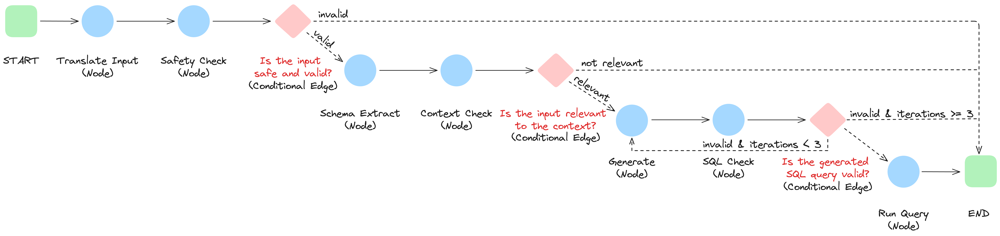
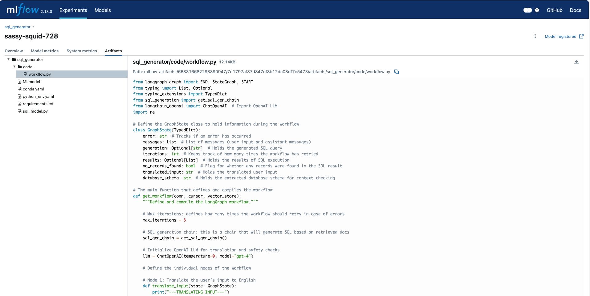

If you're looking to build a Multi-Lingual Query Engine that combines natural language to SQL generation with query execution while fully leveraging MLflow’s features, this blog post is your guide. We’ll explore how to leverage **MLflow Models from Code** to enable seamless tracking and versioning of AI Workflows. Additionally, we’ll deep dive into **MLflow’s Tracing** feature, which introduces observability into the many different components of an AI Workflow by tracking inputs, outputs, and metadata at every intermediate step.

<!-- truncate -->

## Introduction

SQL is a fundamental skill for managing and accessing data within relational databases. However, constructing complex SQL queries to answer intricate data questions can be challenging and time-consuming. This complexity can make it difficult to fully leverage data effectively. Natural language to SQL (NL2SQL) systems help in solving this problem by providing a translation from natural language to SQL commands allowing non-technical people to interact with data: users can just ask questions in a natural language they are comfortable speaking and these systems will assist them in returning the appropriate information.

However, there are also a number of problems that remain when creating a NL2SQL system such as semantic ambiguity, schema mapping or error handling and user feedback. Therefore, it is very important that while building such systems, we must put some guardrails instead of completely relying on LLM.

In this blog post, we’ll walk you through the process of building a Multi-Lingual Query Engine. This engine supports natural language inputs in multiple languages, generates an SQL query based on the translated user input, and executes the query. Let's jump into an example: using a database containing information about a company's customers, products, and orders, a user might ask a question in any language, such as "Quantos clientes temos por país?" (Portuguese for "How many customers do we have per country?"). The AI Workflow translates the input into English, outputting "How many customers do we have per country?". It then validates the input for safety, checks if the question can be answered using the database schema, generates the appropriate SQL query (e.g., `SELECT COUNT(CustomerID) AS NumberOfCustomers, Country FROM Customers GROUP BY Country;`), and validates the query to ensure no harmful commands (e.g., DROP) are present. Finally, it executes the query against the database to retrieve the results.

We’ll start by demonstrating how to leverage [LangGraph’s](https://www.langchain.com/langgraph) capabilities to build a dynamic AI workflow. This workflow integrates OpenAI and external data sources, such as a Vector Store and a SQLite database, to process user input, perform safety checks, query databases, and generate meaningful responses.

Throughout this post, we’ll leverage [MLflow’s Models from Code](https://mlflow.org/docs/latest/model/models-from-code.html) feature to enable seamless tracking and versioning of AI Workflows. Additionally, we’ll deep dive into [MLflow’s Tracing](https://mlflow.org/docs/latest/llms/tracing/index.html) feature, designed to enhance the observability of the many different components of an AI workflow by tracking inputs, outputs, and metadata associated with each intermediate step. This enables easy identification of bugs and unexpected behaviors, providing greater transparency over the workflow.

# Prerequisites

To set up and run this project, ensure the following **Python packages** are installed:
- `faiss-cpu`
- `langchain`
- `langchain-core`
- `langchain-openai`
- `langgraph`
- `langchain-community`
- `pydantic >=2`
- `typing_extensions`
- `python-dotenv`

Additionally, an **MLflow Tracking Server** is required to log and manage experiments, models, and traces effectively. For local setup, refer to the official MLflow documentation for instructions on [configuring a simple MLflow Tracking Server](https://mlflow.org/docs/latest/tracking/server.html).

Finally, ensure that your OpenAI API key is saved within a .env file in the project directory. This allows the application to securely access the OpenAI services required for building the AI workflow. The .env file should include a line like:

```
OPENAI_API_KEY=your_openai_api_key
```

# Multi-Lingual Query Engine using LangGraph

The Multi-Lingual Query Engine leverages the [LangGraph](https://langchain-ai.github.io/langgraph/) library, an AI orchestration tool designed to create stateful, multi-agent, and cyclical graph architectures for applications powered by LLMs.

Compared to other AI orchestrators, LangGraph offers three core benefits: cycles, controllability, and persistence. It allows the definition of AI workflows with cycles, which are essential for implementing retry mechanisms like the SQL query generation retries in the Multi-Lingual Query Engine (where the query loops back for regeneration if validation fails). This makes LangGraph the ideal tool for building our Multi-Lingual Query Engine.

## Key LangGraph features:

1. **Stateful Architecture**: The engine maintains a dynamic snapshot of the graph’s execution status. This snapshot acts as a shared resource across nodes, enabling efficient decision-making and real-time updates at each node execution.

2. **Multi-Agent Design**: The AI Workflow includes multiple interactions with OpenAI and other external tools throughout the workflow.

3. **Cyclical Graph Structure**: The graph’s cyclical nature introduces a robust retry mechanism. This mechanism dynamically addresses failures by looping back to previous stages when needed, ensuring continuous graph execution. (Details of this mechanism will be discussed later.)

## AI Workflow Overview

The Multi-Lingual Query Engine’s advanced AI workflow is composed of interconnected nodes and edges, each representing a crucial stage:

1. **Translation Node**: Converts the user’s input into English.

2. **Pre-safety Check**: Ensures user input is free from toxic or inappropriate content and does not contain harmful SQL commands (e.g., `DELETE`, `DROP`).

3. **Database Schema Extraction**: Retrieves the schema of the target database to understand its structure and available data.

4. **Relevancy Validation**: Validates the user’s input against the database schema to ensure alignment with the database’s context.

5. **SQL Query Generation**: Generates an SQL query based on the user’s input and the current database schema.

6. **Post-safety Check**: Ensures the generated SQL Query does not contain harmful SQL commands (e.g., `DELETE`, `DROP`).

7. **SQL Query Validation**: Executes the SQL query in a rollback-safe environment to ensure its validity before running it.

8. **Dynamic State Evaluation**: Determines the next steps based on the current state. If the SQL query validation fails, it loops back to Stage 5 to regenerate the query.

9. **Query Execution and Result Retrieval**: Executes the SQL query and returns the results if it’s a `SELECT` statement.

The retry mechanism is introduced in Stage 8, where the system dynamically evaluates the current graph state. Specifically, when the SQL query validation node (Stage 7) detects an issue, the state triggers a loop back to the SQL Generation node (Stage 5) for a new SQL Generation attempt (with a maximum of 3 attempts).

## Components

The Multi-Lingual Query Engine interacts with several external components to transform natural language user inputs into SQL queries and execute them in a safe and robust manner. In this section, we will take a detailed look at the key AI Workflow components: OpenAI, Vector Store, SQLite Database, and SQL Generation Chain.

### OpenAI

OpenAI, more specifically the `gpt-4o-mini` language model, plays a crucial role in multiple stages of the workflow. It provides the intelligence required for:

1. **Translation**: Translates user input into English. If the text is already in English, it simply repeats the input.

2. **Safety Checks**: Analyzes user input to ensure that it does not contain toxic or inappropriate content.

3. **Relevance Checks**: Evaluates whether the user's question is relevant given the database schema.

4. **SQL Generation**: Generates valid and executable SQL queries based on user input, SQL generation documentation, and the database schema.

Details on OpenAI implementation will be provided later on in the [Node Descriptions](#node-descriptions) section.

### FAISS Vector Store

To build an effective natural language to SQL engine capable of generating accurate and executable SQL queries, we leverage Langchain's FAISS Vector Store feature. This setup allows the system to search and extract SQL query generation guidelines from [W3Schools SQL documents](https://www.w3schools.com/sql/) previously stored in the Vector Database, enhancing the success of SQL query generation.

For demo purposes, we are using FAISS, an in-memory vector store where vectors are stored directly in RAM. This provides fast access but means data is not persisted between runs. For a more scalable solution that enables embeddings to be stored and shared across multiple projects, we recommend alternatives like [AWS OpenSearch](https://aws.amazon.com/what-is/opensearch/), [Vertex AI Vector Search](https://cloud.google.com/vertex-ai/docs/vector-search/overview), [Azure Vector Search](https://learn.microsoft.com/en-us/azure/search/vector-search-overview), or [Mosaic AI Vector Search](https://docs.databricks.com/en/generative-ai/vector-search.html). These cloud-based solutions offer persistent storage, automatic scaling, and seamless integration with other cloud services, making them well-suited for large-scale applications.

#### Step 1: Load SQL Documentation

The first step in creating a FAISS Vector Store with SQL query generation guidelines is to load SQL documentation from the [W3Schools SQL page](https://www.w3schools.com/sql/) using LangChain's `RecursiveUrlLoader`. This tool retrieves the documentation, allowing us to use it as a knowledge base for our engine.

#### Step 2: Split the Text into Manageable Chunks

The loaded SQL documentation is a lengthy text, making it difficult to be effectively ingested by the LLM. To address this, the next step involves splitting the text into smaller, manageable chunks using Langchain's `RecursiveCharacterTextSplitter`. By splitting the text into chunks of 500 characters with a 50-character overlap, we ensure the language model has sufficient context while minimizing the risk of losing important information that spans across chunks. The `split_text` method applies this splitting process, storing the resulting pieces in a list called 'documents'.

#### Step 3: Generate Embedding Model

The third step is to create a model that converts these chunks into embeddings (vectorized numerical representations of each text chunk). Embeddings enable the system to compare the similarity between chunks and the user's input, facilitating the retrieval of the most relevant matches for SQL query generation.

#### Step 4: Create and Store Embeddings in FAISS Vector Store

Finally, we create and store the embeddings using FAISS. The `FAISS.from_texts` method takes all the chunks, computes their embeddings, and stores them in a high speed searchable vector database. This searchable database allows the engine to efficiently retrieve relevant SQL guidelines, significantly improving the success rate of executable SQL query generation.

```python
import logging
import os

from bs4 import BeautifulSoup as Soup

from langchain.text_splitter import RecursiveCharacterTextSplitter
from langchain_community.document_loaders.recursive_url_loader import RecursiveUrlLoader
from langchain_community.vectorstores import FAISS
from langchain_openai import OpenAIEmbeddings


def setup_vector_store(logger: logging.Logger):
    """Setup or load the vector store."""
    if not os.path.exists("data"):
        os.makedirs("data")

    vector_store_dir = "data/vector_store"

    if os.path.exists(vector_store_dir):
        # Load the vector store from disk
        logger.info("Loading vector store from disk...")
        vector_store = FAISS.load_local(
            vector_store_dir,
            OpenAIEmbeddings(),
            allow_dangerous_deserialization=True,
        )
    else:
        logger.info("Creating new vector store...")
        # Load SQL documentation
        url = "https://www.w3schools.com/sql/"
        loader = RecursiveUrlLoader(
            url=url, max_depth=2, extractor=lambda x: Soup(x, "html.parser").text
        )
        docs = loader.load()

        # Split documents into chunks
        text_splitter = RecursiveCharacterTextSplitter(
            chunk_size=500,
            chunk_overlap=50,
            separators=["\n\n", "\n", ".", "!", "?", ",", " ", ""],
        )

        documents = []
        for doc in docs:
            splits = text_splitter.split_text(doc.page_content)
            for i, split in enumerate(splits):
                documents.append(
                    {
                        "content": split,
                        "metadata": {"source": doc.metadata["source"], "chunk": i},
                    }
                )

        # Compute embeddings and create vector store
        embedding_model = OpenAIEmbeddings()
        vector_store = FAISS.from_texts(
            [doc["content"] for doc in documents],
            embedding_model,
            metadatas=[doc["metadata"] for doc in documents],
        )

        # Save the vector store to disk
        vector_store.save_local(vector_store_dir)
        logger.info("Vector store created and saved to disk.")

    return vector_store
```

### SQLite Database

The SQLite database is a key component of the Multi-Lingual Query Engine serving as the structured data repository. SQLite offers a lightweight, fast, and self-contained relational database engine that requires no server setup or installation. Its compact size (under 500KB) and zero-configuration nature make it incredibly easy to use, while its platform-agnostic database format ensures seamless portability across different systems. As a local disk database, SQLite was the ideal choice for avoiding the complexity of setting up MySQL or PostgreSQL, while still providing a reliable, full-featured SQL engine with outstanding performance.

The SQLite database supports efficient SQL query generation, validation and execution by enabling:

1. **Schema Extraction**: Suplying schema information for user’s input context validation (Stage 4) and executable SQL Query Generation (Stage 5).

2. **Query Execution**: Executing SQL queries in a rollback-safe environment in Validation Stage (Stage 7) and in Query Execution Stage (Stage 9) fetching results for `SELECT` statements and committing changes for other query types.

#### SQLite Database Initialization

The database is initialized using the `setup_database` function when the AI Workflow is initialized. This process involves:

1. **Setting the SQLite Database Connection**: Establishes a connection to the SQLite database, enabling data interaction.

2. **Table Creation**: Defines and creates the necessary database tables for the AI Workflow.

3. **Data Population**: Populates the tables with sample data to support query execution and validation stages.

```python
import logging
import os

import sqlite3


def create_connection(db_file="data/database.db"):
    """Create a database connection to the SQLite database."""
    conn = sqlite3.connect(db_file)
    return conn


def create_tables(conn):
    """Create tables in the database."""
    cursor = conn.cursor()
    # Create Customers table
    cursor.execute(
        """
    CREATE TABLE IF NOT EXISTS Customers (
        CustomerID INTEGER PRIMARY KEY,
        CustomerName TEXT,
        ContactName TEXT,
        Address TEXT,
        City TEXT,
        PostalCode TEXT,
        Country TEXT
    )
    """
    )

    # Create Orders table
    cursor.execute(
        """
    CREATE TABLE IF NOT EXISTS Orders (
        OrderID INTEGER PRIMARY KEY,
        CustomerID INTEGER,
        OrderDate TEXT,
        FOREIGN KEY (CustomerID) REFERENCES Customers (CustomerID)
    )
    """
    )

    # Create OrderDetails table
    cursor.execute(
        """
    CREATE TABLE IF NOT EXISTS OrderDetails (
        OrderDetailID INTEGER PRIMARY KEY,
        OrderID INTEGER,
        ProductID INTEGER,
        Quantity INTEGER,
        FOREIGN KEY (OrderID) REFERENCES Orders (OrderID),
        FOREIGN KEY (ProductID) REFERENCES Products (ProductID)
    )
    """
    )

    # Create Products table
    cursor.execute(
        """
    CREATE TABLE IF NOT EXISTS Products (
        ProductID INTEGER PRIMARY KEY,
        ProductName TEXT,
        Price REAL
    )
    """
    )

    conn.commit()


def populate_tables(conn):
    """Populate tables with sample data if they are empty."""
    cursor = conn.cursor()

    # Populate Customers table if empty
    cursor.execute("SELECT COUNT(*) FROM Customers")
    if cursor.fetchone()[0] == 0:
        customers = []
        for i in range(1, 51):
            customers.append(
                (
                    i,
                    f"Customer {i}",
                    f"Contact {i}",
                    f"Address {i}",
                    f"City {i % 10}",
                    f"{10000 + i}",
                    f"Country {i % 5}",
                )
            )
        cursor.executemany(
            """
        INSERT INTO Customers (CustomerID, CustomerName, ContactName, Address, City, PostalCode, Country)
        VALUES (?, ?, ?, ?, ?, ?, ?)
        """,
            customers,
        )

    # Populate Products table if empty
    cursor.execute("SELECT COUNT(*) FROM Products")
    if cursor.fetchone()[0] == 0:
        products = []
        for i in range(1, 51):
            products.append((i, f"Product {i}", round(10 + i * 0.5, 2)))
        cursor.executemany(
            """
        INSERT INTO Products (ProductID, ProductName, Price)
        VALUES (?, ?, ?)
        """,
            products,
        )

    # Populate Orders table if empty
    cursor.execute("SELECT COUNT(*) FROM Orders")
    if cursor.fetchone()[0] == 0:
        orders = []
        from datetime import datetime, timedelta

        base_date = datetime(2023, 1, 1)
        for i in range(1, 51):
            order_date = base_date + timedelta(days=i)
            orders.append(
                (
                    i,
                    i % 50 + 1,  # CustomerID between 1 and 50
                    order_date.strftime("%Y-%m-%d"),
                )
            )
        cursor.executemany(
            """
        INSERT INTO Orders (OrderID, CustomerID, OrderDate)
        VALUES (?, ?, ?)
        """,
            orders,
        )

    # Populate OrderDetails table if empty
    cursor.execute("SELECT COUNT(*) FROM OrderDetails")
    if cursor.fetchone()[0] == 0:
        order_details = []
        for i in range(1, 51):
            order_details.append(
                (
                    i,
                    i % 50 + 1,  # OrderID between 1 and 50
                    i % 50 + 1,  # ProductID between 1 and 50
                    (i % 5 + 1) * 2,  # Quantity between 2 and 10
                )
            )
        cursor.executemany(
            """
        INSERT INTO OrderDetails (OrderDetailID, OrderID, ProductID, Quantity)
        VALUES (?, ?, ?, ?)
        """,
            order_details,
        )

    conn.commit()


def setup_database(logger: logging.Logger):
    """Setup the database and return the connection."""
    db_file = "data/database.db"
    if not os.path.exists("data"):
        os.makedirs("data")

    db_exists = os.path.exists(db_file)

    conn = create_connection(db_file)

    if not db_exists:
        logger.info("Setting up the database...")
        create_tables(conn)
        populate_tables(conn)
    else:
        logger.info("Database already exists. Skipping setup.")

    return conn
```

### SQL Generation Chain

The **SQL Generation Chain** (`sql_gen_chain`) is the backbone of automated SQL query generation in our workflow. This chain leverages LangChain's modular capabilities and OpenAI's advanced natural language processing to transform user questions into precise and executable SQL queries.

**Core Features**:

- **Prompt-Driven Generation**: Begins with a thoughtfully designed prompt that integrates the database schema and documentation snippets, ensuring queries are contextually accurate.

- **Structured Responses**: Delivers outputs in a predefined format, including:

    - A **description** of the query's purpose.

    - The corresponding **SQL code** ready for execution.

- **Adaptable and Reliable**: Uses `gpt-4o-mini` for robust, consistent query generation, minimizing manual effort and errors.

This chain is a critical component in our workflow, enabling seamless integration of SQL query generation with downstream processes, ensuring accuracy, and significantly improving efficiency.

```python
from pydantic import BaseModel, Field

from langchain_core.prompts import ChatPromptTemplate
from langchain_openai import ChatOpenAI

class SQLQuery(BaseModel):
    """Schema for SQL query solutions to questions."""
    description: str = Field(description="Description of the SQL query")
    sql_code: str = Field(description="The SQL code block")

def get_sql_gen_chain():
    """Set up the SQL generation chain."""
    sql_gen_prompt = ChatPromptTemplate.from_messages(
        [
            (
                "system",
                """You are a SQL assistant with expertise in SQL query generation. \n
Answer the user's question based on the provided documentation snippets and the database schema provided below. Ensure any SQL query you provide is valid and executable. \n
Structure your answer with a description of the query, followed by the SQL code block. Here are the documentation snippets:\n{retrieved_docs}\n\nDatabase Schema:\n{database_schema}""",
            ),
            ("placeholder", "{messages}"),
        ]
    )
    
    # Initialize the OpenAI LLM
    llm = ChatOpenAI(temperature=0, model="gpt-4o-mini")

    # Create the code generation chain
    sql_gen_chain = sql_gen_prompt | llm.with_structured_output(SQLQuery)

    return sql_gen_chain
```

### Workflow Setup and Initialization

Before delving into the workflow nodes, it's crucial to set up the necessary components and define the structure of the workflow. This section explains the initialization of essential libraries, logging, and the custom `GraphState` class, as well as the main workflow compilation function.

#### Defining `GraphState`

The `GraphState` class is a custom `TypedDict` that maintains the state information as the workflow progresses. It acts as a shared data structure across the nodes, ensuring continuity and consistency. Key fields include:

- **`error`**: Tracks whether an error has occurred.
- **`messages`**: Stores a list of user and system messages.
- **`generation`**: Holds the generated SQL query.
- **`iterations`**: Tracks the number of retry attempts in case of errors.
- **`results`**: Stores the SQL execution results, if any.
- **`no_records_found`**: Flags if no records are returned by the query.
- **`translated_input`**: Contains the user's translated input.
- **`database_schema`**: Maintains the database schema for context validation.

```python
import logging
import re
from typing import List, Optional

from langchain_openai import ChatOpenAI
from langgraph.graph import END, START, StateGraph
from sql_generation import get_sql_gen_chain
from typing_extensions import TypedDict

# Initialize the logger
_logger = logging.getLogger(__name__)
_logger.setLevel(logging.INFO)
handler = logging.StreamHandler()
formatter = logging.Formatter("%(asctime)s - %(name)s - %(levelname)s - %(message)s")
handler.setFormatter(formatter)
_logger.addHandler(handler)

class GraphState(TypedDict):
    error: str  # Tracks if an error has occurred
    messages: List  # List of messages (user input and assistant messages)
    generation: Optional[str]  # Holds the generated SQL query
    iterations: int  # Keeps track of how many times the workflow has retried
    results: Optional[List]  # Holds the results of SQL execution
    no_records_found: bool  # Flag for whether any records were found in the SQL result
    translated_input: str  # Holds the translated user input
    database_schema: str  # Holds the extracted database schema for context checking
```

#### Workflow Compilation Function

The main function, `get_workflow`, is responsible for defining and compiling the workflow. Key components include:

- **`conn` and `cursor`**: Used for database connectivity and query execution.
- **`vector_store`**: A vector database for contextual retrieval.
- **`max_iterations`**: Sets a limit on retry attempts to prevent infinite loops.
- **`sql_gen_chain`**: Retrieves the SQL generation chain from `sql_generation` for producing SQL queries based on contextual inputs.
- **`ChatOpenAI`**: Initializes the OpenAI `gpt-4o-mini` model for tasks like safety checks and query translation.

```python
def get_workflow(conn, cursor, vector_store):
    """Define and compile the LangGraph workflow."""

    # Max iterations: defines how many times the workflow should retry in case of errors
    max_iterations = 3

    # SQL generation chain: this is a chain that will generate SQL based on retrieved docs
    sql_gen_chain = get_sql_gen_chain()

    # Initialize OpenAI LLM for translation and safety checks
    llm = ChatOpenAI(temperature=0, model="gpt-4o-mini")

    # Define the individual nodes of the workflow
```

This function acts as the entry point for creating a complete workflow using `StateGraph`. Individual nodes within the workflow will be defined and connected in subsequent sections.

### Node Descriptions

#### 1. Translate Input

The `translate_input` node translates user queries into English to standardize processing and ensure compatibility with downstream nodes. Translating user input as the first step in the AI Workflow ensures task segregation and improves observability. Task segregation simplifies the workflow by isolating translation from the other dowstream tasks like user input safety validation and SQL generation. Improved observability provides clear traces in MLflow, making it easier to debug and monitor the process.

- **Examples:**
    - Input: _"Quantos pedidos foram realizados em Novembro?"_  
    - Translated: _"How many orders were made in November?"_
    - Input: _"Combien de ventes avons-nous enregistrées en France ?"_
    - Translated: _"How many sales did we record in France?"_
- **Code:**
```python
def translate_input(state: GraphState) -> GraphState:
    """
    Translates user input to English using an LLM. If the input is already in English,
    it is returned as is. This ensures consistent input for downstream processing.

    Args:
        state (GraphState): The current graph state containing user messages.

    Returns:
        GraphState: The updated state with the translated input.
    """
    _logger.info("Starting translation of user input to English.")
    messages = state["messages"]
    user_input = messages[-1][1]  # Get the latest user input

    # Translation prompt for the model
    translation_prompt = f"""
    Translate the following text to English. If the text is already in English, repeat it exactly without any additional explanation.

    Text:
    {user_input}
    """
    
    # Call the OpenAI LLM to translate the text
    translated_response = llm.invoke(translation_prompt)
    translated_text = translated_response.content.strip()  # Access the 'content' attribute and strip any extra spaces

    # Update state with the translated input
    state["translated_input"] = translated_text  
    _logger.info("Translation completed successfully. Translated input: %s", translated_text)

    return state
```

#### 2. Pre-safety Check

The `pre_safety_check` node ensures early detection of disallowed SQL operations and inappropriate content in the user's input. While the check for harmful SQL commands (e.g., `CREATE`, `DELETE`, `DROP`, `INSERT`, `UPDATE`) will occur again later in the workflow, specifically after generating the SQL query, this pre-safety check is crucial for identifying potential issues at the input stage. By doing so, it prevents unnecessary computation and offers immediate feedback to the user. 

While the use of a disallow list for harmful SQL operations provides a quick way to safeguard against destructive queries, maintaining a comprehensive disallow list can become hard to manage when dealing with complex SQL backends like T-SQL. An alternative approach is adopting an allowlist, restricting queries to only safe operations (e.g., `SELECT`, `JOIN`). This approach ensures a more robust solution by narrowing down permissible actions rather than attempting to block every risky command.

To achieve an enterprise-grade solution, the project could leverage frameworks like [Unity Catalog](https://github.com/unitycatalog/unitycatalog/blob/main/ai/core/README.md), which provide a centralized and robust approach to managing security-related functions, such as the `pre_safety_check` for AI workflows. By registering and managing reusable functions within such a framework, you can enforce consistent and reliable behavior across all AI workflows, enhancing both security and scalability.

Additionally, the node leverages the LLM to analyze the input for offensive or inappropriate content. If unsafe queries or inappropriate content are detected, the state is updated with an error flag and transparent feedback is provided, safeguarding the workflow from malicious or destructive elements early on.

- **Examples:**
1. **Disallowed Operations:**
	- **Input:** *"DROP TABLE customers;"*
	- **Response:** *"Your query contains disallowed SQL operations and cannot be processed."*

	- **Input:** *"SELECT * FROM orders;"*
	- **Response:** *"Query allowed."*

2. **Inappropriate Content:**
	- **Input:** *"Show me orders where customers have names like 'John the Idiot';"*
	- **Response:** *"Your query contains inappropriate content and cannot be processed."*
	
	- **Input:** *"Find total sales by region."*
	- **Response:** *"Input is safe to process."*

- **Code:**

```python
def pre_safety_check(state: GraphState) -> GraphState:
    """
    Perform safety checks on the user input to ensure that no dangerous SQL operations 
    or inappropriate content is present. The function checks for SQL operations like 
    DELETE, DROP, and others, and also evaluates the input for toxic or unsafe content.

    Args:
        state (GraphState): The current graph state containing the translated user input.

    Returns:
        GraphState: The updated state with error status and messages if any issues are found.
    """
    _logger.info("Performing safety check.")
    translated_input = state["translated_input"]
    messages = state["messages"]
    error = "no"

    # List of disallowed SQL operations (e.g., DELETE, DROP)
    disallowed_operations = ['CREATE', 'DELETE', 'DROP', 'INSERT', 'UPDATE', 'ALTER', 'TRUNCATE', 'EXEC', 'EXECUTE']
    pattern = re.compile(r'\b(' + '|'.join(disallowed_operations) + r')\b', re.IGNORECASE)

    # Check if the input contains disallowed SQL operations
    if pattern.search(translated_input):
        _logger.warning("Input contains disallowed SQL operations. Halting the workflow.")
        error = "yes"
        messages += [("assistant", "Your query contains disallowed SQL operations and cannot be processed.")]
    else:
        # Check if the input contains inappropriate content
        safety_prompt = f"""
        Analyze the following input for any toxic or inappropriate content.

        Respond with only "safe" or "unsafe", and nothing else.

        Input:
        {translated_input}
        """
        safety_invoke = llm.invoke(safety_prompt)
        safety_response = safety_invoke.content.strip().lower()  # Access the 'content' attribute and strip any extra spaces

        if safety_response == "safe":
            _logger.info("Input is safe to process.")
        else:
            _logger.warning("Input contains inappropriate content. Halting the workflow.")
            error = "yes"
            messages += [("assistant", "Your query contains inappropriate content and cannot be processed.")]

    # Update state with error status and messages
    state["error"] = error
    state["messages"] = messages

    return state
```

#### 3. Schema Extract

The `schema_extract` node dynamically retrieves the database schema, including table names and column details, by querying metadata. The formatted schema is stored in the state, enabling validation of user queries while adapting to the current database structure.

- **Examples:**
    - Input: Request for schema extraction.  
        Schema Output:
        - Customers(CustomerID (INTEGER), CustomerName (TEXT), ContactName (TEXT), Address (TEXT), City (TEXT), PostalCode (TEXT), Country (TEXT))
        - Orders(OrderID (INTEGER), CustomerID (INTEGER), OrderDate (TEXT))
        - OrderDetails(OrderDetailID (INTEGER), OrderID (INTEGER), ProductID (INTEGER), Quantity (INTEGER))
        - Products(ProductID (INTEGER), ProductName (TEXT), Price (REAL))
- **Code:**

```python
def schema_extract(state: GraphState) -> GraphState:
    """
    Extracts the database schema, including all tables and their respective columns,
    from the connected SQLite database. This function retrieves the list of tables and 
    iterates through each table to gather column definitions (name and data type).

    Args:
        state (GraphState): The current graph state, which will be updated with the database schema.

    Returns:
        GraphState: The updated state with the extracted database schema.
    """
    _logger.info("Extracting database schema.")

    # Extract the schema from the database
    cursor.execute("SELECT name FROM sqlite_master WHERE type='table';")
    tables = cursor.fetchall()
    schema_details = []

    # Loop through each table and retrieve column information
    for table_name_tuple in tables:
        table_name = table_name_tuple[0]
        cursor.execute(f"PRAGMA table_info({table_name});")
        columns = cursor.fetchall()
        
        # Format column definitions
        column_defs = ', '.join([f"{col[1]} ({col[2]})" for col in columns])
        schema_details.append(f"- {table_name}({column_defs})")

    # Save the schema in the state
    database_schema = '\n'.join(schema_details)
    state["database_schema"] = database_schema
    _logger.info(f"Database schema extracted:\n{database_schema}")

    return state
```

#### 4. Context Check

The `context_check` node validates user queries by comparing them against the extracted database schema to ensure alignment and relevance. Queries that do not correspond to the schema are flagged as irrelevant, preventing resource waste and enabling user feedback for query reformulation.

- **Examples:**
    - Input: _"What is the average order value?"_  
        Schema Match: Input is relevant to the database schema.
    - Input: _"Show me data from the inventory table."_  
        Response: _"Your question is not related to the database and cannot be processed."_
- **Code:**

```python
def context_check(state: GraphState) -> GraphState:
    """
    Checks whether the user's input is relevant to the database schema by comparing
    the user's question with the database schema. Uses a language model to determine if
    the question can be answered using the provided schema.

    Args:
        state (GraphState): The current graph state, which contains the translated input
                            and the database schema.

    Returns:
        GraphState: The updated state with error status and messages if the input is irrelevant.
    """
    _logger.info("Performing context check.")

    # Extract relevant data from the state
    translated_input = state["translated_input"]
    messages = state["messages"]
    error = "no"
    database_schema = state["database_schema"]  # Get the schema from the state

    # Use the LLM to determine if the input is relevant to the database schema
    context_prompt = f"""
    Determine whether the following user input is a question that can be answered using the database schema provided below.

    Respond with only "relevant" if the input is relevant to the database schema, or "irrelevant" if it is not.

    User Input:
    {translated_input}

    Database Schema:
    {database_schema}
    """
    
    # Call the LLM for context check
    llm_invoke = llm.invoke(context_prompt)
    llm_response = llm_invoke.content.strip().lower()  # Access the 'content' attribute and strip any extra spaces and lower case

    # Process the response from the LLM
    if llm_response == "relevant":
        _logger.info("Input is relevant to the database schema.")
    else:
        _logger.info("Input is not relevant. Halting the workflow.")
        error = "yes"
        messages += [("assistant", "Your question is not related to the database and cannot be processed.")]

    # Update the state with error and messages
    state["error"] = error
    state["messages"] = messages

    return state
```

#### 5. Generate

The `generate` node constructs SQL queries from natural language input by retrieving relevant documentation from the vector store and leveraging a pre-defined SQL generation chain. It aligns the query with the user’s intent and schema context, updating the state with the generated SQL and its description.

- **Examples:**  
    - Input: _"Find total sales."_  
        Generated SQL: _"SELECT SUM(Products.Price * OrderDetails.Quantity) AS TotalSales FROM OrderDetails LEFT JOIN Products ON OrderDetails.ProductID = Products.ProductID;"_
    - Input: _"List all customers in New York."_  
        Generated SQL: _"SELECT name FROM customers WHERE location = 'New York';"_
- **Code:**

```python
def generate(state: GraphState) -> GraphState:
    """
    Generates an SQL query based on the user's input. The node retrieves relevant documents from 
    the vector store and uses a generation chain to produce an SQL query.

    Args:
        state (GraphState): The current graph state, which contains the translated input and 
                            other relevant data such as messages and iteration count.

    Returns:
        GraphState: The updated state with the generated SQL query and related messages.
    """
    _logger.info("Generating SQL query.")

    # Extract relevant data from the state
    messages = state["messages"]
    iterations = state["iterations"]
    translated_input = state["translated_input"]
    database_schema = state["database_schema"]

    # Retrieve relevant documents from the vector store based on the translated user input
    docs = vector_store.similarity_search(translated_input, k=4)
    retrieved_docs = "\n\n".join([doc.page_content for doc in docs])

    # Generate the SQL query using the SQL generation chain
    sql_solution = sql_gen_chain.invoke(
        {
            "retrieved_docs": retrieved_docs,
            "database_schema": database_schema,
            "messages": [("user", translated_input)],
        }
    )

    # Save the generated SQL query in the state
    messages += [
        (
            "assistant",
            f"{sql_solution.description}\nSQL Query:\n{sql_solution.sql_code}",
        )
    ]
    iterations += 1

    # Log the generated SQL query
    _logger.info("Generated SQL query:\n%s", sql_solution.sql_code)

    # Update the state with the generated SQL query and updated message list
    state["generation"] = sql_solution
    state["messages"] = messages
    state["iterations"] = iterations

    return state
```

#### 6. Post-safety Check

The `post_safety_check` node ensures the generated SQL query is safe by performing a final validation for harmful SQL commands. While the earlier pre-safety check identifies disallowed operations in user inputs, this post-safety check verifies that the SQL query produced after generation adheres to security guidelines. This two-step approach ensures that even if disallowed operations are inadvertently introduced during query generation, they can be caught and flagged. If unsafe queries are detected, the node halts the workflow, updates the state with an error flag, and provides feedback to the user.

- **Examples:**

1. **Disallowed Operations:**
    - **Generated Query:** _"DROP TABLE orders;"_
        
    - **Response:** _"The generated SQL query contains disallowed SQL operations: DROP and cannot be processed."_
        
    - **Generated Query:** _"SELECT name FROM customers;"_
        
    - **Response:** _"Query is valid."_
        

- **Code:**

```python
def post_safety_check(state: GraphState) -> GraphState:
    """
    Perform safety checks on the generated SQL query to ensure that it doesn't contain disallowed operations 
    such as CREATE, DELETE, DROP, etc. This node checks the SQL query generated earlier in the workflow.

    Args:
        state (GraphState): The current graph state containing the generated SQL query.

    Returns:
        GraphState: The updated state with error status and messages if any issues are found.
    """
    _logger.info("Performing post-safety check on the generated SQL query.")
    
    # Retrieve the generated SQL query from the state
    sql_solution = state.get("generation", {})
    sql_query = sql_solution.get("sql_code", "").strip()
    messages = state["messages"]
    error = "no"
    
    # List of disallowed SQL operations
    disallowed_operations = ['CREATE', 'DELETE', 'DROP', 'INSERT', 'UPDATE', 'ALTER', 'TRUNCATE', 'EXEC', 'EXECUTE']
    pattern = re.compile(r'\b(' + '|'.join(disallowed_operations) + r')\b', re.IGNORECASE)

    # Check if the generated SQL query contains disallowed SQL operations
    found_operations = pattern.findall(sql_query)
    if found_operations:
        _logger.warning(
            "Generated SQL query contains disallowed SQL operations: %s. Halting the workflow.",
            ", ".join(set(found_operations))
        )
        error = "yes"
        messages += [("assistant", f"The generated SQL query contains disallowed SQL operations: {', '.join(set(found_operations))} and cannot be processed.")]
    else:
        _logger.info("Generated SQL query passed the safety check.")

    # Update state with error status and messages
    state["error"] = error
    state["messages"] = messages

    return state
```

#### 7. SQL Check

The `sql_check` node ensures the generated SQL query is safe and syntactically valid by executing it within a transactional savepoint. Any changes are rolled back after validation, with errors flagged and detailed feedback provided to maintain query integrity.

- **Examples:**  
    - Input SQL: _"SELECT name FROM customers WHERE city = 'New York';"_  
        Validation: Query is valid.  
    - Input SQL: _"SELECT MONTH(date) AS month, SUM(total) AS total_sales FROM orders GROUP BY MONTH(date);"_  
        Response: _"Your SQL query failed to execute: no such function: MONTH."_ 
- **Code:**

```python
def sql_check(state: GraphState) -> GraphState:
    """
    Validates the generated SQL query by attempting to execute it on the database.
    If the query is valid, the changes are rolled back to ensure no data is modified.
    If there is an error during execution, the error is logged and the state is updated accordingly.

    Args:
        state (GraphState): The current graph state, which contains the generated SQL query
                             and the messages to communicate with the user.

    Returns:
        GraphState: The updated state with error status and messages if the query is invalid.
    """
    _logger.info("Validating SQL query.")

    # Extract relevant data from the state
    messages = state["messages"]
    sql_solution = state["generation"]
    error = "no"

    sql_code = sql_solution.sql_code.strip()

    try:
        # Start a savepoint for the transaction to allow rollback
        conn.execute('SAVEPOINT sql_check;')
        # Attempt to execute the SQL query
        cursor.execute(sql_code)
        # Roll back to the savepoint to undo any changes
        conn.execute('ROLLBACK TO sql_check;')
        _logger.info("SQL query validation: success.")
    except Exception as e:
        # Roll back in case of error
        conn.execute('ROLLBACK TO sql_check;')
        _logger.error("SQL query validation failed. Error: %s", e)
        messages += [("user", f"Your SQL query failed to execute: {e}")]
        error = "yes"

    # Update the state with the error status
    state["error"] = error
    state["messages"] = messages

    return state
```

#### 8. Run Query

The `run_query` node executes the validated SQL query, connecting to the database to retrieve results. It updates the state with the query output, ensuring the data is formatted for further analysis or reporting while implementing robust error handling.

- **Examples:**
    - Input SQL: _"SELECT COUNT(*) FROM Customers WHERE City = 'New York';"_  
        Query Result: _"(0,)"_
    - Input SQL: _"SELECT SUM(Products.Price * OrderDetails.Quantity) AS TotalSales FROM OrderDetails LEFT JOIN Products ON OrderDetails.ProductID = Products.ProductID;"*  
        Query Result: _"(6925.0,)"_
- **Code:**

```python
def run_query(state: GraphState) -> GraphState:
    """
    Executes the generated SQL query on the database and retrieves the results if it is a SELECT query.
    For non-SELECT queries, commits the changes to the database. If no records are found for a SELECT query,
    the `no_records_found` flag is set to True.

    Args:
        state (GraphState): The current graph state, which contains the generated SQL query and other relevant data.

    Returns:
        GraphState: The updated state with the query results, or a flag indicating if no records were found.
    """
    _logger.info("Running SQL query.")
    
    # Extract the SQL query from the state
    sql_solution = state["generation"]
    sql_code = sql_solution.sql_code.strip()
    results = None
    no_records_found = False  # Flag to indicate no records found

    try:
        # Execute the SQL query
        cursor.execute(sql_code)
        
        # For SELECT queries, fetch and store results
        if sql_code.upper().startswith("SELECT"):
            results = cursor.fetchall()
            if not results:
                no_records_found = True
                _logger.info("SQL query execution: success. No records found.")
            else:
                _logger.info("SQL query execution: success.")
        else:
            # For non-SELECT queries, commit the changes
            conn.commit()
            _logger.info("SQL query execution: success. Changes committed.")
    except Exception as e:
        _logger.error("SQL query execution failed. Error: %s", e)

    # Update the state with results and flag for no records found
    state["results"] = results
    state["no_records_found"] = no_records_found

    return state
```

#### Decision Step: Determine Next Action

The `decide_next_step` function acts as a control point in the workflow, deciding what action should be taken next based on the current state. It evaluates the `error` status and the number of iterations performed so far to determine if the query should be run, the workflow should be finished, or if the system should retry generating the SQL query.

- **Process:**
    - If there is no error (`error == "no"`), the system proceeds with running the SQL query.
    - If the maximum number of iterations (`max_iterations`) has been reached, the workflow ends.
    - If an error occurred and the maximum iterations haven't been reached, the system will retry the query generation.

- **Example Workflow Decisions:**
    - **No Error, Proceed with Query**: If no errors are found in the previous steps, the workflow moves forward to run the query.
    - **Maximum Iterations Reached, End Workflow**: If the workflow has already attempted a set number of times (`max_iterations`), it terminates.
    - **Error Detected, Retry SQL Generation**: If an error occurs and the system has not yet reached the retry limit, it will attempt to regenerate the SQL query.

- **Code:**

```python
def decide_next_step(state: GraphState) -> str:
    """
    Determines the next step in the workflow based on the current state, including whether the query
    should be run, the workflow should be finished, or if the query generation needs to be retried.

    Args:
        state (GraphState): The current graph state, which contains error status and iteration count.

    Returns:
        str: The next step in the workflow, which can be "run_query", "generate", or END.
    """
    _logger.info("Deciding next step based on current state.")
    
    error = state["error"]
    iterations = state["iterations"]

    if error == "no":
        _logger.info("Error status: no. Proceeding with running the query.")
        return "run_query"
    elif iterations >= max_iterations:
        _logger.info("Maximum iterations reached. Ending the workflow.")
        return END
    else:
        _logger.info("Error detected. Retrying SQL query generation.")
        return "generate"
```

### Workflow Orchestration and Conditional Logic

To define the orchestration of tasks in our system, we construct a workflow graph using the `StateGraph` class. Each task is represented as a node, and the transitions between tasks are defined as edges. Conditional edges are used to control the flow based on the state of the workflow.

```python
def get_workflow(conn, cursor, vector_store):
    """Define and compile the LangGraph workflow."""

    # Max iterations: defines how many times the workflow should retry in case of errors
    max_iterations = 3

    # SQL generation chain: this is a chain that will generate SQL based on retrieved docs
    sql_gen_chain = get_sql_gen_chain()

    # Initialize OpenAI LLM for translation and safety checks
    llm = ChatOpenAI(temperature=0, model="gpt-4o-mini")

    # Define the individual nodes of the workflow
    ... # Insert nodes code defined above here

    # Build the workflow graph
    workflow = StateGraph(GraphState)

    # Define workflow nodes
    workflow.add_node("translate_input", translate_input)  # Translate user input to structured format
    workflow.add_node("pre_safety_check", pre_safety_check)  # Perform a pre-safety check on input
    workflow.add_node("schema_extract", schema_extract)  # Extract the database schema
    workflow.add_node("context_check", context_check)  # Validate input relevance to context
    workflow.add_node("generate", generate)  # Generate SQL query
    workflow.add_node("post_safety_check", post_safety_check)  # Perform a post-safety check on generated SQL query
    workflow.add_node("sql_check", sql_check)  # Validate the generated SQL query
    workflow.add_node("run_query", run_query)  # Execute the SQL query

    # Define workflow edges
    workflow.add_edge(START, "translate_input")  # Start at the translation step
    workflow.add_edge("translate_input", "pre_safety_check")  # Move to safety checks

    # Conditional edge after safety check
    workflow.add_conditional_edges(
        "pre_safety_check",  # Start at the pre_safety_check node
        lambda state: "schema_extract" if state["error"] == "no" else END,  # Decide next step
        {"schema_extract": "schema_extract", END: END}  # Map states to nodes
    )

    workflow.add_edge("schema_extract", "context_check")  # Proceed to context validation

    # Conditional edge after context check
    workflow.add_conditional_edges(
        "context_check",  # Start at the context_check node
        lambda state: "generate" if state["error"] == "no" else END,  # Decide next step
        {"generate": "generate", END: END}
    )

    workflow.add_edge("generate", "post_safety_check")  # Proceed to post-safety check

    # Conditional edge after post-safety check
    workflow.add_conditional_edges(
            "post_safety_check",  # Start at the post_safety_check node
            lambda state: "sql_check" if state["error"] == "no" else END,  # If no error, proceed to sql_check, else END
            {"sql_check": "sql_check", END: END},
        )

    # Conditional edge after SQL validation
    workflow.add_conditional_edges(
        "sql_check",  # Start at the sql_check node
        decide_next_step,  # Function to determine the next step
        {
            "run_query": "run_query",  # If SQL is valid, execute the query
            "generate": "generate",  # If retry is needed, go back to generation
            END: END  # Otherwise, terminate the workflow
        }
    )

    workflow.add_edge("run_query", END)  # Final step is to end the workflow

    # Compile and return the workflow application
    app = workflow.compile()

    return app
```

1. **Start to `translate_input`**:  
    The workflow begins by translating user input into a structured format.
2. **`translate_input` to `pre_safety_check`**:  
    After translation, the workflow proceeds to check the safety of the input.
3. **`pre_safety_check` Conditional Rule**:
    - If the input passes the pre-safety check (`state["error"] == "no"`), the workflow moves to `schema_extract`.
    - If the input fails the pre-safety check, the workflow terminates (`END`).
4. **`schema_extract` to `context_check`**:  
    The schema is extracted, and then the workflow validates the input’s relevance to the database context.
5. **`context_check` Conditional Rule**:
    - If the input is relevant (`state["error"] == "no"`), the workflow moves to `generate`.
    - If not, the workflow terminates (`END`).
6. **`generate` to `post_safety_check`**:  
    The workflow generates an SQL query and sends it for validation.\
7. **`post_safety_check` Conditional Rule**:
		- If the input passes the post-safety check (`state["error"] == "no"`), the workflow moves to `sql_check`.	
		- If the input fails the post-safety check, the workflow terminates (`END`).
8. **`sql_check` Conditional Rule**:
    - If the query is valid, the workflow proceeds to `run_query`.
    - If the query needs adjustments and the number of iteractions is lower than 3, the workflow loops back to `generate`.
    - If validation fails and the number of iteractions is higher than 3, the workflow terminates (`END`).
9. **`run_query` to `END`**:  
    Once the query is executed, the workflow ends.

The schema above provides a representation of the LangGraph Nodes and Edges:



# Logging the Model in MLflow

Now that we have built a Multi-Lingual Query Engine using LangGraph, we are ready to log the model using MLflow’s [Models from Code](https://mlflow.org/docs/latest/model/models-from-code.html). Logging the model into MLflow allows us to treat the Multi-Lingual Query Engine as a traditional ML model, enabling seamless tracking, versioning, and packaging for deployment across diverse serving infrastructures. MLflow’s Models from Code strategy, where we log the code that represents the model, contrasts with MLflow object-based logging, where a model object is created, serialized, and logged as a pickle or JSON object.

## Step 1: Create our Model from Code File

So far, we have defined the `get_workflow` function in a file named `workflow.py`. In this step, we will create a new file, `sql_model.py`, which introduces the `SQLGenerator` class. This script will:

1. Import the `get_workflow` function from `workflow.py`.
2. Define the `SQLGenerator` class as a `PythonModel`, including a predict method that utilizes the `get_workflow` function to initialize the LangGraph workflow.
3. Use `mlflow.models.set_model` to designate the `SQLGenerator PythonModel` class as the model of interest for MLflow.

```python
import mlflow
from definitions import REMOTE_SERVER_URI
from workflow import get_workflow

mlflow.set_tracking_uri(REMOTE_SERVER_URI)


class SQLGenerator(mlflow.pyfunc.PythonModel):
    def predict(self, context, model_input):
        return get_workflow(
            model_input["conn"], model_input["cursor"], model_input["vector_store"]
        )


mlflow.models.set_model(SQLGenerator())
```

## Step 2: Log with MLflow Models from Code feature

With the SQLGenerator custom Python model defined, the next step is to log it using MLflow's Models from Code feature. This involves using the log model standard API specifying the path to the sql_model.py script and using the code_paths parameter to include workflow.py as a dependency. This approach ensures that all necessary code files are available when the model is loaded in a different environment or on another machine.

```python
import mlflow
from definitions import (
    EXPERIMENT_NAME,
    MODEL_ALIAS,
    REGISTERED_MODEL_NAME,
    REMOTE_SERVER_URI,
)
from mlflow import MlflowClient

client = MlflowClient(tracking_uri=REMOTE_SERVER_URI)

mlflow.set_tracking_uri(REMOTE_SERVER_URI)
mlflow.set_experiment(EXPERIMENT_NAME)

with mlflow.start_run():
    logged_model_info = mlflow.pyfunc.log_model(
        python_model="sql_model.py",
        artifact_path="sql_generator",
        registered_model_name=REGISTERED_MODEL_NAME,
        code_paths=["workflow.py"],
    )

client.set_registered_model_alias(
    REGISTERED_MODEL_NAME, MODEL_ALIAS, logged_model_info.registered_model_version
)
```

In the MLflow UI, the stored model includes both the `sql_model.py` and `workflow.py` scripts as artifacts within the run. This logging from code feature not only records the model's parameters and metrics but also captures the code defining its functionality. This ensures observability, seamless tracking, and straightforward debugging directly through the UI. However, it is crucial to ensure that sensitive elements, such as API keys or credentials, are never hardcoded into these scripts. Since the code is stored as-is, any sensitive information included may lead to token leakage and pose security risks. Instead, sensitive data should be securely managed using environment variables, secret management systems, or other secure methods.



# Use the Logged Multi-Lingual Query Engine in `main.py`

After logging the model, it can be loaded back from the MLflow Tracking Server using the model URI and the standard `mlflow.pyfunc.load_model` API. When the model is loaded, the `workflow.py` script will be executed along with the `sql_model.py` script, ensuring that the `get_workflow` function is available when the `predict` method is called.

Executing the code below, we demonstrate that our Multi-Lingual Query Engine is able to perform natural language to SQL generation and query execution.

```python
import os
import logging

import mlflow
from database import setup_database
from definitions import (
    EXPERIMENT_NAME,
    MODEL_ALIAS,
    REGISTERED_MODEL_NAME,
    REMOTE_SERVER_URI,
)
from dotenv import load_dotenv
from vector_store import setup_vector_store

mlflow.set_tracking_uri(REMOTE_SERVER_URI)
mlflow.set_experiment(EXPERIMENT_NAME)
mlflow.langchain.autolog()

# Initialize the logger
_logger = logging.getLogger(__name__)
_logger.setLevel(logging.INFO)
handler = logging.StreamHandler()
formatter = logging.Formatter("%(asctime)s - %(name)s - %(levelname)s - %(message)s")
handler.setFormatter(formatter)
_logger.addHandler(handler)


def main():
    # Load environment variables from .env file
    load_dotenv()

    # Access secrets using os.getenv
    os.environ["OPENAI_API_KEY"] = os.getenv("OPENAI_API_KEY")

    # Setup database and vector store
    conn = setup_database()
    cursor = conn.cursor()
    vector_store = setup_vector_store()

    # Load the model
    model_uri = f"models:/{REGISTERED_MODEL_NAME}@{MODEL_ALIAS}"
    model = mlflow.pyfunc.load_model(model_uri)
    model_input = {"conn": conn, "cursor": cursor, "vector_store": vector_store}
    app = model.predict(model_input)

    # save image
    app.get_graph().draw_mermaid_png(
        output_file_path="sql_agent_with_safety_checks.png"
    )

    # Example user interaction
    _logger.info("Welcome to the SQL Assistant!")
    while True:
        question = input("\nEnter your SQL question (or type 'exit' to quit): ")
        if question.lower() == "exit":
            break

        # Initialize the state with all required keys
        initial_state = {
            "messages": [("user", question)],
            "iterations": 0,
            "error": "",
            "results": None,
            "generation": None,
            "no_records_found": False,
            "translated_input": "",  # Initialize translated_input
        }

        solution = app.invoke(initial_state)

        # Check if an error was set during the safety check
        if solution["error"] == "yes":
            _logger.info("\nAssistant Message:\n")
            _logger.info(solution["messages"][-1][1])  # Display the assistant's message
            continue  # Skip to the next iteration

        # Extract the generated SQL query from solution["generation"]
        sql_query = solution["generation"].sql_code
        _logger.info("\nGenerated SQL Query:\n")
        _logger.info(sql_query)

        # Extract and display the query results
        if solution.get("no_records_found"):
            _logger.info("\nNo records found matching your query.")
        elif "results" in solution and solution["results"] is not None:
            _logger.info("\nQuery Results:\n")
            for row in solution["results"]:
                _logger.info(row)
        else:
            _logger.info("\nNo results returned or query did not execute successfully.")

    _logger.info("Goodbye!")


if __name__ == "__main__":
    main()

```

# Project File Structure

The Project follows a simple file structure:


# MLflow Tracing

[MLflow Automated Tracing](https://mlflow.org/docs/latest/llms/tracing/index.html) provides fully automated integrations with various GenAI libraries such as LangChain, OpenAI, LlamaIndex, DSPy, and AutoGen. Since our AI Workflow is built using LangGraph, we can activate automated LangChain tracing by enabling `mlflow.langchain.autolog()`.

With LangChain autologging, traces are automatically logged to the active MLflow experiment whenever invocation APIs are called on chains. This seamless integration ensures that every interaction is captured for monitoring and analysis.

## Viewing Traces in MLflow

Traces can be easily accessed by navigating to the MLflow experiment of interest and clicking on the "Tracing" tab. Once inside, selecting a specific trace provides detailed execution information.

Each trace includes:

1. **Execution Graphs**: Visualizations of the workflow steps.
2. **Inputs and Outputs**: Detailed logs of data processed at each step.

By leveraging MLflow Tracing, we gain granular visibility into the whole graph execution. AI workflows graphs can often feel like a black box, making it challenging to debug and understand what is happening at each step. However, with just a single line of code to enable tracing, MLflow provides clear and detailed insights into the workflow, allowing developers to effectively debug, monitor, and optimize every node of the graph ensuring that our Multi-Lingual Query Engine remains transparent, auditable, and scalable.


## Conclusion

Throughout this post, we explored the process of building and managing a Multi-Lingual Query Engine using LangGraph and MLflow. By integrating LangGraph’s dynamic AI workflows with MLflow’s robust lifecycle management and tracing features, we’ve created a system that not only delivers accurate and efficient natural language to SQL generation and execution but is also transparent and scalable.