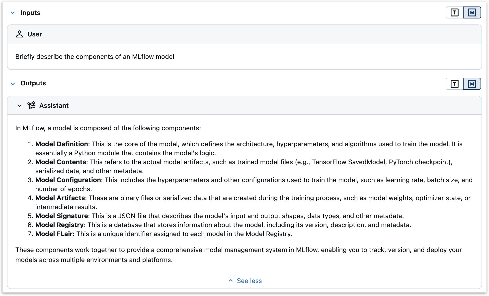
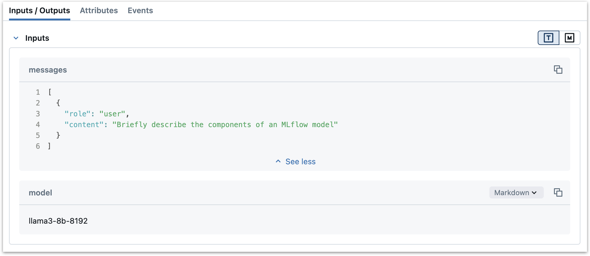
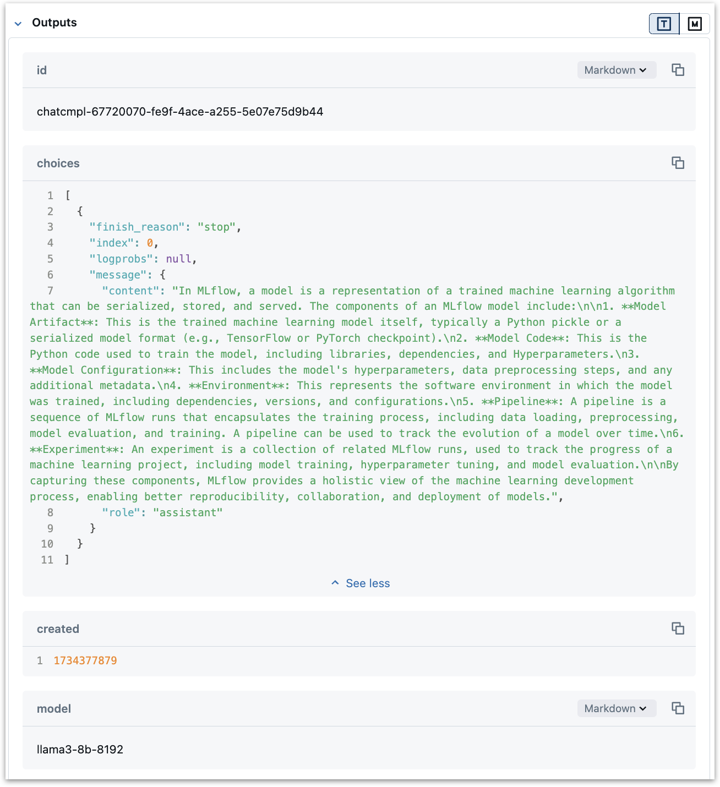
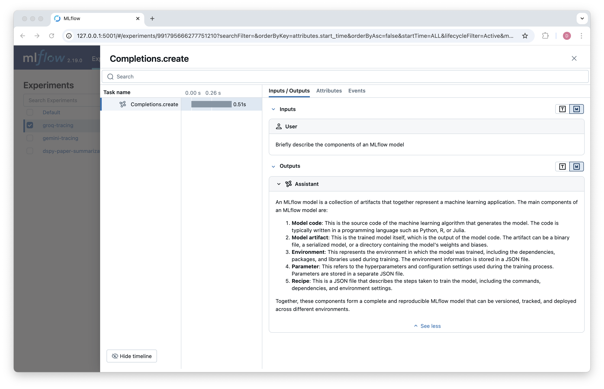
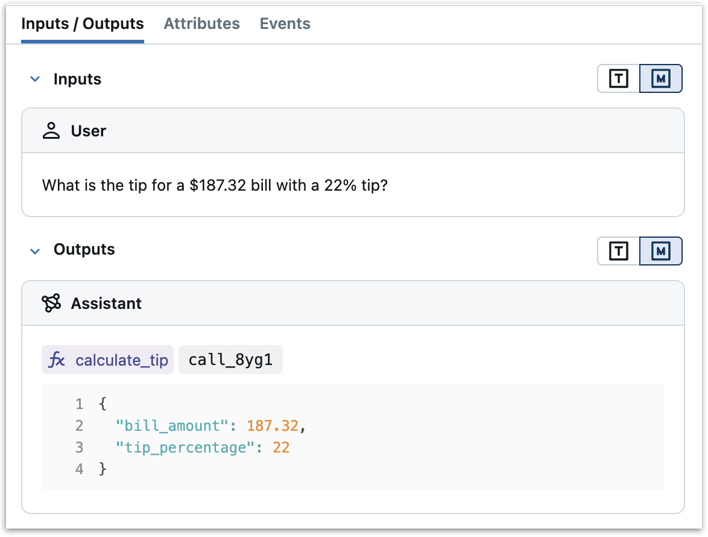
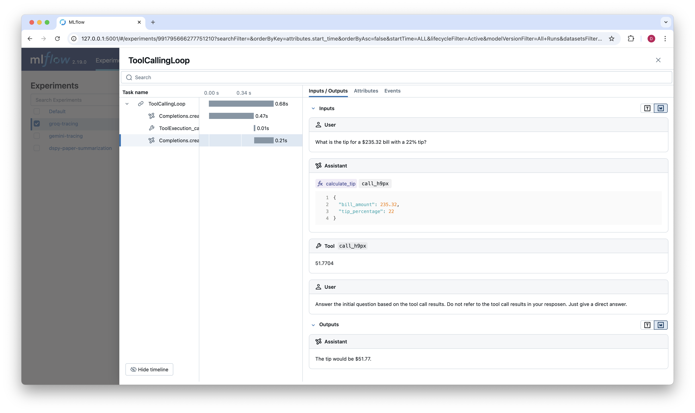

In this post, we will show how to add MLflow Tracing to a new LLM provider by adding tracing support to the provider's Python client.

[MLflow Tracing](https://mlflow.org/docs/latest/llms/tracing/index.html) is an observability tool in MLflow that captures detailed execution traces for GenAI applications and workflows. In addition to inputs, outputs, and metadata for individual calls, MLflow tracing can also capture intermediate steps such as tool calls, reasoning steps, retrieval steps, or other custom steps.

MLflow provides [built-in Tracing support](https://mlflow.org/docs/latest/llms/tracing/index.html#automatic-tracing) for many popular LLM providers and orchestration frameworks. If you are using one of these providers, you can enable tracing with a single line of code: `mlflow.<provider>.autolog()`. While MLflow's autologging capabilities cover many of the most widely-used LLM providers and orchestration frameworks, there may be times when you need to add tracing to an unsupported provider or customize tracing beyond what autologging provides. This post demonstrates how flexible and extensible MLflow Tracing can be by:

- Adding basic tracing support to an unsupported provider (Groq)
- Showing how to capture both simple completions and more complex tool-calling workflows
- Illustrating how tracing can be added with minimal changes to existing code

We'll use [Groq](https://groq.com/), an AI inference provider known for very fast Llama model serving, as our example. We'll work through the process step-by-step, showing how to capture the key information with MLflow tracing while maintaining a clean integration with the provider's SDK.

## Adding MLflow Tracing to a New Provider: General Principles

The MLflow docs have an [excellent guide](https://mlflow.org/docs/latest/llms/tracing/contribute.html) to contributing to MLflow tracing. Though we will not be contributing to MLflow itself in this example, we will follow the same general principles.

This post assumes that you have a basic understanding of what MLflow Tracing is and how it works. If you are just learning, or you need a refresher, take a look at the [Tracing Concepts](https://mlflow.org/docs/latest/llms/tracing/overview.html) guide.

Adding tracing to a new provider involves a few key considerations:

1. **Understand the Provider's key functionality:** We first need to understand what API methods need to be traced in order to get the tracing information we want. For LLM inference providers, this typically involves operations such as chat completions, tool calls, or embedding generation. In orchestration frameworks, this may involve operations such as retrieval, reasoning, routing, or any of a wide range of custom steps. In our Groq example, we will focus on the chat completions API. This step will vary significantly depending on the provider.

2. **Map operations to span types:** MLflow tracing uses different *span types* to represent different types of operations. You can find descriptions of built-in span types [here](https://mlflow.org/docs/latest/llms/tracing/index.html#span-type). Different span types are displayed differently in the MLflow UI and can enable specific functionality. For example, `CHAT_MODEL` spans format messages into clear User and Assistant message categories.

    

    When adding tracing to a new provider, the main task is to map the provider's API methods to MLflow Tracing spans with appropriate span types.

3. **Structure and preserve key data:** For each operation we want to trace, we need to identify the key information we want to preserve and make sure it is captured and displayed in a useful way. For example, we may want to capture the input and configuration data that control the operation's behavior, the outputs and metadata that explain the results, errors that terminated the operation prematurely, etc. Looking at traces and tracing implementations for similar providers can provide a good starting point for how to structure and preserve these data.

## Adding tracing to Groq

Now that we have a high-level understanding of the key step of adding tracing to a new provider, let's work through the process and add tracing to Groq.

### Step 1: Install and Test the Groq SDK

First, we need to install the Groq SDK and figure out what methods we need to pay attention to when adding tracing support. You can install the Groq SDK with `pip install groq`. You'll then need to get an API key from [https://console.groq.com/](console.groq.com) and set the `GROQ_API_KEY` environment variable.

If you have used the OpenAI Python SDK, the Groq SDK will feel quite familiar. Here's how we set up the Groq client and make a chat completion call:

```python
from groq import Groq

client = Groq(
    api_key=os.environ.get("GROQ_API_KEY"),
)

chat_completion = client.chat.completions.create(
    messages=[
        {
            "role": "user",
            "content": "Briefly describe the components of an MLflow model",
        }
    ],
    model="llama3-8b-8192",
)

print(chat_completion.to_dict())
```

Which will return:

```python
{
    'id': 'chatcmpl-a9e831a9-eb8c-4259-8591-14d326ff9fbe',
    'choices': [
        {
            'finish_reason': 'stop',
            'index': 0,
            'logprobs': None,
            'message': {
                'content': "In MLflow, a model is a packaged artifact that contains the following components:\n\n1.
**Model flavor**: This is the type of model, such as TensorFlow, PyTorch, or Scikit-learn.\n2. **Model code**: This
is the Python code that defines the model, including any dependencies.\n3. **Model parameters**: These are the 
hyperparameters and weights learned during training.\n4. **Model registry**: This is a unique identifier that 
tracks the model's version and lineage.\n5. **Model metadata**: This includes information such as the model's name,
description, and tags.\n6. **Input and output data**: This includes the data types and formats used for input and 
output of the model.\n7. **Environment**: This includes the environment in which the model was trained, such as the
Python version, libraries, and dependencies.\n8. **Logging data**: This includes any logged data during training, 
such as metrics and hyperparameters.\n\nAll these components are packaged together in a `.mlmodel` file, which can 
be used to deploy and serve the model using MLflow's built-in support for deployment tools like Kubernetes, Docker,
and Apache Serve.",
                'role': 'assistant'
            }
        }
    ],
    'created': 1734373826,
    'model': 'llama3-8b-8192',
    'object': 'chat.completion',
    'system_fingerprint': 'fp_a97cfe35ae',
    'usage': {
        'completion_tokens': 237,
        'prompt_tokens': 20,
        'total_tokens': 257,
        'completion_time': 0.1975,
        'prompt_time': 0.003113507,
        'queue_time': 0.00047183299999999963,
        'total_time': 0.200613507
    },
    'x_groq': {'id': 'req_01jf8brr88fyptcwydq44cnjn0'}
}
```

Looking at the completion data, Groq does, indeed, provide very fast LLM inference! And we have verified that the Groq SDK set up and working. We also know what method we need to focus on when adding tracing support: `chat.completions.create`.

### Step 2: Write a Tracing Decorator

There are several ways we could add tracing to Groq's SDK—we could modify the SDK code directly, create a wrapper class, or use Python's method patching capabilities. For this example, we'll use a decorator to patch the client instance method. This approach lets us add tracing without modifying the SDK code or creating additional wrapper classes, though it does require understanding both Python's decorator pattern and how MLflow tracing works.

```python
import mlflow
from mlflow.entities import SpanType
from functools import wraps

def _get_span_type(task_name: str) -> str:
    # Map Groq API methods to MLflow span types
    span_type_mapping = {
        "create": SpanType.CHAT_MODEL,
    }
    return span_type_mapping.get(task_name, SpanType.UNKNOWN)

def trace_groq_chat(func):
    @wraps(func)
    def wrapper(*args, **kwargs):
        with mlflow.start_span(
            name=func.__qualname__,
            span_type=_get_span_type(func.__qualname__.split(".")[-1]),
        ) as span:
            # Set model name as a span attribute
            model_name = kwargs.get("model", "")
            span.set_attribute("model_name", model_name)
            
            # Log the inputs
            span.set_inputs({
                "messages": kwargs.get("messages", []),
                "model": model_name,
            })
            
            # Make the API call
            response = func(*args, **kwargs)
            
            # Log the outputs
            span.set_outputs(response.to_dict())
            
            return response
    return wrapper
```

Let's break down the code and see how it works.

1. We start by defining a helper function, `_get_span_type`, that maps Groq client methods to MLflow span types. This isn't strictly necessary as we are currently only tracing the `chat.completions.create` method, but it shows a pattern that could be applied to other methods. This follows the reference implementation for the [Anthropic provider](https://github.com/mlflow/mlflow/blob/master/mlflow/anthropic/autolog.py), as recommended in the tracing contribution guide.
2. We define a decorator, `trace_groq_chat`, using [`functools.wraps`](https://docs.python.org/3/library/functools.html#functools.wraps), that wraps the `chat.completions.create` method. There are a few key steps here:
    1. We start a new span with `mlflow.start_span`. The span name is set to the fully qualified name of the method, which is available via `func.__qualname__`. The span type is set to the value returned by `_get_span_type`. Note that we might consider alternate approaches for automatically determining the span type. For example, for a client that had both `embeddings.create` and `chat.completions.create` methods, we would be more interested in the "embeddings" and "chat" parts of the name, respectively.
    2. We set `model_name` as an attribute on the span with `span.set_attribute`. This isn't strictly necessary as model name will be captured in the inputs, but it illustrates how to set arbitrary attributes on a span.
    3. We log the messages as inputs to the span with `span.set_inputs`. We get these from the `messages` argument to the `chat.completions.create` method by accessing the `kwargs` dictionary. These messages will be logged to the "inputs" section of the span in the MLflow UI. We also log the model name as an input, again to illustrate how to record arbitrary inputs.

        

    4. We call the original method with `func(*args, **kwargs)`. This is the Groq `chat.completions.create` method.
    5. We log the outputs of the method as a span attribute with `span.set_outputs`. This takes the dictionary returned by the Groq API and sets it as an attribute on the span. This outputs will be logged to the "outputs" section of the span in the MLflow UI. If we wanted, we could log only a subset of the outputs, or log them in a different format. But in many case, especially for LLM providers that return results in a format similar to the OpenAI spec, simply logging all of the output works well and results in informative and readable traces.

        

    6. Finally, we return the response from the API call, without any changes. Now, when we wrap a client instance with `trace_groq_chat`, the `chat.completions.create` method will be traced, but will otherwise behave as normal.

A few points to note:

- We are wrapping a method on a client *instance*, not a class. This is a fairly lightweight approach that does what we need it to do without requiring changes to the Groq SDK code.
- There are several other ways we could have implemented this tracing behavior. We could have patched the Groq SDK class directly, or we could have written a simple wrapper function that decorates the `chat.completions.create` method with `@mlflow.trace`. Some orchestration frameworks may require a more complex approach, such as callbacks or API hooks. See the [MLflow Tracing Contribution Guide](https://mlflow.org/docs/latest/llms/tracing/contribute.html) for more details.

### Step 3: Wrap the instance method and try it out

Now that we have a tracing decorator, we can wrap the `chat.completions.create` method on a Groq client instance and try it out.

```python
# Create the client first
client = Groq(
    api_key=os.environ.get("GROQ_API_KEY"),
)

# Then patch the instance method
original_create = client.chat.completions.create
client.chat.completions.create = trace_groq_chat(original_create)
```

Now, when we call `client.chat.completions.create`, the method will be traced and the results will be logged to the MLflow UI:

```python
mlflow.set_experiment("groq-tracing")

response = client.chat.completions.create(
    messages=[
        {
            "role": "user",
            "content": "Briefly describe the components of an MLflow model",
        }
    ],
    model="llama3-8b-8192",
)
```



Before we move on, it's worth noting that this implementation automatically handles `tool_calls` responses because the Groq SDK handles [tool use](https://console.groq.com/docs/tool-use) in the same way as OpenAI. If Groq responds with a `tool_calls` key referring to a tip calculation tool, for instance, the tracing UI will include a special icon indicating the tool call:



## Orchestration: Building a tool calling

So far, the Groq example just generates a single span whenever a chat completion is made. But many GenAI applications include multiple LLM calls, retrieval steps, tool executions, and other custom steps. While we won't go into detail on adding tracing to orchestration frameworks here, we will illustrate some of the key concepts by defining a tool calling loop based on the tool we defined earlier.

The tool calling loop will follow this pattern:

1. Take user prompt as input
2. Respond with a tool call or calls
3. For each tool call, execute the tool and store the results
4. Append the tool call results to the message history with the `tool` role
5. Call the LLM again with the tool call results, prompting it for a final answer to the user's prompt

Here's a simple implementation with just one tool call:

```python
class ToolExecutor:
    def __init__(self):
        self.tools = [
            {
                "type": "function",
                "function": {
                    "name": "calculate_tip",
                    "description": "Calculate the tip amount based on the bill amount and tip percentage",
                    "parameters": {
                        "type": "object",
                        "properties": {
                            "bill_amount": {
                                "type": "number",
                                "description": "The total bill amount"
                            },
                            "tip_percentage": {
                                "type": "number",
                                "description": "The percentage of the bill to be given as a tip"
                            }
                        },
                        "required": ["bill_amount", "tip_percentage"]
                    }
                }
            }
        ]
        
        # Map tool names to their Python implementations
        self.tool_implementations = {
            "calculate_tip": self._calculate_tip
        }
    
    def _calculate_tip(self, bill_amount: float, tip_percentage: float) -> float:
        """Calculate the tip amount based on the bill amount and tip percentage."""
        return bill_amount * (tip_percentage / 100)
    
    def execute_tool_calling_loop(self, client, messages):
        """Execute a complete tool calling loop with tracing."""
        with mlflow.start_span(
            name="ToolCallingLoop",
            span_type="CHAIN",
        ) as parent_span:
            # Set initial inputs
            parent_span.set_inputs({
                "initial_messages": messages,
                "available_tools": self.tools
            })
            
            # First LLM call (already traced by our client patch)
            response = client.chat.completions.create(
                messages=messages,
                model="llama3-8b-8192",
                tools=self.tools,
                tool_choice="required"
            )

            messages.append(response.choices[0].message)
            
            tool_calls = response.choices[0].message.tool_calls
            tool_results = []
            
            # Execute tool calls
            for tool_call in tool_calls:
                with mlflow.start_span(
                    name=f"ToolExecution_{tool_call.function.name}",
                    span_type="TOOL",
                ) as tool_span:
                    # Parse tool inputs
                    tool_inputs = json.loads(tool_call.function.arguments)
                    tool_span.set_inputs(tool_inputs)
                    
                    # Execute tool
                    func = self.tool_implementations.get(tool_call.function.name)
                    if func is None:
                        raise ValueError(f"No implementation for tool: {tool_call.function.name}")
                    
                    result = func(**tool_inputs)
                    tool_span.set_outputs({"result": result})
                    
                    tool_results.append({
                        "tool_call_id": tool_call.id,
                        "output": str(result)
                    })

                    messages.append({
                        "role": "tool",
                        "tool_call_id": tool_call.id,
                        "content": str(result)
                    })
                
            # Prepare messages for final response
            
            messages.append({
                "role": "user",
                "content": "Answer the initial question based on the tool call results. Do not refer to the tool call results in your resposen. Just give a direct answer."
            })
            
            # Final LLM call (already traced by our client patch)
            final_response = client.chat.completions.create(
                messages=messages,
                model="llama3-8b-8192"
            )
            
            # Set the final output for the parent span
            parent_span.set_outputs({
                "final_response": final_response.choices[0].message.content,
                "tool_results": tool_results
            })
            
            return final_response
```

Here's how we handled tracing in this tool calling loop:

1. We first set up a parent span for the tool calling loop with `mlflow.start_span`. We set the span name to "ToolCallingLoop" and the span type to "CHAIN", representing a chain of operations.
2. We recorded the initial messages and available tools as inputs to the span. This could be helpful for future debugging by allowing us to verify that tools are made available and configured correctly.
3. We made the first LLM call with our patched `chat.completions.create` method. This call is already traced by our client patch, so we don't need to do anything special to trace it.
4. We iterated over the tool calls, executing each tool and storing the results. Each tool execution is traced with a new span, named after the tool function name. The inputs and outputs are logged as attributes on the span.
5. We appended the tool call results to the message history with the `tool` role—see the screenshot below for how this is displayed in the MLflow Tracing UI.
6. We made the final LLM call with our patched `chat.completions.create` method. Again, because we are using the patched method, this call is already traced.
7. We set the final output for the parent span to the final response from the LLM.

We can execute this as follows:

```python
executor = ToolExecutor()
response = executor.execute_tool_calling_loop(
    client,
    messages=[
        {"role": "user", "content": "What is the tip for a $235.32 bill with a 22% tip?"}
    ]
)
```

Resulting in the following trace:



## Conclusion

This post has shown how to extend MLflow Tracing beyond its built-in provider support. We started with a simple example—adding tracing to Groq's chat completions API—and saw how, with a lightweight wrapper, we could capture detailed information about each chat completion. We then built on this foundation to trace a more complex tool execution loop.

The key takeaways are:

- MLflow Tracing is highly customizable and can be adapted to providers for which autologging is not available
- Adding basic tracing support can often be done with minimal code changes. In this case, we patched the Groq client instance and wrote a few lines of code to add tracing support.
- The same principles used for simple API calls can be extended to complex workflows with multiple steps. In this case, we traced a tool calling loop that included multiple steps and tool calls.
