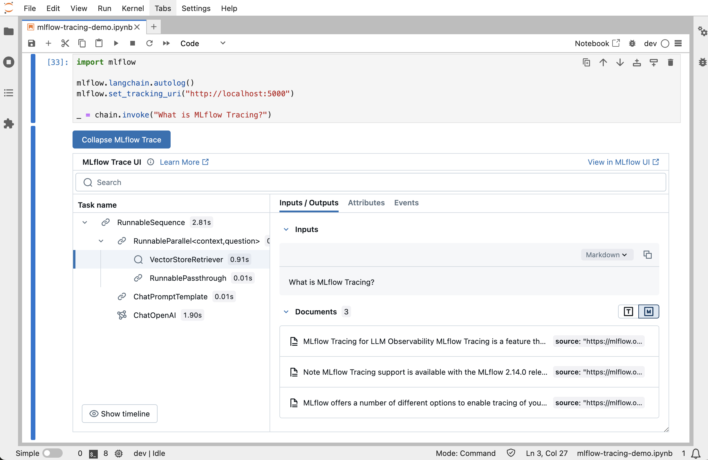

🚀 We're excited to announce a major upgrade to the [MLflow Tracing](https://mlflow.org/docs/latest/llms/tracing/index.html)
experience!

If you're not familiar with MLflow Tracing, it's an observability tool that allows you record the inputs and
outputs of intermediate function executions. It's particularly useful in debugging GenAI applications, and MLflow has over
a [dozen integrations with popular GenAI frameworks](https://mlflow.org/docs/latest/llms/tracing/index.html#automatic-tracing)
to automatically generate traces without requiring you to change your existing code.

As of **MLflow 2.20**, you can now view the MLflow Trace UI directly within Jupyter notebooks, allowing
you to debug your applications without having to tab out of your development environment. Context
switching can often be disruptive to one's workflow, and this feature makes it easier to stay focused while
still being able to visualize the trace data that you generate.

<figure>
  
  <figcaption style={{ textAlign: "center" }}>An example of the UI in JupyterLab</figcaption>
</figure>

## Getting Started

To get started, you'll need to be using an [MLflow Tracking Server](https://mlflow.org/docs/latest/tracking/server.html).
Under the hood, the MLflow client needs to make network requests in order to fetch the UI assets and trace data.

If you don't use a remote server, you can always start one locally by running the `mlflow server`
[CLI command](https://mlflow.org/docs/latest/tracking/server.html#start-the-tracking-server). By default,
the server will start up at `http://localhost:5000`.

In your notebook, simply ensure that the MLflow Tracking URI is set to your tracking server, and you're good to go!

```python
import mlflow

# replace this with your own URI, if it differs
tracking_uri = "http://localhost:5000"
mlflow.set_tracking_uri(tracking_uri)

# create a new experiment to avoid cluttering the default experiment
experiment = mlflow.set_experiment("mlflow-trace-ui-demo")

# the trace UI should now show up whenever traces are generated,
# for example:
@mlflow.trace
def add(a, b):
  return a + b

# running the traced function triggers the UI display
add(1, 2)
```

The trace UI will show up whenever any of the following events happen:

1. A trace is generated in the cell (via automatic tracing, or when running manually traced functions)
2. When a trace object is explicitly displayed (e.g. via IPython's `display()` function)
3. When the `mlflow.search_traces()` API is called

For a hands-on experience with this feature, please try running our
[**demo notebook**](https://github.com/mlflow/mlflow/blob/v2.22.1/docs/docs/tracing/tutorials/jupyter-trace-demo.ipynb)!
The notebook contains detailed examples of all three scenarios above, as well as a short LangChain RAG demo to
get a more realistic impression of how this feature will feel during your development loop.

## Disabling and Re-enabling the Display

This feature is enabled by default, but it can be turned off any time by calling `mlflow.tracing.disable_notebook_display()`.
To remove the displays that have already rendered, you'll need to re-run the cells (or simply clear the cell output).

If you want to re-enable the display, you can call `mlflow.tracing.enable_notebook_display()`.

## Bug Reports and Feedback

To report bugs or provide feedback, please file an issue in the
[MLflow GitHub repo](https://github.com/mlflow/mlflow/issues). We're looking forward to hearing from you!
