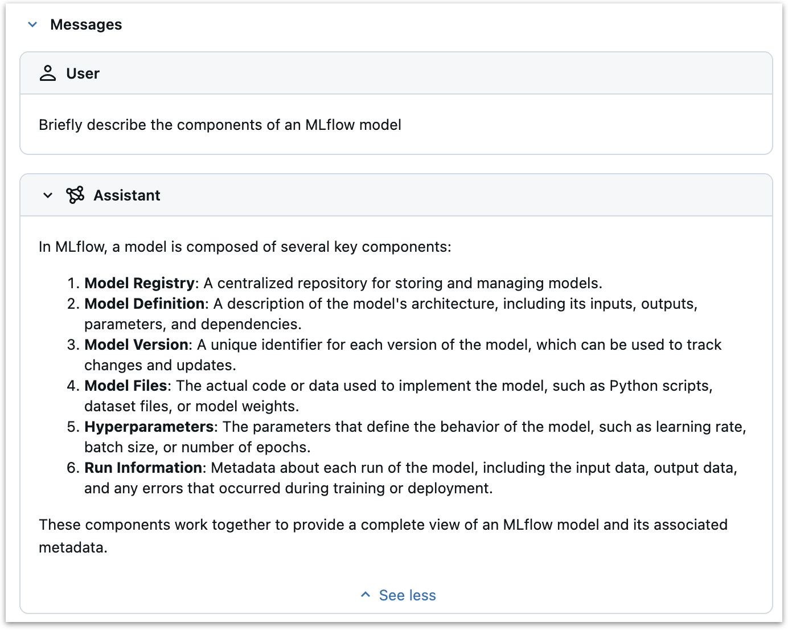
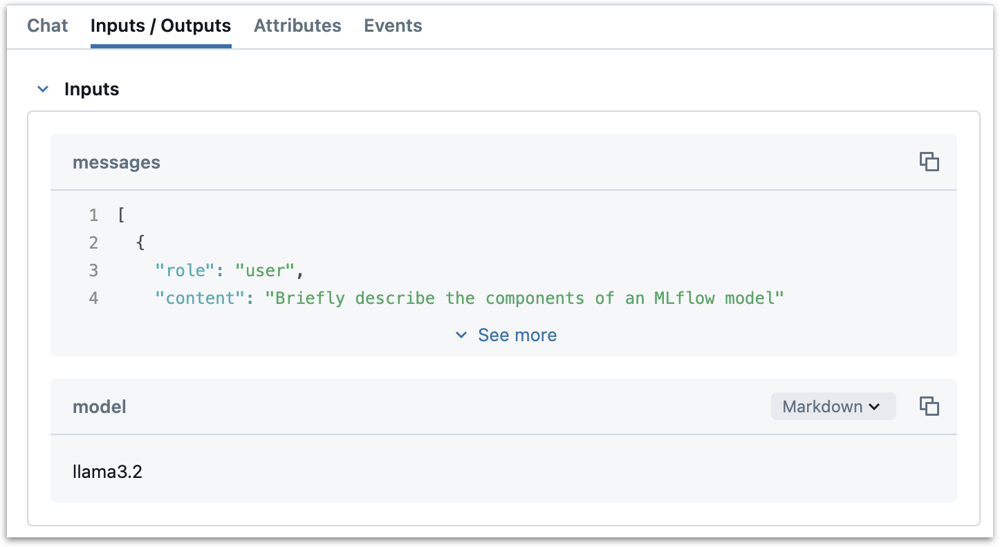
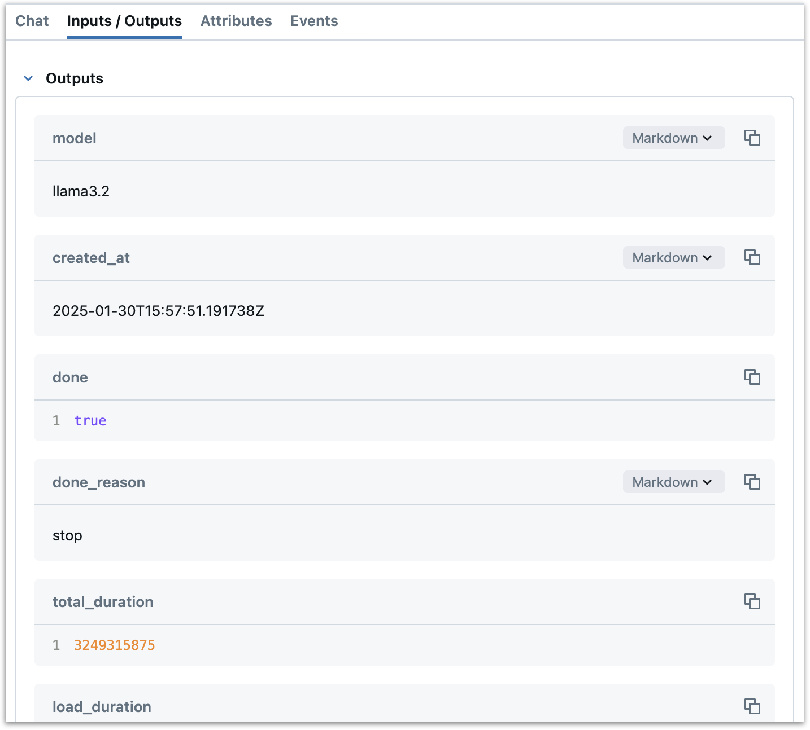
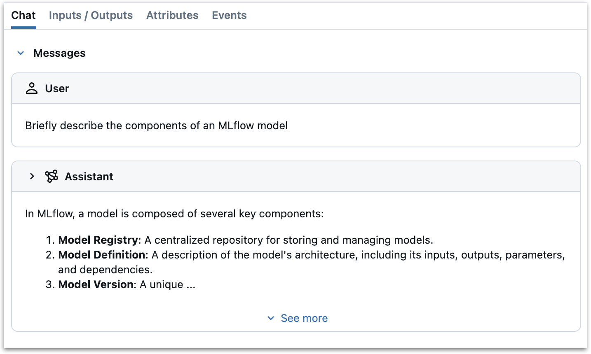
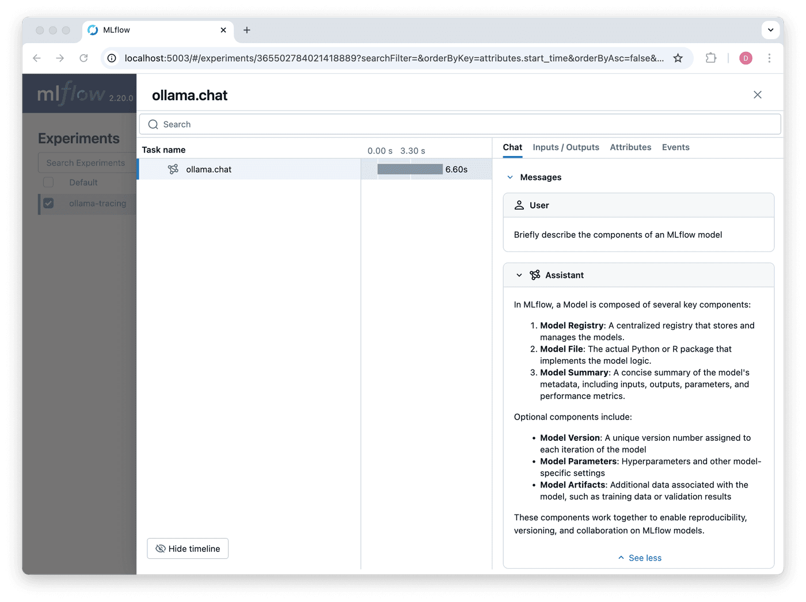
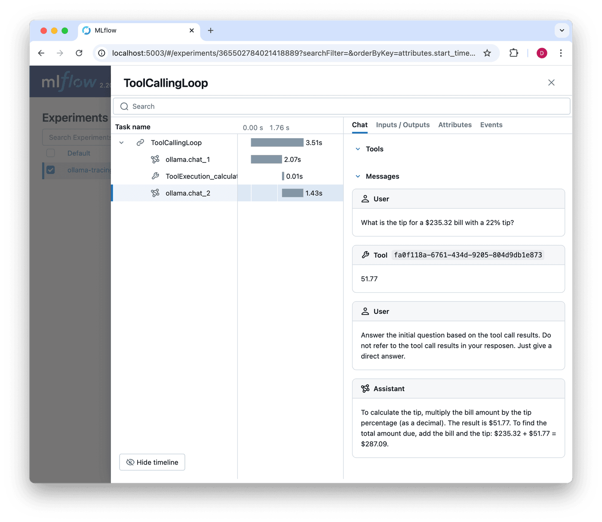

In this post, we will show how to add MLflow Tracing to a new LLM provider by adding tracing support to the `chat` method of the Ollama Python SDK.

[MLflow Tracing](https://mlflow.org/docs/latest/llms/tracing/index.html) is an observability tool in MLflow that captures detailed execution traces for GenAI applications and workflows. In addition to inputs, outputs, and metadata for individual calls, MLflow tracing can also capture intermediate steps such as tool calls, reasoning steps, retrieval steps, or other custom steps.

MLflow provides [built-in Tracing support](https://mlflow.org/docs/latest/llms/tracing/index.html#automatic-tracing) for many popular LLM providers and orchestration frameworks. If you are using one of these providers, you can enable tracing with a single line of code: `mlflow.<provider>.autolog()`. While MLflow's autologging capabilities cover many of the most widely-used LLM providers and orchestration frameworks, there may be times when you need to add tracing to an unsupported provider or customize tracing beyond what autologging provides. This post demonstrates how flexible and extensible MLflow Tracing can be by:

- Adding basic tracing support to an unsupported provider (the Ollama Python SDK)
- Showing how to capture both simple completions and more complex tool-calling workflows
- Illustrating how tracing can be added with minimal changes to existing code

We'll use [the Ollama Python SDK](https://github.com/ollama/ollama-python), an open-source Python SDK for the [Ollama](https://ollama.ai/) LLM platform, as our example. We'll work through the process step-by-step, showing how to capture the key information with MLflow tracing while maintaining a clean integration with the provider's SDK. Note that MLflow _does_ have autologging support for Ollama, but currently only for use via the OpenAI client, not directly with the Ollama Python SDK.

## Adding MLflow Tracing to a New Provider: General Principles

The MLflow docs have an [excellent guide](https://mlflow.org/docs/latest/llms/tracing/contribute.html) to contributing to MLflow tracing. Though we will not be contributing to MLflow itself in this example, we will follow the same general principles.

This post assumes that you have a basic understanding of what MLflow Tracing is and how it works. If you are just learning, or you need a refresher, take a look at the [Tracing Concepts](https://mlflow.org/docs/latest/llms/tracing/overview.html) guide.

Adding tracing to a new provider involves a few key considerations:

1. **Understand the Provider's key functionality:** We first need to understand what API methods need to be traced in order to get the tracing information we want. For LLM inference providers, this typically involves operations such as chat completions, tool calls, or embedding generation. In orchestration frameworks, this may involve operations such as retrieval, reasoning, routing, or any of a wide range of custom steps. In our Ollama example, we will focus on the chat completions API. This step will vary significantly depending on the provider.

2. **Map operations to spans:** MLflow tracing uses different _span types_ to represent different types of operations. You can find descriptions of built-in span types [here](https://mlflow.org/docs/latest/llms/tracing/index.html#span-type). Different span types are displayed differently in the MLflow UI and can enable specific functionality. Within spans, we also want to map the provider's inputs and outputs to the formats expected by MLflow. MLflow offers utilities for recording chat and tool inputs and outputs, which are then displayed as formatted messages in the MLflow UI.

   

   When adding tracing to a new provider, our main task is to map the provider's API methods to MLflow Tracing spans with appropriate span types.

3. **Structure and preserve key data:** For each operation we want to trace, we need to identify the key information we want to preserve and make sure it is captured and displayed in a useful way. For example, we may want to capture the input and configuration data that control the operation's behavior, the outputs and metadata that explain the results, errors that terminated the operation prematurely, etc. Looking at traces and tracing implementations for similar providers can provide a good starting point for how to structure and preserve these data.

## Adding tracing to the Ollama Python SDK

Now that we have a high-level understanding of the key step of adding tracing to a new provider, let's work through the process and add tracing to the Ollama Python SDK.

### Step 1: Install and Test the Ollama Python SDK

First, we need to install the Ollama Python SDK and figure out what methods we need to pay attention to when adding tracing support. You can install the Ollama Python SDK with `pip install ollama-python`.

If you have used the OpenAI Python SDK, the Ollama Python SDK will feel quite familiar. Here's how we use it to make a chat completion call:

```python
from ollama import chat
from rich import print

response = chat(model="llama3.2",
     messages = [
         {"role": "user", "content": "Briefly describe the components of an MLflow model"}
     ]
)

print(response)
```

Which will return:

```python
ChatResponse(
    model='llama3.2',
    created_at='2025-01-30T15:57:39.097119Z',
    done=True,
    done_reason='stop',
    total_duration=7687553708,
    load_duration=823704250,
    prompt_eval_count=35,
    prompt_eval_duration=3414000000,
    eval_count=215,
    eval_duration=3447000000,
    message=Message(
        role='assistant',
        content="In MLflow, a model consists of several key components:\n\n1. **Model Registry**: A centralized
storage for models, containing metadata such as the model's name, version, and description.\n2. **Model Version**:
A specific iteration of a model, represented by a unique version number. This can be thought of as a snapshot of
the model at a particular point in time.\n3. **Model Artifacts**: The actual model code, parameters, and data used
to train the model. These artifacts are stored in the Model Registry and can be easily deployed or reused.\n4.
**Experiment**: A collection of runs that use the same hyperparameters and model version to train and evaluate a
model. Experiments help track progress, provide reproducibility, and facilitate collaboration.\n5. **Run**: An
individual instance of training or testing a model using a specific experiment. Runs capture the output of each
run, including metrics such as accuracy, loss, and more.\n\nThese components work together to enable efficient
model management, version control, and reproducibility in machine learning workflows.",
        images=None,
        tool_calls=None
    )
)
```

We have verified that the Ollama Python SDK is set up and working. We also know what method we need to focus on when adding tracing support: `ollama.chat`.

### Step 2: Write a Tracing Decorator

There are several ways we could add tracing to Ollama's SDK—we could modify the SDK code directly, create a wrapper class, or use Python's method patching capabilities. For this example, we'll use a decorator to patch the SDK's `chat` method. This approach lets us add tracing without modifying the SDK code or creating additional wrapper classes, though it does require understanding both Python's decorator pattern and how MLflow tracing works.

```python
import mlflow
from mlflow.entities import SpanType
from mlflow.tracing.utils import set_span_chat_messages
from functools import wraps
from ollama import chat as ollama_chat

def _get_span_type(task_name: str) -> str:
    span_type_mapping = {
        "chat": SpanType.CHAT_MODEL,
    }
    return span_type_mapping.get(task_name, SpanType.UNKNOWN)

def trace_ollama_chat(func):
    @wraps(func)
    def wrapper(*args, **kwargs):
        with mlflow.start_span(
            name="ollama.chat",
            span_type=_get_span_type("chat"),
        ) as span:
            # Set model name as a span attribute
            model_name = kwargs.get("model", "")
            span.set_attribute("model_name", model_name)

            # Log the inputs
            input_messages = kwargs.get("messages", [])
            span.set_inputs({
                "messages": input_messages,
                "model": model_name,
            })

            # Set input messages
            set_span_chat_messages(span, input_messages)

            # Make the API call
            response = func(*args, **kwargs)

            # Log the outputs
            if hasattr(response, 'to_dict'):
                output = response.to_dict()
            else:
                output = response
            span.set_outputs(output)

            output_message = response.message

            # Append the output message
            set_span_chat_messages(span, [{"role": output_message.role, "content": output_message.content}], append=True)

            return response
    return wrapper
```

Let's break down the code and see how it works.

1. We start by defining a helper function, `_get_span_type`, that maps Ollama methods to MLflow span types. This isn't strictly necessary as we are currently only tracing the `chat` function, but it shows a pattern that could be applied to other methods. This follows the reference implementation for the [Anthropic provider](https://github.com/mlflow/mlflow/blob/master/mlflow/anthropic/autolog.py), as recommended in the tracing contribution guide.

2. We define a decorator, `trace_ollama_chat`, using [`functools.wraps`](https://docs.python.org/3/library/functools.html#functools.wraps), that patches the `chat` function. There are a few key steps here:

   1. We start a new span with `mlflow.start_span`. The span name is set to "ollama.chat" and the span type is set to the value returned by `_get_span_type`.
   2. We set `model_name` as an attribute on the span with `span.set_attribute`. This isn't strictly necessary as model name will be captured in the inputs, but it illustrates how to set arbitrary attributes on a span.
   3. We log the messages as inputs to the span with `span.set_inputs`. We get these from the `messages` argument by accessing the `kwargs` dictionary. These messages will be logged to the "inputs" section of the span in the MLflow UI. We also log the model name as an input, again to illustrate how to record arbitrary inputs.

      

   4. We use MLflow's `set_span_chat_messages` utility function to format the input messages in a way that will be displayed nicely in the MLflow UI's Chat panel. This helper ensures that the messages are properly formatted and displayed with appropriate styling for each message role.
   5. We call the original function with `func(*args, **kwargs)`. This is the Ollama `chat` function.
   6. We log the outputs of the function as a span attribute with `span.set_outputs`. This takes the response from the Ollama API and sets it as an attribute on the span. These outputs will be logged to the "outputs" section of the span in the MLflow UI.

      

   7. We extract the output message from the response and use `set_span_chat_messages` again to append it to the chat history, ensuring it appears in the Chat panel of the MLflow UI.

      

   8. Finally, we return the response from the API call, without any changes. Now, when we patch the chat function with `trace_ollama_chat`, the function will be traced, but will otherwise behave as normal.

A few points to note:

- This implementation uses a simple decorator pattern that adds tracing without modifying the underlying Ollama SDK code. This makes it a lightweight and maintainable approach.
- The use of `set_span_chat_messages` ensures that both input and output messages are displayed in a user-friendly way in the MLflow UI's Chat panel, making it easy to follow the conversation flow.
- There are several other ways we could have implemented this tracing behavior. We could have written a wrapper class or used a simple wrapper function that decorates the `chat` function with `@mlflow.trace`. Some orchestration frameworks may require a more complex approach, such as callbacks or API hooks. See the [MLflow Tracing Contribution Guide](https://mlflow.org/docs/latest/llms/tracing/contribute.html) for more details.

### Step 3: Patch the `chat` method and try it out

Now that we have a tracing decorator, we can patch Ollama's `chat` method and try it out.

```python
original_chat = ollama_chat
chat = trace_ollama_chat(ollama_chat)
```

This code effectively patches the `ollama.chat` function in the current scope. We first store the original function in `original_chat` for safekeeping, then reassign `chat` to the decorated version. This means that any subsequent calls to `chat()` in our code will use the traced version, while still preserving the original functionality.

Now, when we call `chat()`, the method will be traced and the results will be logged to the MLflow UI:

```python
mlflow.set_experiment("ollama-tracing")

response = chat(model="llama3.2",
     messages = [
         {"role": "user", "content": "Briefly describe the components of an MLflow model"}
     ]
)
```



## Tracing Tools and Tool Calls

The Ollama Python SDK supports tool calls. We want to record two main things:

1. The tools that are available to the LLM
2. The actual tool calls, including the specific tool and the arguments passed to it.

Note that a "tool call" refers to the LLM's specification of which tool to use and what arguments to pass to it—not the actual execution of that tool. When an LLM makes a tool call, it's essentially saying "this tool should be run with these parameters" rather than running the tool itself. The actual execution of the tool happens separately, typically in the application code.

Here is an updated version of the tracing code, patching the Ollama chat method, that records the available tools and captures tool calls:

```python
from mlflow.entities import SpanType
from mlflow.tracing.utils import set_span_chat_messages, set_span_chat_tools
from functools import wraps
from ollama import chat as ollama_chat
import json
from uuid import uuid4

def _get_span_type(task_name: str) -> str:
    span_type_mapping = {
        "chat": SpanType.CHAT_MODEL,
    }
    return span_type_mapping.get(task_name, SpanType.UNKNOWN)

def trace_ollama_chat(func):
    @wraps(func)
    def wrapper(*args, **kwargs):
        with mlflow.start_span(
            name="ollama.chat",
            span_type=_get_span_type("chat"),
        ) as span:
            # Set model name as a span attribute
            model_name = kwargs.get("model", "")
            span.set_attribute("model_name", model_name)

            # Log the inputs
            input_messages = kwargs.get("messages", [])
            tools = kwargs.get("tools", [])
            span.set_inputs({
                "messages": input_messages,
                "model": model_name,
                "tools": tools,
            })

            # Set input messages and tools
            set_span_chat_messages(span, input_messages)
            if tools:
                set_span_chat_tools(span, tools)

            # Make the API call
            response = func(*args, **kwargs)

            # Log the outputs
            if hasattr(response, "to_dict"):
                output = response.to_dict()
            else:
                output = response
            span.set_outputs(output)

            output_message = response.message

            # Prepare the output message for span
            output_span_message = {
                "role": output_message.role,
                "content": output_message.content,
            }

            # Handle tool calls if present
            if output_message.tool_calls:
                tool_calls = []
                for tool_call in output_message.tool_calls:
                    tool_calls.append({
                        "id": str(uuid4()),
                        "type": "function",
                        "function": {
                            "name": tool_call.function.name,
                            "arguments": json.dumps(tool_call.function.arguments),
                        }
                    })
                output_span_message["tool_calls"] = tool_calls

            # Append the output message
            set_span_chat_messages(span, [output_span_message], append=True)

            return response

    return wrapper
```

The key changes here are:

- We extracted the list of available tools from the `tools` argument with `tools = kwargs.get("tools", [])`, logged them as inputs, and use `set_span_chat_tools` to capture them for inclusion in the Chat panel.
- We added a specific handling for tool calls in the output message, making sure to format them according to the [ToolCall](https://mlflow.org/docs/latest/python_api/mlflow.types.html#mlflow.types.llm.ToolCall) specification.

Now let's test this with a simple tip calculation tool. Tools are defined according to the [OpenAI specification](https://platform.openai.com/docs/guides/function-calling#defining-functions) for tool calls.

```python
chat = trace_ollama_chat(ollama_chat)

tools = [
    {
        "type": "function",
        "function": {
            "name": "calculate_tip",
            "description": "Calculate the tip amount based on the bill amount and tip percentage",
            "parameters": {
                "type": "object",
                "properties": {
                    "bill_amount": {
                        "type": "number",
                        "description": "The total bill amount"
                    },
                    "tip_percentage": {
                        "type": "number",
                        "description": "The percentage of the bill to be given as a tip, given as a whole number."
                    }
                },
                "required": ["bill_amount", "tip_percentage"]
            }
        }
    }
]

response = chat(
    model="llama3.2",
    messages=[
        {"role": "user", "content": "What is the tip for a $187.32 bill with a 22% tip?"}
    ],
    tools=tools,
)

```

We can inspect the trace in the MLflow UI, now with both the available tools and the tool call results displayed:


## Orchestration: Building a tool calling loop

So far, the Ollama example just generates a single span whenever a chat completion is made. But many GenAI applications include multiple LLM calls, retrieval steps, tool executions, and other custom steps. While we won't go into detail on adding tracing to orchestration frameworks here, we will illustrate some of the key concepts by defining a tool calling loop based on the tool we defined earlier.

The tool calling loop will follow this pattern:

1. Take user prompt as input
2. Respond with a tool call or calls
3. For each tool call, execute the tool and store the results
4. Append the tool call results to the message history with the `tool` role
5. Call the LLM again with the tool call results, prompting it for a final answer to the user's prompt

Here's an implementation with just one tool call.

```python
class ToolExecutor:
    def __init__(self):
        self.tools = [
            {
                "type": "function",
                "function": {
                    "name": "calculate_tip",
                    "description": "Calculate the tip amount based on the bill amount and tip percentage",
                    "parameters": {
                        "type": "object",
                        "properties": {
                            "bill_amount": {
                                "type": "number",
                                "description": "The total bill amount"
                            },
                            "tip_percentage": {
                                "type": "number",
                                "description": "The percentage of the bill to be given as a tip, represented as a whole number."
                            }
                        },
                        "required": ["bill_amount", "tip_percentage"]
                    }
                }
            }
        ]

        # Map tool names to their Python implementations
        self.tool_implementations = {
            "calculate_tip": self._calculate_tip
        }

    def _calculate_tip(self, bill_amount: float, tip_percentage: float) -> float:
        """Calculate the tip amount based on the bill amount and tip percentage."""
        bill_amount = float(bill_amount)
        tip_percentage = float(tip_percentage)
        return round(bill_amount * (tip_percentage / 100), 2)
    def execute_tool_calling_loop(self, messages):
        """Execute a complete tool calling loop with tracing."""
        with mlflow.start_span(
            name="ToolCallingLoop",
            span_type="CHAIN",
        ) as parent_span:
            # Set initial inputs
            parent_span.set_inputs({
                "initial_messages": messages,
                "available_tools": self.tools
            })

            # Set input messages
            set_span_chat_messages(parent_span, messages)

            # First LLM call (already traced by our chat method patch)
            response = chat(
                messages=messages,
                model="llama3.2",
                tools=self.tools,
            )

            messages.append(response.message)

            tool_calls = response.message.tool_calls
            tool_results = []

            # Execute tool calls
            for tool_call in tool_calls:
                with mlflow.start_span(
                    name=f"ToolExecution_{tool_call.function.name}",
                    span_type="TOOL",
                ) as tool_span:
                    # Parse tool inputs
                    tool_inputs = tool_call.function.arguments
                    tool_span.set_inputs(tool_inputs)

                    # Execute tool
                    func = self.tool_implementations.get(tool_call.function.name)
                    if func is None:
                        raise ValueError(f"No implementation for tool: {tool_call.function.name}")

                    result = func(**tool_inputs)
                    tool_span.set_outputs({"result": result})

                    tool_results.append({
                        "tool_call_id": str(uuid4()),
                        "output": str(result)
                    })

                    messages.append({
                        "role": "tool",
                        "tool_call_id": str(uuid4()),
                        "content": str(result)
                    })

            # Prepare messages for final response
            messages.append({
                "role": "user",
                "content": "Answer the initial question based on the tool call results. Do not refer to the tool call results in your response. Just give a direct answer."
            })

            # Final LLM call (already traced by our chat method patch)
            final_response = chat(
                messages=messages,
                model="llama3.2"
            )

            # Set the final output for the parent span
            parent_span.set_outputs({
                "final_response": final_response.message.content,
                "tool_results": tool_results
            })

            print(final_response)

            # set output messages
            set_span_chat_messages(parent_span, [final_response.message.model_dump()], append=True)

            return final_response
```

Here's how we handled tracing in this tool calling loop:

1. We first set up a parent span for the tool calling loop with `mlflow.start_span`. We set the span name to "ToolCallingLoop" and the span type to "CHAIN", representing a chain of operations.
2. We record the initial messages and available tools as inputs to the span. This could be helpful for future debugging by allowing us to verify that tools are made available and configured correctly.
3. We make the first LLM call with our patched `chat` function. This call is already traced by our decorator, so we don't need to do anything special to trace it.
4. We iterate over the tool calls, executing each tool and storing the results. Each tool execution is traced with a new span, named after the tool function name. The inputs and outputs are logged as attributes on the span.
5. We append the tool call results to the message history with the `tool` role. This allows the LLM to see the results of the tool calls in subsequent requests. It also allows us to see the tool call results in the MLflow UI.
6. We prepare messages for the final response, including a prompt to answer the initial question based on the tool call results.
7. We make the final LLM call with our patched `chat` function. Again, because we are using the patched function, this call is already traced.
8. We set the final output for the parent span, including both the final response from the LLM and the tool results.
9. Finally, we use `set_span_chat_messages` to append the final response to the chat history in the MLflow UI. Note that, to keep things clean and simple, we only record the user's initial query and the final response to the parent span with `set_span_chat_messages`. We can click into the nested spans to see the tool call results and other details.

This process creates a comprehensive trace of the entire tool calling loop, from the initial request through tool executions and the final response.

We can execute this as follows. However, note that you should _not_ run arbitrary code generated or invoked by LLMs without fully understanding what it will do on your system.

```python
executor = ToolExecutor()
response = executor.execute_tool_calling_loop(
    messages=[
        {"role": "user", "content": "What is the tip for a $235.32 bill with a 22% tip?"}
    ]
)
```

Resulting in the following trace:



## Conclusion

This post has shown how to extend MLflow Tracing beyond its built-in provider support. We started with a simple example—adding tracing to the Ollama Python SDK's `chat` method—and saw how, with a lightweight patch, we could capture detailed information about each chat completion. We then built on this foundation to trace a more complex tool execution loop.

The key takeaways are:

- MLflow Tracing is highly customizable and can be adapted to providers for which autologging is not available
- Adding basic tracing support can often be done with minimal code changes. In this case, we patched the Ollama Python SDK's `chat` method and wrote a few lines of code to add tracing support.
- The same principles used for simple API calls can be extended to complex workflows with multiple steps. In this case, we traced a tool calling loop that included multiple steps and tool calls.
