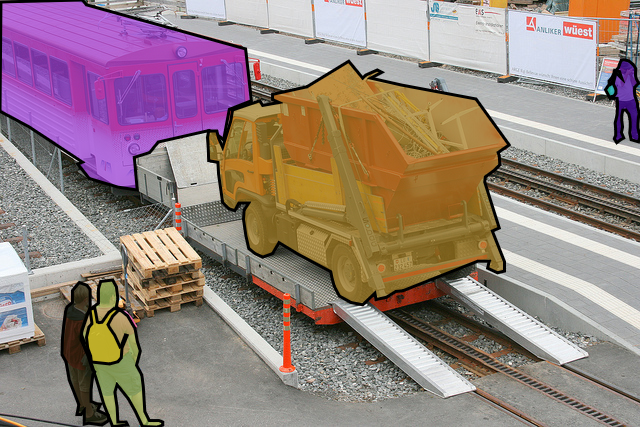
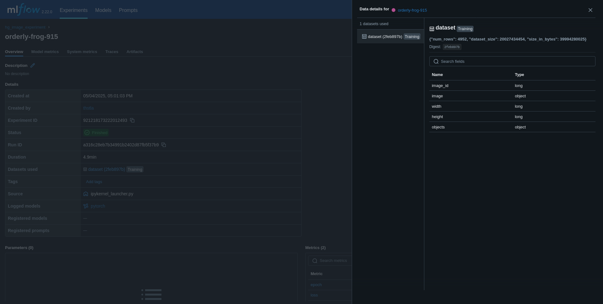

Dataset tracking is fundamental to building robust and reproducible machine learning models. Among all data types, images present unique tracking challenges due to their high dimensionality, variability, and storage requirements. In this post, we'll demonstrate how to effectively track image datasets using MLflow's experiment tracking capabilities and UI, providing you with practical techniques to enhance your computer vision workflows' tracking of data and models.

> **NOTE**: This guide assumes familiarity with MLflow and its tracking capabilities as well as PyTorch. For beginners, refer to the [MLflow starters tutorial](https://mlflow.org/docs/latest/getting-started/) and this [PyTorch Vision tutorial](https://pytorch.org/tutorials/intermediate/torchvision_tutorial.html).

## Why Track Image Datasets?

Tracking image datasets is essential for structured machine learning projects. It ensures:
- **High-quality training data**: Unlike structured datasets, image datasets are hard to understand and read, but their importance for model performance is the same, and they still require annotation, curation, and feature transformations. 
- **Reproducibility**: Experiments can be replicated with the same dataset version and preprocessing steps.
- **Data and model lineage**: Tracking maintains a record of data usage, essential for adhering to data governance as well as tracking the lineage of the model and data used in training, validation, and testing.
- **Debugging**: Tracking helps identify issues related to data quality or preprocessing that may affect model performance.

## Understanding Image Dataset Formats
There exist many formats for datasets in the global machine-learning community. 
In this blog post, we will use a widely used format for computer-vision models, COCO, in the traditional fileformat and a Hugging Face version of the same dataset. These two formats have pros and cons and different possibilites for MLflow tracking.

Pros using the native fileformat:
- dataloaders ready to use in `pycocotools` / `torchvision`
- fast to load
- smaller filesize
- simple directory structure
- artifacts can be tracked and shown, e.g. as image
Cons:
- not trackable
- unstructured data so can be messy to search and explore
- not queryable

Pros using Huggingface datasets / tabular datasets
- very structured
- fully trackable as a training dataset using mlflow.data  (se more below)
- metadata can be added for data in mlflow
Cons:
- huge filesize due to binary written as text in tabel entries
- requires a custom dataloader

### COCO: Common Objects in Context
COCO is a widely used dataset format in computer vision, known for its rich annotations. 
It supports:
- Object Detection, Keypoint Detection, Stuff Segmentation, Image Captioning, and more.
- JSON-based annotations for storing metadata.

We will be using this dataset throughout this blog post.

> It is important to visualize annotations in image datasets to perform comprehensive quality checks. You can explore the dataset on the [COCO dataset official site](https://cocodataset.org/#explore) to understand more about the nature of the data included within it.

Image datasets have annotations which can be segments of an object in picture or an bounding box. This means that for every image, there will be a class and a set of coordinates for each identified object. See the following example from the COCO dataset:
> 

### Hugging Face Image Datasets
Hugging Face offers a simple `Image Folder` type for creating datasets from local files. It supports:
- Metadata integration for text captions and object detection.
- Quick dataset creation using directory file paths.

This can be used with several formats such as COCO and is supported by MLflow.

## Tracking Datasets with MLflow

Understanding the properties of your dataset is crucial for effective ML model training, testing, and evaluation. This includes analyzing class balance, annotation quality, and other key characteristics. By doing so, you can ensure that your dataset aligns with the requirements of your machine learning tasks and identify potential biases or gaps that may impact model performance. Therefore, datasets need to be tracked together with your model during experiment runs.

**MLflow** provides robust tools to ensure reproducibility and model lineage. 
- Log dataset metadata, such as format (e.g., COCO, Hugging Face Image Folder).
- Log parameters used in feature transformation/data augmentation steps.
- Track dataset versions for reproducibility.
- Store and retrieve dataset-related artifacts like dataset descriptions.
- Link datasets with specific model training runs.

In this post we will show how we can easeli use `mlflow.log_artifacts` [method](https://mlflow.org/docs/latest/api_reference/python_api/mlflow.html#mlflow.log_artifact), `mlflow.log_input` [method doc](https://mlflow.org/docs/latest/api_reference/python_api/mlflow.html#mlflow.log_input), and we will see how one using `mlflow.data` [module doc](https://mlflow.org/docs/latest/api_reference/python_api/mlflow.data.html#mlflow-data) can add more structure to dataset tracking using Huggingface.
Furthermore, we will use the `mlflow.pytorch` [module doc](https://mlflow.org/docs/latest/api_reference/python_api/mlflow.pytorch.html#mlflow.pytorch.log_model) to log a model.

## Example Using Computer Vision Model and Image Datasets Tracking

There are two approaches to log an image dataset—using `mlflow.artifacts` or `mlflow.data` (datasets). Lastly, you can also log an evaluation dataset, which I will not cover in this post.

Why are there two approaches? Because converting an image dataset from file-based formats like COCO to a tabular format is challenging, as most dataloaders expect the file-based COCO format. Logging artifacts provides a quick and straightforward solution without the need to reformat files, but it can easely also be messy. Make sure to create meaningful paths for your artifacts.

The key artifact for COCO datasets is the `instances.json` file, which describes your image dataset's metadata and annotations. This file can, for example, be used to check the class balance in your dataset by analyzing the `category` field.

If you are not too concerned about this, Hugging Face can help with logging datasets the MLflow way. Some Hugging Face datasets contain rich metadata that can be transferred to MLflow tracking. This is where `mlflow.data` comes in. Compared to logging artifacts, this add much more reach metadata and structure to your dataset and makes it easier to manage and see in the experiment run. If you can fit your dataset into a Huggingface type dataset and make that work in your dataloader or training script, this is the recommended apporach.

In this post, I will go through both approaches in code.

### Install MLflow and Other Dependencies

Start by installing the dependencies for both code examples in your `python >= 3.10` environment. `opencv` can be omitted if only using the first examples and `pycocotools` can be omitted if only using the second example.

`pip install mlflow datasets torch torchvision pycocotools opencv-python-headless psutil`

Also install `pynvml` if you want to track GPU metrics.

For the HuggingFace dataset download, also make sure to log in.

`huggingface-cli login`

One of the examples requires compute; therefore, be sure to turn on [MLflow system metrics](https://mlflow.org/docs/latest/system-metrics/) to track what happens on your compute during training.

`export MLFLOW_ENABLE_SYSTEM_METRICS_LOGGING=true`

> Note: The validation split is used to save space, but you can also use the "train" split 
> if you want to train/finetune the model on the full dataset (requires +25 GB storage).
> Number of epochs and a subset of the dataset is also used during training.

### Logging Artifacts of Datasets Together with Model
Since the COCO dataset is file-based, files need to be downloaded first. We use the smallest version of the newest version of the dataset from the official author's website.

```bash
# download the COCO val 2017 dataset
wget -P datasets http://images.cocodataset.org/zips/val2017.zip 
unzip -q datasets/val2017.zip -d datasets
wget -P datasets http://images.cocodataset.org/annotations/annotations_trainval2017.zip 
unzip -q datasets/annotations_trainval2017.zip -d datasets
rm datasets/val2017.zip & rm datasets/annotations_trainval2017.zip
```

We can now train a model and track the artifacts of the training dataset as well as inputs in the same run.

```python
from torchvision.datasets import CocoDetection
from torchvision import models
import mlflow

# Load a COCO Dataset (val used to limit size)
img_folder = "datasets/val2017"
coco_annotation_file = "datasets/annotations/instances_val2017.json"

# Download dataset
dataset = CocoDetection(img_folder, coco_annotation_file)

# Load a pre-trained model from COCO
model = models.detection.fasterrcnn_resnet50_fpn(weights='COCO_V1')

# Set experiment name
mlflow.set_experiment("coco_experiment")

# Save dataset artifacts and model
with mlflow.start_run():

  # log dataset 
  with open(coco_annotation_file, 'r') as f:
      dataset_metadata = json.load(f)
  mlflow.log_dict(dataset_metadata, "coco_annotation_file")

  # log images
  mlflow.log_artifact(img_folder, artifact_path="images")

  # log model
  mlflow.pytorch.log_model(model, "model")

  # register model with a meaningful name
  mlflow.register_model(
      "runs:/{}/model".format(mlflow.active_run().info.run_id),
      "fasterrcnn_resnet50_fpn_coco_2017_model"
  )
```

We can go into our MLflow UI and see the dataset registered under the experiment run of our model.

Image and text visualization of files is supported.


### Logging Artifacts of Datasets Together with Model
We can do this in a more structured way using a HuggingFace dataset and leverage a convenient way to read in the data. In this way, we have our MLflow tracked dataset, training metrics and models all in the same experiment run!  

```python
import numpy as np
import cv2
import io
import mlflow
from torchvision import models
from torchvision.models.detection import FasterRCNN_ResNet50_FPN_Weights
import os

os.environ["MLFLOW_ENABLE_SYSTEM_METRICS_LOGGING"] = "true"

# Load the COCO dataset from Huggingface
dataset = load_dataset("detection-datasets/coco", split="val")

# Transform to MLFlow Dataset
mlflow_dataset = mlflow.data.huggingface_dataset.from_huggingface(dataset)

# For this example we create a subset of the dataset with the first 100 rows
subset_dataset = dataset.select(range(100))

# Note; evaluation, we transform it again
mlflow_eval_dataset = mlflow_dataset.to_evaluation_dataset()

# Load a pre-trained object detection / segmentation model
model = models.detection.fasterrcnn_resnet50_fpn(weights=FasterRCNN_ResNet50_FPN_Weights.DEFAULT)
# Let’s fine-tune it, log dataset, metrics, and model in an MLflow Experiment run 

mlflow.set_experiment("hg_image_experiment")

with mlflow.start_run():

  # log training dataset in model training run
  mlflow.log_input(mlflow_dataset, context="training")
  optimizer = torch.optim.SGD(model.parameters(), lr=0.001, momentum=0.9, weight_decay=0.0005)

  for epoch in range(1): # We train for 1 epoch in this example

    print(f"Training object detection model, epoch {epoch+1}...")

    for row in subset_dataset: # We run a subset of the dataset to save time
      
      # In this example we are not using a dataloader but just converting image bytes to ndarray
      image_bytes = io.BytesIO()
      row["image"].save(image_bytes, format="JPEG")
      image_bytes = image_bytes.getvalue()
      if isinstance(image_bytes, bytes):
          image_array = np.frombuffer(image_bytes, np.uint8)
          image = cv2.imdecode(image_array, cv2.IMREAD_COLOR)
          image = cv2.cvtColor(image, cv2.COLOR_BGR2RGB)
      else:
          raise TypeError("Expected bytes object for 'image', got {}".format(type(image_bytes)))
      image = np.array(image)

      # Prepare annotations as target
      annotations = row["objects"] 
      target = []
      for i in range(len(annotations['category'])):
          d = {}
          d['boxes'] = torch.tensor(annotations['bbox'][i], dtype=torch.float32).reshape(-1, 4)  # Ensure shape [N, 4]
          d['labels'] = torch.tensor([annotations['category'][i]], dtype=torch.int64)  # Wrap in a list for correct shape
          target.append(d)
      
      # Convert the image to a PyTorch tensor and normalize it
      image_tensor = torch.tensor(image, dtype=torch.float32).permute(2, 0, 1) / 255.0

      # Perform forward pass in batches of one
      input_batch = [image_tensor]
      output = model(input_batch, target)

      # Compute loss
      loss_dict = output[0] if isinstance(output, list) else output
      loss = sum(loss for loss in loss_dict.values())
      
      # Backpropagation and optimization step
      optimizer.zero_grad()
      loss.backward()
      optimizer.step()
      
      # Pretty print the loss
      print(f"Epoch {epoch+1}, Loss: {loss.item():.4f}")
      
      mlflow.log_metrics({"epoch": epoch+1})
      mlflow.log_metrics({"loss": loss.item()})

    # finally log model
    mlflow.pytorch.log_model(
      model, 
      "model", 
      input_example=input_batch
    )
```

As shown, we demonstrated how to work with our images in a tabular format to simplify the use of the Huggingface dataset in our training run.

Under the second experiment, you will now have a dataset logged.



## Limitations

While MLflow is powerful in itself, it needs support. Consider these limitations:
- **Storage Overhead**: Logging large datasets can require significant storage.
- **Annotation Complexity**: Managing complex annotations may need custom scripts like `pycocotools` or open-source tools like [CVAT](https://docs.cvat.ai/docs/getting_started/overview/) which also provides an extensive UI feature for image dataset management.
- **Visualization**: MLflow's UI and Databricks are not optimized for visualizing image dataset annotations and require tools like `CVAT` or custom scripts.
- **Central Dataset Management**: `CVAT` can also help manage and version datasets to be used across MLflow experiment runs.

## Additional Resources

- [MLflow tutorial on how to use the dataset module](https://mlflow.org/docs/latest/dataset/). 
- [COCO Dataset Format](https://cocodataset.org/#format-data)
- [Hugging Face Image Datasets](https://huggingface.co/docs/datasets/en/image_dataset)
- [MLflow tutorial on how to evaluate a model on a dataset](https://mlflow.org/docs/latest/model#evaluating-with-a-static-dataset)
- [Documentation of the computer-vision model in this example](https://pytorch.org/vision/main/models/generated/torchvision.models.detection.fasterrcnn_resnet50_fpn.html)

We hope this guide helps you streamline your image dataset tracking with MLflow and gave you some pondering in image datasets. Happy ML model training!

**And never let those GPU/CPUs cool down.**


