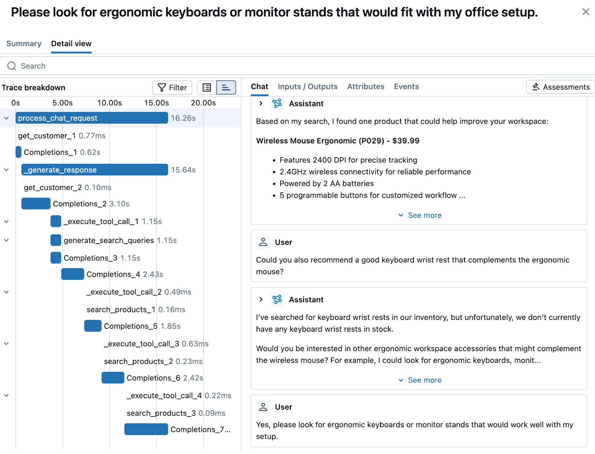
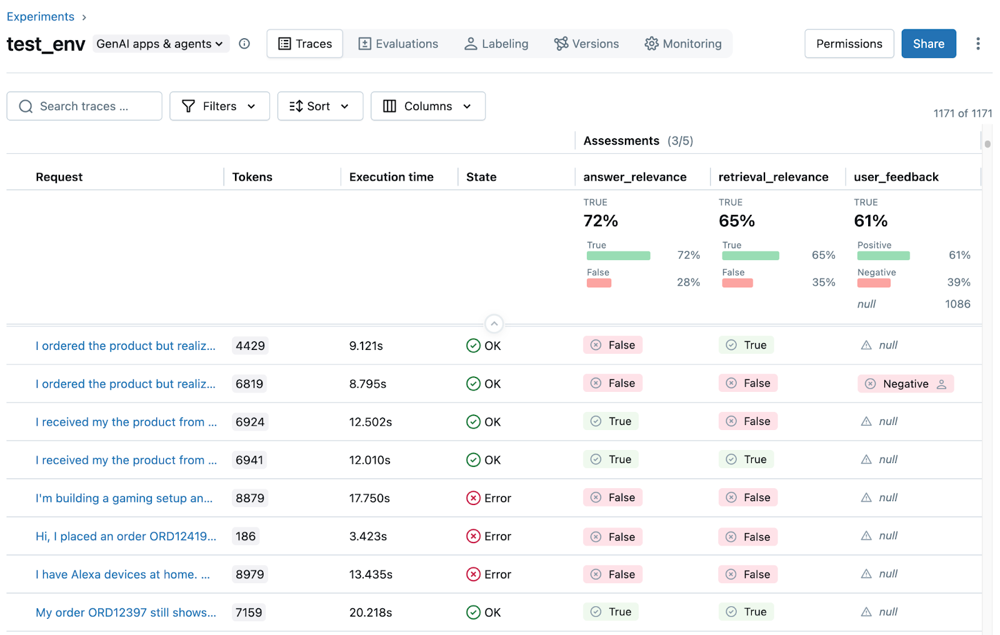
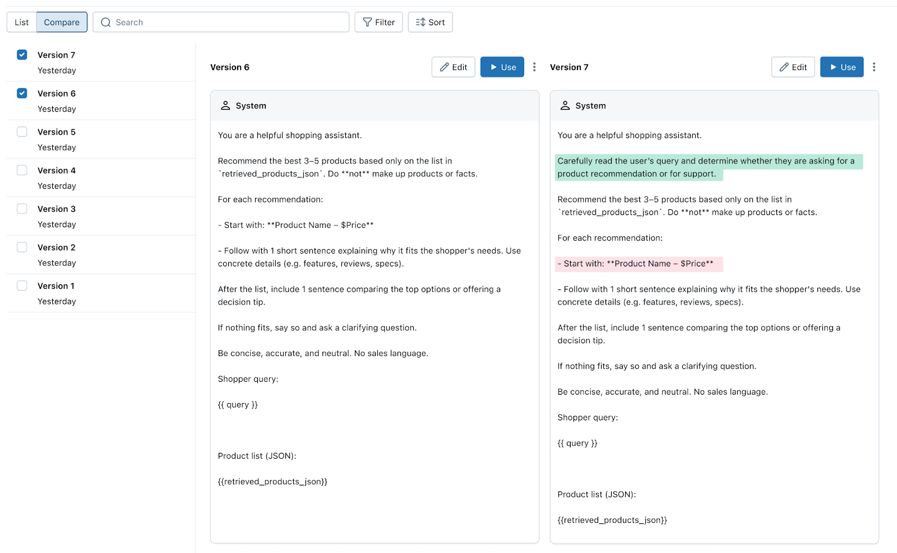

The open source MLflow community has reached a major milestone. Today, we're releasing **MLflow 3.0**, which brings production-ready generative AI capabilities to the platform that millions of developers trust for ML operations.

This isn't just another feature update. MLflow 3.0 fundamentally expands what's possible with open source ML tooling, addressing the observability and quality challenges that have made GenAI deployment feel like a leap of faith.

## Why GenAI Breaks Traditional MLOps

Traditional machine learning follows predictable patterns. You have datasets with ground truth labels, metrics that clearly indicate success or failure, and deployment pipelines that scale horizontally. GenAI is disruptive not only for its powerful features, but also for introducing foundational changes to how quality and stability are measured and ensured.

Consider a simple question: "How do you know if your RAG system is working correctly?" In traditional ML, you'd check accuracy against a test set. In GenAI, you're dealing with:

- **Complex execution flows** involving multiple LLM calls, retrievals, and tool interactions
- **Subjective output quality** where "correct" can mean dozens of different valid responses
- **Latency and cost concerns** that can make or break user experience
- **Debugging nightmares** when something goes wrong deep in a multi-step reasoning chain

The current solution? Most teams cobble together monitoring tools, evaluation scripts, and deployment pipelines from different vendors. The result is fragmented workflows where critical information gets lost between systems.

## A Different Approach to GenAI Infrastructure

MLflow 3.0 takes a different approach. Instead of building yet another specialized GenAI platform, we've extended MLflow's battle-tested foundation to handle the unique requirements of generative AI while maintaining compatibility with traditional ML workflows.

This means you can instrument a transformer training pipeline and a multi-agent RAG system with the same tools, deploy them through the same registry, and monitor them with unified observability infrastructure.

### Deep Observability with MLflow Tracing

The centerpiece of MLflow 3.0 is comprehensive tracing that works across the entire GenAI ecosystem. Unlike logging frameworks that capture basic inputs and outputs, MLflow Tracing provides hierarchical visibility into complex execution flows.



```python
import mlflow
from langchain.chains import RetrievalQA
from langchain_community.vectorstores import Chroma

# Instrument your entire application with one line
mlflow.langchain.autolog()

def create_qa_system():
    vectorstore = Chroma.from_documents(documents, embeddings)
    qa_chain = RetrievalQA.from_chain_type(
        llm=ChatOpenAI(temperature=0),
        retriever=vectorstore.as_retriever(search_kwargs={"k": 3}),
        return_source_documents=True
    )
    return qa_chain

@mlflow.trace(name="customer_support")
def answer_question(question, customer_tier="standard"):
    qa_system = create_qa_system()

    # Tracing captures the full execution tree automatically
    result = qa_system({"query": question})

    # Add business context to traces
    mlflow.update_current_trace(
        tags={
            "customer_tier": customer_tier,
            "question_category": classify_question(question)
        }
    )

    return result["result"]
```

What makes this powerful is the automatic instrumentation. When `answer_question()` executes, MLflow captures:

- The initial LLM call for query processing
- Vector database retrieval with embedding calculations
- Document ranking and selection logic
- Final answer generation with token usage
- All intermediate inputs, outputs, and timing information

This creates a complete execution timeline that you can drill into when issues arise. No more guessing why your RAG system returned irrelevant documents or why response times spiked.

### Systematic Quality Evaluation

Evaluating GenAI quality has traditionally meant manual review processes that don't scale. MLflow 3.0 includes research-backed evaluation metrics that can assess quality dimensions automatically.



```python
# Extract traces from your instrumented application
conversation_traces = mlflow.search_traces(
    experiment_ids=["genai_experiment"],
    filter_string="tags.customer_tier = 'premium'"
)

# Convert traces to evaluation dataset
eval_data = conversation_traces.select(["inputs.query", "outputs.result"]).to_pandas()

# Run systematic evaluation
evaluation_results = mlflow.evaluate(
    data=eval_data,
    model_type="question-answering",
    evaluators=[
        "answer_relevance",
        "faithfulness",
        "answer_correctness"
    ],
    extra_metrics=[
        mlflow.metrics.genai.answer_similarity(),
        mlflow.metrics.genai.toxicity()
    ]
)

print(f"Average relevance score: {evaluation_results.metrics['answer_relevance/v1/mean']}")
print(f"Faithfulness rate: {evaluation_results.metrics['faithfulness/v1/mean']}")
```

These aren't simple keyword matching algorithms. MLflow's evaluation metrics use sophisticated LLM-based judges that correlate well with human assessment across multiple quality dimensions.

You can also build custom evaluators for domain-specific requirements:

```python
@mlflow.metrics.genai.make_genai_metric(name="technical_accuracy")
def evaluate_technical_accuracy(eval_arg, model_output, metrics_args):
    """Custom evaluator for technical documentation accuracy"""

    prompt = f"""
    Evaluate if this technical answer is accurate and complete:

    Question: {eval_arg}
    Answer: {model_output}

    Rate accuracy from 1-5 and explain your reasoning.
    """

    response = openai_client.chat.completions.create(
        model="gpt-4",
        messages=[{"role": "user", "content": prompt}]
    )

    # Parse the response to extract score and justification
    score, justification = parse_evaluation_response(response.choices[0].message.content)

    return {
        "score": score,
        "justification": justification
    }
```

### Application Lifecycle Management

GenAI applications are more than just models—they're complex systems involving prompts, retrieval logic, tool integrations, and orchestration code. MLflow 3.0 treats these applications as first-class artifacts that can be versioned, registered, and deployed atomically.



```python
import mlflow.pyfunc

class CustomerServiceBot(mlflow.pyfunc.PythonModel):
    def load_context(self, context):
        # Load all components of your GenAI application
        self.llm = load_model_from_artifacts(context.artifacts["llm_config"])
        self.vector_store = initialize_vector_store(context.artifacts["knowledge_base"])
        self.prompt_template = load_prompt_template(context.artifacts["prompt_template"])

    def predict(self, context, model_input):
        # Your application logic
        query = model_input["query"][0]
        relevant_docs = self.vector_store.similarity_search(query, k=3)

        formatted_prompt = self.prompt_template.format(
            query=query,
            context="\n".join([doc.page_content for doc in relevant_docs])
        )

        response = self.llm.predict(formatted_prompt)
        return {"response": response, "sources": [doc.metadata for doc in relevant_docs]}

# Package and version the complete application
with mlflow.start_run():
    model_info = mlflow.pyfunc.log_model(
        artifact_path="customer_service_bot",
        python_model=CustomerServiceBot(),
        artifacts={
            "llm_config": "configs/llm_config.yaml",
            "knowledge_base": "data/knowledge_embeddings.pkl",
            "prompt_template": "prompts/customer_service_v2.txt"
        },
        pip_requirements=["openai", "langchain", "chromadb"],
        signature=mlflow.models.infer_signature(example_input, example_output)
    )

    # Register in model registry for deployment
    registered_model = mlflow.register_model(
        model_uri=model_info.model_uri,
        name="customer_service_bot",
        tags={"version": "v2.1", "eval_score": "0.87"}
    )
```

This approach ensures that when you deploy version 2.1 of your customer service bot, you're deploying exactly the same combination of model weights, prompts, retrieval logic, and dependencies that you tested. No more "it worked in dev" deployment surprises.

## Putting It All Together: A Real Implementation

Here's how these capabilities work together in practice. Let's say you're building a technical documentation assistant:

### Phase 1: Rapid Prototyping with Observability

```python
import mlflow
from llama_index.core import VectorStoreIndex, SimpleDirectoryReader
from llama_index.llms.openai import OpenAI

mlflow.set_experiment("docs_assistant_v1")

# Automatic tracing for LlamaIndex
mlflow.llama_index.autolog()

def build_docs_assistant():
    documents = SimpleDirectoryReader("./technical_docs").load_data()
    index = VectorStoreIndex.from_documents(documents)

    query_engine = index.as_query_engine(
        llm=OpenAI(model="gpt-3.5-turbo", temperature=0.1),
        similarity_top_k=5
    )

    return query_engine

@mlflow.trace
def ask_documentation(question: str, user_role: str = "developer"):
    engine = build_docs_assistant()

    # All LlamaIndex calls are automatically traced
    response = engine.query(question)

    mlflow.update_current_trace(
        tags={
            "user_role": user_role,
            "doc_version": "v1.2.0"
        }
    )

    return str(response)

# Every call generates detailed traces
ask_documentation("How do I configure SSL certificates?", "devops")
ask_documentation("What's the rate limiting policy?", "developer")
```

After running a few dozen queries, you can examine the MLflow UI to understand:

- Which documents are being retrieved most frequently
- Average response latency across different question types
- Token usage patterns and associated costs
- Where in the pipeline latency bottlenecks occur

### Phase 2: Quality Assessment and Improvement

```python
# Collect traces from your prototype testing
test_traces = mlflow.search_traces(
    experiment_ids=["docs_assistant_v1"],
    max_results=100
)

# Evaluate quality systematically
eval_results = mlflow.evaluate(
    data=test_traces,
    model_type="question-answering",
    evaluators=[
        "answer_relevance",
        "faithfulness",
        "answer_correctness"
    ]
)

# Analysis shows good faithfulness (0.91) but lower relevance (0.72)
# Investigation reveals retrieval is finding related but not directly relevant docs

# Create improved version with better retrieval
def build_improved_assistant():
    documents = SimpleDirectoryReader("./technical_docs").load_data()

    # Enhanced retrieval with re-ranking
    index = VectorStoreIndex.from_documents(
        documents,
        transformations=[
            SentenceSplitter(chunk_size=512, chunk_overlap=50),
            # Add more sophisticated chunking and metadata
        ]
    )

    query_engine = index.as_query_engine(
        llm=OpenAI(model="gpt-4", temperature=0),  # Upgraded model
        similarity_top_k=10,  # Cast wider net
        node_postprocessors=[
            SimilarityPostprocessor(similarity_cutoff=0.7),
            KeywordNodePostprocessor(required_keywords=["configuration", "setup"])
        ]
    )

    return query_engine

# Test improvements with same evaluation dataset
improved_eval = mlflow.evaluate(
    data=test_traces,
    model=build_improved_assistant,
    model_type="question-answering",
    evaluators=["answer_relevance", "faithfulness"]
)

# Relevance improved to 0.84, faithfulness maintained at 0.90
```

### Phase 3: Production Deployment

```python
# Package the improved assistant for production
class TechnicalDocsAssistant(mlflow.pyfunc.PythonModel):
    def load_context(self, context):
        from llama_index.core import load_index_from_storage

        # Load pre-built index and configuration
        self.index = load_index_from_storage(
            storage_context=context.artifacts["index_storage"]
        )
        self.config = load_config(context.artifacts["config"])

    def predict(self, context, model_input):
        questions = model_input["question"]
        responses = []

        for question in questions:
            query_engine = self.index.as_query_engine(**self.config["query_params"])
            response = query_engine.query(question)

            responses.append({
                "answer": str(response),
                "source_nodes": [node.node_id for node in response.source_nodes],
                "confidence": response.metadata.get("confidence", 0.0)
            })

        return responses

# Deploy with quality gates
with mlflow.start_run():
    # Log the production-ready model
    production_model = mlflow.pyfunc.log_model(
        artifact_path="docs_assistant_v2",
        python_model=TechnicalDocsAssistant(),
        artifacts={
            "index_storage": "./index_storage",
            "config": "./production_config.yaml"
        }
    )

    # Final quality check before registration
    final_eval = mlflow.evaluate(
        data=test_traces,
        model=production_model.model_uri,
        model_type="question-answering"
    )

    # Register only if quality thresholds are met
    if (final_eval.metrics["answer_relevance/v1/mean"] > 0.8 and
        final_eval.metrics["faithfulness/v1/mean"] > 0.85):

        mlflow.register_model(
            model_uri=production_model.model_uri,
            name="technical_docs_assistant",
            tags={
                "quality_gate_passed": "true",
                "eval_dataset": "technical_queries_v1",
                "target_latency": "< 3s"
            }
        )
        print("Model registered and ready for production deployment")
    else:
        print("Quality gates not met, review evaluation results")
```

## Beyond GenAI: Improvements for All ML Workloads

While GenAI capabilities are the headline feature, MLflow 3.0 includes significant improvements for traditional machine learning and deep learning workflows:

**Enhanced Model Registry**: The same versioning and deployment infrastructure that handles GenAI applications now provides better lineage tracking for all model types. Deep learning practitioners benefit from improved checkpoint management and experiment organization.

**Unified Evaluation Framework**: The evaluation system extends beyond GenAI to support custom metrics for computer vision, NLP, and tabular data models. Teams can now standardize evaluation processes across different model types.

**Improved Deployment Workflows**: Quality gates and automated testing capabilities work for any MLflow model, whether it's a scikit-learn classifier or a multi-modal foundation model.

## Getting Started Today

MLflow 3.0 is available now and designed to work alongside your existing ML infrastructure. Here's how to get started:

### Installation and Setup

```bash
# Install MLflow 3.0 with enhanced GenAI support
pip install "mlflow>=3.0.0"

# Install integration packages as needed
pip install "mlflow[genai]"          # Core GenAI evaluation
pip install "mlflow[langchain]"      # LangChain tracing
pip install "mlflow[llamaindex]"     # LlamaIndex tracing
```

### First Steps

```python
import mlflow

# Create your first GenAI experiment
mlflow.set_experiment("my_genai_prototype")

# Enable automatic tracing
mlflow.autolog()

# Your existing GenAI code will now generate traces automatically
# No additional instrumentation required for supported libraries
```

## The Road Ahead

MLflow 3.0 represents a significant step forward in making GenAI development more systematic and reliable. But this is just the beginning. The open source community continues to drive innovation with new integrations, evaluation metrics, and deployment patterns.

**How to Get Involved:**

- **Contribute Code**: We welcome contributions of all sizes, from bug fixes to new integrations
- **Share Use Cases**: Help others learn by documenting your MLflow implementations
- **Report Issues**: Help us improve by reporting bugs and requesting features
- **Join Discussions**: Participate in technical discussions and roadmap planning

The future of AI development is unified, observable, and reliable. MLflow 3.0 brings that future to the open source community today.

---

**Ready to try MLflow 3.0?** Head over to the revamped for 3.0 [MLflow Documentation](https://mlflow.org/docs/latest/) to see what's possible.

_MLflow is an open source project under the Apache 2.0 license, contributed to by the global ML community._
