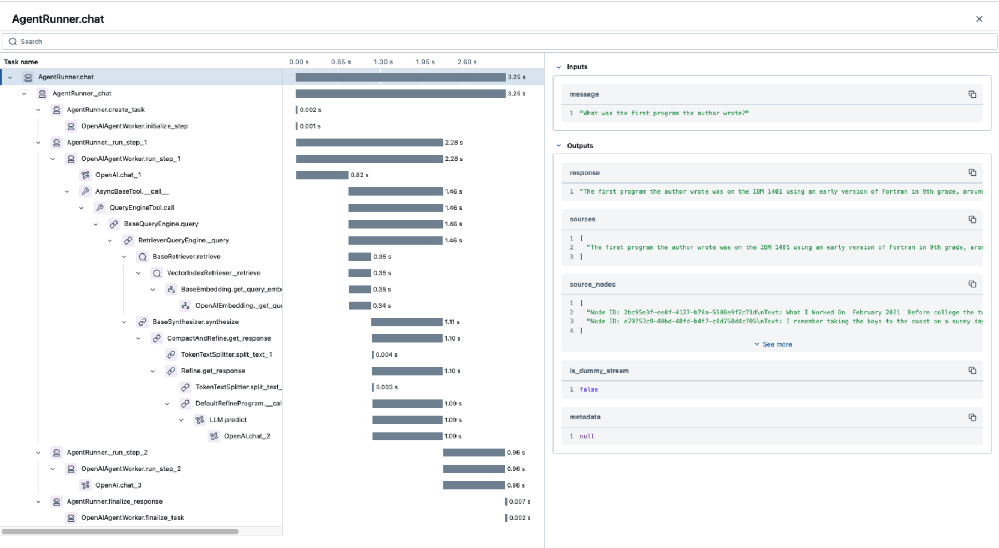

_Intro Sentence_

## Introduction to Optical Character Recognition (OCR)

## The Problem

## Iterative MLflow and Other Concepts

## Setting it Up

We require the following packages in the requirement.txt file -

```
openai
mlflow
tiktoken
aiohttp
```

which can then be installed as the required packages for this demo to work.

```bash
pip install -r requirements.txt -qU
```

Since we need to make calls to OpenAI's LLMs, we can utilize helper functions to read the OpenAI API key that is stored in a (known) secure location. We can then set the environment variable OPENAI_API_KEY.

```python
import os

def _set_openai_api_key_for_demo() -> bool:
    """Dummy method for doing easy auth in a notebook environment during the live demo."""
    try:
        with open("/XXXX/openai_api_key.txt", "r") as f: #replace this with your actual directory
            os.environ["OPENAI_API_KEY"] = f.read().strip()
            return True
    except Exception:
        pass

    return False
```

Alternatively, we can prompt the user to type in the OpenAI API key without echoing it using getpass

```python
import os
from utils import _set_openai_api_key_for_demo

if (not _set_openai_api_key_for_demo()) and (not os.getenv("OPENAI_API_KEY")):
    os.environ["OPENAI_API_KEY"] = getpass("Your OpenAI API Key: ")
```

### Explore Our Data

We are going to use the [FUNSD dataset](https://guillaumejaume.github.io/FUNSD/) for this exercise, which contains around 200 fully annotated forms, in the form of semantic entity labels and word groupings as showing in the example below:

    

All these annotations are encoded as JSON files like this (for detailed description of each entry, refer to the [original paper](https://arxiv.org/pdf/1905.13538.pdf)):

```
{
        "form": [
        {
            "id": 0,
            "text": "Registration No.",
            "box": [94,169,191,186],
            "linking": [
                [0,1]
            ],
            "label": "question",
            "words": [
                {
                    "text": "Registration",
                    "box": [94,169,168,186]
                },
                {
                    "text": "No.",
                    "box": [170,169,191,183]
                }
            ]
        },
        {
            "id": 1,
            "text": "533",
            "box": [209,169,236,182],
            "label": "answer",
            "words": [
                {
                    "box": [209,169,236,182
                    ],
                    "text": "533"
                }
            ],
            "linking": [
                [0,1]
            ]
        }
    ]
    }
```

#### 1. Observe Data

Let's try to read a random annotated file, _get_json_ can be a useful function in a utils.py file

```python
DATA_DIRECTORY = "./data" # for simplicity, a local directory
ANNOTATIONS_DIRECTORY = os.path.join(DATA_DIRECTORY, "annotations")

def _extract_qa_pairs(data: dict) -> dict:
    """Extracts question-answer pairs from OCR-style linked data."""
    qa_pairs = {}

    elements = {item["id"]: item for item in data}
    for item in data:
        if item["label"] != "question" or not item["linking"]:
            continue
        for q_id, a_id in item["linking"]:
            if q_id != item["id"]:
                continue
            answer = elements.get(a_id)
            if answer and answer["label"] == "answer":
                q_text = " ".join(w["text"] for w in item["words"])
                a_text = " ".join(w["text"] for w in answer["words"])
                qa_pairs[q_text] = a_text
    return qa_pairs

def get_json(file_name: str, directory: str = ANNOTATIONS_DIRECTORY) -> dict:
    file_name += ".json" if not file_name.endswith(".json") else file_name
    path = os.path.join(directory, file_name)
    with open(path, "r", encoding="utf-8") as f:
        contents = json.load(f)["form"]
        if isinstance(contents, list):
            if all(isinstance(page, list) for page in contents):
                flat_items = [item for page in contents for item in page]
            else:
                flat_items = contents
            return _extract_qa_pairs(flat_items)
        else:
            return _extract_qa_pairs(contents)

```

What does _\_extract_qa_pairs_ do here? Let's break down it down for a second:

- We create a lookup dictionary _qa_pairs_
- We identify "question" items that have linked answer pair(s) in the form of _(q_id, a_id)_
- Construct question-answer pairs by joining the individual words

Subsequently, we can call _get_json_ to get the OCR-identified question:: answer structure based on the form image data.

```python

from utils import get_image, get_json, get_random_files
from IPython.display import Image, display

random_file = get_random_files()
image_bytes = get_image(random_file)
get_json(random_file)

```

#### 2. Example LLM Call

Before we make a call to OpenAI, we need to set up MLflow tracking and create and experiment, which can then automatically log all the API calls we make

```python
import mlflow

mlflow.set_tracking_uri(os.getcwd() + "/mlruns")
mlflow.set_experiment("quickstart")
mlflow.openai.autolog()
```

        We set mlruns as the local directory for MLflow tracking
        We create an experiment called quickstart
        We log the API calls for metrics like etc.

On the OpenAI side, we initialize the OpenAI client and provide the prompt to the LLM (for example, instructing the LLM to act as an OCR expert).

```python
client = OpenAI()

system_prompt = """You are an expert at Optical Character Recognition (OCR). Extract the questions and answers from the image."""
base64_image = get_image(random_file, encode_as_str=True)
```

_get_image()_ can be a nice helper function that can handle

        Reading the image file from a specified path
        Resizing the file and convert it into a JPEG of a specified quality

```python
import base64
from PIL import Image
from io import BytesIO

def _compress_image(file_path: str, quality: int = 40, max_size: tuple[int, int] = (1000, 1000)) -> bytes:
    """Compresses an image by resizing and converting to JPEG with given quality."""
    with Image.open(file_path) as img:
        img = img.convert("RGB")  # Ensure JPEG compatibility
        img.thumbnail(max_size)  # Resize
        buf = BytesIO()
        img.save(buf, format="JPEG", quality=quality)
        return buf.getvalue()


def get_image(
    file_name: str, directory: str = IMAGES_DIRECTORY, encode_as_str: bool = False
) -> bytes:
    file_name += ".png" if not file_name.endswith(".png") else file_name
    path = os.path.join(directory, file_name)
    with open(path, "rb") as f:
        file = f.read()
        compressed = _compress_image(path)

        if encode_as_str:
            return base64.b64encode(compressed).decode("utf-8")
        else:
            return compressed
```

#### 3. Tracing UI

    

### Create Model and Evaluate

```python
system_prompt = """You are an expert at Optical Character Recognition (OCR). Extract the questions and answers from the image."""

def get_completion(inputs: str) -> str:
    completion = client.chat.completions.create(
        model="gpt-4o",
        messages=[
            {"role": "system", "content": system_prompt},
            {
                "role": "user",
                "content": [
                    { "type": "text", "text": "what's in this image?" },
                    {
                        "type": "image_url",
                        "image_url": {
                            "url": f"data:image/jpeg;base64,{inputs}",
                        },
                    },
                ],
            }
        ],
    )

    return completion.choices[0].message.content

with mlflow.start_run() as run:
    predicted = get_completion(images[0])
    print(predicted)

```

#### 1. Defining a custom metric for LLM evaluation

For simplicity, we define (custom) GenAI metric called _correct_format_, which returns a boolean value depending on whether the output from the LLM contains only the required keys 'question' and 'answer'

```python
correct_format = mlflow.metrics.genai.make_genai_metric(
    name="correct_format",
    definition=(
        """The answer is a list of dicts where keys are `question` and `answer`."""
    ),
    grading_prompt=(
        """If formatted correctly, return 1. Otherwise, return 0."""
    ),
    model="openai:/gpt-4o-mini",
    greater_is_better=True,
)
```

#### 2. MLflow Evaluate

In this step, we pass the defined metric to mlflow.evaluate(), which also accepts LLM completion response for every image

```python
def batch_completion(df: pd.DataFrame) -> list[str]:
    return [get_completion(image) for image in df["inputs"]]

eval_result = mlflow.evaluate(
    model=batch_completion,
    data=pd.DataFrame({"inputs": images, "truth": jsons}),
    targets="truth",
    model_type="text",
    extra_metrics=[correct_format],
)
```

#### 3. View in UI

### Prompt Registry

#### Prompt Engineer: Improve the Prompt

````python
new_template = """\
You are an expert at key information extraction and OCR.

Format as a list of dictionaries as shown below. They keys should only be `question` and `answer`.

```\
[
    {
        "question": "question field",
        "answer": "answer to question field"

    },
...
]
```\

Question refers to a field in the form that takes in information. Answer refers to the information
that is filled in the field.

Follow these rules:
- Only use the information present in the text.
{{ additional_rules }}
"""
````

```python
# Register a new version of an existing prompt
updated_prompt = mlflow.register_prompt(
    name="ocr-question-answer",
    template=new_template,
    version_metadata={
        "author": "author@example.com",
    },
)

```

#### ML Engineer: Use the Prompt

```python
prompt = mlflow.load_prompt("prompts:/ocr-question-answer/latest")


def get_completion(inputs: str) -> str:
    completion = client.chat.completions.create(
        model="gpt-4o",
        messages=[
            {
                "role": "system",
                "content": prompt.format( # Add system prompt here
                    additional_rules="Use exact formatting you see in the form."
                )
            },
            {
                "role": "user",
                "content": [
                    { "type": "text", "text": "what's in this image?" },
                    {
                        "type": "image_url",
                        "image_url": {
                            "url": f"data:image/jpeg;base64,{inputs}",
                        },
                    },
                ],
            }
        ],
    )

    return completion.choices[0].message.content

with mlflow.start_run() as run:
    predicted = get_completion(images[0])
    print(predicted)
```

## Configuration and Customization

## Conclusion and Next Steps

Adding information about Agents here tomorrow

## Further Reading
