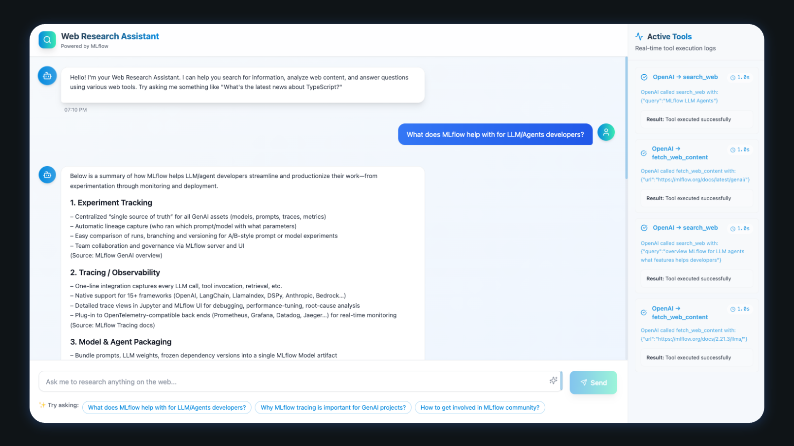

<br />

The era of AI-powered web applications is here, and TypeScript has emerged as the go-to language for building full-stack AI systems for web developers.

Today, we're thrilled to introduce the **MLflow TypeScript SDK**, bringing the industry-leading observability capabilities of [MLflow](https://mlflow.org/) directly to your TypeScript and JavaScript applications.

## MLflow TypeScript SDK

The TypeScript SDK brings automatic tracing that instruments your LLM calls with zero configuration, along with manual instrumentation capabilities for adding custom spans to complex workflows. You get rich observability to visualize execution flows, latency, and token usage, plus human feedback collection to capture user ratings.

Quick Links:

- 📦 [NPM Package](https://www.npmjs.com/package/mlflow-tracing)
- 💻 [Github Repo](https://github.com/mlflow/mlflow)
- 📚 [Quickstart Guide](https://mlflow.org/docs/latest/genai/tracing/quickstart/typescript-openai.html)

<br/>

The following code snippet shows how to use the MLflow TypeScript SDK to trace a simple function:

```typescript
import * as mlflow from "mlflow-tracing";

// Connect to your MLflow server
mlflow.init({
  trackingUri: "http://localhost:5000",
  experimentId: "<your-experiment-id>",
});

// Create a simple traced function
const getWeather = mlflow.trace(
  (city: string) => {
    return `The weather in ${city} is sunny`;
  },
  { name: "get-weather" },
);

// Call it - MLflow automatically captures inputs, outputs, and latency
getWeather("San Francisco");
```

## Try the Interactive Demo

Want to see the SDK in action? We've created a complete demo application that showcases MLflow TypeScript SDK with a real OpenAI chatbot.

**🚀 [Run the Demo](https://github.com/mlflow/mlflow-typescript-demo)**

The demo includes a complete Next.js chat interface with automatic OpenAI tracing. Try it out by cloning the repository and running:

```bash
git clone https://github.com/B-Step62/mlflow-typescript-tracing-demo-apps
cd mlflow-typescript-tracing-demo-apps/full-stack
npm run install:all
npm run chatbot
```

This will prompt you to enter required configurations and start the chatbot application at `http://localhost:5173`.



Once the application is running, you can start asking question to the chatbot. Then navigate to the MLflow UI to see the traces.


## How It Works

The MLflow TypeScript SDK is built on a robust architecture that provides seamless observability for your AI applications. Here's how the pieces fit together:

### OpenTelemetry Foundation

At its core, MLflow TypeScript SDK leverages [OpenTelemetry](https://opentelemetry.io/), the industry-standard observability framework. This means your traces use widely-adopted standard protocols, giving you vendor flexibility to export to any OpenTelemetry-compatible platform. You can integrate seamlessly with your existing monitoring infrastructure through the rich ecosystem, and the solution is future-proof since it's built on stable, evolving standards.

### MLflow Tracking Server

The SDK connects to an MLflow Tracking Server, which you can run as a self-hosted solution locally or on your own infrastructure, use Databricks' managed MLflow service, or connect to any remote MLflow deployment.

To start a local tracking server:

```bash
pip install mlflow
mlflow ui --port 5000 --backend-store-uri sqlite:///mlflow.db
```

:::info
If you don't want to manage the tracking server yourself, you can use the [cloud-hosted MLflow service on Databricks](https://mlflow.org/#get-started), or any other cloud provides that offer managed MLflow service like [AWS](https://aws.amazon.com/sagemaker-ai/experiments/), [AzureML](https://learn.microsoft.com/en-us/azure/machine-learning/concept-mlflow?view=azureml-api-2), [Nebius](https://nebius.com/services/managed-mlflow), etc.
:::

### Automatic Tracing for OpenAI

The easiest way to instrument your AI application is with [automatic tracing for OpenAI](https://mlflow.org/docs/latest/genai/tracing/integrations/listing/openai.html):

```typescript
import { OpenAI } from "openai";
import { tracedOpenAI } from "mlflow-tracing-openai";

// Wrap your OpenAI client
const client = tracedOpenAI(new OpenAI());

// Every call is automatically traced
const response = await client.chat.completions.create({
  model: "gpt-4o-mini",
  messages: [
    { role: "system", content: "You are a helpful assistant." },
    { role: "user", content: "What's the weather like?" },
  ],
});
```

MLflow automatically captures input messages and parameters, response content and metadata, token usage and costs, latency and performance metrics, plus error handling and exceptions.

### Manual Tracing for Custom Functions

For custom business logic, use manual instrumentation. MLflow provides different ways to trace your own code:

```typescript
import * as mlflow from "mlflow-tracing";

// Trace any function with a decorator
const processUserQuery = mlflow.trace(
  async (query: string, context: string[]) => {
    // Your custom logic here
    const processedQuery = await preprocessQuery(query);
    const relevantContext = await filterContext(context, processedQuery);
    return { processedQuery, relevantContext };
  },
  {
    name: "process-user-query",
    spanType: mlflow.SpanType.CHAIN,
  },
);

// Or use the withSpan() wrapper to trace any block of code
const result = await mlflow.withSpan(
  async () => {
    // Complex workflow logic
    const step1 = await performAnalysis();
    const step2 = await generateResponse(step1);
    return step2;
  },
  { name: "complex-workflow" },
);
```

### Reviewing Results in MLflow UI

Once your application is instrumented, you can explore traces in the MLflow UI. The trace view provides a timeline view to see execution flow and identify bottlenecks, detailed span inspection for inputs, outputs, and metadata.


## Advanced Features

Once you have basic tracing working, MLflow offers powerful advanced capabilities to improve and monitor your AI applications.

### Systematic Quality Assessment with MLflow GenAI Evaluation

Traces serve as rich datasets for evaluation. MLflow's evaluation framework can automatically assess your application's performance:

```python
# Python evaluation script
import mlflow
from mlflow.genai.scorers import Guidelines, Ret

# Load traces from your TypeScript application
traces = mlflow.search_traces(experiment_id="your-experiment-id")

# Define evaluation criteria

# Define evaluation scorers
scorers = [
    Guidelines(
        name="faithfulness",
        guidelines="The response should be faithful to the user's question."
    ),
    Guidelines(
        name="same_language",
        guidelines="Response must be in the same language as the input"
    ),
    Safety(),  # Built-in safety scorer
]


# Evaluate traces from your TypeScript application
results = mlflow.genai.evaluate(
    data=traces,
    scorers=scorers
)

# Check the results on Mlflow UI
```

This systematic approach helps you identify quality issues by spotting problematic responses automatically, track improvements by monitoring quality metrics over time, conduct A/B testing to compare different model configurations, and detect regressions by catching quality degradation early.

### Human Feedback Collection

Real user feedback is invaluable for improving AI applications. MLflow provides a [human feedback collection feature](https://mlflow.org/docs/latest/genai/tracing/concepts/feedback/) to collect user ratings and annotations.

Singe MLflow provides both UI and programmatic ways to collect human feedback, you can also collect end user feedbacks directly from your application and send it to MLflow for analysis or monitoring.

### Production Monitoring

MLflow Tracing offers comprehensive observability for your production applications, supporting the iterative process of continuous improvement while ensuring quality delivery to users.

While Tracing itself provides essential observability for your production applications, if you are using managed MLflow service on Databricks, you can also use its [production monitoring](https://docs.databricks.com/aws/en/mlflow3/genai/eval-monitor/run-scorer-in-prod#step-2-enable-monitoring) integration to continuously track your deployed app's performance and quality:

- Automatically assess quality using the same scorers as development
- Track operational metrics (latency, cost, errors)
- Identify underperforming queries to create evaluation datasets

## Conclusion

The MLflow TypeScript SDK represents a major step forward for TypeScript and JavaScript developers building AI applications. With automatic tracing, rich observability, human feedback collection, and seamless production monitoring, you now have all the tools needed to build reliable, high-quality AI systems.

The key benefits include zero-configuration tracing for popular LLM providers, production-ready observability built on OpenTelemetry standards, seamless integration with your existing TypeScript/JavaScript stack, a rich ecosystem of monitoring and evaluation tools, and open source availability with enterprise support.

## Getting Started

Ready to get started? Here are the essential resources to begin your journey with MLflow TypeScript SDK:

- 🚀 [MLflow Typescript SDK Quickstart](https://mlflow.org/docs/latest/genai/tracing/quickstart/typescript-openai.html)
- 📚 [MLflow Tracing Documentation](https://mlflow.org/docs/latest/genai/tracing/index.html)
- 💻 [Visit Github Repository](https://github.com/mlflow/mlflow)
