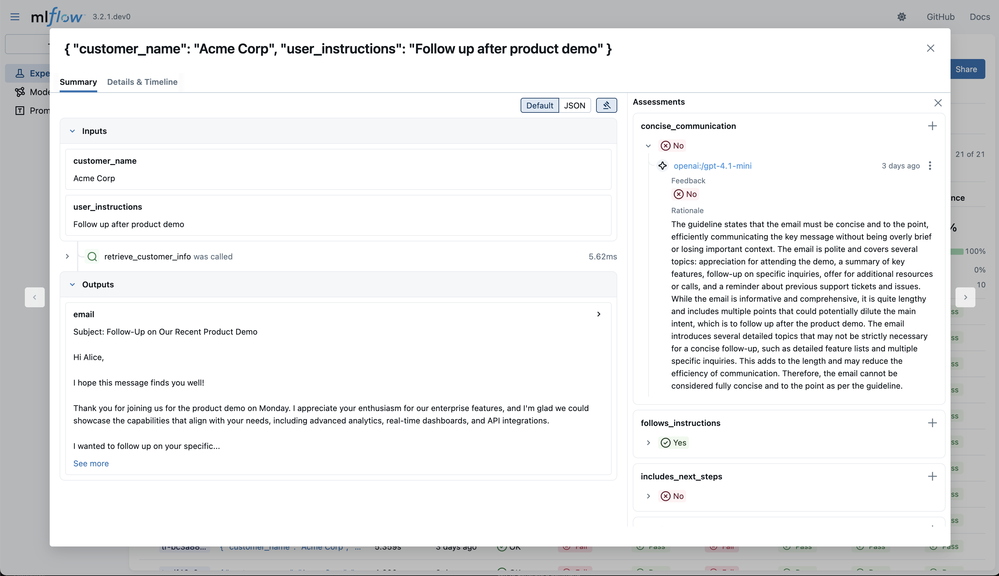

# Assessment-focused UIs in MLflow 3.3

In MLflow 3.2, we introduced the concept of [assessments](https://mlflow.org/docs/latest/genai/assessments/feedback/), which are the quality evaluations and trace annotations that are crucial for understanding and improving your AI applications. With the MLflow 3.3 update, we've made a number of changes to the UI to make it easier to visualize and manage your assessments, in order to better support the GenAI evaluation workflow.

## What's New: Assessment-First Design for tracing UIs

The tracing UIs have been redesigned, bringing assessments to the forefront and making it easier than ever to create, view, and manage assessments across your entire application lifecycle.

### Key Features

#### 1. Trace viewer: Support for CRUD Operations (released in MLflow 3.2)

The trace viewer now contains a side-panel for managing assessments directly from the UI:

- **Create assessments** directly within the trace detail view
- **Read and review** all assessments associated with a trace at a glance
- **Update existing assessments** to refine evaluations or correct mistakes
- **Delete assessments** when they're no longer relevant

This side-panel approach allows you to conveniently create ad-hoc trace annotations, and also to review and correct assessments that have been created by other users or LLM judges.

#### 2. Redesigned Traces Tab (released in MLflow 3.3)

The Traces tab within MLflow experiments has been updated to visualize assessments at the top level, making it easier to spot patterns, identify outliers, and monitor quality trends without diving into individual traces.

- **Assessment columns** showing key evaluation metrics directly in the trace list
- **Visual indicators** for assessment status and quality scores
- **Filtering and sorting** by assessment values, date ranges, and more attributes

With assessments now prominently displayed in the Traces tab, production monitoring becomes significantly more effective. You can quickly identify traces with poor quality scores, and spot systematic issues affecting your app's responses.

## Getting Started

The new assessment features will be available in MLflow 3.3, and if you'd like an early preview, you can install the [MLflow 3.3.0rc0](https://mlflow.org/releases/3.3.0rc0) release candidate. If you're already using MLflow's tracing capabilities, the enhanced UI will automatically display any existing assessments you've logged.

To start leveraging these new capabilities:

1. **Upgrade to MLflow 3.3** and access the enhanced Traces tab in your experiments
2. **Open the trace viewer** by clicking on any trace in the trace detail view
3. **Create your first assessment** using the assessments panel, no code required!

For more in-depth tutorials on running evaluations with LLM judges, keep an eye out for upcoming documentation updates!

---

_Learn more about MLflow's assessment capabilities in our [documentation](https://mlflow.org/docs/latest/genai/assessments/feedback/), or explore the [MLflow GitHub repository](https://github.com/mlflow/mlflow) to see what's coming next._
