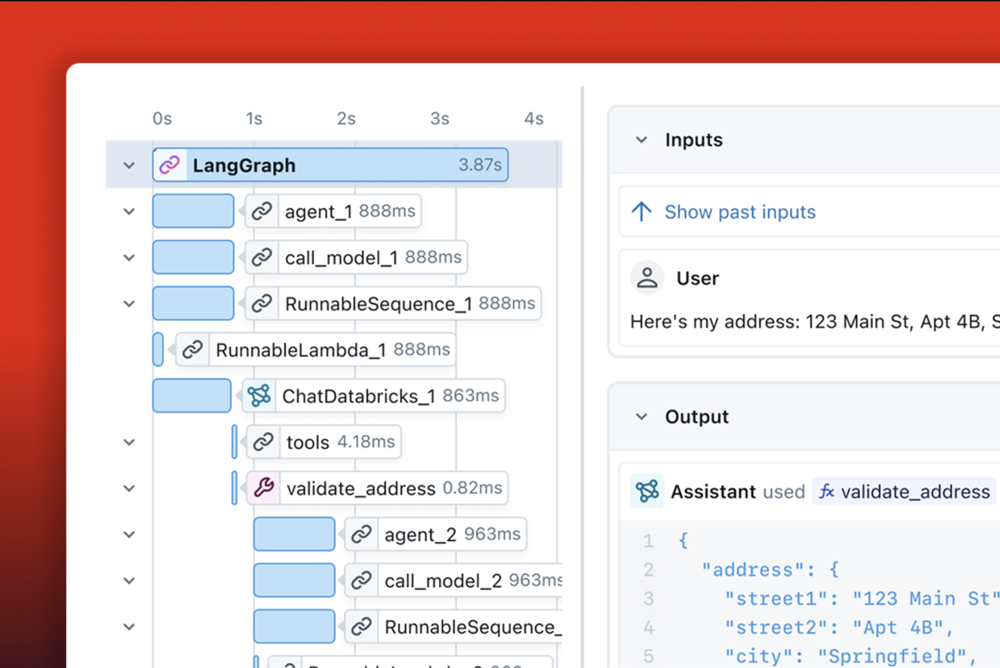
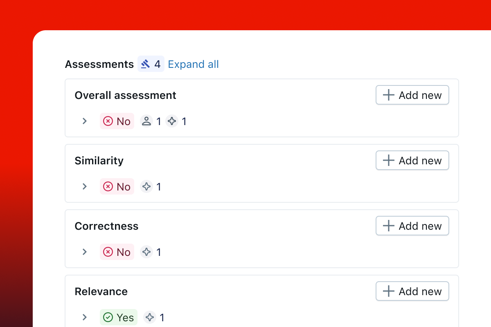

import Tabs from "@theme/Tabs";
import TabItem from "@theme/TabItem";

If you've tried evaluating GenAI applications, you know generic LLM judges are not enough. Your customer support bot needs to be evaluated on empathy and problem resolution. Your code generator needs to be checked for security vulnerabilities. Your medical advisor needs domain-specific accuracy checks. At the same time, translating these requirements into custom LLM judges is non-trivial. The judge has to focus on the right parts of the evaluated GenAI trace, and its prompt needs to be tuned to capture the nuances and preferences of human experts. This requires significant effort and often results in suboptimal judges, which eventually detracts from the main goal of building an effective GenAI application.

In the MLflow 3.4 release, we introduce the `make_judge` method as a powerful new API to create [MLflow Scorers](https://mlflow.org/docs/latest/genai/eval-monitor/), which are the framework's core abstraction for automated evaluation. The API enables you to create scorers in a declarative manner using simple instructions. With `make_judge`, you can easily build judges that understand your domain-specific quality requirements and automatically align with feedback from human experts.

This post demonstrates the power of MLflow Scorers by showing how to:

- Create custom scorers with `make_judge` using simple declarative instructions
- Build scorers that act as agents with built-in tools for trace introspection, enabling complex evaluation tasks without complicated prompts or complex span parsing logic
- Automatically align scorers with subject-matter expert preferences to improve scorer accuracy over time

To illustrate the power of the new API, we will build a customer support quality scorer, show how it can evaluate complex agent behaviors, and demonstrate how human feedback makes it more effective. The built-in scorers MLflow provides are just pre-defined versions using these same capabilities. Once you understand this, you'll see how flexible and powerful MLflow's evaluation framework really is.

## Creating Your First Scorer: A Customer Support Evaluator

Let's start with a practical example. Say you're building a customer support chatbot. You need a scorer that evaluates whether responses are actually helpful—not just grammatically correct.

First, install the latest version of MLflow:

```shell
pip install -U mlflow
```

Now let's create a scorer that understands what makes a good support response:

```python
from mlflow.genai.judges import make_judge

# Create a scorer for customer support quality
support_scorer = make_judge(
    name="support_quality",
    instructions=(
        "Evaluate if the response in {{ outputs }} shows appropriate empathy "
        "for the customer issue in {{ inputs }}.\n\n"
        "Check if the response acknowledges the customer's frustration and "
        "responds with understanding and care.\n"
        "Rate as: 'empathetic' or 'not empathetic'"
    ),
    model="openai:/gpt-4o"
)
```

The key here is that we're defining a scorer using simple declarative instructions that describe _what_ to evaluate, not _how_ to evaluate it. You don't need complex scoring functions or regex patterns. Just describe what you're looking for. This scorer is now a reusable evaluation component that works anywhere in MLflow's ecosystem.

Let's see how our scorer handles a terrible support response:

```python
# Test the scorer on a support interaction
result = support_scorer(
    inputs={"issue": "Can't reset my password"},
    outputs={"response": "Have you tried turning it off and on again?"}
)

print(f"Rating: {result.value}")
print(f"Reasoning: {result.rationale}")
```

Output:

```
Rating: not empathetic
Reasoning: The response completely ignores the customer's frustration with
the password reset issue and provides an irrelevant, dismissive suggestion
that shows no understanding of their problem...
```

The scorer we just created can be directly plugged into `mlflow.genai.evaluate()` to scale evaluations to entire datasets or monitoring APIs to apply scorers on production traffic:

```python
import mlflow
import pandas as pd

# Your support conversations dataset
test_data = pd.DataFrame([
    {
        "inputs": {"issue": "Billing error - charged twice"},
        "outputs": {"response": "I'll immediately refund the duplicate charge."}
    },
    {
        "inputs": {"issue": "Feature request for dark mode"},
        "outputs": {"response": "Great suggestion! I've forwarded this to our product team."}
    }
])

# Run evaluation with your custom scorer
results = mlflow.genai.evaluate(
    data=test_data,
    scorers=[support_scorer]
)

# View results
print(results.tables["eval_results_table"])
```

## Scorers as Agents: Trace-Based Evaluation

So far our scorer has evaluated simple question-answer pairs. But MLflow Scorers can act agentically to analyze complex AI agents that make multiple LLM calls, use tools, and follow reasoning chains.



### Why We Call Them "Agentic"

Without `make_judge`, implementing a comprehensive trace evaluator would require significant effort. You would need to:

1. Write code to extract different parts of the trace (tool calls, LLM interactions, error handling)
2. Create separate prompts to evaluate each criterion (Are the tool calls reasonable? Any issues in the trajectory? Are errors handled well?)
3. Develop logic to combine these signals into a final assessment
4. Implement more complex reasoning strategies for nuanced evaluation

Instead, `make_judge` provides built-in tools for trace introspection and implements a reasoning loop to evaluate your declarative quality criteria. This lets you focus on _what_ to evaluate rather than _how_ to implement the evaluation.

### A Real-World Example: Customer Support Agent

Let's evaluate a more complex customer support agent that uses multiple tools to resolve issues:

```python
# Example: A customer support agent handling a refund request
import mlflow
from mlflow.genai.judges import make_judge

# Create a comprehensive agent evaluator
agent_scorer = make_judge(
    name="support_agent_quality",
    instructions=(
        "Analyze the {{ trace }} for a customer support interaction.\n\n"
        "Evaluate the following:\n"
        "1. Did the agent use the correct tools (search_orders, process_refund)?\n"
        "2. Were authentication steps properly followed?\n"
        "3. Was the customer kept informed throughout the process?\n"
        "4. Were any errors handled gracefully?\n\n"
        "Rate as: 'excellent', 'satisfactory', or 'needs_improvement'"
    ),
    model="openai:/gpt-4o"
)

# Simulate a complex agent execution with multiple tool calls
with mlflow.start_span("handle_refund_request") as main_span:
    with mlflow.start_span("search_customer_orders"):
        # Agent searches for customer orders
        orders = search_orders(customer_id="12345")
        mlflow.log_input({"customer_id": "12345"})
        mlflow.log_output({"orders_found": 3})

    with mlflow.start_span("verify_refund_eligibility"):
        # Agent verifies refund eligibility
        eligible = check_refund_policy(order_id="ORD-789")
        mlflow.log_output({"eligible": True, "reason": "Within 30-day window"})

    with mlflow.start_span("process_refund"):
        # Agent processes the refund
        refund_result = process_refund(order_id="ORD-789", amount=99.99)
        mlflow.log_output({"status": "success", "refund_id": "REF-123"})

    with mlflow.start_span("notify_customer"):
        # Agent sends confirmation to customer
        notification_sent = send_email(
            to="customer@example.com",
            subject="Refund Processed",
            body="Your refund of $99.99 has been processed..."
        )
        mlflow.log_output({"notification_sent": True})

    trace_id = main_span.trace_id

# The scorer analyzes the entire trace
trace = mlflow.get_trace(trace_id)
evaluation = agent_scorer(trace=trace)

print(f"Agent Performance: {evaluation.value}")
print(f"Analysis: {evaluation.rationale}")
```

Output:

```
Agent Performance: excellent
Analysis: The agent followed all required procedures correctly:
1. Properly searched for customer orders before processing
2. Verified refund eligibility according to policy
3. Successfully processed the refund with correct amount
4. Notified the customer of the completion
All tool calls were necessary and executed in the optimal order.
```

## The Game Changer: Human Feedback Alignment

Here's where things get interesting. What happens when your scorer disagrees with your human experts? Instead of rewriting prompts endlessly, MLflow Scorers can learn from human corrections.

### Step 1: Collect Human Feedback

You can provide feedback either through the MLflow Trace UI or programmatically:

#### Option A: Using the Trace UI

Navigate to your MLflow tracking server and use the feedback interface directly on traced executions. This is ideal for subject matter experts who prefer a visual interface.



#### Option B: Programmatic Feedback

```python
from mlflow.entities import AssessmentSource, AssessmentSourceType

# Search for traces from production or development environments
production_traces = mlflow.search_traces(
    experiment_ids=[experiment_id],
    filter_string="attributes.environment = 'production'",
    max_results=100
)

# Provide human feedback on specific traces
for trace in production_traces:
    # Your expert reviews the trace and provides assessment
    mlflow.log_feedback(
        trace_id=trace.info.trace_id,
        name="support_quality",  # Must match scorer name
        value="empathetic",      # Expert's assessment
        source=AssessmentSource(
            source_type=AssessmentSourceType.HUMAN,
            source_id="support_expert"
        )
    )
```

### Step 2: Align Your Scorer with Expert Feedback

Once you have collected feedback (minimum 10 examples recommended), you can align your scorer:

```python
# Gather traces with human feedback
traces_with_feedback = mlflow.search_traces(
    experiment_ids=[experiment_id],
    return_type="list"
)

# Create an aligned scorer that learns from expert preferences
aligned_scorer = support_scorer.align(
    traces=traces_with_feedback
)

# Use the aligned scorer in your evaluation pipeline
results = mlflow.genai.evaluate(
    data=test_data,
    scorers=[aligned_scorer]  # Now uses expert-aligned scoring
)

print(f"Alignment improved accuracy by: {results.metrics['alignment_improvement']}%")
```

#### Pluggable Optimization Framework

MLflow's alignment implementation is designed to be extensible. While the current release includes a built-in SIMBA optimizer from DSPy, the architecture supports custom alignment optimizers through the `AlignmentOptimizer` abstract base class:

```python
# Use the default SIMBA optimizer
aligned_scorer = support_scorer.align(traces=traces_with_feedback)

# Or provide your own custom optimizer
from mlflow.genai.judges.base import AlignmentOptimizer

class CustomOptimizer(AlignmentOptimizer):
    def align(self, judge, traces):
        # Your optimization logic here
        return optimized_judge

custom_optimizer = CustomOptimizer()
aligned_scorer = support_scorer.align(
    traces=traces_with_feedback,
    optimizer=custom_optimizer
)
```

This pluggable design means you can leverage external optimization frameworks or implement domain-specific alignment strategies while maintaining compatibility with MLflow's evaluation ecosystem.

In practice, aligned scorers achieve 30-50% reduction in evaluation errors compared to generic prompts. The more feedback you provide, the better they get at matching your team's quality standards.

## Conclusion

The new `make_judge` API transforms how you build and maintain LLM judges for GenAI applications. We've shown how this declarative approach eliminates the manual effort traditionally required for creating domain-specific evaluators.

The key takeaways are:

- **Declarative over imperative**: Define _what_ to evaluate with simple instructions, not _how_ to implement the evaluation
- **Agentic capabilities built-in**: Scorers come with tools for trace introspection, eliminating the need for complex extraction and evaluation logic
- **Automatic alignment with experts**: Scorers learn from subject-matter expert feedback, achieving 30-50% reduction in evaluation errors
- **Seamless integration**: Works directly with `mlflow.genai.evaluate()` for dataset evaluation and production monitoring

The built-in scorers MLflow provides are simply pre-defined versions using these same capabilities. Once you understand this, creating domain-specific evaluators becomes straightforward. You can have a working custom scorer in minutes that automatically improves as it learns from your team's expertise.

### Next Steps

- Explore the [MLflow Evaluation and Monitoring framework](https://mlflow.org/docs/latest/genai/eval-monitor/) for the complete evaluation ecosystem
- Read the [make_judge documentation](https://mlflow.org/docs/latest/genai/eval-monitor/scorers/llm-judge/make-judge.html) for advanced scorer features
- Learn about [built-in scorers](https://mlflow.org/docs/latest/genai/eval-monitor/scorers/index.html) available out of the box
- See how to create [evaluation datasets](https://mlflow.org/docs/latest/genai/eval-monitor/datasets/index.html) for systematic testing
