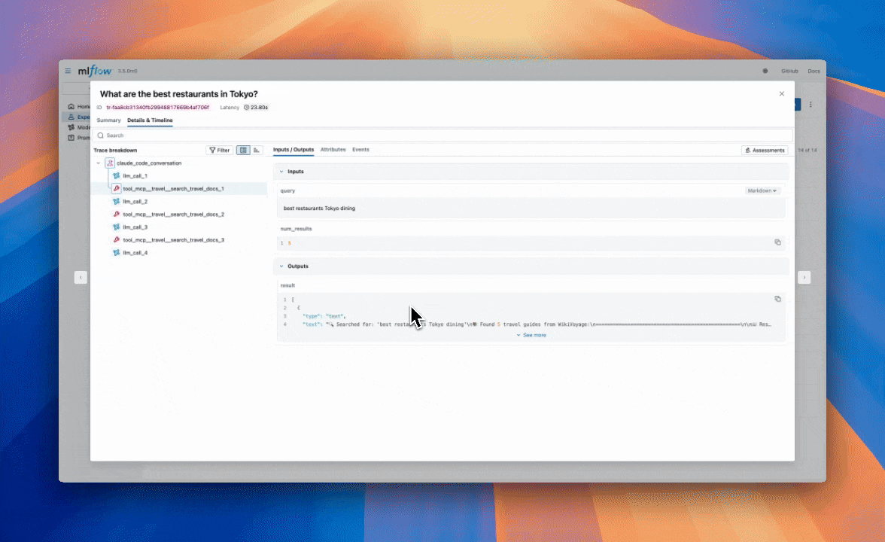
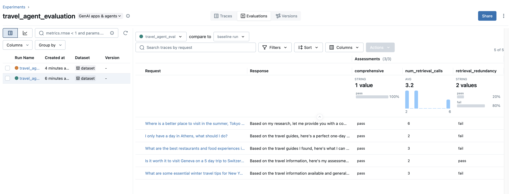
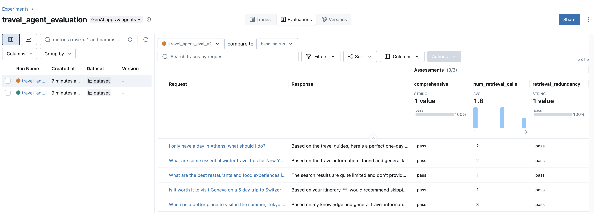

Building agentic applications is complex, but it doesn't have to take weeks or months. In this blog, we'll show you how to prototype an agent using the Claude Agent SDK then instrument and evaluate it with MLflow, going from idea to measurable results in hours, not weeks or months.

## The Infrastructure Problem

Building an agent from scratch means heavy infrastructure work before you can test your core idea. In addition to writing agent logic, you're building workflow orchestration, tool connectors, and data pipelines. This delays answering the critical question: does your agent actually solve your core business problem?

Recently, many companies have released their own coding agents like Claude Code, Codex, and Gemini CLI. While these are primarily developer tools that provide automated experiences for tasks like debugging and refactoring, they contain the building blocks for powerful agent frameworks. Anthropic's Claude Agent SDK takes this further, offering the same underlying framework as Claude Code in a production-ready SDK you can integrate directly into your applications.

## Why Observability and Evaluation Matters

Whichever framework you choose, observability and evaluations are still crucial to ensure your agent is production-ready. Without tracing, your agent is a black box that is difficult to debug and reason about. Without systematic evaluation, you can't measure improvements, catch regressions, or understand where your agent succeeds and fails. These capabilities must be built in from day one.

In this blog, we'll prototype a travel agent with the Claude Agent SDK and use MLflow's automatic tracing and evaluation suite to understand and improve its behavior.

## Requirements

- `claude-agent-sdk >= 0.1.0`
- `mlflow >= 3.5.0`

## Agent Creation

Imagine you're running a travel agency where your team spends hours searching flight options and travel documentation for clients. An AI agent could automate this research, but you don't want to spend months building infrastructure before validating the idea. Let's see how quickly we can prototype a travel agent.

Here is the structure of our prototype travel agent:

```
travel-agent-prototype/
├── run_agent.py           # Driver code for running the agent
└── tools/                 # CLI wrappers for your APIs
     ├── __init__.py
     ├── docs.py           # Travel document search tool
     ├── flights.py        # Flight search tool
     └── server.py         # MCP server for the tools
```

Let's walk through what goes in each of these files.

## Running your Agent

In the following section, we define the driver code for your agent (`run_agent.py`). First, we will define the `ClaudeCodeOptions` object which specifies various useful options, including allowed and disallowed tools, the maximum number of turns, environment variables, and much more.

```python
from pathlib import Path

from claude_agent_sdk import ClaudeAgentOptions
from tools import travel_mcp_server

TRAVEL_AGENT_OPTIONS = ClaudeAgentOptions(
    mcp_servers={"travel": travel_mcp_server},
    allowed_tools=[
        "mcp__travel__search_flights",
        "mcp__travel__search_travel_docs",
    ],
    system_prompt=TRAVEL_AGENT_SYSTEM_PROMPT,
    cwd=str(Path.cwd()),
    max_turns=10,
)
```

You may notice that we didn't define the system prompt yet. Your system prompt is where you will define the behavior of your agent as well as what tools it has access to and how the agent should use them. You can have Claude write this, but you should be judicious about what goes in here as it determines the behavior of your agent.

```python
TRAVEL_AGENT_SYSTEM_PROMPT = """
# Travel Agent Assistant

You are a travel agent assistant with access to flight search and travel documentation tools.

## Execution Flow
1. Determine user intent: flight search or travel information lookup
2. For flight searches, use the `search_flights` tool with origin, destination, dates, and preferences
3. For travel information, use the `search_travel_docs` tool to extract relevant information about destinations, activities, logistics
4. Combine both capabilities when planning complete trips

## Success Criteria
Present the user with clear, relevant, specific, and actionable advice. Cover all aspects of their travel (e.g., logistics, activities, local inisghts, etc.) and present them with tradeoffs of any choices they need to make.
"""
```

Once we have our options set up, we can run our agent using the following:

```python
from claude_agent_sdk import ClaudeSDKClient

async def run_travel_agent(query: str) -> str:
    messages = []
    async with ClaudeSDKClient(options=TRAVEL_AGENT_OPTIONS) as client:
        await client.query(query)
  
        async for message in client.receive_response():
            messages.append(message)

    return messages[-1].result  # Return the final output
```

### How should I implement my tools?

In the example above, we have implemented our tools in Python and created an in-process MCP server. The following is the code for `tools/server.py`:

```python
from claude_agent_sdk import create_sdk_mcp_server

from .docs import search_travel_docs
from .flights import search_flights

travel_mcp_server = create_sdk_mcp_server(
    name="travel",
    version="1.0.0",
    tools=[search_flights, search_travel_docs],
)
```

As an example, here's the signature of search_travel_docs which goes in tools/docs.py:

```python
from claude_agent_sdk import tool

@tool(
    "search_travel_docs",
    "Search travel documentation and guides",
    {
        "query": str,
        "num_results": int,
    },
)
async def search_travel_docs(args):
    pass
```

You can put anything in these functions! In this instance, our search flights tool connects to a third-party flight search API and the travel documentation tool utilizes a remote vector store.

You are also not limited to using a MCP server - implementing your tools within a CLI is a great way to limit the amount of context your agent has to contend with until it requires the tool.

## Tracing the Agent

Now that we have a powerful agent created, we probably want to understand what's happening under the hood. MLflow can automatically trace Claude Code, logging the inputs, outputs, and metadata of every step that Claude Code takes. This is crucial for pinpointing the source of bugs and unexpected behaviors.

We can enable automatic tracing with a simple one liner:

```python
import mlflow

@mlflow.anthropic.autolog()

# Define ClaudeSDKClient after this...
```

Once you have autotracing set up, invocations of claude should result in new traces flowing into your experiment. You can configure your experiment or the tracking store using `mlflow.set_experiment` and `mlflow.set_tracking_uri`, respectively. 


As we were going through some of the traces, we noticed that our agent tends to have redundant retrieval steps.



In the next section, we’re going to discuss how we can use MLflow evaluations to confidently iterate on our agent to resolve these issues.

## Running Evaluations

Building an agentic system is just the first step. To ensure your travel agent performs reliably in production, you need systematic evaluation. Without structured testing, you can't measure improvements, catch regressions, or understand where your agent succeeds and fails. Now that we have tracing for Claude Code, running evaluations is really easy with `mlflow.genai.evaluate`:

```python
mlflow.genai.evaluate(
    predict_fn=...,
    data=...,
    scorers=...,
)
```

We'll talk about what goes in each of these parameters in the following sections.

### What goes in `predict_fn`?

The predict function is the code that runs your agent and produces a trace to evaluate. Here's a `predict_fn` for our working travel agent example: 

```python
def run_travel_agent_with_timeout(query: str, timeout: int = 300) -> str:
    async def run_with_timeout():
        return await asyncio.wait_for(run_travel_agent(query), timeout=timeout)

    return asyncio.run(run_with_timeout())
```

### What goes in `data`?

The `data` parameter takes in the set of inputs, and optional expectations, you want to use for evaluation. Think of these as unit tests - each row in this dataset is a case you want to test against each iteration of your agent. In our case, it might look like:

```python
data = [
    {
        "inputs": {
            "query": "What are some essential winter travel tips for New York City?"
        },
        "expectations": {
            "expected_topics": "The response should cover topics like clothing and transportation"
        }
    },
    {
        "inputs": {
            "query": "Where is a better place to visit in the summer, Tokyo or Paris?"
        },
        "expectations": {
            "expected_topics": "The response should cover topics like weather, activities, and vibes"
        }
    },
    {
        "inputs": {
            "query": "I only have a day in Athens, what should I do?"
        },
        "expectations": {
            "expected_topics": "The response should cover topics like food, attractions, and activities."
        }
    },
]
```

We often want to persist our test cases, which can be done with [MLflow evaluation datasets](https://mlflow.org/docs/latest/genai/datasets/):

```python
from mlflow.genai.datasets import create_dataset

dataset = create_dataset(
    name="travel_agent_test_cases",
    experiment_id=["YOUR_EXPERIMENT_ID"],
    tags={"complexity": "basic", "priority": "critical"},
)

dataset.merge_records(data)
```

### What goes in `scorers`?

[Scorers](https://mlflow.org/docs/latest/genai/eval-monitor/scorers/) are a unified interface to define evaluation criteria for your agent. You should spend most of your time thinking about how to define these as they define how you think about the quality of your agent. For our scenario above, we may want to define a retrieval redundancy judge that can look over the trace and determine if redundant retrieval calls are made:

```python
from mlflow.genai.judges import make_judge

redundancy_judge = make_judge(
    name="retrieval_redundancy",
    model="openai:/gpt-4o",
    instructions=(
        "Analyze {{ trace }} to check if there are redundant retrieval calls. "
        "Look at the source IDs returned from the retrieval tool. "
        "If multiple retrieval calls have the same source IDs, there is likely a redundancy. "
        "Return 'pass' if there are no redundant calls, 'fail' if there are redundant calls."
    ),
)
```

We can also define operational metrics, like the number of retrieval calls used by the agent:

```python
from mlflow.genai import scorer

@scorer
def num_retrieval_calls(trace):
    return sum(
        [
            1 if span.span_type == "TOOL" and "search_travel_docs" in span.name else 0 
            for span in trace.data.spans
        ]
    )
```

Lastly, as we iterate, we want to make sure the quality of our agent does not degrade. We’ll introduce a generic comprehensiveness scorer for this:

```python
from mlflow.genai.judges import make_judge

comprehensive_judge = make_judge(
    name="comprehensive",
    model="openai:/gpt-4o-mini",
    instructions="""
Evaluate if the outputs comprehensively covers all relevant aspects for the query in the inputs, including the expected topics. Does the response address the full scope of what a traveler would need to know? Return 'pass' if the output is comprehensive or 'fail' if not. 

Outputs: {{outputs}}
Expected Topics: {{expectations}}
    """
)
```

### Putting it all together

Now that we have all the components of evaluation, we can put it all together as follows:

```python
from mlflow.genai import evaluate

evaluate(
    data=dataset,
    predict_fn=run_travel_agent_with_timeout,
    scorers=[
        redundancy_judge,
        num_retrieval_calls,
        comprehensive_judge,
    ],
)
```

This will generate assessments tied to your traces as well as an evaluation run to store these results:



Getting back to our original scenario with redundant retrieval calls - we can see that our retrieval redundancy judge is failing on many of our test cases. To combat this, we’ve added a line into the system prompt to emphasize efficiency with retrieval calls:

__When using this tool, please ensure you only query about a topic once. All queries should be completely distinct!__

Re-running our evaluation yields the following results:



Now we can see that the retrieval redundancy metric is now passing across all our examples and the average number of retrieval calls dropped from 3.2 to 1.8 after our change! We’ve also maintained the quality of our agent as shown by the comprehensiveness scorer!

## Conclusion

Prototyping agents doesn't require months of infrastructure work. By leveraging the Claude Agent SDK and MLflow's observability tools, we built and validated a travel agent prototype in a fraction of the time traditional approaches would require.

The key takeaways:

- Rapid prototyping: Use existing agent frameworks like Claude Agent SDK to validate your ideas quickly
- Automatic tracing: MLflow's `@mlflow.anthropic.autolog()` captures every action your agent takes with zero instrumentation
- Iterate with confidence: Use `mlflow.genai.evaluate()` to measure quality improvements objectively through custom scorers and judges

With observability and evaluation built in from day one, you can move from prototype to production-ready agent with confidence that your system performs reliably.
Next Steps
- Explore the [Claude Agent SDK documentation](https://docs.claude.com/en/api/agent-sdk/python#claudeagentoptions) for advanced agent features
- Learn about [Claude Code Auto-tracing](https://mlflow.org/docs/latest/genai/tracing/integrations/listing/claude_code/) for tracing the Claude Agents SDK and Claude Code CLI automatically
- Read about [MLflow's evaluation and monitoring framework](https://mlflow.org/docs/latest/genai/eval-monitor/) for the complete evaluation ecosystem
