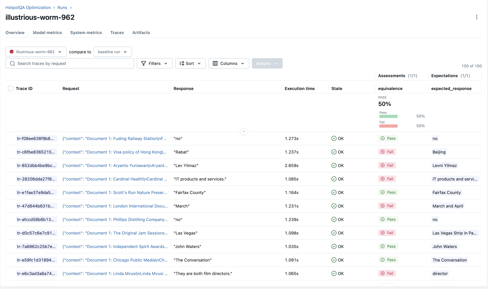
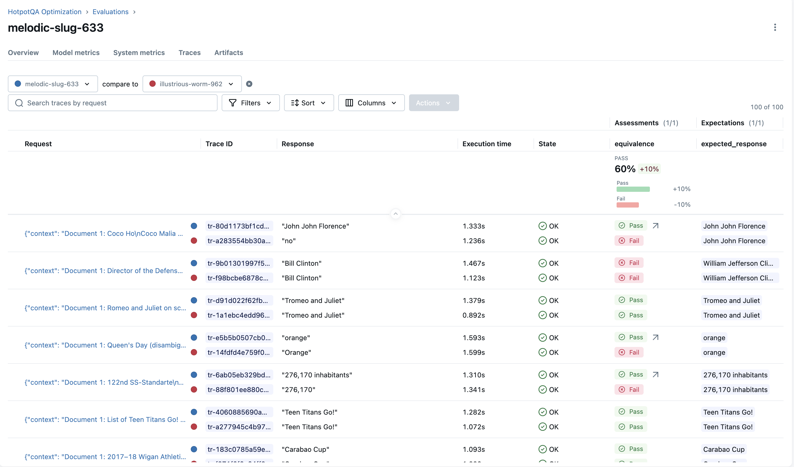
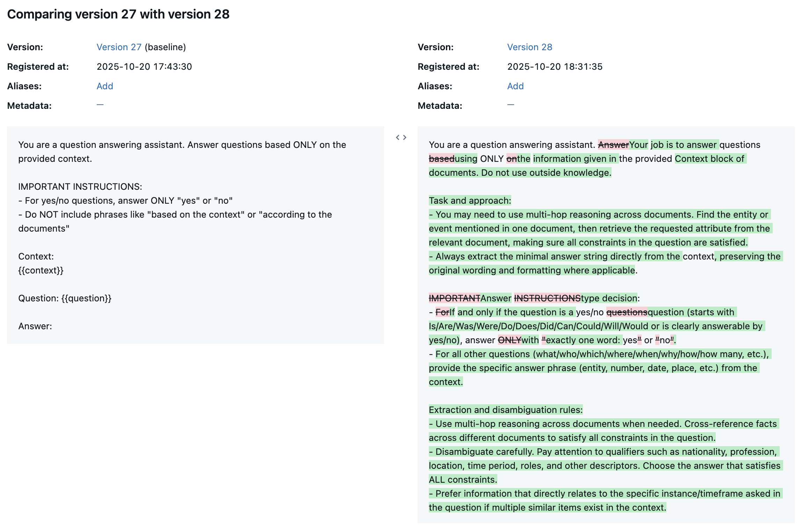

Prompt engineering is critical for building reliable AI systems, but it's fraught with challenges. Manual iteration is time-consuming, lacks systematic guarantees for improvement, and often yields inconsistent results. While frameworks like [DSPy](https://dspy.ai/) have made automatic prompt optimization accessible, applying these techniques to your own workflows has historically required significant integration effort.

MLflow changes this equation. With `mlflow.genai.optimize_prompts`, you can now systematically optimize prompts for any task—whether it's question answering, classification, summarization, or code generation—**as long as you manage your prompts in MLflow Prompt Registry**.

In this blog post, we'll demonstrate the complete workflow using the OpenAI Agent framework on a question-answering task with the HotpotQA dataset. We'll show how automated optimization with the [GEPA](https://github.com/gepa-ai/gepa?tab=readme-ov-file) algorithm achieved a 10% accuracy improvement, but the approach applies broadly to any GenAI application you're building.

## The Challenge: Question Answering

Question answering systems often struggle with complex queries that require reasoning across multiple pieces of information. Consider this example from the HotpotQA dataset:

**Question:** "Were Dennis Howard Marks and Gregory Hines both Welsh?"

**Context:**

- Document 1: Dennis Howard Marks (13 August 1945 – 10 April 2016) was a Welsh drug smuggler and author...
- Document 2: Gregory Oliver Hines (February 14, 1946 – August 9, 2003) was an American dancer, actor, and choreographer...

**Expected Answer:** "no"

This requires the agent to:

1. Extract information about Dennis Howard Marks from Document 1 (Welsh)
2. Extract information about Gregory Hines from Document 2 (American)
3. Synthesize the information to answer "no"

Getting models to consistently provide the correct format and reasoning for such questions is non-trivial.

## The Solution: Automated Prompt Optimization

Rather than manually iterating on prompts through trial and error, MLflow's `optimize_prompts` provides a systematic approach to improve prompt quality using the GEPA optimizer.


## Building an OpenAI Agent QA System

Let's walk through building a complete question-answering system using the OpenAI Agent framework and optimizing it with MLflow.

### 1. Setup and Dependencies

First, install the required packages:

```bash
pip install openai-agents mlflow datasets openai dspy
```

Set up your environment:

```python
import asyncio
import os

import mlflow
from agents import Agent, Runner
from datasets import load_dataset
from mlflow.genai import evaluate
from mlflow.genai.optimize import GepaPromptOptimizer
from mlflow.genai.scorers import Equivalence

# Configure MLflow
mlflow.set_tracking_uri("http://localhost:5000")
mlflow.set_experiment("HotpotQA Optimization")

# Avoid hanging due to the conflict between async and threading (not necessary for sync agents)
os.environ["MLFLOW_GENAI_EVAL_MAX_WORKERS"] = "1"
```

Start your MLflow tracking server:

```bash
mlflow ui --backend-store-uri sqlite:///mlruns.db
```

### 2. Create and Register Your Base Prompt

Start with a simple, straightforward prompt template:

```python
prompt_template = """You are a question answering assistant. Answer questions based ONLY on the provided context.

IMPORTANT INSTRUCTIONS:
- For yes/no questions, answer ONLY "yes" or "no"
- Do NOT include phrases like "based on the context" or "according to the documents"

Context:
{{context}}

Question: {{question}}

Answer:"""

# Register the prompt in MLflow
base_prompt = mlflow.genai.register_prompt(
    name="hotpotqa-user-prompt",
    template=prompt_template,
)
```

The MLflow Prompt Registry provides version control for your prompts, making it easy to track changes and roll back if needed.

### 3. Initialize the OpenAI Agent

Set up your agent with the desired model:

```python
agent = Agent(
    name="HotpotQA Question Answerer",
    instructions="You are a helpful assistant. Follow the instructions in the user message exactly.",
    model="gpt-4o-mini",
)
```

### 4. Create a Prediction Function

The prediction function formats the context and question using the prompt template, then runs the agent:

```python
def create_predict_fn(prompt_uri: str):
    prompt = mlflow.genai.load_prompt(prompt_uri)

    @mlflow.trace
    def predict_fn(context: str, question: str) -> str:
        """Predict function that uses the agent with the MLflow prompt."""
        # Use prompt.format() with template variables
        user_message = prompt.format(context=context, question=question)

        # Run the agent
        result = asyncio.run(Runner.run(agent, user_message))
        return result.final_output

    return predict_fn
```

### 5. Baseline Evaluation

Before optimizing, establish a baseline by evaluating the agent on a validation set. Here, we use the [Equivalence](https://mlflow.org/docs/latest/api_reference/python_api/mlflow.genai.html#mlflow.genai.scorers.Equivalence) built-in scorer, but you can use any Scorer objects. See [Scorer Overview](https://mlflow.org/docs/latest/genai/eval-monitor/scorers/) for more information.

```python
def prepare_hotpotqa_data(num_samples: int, split: str = "validation", offset: int = 0) -> list[dict]:
    """Load and prepare HotpotQA data for MLflow GenAI (evaluate/optimize)."""
    print(f"\nLoading HotpotQA dataset ({split} split, offset={offset})...")
    dataset = load_dataset("hotpot_qa", "distractor", split=split)
    dataset = dataset.select(range(offset, min(offset + num_samples, len(dataset))))

    data = []
    for example in dataset:
        # Format context from HotpotQA
        context_text = "\n\n".join([
            f"Document {i+1}: {title}\n{' '.join(sentences)}"
            for i, (title, sentences) in enumerate(zip(example["context"]["title"], example["context"]["sentences"]))
        ])

        data.append({
            "inputs": {
                "context": context_text,
                "question": example["question"],
            },
            "expectations": {
                "expected_response": example["answer"],
            }
        })

    print(f"Prepared {len(data)} samples")
    return data


def run_benchmark(
    prompt_uri: str,
    num_samples: int,
    split: str = "validation",
    offset: int = 0,
) -> dict:
    """Run the agent on HotpotQA benchmark using mlflow.genai.evaluate()."""

    # Prepare evaluation data
    eval_data = prepare_hotpotqa_data(num_samples, split, offset)

    # Create prediction function
    predict_fn = create_predict_fn(prompt_uri)

    # Run evaluation
    print(f"\nRunning evaluation on {len(eval_data)} samples...\n")

    results = evaluate(
        data=eval_data,
        predict_fn=predict_fn,
        scorers=[Equivalence(model="openai:/gpt-4o-mini")],
    )

    # Extract metrics
    accuracy = results.metrics.get("equivalence/mean", 0.0) / 100.0

    return {
        "accuracy": accuracy,
        "metrics": results.metrics,
        "results": results,
    }


# Run baseline evaluation
baseline_metrics = run_benchmark(base_prompt.uri, num_samples=100, offset=0)

print(f"Baseline Accuracy: {baseline_metrics['accuracy']:.1%}")
# Output: Baseline Accuracy: 50.0%
```



### 6. Optimize the Prompt

Now comes the exciting part - using MLflow to automatically improve the prompt:

```python
def optimize_prompt(base_prompt_uri: str, train_samples: int = 100) -> str:
    """Optimize the prompt using MLflow GenAI optimization."""

    print("\nStarting prompt optimization (this may take a while)...")

    # Prepare training data using shared function
    train_data = prepare_hotpotqa_data(num_samples=train_samples, split="train", offset=0)

    # Run optimization
    result = mlflow.genai.optimize_prompts(
        predict_fn=create_predict_fn(base_prompt_uri),
        train_data=train_data,
        prompt_uris=[base_prompt_uri],
        optimizer=GepaPromptOptimizer(
            reflection_model="openai:/gpt-4o",
            max_metric_calls=500,
        ),
        scorers=[
            Equivalence(model="openai:/gpt-4o-mini"),
        ],
        enable_tracking=True,
    )

    # Get the optimized prompt URI
    optimized_prompt_uri = result.optimized_prompts[0].uri
    print(f"\n✓ Optimization complete!")
    print(f"  Base prompt: {base_prompt_uri}")
    print(f"  Optimized prompt: {optimized_prompt_uri}")

    return optimized_prompt_uri

# Run optimization
optimized_prompt_uri = optimize_prompt(base_prompt.uri, train_samples=100)
```

The optimization process:

1. **Evaluates** the current prompt on training examples
2. **Analyzes** failure patterns and common issues
3. **Generates** improved prompt variations
4. **Tests** these variations to find the best performer
5. **Iterates** until reaching the maximum metric calls or convergence


### 7. Evaluate the Optimized Prompt

Let's see how much we improved:

```python
# Evaluate optimized prompt on the same validation set
optimized_metrics = run_benchmark(optimized_prompt_uri, num_samples=100, offset=0)

print(f"Optimized Accuracy: {optimized_metrics['accuracy']:.1%}")
# Output: Optimized Accuracy: 60.0%

improvement = optimized_metrics['accuracy'] - baseline_metrics['accuracy']
print(f"Improvement: {improvement:+.1%}")
# Output: Improvement: +10.0%
```



## Understanding the Optimized Prompt

Let's compare the original and optimized prompts:

### Original Prompt:

```
You are a question answering assistant. Answer questions based ONLY on the provided context.

IMPORTANT INSTRUCTIONS:
- For yes/no questions, answer ONLY "yes" or "no"
- Do NOT include phrases like "based on the context" or "according to the documents"

Context:
{{context}}

Question: {{question}}

Answer:
```

### Optimized Prompt:

```
You are a question answering assistant. Your job is to answer questions using ONLY the information given in the provided Context block of documents. Do not use outside knowledge.

Task and approach:
- You may need to use multi-hop reasoning across documents. Find the entity or event mentioned in one document, then retrieve the requested attribute from the relevant document, making sure all constraints in the question are satisfied.
- Always extract the minimal answer string directly from the context, preserving the original wording and formatting where applicable.

Answer type decision:
- If and only if the question is a yes/no question (starts with Is/Are/Was/Were/Do/Does/Did/Can/Could/Will/Would or is clearly answerable by yes/no), answer with exactly one word: yes or no.
- For all other questions (what/who/which/where/when/why/how/how many, etc.), provide the specific answer phrase (entity, number, date, place, etc.) from the context.

Extraction and disambiguation rules:
- Use multi-hop reasoning across documents when needed. Cross-reference facts across different documents to satisfy all constraints in the question.
- Disambiguate carefully. Pay attention to qualifiers such as nationality, profession, location, time period, roles, and other descriptors. Choose the answer that satisfies ALL constraints.
- Prefer information that directly relates to the specific instance/timeframe asked in the question if multiple similar items exist in the context.

Strict output format:
- Provide only the minimal answer string. No explanations or extra words.
- Do NOT include phrases like “based on the context” or “according to the documents”.
- Do NOT add quotes, punctuation, or extra sentences.
- Preserve capitalization and surface form exactly as it appears in the context when returning names, titles, and labeled entities.
- For measurement questions (length/width/height/distance/area/duration, etc.), return the full measurement expression exactly as it appears in the context, including units and any descriptive words such as long, wide, tall, hours, minutes (e.g., 6.213 km long).
- For dates and times, return the date/time in the exact format used in the context.
- For location-specific questions:
  - If asked “which city”, return only the city name.
  - If asked “which US state/country”, return only the state or country name.
- For list questions, return a concise, comma-separated list in the order supported by the context (only if the question explicitly asks for multiple items).
- If the context does not contain enough information to answer, reply with unknown (do not guess).

Guidance for multi-hop and pattern matching (use only if supported by the given context):
- Track/event length: If asked “What is the length of the track where [event] was staged?”, find the document about the event to identify the track name, then retrieve the track’s length from the track’s document, and return the exact measurement phrase (e.g., 6.213 km long).
- Film identification with constraints: If asked to identify a film by director and starring actors (e.g., “South Korean actor X starred in what 2016 movie directed by Yeon Sang-ho and starring Gong Yoo, Jung Yu-mi, and Ma Dong-seok?”), locate the film document that matches those constraints and return the exact film title as it appears.
- Geographic containment: If asked about a base located in an area of a county “in which US state?”, locate the base’s document that states the state and return only the state name.

Template:
Context:
{{context}}

Question: {{question}}

Answer:
```

### Key Improvements Identified by GEPA:

1. **Explicit Output Format**: The optimized prompt clearly specifies what constitutes a valid answer
2. **Better Yes/No Detection**: Provides examples of question words that indicate yes/no questions
3. **Multi-Document Reasoning**: Explicitly allows combining information across documents
4. **Name Handling**: Instructs the model to use full canonical forms with titles
5. **Edge Cases**: Addresses specific failure patterns discovered during optimization
6. **Format Preservation**: Ensures exact spelling, capitalization, and formatting from context



## Tracking Everything in MLflow

Throughout this workflow, MLflow automatically tracks:

- **Prompts**: All versions with timestamps and metadata
- **Experiments**: Each optimization run with its configuration
- **Metrics**: Baseline and optimized accuracy scores
- **Artifacts**: Detailed results, predictions, and analysis

## Performance Considerations

**Training Time**: Optimization with 100 training samples and 500 max metric calls took approximately 30 minutes.

**Scaling**: For production systems:

- Start with smaller sample sizes (50-100) for faster iteration
- Use validation sets to verify improvements generalize
- Consider caching predictions to avoid redundant API calls

## Applying to Other Tasks

The workflow we demonstrated with question answering applies to any GenAI task. [mlflow.genai.optimize_prompts](https://mlflow.org/docs/latest/api_reference/python_api/mlflow.genai.html#mlflow.genai.optimize_prompts) is task-agnostic and works across:

- **Text Classification**: Optimize prompts for sentiment analysis, intent detection, topic categorization
- **Information Extraction**: Improve entity extraction, relationship identification, and structured data parsing
- **Summarization**: Refine prompts for different summarization styles, lengths, and target audiences
- **Code Generation**: Enhance prompts for specific coding tasks, languages, and documentation generation
- **Translation**: Improve accuracy while preserving cultural nuances and idiomatic expressions
- **Content Generation**: Optimize prompts for creative writing, marketing copy, or technical documentation

The key requirement is having training data with inputs and expected outputs, and a prediction function that uses your MLflow prompt. The GEPA optimizer handles the rest, regardless of your domain.

## Conclusion

Manual prompt engineering is time-consuming and often yields suboptimal results. MLflow's `optimize_prompts` provides a systematic, data-driven approach to improve prompt quality automatically.

In our HotpotQA experiment, we achieved:

- **+10% accuracy improvement** (from 50% to 60%)
- **Systematic optimization** instead of trial and error
- **Full experiment tracking** for reproducibility
- **Transferable prompt patterns** for future QA tasks

The combination of OpenAI's Agent framework for execution and MLflow's optimization capabilities creates a powerful workflow for building production-ready AI systems.

## Next Steps

Ready to optimize your own prompts? Try:

1. **Bring your own agent**: Modify it for your specific task and data
2. **Experiment with scorers**: Try different evaluation metrics
3. **Scale up**: Apply to larger datasets and more complex tasks

## Further Reading

- [MLflow Prompt Optimization Documentation](https://mlflow.org/docs/latest/genai/prompt-registry/optimize-prompts/)
- [MLflow Prompt Registry](https://mlflow.org/docs/latest/genai/prompt-registry/)
- [OpenAI Agent Framework](https://github.com/openai/openai-agents)
- [HotpotQA Dataset](https://hotpotqa.github.io/)
- [Building and Managing LLM Systems with MLflow](https://mlflow.org/blog/mlflow-prompt-evaluate)
- [LLM as Judge](https://mlflow.org/blog/llm-as-judge)

---

Have questions or want to share your optimization results? Join the conversation on [MLflow's GitHub Discussions](https://github.com/mlflow/mlflow/discussions).
