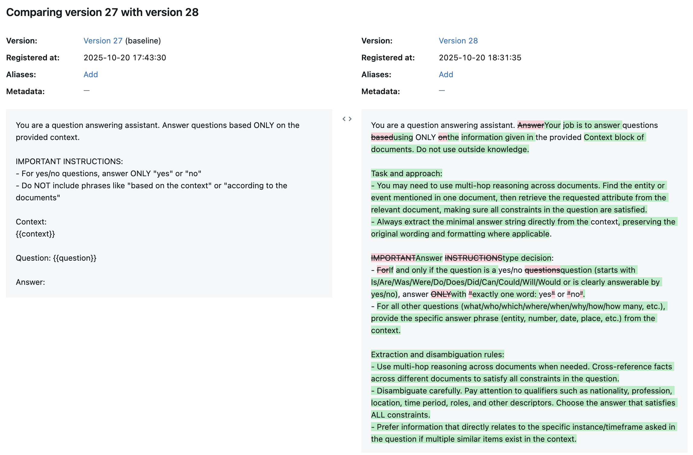
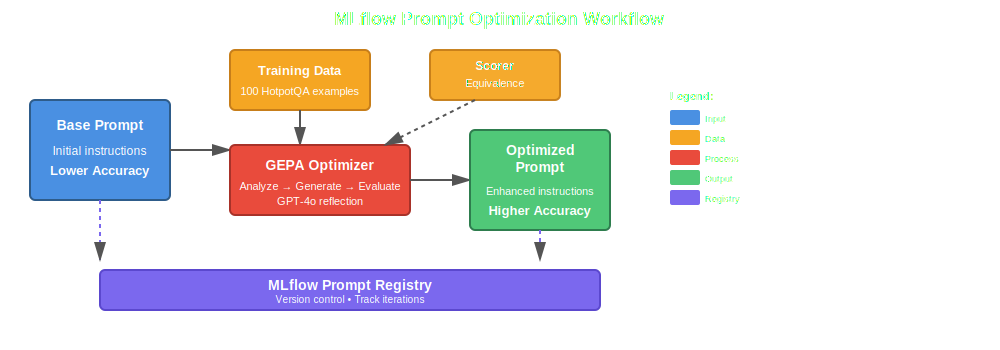
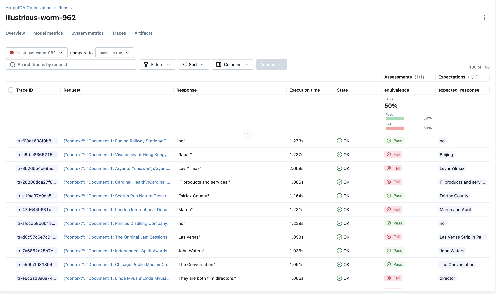
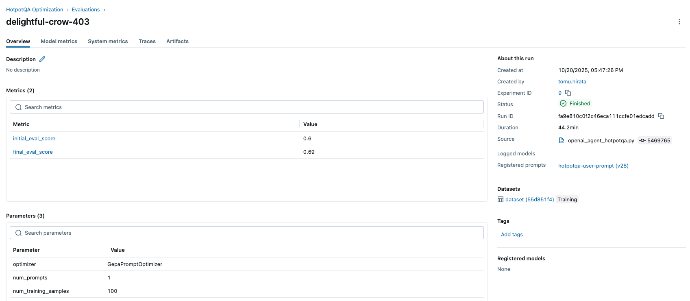
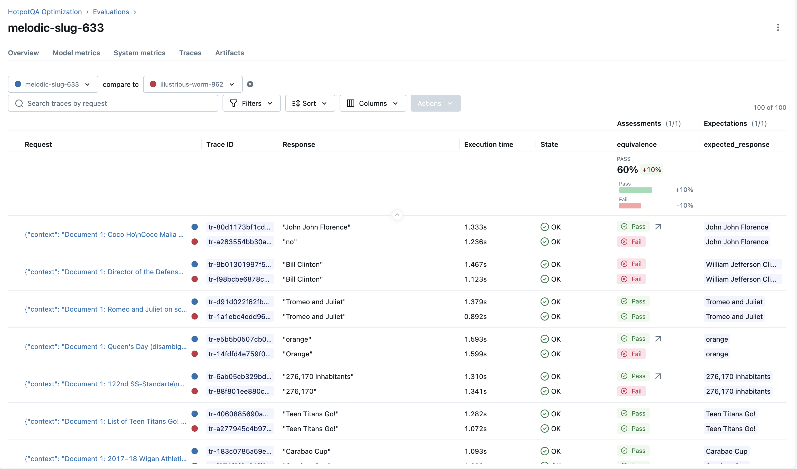

Prompt engineering is critical for building reliable AI systems, but it's fraught with challenges. Manual iteration is time-consuming, lacks systematic guarantees for improvement, and often yields inconsistent results. To address this, automatic prompt optimization algorithms such as [GEPA](https://github.com/gepa-ai/gepa?tab=readme-ov-file) and [MIPRO](https://dspy.ai/api/optimizers/MIPROv2/) have been developed. While [DSPy](https://dspy.ai/) has made these optimization techniques accessible within its framework, applying them to other agent frameworks—such as OpenAI Agents SDK, LangChain, or Pydantic AI—has historically required significant integration effort.

MLflow changes this equation. With `mlflow.genai.optimize_prompts`, you can now systematically optimize prompts, regardless of which agent framework you are using—**as long as you manage your prompts in MLflow Prompt Registry**.

In this blog post, we'll demonstrate the complete workflow using the OpenAI Agent framework on a question-answering task with the HotpotQA dataset. We'll show how automated optimization with the [GEPA](https://github.com/gepa-ai/gepa?tab=readme-ov-file) algorithm achieved a 10% accuracy improvement, but the approach applies broadly to any GenAI application you're building.



## The Challenge: Complex Question Answering

Question answering systems often struggle with complex queries that require reasoning across multiple pieces of information. Consider this example from the HotpotQA dataset:

**Question:** "Which publishing company has published Bizarre and a sister publication devoted to the anomalous phenomena popularised by Charles Fort?"

**Context (10 documents):**

- Document 1: Fortean Times is a British monthly magazine devoted to the anomalous phenomena popularised by Charles Fort... it is now published by Dennis Publishing Ltd.
- Document 2: Charles Fort Charles Hoy Fort (August 6, 1874 – May 3, 1932) was an American writer and researcher who specialized in anomalous phenomena...
- Document 3: Bob Rickard Robert "Bob" J M Rickard is the founder and editor of the UK magazine "Fortean Times: The Journal of Strange Phenomena"...
- Document 4: Bizarre was a British alternative magazine published from 1997 to 2015. It was published by Dennis Publishing, and was a sister publication to the "Fortean Times".
  ....

**Expected Answer:** "Dennis Publishing"

This requires the agent to:

1. Identify that "Fortean Times" is devoted to phenomena popularized by Charles Fort (Document 1)
2. Recognize that "Bizarre" was published by Dennis Publishing (Document 4)
3. Connect that Bizarre and Fortean Times are sister publications (Document 4)
4. Synthesize the information to answer "Dennis Publishing"

Getting models to consistently provide the correct format and reasoning for such questions is non-trivial.

## The Solution: Automated Prompt Optimization

Rather than manually iterating on prompts through trial and error, MLflow's `optimize_prompts` provides a systematic approach to improve prompt quality using the GEPA optimizer.



## Building an OpenAI Agent QA System

Let's walk through building a complete question-answering system using the OpenAI Agent framework and optimizing it with MLflow.

### 1. Setup and Dependencies

First, install the required packages:

```bash
pip install openai-agents mlflow datasets openai gepa
```

Set up your environment:

```python
import asyncio
import os

import mlflow
from agents import Agent, Runner
from datasets import load_dataset
from mlflow.genai import evaluate
from mlflow.genai.optimize import GepaPromptOptimizer
from mlflow.genai.scorers import Equivalence

# Configure MLflow
mlflow.set_tracking_uri("http://localhost:5000")
mlflow.set_experiment("HotpotQA Optimization")

mlflow.openai.autolog()

# Avoid hanging due to the conflict between async and threading (not necessary for sync agents)
os.environ["MLFLOW_GENAI_EVAL_MAX_WORKERS"] = "1"

# If running on notebooks
import nest_asyncio
nest_asyncio.apply()
```

Start your MLflow tracking server:

```bash
mlflow ui --backend-store-uri sqlite:///mlruns.db
```

### 2. Create and Register Your Base Prompt

Start with a simple, straightforward prompt template:

```python
prompt_template = """You are a question answering assistant. Answer questions based ONLY on the provided context.

IMPORTANT INSTRUCTIONS:
- For yes/no questions, answer ONLY "yes" or "no"
- Do NOT include phrases like "based on the context" or "according to the documents"

Context:
{{context}}

Question: {{question}}

Answer:"""

# Register the prompt in MLflow
base_prompt = mlflow.genai.register_prompt(
    name="hotpotqa-user-prompt",
    template=prompt_template,
)
```

The MLflow Prompt Registry provides version control for your prompts, making it easy to track changes and roll back if needed.

### 3. Initialize the OpenAI Agent

Set up your agent.

```python
agent = Agent(
    name="HotpotQA Question Answerer",
    instructions="You are a helpful assistant. Follow the instructions in the user message exactly.",
    model="gpt-4o-mini",
)
```

### 4. Create a Prediction Function

The prediction function formats the context and question using the prompt template, then runs the agent:

```python
# Create a wrapper for `predict_fn` to run the agent with different prompts
def create_predict_fn(prompt_uri: str):
    prompt = mlflow.genai.load_prompt(prompt_uri)

    @mlflow.trace
    def predict_fn(context: str, question: str) -> str:
        """Predict function that uses the agent with the MLflow prompt."""
        # Use prompt.format() with template variables
        user_message = prompt.format(context=context, question=question)

        # Run your agent
        result = asyncio.run(Runner.run(agent, user_message))

        return result.final_output

    return predict_fn
```

### 5. Baseline Evaluation

Before optimizing, establish a baseline by evaluating the agent on a validation set. Here, we use the [Equivalence](https://mlflow.org/docs/latest/api_reference/python_api/mlflow.genai.html#mlflow.genai.scorers.Equivalence) built-in scorer that evaluates the semantic and formatting similarity between the system outputs and expected outputs, but you can use any Scorer objects. See [Scorer Overview](https://mlflow.org/docs/latest/genai/eval-monitor/scorers/) for more information.

```python
def prepare_hotpotqa_data(num_samples: int, split: str = "validation") -> list[dict]:
    """Load and prepare HotpotQA data for MLflow GenAI (evaluate/optimize)."""
    print(f"\nLoading HotpotQA dataset ({split} split, offset={offset})...")
    dataset = load_dataset("hotpot_qa", "distractor", split=split)
    dataset = dataset.select(range(offset, min(offset + num_samples, len(dataset))))

    data = []
    for example in dataset:
        # Format context from HotpotQA
        context_text = "\n\n".join([
            f"Document {i+1}: {title}\n{' '.join(sentences)}"
            for i, (title, sentences) in enumerate(zip(example["context"]["title"], example["context"]["sentences"]))
        ])

        data.append({
            "inputs": {
                "context": context_text,
                "question": example["question"],
            },
            "expectations": {
                "expected_response": example["answer"],
            }
        })

    print(f"Prepared {len(data)} samples")
    return data


def run_benchmark(
    prompt_uri: str,
    num_samples: int,
    split: str = "validation",
) -> dict:
    """Run the agent on HotpotQA benchmark using mlflow.genai.evaluate()."""

    # Prepare evaluation data
    eval_data = prepare_hotpotqa_data(num_samples, split)

    # Create prediction function
    predict_fn = create_predict_fn(prompt_uri)

    # Run evaluation
    print(f"\nRunning evaluation on {len(eval_data)} samples...\n")

    results = evaluate(
        data=eval_data,
        predict_fn=predict_fn,
        scorers=[Equivalence(model="openai:/gpt-4o-mini")],
    )

    # Extract metrics
    accuracy = results.metrics.get("equivalence/mean", 0.0) / 100.0

    return {
        "accuracy": accuracy,
        "metrics": results.metrics,
        "results": results,
    }


# Run baseline evaluation
baseline_metrics = run_benchmark(base_prompt.uri, num_samples=100, offset=0)

print(f"Baseline Accuracy: {baseline_metrics['accuracy']:.1%}")
# Output: Baseline Accuracy: 50.0%
```



### 6. Optimize the Prompt

Now comes the exciting part - using MLflow to automatically improve the prompt:

```python
# Prepare training data using shared function
train_data = prepare_hotpotqa_data(num_samples=100, split="train")

# Run optimization
result = mlflow.genai.optimize_prompts(
    predict_fn=create_predict_fn(base_prompt.uri),
    train_data=train_data,
    prompt_uris=[base_prompt.uri],
    optimizer=GepaPromptOptimizer(
        reflection_model="openai:/gpt-4o",
        max_metric_calls=500,
    ),
    scorers=[
        Equivalence(model="openai:/gpt-4o-mini"),
    ],
    enable_tracking=True,
)

# Get the optimized prompt URI
optimized_prompt_uri = result.optimized_prompts[0].uri
print(f"  Base prompt: {base_prompt.uri}")
print(f"  Optimized prompt: {optimized_prompt_uri}")
```

The optimization process:

1. **Evaluates** the current prompt on training examples
2. **Analyzes** failure patterns and common issues
3. **Generates** improved prompt variations
4. **Tests** these variations to find the best performer
5. **Iterates** until reaching the maximum metric calls or convergence



### 7. Evaluate the Optimized Prompt

Let's see how much we improved:

```python
# Evaluate optimized prompt on the same validation set
optimized_metrics = run_benchmark(optimized_prompt_uri, num_samples=100, offset=0)

print(f"Optimized Accuracy: {optimized_metrics['accuracy']:.1%}")
# Output: Optimized Accuracy: 60.0%

improvement = optimized_metrics['accuracy'] - baseline_metrics['accuracy']
print(f"Improvement: {improvement:+.1%}")
# Output: Improvement: +10.0%
```



## Understanding the Optimized Prompt

Let's compare the original and optimized prompts:

### Original Prompt:

```
You are a question answering assistant. Answer questions based ONLY on the provided context.

IMPORTANT INSTRUCTIONS:
- For yes/no questions, answer ONLY "yes" or "no"
- Do NOT include phrases like "based on the context" or "according to the documents"

Context:
{{context}}

Question: {{question}}

Answer:
```

### Optimized Prompt:

```
You are a question answering assistant. Your job is to answer questions using ONLY the information given in the provided Context block of documents. Do not use outside knowledge.

Task and approach:
- You may need to use multi-hop reasoning across documents. Find the entity or event mentioned in one document, then retrieve the requested attribute from the relevant document, making sure all constraints in the question are satisfied.
- Always extract the minimal answer string directly from the context, preserving the original wording and formatting where applicable.

Answer type decision:
- If and only if the question is a yes/no question (starts with Is/Are/Was/Were/Do/Does/Did/Can/Could/Will/Would or is clearly answerable by yes/no), answer with exactly one word: yes or no.
- For all other questions (what/who/which/where/when/why/how/how many, etc.), provide the specific answer phrase (entity, number, date, place, etc.) from the context.

Extraction and disambiguation rules:
- Use multi-hop reasoning across documents when needed. Cross-reference facts across different documents to satisfy all constraints in the question.
- Disambiguate carefully. Pay attention to qualifiers such as nationality, profession, location, time period, roles, and other descriptors. Choose the answer that satisfies ALL constraints.
- Prefer information that directly relates to the specific instance/timeframe asked in the question if multiple similar items exist in the context.

Strict output format:
- Provide only the minimal answer string. No explanations or extra words.
- Do NOT include phrases like “based on the context” or “according to the documents”.
- Do NOT add quotes, punctuation, or extra sentences.
- Preserve capitalization and surface form exactly as it appears in the context when returning names, titles, and labeled entities.
- For measurement questions (length/width/height/distance/area/duration, etc.), return the full measurement expression exactly as it appears in the context, including units and any descriptive words such as long, wide, tall, hours, minutes (e.g., 6.213 km long).
- For dates and times, return the date/time in the exact format used in the context.
- For location-specific questions:
  - If asked “which city”, return only the city name.
  - If asked “which US state/country”, return only the state or country name.
- For list questions, return a concise, comma-separated list in the order supported by the context (only if the question explicitly asks for multiple items).
- If the context does not contain enough information to answer, reply with unknown (do not guess).

Guidance for multi-hop and pattern matching (use only if supported by the given context):
- Track/event length: If asked “What is the length of the track where [event] was staged?”, find the document about the event to identify the track name, then retrieve the track’s length from the track’s document, and return the exact measurement phrase (e.g., 6.213 km long).
- Film identification with constraints: If asked to identify a film by director and starring actors (e.g., “South Korean actor X starred in what 2016 movie directed by Yeon Sang-ho and starring Gong Yoo, Jung Yu-mi, and Ma Dong-seok?”), locate the film document that matches those constraints and return the exact film title as it appears.
- Geographic containment: If asked about a base located in an area of a county “in which US state?”, locate the base’s document that states the state and return only the state name.

Template:
Context:
{{context}}

Question: {{question}}

Answer:
```

### Key Improvements Identified by GEPA:

The improvements achieved by GEPA include: clarifying the explicit output format so the prompt defines exactly what makes a valid answer; enhancing yes/no question detection with examples of indicative question words; allowing for multi-document reasoning by specifying that information can be combined across documents; instructing the model to handle names by using their full canonical forms with titles; addressing notable edge cases by directly targeting specific failure patterns uncovered during optimization; and enforcing strict format preservation, requiring the answer to match the spelling, capitalization, and formatting found in the context.

## Tracking Everything in MLflow

Throughout this workflow, MLflow automatically tracks:

- **Prompts**: All versions with timestamps and metadata
- **Runs**: Each optimization run with its configuration
- **Metrics**: Baseline and optimized accuracy scores
- **Traces**: Detailed execution traces of your agent

## Performance Considerations

**Training Time**: Optimization with 100 training samples and 500 max metric calls took approximately 30 minutes.

**Scaling**: For production systems, it is recommended to start with smaller sample sizes (50-100) for faster iteration. Use validation sets to verify that improvements generalize beyond the training data. To improve efficiency and reduce costs, consider caching predictions to avoid redundant API calls.

## Conclusion

Manual prompt engineering is time-consuming and often yields suboptimal results. MLflow's `optimize_prompts` provides a systematic, data-driven approach to improve prompt quality automatically.

In our HotpotQA experiment, we observed a 10% absolute accuracy improvement (from 50% to 60%) after optimization. This workflow enabled systematic optimization rather than relying on trial and error, and provided full experiment tracking for reproducibility.

The combination of OpenAI's Agent framework for execution and MLflow's optimization capabilities creates a powerful workflow for building production-ready AI systems.

## Further Reading

- [MLflow Prompt Optimization Documentation](https://mlflow.org/docs/latest/genai/prompt-registry/optimize-prompts/)
- [MLflow Prompt Registry](https://mlflow.org/docs/latest/genai/prompt-registry/)
- [OpenAI Agent Framework](https://github.com/openai/openai-agents-python)
- [HotpotQA Dataset](https://hotpotqa.github.io/)
- [Building and Managing LLM Systems with MLflow](https://mlflow.org/blog/mlflow-prompt-evaluate)
- [LLM as Judge](https://mlflow.org/docs/latest/genai/eval-monitor/scorers/llm-judge/)

---

Have questions or face issues? Please file a report on [MLflow's GitHub Issues](https://github.com/mlflow/mlflow/issues).
