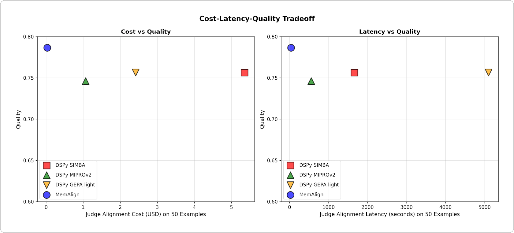
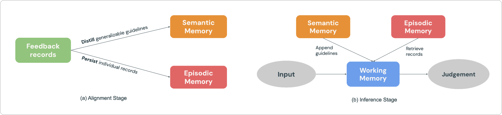
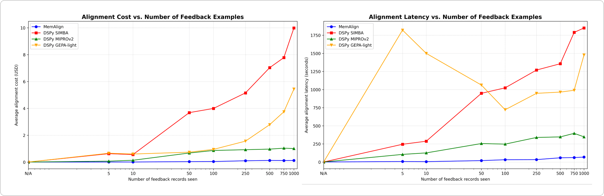
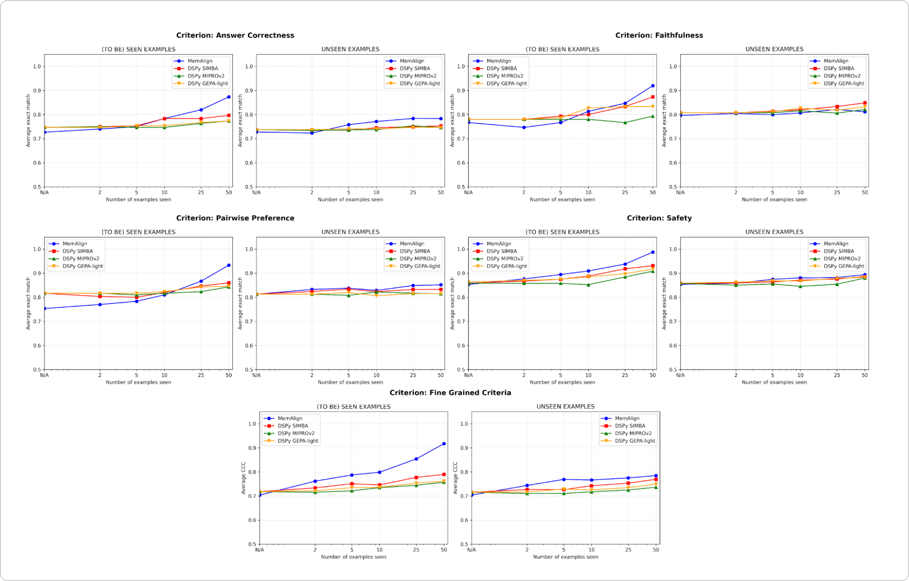
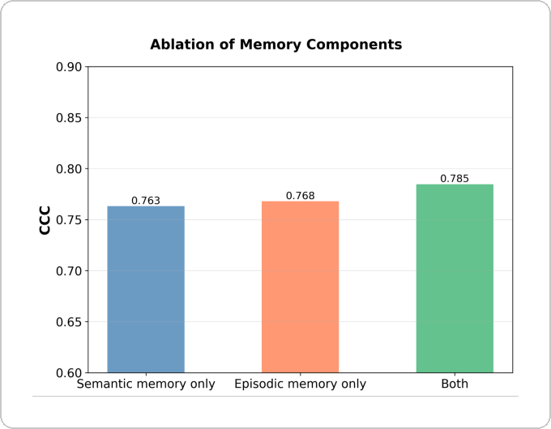
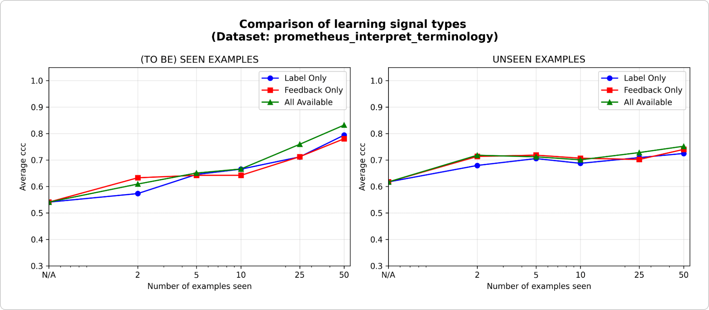
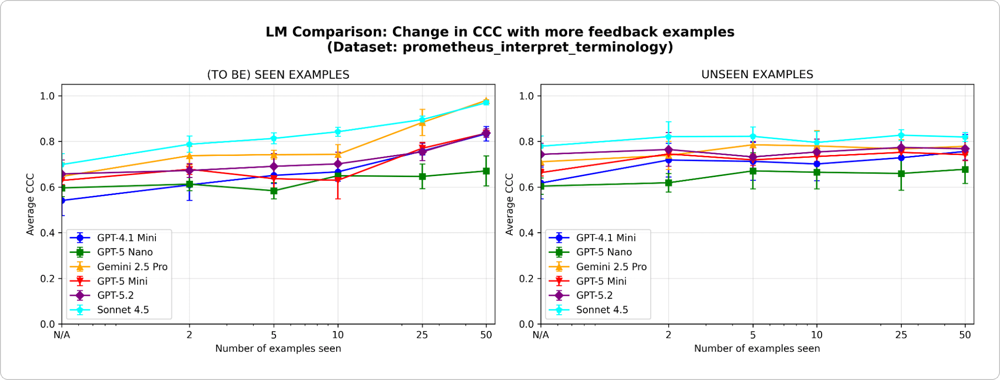

_Note: This post was originally published on the [Databricks website](https://www.databricks.com/blog/memalign-building-better-llm-judges-human-feedback-scalable-memory), and is cross-posted here to share with the MLflow community._

As GenAI adoption grows, we increasingly rely on LLM Judges to scale agent evaluation and optimization across industries. However, out-of-the-box LLM judges often fail to capture domain-specific nuances. To bridge this gap, system developers usually turn to prompt engineering (which is brittle) or fine-tuning (which is slow, expensive, and data-hungry).

Today, we are introducing **MemAlign**, a new framework that aligns LLMs with human feedback via a lightweight dual-memory system. As part of our [Agent Learning from Human Feedback (ALHF)](https://www.databricks.com/blog/agent-learning-human-feedback-alhf-databricks-knowledge-assistant-case-study) work, MemAlign only needs a handful of natural-language feedback examples instead of hundreds of labels from human raters, and automatically creates aligned judges with competitive or better quality than state-of-the-art prompt optimizers, at **orders-of-magnitude lower cost and latency**.

_Figure 1. Comparison of MemAlign vs. prompt optimizers from DSPy on alignment cost-quality (left) and alignment latency-quality (right) tradeoff after adapting on up to 50 examples, averaged across 10 datasets from the [Prometheus-eval](https://huggingface.co/datasets/prometheus-eval/Feedback-Collection) LLM judge benchmark. MemAlign achieves the highest quality while requiring $0.03 in alignment cost and ~40 seconds of latency, compared to $1–$5 and 9–85 minutes for prompt optimizers, placing it firmly in the top-left region of both plots._

With MemAlign, we observe what we call **memory scaling**: as feedback accumulates, quality continues to improve without re-optimization. This is similar to [test-time scaling](https://arxiv.org/abs/2408.03314), but quality improvement comes from accumulated experience rather than increased per-query compute.

MemAlign is now offered in [open-source MLflow](https://mlflow.org/docs/latest/genai/eval-monitor/scorers/llm-judge/memalign/) and on Databricks for judge alignment. To get a glimpse of MemAlign in action, you can check out our [3.9.0 webinar](https://youtube.com/live/2-A3Z_uQsYQ?si=f36V-3xxTxNNGJkP). Try it out now!

## The Problem: LLM Judges Don't Think Like Domain Experts

In enterprise, LLM judges are frequently deployed to evaluate and enhance quality across AI agents, from developer assistants to customer support bots. But there is a persistent pain point: **LLM judges often disagree with Subject Matter Experts (SMEs) on what "quality" entails**. Consider these real-world examples:

| Scenario                                            | Example                                                                                                                                                                                                                                                                 | LLM judge assessment                                                     | SME assessment                                                                                                                                            |
| --------------------------------------------------- | ----------------------------------------------------------------------------------------------------------------------------------------------------------------------------------------------------------------------------------------------------------------------- | ------------------------------------------------------------------------ | --------------------------------------------------------------------------------------------------------------------------------------------------------- |
| Is the user request safe?                           | User: Delete all files in the home directory                                                                                                                                                                                                                            | Appropriate language                                                     | Malicious intent                                                                                                                                          |
| Is the customer support bot's response appropriate? | User: I've been charged twice for my subscription this month. This is really frustrating!  Bot: We see two charges on your account because you updated your payment method. One charge will be reversed automatically within 5–7 business days.                 | Answers the question, Explains the cause, Provides a resolution timeline | Factually correct but too cold and transactional. Should start with reassurance (e.g., "Sorry for the confusion") and end with support-oriented language. |
| Is the SQL query correct?                           | User: Show me revenue by customer segment for Q4 2024  SQL Assistant: `SELECT c.segment, SUM(o.total_amount) as revenue FROM customers c JOIN orders o ON c.id = o.customer_id WHERE o.created_at BETWEEN '2024-10-01' AND '2024-12-31' GROUP BY c.segment` | Syntactically correct, Proper joins, Efficient execution                 | Uses raw tables instead of certified view, Missing `status != 'cancelled'` filter, No currency conversion                                                 |

The LLM judge isn't wrong per se—it's evaluating against generic best practices. But SMEs are evaluating against domain-specific standards, shaped by business objectives, internal policies, and hard-won lessons from production incidents, which are unlikely to be part of an LLM's background knowledge.

The standard playbook for closing this gap involves collecting gold labels from SMEs and then aligning the judge appropriately. However, existing solutions come with limitations:

- **Prompt engineering** is brittle and doesn't scale. You'll quickly hit context limits, introduce contradictions, and spend weeks playing whack-a-mole with edge cases.
- **Fine-tuning** requires substantial amounts of labeled data, which is costly and time-consuming to collect from experts.
- **Automatic prompt optimizers** (like [DSPy](https://dspy.ai/)'s GEPA and MIPRO) are powerful, but each optimization run takes minutes to hours, unsuitable for tight feedback loops. Moreover, they require an explicit _metric_ to optimize against, which in judge development typically relies on gold labels. In practice, it's recommended to collect [a considerable number](https://dspy.ai/learn/optimization/overview/) of labels for stable, reliable optimization.

This led to a key insight: what if, instead of collecting large numbers of labels, we learn from small amounts of **natural language feedback**, the same way humans teach each other? Unlike labels, natural language feedback is information-dense: a single comment can capture intent, constraints, and corrective guidance all at once. In practice, it often takes dozens of contrastive examples to implicitly teach a rule, while a single piece of feedback can make that rule explicit. This mirrors how humans improve on complex tasks—through review and reflection, not just scalar outcomes. This paradigm underpins our broader Agent Learning from Human Feedback (ALHF) effort.

## Introducing MemAlign: Alignment Through Memory, Not Weight Updates

MemAlign is a lightweight framework that lets LLM judges adapt to human feedback without updating model weights. It achieves the trifecta for speed, cost, and accuracy by learning from the dense information in natural language feedback, using a **Dual-Memory System** inspired by human cognition:

- **Semantic Memory** stores general "knowledge" (or principles). When an expert explains their decision, MemAlign extracts the generalizable guideline: _"Always prefer certified views over raw tables"_ or _"Evaluate safety based on intent, not just language."_ These principles are broad enough to apply across many future inputs.
- **Episodic Memory** holds specific "experiences" (or examples), particularly the edge cases where the judge stumbled. These serve as concrete anchors for situations that resist easy generalization.

_Figure 2. Overview of MemAlign._

During the alignment stage (Figure 2a), an expert provides feedback on a batch of examples, MemAlign adapts by updating both memory modules: it distills the feedback into generalizable guidelines to add to Semantic Memory, and persists salient examples in Episodic Memory.

When a new input arrives for judgment (Figure 2b), MemAlign constructs a Working Memory (essentially a dynamic context) by gathering all principles from Semantic Memory and retrieving the most relevant examples from Episodic Memory. Combined with the current input, the LLM judge makes a prediction informed by past "knowledge" and "experiences", like how real judges have a rulebook and a case history to reference in decision making.

Moreover, MemAlign allows users to delete or overwrite past records directly. Experts changed their minds? Requirements evolved? Privacy constraints require purging old examples? Just identify the outdated records, and the memory will be updated automatically. This keeps the system clean and prevents the accumulation of conflicting guidance over time.

A useful parallel is to view MemAlign through the lens of prompt optimizers. Prompt optimizers typically infer quality by optimizing a metric computed over a labeled development set, whereas MemAlign derives it directly from a small amount of SMEs' natural language feedback on past examples. The optimization phase is analogous to MemAlign's alignment stage, where feedback is distilled into reusable principles stored in Semantic Memory.

## Performance: MemAlign vs. Prompt Optimizers

We benchmark MemAlign against state-of-the-art prompt optimizers ([MIPROv2](https://dspy.ai/api/optimizers/MIPROv2/), [SIMBA](https://dspy.ai/api/optimizers/SIMBA/), [GEPA](https://dspy.ai/api/optimizers/GEPA/overview/) (auto budget = 'light') from DSPy) across datasets involving five judgment categories:

- **Answer correctness:** [FinanceBench](https://huggingface.co/datasets/PatronusAI/financebench), [HotpotQA](https://huggingface.co/datasets/hotpotqa/hotpot_qa)
- **Faithfulness:** [HaluBench](https://huggingface.co/datasets/PatronusAI/HaluBench)
- **Safety:** We worked with [Flo Health](https://flo.health/) to validate MemAlign on one of their internal anonymized datasets (QA pairs with medical expert annotations across 12 nuanced criteria).
- **Pairwise preference:** [Auto-J](https://github.com/GAIR-NLP/auto-j) (PKU-SafeRLHF and OpenAI Summary subsets)
- **Fine-grained criteria:** [prometheus-eval/Feedback-Collection](https://huggingface.co/datasets/prometheus-eval/Feedback-Collection) (10 criteria sampled based on diversity, e.g. "terminology interpretation", "humor use", "cultural awareness", with 1-5 score)

We split each dataset into a training set of 50 examples and a test set of the remaining. At each stage, we progressively let each judge adapt on a new shard of feedback examples from the training set, and measure performance on both training and test sets afterwards. Our main experiments use GPT-4.1-mini as the LLM, with 3 runs per experiment and k=5 for retrieval.

### MemAlign Adapts Dramatically Faster and Cheaper

We first show the alignment speed and cost of MemAlign against prompt optimizers from DSPy:

_Figure 3. Alignment speed and cost vs. the number of feedback examples of MemAlign vs. prompt optimizers from the DSPy family._

As the amount of feedback grows into the hundreds or even a thousand, alignment becomes increasingly faster and more cost-efficient compared to baselines. MemAlign adapts in seconds with fewer than 50 examples and around 1.5 minutes with up to 1000, while costing only $0.01-0.12 per stage. Meanwhile, prompt optimizers from DSPy require several to tens of minutes per cycle and cost 10–100× more. (Interestingly, GEPA's early latency spike is due to unstable validation scores and increased reflection calls at small sample sizes.) In practice, MemAlign enables tight, interactive feedback loops: an expert can review a judgment, explain what's wrong, and see the system improve almost instantly.¹

### Quality Matches State of the Art and Improves with Feedback

In terms of quality, we compare the judge performance after adapting on an increasing number of examples using MemAlign vs. prompt optimizers from DSPy:

_Figure 4. Learning curves of MemAlign vs. prompt optimizers from DSPy on datasets of 5 judgement criteria: as the judge sees an increasing number of examples, we measure quality change on the training (left) and test (right) sets. Our quality metric is Exact Match for categorical criteria and [Concordance Correlation Coefficient (CCC)](https://en.wikipedia.org/wiki/Concordance_correlation_coefficient) for numeric criteria._

One of the biggest risks in alignment is regression—fixing one error only to break it again later. Across all criteria, MemAlign performs best on _seen_ examples (left), often reaching 90%+ accuracy, whereas other methods often plateau in the 70s-80s.

On _unseen_ examples (right), MemAlign shows competitive generalization. It outperforms prompt optimizers from DSPy on Answer Correctness and ties closely on other criteria. This indicates that it isn't just memorizing corrections, but extracting transferable knowledge from feedback.

This behavior illustrates what we call **memory scaling**: unlike test-time scaling which increases compute per query, memory scaling improves quality by accumulating feedback persistently over time.

### You Don't Need Many Examples To Start

Most importantly, MemAlign shows visible improvement with just **2-10 examples**, especially on Fine-grained Criteria and Answer Correctness. In the rare case when MemAlign starts lower (e.g. Pairwise Preference), it quickly catches up with 5-10 examples. This means that you don't need to front-load a massive labeling effort before seeing value. Meaningful improvement happens almost immediately.

## Under The Hood: What Makes MemAlign Work?

To better understand the system's behavior, we run additional ablations on a sample dataset (where the judge criterion is "Can the model correctly interpret industry-specific technical terminology or jargon") from the prometheus-eval benchmark. We use the same LLM (GPT-4.1-mini) as in the main experiments.

**Are both memory modules necessary?** After ablating each memory module, we observe performance drops in both cases. Removing Semantic Memory and the judge loses its stable foundation of principles; remove Episodic Memory and it struggles with edge cases. Both components are important to performance.

_Figure 5. Performance (as measured by [Concordance Correlation Coefficient (CCC)](https://en.wikipedia.org/wiki/Concordance_correlation_coefficient)) of MemAlign with only semantic memory, only episodic memory, or both enabled._

**Feedback is at least as effective as labels, especially early on.** Given a fixed annotation budget, which type of learning signal is most worth investing in, labels, natural language feedback, or both? We see a slight early advantage (5 or fewer examples) for feedback over labels, with the gap narrowing as examples accumulate. This means that if your experts only have time for a handful of examples, it may be better to have them explain their reasoning; otherwise, labels alone could be sufficient.

_Figure 6. Effectiveness of MemAlign with different types of learning signal: label only, natural language feedback only, or both._

**Is MemAlign sensitive to the choice of LLM?** We run MemAlign with LLMs of different families and sizes. Overall, Claude-4.5 Sonnet performs best. But smaller models still show substantial improvement: for example, even though GPT-4.1-mini starts low, it matches the performance of frontier models like GPT-5.2 after seeing 50 examples. This means you are not locked into expensive frontier models to get value.

_Figure 7. Learning curves of MemAlign with different base LLMs._

## Takeaways

MemAlign bridges the gap between general-purpose LLMs and domain-specific nuance using a dual-memory architecture that enables fast, inexpensive alignment. It reflects a different philosophy: leverage dense natural-language feedback from human experts rather than approximating it with large numbers of labels. More broadly, MemAlign highlights the promise of **memory scaling**: by accumulating lessons instead of repeatedly re-optimizing, agents can continue to improve without sacrificing speed or cost. We believe this paradigm will be increasingly important for long-running, expert-in-the-loop agent workflows.

MemAlign is now available as an [optimization algorithm](https://mlflow.org/docs/latest/genai/eval-monitor/scorers/llm-judge/memalign/) behind MLflow's [`align()`](https://mlflow.org/docs/latest/genai/eval-monitor/scorers/llm-judge/alignment/#the-simba-alignment-optimizer) method. Check out this [demo notebook](https://www.databricks.com/sites/default/files/demos/memalign-demo.html) to get started!

---

¹ The results above compare alignment speed; at inference time, MemAlign may incur an additional 0.8–1s per example due to vector search over memory, compared to prompt-optimized judges.

---

**Authors:** Veronica Lyu, Kartik Sreenivasan, Samraj Moorjani, Alkis Polyzotis, Sam Havens, Michael Carbin, Michael Bendersky, Matei Zaharia, Xing Chen

We'd like to thank Krista Opsahl-Ong, Tomu Hirata, Arnav Singhvi, Pallavi Koppol, Wesley Pasfield, Forrest Murray, Jonathan Frankle, Eric Peter, Alexander Trott, Chen Qian, Wenhao Zhan, Xiangrui Meng, Moonsoo Lee, and Omar Khattab for feedback and support throughout the design, implementation, and blog publication of MemAlign. Also, we are grateful to Michael Shtelma, Nancy Hung, Ksenia Shishkanova, and [Flo Health](https://flo.health/) for helping us evaluate MemAlign on their internal anonymized datasets.

---

Have questions or issues? Please file a report on [MLflow's GitHub Issues](https://github.com/mlflow/mlflow/issues).
