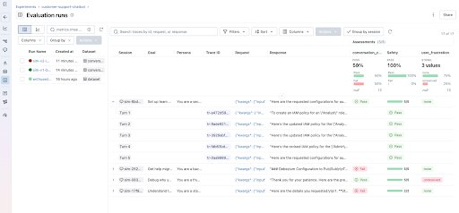
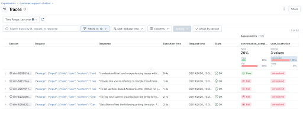
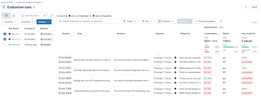

Imagine, you built a chatbot that handles customer questions and carefully tuned it to ensure its responses are relevant, grounded, and correct. However, users keep leaving conversations unsatisfied. Sometimes you find that the agent loses track of what was already covered or even that your users are giving up and leaving mid-conversation. Even though each single turn can look fine on its own, the overall conversation falls apart across turns, leading to user frustration.

MLflow 3.10 introduces a new suite of research-backed tools for multi-turn evaluation and conversation simulation to catch what single-turn scores miss. With this brand new set of functionality, you can:

- Score entire conversations instead of individual responses to detect incomplete answers, lost context, and rising user frustration
- Test changes to your agent with reproducible simulated conversations, grounded in scenarios from real user conversations
- Evaluate existing traces on-demand or register conversation-level scorers and automatically evaluate traces

<!-- truncate -->

## The Setup

Let's say you just deployed a support agent for a data platform. It utilizes a knowledge base to handle questions about pricing, migrations, rate limits, access controls, and more. Every turn is traced with `@mlflow.trace`, and each trace is tagged with a session ID so MLflow can group turns from the same conversation.

```python
@mlflow.trace
def my_agent(message: str, history: list[dict], session_id: str) -> str:
    mlflow.update_current_trace(
        metadata={"mlflow.trace.session": session_id}
    )
    messages = [
        {"role": "system", "content": SYSTEM_PROMPT}
    ] + history + [
        {"role": "user", "content": message}
    ]
    response = client.chat.completions.create(
        model="gpt-5-mini",
        messages=messages,
        tools=TOOLS,
    )
    # ... handle tool calls and return response
```

Quickly after launching, you notice users churning and giving thumbs-down on conversations. Skimming a few random traces, it's hard to pinpoint the problem because the responses seem reasonable in isolation. The problem is somewhere in how the conversation unfolds, and you need a way to detect that. MLflow provides dedicated session-level UIs to help you dive deeper into these conversations and the underlying traces.


However, reading over conversations is not scalable. You need a way to catch quality issues at scale.

## Scoring Existing Sessions

MLflow provides a robust set of built-in scorers for common conversation patterns. The two we will use are `ConversationCompleteness`, which checks whether the user's questions were fully answered by the end of the conversation, and `UserFrustration`, which detects whether the user became frustrated and whether the agent made it worse. To see the full set of multi-turn scorers provided out-of-the-box, see the [documentation](https://mlflow.org/docs/latest/genai/eval-monitor/scorers/llm-judge/predefined/#multi-turn).

You can score existing sessions to understand how your agent is performing:

```python
traces = mlflow.search_traces(
    experiment_ids=[experiment.experiment_id],
    return_type="list",
)

results = mlflow.genai.evaluate(
    # MLflow automatically groups these traces based on the session metadata
    data=traces,
    scorers=[
        ConversationCompleteness(model="openai:/gpt-5-mini"),
        UserFrustration(model="openai:/gpt-5-mini"),
    ],
)
```

MLflow groups traces by the `mlflow.trace.session` metadata added in the agent code above. Session-level scorers like `ConversationCompleteness` score the session as a whole, while single-turn scorers score each trace in the session individually.



For domain-specific signals, you can build your own scorers with either `ConversationalGuidelines`, allowing you to write quick assertions, or for more control, use `make_judge` with the `{{ conversation }}` template variable:

```python
from typing import Literal
from mlflow.genai.judges import make_judge
from mlflow.genai.scorers import ConversationalGuidelines

professional_under_pressure = ConversationalGuidelines(
    name="professional_under_pressure",
    guidelines="The assistant maintains a calm, helpful tone even when the user expresses frustration or dissatisfaction.",
    model="openai:/gpt-5-mini",
)

escalation_judge = make_judge(
    name="appropriate_escalation",
    instructions=(
        "Review the {{ conversation }} and determine if the agent "
        "offered to escalate when it couldn't fully resolve the issue. "
        "Score 'yes' if it did or didn't need to, 'no' if it should have."
    ),
    feedback_value_type=Literal["yes", "no"],
)
```

### Automatic Evaluations with Conversational Scorers

Evaluating existing sessions gives you a snapshot of quality, but you also want to catch issues as they happen. You can register these same scorers to run automatically on new sessions:


Once started, the MLflow server evaluates new sessions automatically and attaches assessments to traces.



Going back to our support agent, the scorers confirm what users were reporting. Conversations where users ask follow-ups or push back score high on frustration and low on completeness. Now you can see which sessions are affected and debug further to write a fix.

## Fixing the Agent

While you may have a few scenarios in mind that test your agent, it's simply not scalable to manually chat with your agent for each scenario and every iteration of your agent. You need reproducible test cases that cover the situations where the agent is struggling.

### Simulating Synthetic Conversations

MLflow 3.10 introduces the `ConversationSimulator`, which generates multi-turn conversations from scenarios you define. Test cases only require a goal, but can be customized with a persona and guidelines for how the conversation should unfold:

```python
test_cases = [
    {
        "goal": (
            "Get help migrating data from PostgreSQL to DataStore. "
            "You need step-by-step instructions and confirmation there's no downtime."
        )
    },
    {
        "goal": "Debug 429 rate limit errors. You want your current limits and how to increase them.",
        "persona": "You are a frustrated developer who has been stuck on this for hours.",
        # context is passed as kwargs to predict_fn
        "context": {"plan": "team"},
        # expectations are logged as ground truth for scoring later
        "expectations": {
            "expected_resolution": "Upgrade to Team or Enterprise plan for higher rate limits"
        },
        # guidelines steer how the simulated user behaves
        "simulation_guidelines": [
            "Start calm but get increasingly impatient if answers are vague",
            "Mention that this is costing your company money",
        ],
    },
    # ... more scenarios
]

simulator = ConversationSimulator(test_cases=test_cases, max_turns=5)
```

The simulator plays the user role according to the persona, pursuing the goal across multiple turns, adhering to the scenario provided. Conversations end when the goal is met or `max_turns` is reached.

You can start with a few test cases you write by hand, but over time you'll want to add scenarios that reflect problems happening in production. This is similar to normal software development, where production bugs enrich existing regression suites. `generate_test_cases` handles this by analyzing your traced conversations and using an LLM to infer the scenario from each one:

```python
from mlflow.genai.simulators import generate_test_cases

sessions = mlflow.search_sessions(experiment_ids=[experiment.experiment_id])
test_cases = generate_test_cases(sessions, model="openai:/gpt-5-mini")
```

This gives you test cases that reflect how your users actually interact with the agent, not just the scenarios you thought to write. These test cases can also be persisted into datasets:

```python
from mlflow.genai.datasets import create_dataset, get_dataset

dataset = create_dataset(name="conversation_test_cases")
dataset.merge_records([{"inputs": tc} for tc in test_cases])

# Use the dataset with the simulator
dataset = get_dataset(name="conversation_test_cases")
simulator = ConversationSimulator(test_cases=dataset)
```

The simulator and `generate_test_cases` are the result of extensive collaboration with our research team on multi-turn simulation, but it is still an open research problem and no single approach works for everything. The simulator is highly configurable and is an easily extendable interface, allowing you to create your own fully custom simulator. See the [documentation](https://mlflow.org/docs/latest/genai/eval-monitor/running-evaluation/conversation-simulation/) for more details.

### Evaluating & Comparing Different Agent Versions

In order to evaluate the impact of the fix, we will first establish a baseline by running the initial version of the agent through these scenarios:

```python
broken_agent = make_agent(  # dummy method to create an agent
    system_prompt="You are a support agent for DataStore. Answer questions. Use the lookup tool when needed.",
)

scorers = [
    ConversationCompleteness(model="openai:/gpt-5-mini"),
    UserFrustration(model="openai:/gpt-5-mini"),
    Safety(model="openai:/gpt-5-mini"),
]

with mlflow.start_run(run_name="sim-v1-baseline"):
    results_v1 = mlflow.genai.evaluate(
        data=ConversationSimulator(test_cases=test_cases),
        predict_fn=broken_agent,
        scorers=scorers,
    )
```

The scores match what you saw on production traces. We'll try a simple fix, adding more details to the system prompt and run the improved agent through the same scenarios.

```python
IMPROVED_PROMPT = """\
You are a senior customer support engineer for DataStore.

Follow these guidelines:
- Reference details the user mentioned in earlier messages.
- Provide complete, structured answers. Use numbered steps for procedures.
- ALWAYS use the lookup_knowledge_base tool before answering product questions.
- If you don't know something, say so and offer to escalate.
- End each response with a concrete next step or question.
"""

improved_agent = make_agent(IMPROVED_PROMPT)

with mlflow.start_run(run_name="sim-v2-improved"):
    results_v2 = mlflow.genai.evaluate(
        data=ConversationSimulator(test_cases=test_cases),
        predict_fn=improved_agent,
        scorers=scorers,
    )
```

With both these runs logged, you can compare them side-by-side in the MLflow UI:



From the comparison, we can see that the improved agent is performing better, improving conversation completeness by 50% and user frustration by 75%. We can continue iterating on our agent, but with multi-turn evaluations, we have confidence in our fixes, both at the turn level and the session level.

## What's Next

Get started with multi-turn evaluation and conversation simulation by installing `mlflow`:

```bash
pip install 'mlflow>=3.10'
```

We'd love to hear your experience with these new evaluation capabilities. Share your feedback and uses:

- **GitHub Issues**: [Report bugs or request features and enhancements](https://github.com/mlflow/mlflow/issues)
- **Discussions**: [Share your experiences](https://github.com/mlflow/mlflow/discussions)

Join us for an MLflow webinar where we'll deep-dive into MLflow 3.10 features and showcase some of them.

We continually improve our MLflow GenAI capabilities, including even more judge integrations coming out soon! Stay tuned for discussions on GitHub for roadmap updates. For more information, check out the documentation and references below.

## Resources and References

- [Multi-turn Evaluation](https://mlflow.org/docs/latest/genai/eval-monitor/running-evaluation/multi-turn/)
- [Conversation Simulation](https://mlflow.org/docs/latest/genai/eval-monitor/running-evaluation/conversation-simulation/)
- [Datasets for Conversation Simulation](https://mlflow.org/docs/latest/genai/datasets/conversation-simulation/)
- [Online Scoring](https://mlflow.org/docs/latest/genai/eval-monitor/running-evaluation/online-scoring/)
