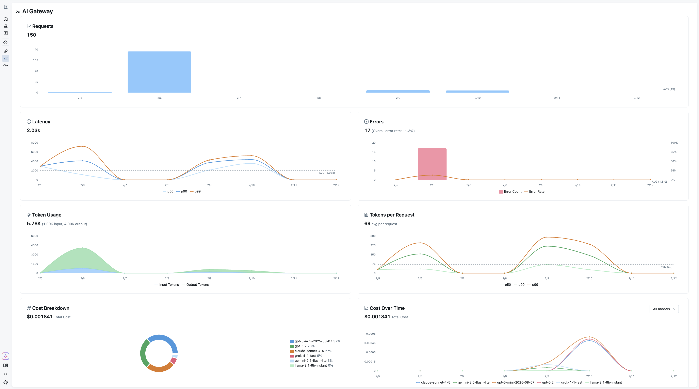
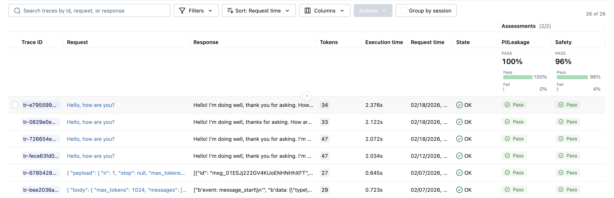

<p style={{ fontStyle: "italic", color: "gray", marginTop: "-16px" }}>
  Last updated: April 1, 2026
</p>

<div style={{ display: "flex", justifyContent: "center" }}>
  
</div>

As teams scale their GenAI applications, a familiar set of problems emerges. API keys get scattered across notebooks, CI environments, and individual developer machines. Different services call different providers through different SDKs. Nobody has a clear picture of how many tokens are being consumed, what requests are being made, or how much it all costs. And without a centralized layer governing what goes out to LLM providers, sensitive data, customer PII, internal documents, proprietary code can leak into third-party APIs without anyone noticing until it's too late. Traditionally, solving this has meant stitching together a separate AI gateway with your existing MLOps tooling, each with its own setup, configuration, and mental model.

MLflow AI Gateway was built to fix this without the integration tax. Because it runs as part of the MLflow Tracking Server you're already using for tracing and evaluation, you get governed LLM access in the same place you debug traces and run evaluations, no extra infrastructure to deploy or maintain.

## Why an Integrated Platform beats a Standalone Gateway + A Sprawl of Other Systems

A standalone AI gateway solves one piece of the puzzle: it proxies your LLM calls and centralizes credentials. But in practice, routing requests is just the beginning. You still need to trace what happened inside your application after the LLM responded, evaluate whether the output was actually good, and tie cost and latency data back to specific features, prompts, or model versions. With a standalone gateway, that means integrating a separate observability tool, a separate evaluation framework, and building the glue code to connect them all to the same data.

MLflow eliminates that integration tax. Because the gateway, tracing, and evaluation all live in the same platform:

- **Traces are automatic.** Every gateway request becomes an MLflow trace, no additional SDK or instrumentation required. Those traces include the full request/response payload alongside latency and token counts.
- **Evaluation runs on real traffic.** Traces captured through the gateway feed directly into MLflow's evaluation APIs, so you can run LLM judges over production data without exporting anything or wiring up a pipeline.
- **Debugging is one click away.** When the usage dashboard shows a latency spike or error rate increase, you can drill straight into the individual traces that caused it, no context-switching between tools.
- **Cost data has context.** Token usage isn't just a billing number; it's tied to application traces, so you can answer _why_ costs changed, not just _that_ they changed.

The alternative, stitching together a gateway, an observability platform, and an evaluation framework, creates data silos, duplicated configuration, and a fragile integration surface. Every new tool in the stack is another thing to deploy, monitor, and keep in sync. MLflow's approach is to make the gateway a natural extension of the platform teams are already using for GenAI development, so that governance and observability come for free rather than as an afterthought.

<video
  src={require("./gateway-usage-tracking.mp4").default}
  autoPlay
  muted
  controls
  playsInline
  width="100%"
/>

## One Endpoint, Any Provider

AI Gateway runs as part of the MLflow Tracking Server and exposes a **single, OpenAI-compatible endpoint** for every LLM provider your organization uses. It supports a wide range of providers out of the box: OpenAI, Anthropic, Google Gemini, Amazon Bedrock, Azure OpenAI, Cohere, and more. Whether you're hitting GPT-5, Claude 4.5, or an internally hosted model, your application code stays the same. Point the `base_url` at the gateway and use the endpoint name as the model identifier.

:::tip Native Provider Integrations, No LiteLLM Required
Starting with MLflow 3.11.0rc1, AI Gateway ships with **native provider integrations** for OpenAI, Anthropic, Google Gemini, Amazon Bedrock, Azure OpenAI, Mistral, Cohere, DeepSeek, Groq, TogetherAI, xAI, OpenRouter, Ollama, Vertex AI, and more, without requiring [LiteLLM](https://github.com/BerriAI/litellm) as a dependency. Fewer dependencies to manage, faster startup times, and a simpler deployment footprint. Additional providers are supported through optional dependencies, maintaining the same breadth of coverage as before.
:::

```python
from openai import OpenAI

client = OpenAI(
    base_url="https://your-mlflow-server/gateway/mlflow/v1",
    api_key="",  # authentication is handled by the gateway
)

response = client.chat.completions.create(
    model="prod-gpt5",          # name of the gateway endpoint
    messages=[{"role": "user", "content": "Summarize this support ticket..."}],
)
```

Switching from one provider to another, or rolling out a new model, becomes a configuration change in the gateway rather than a code change across every application that calls it.

For cases where you need provider-specific capabilities beyond the standard chat interface, the gateway also supports **passthrough endpoints**. These relay requests to the provider's API in its native format, so you can use the provider's own SDK directly, while the gateway still handles credentials and records usage. Here's an example with the Anthropic SDK:

```python
import anthropic

client = anthropic.Anthropic(
    base_url="https://your-mlflow-server/gateway/anthropic",
    api_key="dummy",  # authentication is handled by the gateway
)

response = client.messages.create(
    model="my-claude-endpoint",  # name of the gateway endpoint
    max_tokens=1024,
    messages=[{"role": "user", "content": "Summarize this support ticket..."}],
)
```

## Governance by Default

The gateway centralizes credential management: API keys are stored encrypted on the server and never exposed to clients. Individual teams and services authenticate to the gateway without ever needing direct access to provider credentials.

New endpoints can be created, updated, or removed from the MLflow UI without restarting the server, which makes it practical to manage configurations dynamically as your provider landscape evolves. The gateway also supports **traffic splitting** across multiple models, which is useful for gradual rollouts and A/B testing, and **automatic fallback chains** that route requests to a backup provider if the primary one is unavailable.

## Usage Tracking for Comprehensive Observability

Every request through the gateway is recorded as an MLflow trace when usage tracking is enabled. This means the same infrastructure you use for debugging your agents and RAG pipelines also gives you a complete audit trail of every LLM call made by every service in your organization.

The Usage Dashboard aggregates these traces into actionable metrics: request volume and error rates, latency percentiles (p50, p90, p99), per-request and cumulative token consumption, and cost broken down by model and provider. Filtering by endpoint or time range lets you drill into exactly where usage is concentrated or where latency spikes are occurring.

Because usage tracking is built on MLflow Tracing, you can also navigate directly from the dashboard into individual traces to inspect request payloads and responses, something that's invaluable when debugging unexpected behavior or verifying that a prompt change is behaving as intended.



## Native Integration with Tracing and Evaluation

The tight integration with MLflow's tracing infrastructure extends to evaluation. Traces captured through the gateway feed directly into `mlflow.genai.evaluate` or Evaluation Dataset APIs, so you can run judges over production traffic without any additional instrumentation. This closes the feedback loop between what your application actually does in production and the evaluation pipelines you use to validate changes before shipping them.



For a comprehensive guide to AI Gateway concepts, common use cases, and frequently asked questions, see the [AI Gateway FAQ](/ai-gateway).

## Getting Started

The gateway is included with MLflow and can be launched interactively to explore the UI:

```bash
pip install 'mlflow[genai]'
mlflow server
```

This command spins up a local tracking server, then the [quickstart guide](https://mlflow.org/docs/latest/genai/governance/ai-gateway/quickstart/) walks through connecting your own keys and endpoints.

---

AI Gateway is part of MLflow's broader commitment to making GenAI development observable and reliable from day one. If you run into any issues or have questions, please file a report on [MLflow's GitHub Issues](https://github.com/mlflow/mlflow/issues).

⭐ [Star us on GitHub](https://github.com/mlflow/mlflow) — show your support for the project!
