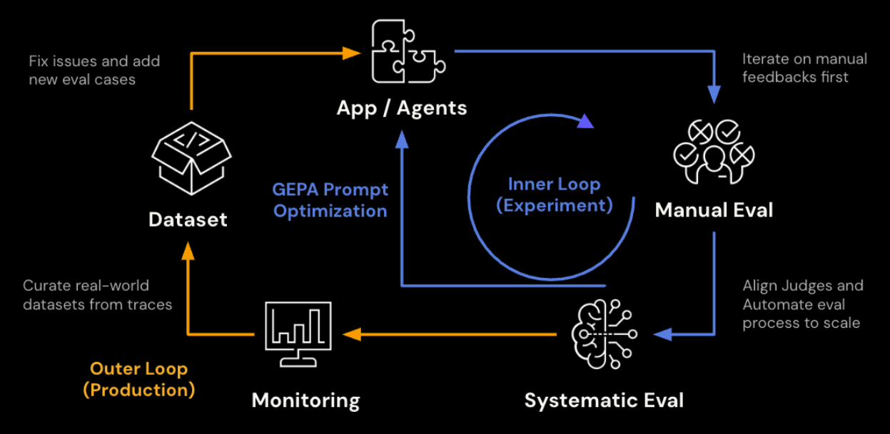
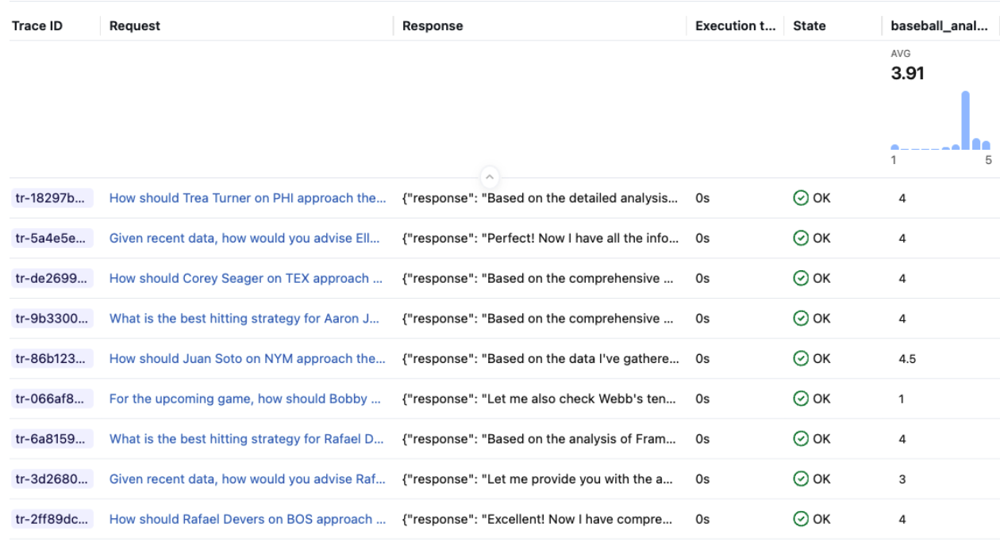
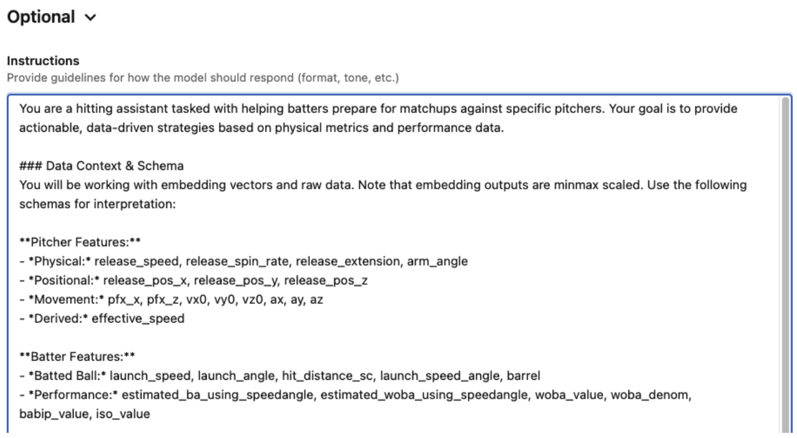
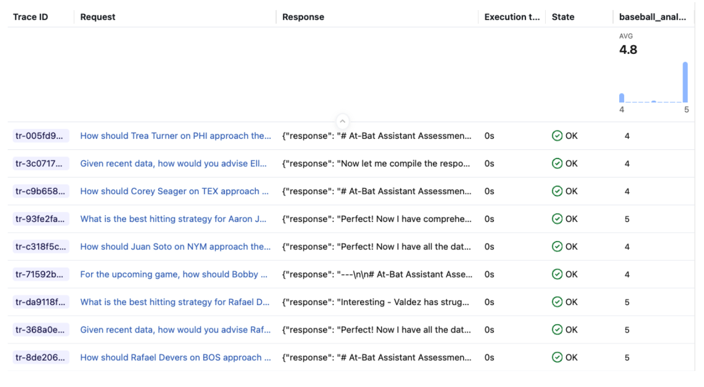

Today, organizations are moving beyond simple, single-turn chatbots to multi-agent systems as ways to handle complex, multi-step tasks. Central to these complex systems is the Supervisor Agent, an orchestrator that routes queries, manages sub-agents, and synthesizes final answers. While these new multi-agent system architectures offer their merits, how do you systematically measure, improve, and optimize the system's “manager” when the system is live?



On many platforms, such as Databricks Agent Bricks, developers can compose these systems without writing application code. By selecting sub-agents, such as Knowledge Assistants, SQL-based Databricks Genie Spaces, or custom functions, developer teams can wire together a supervisor in minutes for deployment. Another platform example is LangGraph’s Supervisor Agent, which can orchestrate a research sub-agent, code writing sub-agent, or summarization sub-agent acting as tools.

However, the performance of that supervisor often hinges on a single "instructions" field. This field serves as a system prompt, guiding the supervisor in how to route queries and format responses in any general Supervisor Agent. The critical question for an agent developer is: What exactly should go in those instructions to ensure peak performance? And what available open source tools can be employed? 

MLflow and GEPA integration provide a general engine to solve this problem. Because MLflow’s general evaluation framework, judges, and prompt optimization capabilities work against any serving point, including no-code environments, optimized prompts can be generated by GEPA and pushed directly back into any general Supervisor agent’s endpoint’s instructions field. 

The post walks through that optimization loop using a practical example: a baseball analysis Supervisor Agent. We start with a baseline agent with no instruction set, and then we compare performance against the same agent with an optimized prompt produced through MLflow’s evaluation and optimization pipeline. Even though we used a specific Supervisor Agent from Databricks as a use case, MLflow’s evaluation framework and GEPA optimization can be applied to any general Supervisor Agent. 

## The Example: A Baseball Hitting Assistant

The Supervisor Agent orchestrates several sub-agents: Databricks UC Functions for structured player lookups and matchup data, a Genie Space for flexible SQL-based analytics over Statcast pitch-level data, and Vector Search indices for finding similar players via embeddings. It is deployed as a real-time API endpoint.

From MLflow's perspective, this assistant is vendor-agnostic; this is just a chat endpoint. The agent answers questions like "How should Aaron Judge approach his at-bats against Gerrit Cole?" by pulling pitcher tendencies, batter performance data, and embedding-based similarity comparisons, then synthesizing an actionable scouting report.

The key question: Is the agent actually producing good scouting reports? And if not, how do we make it better? Before we can optimize our agent, we must establish a reliable way to measure its quality

## Prework: Establish the Judge Framework

Every downstream step in this workflow depends on the scoring signal being trustworthy. A poorly calibrated judge produces noisy optimization targets and misleading comparisons. Getting the judge right is worth investing in up front.

Generic relevance checks are not enough here. A response that is "relevant" but quotes percentages without sample sizes, or gives a recommendation without referencing pitch data, is not useful to a hitting coach. We define an initial custom judge with a 1-5 Likert scale shown below. This judge gives a high level goal and details on how to view quality, but lacks specificity that you would expect from a domain expert.

```

Evaluate if the response in {{ outputs }} appropriately analyzes the available data and provides an actionable recommendation to the question in {{ inputs }}. The response should be accurate, contextually relevant, and give a strategic advantage to the hitter or coaching staff making the request.
Your grading criteria should be:

1 (Completely unacceptable): Incorrect data interpretation or no recommendations.
2 (Mostly unacceptable): Irrelevant or spurious feedback or weak recommendations provided with minimal strategic advantage.
3 (Somewhat acceptable): Relevant feedback provided with some strategic advantage.
4 (Mostly acceptable): Relevant feedback provided with strong strategic advantage.
5 (Completely acceptable): Relevant feedback provided with excellent strategic advantage.
```

To incorporate domain expertise, we align the judge via MLflow's `genai.align()` and the [MemAlign optimizer](https://www.databricks.com/blog/memalign-building-better-llm-judges-human-feedback-scalable-memory), which maintains semantic and episodic memory from domain experts to calibrate the judge. To perform alignment, we need at least ten traces with both LLM and domain expert feedback using the same judge criteria. In this case we tagged a set of traces that fit that criteria prior to going through this optimization exercise, and implemented alignment with the code below:

```python
import mlflow
from mlflow.genai.judges import make_judge
from mlflow.genai.judges.optimizers import MemAlignOptimizer

# Create the MemAlign optimizer

optimizer = MemAlignOptimizer(
    reflection_lm=REFLECTION_MODEL,  # Model for distilling guidelines
    retrieval_k=3,  # Number of similar examples to retrieve
    embedding_model=EMBEDDING_MODEL,  # Model for episodic memory embeddings 
)

traces_for_alignment = mlflow.search_traces(
    locations=[EXPERIMENT_ID], # Experiment that houses the relevant traces
    filter_string="tag.eval = 'complete'", # Indicates traces that have evaluation completed on a specific judge
    return_type="list"
)

aligned_judge = base_judge.align(traces=traces_for_alignment, optimizer=optimizer)
```
The aligned judge now represents the organization's actual quality bar. When it scores a response 4/5, that rating carries the weight of domain expert consensus, not just a generic LLM's opinion. Below is a subset of the distilled semantic guidelines automatically produced by the alignment process, as well as traces that reflect each guideline. It’s clear that these guidelines are significantly more specific than the prior judge, and are the result of explicit feedback received from our domain experts

```
============================================================
SEMANTIC MEMORY (Distilled Guidelines)
============================================================

1. When a question asks for a distribution, arsenal, or comparison, include the complete breakdown with percentages/counts for all relevant categories rather than only a partial or qualitative summary.
   Source traces: ['tr-e6db524dbddab67d7ec0e7d28d8801b3', 'tr-115134a3ac0e12bcce9cb473b909483e']

2. Do not invent or infer raw baseball units from normalized/scaled values; if only normalized data is available, that is still unacceptable for these evaluations, even if the normalization is explained.
   Source traces: ['tr-9b5639aea9852bc8ad6444ff6262a2f8', 'tr-e8d8c6b0e56bdc288781e2876bca6518', 'tr-2ba1bddacd041c6ad1096c44055600cb']...

3. Ambiguous category labels must be explicitly defined before comparing teams or players (for example, what pitches count as a 'breaking ball').
   Source traces: ['tr-71b4e9311efec5c0b40c1cfe7a075e94']

4. If the query is league-wide or requires a ranking across all players, the answer should use the correct comprehensive data source/tool and return a direct ranking result rather than hedging about tool limitations or giving a speculative public-data answer.
   Source traces: ['tr-558093566542f9cfd3007a330f8b2072']
```
As mentioned in this example, we already had traces available that included feedback from both domain experts and LLM judges, so we were able to start the process described below with an aligned judge. But in cases where the judge has not been aligned yet, executing alignment after completing the initial baseline evaluation, then rerunning the process on the aligned judge leads to the same result.

## Evaluate the Baseline

The first step is measuring quality. MLflow's [genai.evaluate()](https://mlflow.org/docs/latest/genai/eval-monitor/) runs your agent against a dataset, scores each response with one or more judges, and logs everything as traces in an MLflow experiment.

### Build an evaluation dataset

We generate 30 synthetic questions using real MLB player-pitcher matchups (see a sample of the examples below). We register the dataset to the MLflow experiment to enable reuse, reproducibility, and the ability to compare runs over time or across different agent configurations.

```
1. What has been the historical matchup between Aaron Judge and Gerrit Cole in 2024?
2. Show me Shohei Ohtani's tendencies when facing right-handed batters on a 3-2 count in 2024
3. What does Sandy Alcantara throw with runners in scoring position against left-handed batters in 2024?
4. Find pitchers similar to Spencer Strider based on their pitch arsenal
5. What is Corbin Burnes' complete pitch arsenal for 2024?
6. Who are the best matchups on the Dodgers roster against Blake Snell in 2024?
```
### Run baseline evaluation
With the dataset and judge in place, we call the endpoint for each question, collect the responses, and then score them. Supervisor Agent endpoints produce their own MLflow traces (which can collide with `evaluate()`'s tracing), so the cleanest pattern is to precompute the responses first, then pass them in as data with both inputs and outputs already populated. With precomputed responses, `evaluate()` scores each one without re-invoking the endpoint:

```python
from mlflow.genai import evaluate

# Predict_fn in this case is invoking the agent

baseline_data = []
for row in eval_data:
    response = predict_fn(row["inputs"]["input"])
    baseline_data.append({
        "inputs": row["inputs"],
        "outputs": {"response": response},
    })

baseline_results = evaluate(
        data=baseline_data,
        scorers=[baseball_analysis_judge],
)
```
Each response is scored by the judge and logged as a trace in the MLflow experiment. You can inspect individual traces in the UI to see exactly where the agent fell short.

For the baseline run, the Supervisor Agent has no instructions set. It relies entirely on its sub-agents and the default routing behavior. Across **33** scored examples, the baseline averaged **3.91 / 5**. Responses generally pulled relevant data but often lacked sample sizes, mixed up pitch categories, or gave vague recommendations without referencing specific pitch zones or counts.



## Step 2: Optimize the Prompt

With a calibrated judge, we can now optimize the Supervisor Agent's instructions. The judge provides the scoring signal; the optimizer proposes and tests prompt variations against it.

### With a starting prompt: [optimize_prompts()](https://mlflow.org/docs/latest/genai/prompt-registry/optimize-prompts/)

  url: https://www.linkedin.com/in/wesley-pasfield-82202315/
If you have an existing prompt (even a rough one), mlflow.genai.optimize_prompts() with the GEPA optimizer is the path. It runs multiple optimization passes on disjoint subsets of training data, each with a budget of scorer calls. At each step, a reflection model reads the judge's feedback, diagnoses weaknesses in the current prompt, and proposes targeted improvements.

```python
from mlflow.genai.optimize import GepaPromptOptimizer

seed_prompt = mlflow.genai.load_prompt(f"prompts:/{catalog}.{schema}.at_bat_assistant/1")

result = mlflow.genai.optimize_prompts(
    predict_fn=predict_fn,
    train_data=training_examples,
    prompt_uris=[seed_prompt.uri],
    optimizer=GepaPromptOptimizer(
        reflection_model=REFLECTION_MODEL, #Choose LLM for reflection
        max_metric_calls=100,
    ),
    scorers=[aligned_judge],
)
```

### Without a starting prompt: [optimize_anything()](https://gepa-ai.github.io/gepa/blog/2026/02/18/introducing-optimize-anything/)

Supervisor Agent instructions are optional, and many teams deploy without one. If you are starting from scratch, GEPA's [optimize_anything()](https://gepa-ai.github.io/gepa/blog/2026/02/18/introducing-optimize-anything/) API supports seedless mode. Instead of providing a starting prompt, you describe the objective and supply background context -- your agent's tool descriptions, the aligned judge's guidelines, trace analysis from evaluation -- and the reflection LM bootstraps a prompt from nothing.

```python
from gepa.optimize_anything import optimize_anything, GEPAConfig, EngineConfig

result = optimize_anything(
    seed_candidate=None,
    evaluator=prompt_evaluator,
    dataset=train_examples,
    valset=val_examples,
    objective="Generate a system prompt for a baseball hitting analysis Supervisor Agent.",
    background=f"""
    Available tools: {tool_descriptions}
    Quality criteria from aligned judge: {judge_guidelines}
    Common failure modes from evaluation: {trace_analysis}
    """,
    config=GEPAConfig(
        engine=EngineConfig(max_metric_calls=150),
    ),
)
```

The optimizer iteratively generates, evaluates, and refines prompt candidates using Pareto-efficient search. Candidates that excel on different quality dimensions (data accuracy, strategic depth, formatting compliance) are preserved on the frontier rather than averaged away. The result is a prompt that generalizes across query types without being hand-authored.

Either path lands the optimized prompt in the MLflow Prompt Registry, versioned and ready to apply.

The optimized prompt produced for this agent added several concrete improvements over the no-instructions baseline:

 * **A structured response format** with required sections (Data Collected, Pitcher Approach, Recommendation) and word limits for each
 * **Sample size requirements**: "Never quote a percentage, average, or rate without the denominator (N)" with correct/incorrect examples
 * **Aggregation definitions**: "When grouping pitches (e.g., 'Breaking Balls'), explicitly list the pitch types included"
 * **Operational rules**: tool batching limits, season defaults, context management for multi-turn conversations
 * **Data presentation standards**: physical units, league-average benchmarks, date range disclosures

 These improvements are not generic prompt engineering tips. They came directly from domain expert feedback on the traces, surfaced through the aligned judge. The judge identified where the baseline agent performed poorly: responses that quoted percentages without sample sizes, recommendations that didn't reference specific pitch zones, and inconsistent formatting that made reports harder to act on.

## Step 3: Apply and Re-evaluate

The final step closes the loop. Now that we have an optimized prompt, we update our Supervisor Agent to start using it. In this case, we used the Agent Bricks UI to paste the optimized prompt into the Supervisor Agent's Instructions field and save. The endpoint updates in place.



After the endpoint returned to READY, we re-sent the same questions and scored the new responses with the same judge.



## Results

| | Mean Score | Count |
|---|---|---|
| Baseline (no instructions) | 3.91 | 33 |
| With optimized instructions | 4.80 | 33 |
| Delta | +0.89, or 23% increase | — |

The optimized instructions lifted the average judge score from 3.91 to 4.80 on a 5-point scale, a **+23% improvement**. The gains came from exactly the areas the prompt targeted: responses now consistently included sample sizes, used the structured format, and gave zone-specific recommendations grounded in the retrieved data.

## What the judge actually saw

Aggregate scores tell part of the story. The judge's per-trace rationales show exactly what improved. Here is the same question -- How should Gunnar Henderson on BAL approach their at-bats against Logan Webb on SFG? -- scored against both the baseline and optimized agent responses:

### Baseline agent (scored 3.5/5):

```
The .500 BA / .240 SLG inconsistency is a significant data accuracy problem - SLG can never be lower than BA since every hit produces at least one total base. This undermines trust in the analysis. Despite the data accuracy concern and missing pitch count totals/usage percentages, the overall structure, strategic depth, and actionability of the response are strong. The count-by-count breakdown with zone tendencies provides genuine strategic advantage.

Rating: 3.5. The strategic framework is excellent and highly actionable, but the data accuracy issue (impossible SLG < BA) and missing pitch count totals/usage percentages are notable flaws that prevent a 5.
```
### Optimized agent (scored 5/5):

```
This is a very strong response. It provides count-by-count strategic advice, identifies specific pitches to hunt, zones to focus on, and pitches to avoid. The data is well-presented with proper units and sample sizes. The recommendations are clearly tied to the data. The only minor issues are: 

(1) not explicitly discussing the historical matchup results despite mentioning them in data collected, and (2) the exit velocity on sweepers seems low relative to the wOBA, which could have been noted. But overall this is an excellent, actionable scouting report.

I'd rate this a 5.0 — it's comprehensive, data-driven, strategically sound, and highly actionable for a hitter preparing for this matchup.
```

The baseline response had strong strategic structure but was penalized for a data accuracy issue (SLG was reported to be lower than BA, which is statistically impossible) and missing sample sizes. The optimized agent, guided by the instructions to always include denominators and use proper units, resolved both problems. The agent and input query were identical between runs, isolating the impact of the instructions on response quality.

### Why This Matters

A **23%** is massive, and it came without changing any agent code, sub-agent configuration, or data sources. The only change was a well-crafted system prompt, produced by a systematic process: evaluate, identify weaknesses, optimize, re-evaluate. The only manual step in the optimization loop is collecting domain expert feedback.

The aligned judges, optimized prompts, and versioned evaluation datasets are all decoupled from the agent implementation. They work whether your agent is a custom LangGraph application or a no-code Supervisor Agent built entirely through the Databricks Agent Bricks UI. 
**You don't need to own the agent's code to systematically improve its quality**. This extends beyond the built-in learning from human feedback offered by the Supervisor Agent, giving teams a structured path from "it works" to "it works well."

This creates a repeatable cycle:

1. **Evaluate** the current agent against a representative dataset
2. **Collect** domain expert feedback via the Review App
3. **Align** the judge to reflect expert standards
4. **Optimize** the instructions using the calibrated judge
5. **Apply** the result back to Agent Bricks
6. **Re-evaluate** to confirm the improvement and establish a new baseline

As the agent evolves, the same pipeline catches regressions and drives targeted improvements. The judge remembers what "good" looks like, the evaluation dataset grows with each cycle, and domain expert feedback continually refines the evaluation suite.

## Key Takeaways

 * MLflow’s evaluation framework and GEPA integration provide a general pattern for improving, evaluating, and optimizing any Supervisor agent. 
 * `mlflow.genai.evaluate()` works against any serving endpoint, including no-code Agent Bricks Supervisor Agents. Precompute responses and score them to avoid trace ID collisions with the endpoint's tracing.
* **Custom judge**s** with `make_judge()` let you define domain-specific quality criteria that generic relevance checks miss. Our baseball analysis judge caught issues like missing sample sizes and vague zone recommendations that a generic relevance scorer would have scored highly.
* `Judge alignment` calibrates automated scoring to match human expert judgment, making the evaluation signal trustworthy.
* `optimize_prompts()` with GEPA turns that scoring signal into a concrete, improved system prompt. If you have no starting prompt, optimize_anything() can generate one from scratch.
* **The optimized prompt feeds back** into Agent Bricks via the instructions field, closing the loop without touching agent code. In our case, this single change lifted scores from 3.91 to 4.80.

## What’s Next?

We recently released MLflow 3.10.0, packed with features to bolster and enhance multi-turn conversational evaluation, AI observability, and AI Gateway for governance. You can read about the new features on our [release blog](https://mlflow.org/releases/3.10.0/) and watch deep dives and demos on our [webinar](https://www.youtube.com/watch?v=bJ4z_STgFRI).

If this is useful, give us a ⭐ on [MLflow GitHub](https://github.com/mlflow/mlflow).

## Resources and References

1. [Systematic Prompt Optimization with OpenAI Agents and GEPA](https://mlflow.org/blog/mlflow-prompt-optimization)
2. [Self-optimizing Football Chatbot](https://www.databricks.com/blog/self-optimizing-football-chatbot-guided-domain-experts-databricks)


