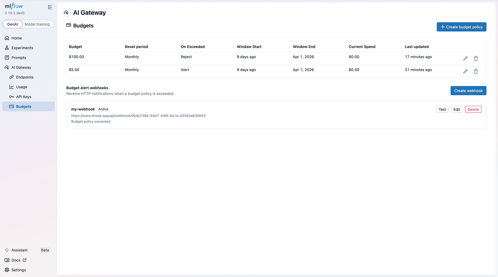
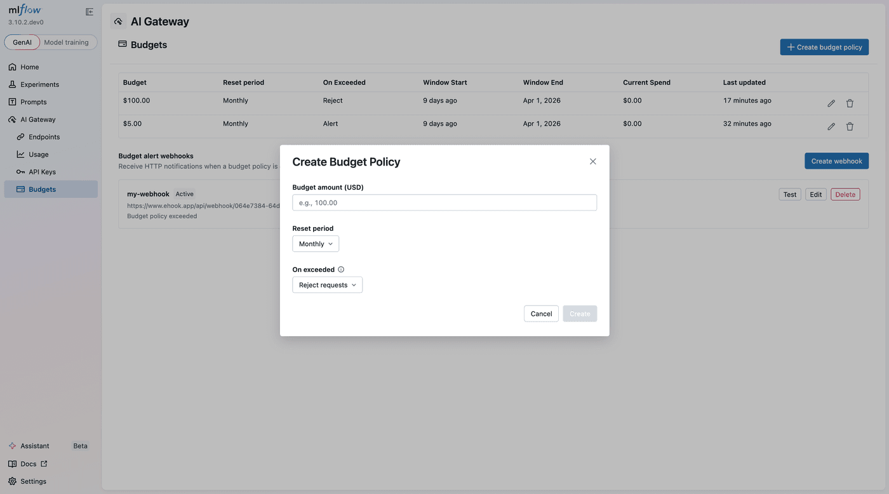

<video
  src={require("./gateway-budget.mp4").default}
  autoPlay
  muted
  controls
  playsInline
  width="100%"
/>

One of the most common challenges teams face when scaling GenAI applications is runaway LLM costs. A misconfigured prompt, an unexpected traffic spike, or a forgotten development endpoint can quietly burn through thousands of dollars before anyone notices. Until now, catching these issues required external monitoring or manual review of usage dashboards after the fact.

MLflow AI Gateway now includes **budget policies** — configurable spending thresholds that alert you or automatically block requests when costs exceed a defined limit. Because budgets are enforced at the gateway layer, they apply consistently across every application and service that routes through the gateway, regardless of which provider or model is being called.

{/* truncate */}

## How Budget Policies Work

A budget policy defines a **spending threshold in USD** over a recurring time window. When cumulative spend within that window crosses the threshold, the gateway takes one of two actions:

- **Alert**: Fires a webhook notification while allowing requests to continue. This is useful for visibility without disrupting production traffic.
- **Reject**: Blocks all subsequent requests with an HTTP 429 response.

Budgets reset automatically at the start of each new time window:

| Window  | Resets at                       |
| ------- | ------------------------------- |
| Daily   | Midnight UTC                    |
| Weekly  | Sunday midnight UTC             |
| Monthly | 1st of each month, midnight UTC |

You can scope budget policies to specific workspaces when workspaces are enabled, allowing per-team or per-project spend tracking and enforcement.



## Creating a Budget Policy

Setting up a new budget policy is straightforward from the MLflow UI. Specify the budget amount, time window, action (alert or reject), and optionally scope it to a workspace.



## Alert Webhooks

When a budget threshold is exceeded, the gateway delivers a webhook payload containing key details including the budget policy ID, the configured budget amount, current spend, the time window, target scope, and window start timestamp.

Importantly, **the alert fires once per window**. Subsequent requests within the same window do not trigger additional webhooks, keeping your notification channels clean.

This makes it straightforward to integrate budget alerts into existing incident response workflows — pipe the webhook into Slack, PagerDuty, or any HTTP-based alerting system.

## Tracker Strategies: Local vs. Redis

Budget tracking needs to maintain running spend totals across requests. The gateway supports two strategies depending on your deployment topology:

### Local Tracker

- Tracks spend in-process with no external dependencies
- Lowest possible latency
- Budget state is **not shared** across workers or replicas
- Survives restarts via trace backfill

This is the right choice for single-instance deployments or development environments.

### Redis Tracker

- Shares state across all gateway workers and replicas
- Atomic operations ensure race-free budget enforcement
- Requires the `MLFLOW_GATEWAY_BUDGET_REDIS_URL` environment variable and `pip install redis`
- Adds a small per-request latency overhead for Redis round-trips

For production deployments running multiple gateway replicas, Redis ensures budgets are enforced globally rather than per-instance.

## Getting Started

Budget policies are managed through the MLflow API and are available to admin users when authentication is enabled. To start using budget policies:

1. **Install MLflow with GenAI support:**

```bash
pip install 'mlflow[genai]'
```

2. **Start the tracking server:**

```bash
mlflow server
```

3. **Configure budget policies** through the API — set your threshold, choose your time window, pick an action (alert or reject), and optionally scope to a workspace.

The `MLFLOW_GATEWAY_BUDGET_REFRESH_INTERVAL` environment variable controls how frequently policies are re-fetched (default: 600 seconds).

For full configuration details and API reference, see the [Budget Alerts & Limits documentation](https://mlflow.org/docs/latest/genai/governance/ai-gateway/budget-alerts-limits/).

---

Budget policies are part of MLflow's ongoing effort to make AI Gateway a complete governance layer for LLM access. Combined with [usage tracking and the observability features](/blog/mlflow-ai-gateway) already available, teams now have the tools to not only understand their LLM spend but actively control it.

If you run into any issues or have feedback, please file a report on [MLflow's GitHub Issues](https://github.com/mlflow/mlflow/issues).

⭐ [Star us on GitHub](https://github.com/mlflow/mlflow) — show your support for the project!
