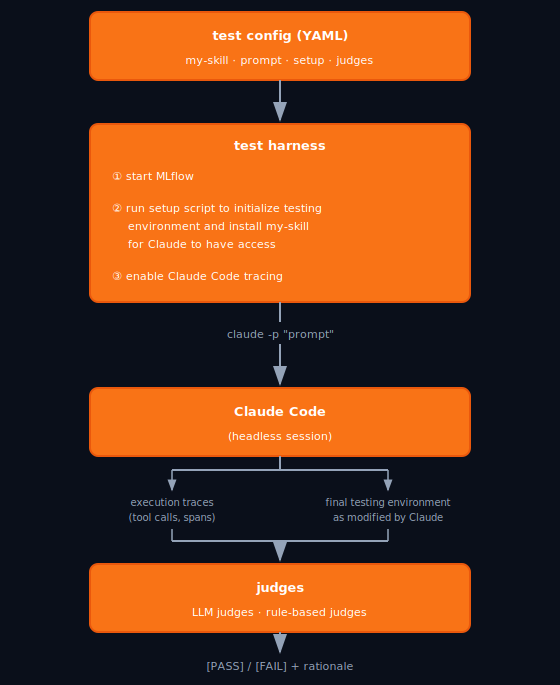
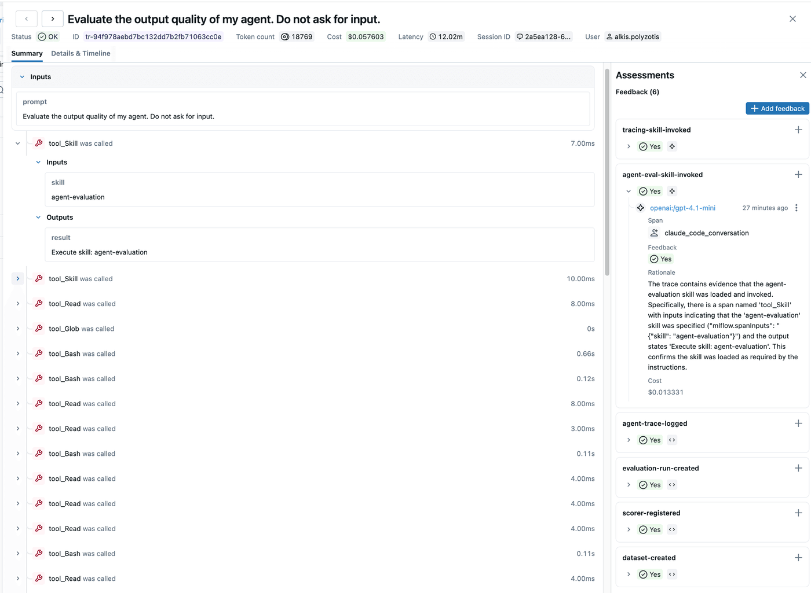

## The Skill Testing Problem

You wrote a Claude Code skill: a `SKILL.md` file that extends Claude with a new capability. You tested it manually and it looks right. But how do you _know_ it reliably works?

The problem is fundamental: a skill guides LLM behavior, and LLM behavior is inherently unpredictable. You can't assert `output == expected_output`. You need to observe _what Claude did_: which tools it called, what steps it took, whether it made the right judgment calls. Doing this manually means keeping a record of every Claude interaction and verifying outcomes case by case — time-consuming, and you have to repeat it every time the skill changes.

Here's the loop we built to solve this:

1. **Trace** Claude Code's own execution with MLflow while it runs the skill
2. **Judge** those traces with checks that verify correct behavior
3. **Refine** the skill based on failing judges, automatically, with Claude Code itself

If this sounds familiar, it should. It mirrors what software engineers do when fixing bugs with Claude Code: write unit tests that express the expected behavior, then ask Claude to refine the code until all tests pass. We apply the same pattern here, but the "code" being refined is a skill.

This is also the methodology we use to develop and refine our [Claude Code Skills for MLflow](https://github.com/mlflow/skills).

## What Is a Claude Code Skill?

A skill is a markdown file with YAML frontmatter that Claude Code reads before acting. The `description` field tells Claude when to load it, and the body progressively provides instructions on how to execute the skill, including examples and tool guidance.

Here's the frontmatter from the `agent-evaluation` skill in the [MLflow Skills repo](https://github.com/mlflow/skills), which we will use as our running example:

```yaml
---
name: agent-evaluation
description:
  Use this when you need to EVALUATE OR IMPROVE or OPTIMIZE an existing
  LLM agent's output quality ... Evaluates agents systematically using MLflow
  evaluation with datasets, scorers, and tracing. IMPORTANT - Always also load
  the instrumenting-with-mlflow-tracing skill before starting any work.
allowed-tools: Read, Write, Bash, Grep, Glob, WebFetch
---
```

This skill guides Claude through the full evaluation workflow: run the agent to understand its behavior, [select appropriate quality scorers](https://mlflow.org/docs/latest/genai/eval-monitor/scorers/index.html), [prepare an evaluation dataset](https://mlflow.org/docs/latest/genai/datasets/), and [execute `mlflow.genai.evaluate()`](https://mlflow.org/docs/latest/genai/eval-monitor/index.html) to get a systematic quality assessment.

The body is a complete walkthrough: discover the agent structure, set up [tracing](https://mlflow.org/docs/latest/genai/tracing/index.html), select [LLM scorers](https://mlflow.org/docs/latest/genai/eval-monitor/scorers/index.html), create an [evaluation dataset](https://mlflow.org/docs/latest/genai/datasets/), and run [`mlflow.genai.evaluate()`](https://mlflow.org/docs/latest/genai/eval-monitor/index.html). It's authoritative guidance, and whatever Claude reads here shapes every decision it makes.

This is what makes skills hard to test: there is no output to compare against. Going back to the `agent-evaluation` skill, the question "Did Claude discover the agent's entry point before trying to evaluate it?" cannot be checked with `assertEqual`.

## Example: Testing and Improving a Claude Code Skill with MLflow

We'll use the `agent-evaluation` skill as a concrete example — all the test code lives in the [`tests/` directory](https://github.com/mlflow/skills/tree/main/tests) of the skills repository.

Before diving into the details, here's how the pieces of our methodology fit together.



_The test harness orchestrates environment setup, headless Claude Code execution, and judge evaluation in a single reproducible run._

A test harness runs Claude Code headlessly against a target project with the skill installed. MLflow traces every action Claude takes during the session, e.g., file reads, shell commands, API calls, tool calls, to name a few. After Claude finishes, a set of judges runs against those traces to check whether Claude executed the skill correctly.

Each judge evaluates one specific aspect of the trace: whether a particular artifact was created, whether Claude followed the right sequence of steps, whether it invoked the right tools. If all judges pass, the skill worked as intended. If any judge fails, the rationale points directly at what went wrong.

This gives us a reproducible, observable check of skill behavior that requires no human in the loop. The following sections walk through each component in detail.

### Tracing Claude Code with MLflow

MLflow ships with [built-in support for tracing Claude Code](https://mlflow.org/docs/latest/genai/tracing/index.html) itself. A single command instruments every session in a project directory:

```bash
mlflow autolog claude /path/to/project \
  --tracking-uri http://127.0.0.1:5000 \
  --experiment-id 42
```

From that point on, every tool call Claude makes (reading a file, running a shell command, calling the Claude API) becomes a span in a trace. The trace is a ground-truth record: not what Claude said it did, but what it _actually_ did, in order, with full inputs and outputs.

### Writing Judges

A _judge_ is a check that verifies a specific aspect of how Claude executed the skill. Judges are implemented as MLflow [scorers](https://mlflow.org/docs/latest/genai/eval-monitor/scorers/index.html): each receives a Claude Code trace and returns `Feedback` with a value and rationale. Two patterns cover almost every test:

**LLM judge**

Use [`make_judge()`](https://mlflow.org/docs/latest/genai/eval-monitor/scorers/llm-judge/custom-judges/#trace-based-judges) to semantically analyze the trace:

```python
from mlflow.genai.judges import make_judge
from typing import Literal

agent_ran_instrumented_code = make_judge(
    name="agent-ran-instrumented-code",
    instructions=(
        "Examine the {{ trace }} and determine whether the agent ran the "
        "application or agent code after adding MLflow tracing instrumentation. "
        "Look for evidence that the agent executed the instrumented program "
        "(e.g., running a CLI command, calling an entry point, executing a script). "
        "Return 'yes' if the agent ran the code after instrumenting it, 'no' otherwise."
    ),
    feedback_value_type=Literal["yes", "no"],
)
```

This [judge](https://mlflow.org/docs/latest/genai/eval-monitor/scorers/llm-judge/custom-judges/#trace-based-judges) reads the actual span tree and reasons about whether the _sequence_ of actions was correct. No rule can do that.

**Rule-based judge**

Check a side effect in the final testing environment which was modified by the execution of the skill (see [`dataset_created.py`](https://github.com/mlflow/skills/blob/main/tests/judges/dataset_created.py)):

```python
from mlflow import MlflowClient
from mlflow.entities import Feedback
from mlflow.genai.scorers import scorer

@scorer(name="dataset-created")
def dataset_created(trace) -> Feedback:
    client = MlflowClient()
    datasets = client.search_datasets(experiment_ids=[eval_exp_id])
    if datasets:
        return Feedback(
            value="yes",
            rationale=f"Found {len(datasets)} dataset(s) in experiment {eval_exp_id}",
        )
    return Feedback(
        value="no",
        rationale=f"No datasets found in experiment {eval_exp_id}",
    )
```

This judge does not evaluate Claude's internal behavior, but rather it checks whether Claude created the artifact we expected. You can browse all the judges for the `agent-evaluation` test in the [tests/judges/](https://github.com/mlflow/skills/tree/main/tests/judges) directory.

Both types are needed: LLM judges handle behavioral and sequential questions, while rule-based judges provide deterministic checks on observable side effects.

Going back to our running example, the full test for `agent-evaluation` uses six judges, each checking one requirement:

- [`dataset-created`](https://github.com/mlflow/skills/blob/main/tests/judges/dataset_created.py): did Claude call `mlflow.genai.datasets.create_dataset()`?
- [`scorer-registered`](https://github.com/mlflow/skills/blob/main/tests/judges/scorer_registered.py): did Claude register a scorer before evaluation?
- [`evaluation-run-created`](https://github.com/mlflow/skills/blob/main/tests/judges/evaluation_run_created.py): did `mlflow.genai.evaluate()` produce a run?
- [`agent-trace-logged`](https://github.com/mlflow/skills/blob/main/tests/judges/agent_trace_logged.py): did the agent under evaluation produce traces?
- [`tracing-skill-invoked`](https://github.com/mlflow/skills/blob/main/tests/judges/tracing_skill_invoked.py): did Claude load the tracing skill as instructed?
- [`agent-eval-skill-invoked`](https://github.com/mlflow/skills/blob/main/tests/judges/agent_eval_skill_invoked.py): did Claude actually read and follow the skill?

Each judge is asking whether Claude followed the skill's workflow — did it create the expected artifacts, follow the right sequence of steps, and invoke the right tools? Together they define the acceptance criteria for the skill. If all six pass, the skill works.

The screenshot below shows an MLflow trace from a real `agent-evaluation` skill run. The left panel shows Claude's span tree — the sequence of tool calls it made, starting with loading the skill. The right panel shows all six judges passing, with the rationale for each LLM judge visible inline.



_The MLflow trace viewer showing Claude's tool call sequence (left) and the six judge assessments (right). The `agent-eval-skill-invoked` judge's rationale explains exactly why the trace passes: Claude loaded the skill and followed its instructions._

### Running the Tests

A YAML config ties the methodology together. You can see the full config for this example at [`tests/configs/agent_evaluation.yaml`](https://github.com/mlflow/skills/blob/main/tests/configs/agent_evaluation.yaml):

```yaml
name: "agent-evaluation-test"
project_dir: mlflow-agent

setup_script: tests/scripts/setup_agent_eval.py
skills:
  - agent-evaluation
  - instrumenting-with-mlflow-tracing

prompt: "Evaluate the output quality of my agent. Do not ask for input."
timeout_seconds: 900
allowed_tools: "Bash,Read,Write,Edit,Grep,Glob,WebFetch"

judges:
  - tests/judges/dataset_created.py
  - tests/judges/scorer_registered.py
  - tests/judges/evaluation_run_created.py
  - tests/judges/agent_trace_logged.py
  - tests/judges/tracing_skill_invoked.py
  - tests/judges/agent_eval_skill_invoked.py
```

[`test_skill.py`](https://github.com/mlflow/skills/blob/main/tests/test_skill.py) orchestrates the full sequence:

1. Start a local MLflow server and create two experiments: one for the evaluation work the skill is guiding, and one for Claude's own execution traces
2. Run the setup script (clone the target agent repo, seed test data)
3. Install skills into `PROJECT_DIR/.claude/skills/`
4. Enable tracing: `mlflow autolog claude PROJECT_DIR`
5. Run `claude -p "PROMPT"` headlessly
6. Wait for traces to flush, then run all judges on traces created after step 4

```bash
python tests/test_skill.py tests/configs/agent_evaluation.yaml
```

Sample output:

```
[PASS] dataset-created on trace tr-abc123: yes
[PASS] scorer-registered on trace tr-abc123: yes
[PASS] evaluation-run-created on trace tr-abc123: yes
[FAIL] agent-ran-instrumented-code on trace tr-abc123: no
       Rationale: Claude added tracing decorators but did not execute the agent
                  afterward. No CLI invocation was found after the instrumentation step.
```

That last line is actionable. Claude didn't run the agent after instrumenting it, so the skill didn't make this step explicit enough.

A few things worth noting about this setup. The setup script is flexible: it can clone any repository, install dependencies, and seed whatever data the skill needs. And a single skill can be covered by multiple configs with different prompts, letting you verify that the skill triggers (or doesn't trigger) correctly under a range of conditions.

## The Automated Refinement Loop

Here's where it gets interesting: when judges fail, we don't fix the skill manually; instead, we feed the failing trace and judge rationale back to Claude Code and ask it to fix the corresponding `SKILL.md`.

Here is the conceptual loop:

```
while judges_fail:
    run test → collect failing judge rationales
    claude -p "Judge '{name}' failed with rationale: '{rationale}'. Fix SKILL.md."
    rerun test
```

Two real examples from the `agent-evaluation` skill's history illustrate exactly how this played out.

**Example 1: Claude bypassing MLflow entirely**

Early runs saw [`dataset-created`](https://github.com/mlflow/skills/blob/main/tests/judges/dataset_created.py) and [`evaluation-run-created`](https://github.com/mlflow/skills/blob/main/tests/judges/evaluation_run_created.py) both fail. Inspecting the trace revealed why: Claude had created an `evaluation/eval_dataset.py` file with a hand-rolled evaluation loop, completely bypassing MLflow's APIs. No dataset in MLflow, no run logged. The judges had nowhere to find success.

Claude Code read the trace, saw the custom file creation, and made this addition to `SKILL.md`:

```diff
+## ⛔ CRITICAL: Must Use MLflow APIs
+
+**DO NOT create custom evaluation frameworks.** You MUST use MLflow's native APIs:
+
+- **Datasets**: Use `mlflow.genai.datasets.create_dataset()` - NOT custom test case files
+- **Scorers**: Use `mlflow.genai.scorers` and `mlflow.genai.judges.make_judge()` - NOT custom scorer functions
+- **Evaluation**: Use `mlflow.genai.evaluate()` - NOT custom evaluation loops
+
+**Why?** MLflow tracks everything (datasets, scorers, traces, results) in the experiment.
+Custom frameworks bypass this and lose all observability.
+
+If you're tempted to create `evaluation/eval_dataset.py` or similar custom files,
+STOP. Use `scripts/create_dataset_template.py` instead.
```

Next run: `dataset-created` and `evaluation-run-created` both pass.

**Example 2: A missing skill dependency**

The [`tracing-skill-invoked`](https://github.com/mlflow/skills/blob/main/tests/judges/tracing_skill_invoked.py) judge kept failing: Claude was attempting evaluation without first loading the tracing skill, even though `SKILL.md` listed it as a prerequisite. The problem was in the skill's `description` field, the trigger text Claude reads _before_ loading the skill body. It said nothing about the tracing skill dependency.

One line added to the description:

```diff
-description: Use this when you need to EVALUATE OR IMPROVE or OPTIMIZE an existing
- LLM agent's output quality ...
+description: Use this when you need to EVALUATE OR IMPROVE or OPTIMIZE an existing
+ LLM agent's output quality ... IMPORTANT - Always also load the
+ instrumenting-with-mlflow-tracing skill before starting any work.
```

The `tracing-skill-invoked` judge has passed on every run since.

Both fixes share the same shape: Claude reads the trace, identifies the gap between what it did and what the judge expected, and makes a targeted edit. The skill author never had to debug by hand.

MLflow is what makes the loop _grounded_. Claude isn't guessing what went wrong from a vague description in the prompt. It's reading the full span tree: the exact tool calls it made, in order, with timestamps. The diagnosis is direct.

Because multiple test configs can cover the same skill, Claude can run the full suite against its revisions of `SKILL.md`. This prevents overfitting the skill to any single prompt or test case: a fix that addresses one failing test config must not cause another to regress.

## What We Learned

A few patterns emerged from running this system on the `agent-evaluation` skill:

**Write judges before you polish the skill.** The judges are the specification. Writing them first forces you to articulate what success actually means, and often reveals that your initial skill draft was underspecified. A skill that passes all its judges on the first try probably has judges that are too weak.

**Traces reveal surprising gaps.** The [`tracing-skill-invoked`](https://github.com/mlflow/skills/blob/main/tests/judges/tracing_skill_invoked.py) judge caught cases where Claude attempted evaluation without loading the tracing skill, despite SKILL.md listing it as a prerequisite. The fix was a single sentence in the `description` field, the text Claude reads before loading the skill body. Without the trace, this failure mode would have been invisible: there's nothing in the output that signals a missing skill dependency.

**Both judge types are needed.** LLM judges and rule-based judges serve different purposes. LLM judges handle behavioral and sequential questions that no rule can express. Rule-based judges provide deterministic checks on side effects: a dataset was created, a run was logged. Use both.

**The rationale is the real value.** `Feedback.rationale` is what makes automated refinement possible. A bare yes/no from an LLM judge gives Claude Code nothing to work with. A rationale like "Claude added tracing decorators but never executed the agent afterward" gives it exactly what it needs to make a targeted, surgical fix.

## Get Started

```bash
git clone https://github.com/mlflow/skills.git
cd skills
pip install "mlflow[genai]" pyyaml
export OPENAI_API_KEY=...   # needed for LLM judges
export REPO_URL=https://github.com/your-org/your-agent  # agent repo to evaluate
python tests/test_skill.py tests/configs/agent_evaluation.yaml
```

The test spins up a local MLflow server, clones a sample agent repo, runs Claude Code headlessly, and prints judge results. Add your own judges to `tests/judges/` and reference them in a new YAML config.

Adopting this methodology for your own skill takes minutes: write a YAML config, define your judges, and run the test. From there, you never have to debug a skill by hand — Claude reads the failing trace and fixes the skill itself. The approach scales to any Claude Code skill, whether you're testing a two-step guide or a complex multi-step workflow.
