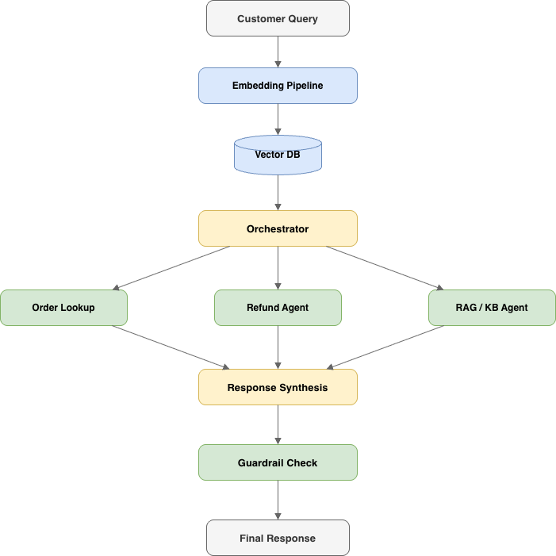
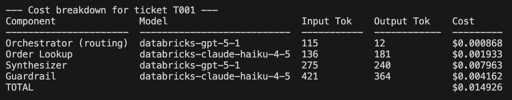
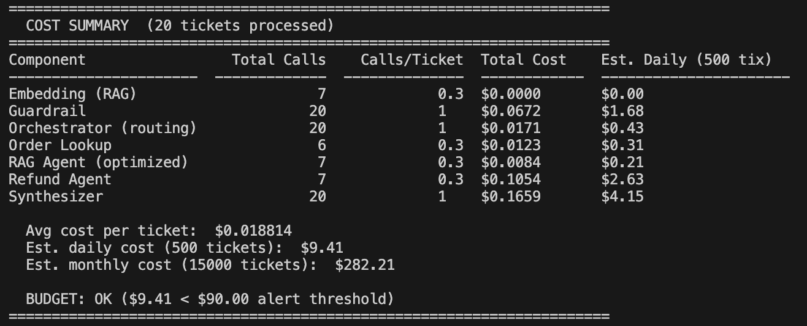
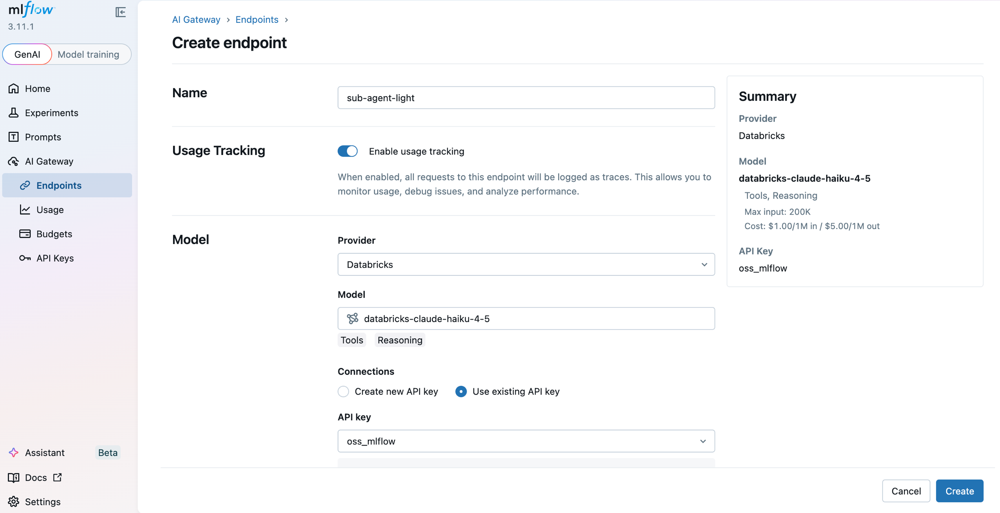
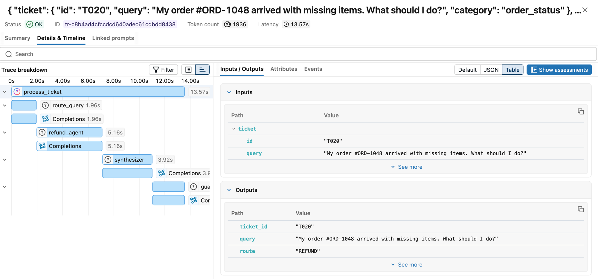
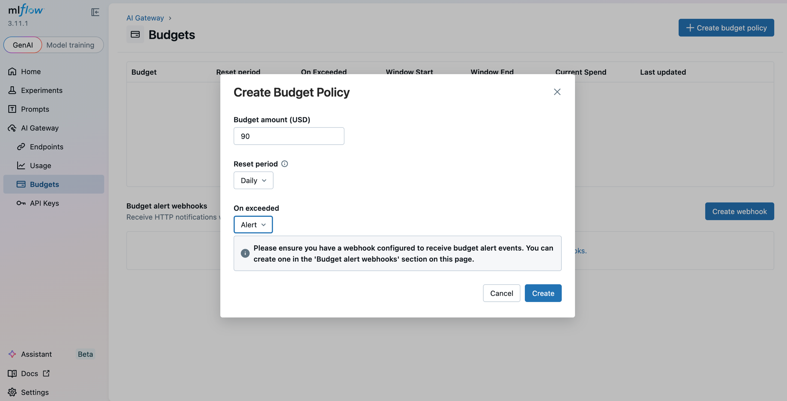
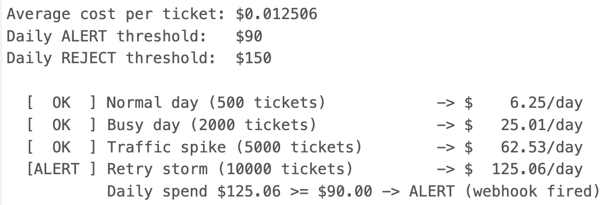

The hardest part of controlling agent costs isn't setting a budget, it's knowing which part of your agent is driving up costs before you invest in the wrong optimization.

This post walks through how to use MLflow AI Gateway as the control plane for a multi-agent system. We'll use a production-style customer support agent as the example, showing how to pinpoint exactly where costs accumulate across agent steps, identify what to optimize, and set budget alerts before spend gets out of hand.

> **Note:** The cost figures throughout this post are illustrative. Actual costs will vary depending on your provider, pricing tier, and token volumes.

<!-- truncate -->

## Meet the Agent

Our agent, let's call it SupportBot, is a multi-agent system built to handle tier-1 customer support. Here's the architecture:



When a customer sends a message, the **embedding pipeline** converts the query into a vector and retrieves relevant context from our knowledge base. The **orchestrator** reads the query and decides which sub-agent to invoke: the **order lookup agent** for "where's my package?" questions, the **refund agent** for return requests, or the **RAG agent** for general policy and product questions. After the sub-agent responds, the orchestrator synthesizes a final answer and runs it through a **guardrail check** to catch PII leakage or off-brand tone before it reaches the customer.

Each component does its job well. However, nobody modeled what it costs to run it.

## The Hidden Cost Anatomy of a Single Ticket

Every ticket triggers a chain of calls. Each link in that chain has a price tag.

1. **Embedding:** converting the query to a vector for knowledge base retrieval
2. **Orchestrator routing:** an LLM decides which sub-agent handles the request
3. **Sub-agent execution:** the actual work which may need additional calls if the agent retries or invokes a tool
4. **Response synthesis:** the orchestrator writes the customer-facing reply
5. **Guardrail check:** one more LLM call to verify safety and tone

**One question = 4–6 LLM calls, if no errors happen.**

Here's the cost breakdown for a single ticket — ticket T001, an order status query:



Four LLM calls, four different cost contributions. The orchestrator routing is cheap ($0.0009), but the synthesizer and guardrail together account for over 80% of the total. Now multiply that across every ticket, every day.

Here's what that looks like at 500 tickets per day across 20 sample tickets:



At \~$9.40/day with 500 tickets, the math feels manageable. But scale to 10,000 tickets per day and it's **\~$188/day — roughly $5,650/month**. If context windows bloat or retry rates spike during provider outages, costs can easily double.

The problem isn't that any single call is expensive. It's that agent costs are **multiplicative**, not additive, and this multiplicative call pattern is one of the most consistently reported causes of production cost shock in multi-agent systems.

## Before You Scale: A Pre-Ship Checklist

Before your agent handles its first production ticket, make sure you have these five points in place. Each one maps to a later section in this post, think of this as the minimum viable cost infrastructure:

| # | Checkpoint | Why It Matters |
|---|-----------|---------------|
| 1 | Route all LLM calls through a gateway | Single control plane for credentials, traffic, and cost tracking |
| 2 | Enable autologging and tracing from day one | You can't optimize what you can't measure |
| 3 | Set at least one budget alert policy | Catches runaway spend before it becomes a crisis |
| 4 | Instrument cache hit/miss tracking | Ensures dashboards stay accurate when caching is added later |
| 5 | Define "cost per resolved ticket" as your north-star metric | Ties LLM spend to business outcomes, not raw API calls |

If you're already in production without these, that's fine, every step below is retrofittable. But if you're still building, this is the cheapest time to wire them in.

## Step 1: Route Through the Gateway

The first step is simple but foundational: route all LLM calls through [MLflow AI Gateway](https://www.mlflow.org/docs/latest/llms/gateway/index.html) instead of calling providers directly. This gives you a single control plane for credentials, traffic, and cost tracking.

Getting started takes two commands:

```bash
pip install 'mlflow[genai]'
mlflow server
```

Open the gateway UI at `http://localhost:5000/#/gateway`. Under **API Keys**, register your provider credential once. Then under **Endpoints**, click **Create Endpoint** for each role in the agent, give it a name, pick a provider and model, and attach the API key. SupportBot uses four:

| Endpoint | Model | Role in the agent |
|---|---|---|
| `orchestrator` | GPT-5.1 | Routes tickets to the right sub-agent |
| `sub-agent-light` | Claude Haiku 4.5 | For FAQ / status lookups |
| `sub-agent-strong` | GPT-5.1 | Reasoning-heavy refund / escalation flows |
| `embeddings` | `bge-large-en` | Retrieval for the knowledge base |



Each endpoint gets its own URL path and can be independently routed, rate-limited, and budgeted. See [Create & manage endpoints](https://mlflow.org/docs/latest/genai/governance/ai-gateway/endpoints/create-and-manage/) for the full walkthrough.

On the agent side, the change is minimal — swap `base_url` to point at the gateway:

```python
from openai import OpenAI

# Before: calling Databricks FMAPI directly
# client = OpenAI(base_url=f"{HOST}/serving-endpoints", api_key=TOKEN)

# After: routing through MLflow AI Gateway
client = OpenAI(base_url="http://localhost:5000/gateway/mlflow/v1", api_key="")
```

Your agent code stays the same. The gateway handles the rest: credential management, request routing, and automatic tracing of every call.

## Step 2: See Where the Money Goes

Once traffic flows through the gateway, every request is automatically traced with token counts, cost, model name, and latency, with no additional instrumentation required.

To capture traces in your agent code, enable [autologging](https://www.mlflow.org/docs/latest/llms/tracing/index.html#automatic-tracing):

```python
import mlflow
mlflow.openai.autolog()
```

Now when SupportBot resolves a ticket, you can see the full [trace](https://www.mlflow.org/docs/latest/llms/tracing/index.html), every span in the chain, from embedding through guardrail, with cost attribution at each step:



The trace shows the full span hierarchy: `process_ticket` → `route_query` → `refund_agent` → `synthesizer` → `guardrail`, each with its own latency and token count. One customer question, four LLM calls, \~14 seconds end-to-end.

Traces revealed which components were consuming the most tokens, making it clear where to optimize.

## Step 3: Set Budget Guardrails

Visibility tells you what's happening. Budget policies tell the system what to do about it. MLflow AI Gateway supports threshold-based budget policies with two actions: `ALERT` (fire a webhook, traffic keeps flowing) and `REJECT` (fire a webhook and return HTTP 429 to block new requests).

In the gateway UI under **AI Gateway > Budgets**, click **Create budget policy** and set a budget amount, reset period (daily / weekly / monthly), and an action (`ALERT` or `REJECT`). Register a Slack webhook under **Budget alert webhooks** so ALERT policies land in your on-call channel. Here's the layered policy we settled on for SupportBot:

| Policy | Budget | Reset | Action |
|---|---|---|---|
| Early warning — daily | $90 (60% of cap) | Daily | ALERT → Slack |
| Safety net — daily | $150 | Daily | REJECT (HTTP 429) |
| Per-team — monthly | $3,000 | Monthly | ALERT → Slack |
| Per-team — monthly hard limit | $5,000 | Monthly | REJECT (HTTP 429) |



The layered approach is intentional. The daily alert at $90 gives us time to investigate before anything breaks. The daily reject at $150 is the safety net — it prevents a retry storm or context bloat from turning a bad day into a catastrophic one. The monthly policies give us a longer-horizon ceiling so a slow drift doesn't go unnoticed.

By default the gateway tracks spend in-process. See [Budget alerts & limits](https://mlflow.org/docs/latest/genai/governance/ai-gateway/budget-alerts-limits/) for the full reference.

Here's what happens at different traffic levels with these thresholds in place:



When the $90 alert fires, a Slack notification lands in our `#agent-ops-alerts` channel with details: which policy was breached, current spend, and the threshold amount. That gives the on-call engineer time to check the dashboard and decide whether the spike is a legitimate traffic increase or something gone wrong.

**Watch for retry loops.** Budget policies cap total spend, but they won't save you from a spike that burns through your daily limit in minutes. Set per-minute or per-hour rate limits at the gateway level separately from your daily budget. If your trace view shows a sudden jump in error rate combined with high request velocity, that's a retry storm, sub-agents hammering a failing provider endpoint. At minimum, every LLM call in your agent should use exponential backoff with jitter. Without it, a transient provider error can cascade into hundreds of wasted calls that drain your budget before the alert even fires.

When the $150 reject policy fires, new requests get an HTTP 429 response. The agent needs to handle this gracefully.

**Put retries and model fallback in the gateway.** For each endpoint, the gateway has a **Priority 2 (Fallback)** section where you list alternate models to try in order when the primary errors or rate-limits. For `orchestrator`, we add Claude Haiku 4.5 as a cost-optimized fallback so a transient GPT-5.1 outage automatically shifts traffic to the cheaper model without any client changes. See [Traffic routing & fallbacks](https://mlflow.org/docs/latest/genai/governance/ai-gateway/traffic-routing-fallbacks/) for the full configuration.

That leaves the client to decide what the *user* sees when every model option is exhausted. 

```python
from openai import OpenAI, RateLimitError

gateway = OpenAI(base_url="http://localhost:5000/gateway/mlflow/v1", api_key="")

def call_orchestrator(messages):
    try:
        # Retries and model fallback are handled by the gateway
        return gateway.chat.completions.create(model="orchestrator", messages=messages)
    except RateLimitError:
        # Every fallback exhausted — hand off to humans or queue
        if is_urgent(messages):
            return {"role": "assistant",
                    "content": "I'm connecting you with a human agent now. "
                               "Please hold — someone will be with you shortly."}
        enqueue_for_later(messages)
        return {"role": "assistant",
                "content": "We're experiencing high demand. Your request has been "
                           "queued and we'll follow up within 2 hours via email."}
```

## Step 4: Optimize with Model Routing, Caching, and Validation

With visibility into costs and guardrails in place, the last step is optimization. Not every query needs the most powerful (and expensive) model. Simple FAQ lookups and order status checks work just fine on Claude Haiku 4.5, while complex refund reasoning genuinely benefits from GPT-5.1.

MLflow AI Gateway's traffic splitting lets you test this hypothesis without rewriting agent code. On the `orchestrator` endpoint, open **Priority 1 (Traffic Split)**, click **Add Model**, and assign weights that sum to 100% (e.g. 70% GPT-5.1 and 30% Claude Haiku 4.5). The gateway updates with zero downtime, so you can dial the split up or down as evaluation results come in.

We started by routing 30% of orchestrator traffic to Claude Haiku 4.5 and monitored quality through MLflow's evaluation traces. When we confirmed no degradation on routing accuracy, we shifted to 50/50, then 70% Haiku. The orchestrator's job, classifying which sub-agent to call, turned out to be well within Claude Haiku 4.5's capabilities.

**Caching as a complementary lever.** Exact match caching and semantic caching (matching queries that are paraphrases of each other) can eliminate redundant LLM calls entirely, particularly for the embedding and FAQ-retrieval paths where customers often ask near-identical questions. The key is to ensure cached responses still appear in your MLflow traces with metadata like `cache_hit=true` and `cost=0`, so your dashboards and cost-per-ticket metrics stay accurate. Caching won't replace intelligent model routing, but it compounds the savings: route to a cheaper model *and* avoid the call entirely when you've seen the question before.

**Validate before you commit.** Traffic splitting without measurement is just guessing. Before shifting majority traffic to a cheaper model, run a held-out evaluation: take a sample of recent routing decisions, replay them through the candidate model, and measure routing accuracy. We set a threshold of >95% accuracy — if the cheaper model couldn't match that on our evaluation set, we didn't shift further. MLflow's evaluation traces make this straightforward: log the original decision alongside the candidate's output and compare programmatically.

## Takeaways

1. **Agent costs are multiplicative, not additive.** Every sub-agent, every retry, every guardrail check multiplies the cost of a single interaction. Plan for this from day one, don't wait until the bill arrives.

2. **You cannot control what you cannot see.** Trace everything. The gateway's auto-tracing made this effortless, we didn't add a single line of observability code beyond `mlflow.openai.autolog()`.

3. **Budget limits are a safety net, not a strategy.** The real savings come from understanding your cost profile and making targeted optimizations like model routing. Budget limits just prevent the worst-case scenario.

4. **MLflow's gateway turns cost control from reactive firefighting into a continuous operational loop.** Visibility feeds optimization, optimization changes the cost profile, and budget policies catch anything unexpected, all through a single control plane.

For more on MLflow AI Gateway, see:
- [Introducing MLflow AI Gateway](https://mlflow.org/blog/mlflow-ai-gateway)
- [Control LLM Spend with Budget Alerts and Limits](https://mlflow.org/blog/gateway-budget-alerts-limits)
- [Your Agents Need an AI Platform](https://mlflow.org/blog/agents-need-ai-platform)
