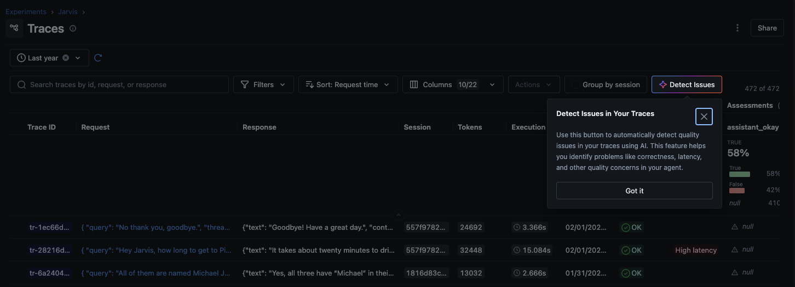
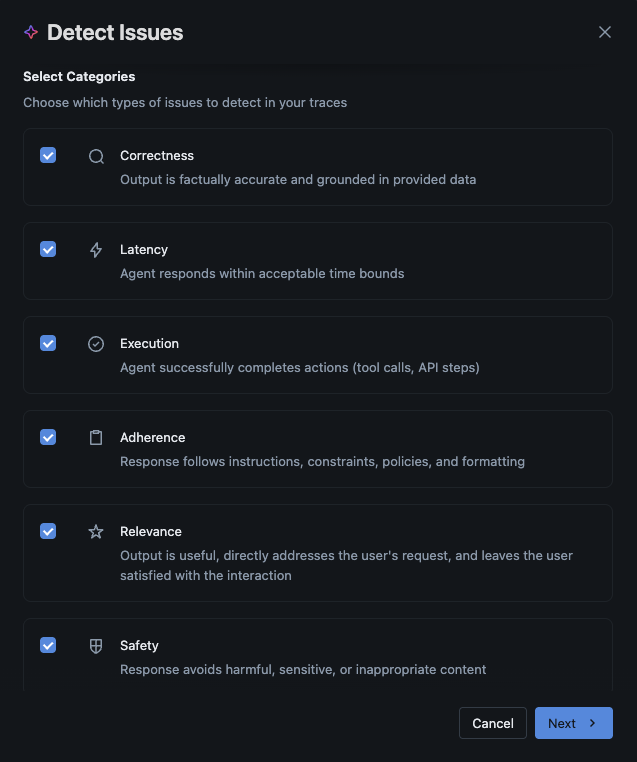
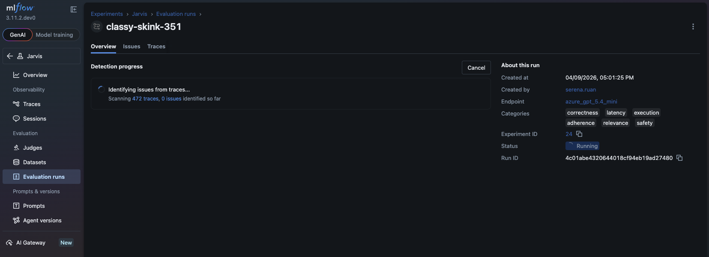
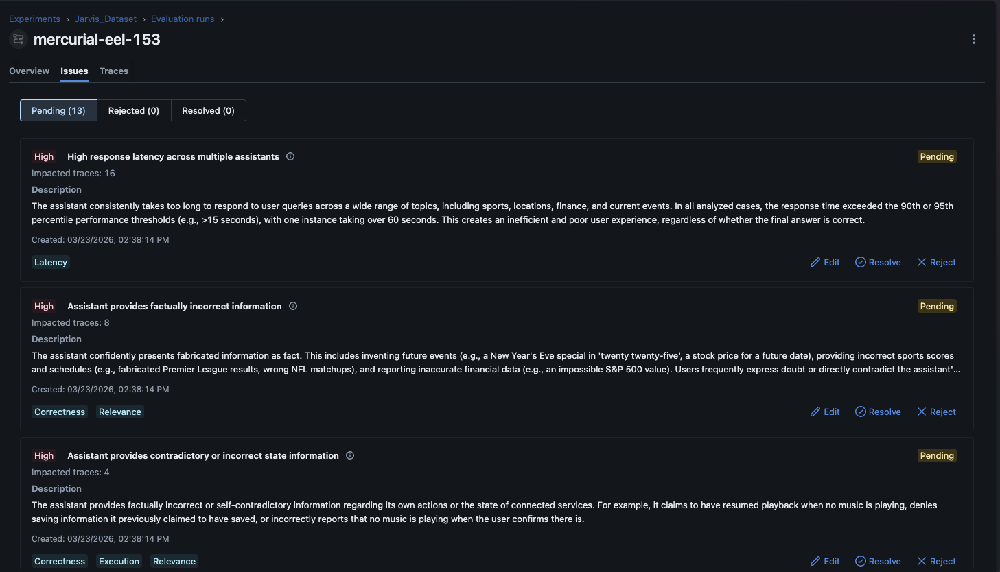

[Observability](https://mlflow.org/docs/latest/genai/tracing/) has become a norm for AI agents in production. But recording logs, metrics, and traces alone doesn't make the user experience better. You need to act on the data.

The problem is that finding actionable insights from massive traces is a needle-in-a-haystack problem. From thousands of production logs, how do you spot conversations where users got frustrated or dropped out? How do you catch an agent that silently returns wrong answers with high confidence and misleads users? Manually reviewing traces one by one doesn't scale.

Today we're announcing [**Automatic Issue Detection**](https://mlflow.org/docs/latest/genai/eval-monitor/ai-insights/detect-issues/) in MLflow, a new AI-driven Insights feature that replaces hours of manual check and triage to just 3 clicks.

<video width="100%" controls autoPlay loop muted>
  <source
    src={require("@site/static/img/releases/3.11.1/issue-detection.mp4").default}
    type="video/mp4"
  />
</video>

## Why Do You Need Automatic Issue Detection?

As LLM applications grow in production, maintaining agent quality becomes increasingly challenging. Four problems compound as traffic scales:

- **Manual review doesn't scale:** Inspecting individual traces one by one is unsustainable as request volume grows.
- **Unclear criteria:** It's hard to know which quality dimensions to measure without predefined baselines to start from.
- **Scattered failure patterns:** Related failures spread across thousands of traces with no systematic grouping, making recurring issues easy to miss.
- **Unstructured tracking:** Without formal issue management, identified problems disappear into notes and Slack threads—and regressions go undetected.

Automatic Issue Detection moves teams from reactive, manual debugging to proactive, systematic quality identification.

## Getting Started

Issue Detection is built into the MLflow UI and runs directly against the traces you've already collected.

## How It Works

### The CLEARS Framework

MLflow organizes issue detection across six quality dimensions, forming the [**CLEARS** framework](https://mlflow.org/docs/latest/genai/eval-monitor/ai-insights/detect-issues/#issue-categories-clears) (**C**orrectness, **L**atency, **E**xecution, **A**dherence, **R**elevance, **S**afety). Choose which categories to focus on based on your application's requirements:

You choose which CLEARS categories matter for your use case. A customer support bot might prioritize Adherence and Safety; a code assistant cares most about Correctness and Execution.

### The Detection Pipeline

Once you start an analysis run, MLflow:

1. **Samples and analyzes** traces using an LLM of your choice (via MLflow AI Gateway or a direct API connection)
2. **Clusters** related problems so you see patterns, not just a flat list of individual failures
3. **Annotates** the source traces with specific findings so you can drill straight to the evidence
4. **Generates a summary** of key findings, severity distribution, and recommended next steps

The analysis runs asynchronously with real-time progress tracking, so you can kick it off and come back to the results.

### Issue Triage

Detected issues aren't fire-and-forget alerts. Each one can be moved through a structured lifecycle:

- **Pending** — newly surfaced, needs review
- **Resolved** — fix has been deployed and verified
- **Rejected** — investigated and determined not to be a real problem

You can also edit issue descriptions and adjust severity ratings as your team learns more. This gives you a living record of your application's quality history, not just a snapshot.

## Summary

Automatic Issue Detection is available today in MLflow 3.11.1+ as part of MLflow AI Insights. To get started:

1. **[Trace](https://mlflow.org/docs/latest/genai/tracing/)** your LLM application with MLflow to collect the data Issue Detection needs.
2. **[Detect Issues](https://mlflow.org/docs/latest/genai/eval-monitor/ai-insights/detect-issues/#the-detection-experience)** by selecting your CLEARS categories and running analysis against your traces.
3. **[Triage and resolve](https://mlflow.org/docs/latest/genai/eval-monitor/ai-insights/detect-issues/#working-with-detected-issues)** findings through the structured issue lifecycle—Pending, Resolved, or Rejected.

If you find this useful, give us a star on GitHub: **[github.com/mlflow/mlflow](https://github.com/mlflow/mlflow)** ⭐️

Have questions or feedback? [Open an issue](https://github.com/mlflow/mlflow/issues) or join the [Slack channel](https://mlflow.org/slack).
