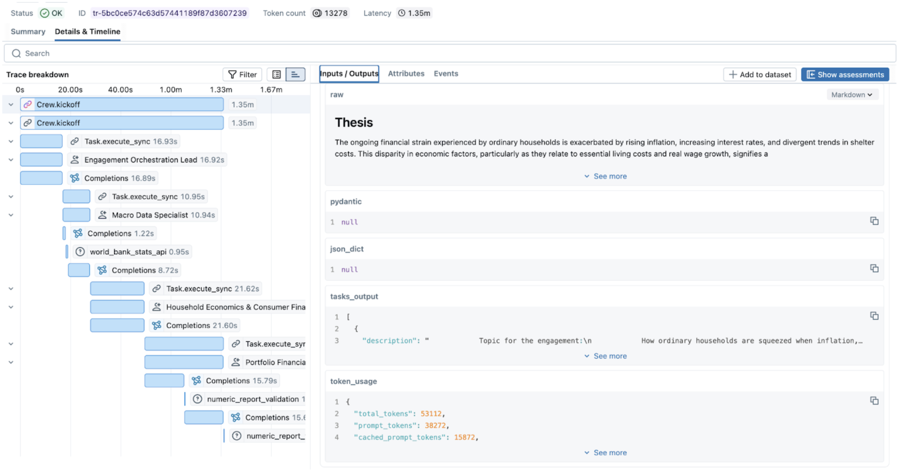
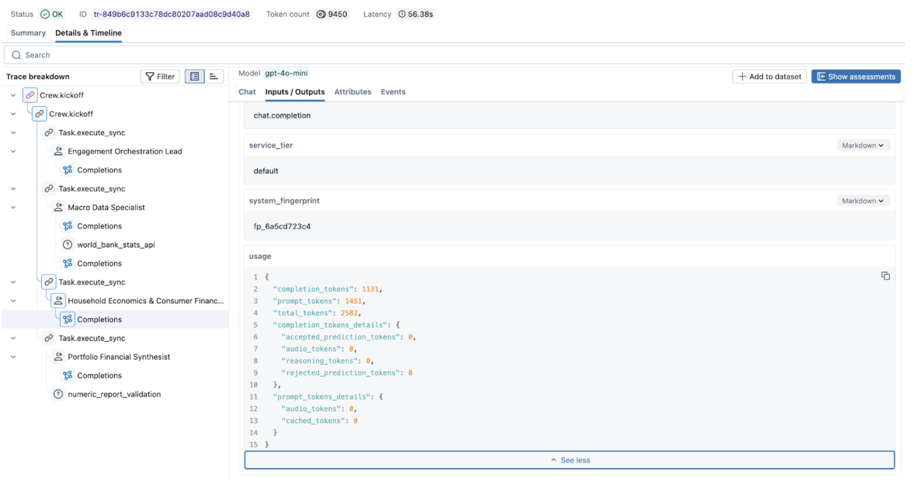

Building an agentic application is the easy part. The hard part is ensuring it doesn't accidentally purge a production database or leak sensitive data into a public Slack channel.

We’ve all been there: you’re tweaking a new setup in the playground, things feel good, and suddenly your agent starts "hallucinating" nonsense into a live company feed. You only catch it when a teammate pings you with a confused emoji. While it’s a funny anecdote in development, it’s a disaster in production. It proves you didn't know what your agent was doing, and you definitely didn't know why.

As you move from simple chatbots to autonomous systems that actually touch your business logic, fragmented tracing and guessing become serious liabilities. To move your agents into the wild safely, you need to master three things:

- **The "What"**: Identifying the weird, new ways multi-agent systems fail.
- **The "How"**: Building the observability you need to see your system's state in real-time.
- **The "Why"**: Pinpointing the exact metrics that let you steer the system before things go sideways.

MLflow helps you bridge this gap, turning a black box of agentic workflows into a transparent, mission-critical deployment.

## How Multi-Agent Systems Fail: Why Monitoring Isn’t Enough

Before diving into multi-agent deployments, let's look at how a single agent can fail. These failure modes are familiar to anyone who has shipped an LLM application:

- **Hallucination**: The model fabricates data, especially when a tool returns empty or ambiguous results, and the model fills in the gaps rather than surfacing the error.
- **Schema Fragility**: A minor change in an API response — a renamed field, a new nested object — silently breaks the agent's ability to parse and act on the output.
- **Context Decay**: Instructions buried deep in a long prompt get effectively ignored. The model attends to the most recent context and loses the thread of earlier constraints.
- **Runaway token usage**: An agent gets stuck in a retry loop — rerunning the same failing tool call over and over — burning tokens and budget with nothing to show for it.

Now, all of the above still applies to individual agents inside a multi-agent system. But the coordination layer introduces failures that are qualitatively different.

The most common is a cascading error. Imagine your orchestrator delegates a financial calculation to a specialist agent. The specialist completes the task but misinterprets a business constraint — say, using quarterly revenue when annual was expected. Three downstream agents then incorporate this number into their own analyses. By the time the final output reaches a human, the error has compounded through four separate reasoning steps. The result looks plausible. Nobody flags it immediately.

What makes this hard to debug isn't the error itself — it's that the failure originated three steps back, in a span you weren't watching. You spend hours on the output when the problem is in the input to a different agent entirely.

A related issue is shared memory pollution. When agents write intermediate results to a shared context, a hallucination from one agent becomes a "fact" that subsequent agents reason from. The degradation is gradual rather than sudden, which makes it particularly hard to catch — you notice the quality declining but can't pinpoint when it started or why.

A third failure mode worth knowing about is agents stuck in a waiting loop. An orchestrator waits for a specialist's response; the specialist is waiting on a tool that has silently timed out. Neither fails loudly. Your observability infrastructure shows increasing latency, but nothing indicates the system is effectively stalled.

What makes all of this harder than equivalent failures in traditional software is the non-determinism of LLMs. Run the same prompt a hundred times, and you get slightly different outputs. Combined with the cost of every retry, this means failures in multi-agent systems are both harder to reproduce and more expensive to discover.

## From monitoring to observability: instrumenting CrewAI with MLflow

With a single agent, monitoring inputs and outputs is usually enough. You know what went in, you know what came out, and if something looks wrong, you read the prompt and response. Debugging is linear.

With multi-agent systems, that's no longer sufficient. You need to understand not just what each agent returned, but why the orchestrator made the delegation decisions it did, how outputs flowed between agents, and where in the chain something started going wrong. Monitoring individual inputs and outputs gives you data points; observability across the full trace gives you the story.

The unit of analysis shifts from the prompt to the state transition. To understand a multi-agent system in production, you need visibility into:

- **Orchestration and routing decisions**: Why did the orchestrator send this task to this agent rather than another? Was the delegation correct given the task requirements?
- **Inter-agent data flow**: What exactly was passed between agents, and did it arrive intact? This is where cascading errors and memory pollution become visible.
- **Latency at each step**: Which agent or tool is the bottleneck? Where is the system spending time it shouldn't be?

To solve these problems, we first need to see what's going on with the system. This means implementing tracing that captures not just individual tool calls but the full nested, connected graph of agent interactions.


*Figure 1. Nested traces in MLflow UI.*

In a standard LLM call, you have a start and an end. In a multi-agent workflow, you have nested spans and branching logic. [MLflow Tracing](https://mlflow.org/docs/latest/genai/tracing/) allows us to reconstruct the graph by capturing the parent-child relationship between the Orchestrator and Workers. This transforms a black-box execution into a navigable map of state transitions.

### Out of the box and custom tracing

In MLflow, enabling comprehensive tracing can be done with one command.

```python
mlflow.<framework>.autolog()
```

Since MLflow supports many flavors out of the box, [monitoring of the CrewAI application](https://mlflow.org/docs/latest/genai/tracing/integrations/listing/crewai/#example-usage) will look like this:

```python
import mlflow

# Turn on auto tracing by calling mlflow.crewai.autolog()
mlflow.crewai.autolog()

# Optional: Set a tracking URI and an experiment
mlflow.set_tracking_uri("http://localhost:5000")
mlflow.set_experiment("CrewAI")
```

And then the actual CrewAI code:

```python
from crewai import Agent, Crew, Task

# Tasks and Agents definitions, see full example here
# https://mlflow.org/docs/latest/genai/tracing/integrations/listing/crewai/#example-usage
...
crew = Crew(
        agents=[orchestrator, macro_data, researcher, results_lead],
        tasks=[plan_task, stats_task, research_task, synthesis_task],
        verbose=True,
    )
result = crew.kickoff()
```

`Autolog` functionality captures traces for every run and aggregates them into the DAG that is easy to navigate. But to fully understand the system's behavior, we suggest tracing custom functions and tools that are not supported by MLflow `autolog`.

To do it, you can use the custom decorator:

```python
@mlflow.trace(span_type="TOOL", attributes={"key": "value"})
def func():
    ...
```

In our example:

```python
@mlflow.trace(
    name="numeric_report_validation",
    attributes={"service": "heuristic numeric cross-check (report vs sources)"},
)
def validate_report_numbers_against_sources(
    final_report: str,
    *source_texts: str,
) -> str:
    # Function definition
    ... 
```

The `@mlflow.trace()` decorator allows you to create a span for any function. This simple approach allows us to capture unique relationships between functions, record exceptions, or custom parameters, as well as capture the cascading financial miscalculation alluded to above.

### Capturing the relevant metrics

Traces tell you what happened. Metrics tell you whether it was acceptable. By combining MLflow's autolog() for LLMs (e.g., `mlflow.openai.autolog()`) with custom attributes, you can transform simple traces into a verifiable audit trail. Once you have full tracing in place, the next step is deciding which numbers actually matter — because in a multi-agent system, a successful response can hide a costly execution. The system might return the right answer after 15 recursive calls, 10 retries on a flaky API, and two minutes of an agent waiting for a response that nearly never came.


*Figure 2. Exploring metrics in MLflow UI.*

We can aggregate the necessary metrics into three critical pillars:

#### 1. Orchestration and Routing Logic

Every time your orchestrator delegates a task, it makes a decision. That decision might be correct, redundant, or just slow — and without instrumenting it, you won't know which. Capturing routing behavior helps you answer the question that matters most: Is the supervisor sending tasks to the right place, efficiently?

A few examples of relevant metrics are:

- **Successful delegation rate**: Did the supervisor choose a correct agent or tool, or did it get confused by the inaccurate descriptions? 
- **Delegation Latency**: How long it took a supervisor to decide which agent/tool to call
- **Redundancy and loop detection**: Did the supervisor choose the efficient path

In CrewAI, the `step_callback` is the natural hook for capturing routing behavior — it fires after each agent step, giving you the agent name, output, and timing:

```python
import mlflow
import time

delegation_counts: dict[str, int] = {}
def track_routing(step_output) -> None:                                                                                                                                 
      agent_name = step_output.agent                                                                                                                                      
      delegation_counts[agent_name] = delegation_counts.get(agent_name, 0) + 1
      span = mlflow.get_current_active_span()

      if span:                                                                                                                                                            
          span.set_attributes({
              f"routing.{agent_name}.call_count": delegation_counts[agent_name],
              "routing.total_delegations": sum(delegation_counts.values()), 
              # step_callback counts steps per agent, not supervisor delegations;
              # > 3 gives room for a normal reasoning + tool + retry cycle
              "routing.loop_detected": any(v > 3 for v in delegation_counts.values()),
          })
      # Log state handoff after each agent completes
      next_input = crew_state.get_state("current_input") or ""                                                                                                            
      log_state_handoff(
          from_agent=agent_name,
          to_agent="next",  # CrewAI doesn't expose next agent here, use state 
          output=str(step_output.result),
          next_input=next_input,
)
```

#### 2. State consistency and memory poisoning

As we saw with the cascading error example, the biggest risk in a multi-agent system isn't a single agent failing — it's a single agent producing subtly incorrect output that's treated as ground truth by every downstream agent. Tracking state consistency helps you detect this drift before it compounds.

These metrics help to evaluate the consistency and memory state:

- **Grounding accuracy**: Score comparing the agent's input against the global state to see if the agent's hallucination occurred in the previous agent. 
- **Concurrency**: The number of agents attempting to access or mutate the same element within the same execution window.
- **Context handoff efficiency**: Are agents sharing the entire context or only an essential part?

A practical starting point for improving context handoff efficiency is a simple token-overlap score between what one agent outputs and what the next agent receives. It doesn't require an additional LLM call and gives you a signal when agents are either passing too much context or too little:

```python
def handoff_efficiency_score(output_text: str, next_input_text: str) -> float:
    """Token overlap between agent output and the next agent's input.
    Score of 1.0 means the next agent received everything the previous one produced.
    Score close to 0.0 means most of the output was dropped before handoff.
    """
    output_tokens = set(output_text.lower().split())
    input_tokens = set(next_input_text.lower().split())
    if not output_tokens:
        return 0.0
    return len(output_tokens & input_tokens) / len(output_tokens)

@mlflow.trace(name="state_handoff", span_type="CHAIN")
def log_state_handoff(
    from_agent: str, to_agent: str, output: str, next_input: str
) -> None:
    span = mlflow.get_current_active_span()
    if span:
        span.set_attributes({
            "handoff.from_agent": from_agent,
            "handoff.to_agent": to_agent,
            "handoff.output_chars": len(output),
            "handoff.input_chars": len(next_input),
            "handoff.efficiency_score": handoff_efficiency_score(output, next_input),
        })
```

Then call it from each task callback, where you already have the current output and can read the previous agent's output from shared state:

```python
def _on_research_complete(output: object) -> None:
    text = crew_state.task_output_to_text(output)
    crew_state.set_state("research_brief", text)

# How much of the macro data specialist's output made it into the research brief?
stats = crew_state.get_state("macro_stats_snapshot") or ""
log_state_handoff(
    from_agent="macro_data_specialist",
    to_agent="research_analyst",
    output=stats,
    next_input=text,
)
```

#### 3. Operational telemetry and costs

In a multi-agent system, a successful response can hide a catastrophic operational failure. The system can give a correct answer, but it uses multiple recursive calls, retries, and spends time in a waiting loop.

To prevent these resource drains and inefficiencies, you must capture:

- **Token Attribution**: the cost per node, call, path, or task;
- **Per-Node Latency and Bottleneck Detection**: metrics like span duration vs. queue time allow for the detection of bottlenecks and poorly optimized tool/database calls
- **Rate Limit and Throughput Volatility**: number of API calls, frequency of specific errors (like 429) to identify hotspots; 
- **Task depth**: to identify if agents are going into an infinite loop

To capture custom multi-agent metrics, you can wrap your multi-agent system execution in the following way:

```python
@mlflow.trace(name="Crew.kickoff", span_type="CHAIN")
def run_crew_with_metrics(crew: Crew) -> CrewOutput:
    """Run ``crew.kickoff()`` inside a traced span that collects summary metrics."""
    delegation_counts.clear()  # reset between runs to avoid false loop detection
    _crew_metrics.clear()
    t0 = time.perf_counter()
    result = crew.kickoff()
    duration_s = round(time.perf_counter() - t0, 3)

    span = mlflow.get_current_active_span()
    if span is not None:
        charter = crew_state.get_state("engagement_charter") or ""
        stats = crew_state.get_state("macro_stats_snapshot") or ""
        research = crew_state.get_state("research_brief") or ""
        synthesis = crew_state.get_state("synthesis_result") or ""

        span.set_attributes({
            "crew.total_duration_s": duration_s,
            "crew.task_count": len(crew.tasks),
            "crew.agent_count": len(crew.agents),
            "orchestration_lead.output_chars": len(charter),
            "macro_data_specialist.output_chars": len(stats),
            "research_analyst.output_chars": len(research),
            "synthesist.output_chars": len(synthesis),
            "validation.report_number_count": len(extract_numeric_tokens(synthesis)),
            "validation.source_number_count": len(extract_numeric_tokens(research)),
            **_crew_metrics,
        })
    return result
```

### Multi-service observability

In some cases, multi-agent systems can span multiple services connected via HTTP requests. Ideally, we want a unified view of traces for this system, rather than having to monitor two sides independently and stitch traces together in the notebook. MLflow supports OTEL, which enables instrumentation and monitoring for applications split across multiple services. Check more details [here](https://mlflow.org/docs/latest/genai/tracing/app-instrumentation/distributed-tracing/). 

While MLflow provides a specialized view for LLM-specific spans, multi-agent systems don't live in a vacuum. They rely on databases, authentication services, and third-party APIs. By leveraging [MLflow’s OpenTelemetry (OTEL)](https://mlflow.org/docs/latest/genai/tracing/opentelemetry/) support, you ensure that your agentic traces aren't stuck in a silo:

- **Unified Context**: Export your MLflow traces to enterprise backends like Grafana, Datadog, or Honeycomb. This allows SREs to see a single timeline that connects a user’s frontend click to the specific agent hallucination that caused the error.
- **Production Standards**: Modern infrastructure teams already speak OTEL. Using it means your agent traces appear in the same dashboards, alerts, and on-call runbooks as the rest of your stack — no separate tooling, no special cases.
- **Correlation across Services**: If an agent fails because a downstream microservice times out, OTEL allows you to correlate the agent's retry logic with the backend's 503 error in a single unified trace.

## Putting it all together

You can find an end-to-end example of a multi-agent system built with CrewAI and instrumented with MLflow in [this repository](https://github.com/oleksandrabovkun/mlflow-examples/tree/main/mlflow-crewai-observability)

Multi-agent systems introduce failure modes that don't surface until agents start talking to each other — cascading errors, memory pollution, and agents silently stalled waiting for a response that never comes. To move beyond "it works on my machine", your observability stack needs to capture the full picture: not just what each agent returned, but how agents influenced each other and where the system spent its time and money.

**MLflow** gives you the tooling to get there: autolog for the easy wins, custom decorators for the parts that matter most, and OTEL integration for when your agents are just one piece of a larger production system.

Seeing what's happening is only half the battle. In the second part of this series, we'll move beyond passive observation to explore governance and active steering — the mechanisms you need to enforce safety, manage costs, and prevent issues before they ever reach your production environment.

## What to try next?

- Run your existing multi-agent workflow with `autolog()` enabled and look for your slowest or most expensive spans.
- Add the `@mlflow.trace` decorator to your validation functions and start measuring context handoff efficiency.
- If your agents span multiple services, set up OTEL export and see your traces in a unified view for the first time.

If you find MLflow useful, give us a star on [GitHub](https://github.com/mlflow/mlflow)