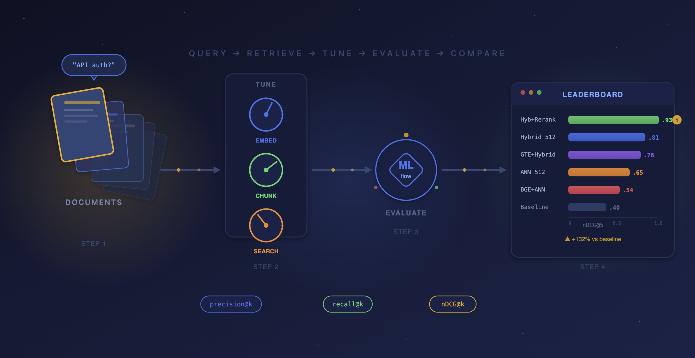
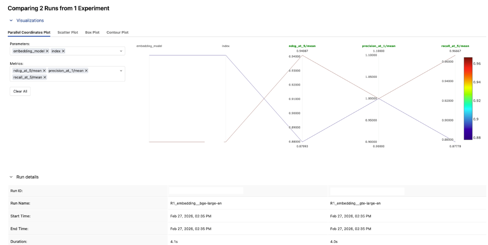
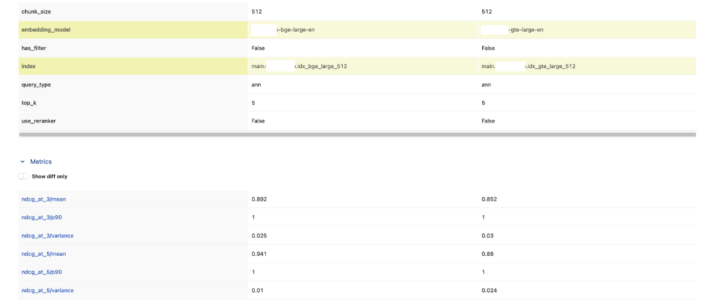
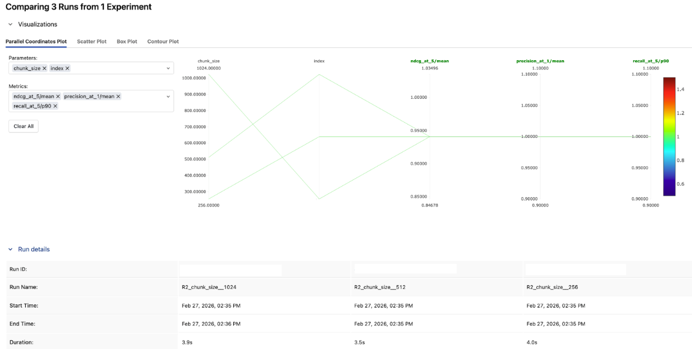
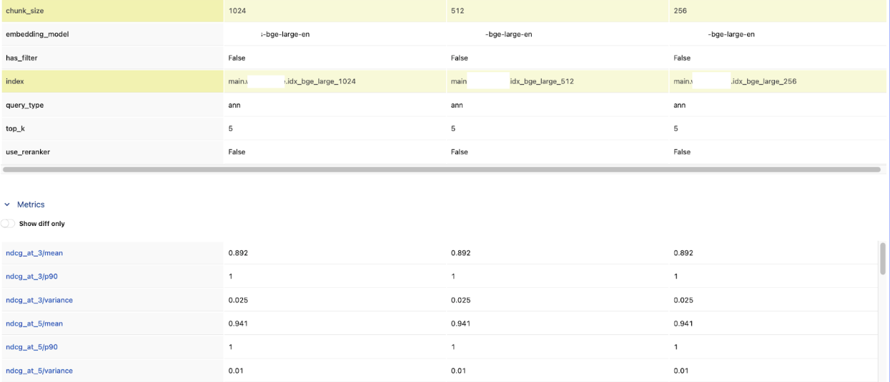
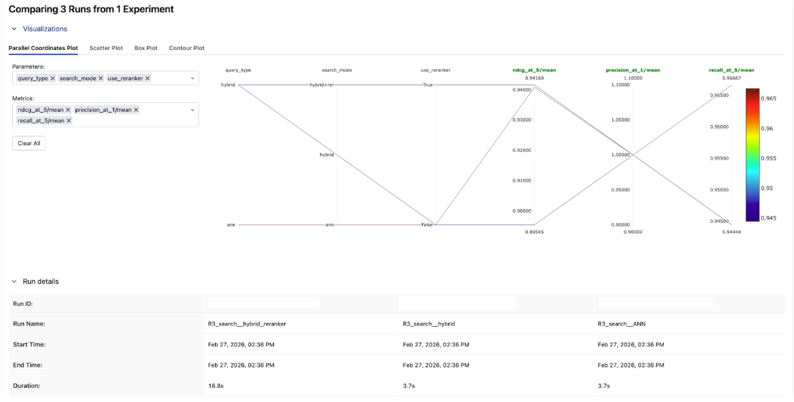
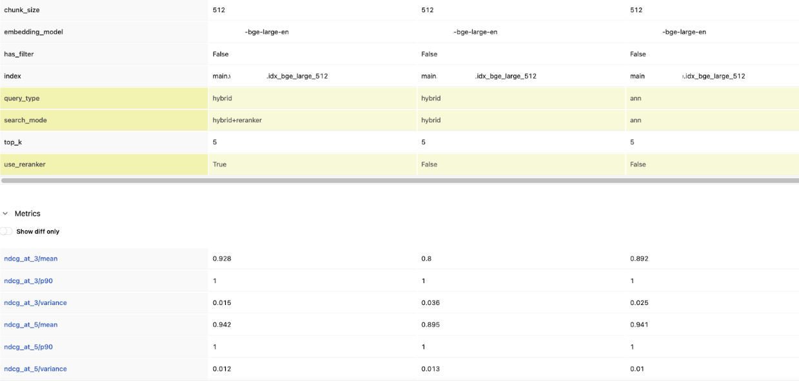
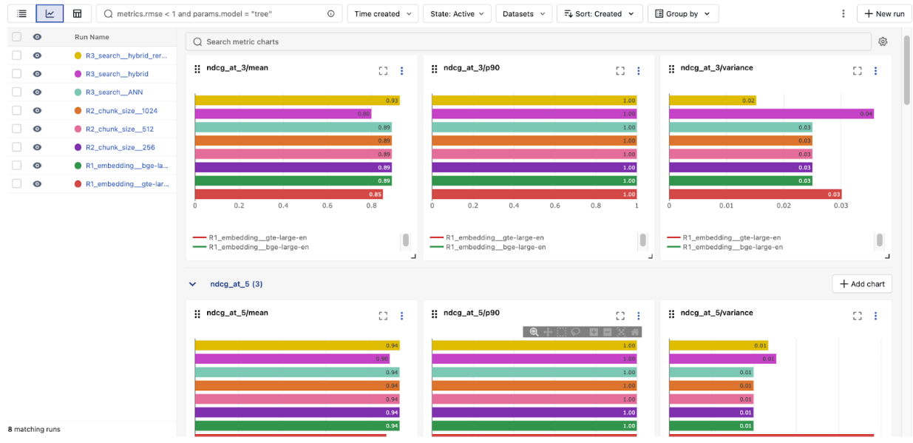
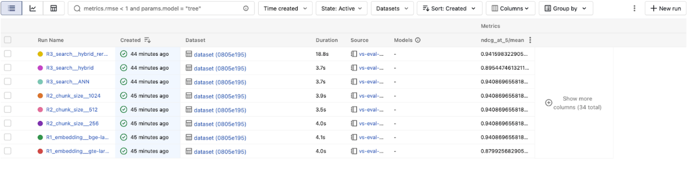

## Summary

**The problem**: Vector Search has many tuning knobs (embedding model, chunk size, search mode, reranker, filters), but most teams pick defaults and never measure the impact. Without a benchmark, you're tuning blind.

**The approach**: Build a ground-truth evaluation set once, then use MLflow's retriever evaluation to benchmark each configuration change with precision@k, recall@k, and nDCG@k — all tracked and comparable in the MLflow Experiment UI.

**Key takeaway**: Tune one knob at a time, let the metrics decide, and use MLflow to make the results reproducible and shareable. Query-time settings (hybrid, reranker, filters) are often just as impactful as index-time settings — and they're cheaper to test.

Every RAG system depends on retrieval, and RAG is a core tool for most AI agents. If your vector search index returns the wrong documents, your agent will generate wrong answers — confidently. But here's the problem: vector search has too many knobs to tune, and most teams never measure the impact of any of them.

Embedding model, chunk size, ANN vs. hybrid search, rerankers, metadata filters — every vector store exposes these tuning options, whether you're using Databricks Vector Search, Pinecone, LanceDB, Qdrant, or pgvector. Every one of these choices changes what your retriever returns. But without a benchmark, you're flying blind — change a setting, try a few queries by hand, hope it helps.

This post introduces a **RAG benchmarking workflow using MLflow** that works with any vector store. We run three benchmark rounds — each isolating a single tuning knob — and use MLflow’s precision@k, recall@k, and nDCG@k metrics to measure the impact of every change. Every benchmarking run is tracked in MLflow, so you can compare configurations side-by-side and tune with data, not intuition.

[!NOTE]
This guide assumes familiarity with MLflow for Agents and LLM Applications. For beginners, refer to the MLflow retriever evaluation tutorial. Even though the examples here show Databricks Vector Search, Pinecone, and LanceDB, the approach and pattern are general to work for any retriever, regardless of the vector store.



## The Benchmark Plan

We'll run three benchmark rounds, each isolating a single tuning knob:

| Round | Tuning Knob     | Configurations to Benchmark                       |
| ----- | --------------- | ------------------------------------------------- |
| 1     | Embedding model | gte-large-en vs. bge-large-en (or any two models) |
| 2     | Chunk size      | 256 tokens vs. 512 tokens vs. 1024 tokens         |
| 3     | Search mode     | ANN vs. Hybrid vs. Hybrid + Reranker              |

The code below shows each round implemented against three different vector stores — Databricks Vector Search, Pinecone, and LanceDB — to demonstrate that the MLflow evaluation pattern is the same regardless of the retriever underneath.

## Step 1: Build a Ground-Truth Benchmark Set

In order to benchmark retrieval, you first need a set of queries paired with the document IDs that should be returned, ordered by relevance.

```python
import pandas as pd
eval_data = [
    {
        "query": "How do I get started with DataStack?",
        "expected_docs": ["doc-001", "doc-002", "doc-004"],
    },
    {
        "query": "How to set up API keys and authentication?",
        "expected_docs": ["doc-003", "doc-002"],
    },
    {
        "query": "Stream data from Kafka in real time",
        "expected_docs": ["doc-011"],
    },
    {
        "query": "Track ML experiments and compare model runs",
        "expected_docs": ["doc-020", "doc-024"],
    },
    {
        "query": "Build a dashboard and set up scheduled alerts",
        "expected_docs": ["doc-042", "doc-043"],
    },
    # ... 30-100 queries for production benchmarks
]
eval_df = pd.DataFrame(eval_data)
```

This benchmark set is your measuring stick. Build it once, use it across every experiment. For production, aim for 50–100+ annotated queries.

## Step 2: Write a Retriever for Each Vector Store

**MLflow, as an open source platform, doesn't limit which vector store you use**. It just needs a function that takes a query and returns a list of doc IDs. Here's what that looks like for three different providers:

### Databricks Vector Search

```python
from databricks.vector_search.client import VectorSearchClient
vs = VectorSearchClient()
index = vs.get_index(endpoint_name="my-endpoint", index_name="catalog.schema.my_index")
def retrieve_databricks(query: str, top_k: int = 5, query_type: str = "ann") -> list[str]:
    kwargs = {"query_text": query, "columns": ["doc_id"], "num_results": top_k}
    if query_type == "hybrid":
        kwargs["query_type"] = "hybrid"
    res = index.similarity_search(**kwargs)
    return [row[0] for row in res["result"]["data_array"]]
```

### Pinecone

```Python
from pinecone import Pinecone
pc = Pinecone(api_key="your-api-key")
index = pc.Index("my-index")
def retrieve_pinecone(query: str, top_k: int = 5, embedding_fn=None) -> list[str]:
    query_vec = embedding_fn(query)  # your embedding model
    res = index.query(vector=query_vec, top_k=top_k, include_metadata=True)
    return [match["doc_id"] for match in res["matches"]]
```

### LanceDB

```python
import lancedb
db = lancedb.connect("./my_lancedb")
table = db.open_table("my_docs")
def retrieve_lancedb(query: str, top_k: int = 5) -> list[str]:
    results = table.search(query).limit(top_k).to_pandas()
    return results["doc_id"].tolist()
```

The pattern is the same: take a query string in, return a list of doc IDs out. Everything else — the embedding model, the index type, the distance metric — is encapsulated inside the retriever function.

## Step 3: Build the Benchmark Harness

This is the engine that powers every benchmark round. We build a single reusable function that queries any Vector Search index with any configuration, computes retrieval metrics via `mlflow.evaluate()`, and logs everything to an MLflow run.

```python

# All benchmark runs will be grouped under this experiment
mlflow.set_experiment("vector-search-benchmark")

def benchmark_retriever(
    run_name: str,
    retriever_fn,
    eval_df: pd.DataFrame,
    extra_params: dict = None,
):
    """Benchmark any retriever function and log results to MLflow."""

    # Wrap the retriever so mlflow.evaluate() can call it on each row
    def retriever_for_mlflow(df: pd.DataFrame) -> pd.Series:
        return df["query"].apply(retriever_fn)

    with mlflow.start_run(run_name=run_name):
        if extra_params:
            mlflow.log_params(extra_params)

        # Run the retriever against every query and score the results
        results = mlflow.evaluate(
            model=retriever_for_mlflow,
            data=eval_df[["query", "expected_docs"]],
            model_type="retriever",
            targets="expected_docs",
            evaluators="default",
            extra_metrics=[
                mlflow.metrics.precision_at_k(1),
                mlflow.metrics.precision_at_k(3),
                mlflow.metrics.precision_at_k(5),
                mlflow.metrics.recall_at_k(1),
                mlflow.metrics.recall_at_k(3),
                mlflow.metrics.recall_at_k(5),
                mlflow.metrics.ndcg_at_k(3),
                mlflow.metrics.ndcg_at_k(5),
            ],
        )
        return results
```

## Round 1: Benchmarking Embedding Models

### Tuning knob: Embedding model

This is the first knob most teams reach for — and for good reason. Different embedding models represent text differently in vector space. A query about "API authentication" might rank completely different documents depending on whether you use GTE, BGE, or OpenAI's `text-embedding-3-large`.

```python
# Databricks Vector Search: two indexes, two embedding models
benchmark_retriever(
    run_name="R1_embedding__gte-large",
    retriever_fn=lambda q: retrieve_databricks(q, top_k=5),  # index uses gte-large
    eval_df=eval_df,
    extra_params={"vector_store": "databricks", "embedding_model": "databricks-gte-large-en", "chunk_size": 512},
)
benchmark_retriever(
    run_name="R1_embedding__bge-large",
    retriever_fn=lambda q: retrieve_databricks_bge(q, top_k=5),  # index uses bge-large
    eval_df=eval_df,
    extra_params={"vector_store": "databricks", "embedding_model": "databricks-bge-large-en", "chunk_size": 512},
)
# Pinecone: same data, different embedding models
from sentence_transformers import SentenceTransformer
gte_model = SentenceTransformer("thenlper/gte-large")
bge_model = SentenceTransformer("BAAI/bge-large-en-v1.5")
benchmark_retriever(
    run_name="R1__pinecone_gte",
    retriever_fn=lambda q: retrieve_pinecone(q, embedding_fn=gte_model.encode),
    eval_df=eval_df,
    extra_params={"vector_store": "pinecone", "embedding_model": "gte-large"},
)
benchmark_retriever(
    run_name="R1__pinecone_bge",
    retriever_fn=lambda q: retrieve_pinecone(q, embedding_fn=bge_model.encode),
    eval_df=eval_df,
    extra_params={"vector_store": "pinecone", "embedding_model": "bge-large"},
)
# LanceDB: same pattern
benchmark_retriever(
    run_name="R1__lancedb_gte",
    retriever_fn=lambda q: retrieve_lancedb_gte(q, top_k=5),
    eval_df=eval_df,
    extra_params={"vector_store": "lancedb", "embedding_model": "gte-large"},
)
```

In the MLflow Experiment UI, compare these two runs side-by-side. Looking at the results, bge-large-en won across the board. BGE scored higher on both nDCG@3 and nDCG@5, and had lower variance — meaning it was more consistent across queries too.



---



## Round 2: Benchmarking Chunk Size

### Tuning knob: Chunk size

This is the round where deduplication and document-level metrics matter most. Without them, smaller chunks artificially inflate precision and recall by returning multiple chunks from the same document.

```python
# Each chunk size has its own index, but the retriever deduplicates to doc IDs
for chunk_size in [256, 512, 1024]:
    # Build a deduped retriever for this chunk size's index
    raw_fn = lambda q, top_k=15, cs=chunk_size: retrieve_from_chunk_index(q, cs, top_k)
    deduped_fn = make_deduped_retriever(raw_fn, top_k=5, oversample=3)
    benchmark_retriever(
        run_name=f"R2_chunk_size_{chunk_size}",
        retriever_fn=deduped_fn,
        eval_df=eval_df,
        extra_params={"chunk_size": chunk_size, "embedding_model": "gte-large"},
    )
```

In this example, chunk size made no measurable difference — all three configs landed at the same nDCG@5. It tells you chunk size isn't the bottleneck here, and you can move on to tuning something that actually moves the needle.

That won't always be the case. On other datasets, watch for the precision–recall trade-off: smaller chunks tend to win on precision@1 (more focused matches), while larger chunks pull ahead on recall@5 (more context per result). When the results do diverge, nDCG@5 is a good single metric for picking a winner — it rewards both relevance and ranking.



---



## Round 3: Benchmarking Search Modes

### Tuning knob: Search mode

This round varies by vector store — not all providers support the same search modes. But wherever hybrid or reranking is available, it's worth testing:

```python
# Databricks: ANN vs Hybrid vs Hybrid + Reranker
from databricks.vector_search.reranker import DatabricksReranker
benchmark_retriever(
    run_name="R3_search__ANN",
    retriever_fn=lambda q: retrieve_databricks(q, query_type="ann"),
    eval_df=eval_df,
    extra_params={"vector_store": "databricks", "search_mode": "ann"},
)
benchmark_retriever(
    run_name="R3_search__hybrid",
    retriever_fn=lambda q: retrieve_databricks(q, query_type="hybrid"),
    eval_df=eval_df,
    extra_params={"vector_store": "databricks", "search_mode": "hybrid"},
)
benchmark_retriever(
    run_name="R3_search__hybrid_reranker",
    retriever_fn=lambda q: retrieve_databricks_reranked(q),
    eval_df=eval_df,
    extra_params={"vector_store": "databricks", "search_mode": "hybrid+reranker"},
)
# Pinecone: dense vs sparse-dense hybrid
benchmark_retriever(
    run_name="R3__pinecone_dense",
    retriever_fn=lambda q: retrieve_pinecone_dense(q),
    eval_df=eval_df,
    extra_params={"vector_store": "pinecone", "search_mode": "dense"},
)
benchmark_retriever(
    run_name="R3__pinecone_hybrid",
    retriever_fn=lambda q: retrieve_pinecone_hybrid(q),  # dense + sparse
    eval_df=eval_df,
    extra_params={"vector_store": "pinecone", "search_mode": "sparse_dense_hybrid"},
)
# LanceDB: vector vs full-text vs hybrid
benchmark_retriever(
    run_name="R3__lancedb_vector",
    retriever_fn=lambda q: retrieve_lancedb(q, query_type="vector"),
    eval_df=eval_df,
    extra_params={"vector_store": "lancedb", "search_mode": "vector"},
)
benchmark_retriever(
    run_name="R3__lancedb_fts",
    retriever_fn=lambda q: retrieve_lancedb(q, query_type="fts"),
    eval_df=eval_df,
    extra_params={"vector_store": "lancedb", "search_mode": "full_text"},
)
benchmark_retriever(
    run_name="R3__lancedb_hybrid",
    retriever_fn=lambda q: retrieve_lancedb(q, query_type="hybrid"),
    eval_df=eval_df,
    extra_params={"vector_store": "lancedb", "search_mode": "hybrid"},
)
```

Compare precision@1 across the three runs. Hybrid + reranker came out on top here.If the reranker consistently puts the right document first, that improvement in top-of-list quality may be worth the added latency for your use case.



---



## Step 4: Read the Leaderboard

After all three rounds, every run is in one MLflow experiment. Pull the leaderboard to see which configuration won — across vector stores:

```python
experiment = mlflow.get_experiment_by_name("vector-search-benchmark")
runs_df = mlflow.search_runs(
    experiment_ids=[experiment.experiment_id],
    order_by=["metrics.`ndcg_at_5/mean` DESC"],
)
display_cols = [
    "run_name",
    "params.vector_store",
    "params.embedding_model",
    "params.chunk_size",
    "params.search_mode",
    "metrics.precision_at_1/mean",
    "metrics.recall_at_5/mean",
    "metrics.ndcg_at_5/mean",
]
leaderboard = runs_df[[c for c in display_cols if c in runs_df.columns]].head(15)
display(leaderboard)
```

The most useful views in the MLflow Experiment UI:

- Parallel coordinates chart: See how each tuning knob correlates with nDCG@5. This instantly reveals which knobs matter most.
- Table view: Sort by nDCG@5 to rank every configuration — across providers and settings.

The overall winner: **bge-large-en, hybrid search, with reranker** — 0.942 nDCG@5.

That's a 7% lift over the baseline gte-large-en ANN config we started with (0.880). The reranker added the most value in a single change, but it only works this well because we built on the right foundation: the better embedding model from Round 1, confirmed that chunk size wasn't a bottleneck in Round 2, then layered hybrid + reranker on top in Round 3.

This is exactly why you benchmark one knob at a time — each round gives you a solid base to build the next experiment on.



---



## What We Learned

The biggest takeaway: tune one knob at a time, and let the numbers decide. Embedding model, chunk size, search mode, and rerankers all matter — but their impact depends on your data and queries. The only way to know is to measure.

MLflow ties it all together by logging every configuration and metric, so results are reproducible, comparable, and easy to share with your team months later.

Once you've identified which knobs matter most, you can go further. Since every benchmark run is already parameterized and logged, you can plug this same harness into a hyperparameter optimization framework like Optuna. Instead of testing three chunk sizes by hand, let the optimizer sweep across chunk sizes, reranker thresholds, and embedding models together — and let MLflow track every trial.

## What's Next?

- Try it yourself. Try the notebook [here](https://e2-demo-field-eng.cloud.databricks.com/editor/notebooks/1247802216066734?o=1444828305810485#command/5694118208353140) on your own vector store and ground-truth queries, and run your first benchmark in under 30 minutes.
- Go end-to-end. Once you've found your best retrieval config, add MLflow's GenAI scorers ([RetrievalGroundedness](https://docs.databricks.com/en/mlflow/llm-evaluate.html), [RelevanceToQuery](https://docs.databricks.com/en/mlflow/llm-evaluate.html)) to measure how retrieval quality affects your full RAG pipeline.
- Make it permanent. Wire the benchmark into CI/CD so every index rebuild is automatically scored — no regressions in production.

If this is useful, give us a ⭐ on [GitHub](https://github.com/mlflow/mlflow)mlflow

## Resources and References

- [Practical AI Observability: Getting Started with MLflow Tracing](https://mlflow.org/blog/ai-observability-mlflow-tracing) — Add one line of code to trace every search and LLM call in your application.
- [Building Advanced RAG with MLflow and LlamaIndex Workflow](https://mlflow.org/blog/mlflow-llama-index-workflow) — Combine vector search, BM25, and web search in a single RAG pipeline with MLflow evaluation.
- [Introducing DeepEval, RAGAS, and Phoenix Judges in MLflow](https://mlflow.org/blog/third-party-scorers) — Go beyond retrieval metrics with third-party evaluation scorers.
- [MLflow 3.10.0 Highlights: Multi-Workspace Support, Multi-Turn Evaluation, and many UI Enhancements](https://mlflow.org/releases/3.10.0/)
