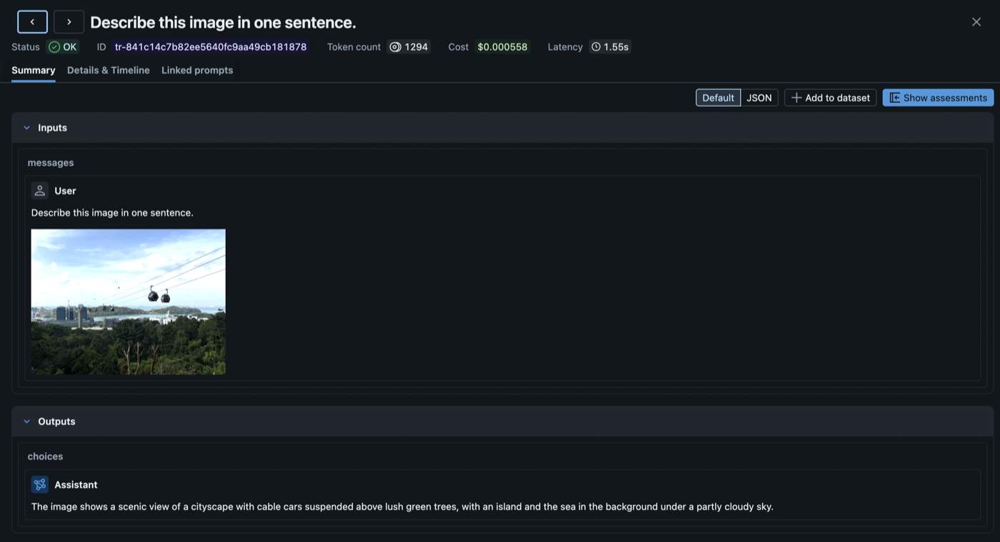

Your agent analyzes images, transcribes audio, and processes PDFs. But when something goes wrong, your traces show nothing but opaque base64 strings: megabytes of `iVBORw0KGgo...` buried in JSON. You can see that an image was sent, but not what was in it. You can see audio was returned, but you can't play it. And every one of those multi-megabyte strings is stored directly in your trace database, bloating storage costs and slowing down queries.

Today we're announcing **multimodal tracing** in MLflow. Binary content is automatically extracted from traces, stored efficiently as artifacts, and rendered inline in the UI exactly as your model saw it.



## Why Text-Only Traces Fall Short

As LLM applications move beyond text (vision models analyzing photos, audio models transcribing calls, agents generating images), three problems compound:

- **Database bloat:** A single image generation response embeds ~1.8MB of base64 directly in your span JSON. Across thousands of traces, that's gigabytes of binary data stored in your tracking database, data that was never meant to live in a relational store.
- **Slow queries and UI:** Loading a trace list means fetching all that inline binary. Trace search slows down, the UI lags, and browsing production traces becomes painful.
- **Blind debugging:** When a vision model misclassifies an image, you need to see the image alongside the model's response, not a wall of encoded bytes. Text-only traces make multimodal debugging impossible.

Multimodal tracing solves all three.

## How It Works

When MLflow detects binary content in a span, it pulls the bytes out and stores them in your existing artifact store (S3, Azure Blob, GCS, DBFS, or local filesystem), the same storage MLflow already uses for model artifacts. The span keeps only a lightweight reference URI, so the trace database stays small and queries stay fast. The UI fetches and renders the binary on demand when you open a trace.


## Auto-Extraction: Zero Code Changes

If you're already using MLflow's autologging for OpenAI, Anthropic, Gemini, Bedrock, or LangChain, multimodal tracing works out of the box. No code changes, no configuration. MLflow detects and extracts binary content automatically.

```python
import mlflow
import openai

mlflow.openai.autolog()
client = openai.OpenAI()

# Image data is automatically extracted, no code changes needed
response = client.chat.completions.create(
    model="gpt-4o",
    messages=[{
        "role": "user",
        "content": [
            {"type": "text", "text": "What's in this image?"},
            {"type": "image_url", "image_url": {"url": f"data:image/jpeg;base64,{image_b64}"}},
        ],
    }],
)
```

MLflow recognizes 8 multimodal data patterns across providers:

| Pattern | Provider | Content Type |
|---|---|---|
| Data URIs (`data:image/png;base64,...`) | All | Images, audio |
| `input_audio` | OpenAI | Audio input |
| `b64_json` | OpenAI | Generated images |
| Audio output (`audio.data`) | OpenAI | Audio response |
| Anthropic image blocks | Anthropic | Images |
| Bedrock image format | AWS Bedrock | Images |
| Gemini `inline_data` | Google Gemini | Images, audio |
| Responses API `image_generation_call` | OpenAI | Generated images |

## Manual Attachments for Custom Content

For content that doesn't flow through autologging (PDFs, custom file types, or images you generate yourself), use the `Attachment` class:

```python
import mlflow
from mlflow.tracing.attachments import Attachment

with mlflow.start_span(name="analyze_document") as span:
    pdf = Attachment.from_file("report.pdf")
    span.set_inputs({"document": pdf, "question": "Summarize the key findings"})
    span.set_outputs({"summary": "Q3 revenue was $4.2M, up 18% YoY..."})
```

`Attachment` objects get the same treatment as auto-extracted content: the binary is stored as an artifact, and the span JSON contains only the reference URI.

## Rich Rendering in the Trace UI

Multimodal traces render across both the **Summary** and **Details & Timeline** views:

- **Images** display as compact thumbnails. Click to expand to a fullscreen preview.
- **Audio** plays inline with standard browser audio controls.
- **PDFs** render in an embedded viewer.
- **Other file types** show as download links.

The chat view also renders multimodal content inline. Vision model inputs show the image alongside the text prompt, and audio responses include a playable player below the transcript.

## Getting Started

Multimodal tracing is available in MLflow 3.11+. To start capturing multimodal content in your traces:

1. **Upgrade MLflow:** `pip install --upgrade mlflow`
2. **Enable autologging** for your provider (`mlflow.openai.autolog()`, `mlflow.anthropic.autolog()`, etc.). Multimodal extraction happens automatically.
3. **View traces** in the MLflow UI. Images, audio, and files render inline.

For manual attachment creation and the full list of supported patterns, see the [Multimodal Content and Attachments documentation](https://mlflow.org/docs/latest/genai/tracing/observe-with-traces/multimodal/).

If you find this useful, give us a star on GitHub: **[github.com/mlflow/mlflow](https://github.com/mlflow/mlflow)** ⭐️

Have questions or feedback? [Open an issue](https://github.com/mlflow/mlflow/issues) or join the conversation on [Slack](https://mlflow.org/slack).
