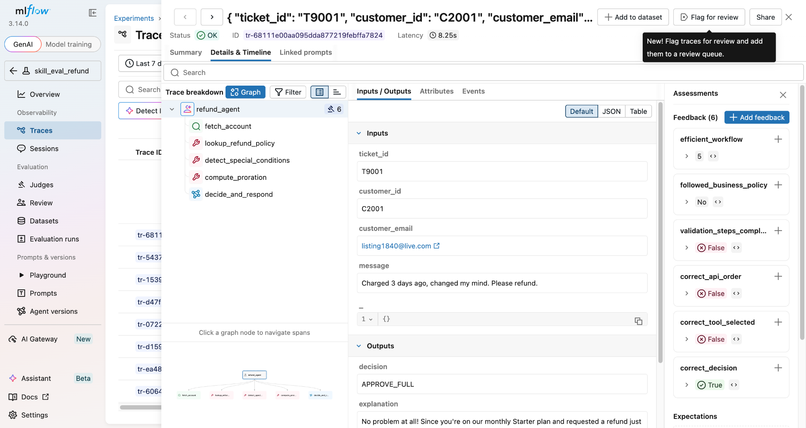
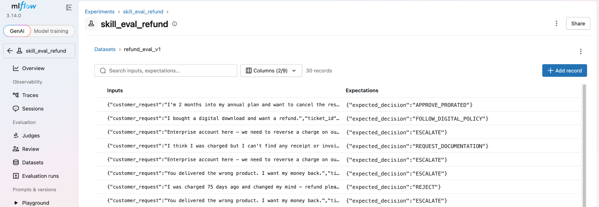
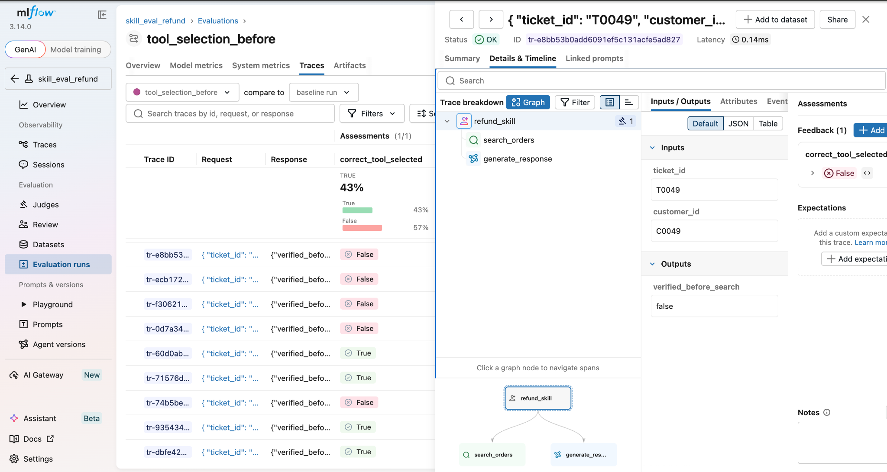
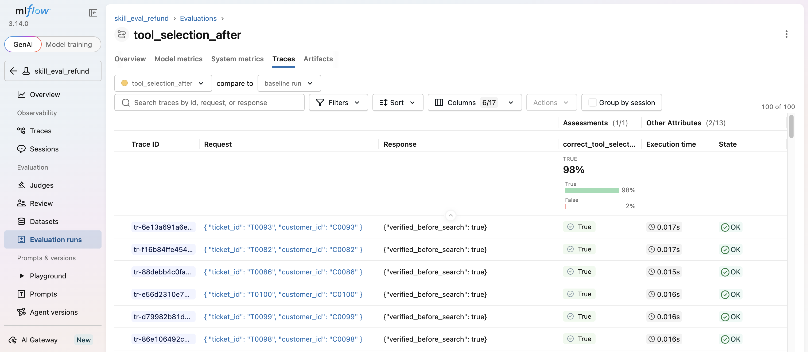

How to build measurable, testable, and continuously improving AI agent capabilities.

Agents are becoming increasingly capable of solving complex tasks by combining reasoning, tools, memory, and structured workflows. As these systems evolve, one pattern has emerged across frameworks such as LangGraph, OpenAI Agents SDK, Claude Code, CrewAI, Cortex, OpenClaw and Hermes: agents are built from reusable skills.

<!-- truncate -->

A skill encapsulates a specific capability, such as retrieving information from a knowledge base, generating SQL, validating invoices, planning multi-step tasks, or interacting with APIs. Rather than encoding all behavior in a single prompt, developers compose agents from these reusable building blocks.

While this modular approach makes agents easier to develop and maintain, it also introduces a new challenge:

How do you know whether a skill is actually improving?

Many teams still evaluate skills manually by running a few prompts and checking whether the responses "look good." That process doesn't scale, is difficult to reproduce, and often misses subtle regressions.

Instead, skills should be treated like software components: versioned, tested, measured, and continuously improved.

In this blog, we'll explore how MLflow enables evaluation-driven development for agent skills using traces, datasets, custom evaluators, and experiment tracking.

## What Is an Agent Skill?

A skill is a reusable capability that an agent can invoke to complete part of a task.

Examples include:

- Retrieving documents from a vector database
- Writing SQL queries
- Calling external APIs
- Validating receipts
- Planning execution steps
- Reviewing generated code

Rather than embedding all instructions inside a monolithic system prompt, developers create focused skills that can evolve independently.

For example, consider a customer support agent.

Instead of writing one large prompt containing every policy, we might define a reusable refund skill:

```yaml
name: refund-evaluation
description: Use this skill to evaluate whether a customer is eligible for a refund according to the applicable refund policy.
## Responsibilities
- Validate purchase date
- Verify order status
- Apply refund policy
- Escalate edge cases
- Explain decisions clearly
```

This skill can now be reused across multiple agents while remaining independently testable.

## The Problem: Skills Drift Over Time

Skills rarely stay static.

As production feedback arrives, developers continuously modify skills.

Version 1:

```yaml
name: refund-evaluation
description: Use this skill to evaluate whether a customer is eligible for a refund according to the applicable refund policy.
Validate receipts for refund.
```

Version 2:

```yaml
name: refund-evaluation
description: Use this skill to evaluate whether a customer is eligible for a refund according to the applicable refund policy.
• Ignore duplicate uploads
• Accept PDF receipts
• Reject blurry images
• Handle foreign currencies
```

The updated instructions appear better, but appearances can be misleading.

Perhaps duplicate detection improved while blurry receipt detection became less reliable.

Or maybe latency doubled because the skill now performs additional reasoning.

Without structured evaluation, these regressions often go unnoticed until users report them.

## Why Evaluating Final Answers Isn't Enough

Traditional LLM evaluation focuses on the final response:

Was the answer correct?

For agent skills, that's only part of the story.

Suppose a refund agent produces the correct answer, but skips customer identity verification before issuing a refund.

The outcome appears correct, but the process violates company policy.

Similarly, a retrieval skill might return the right answer while unnecessarily calling five external tools, increasing both latency and cost.

Skill evaluation should measure behaviors, not just outputs. This is where traces become essential. Traces capture each step the agent takes, making it possible to verify that the skill followed the intended workflow, selected the right tools, and complied with business policies.

Examples include:

- Was the correct tool selected?
- Were APIs called in the expected order?
- Did the agent follow business policies?
- Did the planner generate an efficient workflow?
- Were required validation steps completed?
- Did the skill cite retrieved evidence?



These behavioral metrics provide much richer insight into skill quality than answer accuracy alone.

## Building an Evaluation Dataset

Every skill should have a dedicated evaluation dataset representing realistic scenarios.

For our refund skill:

| Customer Request        | Expected Outcome      |
| ----------------------- | --------------------- |
| Refund after 5 days     | Approve               |
| Refund after 45 days    | Reject                |
| Wrong product delivered | Escalate              |
| Digital purchase        | Follow digital policy |
| Missing receipt         | Request documentation |

### Scorers

**1. Correctness: Output-based**

Compares the skill's final response against Expected Outcome (Using Expectations / Ground Truth). Doesn't look inside the trace just the answer.

```python
correctness = (decision == expected_outcome)

@scorer
def correctness(outputs, expectations) -> Feedback:
    """Final decision matches the dataset's expected decision (ground truth)."""
    decision = outputs.get("decision")
    expected = expectations.get("expected_decision")
    return Feedback(value=decision == expected,
                    rationale=f"decision={decision} vs expected={expected}")
```

**2. Policy_compliance: rule-based (partly trace-aware)**

Checks whether the skill honored the business rule for that scenario. It reads the Expected Outcome to know which rule applies, and often the trace to confirm the rule was followed.

- Digital purchase → response must be FOLLOW_DIGITAL_POLICY
- Missing receipt → response must be REQUEST_DOCUMENTATION (don't refund blind)

**3. Correct_tool_selection: Trace-based**

Ignores the final answer entirely. Reads the execution trace to confirm the expected tools ran, in the right order, before the response.

```python
correct_tool_selection = verify_customer ran AND search_order ran AND both happened before generate_response
```

Unlike benchmark datasets, evaluation datasets evolve with production.



Whenever users discover failure cases, add them to the dataset to prevent future regressions.

## Going Beyond Built-In Metrics

General-purpose metrics such as correctness are useful, but production systems often require domain-specific evaluation.

Suppose every refund must verify customer identity before accessing order history.

We can encode that expectation directly as a custom evaluator.

```python
from mlflow.genai import scorer

@scorer
def correct_tool_selection(outputs, trace: Trace) -> Feedback:
    """Expected tools ran, in order, before the refund decision (from trace spans)."""
    steps = _ordered_steps(trace)
    order = [s.name for s in steps]
    decide_spans = trace.search_spans(name="decide_and_respond")
    decide_start = decide_spans[0].start_time_ns if decide_spans else None
    called_before = [
        s.name for s in steps
        if s.name in EXPECTED_TOOLS and (decide_start is None or s.start_time_ns < decide_start)
    ]
    all_called = all(t in called_before for t in EXPECTED_TOOLS)
    right_order = called_before == EXPECTED_TOOLS
    decision = _decision(outputs, trace)
    verify_spans = trace.search_spans(name="verify_identity")
    verify_ok = True
    if decision in REFUND_DECISIONS and decide_start is not None:
        verify_ok = bool(verify_spans) and verify_spans[0].start_time_ns < decide_start \
            and bool(_obj(verify_spans[0].outputs).get("verified"))
    return Feedback(
        value=all_called and right_order and verify_ok,
        rationale=f"order={order}; all_called={all_called}; right_order={right_order}; verify_ok={verify_ok}",
    )
```

Now every evaluation run automatically checks whether identity verification occurred.

Other useful skill evaluators include:

- Tool selection accuracy
- API sequencing
- Citation completeness
- Planning quality
- Cost efficiency
- Safety compliance
- Hallucination detection
- Required approval steps
- Retry behavior after failures

These evaluators measure how the skill behaves—not merely what it outputs.

## Running Skill Evaluations with MLflow

#### Implementing run_agent

The predict_fn can wrap any agent implementation, regardless of the framework. Its job is simply to execute the skill for a single evaluation example and return the result in a structured format.

For example, if your refund skill is implemented as a Python function:

```python
def run_agent(customer_message, order_id=None):
    result = refund_agent.run(
        message=customer_message,
        order_id=order_id,
    )
    return {
        "response": result.response,
        "decision": result.decision,
        "tool_calls": result.tool_calls,
    }
```

Once the dataset exists, evaluating a skill becomes straightforward.

```python
import mlflow

results = mlflow.genai.evaluate(
    data=refund_dataset,
    predict_fn=run_agent,
    scorers=[
        correctness,
        policy_compliance,
        correct_tool_selection
    ]
)
```

Instead of manually inspecting dozens of conversations, MLflow automatically computes evaluation metrics across the entire dataset.

Now improvements become measurable.

## Using Traces to Understand Failures

Evaluation tells you that something failed.

Tracing tells you why.

Imagine your evaluation report shows:

| Metric                 | Score |
| ---------------------- | ----- |
| Correct Tool Selection | 43%   |



Opening the trace reveals:

User Request → Search Orders → Generate Response

Notice anything missing?

The workflow skipped:

Verify Customer Identity

The skill instructions never explicitly required identity verification before searching order history.

After updating the skill:

Always verify customer identity before accessing order data.

Re-running evaluation yields:

| Metric                 | Before | After |
| ---------------------- | ------ | ----- |
| Correct Tool Selection | 43%    | 98%   |



Small instruction change.

Large behavioral improvement.

## Why MLflow for Skill Evaluation

Evaluating skills requires more than a single benchmark metric. It demands an end-to-end workflow that captures execution, measures behavior, tracks experiments, and supports continuous improvement.

MLflow brings these capabilities together in one platform:

- Tracing captures how a skill executes.
- Evaluation measures outputs and behaviors using built-in and custom scorers.
- Experiment Tracking records every run for reproducibility and comparison.
- Datasets enable regression testing with representative scenarios.
- Prompt and Artifact Versioning helps teams manage the evolution of skills over time.

Together, these capabilities enable an evaluation-driven development process where every skill change is measurable, reproducible, and backed by data.

Reusable skills are quickly becoming the fundamental building blocks of modern AI agents. As organizations build larger agent ecosystems, the ability to evaluate and improve these skills systematically will become just as important as evaluating models themselves.

Rather than asking "Does the agent seem to work?", engineering teams should ask:

- Which skill failed?
- Why did it fail?
- Which version performs best?
- Did this change introduce regressions?
- Can we prove the improvement with data?

By combining tracing, datasets, custom evaluators, and experiment tracking, MLflow provides the foundation for answering these questions. Treating skills as measurable, versioned, and continuously improving components helps teams build more reliable, maintainable, and trustworthy AI agents.

If this is useful, give us a ⭐ on [GitHub](https://github.com/mlflow/mlflow).

### Related reading

- [Testing and Refining Claude Code Skills with MLflow](/blog/evaluating-skills-mlflow)
- [Ship LLM Agents Faster with Coding Assistants and MLflow Skills](/blog/self-improving-agent-loop)
- [Structuring AI Evaluation and Observability with MLflow: From Development to Production](/blog/structured-ai-eval)
