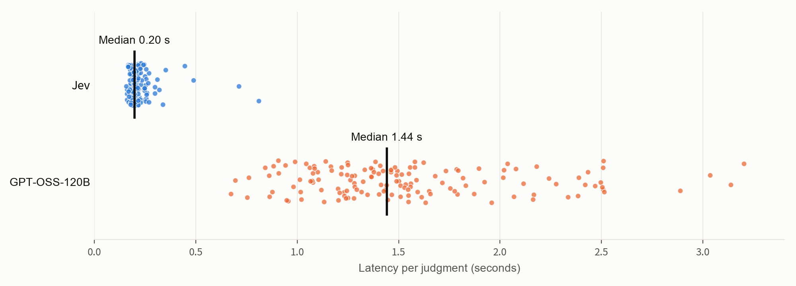

In [Part 1](/blog/jev-llm-judge/), we compared Jev with GPT, Claude, and DeepSeek as judges for MLflow QA answers. Jev matched all 30 human labels, with the lowest measured latency and estimated cost in that test. However, the test setup might have been too easy for frontier models, so we wanted to see whether it would still catch errors in answers that are harder to distinguish.

## Recap: What is Jev?

[Jev](https://typesafe.ai/blog/introducing-system-one-models-and-jev) is TypeSafe's model for structured decisions. We give it a question, the relevant documentation, and a candidate answer; it returns a probability that the answer is correct, but without a text unlike ordinal LLMs. This characteristics matches pretty well with the [LLM-as-a-judge](https://mlflow.org/llm-as-a-judge) use case, therefore, we measured its performance and efficiency with a small dataset in the previous blog, where Jev demonstrated compatible accuracy as frontier models with much less cost and latency.

## Challenging Jev with a harder test set

While the experiment shows that Jev is a solid candidate for LLM judge tasks, it is still too early to conclude that is simply better than frontier models. To collect more data points, we built a dataset of **72 hard answers** with more borderline answers, for example, an answer that uses the right API but explain it incorrectly. These hard samples are often the ones that are important to evaluate and catch before production.


In this experiment, we compared `typesafe/jev-1.13` against `gpt-oss-120b`. Both judges received the same correctness criterion, we asked whether each answer was factually and technically correct given a documentation excerpt. For Jev, a probability of at least 0.5 counted as “correct.” The incorrect answers included wrong API names, reversed source and target roles, missing permissions, and correct statements followed by a false qualification. For three questions, we also paraphrased the correct answers to check whether different wording would cause a rejection.

## Result

We ran the full dataset twice. Jev agreed with human labels on 64/72 answers in each run. GPT-OSS-120B agreed on all 72.

<a
  href={require("./judge-performance.png").default}
  target="_blank"
  rel="noopener noreferrer"
  title="Open chart at full size"
>
  
</a>

Jev scored 32/36 in each language in both runs. It accepted every correct answer, including the paraphrases, and caught errors such as a wrong retention period or a reversed yes/no conclusion. However, it misclassified **almost correct answers with one material error**. Here are three examples from the dataset where Jev incorrectly classified as "correct".

**A correct clause with its meaning reversed**

> Use `WHEN NOT MATCHED THEN INSERT`. It applies to target rows that have no matching source row.

The clause is right, but the explanation reverses the roles. It inserts source rows that have no match in the target

**A missing permission**

> `CREATE SECRET` and `USE SCHEMA` on `main.default` are sufficient.

For a user who does not own the schema, this omits the required `USE CATALOG` permission.

**A correct explanation followed by a wrong command**

> With deletion vectors enabled, DELETE does not immediately rewrite the files. The rows are physically removed later by running `VACUUM ... APPLY (PURGE)`.

The opening is correct, but the command is wrong. The purge operation uses `REORG TABLE ... APPLY (PURGE)`.

## Speed and cost

Jev's median latency was **0.20 seconds**, compared with **1.44 seconds** for GPT-OSS-120B: about seven times faster in this setup.



_Two runs, with 144 measurements per judge. Black lines mark the medians. Labels translated from the original chart._

Jev's estimated inference cost was **about $0.020 per 1,000 judgments**, excluding credit-purchase fees. GPT-OSS produced an average of 224 output tokens per judgment, including reasoning.

## Solution: Send uncertain judgments to another model

Based on the above result, Jev still has some gaps to classify hard samples. However, its cost/latency advantage is still appearling. How can we get that without compromising the judge quality? One solution is to use **possibility** from Jev output.

In the two benchmark runs, every false acceptance had a probability of roughly 0.5–0.8, while every correct answer scored at least 0.91. We calculated what would have happened if judgments in the **0.2–0.8 range** had been sent to GPT-OSS as a secondary judge. Less than 20% of judgements need this fallback, but it corrects all observed errors. This allows us to scale LLM judges into thousands of samples while taking advantage of more expensive models when needed.

| Run | Judgments sent to GPT-OSS | Agreement after routing |
| --- | ------------------------: | ----------------------: |
| 1   |                     12/72 |            72/72 (100%) |
| 2   |                     13/72 |            72/72 (100%) |

A similar approach is discussed in [JEV-as-a-Judge: Accept When Confident, Escalate When Unsure](https://arxiv.org/abs/2609.26550).

## Run Jev with `make_judge`

:::info Sneak peek: unreleased MLflow 3.17

The native `make_judge` integration below is coming soon in MLflow 3.17. The version support using Jev for built-in judges and custom judge through the `typesafe:/` model URI.

:::

Set `TYPESAFE_API_KEY` in your environment, then define the same correctness check as a boolean judge:

```python
import mlflow
from mlflow.genai.judges import make_judge

jev_correctness = make_judge(
    name="jev_correctness",
    model="typesafe:/jev-latest",
    instructions=(
        "Is the answer in {{ outputs }} factually and technically correct for "
        "the question and documentation in {{ inputs }}? Respect any version "
        "specified in the question. Mark it incorrect if any material claim "
        "or instruction is wrong."
    ),
    feedback_value_type=bool,
)

eval_data = [
    {
        "inputs": {
            "question": "What is the default retention period for VACUUM?",
            "context": "The default retention period for VACUUM is 7 days.",
        },
        "outputs": "The default retention period is 30 days.",
    }
]

result = mlflow.genai.evaluate(data=eval_data, scorers=[jev_correctness])
```

MLflow records Jev's true/false verdict as `jev_correctness` and its probability in the feedback metadata under `typesafe.probability`. Keep human labels separate from the inputs sent to the judge, then compare the verdicts with those labels to measure agreement.

## Try it on your answers

Jev was fast and inexpensive in this test, but its mistakes matter: an answer can sound right and still give a user the wrong command or incomplete permissions. Include those cases in your judge evaluation.

Start with your existing correctness criterion and a small labeled dataset. Run Jev alongside your current judge, inspect the false acceptances, and test any routing threshold on new examples. The [MLflow evaluation quickstart](https://mlflow.org/docs/latest/genai/eval-monitor/quickstart/) can help you set up the comparison.
