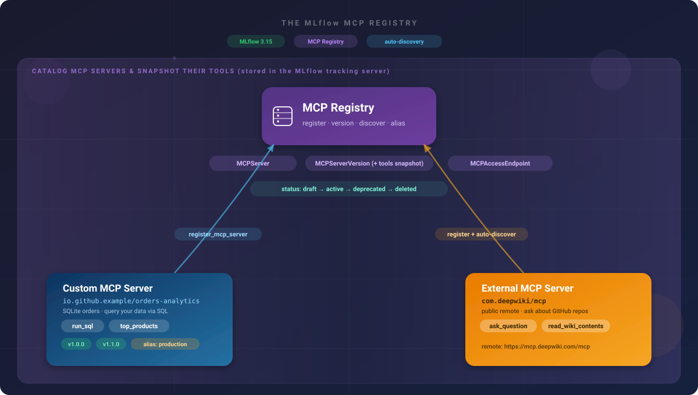

Register a custom MCP server and a public third-party one in a single governed catalog, let MLflow auto-discover their tools, then manage versions, aliases, and access endpoints -- and call a discovered tool straight from the endpoint the registry recorded.

<!-- truncate -->



As teams adopt the [Model Context Protocol (MCP)](https://modelcontextprotocol.io/), they end up with many servers -- some they build, many third-party. The **MLflow MCP Registry** (new in MLflow 3.15) is a catalog, backed by your MLflow tracking server, for registering those servers, versioning them, snapshotting their tool definitions via auto-discovery, aliasing versions (e.g. `production`), and recording access endpoints. It answers, in one place: which MCP servers exist, what tools do they offer, and where do I reach them?

The registry has three entities, each with its own identity and lifecycle:

| Entity              | What it is                                                                                        |
| ------------------- | ------------------------------------------------------------------------------------------------- |
| `MCPServer`         | The logical server, identified by a namespaced name like `io.github.org/slug`.                    |
| `MCPServerVersion`  | A semver'd version holding the `server.json`, a snapshot of the server's tools, and a status.     |
| `MCPAccessEndpoint` | A concrete URL + transport clients use to reach a running instance, pinned to a version or alias. |

A version moves through a status lifecycle: **`draft → active → deprecated → deleted`**.

:::tip[Prerequisites]

```bash
pip install "mlflow[mcp]>=3.15"
```

Start a tracking server on the MLflow 3.15 schema and leave it running -- the registry lives in the tracking store:

```bash
mlflow server --backend-store-uri sqlite:///mlflow.db --port 5000
```

:::

## What You'll Build

Point MLflow at your running server and confirm the version supports the registry. No experiment is needed -- registry entities live in the tracking store itself, not inside an experiment.

```python
import os
import sys
import mlflow
from packaging.version import Version

TRACKING_URI = "http://localhost:5000"
os.environ["MLFLOW_TRACKING_URI"] = TRACKING_URI
mlflow.set_tracking_uri(TRACKING_URI)

assert Version(mlflow.__version__) >= Version("3.15"), (
    f"The MCP Registry needs MLflow >= 3.15 (found {mlflow.__version__})."
)
print(f"MLflow {mlflow.__version__} -> {TRACKING_URI}")
# Example: MLflow 3.15.1 -> http://localhost:5000
```

### Add a Cleanup Helper to Keep the Recipe Re-Runnable

A server can't be deleted while it has an **active** version, and a version can't jump straight from `active` to `deleted`. To keep this recipe safely re-runnable, define a helper that deprecates each version, deletes it, then deletes the server.

```python
import asyncio
import nest_asyncio  # only needed to call asyncio.run() inside a notebook/REPL loop

from mlflow.genai import (
    register_mcp_server,
    get_mcp_server,
    get_mcp_server_version_by_alias,
    set_mcp_server_alias,
    set_mcp_server_tag,
    search_mcp_servers,
    search_mcp_server_versions,
    search_mcp_access_endpoints,
    update_mcp_server_version,
    delete_mcp_server_version,
    delete_mcp_server,
    refresh_mcp_server_version_tools,
)

nest_asyncio.apply()


def deregister_mcp_server(name: str) -> None:
    """Fully remove a server so the recipe is re-runnable. Every step is best-effort."""
    try:
        get_mcp_server(name)  # raises if the server doesn't exist yet
    except Exception:
        return
    for v in search_mcp_server_versions(name):
        try:
            update_mcp_server_version(name, v.version, status="deprecated")
        except Exception:
            pass
        try:
            delete_mcp_server_version(name, v.version)
        except Exception:
            pass
    try:
        delete_mcp_server(name)
    except Exception:
        pass
```

### Register a Custom MCP Server with Live Tool Auto-Discovery

The registry catalogs any MCP server via its `server.json` (name, version, and one or more `remotes`). When you register with `tools` left unset, MLflow performs **live auto-discovery**: it connects to the first `remotes[]` URL and snapshots the server's tool list into the `MCPServerVersion`.

To make discovery real, first stand up a custom server -- an **orders-analytics** tool, a common reason teams build a custom MCP server: letting an assistant query their data. It wraps a small in-memory SQLite orders table and exposes `run_sql(query)` and `top_products(limit)`. The server lives in `utils/orders_analytics_mcp.py`; here we launch it as a subprocess and wait for its port.

```python
import subprocess
import socket
import time
from pathlib import Path

# Must match HOST / PORT in utils/orders_analytics_mcp.py.
CUSTOM_HOST, CUSTOM_PORT = "127.0.0.1", 8123
CUSTOM_URL = f"http://{CUSTOM_HOST}:{CUSTOM_PORT}/mcp"

custom_proc = subprocess.Popen(
    [sys.executable, str(Path("utils/orders_analytics_mcp.py"))],
    stdout=subprocess.DEVNULL,
    stderr=subprocess.DEVNULL,
)


def wait_for_port(host, port, timeout=15):
    """Wait for a port to accept connections on a host."""
    deadline = time.time() + timeout
    while time.time() < deadline:
        with socket.socket() as s:
            s.settimeout(1)
            if s.connect_ex((host, port)) == 0:
                return True
        time.sleep(0.3)
    return False


assert wait_for_port(CUSTOM_HOST, CUSTOM_PORT), "custom MCP server did not start"
print(f"Custom MCP server listening at {CUSTOM_URL} (pid={custom_proc.pid})")
```

Register it. With `tools` left unset, MLflow auto-discovers them from `remotes[0]` at registration time, and `create_access_endpoints_from_remotes=True` records an access endpoint per remote so consumers can find it later. Reverse-DNS names are recommended for MCP servers.

```python
CUSTOM_NAME = "io.github.example/orders-analytics"

# Idempotent: remove any prior run's registration so this re-runs cleanly.
deregister_mcp_server(CUSTOM_NAME)

custom_server_json = {
    "name": CUSTOM_NAME,
    "version": "1.0.0",
    "description": "Orders analytics MCP server: query an orders table via SQL.",
    "remotes": [{"url": CUSTOM_URL, "type": "streamable-http"}],
}

custom_version = register_mcp_server(
    server_json=custom_server_json,
    status="active",
    create_access_endpoints_from_remotes=True,
)
print(f"Registered '{custom_version.name}' v{custom_version.version} "
      f"(status={custom_version.status})")
print(f"Auto-discovered tools: {[t.name for t in (custom_version.tools or [])]}")
# Example: Registered 'io.github.example/orders-analytics' v1.0.0 (status=active)
# Example: Auto-discovered tools: ['run_sql', 'top_products']

# Give the active version a friendly alias and a tag for governance.
set_mcp_server_alias(CUSTOM_NAME, "staging", custom_version.version)
set_mcp_server_tag(CUSTOM_NAME, "team", "mcp-genai-tutorials")

server = get_mcp_server(CUSTOM_NAME)
print(f"Alias 'staging' -> v{server.aliases.get('staging')}  |  Tags: {server.tags}")
# Example: Alias 'staging' -> v1.0.0  |  Tags: {'team': 'mcp-genai-tutorials'}
```

### From Registry Entry to a Live Tool Call (register → discover → use)

Registration recorded an access endpoint. A consumer can look that endpoint up in the registry and connect straight to it -- closing the loop from _register_ → _discover_ → _use_. Resolve the endpoint and call the `top_products` tool we discovered.

```python
from fastmcp import Client
from fastmcp.client.transports import StreamableHttpTransport

endpoint = search_mcp_access_endpoints(server_name=CUSTOM_NAME)[0]
print(f"Access endpoint: {endpoint.url} ({endpoint.transport_type})")


async def query_orders():
    async with Client(StreamableHttpTransport(endpoint.url)) as client:
        top = await client.call_tool("top_products", {"limit": 3})
        for row in top.data:
            print(f"  {row['product']:<28} ${row['revenue']:>8,.2f}  ({row['units']} units)")


asyncio.run(query_orders())
# Example:
# Access endpoint: http://127.0.0.1:8123/mcp (streamable-http)
#   Aurora Standing Desk         $1,920.00  (4 units)
#   Volt 27in Monitor            $1,860.00  (6 units)
#   Nimbus Office Chair          $1,100.00  (5 units)
```

### Register a Third-Party MCP Server (DeepWiki) by URL

Registering a third-party server is the same call -- you just point `remotes[]` at _their_ endpoint. Register **DeepWiki**, a public MCP server (no auth) that answers questions about GitHub repositories; live discovery snapshots its real tools. Custom MCP serves structured data, DeepWiki serves unstructured docs -- the kind of mixed fleet a registry is meant to catalog.

```python
DEEPWIKI_NAME = "com.deepwiki/mcp"
deregister_mcp_server(DEEPWIKI_NAME)

deepwiki_server_json = {
    "name": DEEPWIKI_NAME,
    "version": "1.0.0",
    "description": "DeepWiki public MCP server -- ask questions about GitHub repositories.",
    "remotes": [{"url": "https://mcp.deepwiki.com/mcp", "type": "streamable-http"}],
}

try:
    deepwiki_version = register_mcp_server(
        server_json=deepwiki_server_json,
        status="active",
        create_access_endpoints_from_remotes=True,
    )
    print(f"Registered '{deepwiki_version.name}' v{deepwiki_version.version}")
    print(f"Auto-discovered tools: {[t.name for t in (deepwiki_version.tools or [])]}")
    # Example: Auto-discovered tools: ['ask_question', 'read_wiki_contents', 'read_wiki_structure']
except Exception as e:
    print(f"Live discovery failed ({type(e).__name__}: {e}).")
    print("Register with an explicit `tools=[...]` list instead when a remote is offline or authed.")
```

### Call a Registered Server's Tools Programmatically or from an Assistant

There are two ways to use a registered server's tools -- the same two as for the MLflow MCP Server: call it programmatically, or wire it into your assistant.

**Programmatically** -- resolve the endpoint the registry recorded for DeepWiki, connect, and call its `ask_question` tool. This is a live call to a remote LLM-backed service, so it takes a few seconds; it's wrapped so a network hiccup won't break the run.

```python
deepwiki_endpoint = search_mcp_access_endpoints(server_name=DEEPWIKI_NAME)[0]


async def ask_deepwiki(repo: str, question: str) -> str:
    async with Client(StreamableHttpTransport(deepwiki_endpoint.url)) as client:
        result = await client.call_tool("ask_question", {"repoName": repo, "question": question})
        return result.content[0].text if result.content else str(result.data)


try:
    answer = asyncio.run(ask_deepwiki(
        "modelcontextprotocol/python-sdk",
        "What transport types does the MCP server support?",
    ))
    print(answer[:400])
    # Example: The MCP server supports three primary transport types: `stdio`,
    # `sse`, and `streamable-http`. ...
except Exception as e:
    print(f"(DeepWiki call failed -- the remote may be slow/unavailable: {type(e).__name__}: {e})")
```

**From your assistant** -- register the server once and its tools become available. DeepWiki is a remote HTTP MCP server, so (unlike the MLflow stdio server) you register it **by URL** -- no subprocess, no `command`.

```bash
# Claude Code / Claude Desktop
claude mcp add --transport http deepwiki https://mcp.deepwiki.com/mcp
```

```json
// Claude project-level .mcp.json (VS Code uses the same shape under a "servers" key)
{
  "mcpServers": {
    "deepwiki": { "type": "http", "url": "https://mcp.deepwiki.com/mcp" }
  }
}
```

Then just ask in natural language, and the assistant calls `ask_question` for you:

- _"Using DeepWiki, what transport types does the modelcontextprotocol/python-sdk server support?"_
- _"Ask DeepWiki how authentication works in the openai/openai-python repo."_

### Version Servers and Promote with the `production` Alias

A registry's value shows up when servers change. Register a new version of the custom server, then point the `production` alias to it -- consumers that resolve `production` follow along without changing their config.

```python
# Register v1.1.0 of the same server (same remote -> same tools re-discovered).
v11 = register_mcp_server(
    server_json={**custom_server_json, "version": "1.1.0"},
    status="active",
)

# Promote it: point the 'production' alias at 1.1.0.
set_mcp_server_alias(CUSTOM_NAME, "production", "1.1.0")
promoted = get_mcp_server_version_by_alias(CUSTOM_NAME, "production").version
print(f"Alias 'production' now -> v{promoted}")
# Example: Alias 'production' now -> v1.1.0
```

Browse the catalog -- servers, a server's versions with their tool snapshots, and access endpoints -- and do a dry-run tool refresh that shows what _would_ be snapshotted without saving.

```python
print("Registered MCP servers:")
for s in search_mcp_servers():
    print(f"  - {s.name} (status={s.status}, latest=v{s.latest_version})")

print(f"\nVersions of {CUSTOM_NAME}:")
for v in search_mcp_server_versions(CUSTOM_NAME):
    print(f"  - v{v.version}  status={v.status}  tools={[t.name for t in (v.tools or [])]}")

print(f"\nAccess endpoints for {CUSTOM_NAME}:")
for ep in search_mcp_access_endpoints(server_name=CUSTOM_NAME):
    print(f"  - {ep.url} ({ep.transport_type})")

refreshed = refresh_mcp_server_version_tools(CUSTOM_NAME, "1.1.0", dry_run=True)
print(f"\nrefresh v1.1.0 (dry_run) would snapshot: {[t.name for t in (refreshed.tools or [])]}")
# Example:
# Registered MCP servers:
#   - com.deepwiki/mcp (status=active, latest=v1.0.0)
#   - io.github.example/orders-analytics (status=active, latest=v1.1.0)
# Versions of io.github.example/orders-analytics:
#   - v1.0.0  status=active  tools=['run_sql', 'top_products']
#   - v1.1.0  status=active  tools=['run_sql', 'top_products']
```

Open the tracking server at **http://localhost:5000** and select the **MCP Registry** section in the sidebar to browse both servers in the UI -- drill into a version to inspect its `server.json` and tool snapshot, and view its aliases and access endpoints.

### Remove Registry Entries and Stop the Server

Remove the demo registrations and stop the local custom server.

```python
for name in [CUSTOM_NAME, DEEPWIKI_NAME]:
    deregister_mcp_server(name)  # deprecate -> delete versions -> delete server
    print(f"Removed registry entry: {name}")

try:
    custom_proc.terminate()
    custom_proc.wait(timeout=5)
    print(f"Stopped custom MCP server (pid={custom_proc.pid})")
except Exception as e:
    print(f"(custom server already stopped: {e})")
```

## Results

After completing this cookbook, you have:

1. **A custom server in the catalog** -- registered orders-analytics with live tool auto-discovery, an alias, and a governance tag, then resolved its access endpoint and called a discovered tool (register → discover → use).
2. **A third-party server, same call** -- registered DeepWiki by pointing `remotes[]` at its endpoint, then queried it through the recorded endpoint with `ask_question`, with a fallback for offline or authenticated remotes.
3. **Versions and aliases** -- added v1.1.0 and re-pointed the `production` alias so consumers follow along without config changes.
4. **A browsable inventory** -- listed servers, versions with tool snapshots, and access endpoints from code and in the MLflow UI, plus a dry-run tool refresh.

## Next Steps

- [MLflow MCP Server: Debug, Analyze, and Annotate Traces from Any AI Assistant](/cookbook/mlflow-mcp-server) -- Point an AI assistant at MLflow's built-in MCP tools to observe and act on your traces.
- [MLflow MCP Registry docs](https://mlflow.org/docs/latest/genai/mcp-registry/) -- Full entity reference and API surface.
- [MLflow MCP Server docs](https://mlflow.org/docs/latest/genai/mcp/) -- The other half of MLflow's MCP story.
